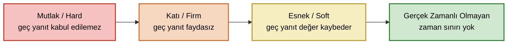

Akşam dizi izlerken görüntü yarım saniye donar, sonra kendine gelir. Sinir olursunuz, geçer. Aynı yarım saniye, bir kaza anında hava yastığını ateşleyecek sinyalin gecikmesi olduğunda ise ortada sinir değil, bir trajedi vardır.

İki olayda da sistem geç kaldı; ama birinde bedeli bir homurtu, diğerinde bir hayat. Gerçek zamanlı sistemler (real-time systems) kavramı tam da bu farkın üzerine kuruludur. İşin teknik tanımı da bunu söyler: gerçek zamanlılık, bir sistemin **her bağımsız işlevi için tanımlanmış zaman sınırına uyma kabiliyetidir.** Bir fonksiyonu doğru yerine getirmek kadar, onu istenen zaman çerçevesinde yerine getirmek de gerekir; gerçek zamanlılık bu ikincisini dert edinir. Geç gelen doğru yanıt çoğu zaman yanlış yanıttır.

<!-- truncate -->

## Gerçek Zamanlı, Hızlı Demek Değil

Önce en sık yapılan hatayı dağıtalım: gerçek zamanlı sistem; hızlı, çok hızlı, inanılmaz hızlı sistem demek **değildir.** Saniyede milyarlarca işlem yapan bir sunucu gerçek zamanlı olmayabilir; saniyede yüz işlem yapan ufak bir mikrodenetleyici kusursuz biçimde gerçek zamanlı olabilir.

Fark hızda değil, **determinizmde** (öngörülebilirlik). Bir durum ve giriş kümesine karşı sistemin doğru yanıtı doğru zaman çerçevesi içinde üretmesi ne kadar öngörülebilirse, sistem o kadar deterministiktir. Buradaki anahtar, ortalama değil **en kötü durumdur:** bir işlem çoğu zaman 1 ms'de bitip nadiren 100 ms'ye çıkıyorsa, ortalaması ne kadar iyi olursa olsun o sistem güvenilmezdir. Çünkü sizi vuran şey ortalama değil, o ender görülen en kötü andır.

Üç kavram işin sözlüğünü oluşturur:

- **Zaman sınırı** (*deadline*): İşin tamamlanmış olması gereken an.
- **Gecikme** (*latency*): Bir olay ile sistemin ona verdiği yanıt arasındaki süre.
- **Seğirme** (*jitter*): Bu gecikmenin ölçümden ölçüme ne kadar oynadığı. Her döngüde tam 10 ms'de yanıt veren bir sistem iyidir; bazen 8 bazen 14 ms diyen sistem kötüdür. Kontrol döngülerinde seğirme çoğu zaman ham hızdan daha kıymetlidir.

Bir sistem bu öngörülebilirliği ne kadar çok talep ediyorsa, aşağıdaki sınıflandırmada o kadar katı uca düşer.

## Sınıflar: Mutlak, Katı, Esnek, Gerçek Zamanlı Olmayan

Sınıfları birbirinden ayıran soru tektir: bir yanıt tanımlı zamandan **sonra** gelirse ne olur? Cevap, hem sistemin gerçek zamanlılık sınıfını hem de ondan beklenen determinizm seviyesini belirler.

Soldan sağa zaman sınırının sertliği azalır; ters yönde, sağdan sola talep edilen **determinizm seviyesi** artar. En yüksek öngörülebilirlik en solda, mutlak uçta gerekir.

### Mutlak (Hard) Gerçek Zamanlı

En tavizsiz uç. Yanıtların hep tanımlı zamandan önce gelmesi gerekir; herhangi bir yanıtın geç gelmesi kabul edilemez ve bütün sistemi başarısız kılar. Burada "geç gelen doğru yanıt" yalnızca yararsız değil, tehlikelidir. En yüksek determinizm bu uçta talep edilir.

Tipik örnekler: otomotiv güvenlik sistemleri (ABS, hava yastığı, ESP), yaşam destek amaçlı tıbbi cihazlar (kalp pili, solunum destek sistemleri) ve insansız hava aracı (İHA) otopilotu. Hava yastığı milisaniyeler içinde açılmazsa hiç açılmamış sayılır.

### Katı (Firm) Gerçek Zamanlı

Bir adım gevşemiştir. Yanıt yalnızca nadiren tanımlı zamandan sonra gelebilir. Geç gelen yanıt artık faydasızdır, atılır; ama bu sistemi yıkmaz, etkisi hizmet kalitesinin düşmesidir. Mutlak uçtan farkı, gecikmiş yanıtın bedelinin sıfır olması, negatif olmamasıdır.

Tipik örnekler: insansız kara aracı otopilotu, insansız seri üretim tezgâhları ve robotik otomasyon. Aynı otopilotun havada mutlak, karada katı olması anlamlıdır: karadaki araç durdurulabilir, geç gelen bir komutun bedeli genellikle ölümcül değildir.

### Esnek (Soft) Gerçek Zamanlı

Burada zaman sınırı keskin bir uçurum değil, yumuşak bir yokuştur. Yanıtların gecikmesi daha sık görülür; geç gelen yanıt hâlâ işe yarar, ama tanımlı zamandan uzaklaştıkça faydası azalır. Etkisi yine hizmet kalitesinin düşmesidir.

Tipik örnekler: sesli/görüntülü bilgi ve eğlence akış sistemleri (TV, radyo, video oyunları), iletişim sistemleri (telefon, telekonferans, görüntülü görüşme) ve konfora dönük ev otomasyonu. Bir görüntülü görüşmede karenin biraz geç gelmesi rahatsız edicidir ama yıkıcı değildir.

### Gerçek Zamanlı Olmayan (Non-Real-Time)

En gevşek uç. Yanıtlar için tanımlı bir zaman yoktur; yanıt ne zaman gelirse gelsin faydalıdır ve sistemin hizmet kalitesi yanıt sürelerinden etkilenmez.

Tipik örnekler: ödeme sistemleri (POS cihazları), endüstriyel otomasyon izleme sistemleri ve yığın (*batch*) işlem sistemleri (rapor/veri/kayıt üretimi, çevrim dışı sinyal analizi). Bunların mühendislik anlamında tanımlı bir zaman sınırı yoktur.

### Hepsi Bir Arada

| Sınıf | Geç yanıt gelirse | Tipik örnek |
|---|---|---|
| **Mutlak (Hard)** | Kabul edilemez; bütün sistem başarısız olur | ABS, hava yastığı, ESP; kalp pili, solunum desteği; İHA otopilotu |
| **Katı (Firm)** | Yanıt faydasız olur (atılır); hizmet kalitesi düşer | İnsansız kara aracı otopilotu; robotik üretim ve otomasyon |
| **Esnek (Soft)** | Yanıtın faydası geciktikçe azalır; hizmet kalitesi düşer | TV/radyo/video akışı, oyunlar; telefon, telekonferans; ev otomasyonu |
| **Gerçek Zamanlı Olmayan** | Önemsiz; zaman sınırı tanımlı değil | POS/ödeme; endüstriyel izleme; yığın raporlama, sinyal analizi |

Önemli bir nokta: bu sınıflar koca bir cihazı bütün olarak değil, sistemin her **bağımsız işlevini** ayrı ayrı etiketler. Aynı İHA'nın içinde uçuş kontrolü mutlak (hard), telemetri akışı esnek (soft), uçuş sonrası kayıt indirme ise gerçek zamanlı olmayan bir işlev olabilir. Doğru soru "bu sistem hangi sınıf?" değil, "bu *işlevin* zaman sınırı kaçarsa ne olur?"dur.

## Garantiyi Nasıl Veriyoruz?

Madem hız değil, bir işlevi gerçek zamanlı yapan ne? Tek kelimeyle **garanti**: en kötü senaryoda bile zaman sınırına uyacağını önceden kanıtlayabilmek. Bu birkaç araca dayanır.

**WCET** (en kötü durum yürütme süresi, *worst-case execution time*). Mühendis ortalamayla değil bu en kötü değerle çalışır; çünkü garanti ancak en kötü duruma göre verilebilir. Bu yüzden önbellek (*cache*) ve dallanma tahmini gibi "ortalamayı iyileştiren ama en kötü durumu öngörülemez kılan" mekanizmalar gerçek zamanlı tasarımda göze batar. Performans burada yalnızca fonksiyonel olmayan bir gereksinim (*non-functional requirement*) değil, doğruluğun ayrılmaz bir parçasıdır.

**RTOS.** Masaüstü Linux ya da Windows verimi ve adilliği önceler; bir görevin tam olarak ne zaman çalışacağını garanti etmez. Bir gerçek zamanlı işletim sistemi (real-time operating system, RTOS) — FreeRTOS, VxWorks, QNX, Zephyr ya da `PREEMPT_RT` özellikli Linux (uzun yıllar ayrı bir yama setiydi; Linux 6.12'den beri ana akım çekirdeğin bir parçası) — ise öngörülebilirliği öne koyar: en yüksek öncelikli görevin sınırlı ve bilinen bir süre içinde işlemciye kavuşacağını taahhüt eder. RTOS'un emniyet-kritik aviyonik projelerdeki yeri için kitaptaki [Gerçek Zamanlı İşletim Sistemleri](pathname:///kitap/ozel-konular/gercek-zamanli-isletim-sistemleri) bölümüne, sertifikasyon gözüyle dikkat edilecek noktalar için de [Ek B'deki endişe alanları listesine](pathname:///kitap/ekler/ek-b-rtos-endise-alanlari) bakabilirsiniz.

**Zamanlama.** Görevlere öncelik verilir; öncelikli bir görev hazır olunca, çalışan düşük öncelikli görev anında durdurulur (*preemption*). Hangi görevin ne zaman çalışacağına karar veren kurala zamanlama algoritması (*scheduling algorithm*) denir. İki klasiği: RMS (*Rate-Monotonic Scheduling*), daha sık tekrarlanan görevi daha öncelikli sayar; EDF (*Earliest Deadline First*), zaman sınırı en yakın olanı önce çalıştırır. Bu algoritmaların matematiksel "zamanlanabilirlik" ispatları başlı başına bir konudur.

### Mars'taki Hata: Öncelik Tersinmesi

Bu mekanizmaların ne kadar ince olduğunu en iyi anlatan hikâye, NASA'nın 1997'de Mars'a indirdiği Pathfinder aracından gelir. Araç yüzeye indikten birkaç gün sonra, meteoroloji verisi toplamaya başlamasının hemen ardından bilgisayarı tekrar tekrar yeniden başlar; milyonlarca kilometre öteden ayıklanması gereken bir kâbus.

Suçlu, gerçek zamanlı sistemlerin meşhur tuzağı **öncelik tersinmesidir** (*priority inversion*). Yüksek öncelikli bir görev, düşük öncelikli bir görevin tuttuğu paylaşılan bir kaynağı bekler. Tam o sırada araya giren orta öncelikli ve uzun süren bir görev, düşük öncelikli görevin çalışmasını engeller. Sonuçta yüksek öncelikli görev, kendisinden önemsiz bir göreve dolaylı yoldan takılıp kalır; öncelikler sanki tersine dönmüştür. Çözüm öncelik miras almadır (*priority inheritance*): paylaşılan kaynağı tutan düşük öncelikli görev, onu bırakana dek geçici olarak yüksek önceliğe terfi ettirilir. Pathfinder ekibi bu özelliği uzaktan etkinleştirip aracı kurtardı.

Pathfinder'ın hatırlattığı şey şu: gerçek zamanlı sistemlerde hatalar çoğu zaman bileşenlerin içinde değil, [paylaştıkları kaynaklarda ve aralarındaki etkileşimde](pathname:///kitap/do178c-ile-gelistirme/yazilim-tasarimi) saklanır; bağlaşımı (coupling) düşük tutma öğüdünün gerçek zamanlı dünyadaki karşılığı budur.

## Tek Eksen Değil

Mutlak/katı/esnek ayrımı sistemleri tek bir eksende dizer: zaman sınırı kaçarsa ne olur? Oysa gerçek zamanlı sistemler başka eksenlerde de ayrışır. Görevler saatin yönettiği önceden belirlenmiş bir çizelgeye göre mi tetikleniyor (zaman tetiklemeli, *time-triggered*), yoksa dış olaylar geldikçe mi (olay tetiklemeli, *event-triggered*)? Emniyet-kritik tasarım, öngörülebilirlik uğruna çoğu zaman ilkini seçer. Garanti tek bir bilgisayarda mı kalıyor, yoksa ağ üzerinden mi taşınıyor? Sıradan Ethernet "elinden geldiğince" (*best-effort*) çalıştığından, yani her paketi taşıdığı hâlde zamanında teslimi garanti etmediğinden, otomotivde CAN ve FlexRay, aviyonikte [AFDX/ARINC 664](2023-08-23-afdx-nedir.md), yeni sistemlerde TSN gibi gerçek zamanlı ağlar bu yükü üstlenir. Bir de modern eğilim: farklı kritiklikteki işlevleri aynı donanımda koşturmak (*mixed-criticality*). Aviyonikte bunun çözümü ARINC 653'ün getirdiği [zaman ve uzay bölümlemesidir](pathname:///kitap/ozel-konular/yazilim-bolumlemesi); önemsiz bir işlevdeki hata, hayati komşusuna sıçrayamasın diye. Bu, emniyet-kritik yazılım disiplininin gerçek zamanlılıkla buluştuğu noktadır.

## Sonuç

İyi mühendis bir işlevle karşılaştığında "bunu ne kadar hızlı yaparım?" diye değil, önce şunu sorar: bunun tanımlı bir zaman sınırı var mı, kaçırırsam ne olur? Felaket mi (mutlak/hard), faydasız bir yanıt mı (katı/firm), geciktikçe azalan bir fayda mı (esnek/soft), yoksa hiçbir şey mi (gerçek zamanlı olmayan)? Cevap; işletim sistemini, zamanlamayı, ağı ve gereken titizliği belirler.

Bir uyarı da yerinde olur: günlük dilde "real-time analytics", "canlı pano", "anlık bildirim" diye geçen şeylerin neredeyse tamamı, bu mühendislik anlamıyla en fazla esnek (soft) düzeydedir; birkaç saniyelik gecikme kimseyi incitmez. Gerçek bir mutlak (hard) sistemde ise milisaniyeler sayılır ve zaman sınırını kaçırmanın bedeli ölçülebilir bir felakettir. Sonuçta gerçek zamanlılığı belirleyen şey, sistemin iyi günlerde ne kadar hızlı olduğu değil, en kötü gününde bile sözünü tutacağına dair verebildiği garantidir.

## Kaynaklar

- C. L. Liu, James W. Layland — "Scheduling Algorithms for Multiprogramming in a Hard-Real-Time Environment," *Journal of the ACM*, vol. 20, no. 1, 1973. DOI: 10.1145/321738.321743.
- Giorgio C. Buttazzo — *Hard Real-Time Computing Systems: Predictable Scheduling Algorithms and Applications* (Springer).
- Hermann Kopetz — *Real-Time Systems: Design Principles for Distributed Embedded Applications* (Springer).
- Mike Jones — ["What Really Happened on Mars?"](https://www.cs.cornell.edu/courses/cs614/1999sp/papers/pathfinder.html) (Mars Pathfinder öncelik tersinmesi olayının, Wind River CTO'su David Wilner'ın bir konuşmasına dayanan anlatımı).
- ARINC 653 — *Avionics Application Software Standard Interface* (zaman ve uzay bölümlemesi); genel bakış: [ARINC 653 (Wikipedia)](https://en.wikipedia.org/wiki/ARINC_653).
- The Linux Foundation — [Real-Time Linux (`PREEMPT_RT`)](https://wiki.linuxfoundation.org/realtime/start).
