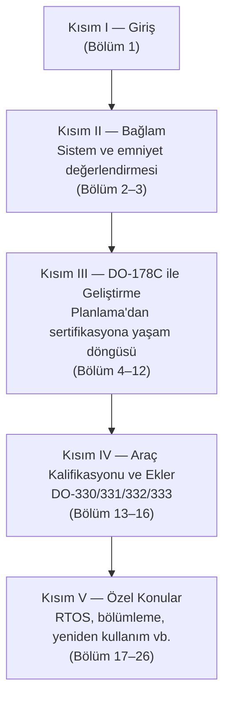

# 1. Giriş ve Genel Bakış

Bu kitap, aviyonik yazılımın yalnızca koddan ibaret olmadığını; gereksinim, tasarım,
doğrulama ve sertifikasyon kanıtlarından oluşan bütüncül bir çalışma olduğunu anlatır.
Bu giriş bölümünde hedef, okuyucuya kitapta kullanılan dilin ve yaklaşımın kısa bir
haritasını vermektir.

Aviyonik ortamda yazılım geliştirmek, sıradan bir ürün yazılımından farklı olarak,
emniyet hedefleriyle, donanım sınırlarıyla ve sertifikasyon beklentileriyle iç içe
çalışmayı gerektirir. Dolayısıyla bir proje, yalnızca işlev üreten bir uygulama değil;
aynı zamanda güvenilir, izlenebilir ve denetlenebilir bir süreç üretmek zorundadır.

## Emniyet-kritik yazılım nedir?

Bir yazılımın "emniyet-kritik" sayılması, kodun karmaşıklığıyla değil, **hatalı
davranışının sonuçlarıyla** ilgilidir. Yazılımın beklenmedik davranışı; uçağın,
mürettebatın, yolcuların veya yerdeki insanların emniyetini etkileyebiliyorsa, o
yazılım emniyet-kritiktir. Uçuş kontrol yazılımı bunun en bilinen örneğidir; ancak
motor kontrolü, frenleme, gösterge sistemleri, uyarı üretimi ve seyrüsefer gibi pek
çok işlev de aynı sınıfa girer.

Burada kritik olan iki gözlem vardır:

- **Kritiklik dereceli bir kavramdır.** Her aviyonik yazılım aynı ölçüde kritik
  değildir. Bir kabin eğlence uygulamasının hatası ile bir uçuş kontrol kanununun
  hatası aynı sonucu doğurmaz. Bu derecelendirme, ilerleyen bölümlerde ele alınacak
  yazılım seviyeleri (software levels) ile resmîleştirilir.
- **Kritiklik yazılımın kendisinden değil, sistemden gelir.** Aynı kod parçası, bir
  sistemde zararsızken başka bir sistemde tehlikeli olabilir. Bu yüzden yazılımın
  kritikliği, sistem emniyet değerlendirmesinin (system safety assessment) çıktısı
  olarak belirlenir; yazılım ekibinin kendi başına verdiği bir karar değildir.

## Emniyet odağı neden önemlidir?

Yazılım, mekanik veya elektronik bileşenlerden farklı bir hata karakterine sahiptir.
Bir yapısal parça yorulur, aşınır ve istatistiksel olarak öngörülebilir biçimde
bozulur. Yazılım ise **aşınmaz**; hataları üretim sırasında değil, geliştirme
sırasında içine yerleşir ve belirli bir girdi/durum bileşimi oluşana kadar sessizce
bekler. Bu nedenle:

- Yazılım hataları **sistematiktir**: aynı koşullar oluştuğunda hata her seferinde
  tekrar eder; yedekli iki kanalda aynı yazılım koşuyorsa, ikisi de aynı anda
  yanılabilir.
- Yazılıma donanımdaki gibi anlamlı bir **arıza olasılığı** atanamaz. "Bu kodun
  saatte 10⁻⁹ olasılıkla hata yapması" ifadesi ölçülebilir bir büyüklük değildir.
- Bu yüzden emniyet, test edilen son ürüne değil, **ürünü ortaya çıkaran sürece**
  güvence bağlanarak sağlanır. DO-178C'nin özü budur: disiplinli bir süreç ve bu
  sürecin her adımını gösteren nesnel kanıtlar.

Yazılımın sistemlerdeki payı her yıl artmaktadır; daha fazla işlev donanımdan
yazılıma taşınmakta, yazılım boyutları büyümektedir. Aynı dönemde takvim ve bütçe
baskısı da artar. Emniyet odağı, tam da bu baskı altında ilk feda edilen şey olma
eğilimindedir — bu kitabın ısrarla süreç ve kanıt vurgusu yapmasının nedeni budur.

## Bu kitap ne anlatır?

Kitap, DO-178C ekseninde aşağıdaki sorulara yanıt verir:

- Yazılım neden ayrı bir emniyet incelemesi ister?
- Gereksinimler nasıl yazılmalı ve izlenmeli?
- Tasarım, kod ve test birbirine nasıl bağlanmalı?
- Hangi iş ürünleri sertifikasyon kanıtı sayılır?
- Araçlar, modeller ve özel teknikler hangi durumlarda ek değerlendirme ister?

Bu soruların her biri tek başına teknik gibi görünse de aslında süreç tasarımı,
organizasyon, iletişim ve kalite kültürüyle doğrudan ilişkilidir.

### Önemli uyarılar

Kitabı okurken şu sınırlar akılda tutulmalıdır:

- **Bu kitap bir standart metni değildir.** DO-178C ve ilgili dokümanların yerine
  geçmez; onların mantığını, amacını ve pratikte nasıl uygulandığını kendi
  cümleleriyle anlatır. Projede resmî dayanak her zaman standardın kendisi ve
  otoriteyle yapılan anlaşmalardır.
- **Her proje farklıdır.** Burada verilen öneriler yaygın ve denenmiş yaklaşımlardır;
  ancak sertifikasyon otoritesiyle mutabakata varılmış proje planları her zaman
  önceliklidir.
- **"Uyum" tek başına amaç değildir.** Hedef, gerçekten emniyetli yazılım üretmektir.
  Süreç kutucuklarını doldurup emniyeti kaçırmak mümkündür; kitap bu tuzaklara özel
  olarak dikkat çeker.

## Kitabın yapısı

Kitap beş kısımdan oluşur ve kısımlar birbirinin üzerine inşa edilir:

- **Kısım II**, yazılımın içine yerleştiği sistem ve emniyet çerçevesini kurar:
  yazılım tek başına değil, bir sistemin parçası olarak geliştirilir.
- **Kısım III**, DO-178C'nin yaşam döngüsü süreçlerini sırasıyla işler: planlama,
  gereksinim, tasarım, kodlama ve entegrasyon, doğrulama, konfigürasyon yönetimi,
  kalite güvencesi ve sertifikasyon irtibatı.
- **Kısım IV**, araç kalifikasyonunu (tool qualification) ve DO-178C'nin teknoloji
  eklerini (model tabanlı geliştirme, nesne yönelimli teknoloji, biçimsel yöntemler)
  tanıtır.
- **Kısım V**, sahada sık karşılaşılan özel konuları toplar: kapsanmayan kodlar,
  sahada yüklenebilir yazılım, gerçek zamanlı işletim sistemleri, yazılım
  bölümlemesi, konfigürasyon verisi, yeniden kullanım, tersine mühendislik ve dış
  kaynak kullanımı.

## Okuyucu için yol haritası

Kitabı şu sırayla okumak en verimli yaklaşımdır:

1. önce sistem bağlamını,
2. sonra emniyet değerlendirmesini,
3. ardından DO-178C süreçlerini,
4. daha sonra araç kalifikasyonu ve özel konuları,
5. sonunda da ekleri ve kaynakları.

Bu sıra, "ne üretilecek?" sorusunu "neden bu üretim gerekir?" sorusuyla birlikte ele
almayı kolaylaştırır. Belirli bir konuya (örneğin yapısal kapsam analizine veya araç
kalifikasyonuna) ihtiyacı olan okuyucu, Kısım II'deki bağlamı edindikten sonra ilgili
bölüme doğrudan da gidebilir.

## Neden bu kadar vurgu var?

Çünkü emniyet-kritik yazılımda bir hata, yalnızca işlevsel bir sorun değildir; uçuş
fazını, bakım prosedürünü veya insan kararını etkileyebilir. Bu yüzden kitabın dili
özellikle üç kavrama tekrar tekrar döner:

- **izlenebilirlik** (traceability): bir iş ürününün kökenini ve etkisini
  gösterebilme,
- **doğrulanabilirlik**: beklenen davranışın kanıtlanabilir olması,
- **denetlenebilirlik**: sürecin dış gözlemci tarafından takip edilebilmesi.

Bu üç nitelik, sertifikasyon otoritesinin sorduğu tek bir sorunun farklı yüzleridir:
*"Bu yazılımın amaçlanan işlevini emniyetle yerine getirdiğini bana nasıl
gösterirsiniz?"* Kitap boyunca her süreç, her iş ürünü ve her analiz bu soruya verilen
yanıtın bir parçası olarak okunmalıdır.

## Bu bölümden akılda kalması gerekenler

- Emniyet-kritiklik koddan değil, hatanın sistem düzeyindeki sonucundan gelir ve
  derecelidir.
- Yazılım hataları sistematiktir; güvence, son ürünü test etmekle değil, süreci
  disipline edip kanıt üretmekle sağlanır.
- Bu kitap standardın yerine geçmez; DO-178C'nin mantığını ve pratiğini açıklar.
- Sonraki bölümleri okurken her zaman "hangi kanıt isteniyor?" sorusu sorulmalıdır.
