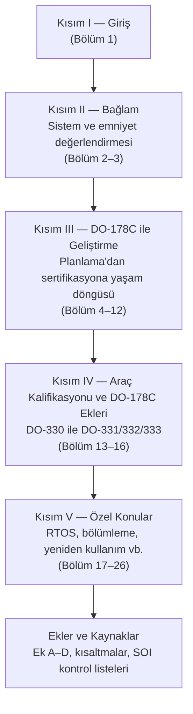

# 1. Giriş ve Genel Bakış

Bu kitap, aviyonik yazılımın yalnızca koddan ibaret olmadığını; gereksinim, tasarım,
doğrulama ve sertifikasyon kanıtlarından oluşan bütüncül bir çalışma olduğunu anlatır.
Bu giriş bölümü, emniyet-kritik yazılımın ne olduğunu, DO-178C'nin sertifikasyondaki
yerini ve kitapta kullanılan dilin ve yaklaşımın kısa bir haritasını verir.

Aviyonik ortamda yazılım geliştirmek, sıradan bir ürün yazılımından farklı olarak,
emniyet hedefleriyle, donanım sınırlarıyla ve sertifikasyon (certification)
beklentileriyle iç içe çalışmayı gerektirir. Dolayısıyla bir proje yalnızca işlev
üreten bir uygulama değil; gereksinimleri (requirement) açık, doğrulaması
(verification) kanıtlı, baştan sona izlenebilir ve denetlenebilir bir süreç de üretmek
zorundadır.

## Emniyet-kritik yazılım nedir?

Bir yazılımın "emniyet-kritik" (safety-critical) sayılması, kodun karmaşıklığıyla
değil, **hatalı davranışının sonuçlarıyla** ilgilidir. Yazılımın beklenmedik davranışı;
uçağın, mürettebatın (flight crew), yolcuların veya yerdeki insanların emniyetini
etkileyebiliyorsa, o yazılım emniyet-kritiktir. Uçuş kontrol yazılımı bunun en bilinen
örneğidir; ancak motor kontrolü, frenleme, gösterge sistemleri, uyarı üretimi ve
seyrüsefer gibi pek çok işlev de aynı sınıfa girer.

Burada kritik olan iki gözlem vardır:

- **Kritiklik dereceli bir kavramdır.** Her aviyonik yazılım aynı ölçüde kritik
  değildir. Bir kabin eğlence uygulamasının hatası ile bir uçuş kontrol kanununun
  hatası aynı sonucu doğurmaz. Bu derecelendirme, A'dan E'ye uzanan yazılım
  seviyeleri (software level) ile resmîleştirilir.
- **Kritiklik yazılımın kendisinden değil, sistemden gelir.** Aynı kod parçası, bir
  sistemde zararsızken başka bir sistemde tehlikeli olabilir. Bu yüzden yazılım
  seviyesi, sistem emniyet değerlendirme sürecinin (system safety assessment process)
  çıktısı olarak belirlenir; yazılım ekibinin kendi başına verdiği bir karar değildir.

Seviyelerin nasıl atandığı ve yazılım ekibinin bu sürece ne geri bildirdiği
[3. Sistem Emniyet Değerlendirmesi Bağlamında Yazılım](../02-baglam/03-sistem-emniyet-degerlendirmesi-baglaminda-yazilim.md)
bölümünün konusudur.

### Temel terimler

Türkçede gündelik dilde birbirinin yerine kullanılan birkaç sözcük, bu alanda farklı
şeyleri anlatır. Kitap boyunca şu ayrımlar geçerlidir:

| Terim | Bu kitaptaki anlamı |
|---|---|
| emniyet (safety) | İnsanların ve hava aracının, sistemin kendi yanlış ya da eksik davranışından doğacak kabul edilemez zarardan korunmuş olması |
| güvenlik (security) | Sistemin kasıtlı ve yetkisiz müdahaleye karşı korunması |
| hata (error) | Gereksinimde, tasarımda ya da kodda yapılan insan yanlışı |
| kusur (fault) | Hatanın yazılımda bıraktığı iz: yanlış bir ifade, eksik bir koşul, dar seçilmiş bir veri tipi |
| arıza (failure) | Sistemin ya da bir bileşeninin kendisinden beklenen işlevi yerine getirememesi ya da yanlış yerine getirmesi |
| arıza durumu (failure condition) | Bir ya da birkaç arızanın uçak ve içindekiler üzerindeki etkisiyle tanımlanan durum; şiddetine göre sınıflandırılır |

Hata, kusur ve arıza bir zincirin halkalarıdır: mühendis hata yapar, hata üründe kusur
olarak kalır, kusur ise ancak onu tetikleyen girdi ve durum bir araya geldiğinde
arızaya dönüşür. Her kusur arızaya yol açmaz; ama hangisinin açmayacağı önceden
bilinemez. Gündelik konuşmada üçüne de "hata" denir; bu kitap da ayrımın önem
taşımadığı yerlerde "yazılım hatası" der, ayrım gerektiğinde üç terimi ayrı kullanır.
Arıza durumlarının şiddet sınıfları Bölüm 3'te anlatılır. Kitabın konusu emniyettir;
güvenlik, emniyeti etkilediği yerlerde (örneğin uçağa yazılım yüklenmesinde) gündeme
gelir.

## Emniyet odağı neden önemlidir?

Yazılım, mekanik veya elektronik bileşenlerden farklı bir hata karakterine sahiptir.
Bir yapısal parça yorulur, aşınır ve istatistiksel olarak öngörülebilir biçimde
bozulur. Yazılım ise **aşınmaz**; kusurları üretim sırasında değil, geliştirme
sırasında içine yerleşir ve belirli bir girdi/durum bileşimi oluşana kadar sessizce
bekler. Küçük bir örnek bunu somutlaştırır. Gereksinim, bir sensörden 500 ms'den uzun
süredir veri gelmiyorsa verinin bayat sayılmasını istiyor olsun:

```c
#include <stdbool.h>
#include <stdint.h>

#define TICK_SURESI_MS      (10U)
#define VERI_ZAMAN_ASIMI_MS (500U)

/* Sensörden en son son_veri_tick anında veri geldi; veri bayat mı? */
bool veri_bayat_mi(uint32_t simdi_tick, uint32_t son_veri_tick)
{
    /* Kusur: süre 16 bite daraltılıyor; 65 535 ms'yi aşınca başa sarar. */
    uint16_t gecen_ms = (uint16_t)((simdi_tick - son_veri_tick) * TICK_SURESI_MS);

    return (gecen_ms > VERI_ZAMAN_ASIMI_MS);
}
```

Kod derlenir, uyarı vermez ve sensörün bir saniye ya da bir dakika sustuğu testlerden
geçer. Sensör yaklaşık 65,5 saniyeden uzun susarsa hesaplanan süre başa sarar ve
işlev, yarım saniye kadar, çoktan bayatlamış veriye "güncel" der; bu pencere her 65,5
saniyede bir yeniden açılır. Zincir eksiksizdir: veri tipini dar seçmek hatadır, o
satır kusurdur, bayat verinin kullanılması arızadır. Bu kusuru bulacak olan şans
değil yöntemdir: gözden geçirmede veri tipinin aralığını gereksinimle karşılaştırmak,
gürbüzlük (robustness) testinde uzun kesintiyi denemek. Örnekten üç sonuç çıkar:

- Yazılım hataları **sistematiktir**: aynı koşullar oluştuğunda hata her seferinde
  tekrar eder; yedekli iki kanalda aynı yazılım koşuyorsa, ikisi de aynı anda
  yanılabilir. Yukarıdaki işlev iki kanalda da aynı anda aynı yanlış cevabı verir;
  kanalları karşılaştıran bir izleyici uyuşmazlık görmez.
- Yazılıma donanımdaki gibi anlamlı bir **arıza olasılığı** atanamaz. "Bu kodun
  saatte 10⁻⁹ olasılıkla hata yapması" ifadesi ölçülebilir bir büyüklük değildir.
  Olasılık hedefleri sistem düzeyindeki arıza durumları için konur; yazılıma bunun
  yerine bir yazılım seviyesi atanır ve seviye yükseldikçe gösterilmesi gereken kanıt
  artar. Bu yaklaşıma geliştirme güvencesi (development assurance) denir.
- Bu yüzden güvence **yalnızca son ürünü test ederek** kurulamaz; ürünü ortaya
  çıkaran sürecin disipliniyle ve her adımın nesnel kanıtıyla kurulur. Gereksinim
  tabanlı test bu kanıtın vazgeçilmez parçasıdır; ama sonlu sayıda test, yukarıdaki
  gibi dar bir pencereyi ancak onu arayan bir yöntemle yakalar. DO-178C bu düşünce
  üzerine kuruludur.

Yazılımın sistemlerdeki payı her yıl artmaktadır; daha fazla işlev donanımdan
yazılıma taşınmakta, yazılım boyutları büyümektedir. Aynı dönemde takvim ve bütçe
baskısı da artar. Emniyet odağı, tam da bu baskı altında ilk feda edilen şey olma
eğilimindedir — bu kitabın ısrarla süreç ve kanıt vurgusu yapmasının nedeni budur.

## DO-178C nedir ve sertifikasyonda nerede durur?

Bir uçak tip sertifikası (type certificate) almadan, üzerindeki ekipman da onaylanmadan
hizmete giremez. Bu onayı veren kamu kurumuna sertifikasyon otoritesi (certification
authority), kısaca otorite denir: ABD'de Federal Havacılık İdaresi (FAA), Avrupa'da
Avrupa Birliği Havacılık Emniyeti Ajansı (EASA), Türkiye'de Sivil Havacılık Genel
Müdürlüğü (SHGM). Otorite, başvuru sahibinden ürünün uçuşa elverişlilik
(airworthiness) kurallarına uyduğunu göstermesini ister. Bu kurallar sistemin
amaçlanan işlevi emniyetle yerine getirmesini şart koşar; yazılımın nasıl
geliştirileceğini söylemez.

Aradaki boşluğu DO-178C doldurur. Belge, ABD'de RTCA'nın, Avrupa'da EUROCAE'nin ortak
çalışmasıyla hazırlanmış ve 2011'de yayımlanmıştır; Avrupa'da ED-12C adını taşır ve
içerikçe aynı belgedir. DO-178C bir yasa değildir. FAA'nın AC 20-115D, EASA'nın
AMC 20-115D sayılı dokümanları onu, hava aracı yazılımı için kabul edilebilir uyum
yöntemi (acceptable means of compliance) olarak tanır. Başvuru sahibi başka bir yol
önerebilir; ancak o zaman eşdeğer güvenceyi otoriteye kendisi göstermek zorundadır.

DO-178C'yi okurken akılda tutulacak en önemli özellik, hedef tabanlı olmasıdır. Belge
bir yaşam döngüsü modeli, yöntem ya da araç dayatmaz; yazılım seviyesine göre
karşılanması gereken hedefleri (objective), bu hedeflere götüren faaliyetleri ve
hedeflerin karşılandığını gösterecek kanıtı tanımlar. Faaliyetler de rehberin
parçasıdır; başvuru sahibi başka faaliyetler benimseyebilir, ama bunu otoritenin
onayıyla yapar. Seviye A'da 71 hedef vardır; seviye düştükçe sayı azalır ve Seviye
E'de hiçbir hedef uygulanmaz. Kanıtın resmî adı yazılım yaşam döngüsü verisidir
(software life cycle data): planlar, gereksinimler, tasarım, kod, doğrulama sonuçları
ve kayıtlar. Kitapta buna kısaca iş ürünü de denir. Belgenin tarihçesi ve belge
ailesi
[4. DO-178C ve Destekleyici Dokümanlara Genel Bakış](../03-do178c-ile-gelistirme/04-do178c-genel-bakis.md)
bölümünde, otoriteyle ilişkinin nasıl yürütüldüğü
[12. Sertifikasyon İrtibatı](../03-do178c-ile-gelistirme/12-sertifikasyon-irtibati.md)
bölümünde anlatılır.

## Bu kitap ne anlatır?

Kitap, DO-178C ekseninde aşağıdaki sorulara yanıt verir:

- Yazılım neden donanımdan farklı bir güvence yaklaşımı ister?
- Gereksinimler nasıl yazılmalı ve izlenmeli?
- Tasarım, kod ve test birbirine nasıl bağlanmalı?
- Hangi iş ürünleri sertifikasyon kanıtı sayılır?
- Araçlar, modeller ve özel teknikler hangi durumlarda ek değerlendirme ister?

Bu soruların her biri tek başına teknik gibi görünse de aslında süreç tasarımı,
organizasyon, iletişim ve kalite kültürüyle doğrudan ilişkilidir.

### Önemli uyarılar

Kitabı okurken şu sınırlar akılda tutulmalıdır:

- **Bu kitap bir standart metni değildir.** DO-178C ve ilgili dokümanların yerine
  geçmez; onların mantığını, amacını ve pratikte nasıl uygulandığını kendi
  cümleleriyle anlatır. Projede resmî dayanak her zaman standardın kendisi ve
  otoriteyle yapılan anlaşmalardır.
- **Her proje farklıdır.** Burada verilen öneriler yaygın ve denenmiş yaklaşımlardır;
  ancak sertifikasyon otoritesiyle mutabakata varılmış proje planları her zaman
  önceliklidir.
- **"Uyum" tek başına amaç değildir.** Hedef, gerçekten emniyetli yazılım üretmektir.
  Süreç kutucuklarını doldurup emniyeti kaçırmak mümkündür; kitap bu tuzaklara özel
  olarak dikkat çeker.

## Kitabın yapısı

Kitap beş kısımdan oluşur ve kısımlar birbirinin üzerine inşa edilir:


```mermaid
flowchart TD
    K1["Kısım I — Giriş<br/>(Bölüm 1)"] --> K2["Kısım II — Bağlam<br/>Sistem ve emniyet değerlendirmesi<br/>(Bölüm 2–3)"]
    K2 --> K3["Kısım III — DO-178C ile Geliştirme<br/>Planlama'dan sertifikasyona yaşam döngüsü<br/>(Bölüm 4–12)"]
    K3 --> K4["Kısım IV — Araç Kalifikasyonu ve DO-178C Ekleri<br/>DO-330 ile DO-331/332/333<br/>(Bölüm 13–16)"]
    K4 --> K5["Kısım V — Özel Konular<br/>RTOS, bölümleme, yeniden kullanım vb.<br/>(Bölüm 17–26)"]
    K5 --> K6["Ekler ve Kaynaklar<br/>Ek A–D, kısaltmalar, SOI kontrol listeleri"]
```

- **Kısım II**, yazılımın içine yerleştiği çerçeveyi kurar:
  [2. Sistem Bağlamında Yazılım](../02-baglam/02-sistem-baglaminda-yazilim.md)
  yazılımın tek başına değil bir sistemin parçası olarak geliştirildiğini,
  [3. Sistem Emniyet Değerlendirmesi Bağlamında Yazılım](../02-baglam/03-sistem-emniyet-degerlendirmesi-baglaminda-yazilim.md)
  ise yazılım seviyesinin nereden geldiğini anlatır.
- **Kısım III**,
  [4. DO-178C ve Destekleyici Dokümanlara Genel Bakış](../03-do178c-ile-gelistirme/04-do178c-genel-bakis.md)
  ile başlar ve DO-178C'nin süreçlerini birer bölümde işler: planlama, gereksinim,
  tasarım, kodlama ve entegrasyon (integration), doğrulama, konfigürasyon yönetimi
  (configuration management), kalite güvencesi (quality assurance) ve sertifikasyon
  irtibatı (certification liaison). Bölümlerin sırası anlatım kolaylığı içindir;
  son dört süreç projede geliştirmeyi izleyen adımlar değil, ona baştan sona eşlik
  eden süreçlerdir.
- **Kısım IV**,
  [13. DO-330 ve Yazılım Aracı Kalifikasyonu](../04-arac-kalifikasyonu-ve-ekler/13-do330-arac-kalifikasyonu.md)
  ile araç kalifikasyonunu (tool qualification), ardından DO-178C'nin üç teknoloji
  ekini (supplement) tanıtır: model tabanlı geliştirme (model-based development),
  nesne yönelimli teknoloji (object-oriented technology) ve biçimsel yöntemler
  (formal methods).
- **Kısım V**,
  [17. Kapsanmayan Kodlar: Ölü, Gereksiz ve Devre Dışı Bırakılmış Kodlar](../05-ozel-konular/17-kapsanmayan-kodlar.md)
  ile başlar ve sahada sık karşılaşılan özel konuları toplar: sahada yüklenebilir
  yazılım, kullanıcı tarafından değiştirilebilir yazılım, gerçek zamanlı işletim
  sistemleri, yazılım bölümlemesi, konfigürasyon verisi, havacılık verileri, yeniden
  kullanım, tersine mühendislik ve dış kaynak kullanımı.
- **Ekler ve Kaynaklar**, bölümlerde anlatılanı uygulamaya taşıyan başvuru
  sayfalarıdır: örnek geçiş kriterleri, gerçek zamanlı işletim sistemlerindeki endişe
  alanları, işletim sistemi seçimi ve servis geçmişi için soru listeleri,
  [Kısaltmalar](../kaynaklar/kisaltmalar.md) ve otoritenin katılım aşaması
  (Stage of Involvement, SOI) denetimlerine hazırlık için dört kontrol listesi.

İlk kez okuyan için en verimli sıra kısımların sırasıdır: önce bağlam, sonra süreçler,
en son özel konular. Belirli bir konuya ihtiyacı olan okuyucu, Kısım II'deki bağlamı
edindikten sonra ilgili bölüme doğrudan da gidebilir; örneğin yapısal kapsam analizi
(structural coverage analysis) için
[9. Yazılım Doğrulama](../03-do178c-ile-gelistirme/09-yazilim-dogrulama.md) bölümüne,
araç kalifikasyonu için Bölüm 13'e. Bölümlerin tam listesi ve duruma göre okuma
önerileri [Kitap Hakkında](../index.md) sayfasındadır.

## Kitap boyunca dönen üç kavram

Emniyet-kritik yazılımda bir hata yalnızca işlevsel bir sorun değildir; uçuş fazını,
bakım prosedürünü veya insan kararını etkileyebilir. Bu yüzden kitabın dili özellikle
üç kavrama tekrar tekrar döner:

- **izlenebilirlik** (traceability): bir iş ürününün kökenini ve etkisini
  gösterebilme,
- **doğrulanabilirlik** (verifiability): beklenen davranışın kanıtlanabilir olması,
- **denetlenebilirlik** (auditability): sürecin dış gözlemci tarafından takip
  edilebilmesi.

Bu üç nitelik, sertifikasyon otoritesinin sorduğu tek bir sorunun farklı yüzleridir:
*"Bu yazılımın amaçlanan işlevini emniyetle yerine getirdiğini bana nasıl
gösterirsiniz?"* Kitap boyunca her süreç, her iş ürünü ve her analiz bu soruya verilen
yanıtın bir parçası olarak okunmalıdır.

## Bu bölümden akılda kalması gerekenler

- Emniyet-kritiklik koddan değil, hatanın sistem düzeyindeki sonucundan gelir ve
  derecelidir; yazılım seviyesini sistem emniyet değerlendirme süreci belirler.
- Hata insan yanlışıdır, kusur onun yazılımdaki izidir, arıza ise beklenen işlevin
  yerine gelmemesidir; emniyet ile güvenlik de ayrı kavramlardır.
- Yazılım hataları sistematiktir ve yazılıma arıza olasılığı atanamaz; güvence,
  yalnızca son ürünü test etmekle değil, süreci disipline edip her adımın kanıtını
  üretmekle sağlanır.
- DO-178C yasa değil, otoritelerin tanıdığı kabul edilebilir uyum yöntemidir; yöntem
  dayatmaz, yazılım seviyesine göre karşılanacak hedefleri tanımlar.
- Bu kitap standardın yerine geçmez; DO-178C'nin mantığını ve pratiğini açıklar.
- Sonraki bölümleri okurken her zaman "hangi kanıt isteniyor?" sorusu sorulmalıdır.
