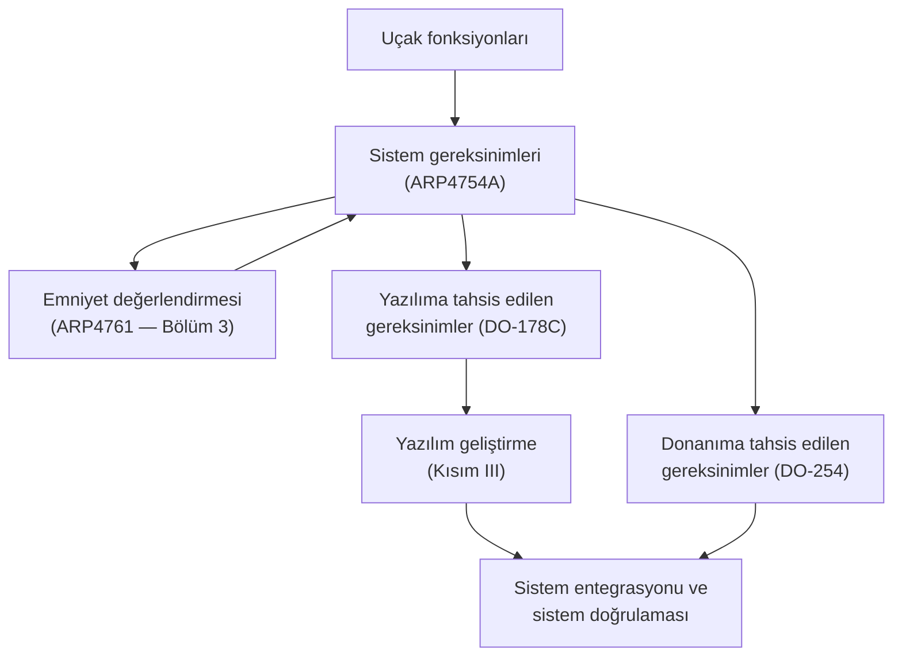

# 2. Sistem Bağlamında Yazılım

Yazılımın davranışı, ona atanan sistem fonksiyonları ve dış arayüzleri olmadan
anlaşılamaz. Bu bölüm, yazılımın hangi sistem parçasını gerçekleştirdiğini, hangi
sınırlar içinde çalıştığını ve hangi verileri dışarı verdiğini açıklar.

Emniyet-kritik geliştirmede temel soru şudur: yazılım hangi fonksiyonu yerine getirir,
hangi fonksiyonları devralmaz ve hangi durumlarda sistemi güvenli durumda tutar? Bu
bakış, sonraki gereksinim ve tasarım faaliyetlerinin temelidir.

## Sistem geliştirmeye genel bakış

Sivil havacılıkta sistem geliştirme, ARP4754A olarak bilinen sistem geliştirme
kılavuzunun çizdiği çerçevede yürür. Bu çerçevede uçak, birbirine bağlı üç seviyede
ele alınır:

1. **Uçak seviyesi:** uçağın yerine getireceği fonksiyonlar tanımlanır (kaldırma
   kontrolü, itki, seyrüsefer, haberleşme...).
2. **Sistem seviyesi:** uçak fonksiyonları sistemlere paylaştırılır (uçuş kontrol
   sistemi, motor kontrol sistemi, iniş takımı sistemi...).
3. **Öğe (item) seviyesi:** her sistemin fonksiyonları donanım ve yazılım öğelerine
   tahsis edilir. DO-178C, bu tahsisin **yazılım tarafını** ele alır; donanım tarafı
   için karşılığı DO-254'tür.

Bu akışın iki yönlü olduğu unutulmamalıdır: yazılım geliştirme sırasında keşfedilen
sorunlar, eksik veya çelişkili sistem gereksinimleri şeklinde yukarıya geri beslenir.
Sağlıklı bir projede sistem ekibi ile yazılım ekibi arasında sürekli ve kayıt altına
alınan bir geri besleme kanalı vardır.

## Sistem bağlamı neden önemlidir?

Bir yazılım işlevi, sistem bağlamından koparıldığında eksik anlaşılır. Örneğin bir hız
hesaplama algoritması, sensör girişinin kalitesi, filtreleme gecikmesi, veri güncelliği
ve insan-makine arayüzü ile birlikte değerlendirilmelidir. Aksi halde "doğru çalışan"
bir kod parçası, yanlış sistem davranışına dönüşebilir.

Sistem bağlamı; ekiplerin aynı dili konuşmasını sağlar. Çünkü yazılım ekibi, sistem
mühendisliği ekibi, test ekibi ve sertifikasyon ekibi çoğu zaman aynı işlevi farklı
açılardan görür. Ortak bağlam oluşmadığında, gereksinimler karışır ve doğrulama hedefleri
belirsizleşir.

## Sistem gereksinimleri

Yazılım gereksinimlerinin kalitesi, kaynağı olan sistem gereksinimlerinin kalitesini
aşamaz. Yazılıma tahsis edilen iyi bir sistem gereksinimi kümesi şu nitelikleri taşır:

- **Atomik ve tekil:** her gereksinim tek bir beklentiyi ifade eder; "ve/veya"
  yığınlarıyla birden çok beklenti tek cümleye sıkıştırılmaz.
- **Doğrulanabilir:** gereksinim, test veya analizle gösterilebilecek biçimde ölçülü
  yazılır ("hızlı olmalı" değil, "50 ms içinde yanıt vermeli").
- **Belirsizlikten arınmış:** "uygun", "yeterli", "mümkünse" gibi yoruma açık ifadeler
  içermez.
- **Tutarlı ve tam:** gereksinimler birbiriyle çelişmez; normal koşulların yanında
  arıza, sınır ve başlatma/kapanma koşullarını da kapsar.
- **İzlenebilir:** her gereksinim, kaynağı olan uçak/sistem fonksiyonuna ve emniyet
  gereksinimlerine bağlanabilir.

Emniyet değerlendirmesinden türeyen gereksinimler (örneğin bir izleme fonksiyonu, bir
sınır koruması, bir güvenli durum geçişi) sistem gereksinimleri içinde **açıkça
işaretlenmelidir**; çünkü bunların doğrulanması, sertifikasyon kanıtının en dikkatle
incelenen kısmıdır.

## Geçerleme ve doğrulama ayrımı

Sistem seviyesinde iki ayrı soru sorulur ve bunlar sık sık karıştırılır:

- **Geçerleme (validation):** *Doğru gereksinimleri mi yazdık?* Gereksinimlerin,
  gerçekten istenen uçak/sistem davranışını eksiksiz ve doğru ifade ettiğinin
  gösterilmesidir. Ağırlıklı olarak sistem seviyesinin sorumluluğudur.
- **Doğrulama (verification):** *Ürünü gereksinimlere uygun mu yaptık?* Her seviyedeki
  çıktının, kendi girdisindeki gereksinimleri karşıladığının gösterilmesidir.

Bu ayrım yazılım ekibi için pratik bir sonuç doğurur: DO-178C süreci ağırlıklı olarak
**doğrulama** üzerine kuruludur; yazılıma gelen gereksinimlerin *doğru gereksinimler*
olduğu büyük ölçüde sistem seviyesinde geçerlenmiş kabul edilir. Yazılım ekibi yine de
anlamsız, çelişkili veya uygulanamaz bir gereksinimle karşılaştığında bunu sisteme
geri bildirmekle yükümlüdür — "gelen gereksinim yanlıştı" savunması, sertifikasyonda
kimseyi kurtarmaz.

## Yazılımın sınırları

Yazılım, sistemin her parçasını yapmaz. Bazı işlevler donanım tarafından, bazıları
operatör prosedürleri tarafından, bazıları da başka alt sistemler tarafından sağlanır.
Bu yüzden yazılımın sorumluluk alanı açıkça çizilmelidir.

Bir uçuş kontrol bilgisayarında yazılım:

- sensör verisini yorumlayabilir,
- komut üretimini yönetebilir,
- arıza durumlarını sınıflandırabilir,
- yedek moda geçişi başlatabilir.

Ama sensörün fiziksel davranışını değiştiremez, kablolamayı düzeltemez ya da çevresel
koşulları ortadan kaldıramaz. Sistem bağlamı bu farkı netleştirir.

## Arayüzler

Arayüzler, sistemin en hassas noktalarıdır. Çünkü veri biçimi, zamanlama, hata
işaretleri ve sınır değerler burada tanımlanır. Net olmayan bir arayüz, testin tekrar
edilebilirliğini azaltır ve bakım sırasında beklenmeyen yan etkilere yol açar.

İyi bir arayüz tanımı şunları içerir:

- giriş ve çıkışların anlamı,
- veri tipleri ve birimleri,
- geçerli sınırlar,
- hata/uyarı kodları,
- zamanlama beklentileri,
- güvenli durum davranışı.

### Basit bir örnek

Bir uçuş kontrol bilgisayarında yazılım, sensörlerden gelen veriyi işler; ancak sensörün
kendisi değildir. Bu yüzden:

- giriş sinyallerinin sınırları tanımlanır,
- donanım arızalarında beklenen tepki belirlenir,
- dış arayüzler açıkça belgelenir,
- gecikme veya kesinti durumunda sistem davranışı açıklanır.

Bu tür açıklamalar olmadan yazılım gereksinimleri eksik kalır.

## Sistem mühendisleri için iyi uygulamalar

Yazılım kalitesini en çok etkileyen kararların bir kısmı, yazılım ekibi işe
başlamadan önce sistem seviyesinde verilir. Deneyimin öne çıkardığı uygulamalar:

- **Yazılıma tahsis edilen gereksinimleri erken kararlaştırın**, ama değişecekleri
  gerçeğini kabul edip değişiklik yönetimini baştan kurun.
- **Arayüzleri tek bir yerde ve sürümlenmiş biçimde tanımlayın** (arayüz kontrol
  dokümanı); e-posta ve toplantı notlarıyla arayüz yönetmeye çalışmayın.
- **Türetilmiş gereksinimleri emniyet ekibine geri bildirin.** Yazılım tasarımı
  sırasında ortaya çıkan ve sistem gereksinimlerinden türemeyen gereksinimlerin
  (derived requirements) emniyet etkisi sistem seviyesinde değerlendirilmelidir.
- **Belirsizliği prosedüre değil, tanıma dönüştürün.** "Bunu entegrasyonda çözeriz"
  cümlesi çoğu zaman "bunu en pahalı aşamada keşfedeceğiz" anlamına gelir.
- **Yazılım ekibini sistem gözden geçirmelerine dahil edin**; uygulanabilirlik
  sorunları en ucuz bu aşamada yakalanır.

## Yazılımın sistemle ilişkisi

Özetle yazılım, sistem gereksinimlerinin bir alt kümesini gerçekleştiren, sistemin
emniyet mimarisinin kendisine biçtiği rolü oynayan bir **öğedir**. Bu ilişki iki yönde
işler:

- **Yukarıdan aşağı:** sistem gereksinimleri, arayüz tanımları ve emniyet
  gereksinimleri yazılım geliştirmenin girdisidir.
- **Aşağıdan yukarı:** yazılımın türetilmiş gereksinimleri, tespit ettiği gereksinim
  sorunları ve gerçekleştirme kısıtları sistem ve emniyet süreçlerine geri döner.

Sonraki bölüm, bu ilişkinin emniyet tarafını — tehlikelerin nasıl belirlendiğini ve
yazılıma nasıl güvence seviyesi atandığını — ele alır.

## Bu bölümden akılda kalması gerekenler

- Yazılım sistemin bir parçası olarak anlaşılmalıdır; kritikliği ve gereksinimleri
  sistemden gelir.
- Geçerleme "doğru gereksinim", doğrulama "gereksinime uygun ürün" sorusudur; DO-178C
  ağırlıklı olarak doğrulamayı düzenler.
- Sınırlar ve arayüzler net değilse gereksinimler belirsizleşir; arayüz tanımı
  sürümlenmiş tek bir kaynaktan yönetilmelidir.
- Sistem bağlamı, doğrulama ve emniyet analizinin temel girdisidir; geri besleme
  kanalı çift yönlü ve kayıtlı olmalıdır.
