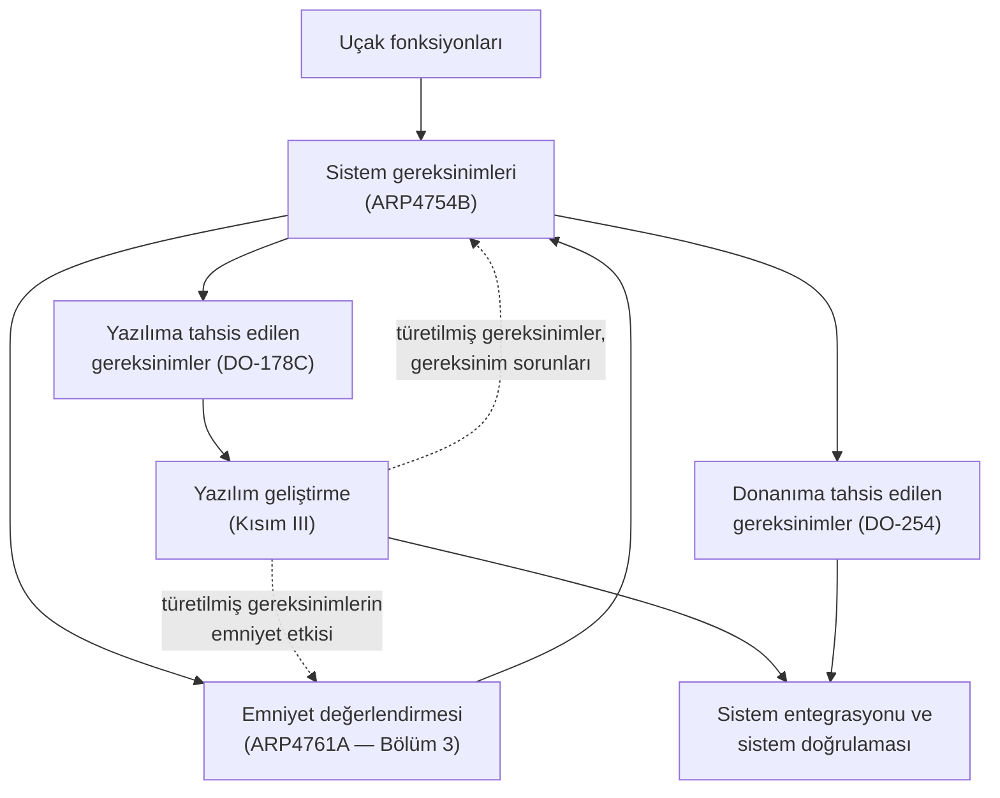

# 2. Sistem Bağlamında Yazılım

Yazılımın davranışı, ona atanan sistem fonksiyonları ve dış arayüzleri olmadan
anlaşılamaz. Bu bölüm, yazılımın hangi sistem parçasını gerçekleştirdiğini, hangi
sınırlar ve arayüzler içinde çalıştığını ve sistem süreçleriyle hangi bilgiyi iki yönde
alıp verdiğini açıklar.

Emniyet-kritik geliştirmede temel soru şudur: yazılım hangi fonksiyonu yerine getirir,
hangi fonksiyonları devralmaz ve hangi durumlarda sistemi güvenli durumda (safe state)
tutar? Bu bakış, sonraki gereksinim ve tasarım faaliyetlerinin temelidir.

## Sistem bağlamı neden önemlidir?

Bir yazılım işlevi, sistem bağlamından koparıldığında eksik anlaşılır. Örneğin bir hız
hesaplama algoritması, sensör girişinin kalitesi, filtreleme gecikmesi, veri güncelliği
ve insan-makine arayüzü ile birlikte değerlendirilmelidir. Aksi hâlde "doğru çalışan"
bir kod parçası, yanlış sistem davranışına dönüşebilir.

Tipik bir örnek, geçersiz veriyle ne yapılacağıdır. Hava hızı kaynağı geçersiz veri
bildirdiğinde yazılım ekibi son geçerli değeri tutmayı makul bulabilir; sistem tarafı
ise göstergenin değeri ekrandan kaldırmasını bekliyor olabilir. İki davranış da kendi
içinde kusursuz kodlanıp test edilebilir, ama yalnızca biri sistemin emniyet
analizindeki varsayımla uyuşur. Hangisinin doğru olduğu kodun içinden görünmez; cevap
sistem gereksinimlerinde, arayüz tanımında ve emniyet değerlendirmesindedir.

## Sistem geliştirmeye genel bakış

Sivil havacılıkta sistem geliştirmenin çerçevesini, sivil uçak ve sistemlerin
geliştirilmesine ilişkin kılavuz olan SAE ARP4754B (Avrupa'daki karşılığı EUROCAE
ED-79B; Aralık 2023) çizer. Önceki sürüm ARP4754A (2010) hâlâ sık karşınıza çıkar:
FAA'nın AC 20-174 genelgesi (2011) bu sürümü kabul edilebilir yöntem olarak tanımıştır
ve hizmetteki pek çok program ona göre yürütülmüştür. Bir programda hangi sürümün
geçerli olduğu, sertifikasyon otoritesiyle (certification authority) varılan
mutabakatla belirlenir. Bu çerçevede uçak, birbirine bağlı üç seviyede ele alınır:

1. **Uçak seviyesi:** uçağın yerine getireceği fonksiyonlar tanımlanır (kaldırma
   kontrolü, itki, seyrüsefer, haberleşme...).
2. **Sistem seviyesi:** uçak fonksiyonları sistemlere paylaştırılır (uçuş kontrol
   sistemi, motor kontrol sistemi, iniş takımı sistemi...).
3. **Öğe (item) seviyesi:** her sistemin fonksiyonları donanım ve yazılım öğelerine
   tahsis edilir (allocation). DO-178C, bu tahsisin **yazılım tarafını** ele alır;
   donanım tarafındaki karşılığı, havacılık elektronik donanımı için tasarım güvencesi
   kılavuzu olan DO-254 / ED-80'dir (2000).

Gereksinimlerle birlikte geliştirmenin ne kadar sıkı yürütüleceği de yukarıdan aşağı
iner. Sistem tarafında bunun adı geliştirme güvence seviyesidir (development assurance
level, DAL): önce fonksiyona fonksiyon geliştirme güvence seviyesi (function development
assurance level, FDAL), sonra mimari dikkate alınarak fonksiyonu gerçekleştiren öğelere
öğe geliştirme güvence seviyesi (item development assurance level, IDAL) atanır.
Yazılım öğesine atanan IDAL, DO-178C'de yazılım seviyesi (software level)
adını alır. Atamanın nasıl yapıldığı, emniyet değerlendirmesinin yöntemlerini anlatan
SAE ARP4761A (ED-135; Aralık 2023) ile birlikte
[3. Sistem Emniyet Değerlendirmesi Bağlamında Yazılım](./03-sistem-emniyet-degerlendirmesi-baglaminda-yazilim.md)
bölümünün konusudur.

```mermaid
flowchart TD
    A["Uçak fonksiyonları"] --> B["Sistem gereksinimleri<br/>(ARP4754B)"]
    B --> C["Emniyet değerlendirmesi<br/>(ARP4761A — Bölüm 3)"]
    C --> B
    B --> D["Donanıma tahsis edilen<br/>gereksinimler (DO-254)"]
    B --> E["Yazılıma tahsis edilen<br/>gereksinimler (DO-178C)"]
    E --> F["Yazılım geliştirme<br/>(Kısım III)"]
    F --> G["Sistem entegrasyonu ve<br/>sistem doğrulaması"]
    D --> G
    F -. "türetilmiş gereksinimler,<br/>gereksinim sorunları" .-> B
    F -. "türetilmiş gereksinimlerin<br/>emniyet etkisi" .-> C
```

Diyagramdaki kesikli oklar akışın iki yönlü olduğunu gösterir: yazılım geliştirme
sırasında keşfedilen sorunlar, eksik veya çelişkili sistem gereksinimleri şeklinde
yukarıya geri beslenir; yazılımın kendi ürettiği gereksinimler de sistem ve emniyet
süreçlerine iletilir. Sağlıklı bir projede sistem ekibi ile yazılım ekibi arasında
sürekli ve kayıt altına alınan bir geri besleme kanalı vardır.

## Sistem gereksinimleri

Yazılım gereksinimlerinin kalitesi, kaynağı olan sistem gereksinimlerinin kalitesini
aşamaz. Yazılıma tahsis edilen iyi bir sistem gereksinimi kümesi şu nitelikleri taşır:

- **Atomik ve tekil:** her gereksinim tek bir beklentiyi ifade eder; "ve/veya"
  yığınlarıyla birden çok beklenti tek cümleye sıkıştırılmaz.
- **Doğrulanabilir:** gereksinim, test veya analizle gösterilebilecek biçimde ölçülü
  yazılır ("hızlı olmalı" değil, "50 ms içinde yanıt vermeli").
- **Belirsizlikten arınmış:** "uygun", "yeterli", "mümkünse" gibi yoruma açık ifadeler
  içermez.
- **Tutarlı ve tam:** gereksinimler birbiriyle çelişmez; normal koşulların yanında
  arıza, sınır ve başlatma/kapanma koşullarını da kapsar.
- **İzlenebilir:** her gereksinim, kaynağı olan uçak/sistem fonksiyonuna ve emniyet
  gereksinimlerine bağlanabilir.

Emniyet değerlendirmesinden gelen, emniyetle ilgili gereksinimler (örneğin bir izleme
fonksiyonu, bir sınır koruması, bir güvenli durum geçişi) sistem gereksinimleri içinde
**açıkça işaretlenmelidir**; çünkü bunların doğrulanması, sertifikasyon kanıtının en
dikkatle incelenen kısmıdır.

## Geçerleme ve doğrulama ayrımı

Sistem seviyesinde iki ayrı soru sorulur ve bunlar sık sık karıştırılır:

- **Geçerleme (validation):** *Doğru gereksinimleri mi yazdık?* Gereksinimlerin,
  gerçekten istenen uçak/sistem davranışını eksiksiz ve doğru ifade ettiğinin
  gösterilmesidir. Ağırlıklı olarak sistem seviyesinin sorumluluğudur.
- **Doğrulama (verification):** *Ürünü gereksinimlere uygun mu yaptık?* Her seviyedeki
  çıktının, kendi girdisindeki gereksinimleri karşıladığının gösterilmesidir.

Bu ayrım yazılım ekibi için pratik bir sonuç doğurur: DO-178C süreci ağırlıklı olarak
**doğrulama** üzerine kuruludur; yazılıma gelen gereksinimlerin *doğru gereksinimler*
olduğu büyük ölçüde sistem seviyesinde geçerlenmiş kabul edilir. Yazılım ekibi yine de
anlamsız, çelişkili veya uygulanamaz bir gereksinimle karşılaştığında bunu sisteme
geri bildirmekle yükümlüdür — "gelen gereksinim yanlıştı" savunması, sertifikasyonda
kimseyi kurtarmaz.

## Tahsis ve yazılımın sınırları

Tahsis, bir sistem gereksiniminin hangi öğe tarafından karşılanacağına karar
verilmesidir. Yazılım, sistemin her parçasını yapmaz: bazı işlevler donanım, bazıları
mürettebat (flight crew) ya da bakım prosedürleri, bazıları da başka sistemler
tarafından sağlanır. Bir uçuş kontrol bilgisayarında yazılım sensör verisini
yorumlayabilir, komut üretimini yönetebilir, arızaları sınıflandırabilir ve yedek moda
geçişi başlatabilir; ama sensörün fiziksel davranışını değiştiremez, kablolamayı
düzeltemez ya da çevresel koşulları ortadan kaldıramaz.

Sınırın açık çizilmesi iki tipik sorunu önler:

- **Sahipsiz gereksinim.** Bir sensör arızasını kim algılayacak: donanımın kendi
  yerleşik testi mi, yazılımın makullük denetimi mi, ikisi birden mi? Tahsis yazılı
  değilse iki ekip de işi diğerinin yaptığını varsayar ve arıza algılama hiçbir öğenin
  gereksiniminde yer almaz.
- **Yazılıma sessizce yüklenen varsayım.** "Bu giriş donanımda filtreleniyor", "o değer
  zaten sınırlanmış geliyor" gibi kabuller bir gereksinime ya da arayüz tanımına
  bağlanmamışsa, donanım değiştiği gün kimse fark etmeden geçersizleşir.

Sınır her zaman tek bir kutuyla da çakışmaz. Tümleşik modüler aviyonik (integrated
modular avionics, IMA) platformlarında birden çok sistem fonksiyonunun yazılımı aynı
işlemciyi ve işletim sistemini paylaşır. Bu durumda yazılımın bağlamı hem
gerçekleştirdiği fonksiyon hem de üzerinde koştuğu platformdur; farklı yazılım
seviyesindeki uygulamaların birbirini etkileyemediği ise yazılım bölümlemesiyle
(software partitioning) gösterilir
([21. Yazılım Bölümlemesi](../05-ozel-konular/21-yazilim-bolumlemesi.md)).

## Arayüzler

Arayüzler, sistemin en hassas noktalarıdır. Çünkü veri biçimi, zamanlama, hata
işaretleri ve sınır değerler burada tanımlanır. Net olmayan bir arayüz, testin tekrar
edilebilirliğini azaltır ve bakım sırasında beklenmeyen yan etkilere yol açar.

İyi bir arayüz tanımı her sinyal için şunları söyler: verinin anlamı ve kaynağı, veri
tipi ve birimi, geçerli aralık, zamanlama beklentisi (ne sıklıkla gelir, ne zaman
bayat sayılır), geçerliliğin nasıl bildirildiği ve veri geçersiz ya da eksik olduğunda
alıcının ne yapacağı. Bu bilgiler sistem seviyesinde arayüz kontrol dokümanında
(interface control document, ICD) toplanır ve yazılım gereksinimlerinin doğrudan
girdisi olur.

### Örnek: tek bir giriş sinyalinin arayüz tanımı

Bir gösterge biriminin, hava veri bilgisayarından ARINC 429 veri yolu üzerinden
hesaplanmış hava hızı (computed airspeed) aldığını düşünelim. Sinyalin arayüz tanımı
aşağıdaki gibi olabilir (değerler temsilîdir; gerçek bir projede kaynak ekipmanın
arayüz kontrol dokümanından alınır):

| Öznitelik | Tanım |
|---|---|
| Sinyal ve kaynağı | Hesaplanmış hava hızı; hava veri bilgisayarı, ARINC 429 alıcı kanalı 1 |
| Etiket (label) ve kodlama | Etiket 206 (sekizli); ikili (binary, BNR) kodlama |
| Birim ve çözünürlük | Knot; 0,0625 knot |
| Geçerli aralık | 0–450 knot; aralık dışındaki değer geçersiz sayılır |
| Yenileme periyodu | 100 ms'de bir kelime (word) |
| Bayatlama süresi | 300 ms boyunca yeni kelime alınmazsa veri bayat sayılır |
| Geçerlilik göstergesi | İşaret/durum matrisi (sign/status matrix, SSM): yalnızca "normal çalışma" değeri geçerlidir; "arıza uyarısı", "hesaplanmış veri yok" ve "işlevsel test" değerleri geçersiz veri anlamına gelir |
| Geçersiz ya da bayat veride davranış | Değer kullanılmaz, son geçerli değer tutulmaz; hava hızı "geçersiz" olarak işaretlenir ve göstergeden kaldırılır |

Tablonun ilk satırları çoğu projede eksiksiz yazılır; eksik kalanlar genellikle son üç
satırdır. Bayatlama süresi tanımlı değilse yazılım, kesilmiş bir veri yolunun son
değerini süresiz kullanabilir. Geçerlilik göstergesinin hangi değerlerinin "kullanma"
anlamına geldiği yazılmamışsa, kaynak ekipmanın test modunda yayımladığı değer gerçek
ölçüm sanılabilir. Son satır ise yazılımın tek başına karar veremeyeceği sistem
davranışıdır; "Sistem bağlamı neden önemlidir?" kısmındaki anlaşmazlık tam burada
çözülür. Denetimde de aynı soru sorulur: *bu sinyal kesilirse yazılım ne yapar ve bu
nerede yazıyor?*

ARINC 429 kelimesinin alanları için sitedeki
[ARINC 429 yazısına](/blog/arinc-429) bakılabilir. Dış arayüzdeki bu tanımın yazılımın
içinde bileşenler arası arayüzlere nasıl taşındığı
[7. Yazılım Tasarımı](../03-do178c-ile-gelistirme/07-yazilim-tasarimi.md) bölümünde
ele alınır.

## Sistem ile yazılım arasındaki bilgi akışı

Yazılım, sistem gereksinimlerinin bir alt kümesini gerçekleştiren ve sistemin emniyet
mimarisinin kendisine biçtiği rolü oynayan bir **öğedir**. Bu ilişki, iki yönde akan ve
her biri bir yaşam döngüsü verisinde iz bırakan bilgilerle kurulur.

**Sistemden yazılıma** gelenler, yazılım geliştirmenin girdisidir:

| Bilgi | Kim üretir? | Yazılım tarafında nerede görünür? |
|---|---|---|
| Yazılıma tahsis edilen sistem gereksinimleri (işlev, başarım, arayüz) | Sistem mühendisliği | Yüksek seviyeli gereksinimlerin (high-level requirements) kaynağı; iz verisi |
| Emniyetle ilgili gereksinimler ve tasarım kısıtları (izleme, bağımsızlık, bölümleme) | Sistem emniyet değerlendirme süreci | Emniyetle ilgili olarak işaretlenmiş gereksinimler; yazılım mimarisi |
| Yazılım seviyesi ve dayandığı arıza durumları (failure condition) | Sistem emniyet değerlendirme süreci | Yazılım sertifikasyon planı (Plan for Software Aspects of Certification, PSAC) |
| Donanım tanımı ve donanım/yazılım arayüzü (hardware/software interface) | Donanım ve sistem mühendisliği | Gereksinimler ve tasarım tanımı |
| Hangi gereksinimin sistem düzeyinde doğrulanacağı ve yazılımdan beklenen kanıt | Sistem mühendisliği | Yazılım doğrulama planı (Software Verification Plan, SVP) |
| Yazılımın ilettiği türetilmiş gereksinimler ve gereksinim sorunları üzerine yapılan değerlendirmenin sonucu | Sistem mühendisliği ve sistem emniyet değerlendirme süreci | Yazılım doğrulama sonuçları |

**Yazılımdan sisteme** dönenler, sistem ve emniyet süreçlerinin kendi sonuçlarını
güncel tutmasını sağlar:

| Bilgi | Kim üretir? | Yazılım tarafında nerede görünür? |
|---|---|---|
| Türetilmiş gereksinimler ve gerekçeleri | Gereksinim ve tasarım süreçleri | Yazılım gereksinim verisi ve tasarım tanımı |
| Mimarinin emniyetle ilgili yönleri: bölümleme sınırları, izleme ve hata algılama mekanizmaları | Tasarım süreci | Tasarım tanımı |
| Sistem gereksinimlerinde bulunan eksik, çelişki ve belirsizlikler | Gereksinim, tasarım ve doğrulama süreçleri | Problem raporları (problem report) |
| Kullanım kısıtları ve açık problem raporlarının işlevsel etkisi | Yazılım ekibi, sertifikasyon irtibatı | Yazılım başarı özeti (Software Accomplishment Summary, SAS) |
| Yazılımın konfigürasyon tanımlaması; başarım, zamanlama ve doğruluk özellikleri | Yazılım ekibi | Yazılım konfigürasyon indeksi (Software Configuration Index, SCI); zamanlama ve bellek payları yazılım başarı özetinde |
| Sistem doğrulamasında kullanılabilecek yazılım doğrulama kanıtı | Doğrulama süreci | Yazılım doğrulama sonuçları |

Türetilmiş gereksinim (derived requirement), yazılım geliştirme süreçlerinde —
gereksinim ya da tasarım sırasında — ortaya çıkan ve üst seviye gereksinime doğrudan
izlenemeyen ya da orada belirtilenin ötesinde davranış tanımlayan gereksinimdir; ayrıntısı
[6. Yazılım Gereksinimleri](../03-do178c-ile-gelistirme/06-yazilim-gereksinimleri.md)
bölümündedir. Emniyet değerlendirmesinden yazılıma tahsis edilen gereksinim bu anlamda
türetilmiş değildir; kaynağı bellidir. Türetilmiş gereksinimin yukarı bildirilmesinin
nedeni, sistem analizi yapılırken henüz var olmaması ve emniyet etkisinin
değerlendirilmemiş olmasıdır.

Tabloların her satırı aynı zamanda bir denetim sorusudur. Planlama denetiminde yazılım
seviyesinin hangi arıza durumuna dayandığı sorulur ([SW SOI-1](../kaynaklar/soi-1.md));
geliştirme denetiminde türetilmiş gereksinimlerin sistem süreçlerine iletildiğinin
kaydı aranır ([SW SOI-2](../kaynaklar/soi-2.md)). "Sistem ekibine söylemiştik" bir kayıt
değildir.

### Donanım/yazılım arayüzü

Yazılımın en yakın komşusu, üzerinde koştuğu donanımdır. Donanım/yazılım arayüzü tanımı
tipik olarak bellek haritasını, çevre birimi yazmaçlarının adreslerini ve bit
anlamlarını, kesme kaynaklarını ve önceliklerini, saat ve zamanlayıcıları, güç
verildiğinde ve yeniden başlatmada donanımın hangi durumda olduğunu ve donanımın kendi
sağladığı arıza algılama mekanizmalarını içerir.

Bu arayüz iki nedenle özel dikkat ister. Birincisi, türetilmiş gereksinimlerin başlıca
kaynağıdır: bekçi köpeği zamanlayıcısının (watchdog timer) hangi aralıkla yenileneceği
ya da bir çevre biriminin hangi sırayla başlatılacağı hiçbir sistem gereksiniminde
yazmaz, seçilen donanımdan doğar. İkincisi, donanım geliştirme boyunca değişir; yazmaç
düzeni ya da kesme ataması değiştiğinde yazılımın bundan haberdar olması, arayüz
tanımının sürümlenmiş ve değişiklik kontrolü altında olmasına bağlıdır. Yazılımın bu
arayüzle uyumu, sonunda hedef donanım üzerinde koşulan donanım/yazılım entegrasyon
testleriyle gösterilir
([9. Yazılım Doğrulama](../03-do178c-ile-gelistirme/09-yazilim-dogrulama.md)).

### Sistem doğrulamasıyla ilişki

Yazılım doğrulaması bittiğinde iş bitmiş olmaz; yazılım donanımla ve diğer öğelerle
birleştirilir ve sistem gereksinimlerinin karşılandığı sistem entegrasyonu (system
integration) ve sistem doğrulaması sırasında gösterilir. İki düzey birbirinin kanıtını
kullanabilir, ama bu kendiliğinden olmaz:

- **Yazılımdan sisteme:** bir sistem gereksinimi yazılım testleriyle zaten
  gösterilmişse sistem doğrulaması bu kanıta dayanabilir. Bunun için testin hangi
  ortamda ve hangi yazılım sürümüyle koşulduğu bilinmelidir.
- **Sistemden yazılıma:** bazı yazılım gereksinimleri ancak gerçek sensörler ve
  eyleyicilerle anlamlı biçimde sınanabilir (uçtan uca gecikme gibi). Bunların sistem
  düzeyi teste bırakılması bir boşluk değil, plandır — yeter ki hangi gereksinimin
  nerede doğrulanacağı önceden yazılmış ve otoriteyle paylaşılmış olsun. DO-178C bu
  krediye bir koşul bağlar: kredi alınan sistem faaliyeti ilgili DO-178C hedeflerini
  karşılamalı, tamamlandığının kanıtı ve çıktıları da yazılım yaşam döngüsü verisi
  içinde gösterilmelidir.

Sık görülen hata, bu paylaşımın proje sonunda yapılmasıdır: yazılım ekibi bir
gereksinimi "sistem testinde bakılır" diye kapatır, sistem ekibi ise aynı gereksinimin
yazılım testinde gösterildiğini varsayar.

## Sistem mühendisleri için iyi uygulamalar

Yazılım kalitesini en çok etkileyen kararların bir kısmı, yazılım ekibi işe
başlamadan önce sistem seviyesinde verilir. Deneyimin öne çıkardığı uygulamalar:

- **Yazılıma tahsis edilen gereksinimleri erken kararlaştırın**, ama değişecekleri
  gerçeğini kabul edip değişiklik yönetimini baştan kurun.
- **Arayüzleri tek bir yerde ve sürümlenmiş biçimde tanımlayın** (arayüz kontrol
  dokümanı); e-posta ve toplantı notlarıyla arayüz yönetmeye çalışmayın.
- **Türetilmiş gereksinimler için bir geri bildirim kanalı kurun.** Yazılım ekibinin
  gereksinim ve tasarım sırasında ürettiği türetilmiş gereksinimlerin emniyet etkisi
  sistem seviyesinde değerlendirilmelidir; kimin değerlendireceği ve sonucun nereye
  kaydedileceği baştan belli olmalıdır.
- **Belirsizliği prosedüre değil, tanıma dönüştürün.** "Bunu entegrasyonda çözeriz"
  cümlesi çoğu zaman "bunu en pahalı aşamada keşfedeceğiz" anlamına gelir.
- **Yazılım ekibini sistem gözden geçirmelerine dahil edin**; uygulanabilirlik
  sorunları en ucuz bu aşamada yakalanır.

Sonraki bölüm, bu ilişkinin emniyet tarafını — tehlikelerin nasıl belirlendiğini ve
yazılım seviyesinin nasıl atandığını — ele alır.

## Bu bölümden akılda kalması gerekenler

- Yazılım sistemin bir öğesi olarak anlaşılmalıdır; gereksinimleri, seviyesi ve
  emniyet rolü sistem süreçlerinden gelir.
- Geçerleme "doğru gereksinim", doğrulama "gereksinime uygun ürün" sorusudur; DO-178C
  ağırlıklı olarak doğrulamayı düzenler.
- Tahsis yazılı değilse gereksinim sahipsiz kalır; yazılımın neyi yapmadığı da neyi
  yaptığı kadar açık olmalıdır.
- Arayüz tanımı sürümlenmiş tek bir kaynaktan yönetilir ve her sinyal için bayatlama
  süresini, geçerlilik göstergesini ve geçersiz veride beklenen davranışı da söyler.
- Bilgi iki yönde akar: sistemden gereksinimler, yazılım seviyesi ve donanım tanımı
  gelir; yazılımdan türetilmiş gereksinimler, mimari bilgisi, problem raporları ve
  kullanım kısıtları döner. Bu alışveriş kayıtlı olmalıdır.
- Hangi gereksinimin yazılım düzeyinde, hangisinin sistem düzeyinde doğrulanacağı
  planlamada kararlaştırılır; sona bırakılan paylaşım doğrulanmamış gereksinim üretir.
  Sistem düzeyi faaliyetten kredi alınacaksa o faaliyet ilgili DO-178C hedeflerini
  karşılamalıdır.
