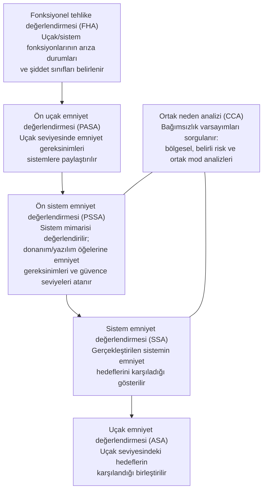

# 3. Sistem Emniyet Değerlendirmesi Bağlamında Yazılım

Sistem emniyet değerlendirmesi, yazılımın neden belirli bir güvence düzeyinde
geliştirilmesi gerektiğini açıklar. Tehlike analizi sonucunda ortaya çıkan kritik
durumlar, yazılım gereksinimlerine ve doğrulama yoğunluğuna doğrudan yansır.

Bu bölümde amaç, emniyet hedeflerinin nasıl yazılım iş ürünlerine dönüştüğünü
göstermektir. Böylece her testin ve her kontrolün arkasındaki gerekçe görünür olur.

## Emniyet değerlendirme sürecine genel bakış

Sivil havacılıkta emniyet değerlendirmesi, ARP4761 olarak bilinen kılavuzun
tanımladığı, uçak geliştirmeyle paralel yürüyen ve sürekli geri besleme üreten bir
süreçtir. Süreç kabaca şu adımlardan oluşur:

- **Fonksiyonel tehlike değerlendirmesi (functional hazard assessment, FHA):**
  "Bu fonksiyon kaybolursa ya da yanlış çalışırsa ne olur?" sorusunu sorar ve her
  arıza durumuna bir şiddet sınıfı atar. Uçak ve sistem seviyelerinde ayrı ayrı
  yapılır.
- **Ön değerlendirmeler (PASA/PSSA):** henüz tasarım tamamlanmadan, önerilen
  mimarinin emniyet hedeflerini karşılayıp karşılayamayacağını inceler; emniyet
  gereksinimlerini ve güvence seviyelerini aşağıya, öğelere dağıtır.
- **Ortak neden analizi (common cause analysis, CCA):** yedeklilik ve bağımsızlık
  varsayımlarının geçerliliğini sorgular. Aynı yazılımın iki yedek kanalda koşması,
  tek bir hata kaynağının iki kanalı birden düşürebilmesi demektir — yazılımı
  doğrudan ilgilendiren tipik bir ortak neden örneğidir.
- **Nihai değerlendirmeler (SSA/ASA):** tasarım ve doğrulama tamamlandığında,
  hedeflerin gerçekten karşılandığını kanıtlarla gösterir.

Bu adımlar bir kez koşulan bir zincir değil, geliştirme boyunca dönen bir çevrimdir:
tasarım değiştikçe analizler güncellenir, analiz bulguları tasarımı değiştirir.

## Emniyet değerlendirmesi ne üretir?

Sistem emniyet çalışmaları genellikle şu tür çıktılar üretir:

- tehlike tanımları,
- risk ve şiddet sınıfları,
- kabul edilebilir risk hedefleri,
- güvenli durum beklentileri,
- yazılıma tahsis edilen emniyet fonksiyonları,
- yazılım ve donanım öğeleri için güvence seviyeleri.

Bu çıktılar, yazılım ekibine doğrudan "şu kodu yaz" demez. Bunun yerine, hangi
davranışların gösterilmesi gerektiğini ve hangi koşullarda hata kabul edilemeyeceğini
tanımlar.

## Geliştirme güvencesi ve seviyeler

Yazılım hataları sistematik olduğundan (bkz. Bölüm 1), yazılıma donanımdaki gibi bir
arıza olasılığı atanamaz. Bunun yerine **geliştirme güvencesi (development
assurance)** yaklaşımı kullanılır: hatanın sonucu ne kadar ağırsa, geliştirme ve
doğrulama süreci o kadar sıkı disipline edilir.

Arıza durumunun şiddet sınıfı ile yazılım seviyesi arasındaki yerleşik eşleme şudur:

| Arıza durumu şiddeti | Kısa tanım | Yazılım seviyesi |
|---|---|---|
| Katastrofik (catastrophic) | Uçağın kaybıyla sonuçlanması beklenen durum | A |
| Tehlikeli (hazardous) | Emniyet marjlarında büyük azalma, ciddi/ölümcül yaralanma olasılığı | B |
| Majör (major) | Emniyet marjlarında belirgin azalma, mürettebat iş yükünde önemli artış | C |
| Minör (minor) | Emniyet marjlarında hafif azalma, rutin prosedürlerle yönetilebilir | D |
| Emniyet etkisi yok (no safety effect) | Uçuş emniyetini etkilemez | E |

Yazılım seviyesi, DO-178C'de karşılanması gereken hedef sayısını, bağımsızlık
beklentilerini ve yapısal kapsam analizi derinliğini belirler: seviye A en sıkı
gereklilikleri taşır; seviye E için DO-178C hedefleri uygulanmaz. Seviyenin kendisi
yazılım ekibinin seçimi değildir; PSSA'nın çıktısıdır ve sertifikasyon otoritesiyle
mutabakat gerektirir.

İki pratik uyarı:

- **Seviye pazarlığı emniyet analiziyle yapılır, bütçeyle değil.** "Seviye B pahalı,
  C yapalım" yaklaşımı, ancak mimari bir önlem (izleme, bölümleme, farklı kanal)
  arıza etkisini gerçekten sınırlıyorsa savunulabilir.
- **Seviye düşürme mimariyle gerekçelendirilir.** Bir öğenin seviyesinin
  düşürülebilmesi, başka bir öğenin (örneğin bağımsız bir izleyicinin) o tehlikeyi
  tuttuğunun gösterilmesine dayanır; bu bağımsızlığın kendisi de CCA ile doğrulanır.

## Tehlikeden gereksinime

Tehlike analizi sonucunda ortaya çıkan bir bulgu, çoğu zaman birkaç yazılım gereksinimine
ayrılır. Örneğin "yanlış hız verisi" tehlikesi için yazılım;

- veriyi filtrelemeli,
- geçersiz ölçümleri ayıklamalı,
- sensör tutarsızlığını algılamalı,
- sınır dışı durumda uyarı üretmelidir.

Burada önemli olan, tahsis işleminin açık olmasıdır. Hangi önlemin yazılımda, hangisinin
donanımda, hangisinin operasyonel prosedürde olduğu açıkça yazılmalıdır.

## Yazılım emniyet sürecine nasıl bağlanır?

Yazılım, bazı durumlarda tehlikeyi doğrudan azaltan tek bileşen olabilir. Özellikle
birden fazla sensörün tutarlılığını değerlendiren, hatalı veriyi sınırlayan veya güvenli
duruma geçişi yöneten işlevler yazılım tarafından taşınır.

Bu işlevler şunları gerektirir:

- açık sınır koşulları,
- hata durumları için net davranış,
- zamanlama gereksinimleri,
- yeniden başlatma veya degrade mod tanımı.

Bağlantının sağlıklı işlemesi için iki yönlü akış kurulmalıdır:

- **Emniyetten yazılıma:** emniyet gereksinimleri, yazılım gereksinimleri içinde
  ayrı ve izlenebilir biçimde işaretlenir; kaybolmaları ya da sıradan bir işlevsel
  gereksinim gibi ele alınmaları en yaygın süreç hatasıdır.
- **Yazılımdan emniyete:** tasarım sırasında ortaya çıkan türetilmiş gereksinimler
  (derived requirements) emniyet ekibine geri bildirilir; çünkü sistem analizi
  yapılırken bu gereksinimler henüz yoktu ve emniyet etkileri değerlendirilmemişti.

Ayrıca yazılım ekibi, mimari kararlarının (bölümleme, izleme, yedeklilik, farklı
kanallar) emniyet analizindeki varsayımlarla tutarlı kaldığını her değişiklikte
yeniden sorgulamalıdır.

## Doğrulama üzerindeki etkisi

Emniyet değerlendirmesi, doğrulama yoğunluğunu da etkiler. Bir işlev ne kadar kritikse,
onunla ilişkili kanıt o kadar güçlü olmak zorundadır. Bu nedenle tehlike analizi ile
test stratejisi birbirinden ayrı düşünülemez.

Örneğin:

- kritik bir güvenli durum geçişi için hem gözden geçirme hem de hedefli test gerekir,
- sınır değer koruması için negatif testler önemlidir,
- arıza algılama için gecikme ve yanlış pozitif senaryoları incelenmelidir.

### Dönüşüm örneği

- Tehlike: yanlış hız verisi.
- Şiddet sınıfı ve seviye: sistem analizinin sonucuna göre, örneğin tehlikeli → B.
- Yazılım etkisi: hız tahmini için kullanılan verinin filtrelenmesi ve tutarlılık
  izlemesi.
- Kanıt: ilgili gereksinim, gözden geçirme kaydı, normal ve gürbüzlük testleri,
  sınır değer analizi, izlenebilirlik kaydı.

Bu basit akış, emniyet analizi ile yazılım iş ürünü arasındaki bağlantının özünü gösterir.

## Bu bölümden akılda kalması gerekenler

- Emniyet analizi (FHA → PSSA → SSA zinciri), yazılım gereksinimlerinin ve yazılım
  seviyesinin kaynağıdır.
- Şiddet sınıfları (katastrofikten etkisize) yazılım seviyelerine (A–E) eşlenir;
  seviye, DO-178C hedeflerinin sıkılığını belirler.
- Yazılımın emniyet katkısı açıkça tahsis edilmeli; türetilmiş gereksinimler emniyet
  ekibine geri bildirilmelidir.
- Ortak neden analizi, yedekliliğin yazılım hatalarına karşı tek başına yeterli
  olmadığını hatırlatır.
- Kritik davranışlar için doğrulama kanıtı daha güçlü olmalıdır.
