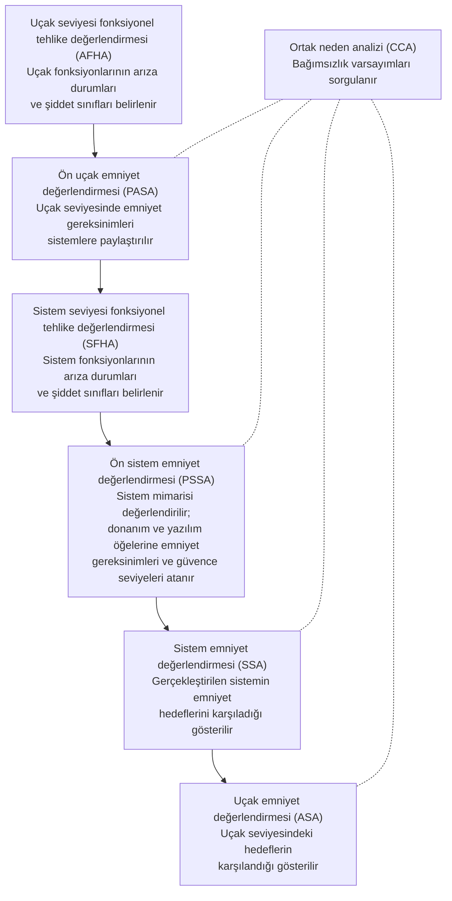
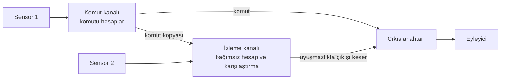

# 3. Sistem Emniyet Değerlendirmesi Bağlamında Yazılım

Sistem emniyet değerlendirmesi, bir yazılımın neden belirli bir yazılım seviyesinde
geliştirilmesi gerektiğini açıklar. Bu bölüm emniyet değerlendirme adımlarını, arıza
durumunun şiddetinden yazılım seviyesine giden yolu, seviyeyi etkileyen mimari önlemleri
ve emniyet gereksinimlerinin yazılım gereksinimlerine ve doğrulama kanıtına nasıl
dönüştüğünü anlatır.

Bu bağlantı kurulduğunda her testin ve her gözden geçirmenin arkasındaki gerekçe görünür
olur: yazılım ekibi yalnızca "ne isteniyor" sorusunu değil, "neden bu sıkılıkta
isteniyor" sorusunu da yanıtlayabilir.

## Emniyet değerlendirme sürecine genel bakış

Sivil havacılıkta emniyet değerlendirmesinin yöntemlerini SAE ARP4761A (Avrupa'daki
karşılığı EUROCAE ED-135; Aralık 2023) tanımlar. Bu kılavuz, sistem geliştirme sürecini
anlatan ARP4754B / ED-79B ile birlikte kullanılır
(bkz. [2. Sistem Bağlamında Yazılım](./02-sistem-baglaminda-yazilim.md)). Emniyet
değerlendirmesi uçak geliştirmeyle paralel yürür ve sürekli geri besleme üretir. Süreç
kabaca şu adımlardan oluşur:

```mermaid
flowchart TD
    AFHA["Uçak seviyesi fonksiyonel tehlike değerlendirmesi (AFHA)<br/>Uçak fonksiyonlarının arıza durumları<br/>ve şiddet sınıfları belirlenir"]
    PASA["Ön uçak emniyet değerlendirmesi (PASA)<br/>Uçak seviyesinde emniyet gereksinimleri<br/>sistemlere paylaştırılır"]
    SFHA["Sistem seviyesi fonksiyonel tehlike değerlendirmesi (SFHA)<br/>Sistem fonksiyonlarının arıza durumları<br/>ve şiddet sınıfları belirlenir"]
    PSSA["Ön sistem emniyet değerlendirmesi (PSSA)<br/>Sistem mimarisi değerlendirilir;<br/>donanım ve yazılım öğelerine emniyet<br/>gereksinimleri ve güvence seviyeleri atanır"]
    SSA["Sistem emniyet değerlendirmesi (SSA)<br/>Gerçekleştirilen sistemin emniyet<br/>hedeflerini karşıladığı gösterilir"]
    ASA["Uçak emniyet değerlendirmesi (ASA)<br/>Uçak seviyesindeki hedeflerin<br/>karşılandığı gösterilir"]
    CCA["Ortak neden analizi (CCA)<br/>Bağımsızlık varsayımları sorgulanır"]

    AFHA --> PASA --> SFHA --> PSSA --> SSA --> ASA
    CCA -.- PASA
    CCA -.- PSSA
    CCA -.- SSA
    CCA -.- ASA
```

- **Fonksiyonel tehlike değerlendirmesi (functional hazard assessment, FHA):**
  "Bu fonksiyon kaybolursa ya da yanlış çalışırsa ne olur?" sorusunu sorar ve her
  arıza durumuna (failure condition) bir şiddet sınıfı (severity classification) atar.
  Uçak ve sistem seviyelerinde ayrı ayrı yapılır (diyagramdaki AFHA ve SFHA).
  Fonksiyona bakar, çözüme değil; bu yüzden tasarım daha ortada yokken başlayabilir.
  Aynı fonksiyonun kaybı ile fark edilmeden yanlış çalışması ayrı arıza durumlarıdır ve
  çoğu zaman farklı sınıflanır: mürettebatın (flight crew) fark edemediği yanıltıcı
  veri, genellikle verinin tümüyle kaybından daha ağır değerlendirilir.
- **Ön değerlendirmeler:** ön uçak emniyet değerlendirmesi (preliminary aircraft safety
  assessment, PASA) ve ön sistem emniyet değerlendirmesi (preliminary system safety
  assessment, PSSA), tasarım henüz tamamlanmadan, önerilen mimarinin emniyet
  hedeflerini karşılayıp karşılayamayacağını sorgular; emniyet gereksinimlerini ve
  güvence seviyelerini aşağıya, öğelere dağıtır.
- **Ortak neden analizi (common cause analysis, CCA):** yedeklilik (redundancy) ve
  bağımsızlık varsayımlarının geçerliliğini sorgular. Bölgesel emniyet analizi (zonal
  safety analysis, ZSA), belirli risk analizi (particular risk analysis, PRA) ve ortak
  mod analizi (common mode analysis, CMA) bu başlık altındadır. Aynı yazılımın iki
  yedek kanalda koşması, tek bir hata kaynağının iki kanalı birden düşürebilmesi
  demektir — yazılımı doğrudan ilgilendiren tipik bir ortak neden örneğidir.
- **Nihai değerlendirmeler:** sistem emniyet değerlendirmesi (system safety assessment,
  SSA) ve uçak emniyet değerlendirmesi (aircraft safety assessment, ASA), tasarım ve
  doğrulama tamamlandığında hedeflerin gerçekten karşılandığını kanıtlarla gösterir.

Bu adımlar bir kez koşulan bir zincir değil, geliştirme boyunca dönen bir çevrimdir:
tasarım değiştikçe analizler güncellenir, analiz bulguları tasarımı değiştirir.

İki adlandırma notu. Birincisi, "SSA" kısaltması yalnızca nihai adımın adıdır; bu
kitapta sürecin bütünü **sistem emniyet değerlendirme süreci (system safety assessment
process)** diye anılır. İkincisi, kılavuzun 1996 tarihli ilk sürümünde (ARP4761) uçak
seviyesindeki PASA ve ASA ayrı adımlar olarak tanımlı değildi ve FHA tek başlık altında
anılıyordu; o sürüme göre yürüyen programlarda bu adlar görünmeyebilir. Güncel sürüm
ayrıca, bir arızanın tümleşik sistemler boyunca yayılan etkilerini izleyen zincirleme
etki analizini (cascading effects analysis, CEA) ve model tabanlı emniyet analizini
(model-based safety analysis, MBSA) yöntemler arasına almıştır.

### Başlıca analiz yöntemleri

Yazılım mühendisinin emniyet raporlarında en sık karşılaşacağı iki yöntem şunlardır:

- **Hata ağacı analizi (fault tree analysis, FTA):** yukarıdan aşağıya çalışır.
  İstenmeyen bir tepe olaydan (örneğin bir arıza durumundan) başlar ve ona yol
  açabilecek arıza birleşimlerini mantık kapılarıyla açar. Nicel hesap donanım
  arızalarının oranlarıyla yapılır; yazılım hataları ağaçta bir olasılık değeriyle
  değil, ilgili öğeye atanan seviyeyle karşılanır.
- **Arıza türleri ve etkileri analizi (failure modes and effects analysis, FMEA):**
  aşağıdan yukarıya çalışır. Her bileşenin arıza türlerinin üst düzeydeki etkisini
  sorar; sonuçlar arıza türleri ve etkileri özetinde (failure modes and effects
  summary, FMES) toplanır ve hata ağacına girdi olur.

Yazılım ekibinin bu belgeleri üretmesi beklenmez; ama kendi öğesinin ağacın neresinde
durduğunu, hangi izleyicinin hangi olayı tutmak üzere varsayıldığını okuyabilmesi
gerekir.

## Emniyet değerlendirmesi ne üretir?

Her adımın yazılım ekibine ulaşan bir çıktısı vardır:

| Adım | Başlıca çıktı | Yazılım ekibi için anlamı |
|---|---|---|
| FHA | Arıza durumları, etkileri ve şiddet sınıfları | Fonksiyonun güvence seviyesinin kaynağı; "kayıp" ile "yanlış çalışma"nın ayrı sınıflandığı yer |
| PASA / PSSA | Her arıza durumu için emniyet hedefi; öğelere tahsis edilen emniyet gereksinimleri, bağımsızlık gereksinimleri ve güvence seviyeleri | Yazılım seviyesi; izleme, güvenli durum ve algılama süresi gibi gereksinimler |
| CCA | Bağımsızlık varsayımlarının geçerli olduğunun gösterimi, ortak neden bulguları | Ortak kod, ortak girdi, ortak derleyici ya da işletim sistemi gibi paylaşımların sorgulanması |
| SSA / ASA | Gerçekleştirilen tasarımın emniyet hedeflerini karşıladığının kanıtı | Yazılımın atanan seviyeye uygun geliştirildiğini gösteren kanıt bu değerlendirmeye girdi olur |

Bu çıktılar yazılım ekibine doğrudan "şu kodu yaz" demez. Bunun yerine hangi
davranışların gösterilmesi gerektiğini ve hangi koşullarda hatanın kabul
edilemeyeceğini tanımlar.

Tabloda görünmeyen ama en az onun kadar önemli bir çıktı da **analiz varsayımlarıdır**:
"izleyici uyuşmazlığı bir saniye içinde algılar", "iki kanal ortak veri kullanmaz",
"mürettebat uyarıyı görünce yedek göstergeye geçer" gibi. Yazılımı ilgilendiren her
varsayım bir gereksinime dönüşmeli ve doğrulanmalıdır; gereksinime dönüşmemiş bir
varsayım, kimsenin sahiplenmediği bir emniyet iddiasıdır.

## Geliştirme güvencesi ve seviyeler

Yazılım hataları sistematik olduğundan
(bkz. [1. Giriş ve Genel Bakış](../01-giris/01-giris-ve-genel-bakis.md)), yazılıma
donanımdaki gibi bir arıza olasılığı atanamaz. Bunun yerine **geliştirme güvencesi
(development assurance)** yaklaşımı kullanılır: hatanın sonucu ne kadar ağırsa,
geliştirme ve doğrulama süreci o kadar sıkı disipline edilir.

Sistem tarafında bu sıkılığın ölçüsü geliştirme güvence seviyesidir (development
assurance level, DAL) ve iki düzeyde atanır:

- **Fonksiyon geliştirme güvence seviyesi (function development assurance level,
  FDAL):** fonksiyonun FHA'daki en ağır arıza durumunun sınıfından gelir; fonksiyonun
  gereksinimlerinin hangi titizlikle geliştirileceğini belirler.
- **Öğe geliştirme güvence seviyesi (item development assurance level, IDAL):**
  fonksiyonu gerçekleştiren donanım ve yazılım öğelerine, mimari dikkate alınarak
  atanır.

Bir yazılım öğesine atanan IDAL, DO-178C'de **yazılım seviyesi (software level)** adıyla
karşılık bulur. Bu kitapta "güvence seviyesi" sözü sistem tarafındaki FDAL ve IDAL için,
"yazılım seviyesi" ise DO-178C'nin Seviye A'dan Seviye E'ye uzanan beş basamağı için
kullanılır.

Arıza durumunun şiddet sınıfı ile yazılım seviyesi arasındaki yerleşik eşleme şudur:

| Arıza durumu şiddeti | Kısa tanım | Olasılık hedefi (uçuş saati başına ortalama) | Yazılım seviyesi |
|---|---|---|---|
| Katastrofik (catastrophic) | Çok sayıda can kaybı; çoğunlukla uçağın kaybıyla birlikte | Son derece olasılık dışı (extremely improbable); 10⁻⁹ mertebesinden küçük | A |
| Tehlikeli (hazardous) | Emniyet marjlarında büyük azalma; mürettebatın görevini eksiksiz yapmasına güvenilemeyecek ölçüde iş yükü; mürettebat dışındaki az sayıda kişide ciddi ya da ölümcül yaralanma | Son derece seyrek (extremely remote); 10⁻⁷ mertebesinden küçük | B |
| Majör (major) | Emniyet marjlarında belirgin azalma, mürettebat iş yükünde önemli artış; yolcularda ya da kabin ekibinde olası yaralanma | Seyrek (remote); 10⁻⁵ mertebesinden küçük | C |
| Minör (minor) | Emniyet marjlarında hafif azalma, rutin prosedürlerle yönetilebilir | Olası (probable); 10⁻³ mertebesinden küçük | D |
| Emniyet etkisi yok (no safety effect) | Emniyeti etkilemez; uçağın operasyonel yeteneğini azaltmaz, mürettebat iş yükünü artırmaz | Olasılık şartı yok | E |

Tabloyu okurken üç noktaya dikkat etmek gerekir:

- **Olasılık sütunu yazılım için değildir.** Bu hedefler sistem düzeyindeki arıza
  durumlarına aittir ve nicel analizde rastgele donanım arızalarıyla gösterilir.
  Yazılıma nicel bir arıza olasılığı atanmaz; yazılımın arıza durumuna katkısı son
  sütundaki seviyeyle yönetilir. İki sütun, aynı şiddet sınıfının donanım ve yazılım
  tarafındaki karşılıklarıdır.
- **Tanımlar ve sayılar büyük nakliye uçakları içindir.** DO-178C sınıf tanımlarını bu
  uçak sınıfı için, örnek olarak verir; tam tanım için otoritenin kural ve rehberlerine
  yönlendirir. Olasılık hedefleri CS-25 / FAR Part 25 kapsamındaki uçaklar için
  AMC 25.1309 ve AC 25.1309'da verilen değerlerdir. Başka uçak sınıflarında
  sertifikasyon otoritelerinin rehberleri farklı hedefler tanımlar; hangi rehberin
  geçerli olduğu programın sertifikasyon temelinde belirlenir.
- **Seviyeyi en ağır katkı belirler.** Bir yazılım bileşeninin hatalı davranışı birden
  fazla arıza durumuna katkı verebiliyorsa, seviye bunların en ağırına göre atanır.

### Seviye pratikte neyi değiştirir?

Yazılım seviyesi, DO-178C'de karşılanması gereken hedeflerin (objectives) sayısını, bu
hedeflerden kaçının bağımsızlıkla (independence) karşılanacağını ve yapısal kapsam
analizinin (structural coverage analysis) hangi ölçüte kadar ineceğini belirler:

| Yazılım seviyesi | Hedef sayısı | Bağımsızlıkla karşılanan hedef | Yapısal kapsam ölçütü |
|---|---|---|---|
| Seviye A | 71 | 30 | Değiştirilmiş koşul/karar kapsama (modified condition/decision coverage, MC/DC), karar kapsama (decision coverage) ve satır kapsama (statement coverage) |
| Seviye B | 69 | 18 | Karar kapsama ve satır kapsama |
| Seviye C | 62 | 5 | Satır kapsama |
| Seviye D | 26 | 2 | Yapısal kapsam hedefi yok |
| Seviye E | — | — | Otorite Seviye E belirlemesini teyit ettikten sonra DO-178C rehberliği uygulanmaz |

Tablo iki şeyi açıkça gösterir. Seviye A ile Seviye B arasındaki fark hedef sayısından
çok bağımsızlıkta ve kapsam ölçütündedir; maliyeti asıl artıran da bunlardır. Seviye C
ve Seviye D'de bağımsızlıkla işaretli hedefler ise doğrulama (verification) hedefleri
değil, kalite güvencesi (quality assurance) hedefleridir. Seviye ayrıca hangi yaşam
döngüsü verisinin hangi kontrol kategorisinde yönetileceğini de değiştirir. Hedeflerin
yapısı
[4. DO-178C ve Destekleyici Dokümanlara Genel Bakış](../03-do178c-ile-gelistirme/04-do178c-genel-bakis.md)
bölümünde, bağımsızlık ve kapsam ölçütleri
[9. Yazılım Doğrulama](../03-do178c-ile-gelistirme/09-yazilim-dogrulama.md) bölümünde
ele alınır.

Seviyenin kendisi yazılım ekibinin seçimi değildir; sistem emniyet değerlendirme
sürecinin çıktısıdır. Fonksiyonun seviyesi FHA'daki sınıflandırmadan gelir; öğelere
tahsis, ön değerlendirmeler sırasında mimariye bakılarak yapılır. Nihai SSA'da seviye
atanmaz; gerçekleştirilen sistemin hedefleri karşıladığı gösterilir. Yazılım seviyesi
ve gerekçesi yazılım sertifikasyon planında (Plan for Software Aspects of Certification,
PSAC) yazılır ve otoriteyle mutabakat gerektirir
(bkz. [5. Yazılım Planlama](../03-do178c-ile-gelistirme/05-yazilim-planlama.md)).
Planlama denetiminde ilk sorulanlardan biri de budur: seviye hangi arıza durumuna
dayanıyor ve bu dayanak gösterilebiliyor mu ([SW SOI-1](../kaynaklar/soi-1.md))?

Atanan seviye bir alt sınırdır. İleride eklenecek işlevlerin ya da değişecek tahsisin
daha ağır bir arıza durumuna yol açması bekleniyorsa yazılımı baştan daha yüksek
seviyede geliştirmek, kanıtı sonradan yükseltmekten kolaydır.

## Seviyeyi etkileyen mimari önlemler

Bir fonksiyonun seviyesi ile onu gerçekleştiren her yazılım bileşeninin seviyesi aynı
olmak zorunda değildir. Mimari, bir yazılım hatasının arıza durumuna katkısını
sınırlıyor ya da hatayı algılayıp etkisini hafifletiyorsa, sistem süreci ilgili
bileşene daha düşük bir seviye atayabilir. DO-178C, sistemle ilişkiyi anlatırken bu
amaçla kullanılan üç mimari yaklaşımı anar; bunları tercih edilen ya da zorunlu
çözümler olarak sunmaz. Çıkış noktası şudur: bileşenlerden herhangi birinin hatası
arıza durumunu tek başına doğurabiliyorsa hepsi fonksiyonun en ağır arıza durumunun
seviyesini alır. Daha düşük bir seviye ancak arıza durumu için birden çok bileşenin
birlikte hatalı davranması gerekiyorsa ve bu bileşenlerin hem işlev hem tasarım (ortak
tasarım öğeleri, dil, araç) açısından yeterince bağımsız olduğu gösterilebiliyorsa
gündeme gelir.

**Bölümleme (partitioning).** Yazılım bileşenlerini birbirinden yalıtır. Her bileşene
ayrı donanım vermek de bir bölümlemedir; asıl zor olan, aynı donanımı paylaşan
bileşenlerin yalıtımıdır: bir bileşen diğerinin kodunu, verisini ve giriş/çıkışını
bozamaz, işlemciyi de yalnızca kendisine ayrılan sürede kullanır. Yalıtım
gösterilebiliyorsa her bileşen kendi katkı verdiği arıza durumuna göre seviye alır;
gösterilemiyorsa hepsi aralarındaki en yüksek seviyeyle geliştirilir. Yalıtımı sağlayan
yazılım, yalıttığı bileşenlerin en yüksek seviyesinde ya da daha yükseğinde olmalıdır;
yalıtımı sağlayan donanım ise sistem emniyet değerlendirme sürecinde ayrıca
değerlendirilir. Ayrıntılar
[21. Yazılım Bölümlemesi](../05-ozel-konular/21-yazilim-bolumlemesi.md) bölümündedir.

**Çok sürümlü benzemez yazılım (multiple-version dissimilar software).** Aynı
fonksiyon, ortak hata kaynaklarının bir kısmından kaçınmak amacıyla birbirinden
bağımsız iki ya da daha fazla sürüm olarak geliştirilir: ayrı ekipler, farklı diller,
farklı derleyiciler, farklı işlemciler. Sınırı da bellidir: benzemezliğin sağladığı
koruma çoğunlukla ölçülemez ve benzemezlik devreye girmeden önce tamamlanan adımlardaki
bir hata — örneğin sürümlerin dayandığı ortak gereksinimdeki — her sürüme aynen geçer.
Bu yüzden benzemezlik kendiliğinden kredi getirmez: DO-178C benzemez sürümleri
çoğunlukla, seviyenin doğrulama hedefleri karşılandıktan sonra eklenen bir koruma
katmanı olarak görür. Doğrulamanın hafifletilmesi ancak sistem emniyet değerlendirme
süreci bunun doğurabileceği fonksiyon kaybını kabul edilebilir bulursa söz konusudur;
ne kadar bağımsızlık sağlandığı ortak neden analizinde gösterilir ve alınacak kredi
otoriteyle kararlaştırılır.

**Emniyet izleme (safety monitoring).** Fonksiyonun çıktısını ya da davranışını
gözleyen ayrı bir izleyici, arızayı algılar ve sistemi güvenli duruma götürür. En
yaygın biçimi komut/izleme (command/monitor, COM/MON) mimarisidir:

```mermaid
flowchart LR
    S1["Sensör 1"] --> COM["Komut kanalı<br/>komutu hesaplar"]
    S2["Sensör 2"] --> MON["İzleme kanalı<br/>bağımsız hesap ve karşılaştırma"]
    COM -- "komut" --> SW["Çıkış anahtarı"]
    COM -- "komut kopyası" --> MON
    MON -- "uyuşmazlıkta çıkışı keser" --> SW
    SW --> ACT["Eyleyici"]
```

İzlemeden kredi alınabilmesi üç soruya bağlıdır:

- **İzleyicinin seviyesi nedir?** İzleyici, izlediği fonksiyonun en ağır arıza durumuna
  göre seviye alır. İzlenen yazılıma ise ilgili sistem fonksiyonunun kaybına karşılık
  gelen seviye atanabilir. İzleme yükü ortadan kaldırmaz, izleyiciye taşır; izleyicinin
  kendisi ucuza gelmez.
- **Neyi, ne kadar sürede algılar?** Algılanmayan arıza türleri ve algılama gecikmesi,
  emniyet analizindeki varsayımlarla uyuşmalıdır. İzleyicinin fark edilmeden
  arızalanması da ayrıca ele alınır; aksi hâlde koruma, gerektiği gün orada olmayabilir.
- **İzleyici izlenenden bağımsız mı?** Aynı sensör, aynı kütüphane, aynı güç kaynağı ya
  da aynı zaman tabanı iki kanalı birlikte yanıltabilir. Diyagramdaki her ortak öğe
  bir ortak neden analizi sorusudur.

ARP4754B, bağımsız üyelerden oluşan mimarilerde öğelere fonksiyonun seviyesinden daha
düşük seviye atanmasına belirli kurallarla izin verir. Kuralların ayrıntısı sistem
sürecinin konusudur; yazılım ekibi için önemli olan, bu indirimin otomatik olmadığını
ve hangi varsayıma dayandığını bilmektir.

:::warning[Seviye pazarlığı emniyet analiziyle yapılır, bütçeyle değil]
"Seviye B pahalı, C yapalım" yaklaşımı ancak mimari bir önlem arıza etkisini gerçekten
sınırlıyorsa savunulabilir. Bir öğenin seviyesinin düşürülebilmesi, başka bir öğenin
(örneğin bağımsız bir izleyicinin) o arıza durumunu tuttuğunun gösterilmesine dayanır;
bu bağımsızlığın kendisi de CCA ile doğrulanır. Sonradan iki kanala ortak bir sürücü ya
da ortak bir veri yolu eklemek, kimse fark etmeden bu gerekçeyi ortadan kaldırabilir.
:::

## Arıza durumundan gereksinime

Emniyet değerlendirmesinde belirlenen bir arıza durumu, çoğu zaman birden fazla
önlemle karşılanır ve bu önlemler farklı yerlere tahsis edilir: bir kısmı donanıma
(ikinci bir sensör, ayrı bir güç kaynağı), bir kısmı yazılıma (izleme, geçerlilik
denetimi, güvenli duruma geçiş), bir kısmı da operasyonel prosedüre (mürettebatın
yedek göstergeye geçmesi).

Burada önemli olan, tahsisin açık olmasıdır. Hangi önlemin yazılımda, hangisinin
donanımda, hangisinin prosedürde olduğu yazılı değilse iki tipik hata ortaya çıkar: ya
her taraf önlemi diğerinin aldığını varsayar ve önlem sahipsiz kalır, ya da yazılım
ekibi kendisinden istenmeyen bir korumayı kendiliğinden ekler ve emniyet analizinin
bilmediği bir davranış doğar.

Yazılıma tahsis edilen emniyet gereksinimleri sıradan işlevsel gereksinimlerden daha
fazlasını söylemek zorundadır:

- açık sınır koşulları (hangi değerden sonra veri geçersiz sayılır),
- hata durumları için net davranış (ne bildirilir, hangi çıktı kesilir),
- zamanlama (arıza ne kadar sürede algılanır, tepki ne kadar sürede verilir),
- yeniden başlatma ve kısıtlı çalışma modu (degraded mode) tanımı.

## Yazılım emniyet sürecine nasıl bağlanır?

Yazılım, bazı durumlarda arıza durumunun etkisini doğrudan azaltan tek bileşen olabilir.
Özellikle birden fazla sensörün tutarlılığını değerlendiren, hatalı veriyi sınırlayan
veya güvenli duruma geçişi yöneten işlevler yazılım tarafından taşınır. Bağlantının
sağlıklı işlemesi için iki yönlü akış kurulmalıdır:

- **Emniyetten yazılıma:** emniyet gereksinimleri, yazılım gereksinimleri içinde
  ayrı ve izlenebilir (traceable) biçimde işaretlenir; kaybolmaları ya da sıradan bir
  işlevsel gereksinim gibi ele alınmaları en yaygın süreç hatasıdır. İşaret, gereksinim
  değiştiğinde emniyet ekibinin de değişikliği görmesini sağlar.
- **Yazılımdan emniyete:** yazılım geliştirme sırasında, gereksinim ya da tasarım
  aşamasında ortaya çıkan türetilmiş gereksinimler (derived requirements) gerekçeleriyle
  birlikte sistem süreçlerine ve emniyet ekibine geri bildirilir. Bunlar üst seviye
  gereksinime doğrudan izlenemeyen ya da orada belirtilenin ötesinde davranış tanımlayan
  gereksinimlerdir; sistem analizi yapılırken henüz yoktular ve emniyet etkileri
  değerlendirilmemişti
  (bkz. [6. Yazılım Gereksinimleri](../03-do178c-ile-gelistirme/06-yazilim-gereksinimleri.md)).

Ayrıca yazılım ekibi, mimari kararlarının (bölümleme, izleme, yedeklilik, farklı
kanallar) emniyet analizindeki varsayımlarla tutarlı kaldığını her değişiklikte
yeniden sorgulamalıdır. Tasarımda bölümleme ya da benzeri bir mimari önlem bazı
bileşenlerin seviye atamasını değiştirebilecek biçimde kullanılıyorsa DO-178C, buna
ilişkin bilginin de türetilmiş gereksinim olarak tanımlanıp sistem süreçlerine
iletilmesini bekler.

## Doğrulama üzerindeki etkisi

Emniyet değerlendirmesi doğrulamayı iki yoldan etkiler.

Birincisi, doğrulamanın yoğunluğunu **yazılım seviyesi** belirler. DO-178C'nin
doğrulama hedefleri, bileşenin seviyesine göre o bileşenin bütün gereksinimlerine ve
bütün koduna uygulanır; gözden geçirme (review) ve gereksinim tabanlı test
(requirements-based testing) yalnızca "kritik" görülen işlevler için değil, o
seviyedeki yazılımın tamamı için beklenir. Aynı yazılımın içinde bir işlevi daha az
titizlikle doğrulamak, ancak o işlev bölümlemeyle ayrılmış ve ayrı bir seviye almışsa
mümkündür.

İkincisi, emniyet gereksinimleri test ve analiz içeriğinde bazı konuları öne çıkarır:

- **Gürbüzlük testleri (robustness tests):** geçersiz değerler, bozuk ya da
  tazelenmeyen veri, aşılan çerçeve süresi, izin verilmeyen durum geçişi. İzleme ve
  koruma işlevlerinin asıl işi bu koşullarda görünür.
- **Arıza enjeksiyonu (fault injection):** izleyicinin algıladığı varsayılan arıza
  gerçekten üretilir ve tepkinin gereksinimdeki gibi olduğu gösterilir.
- **Zamanlama:** algılama gecikmesi ile tepki süresinin toplamı, emniyet analizinde
  varsayılan süreyi aşmamalıdır. Bu, en kötü durum yürütme süresi (worst-case execution
  time, WCET) analiziyle birlikte değerlendirilir.
- **Yanlış alarm (false alarm):** fazla dar seçilmiş bir eşik sağlam bir kanalı
  gereksiz yere devreden çıkarır. Kullanılabilirliği düşüren ve mürettebatın uyarılara
  güvenini aşındıran bu davranış da bir emniyet konusudur.

Doğrulama sonuçları emniyet sürecine geri döner: analizde varsayılan algılama süresi ya
da arıza kapsaması (fault coverage), test ve analiz kanıtıyla desteklenmedikçe nihai
değerlendirmede kullanılamaz.

## Uçtan uca örnek: yanıltıcı hava hızı göstergesi

Aşağıdaki örnek, bir arıza durumunun yazılım gereksinimine ve kanıta nasıl dönüştüğünü
gösterir. Sınıflandırma ve sayılar örnek amaçlıdır; gerçek bir programda bunlar uçağın
kendi emniyet değerlendirmesinden gelir.

| Halka | Örnekteki içerik |
|---|---|
| Arıza durumu (FHA) | Hava hızının, mürettebat fark etmeden yanlış gösterilmesi; göstergenin kaybı ayrı bir arıza durumudur ve ayrıca sınıflanır |
| Sınıflandırma | Bu örnekte Tehlikeli varsayılmıştır; fonksiyonun seviyesi FDAL B |
| Mimari (PSSA) | İki bağımsız hava verisi kaynağı, yazılımda karşılaştırma izleyicisi, uyuşmazlıkta mürettebata uyarı |
| Yazılıma tahsis edilen emniyet gereksinimi | Kaynaklar arasındaki uyuşmazlık en geç 1 saniye içinde algılanıp mürettebata bildirilmelidir |
| Yazılım seviyesi | İzleyiciyi de içeren gösterge yazılımı için Seviye B |

Yazılım ekibi bu tahsisi doğrulanabilir yüksek seviyeli gereksinimlere (high-level
requirements) çevirir; aşağıda bunlar YSG önekiyle numaralanmıştır:

- **YSG-101:** Yazılım, iki hava verisi kaynağından alınan hava hızı değerleri
  arasındaki mutlak fark 10 knot'ı kesintisiz 500 ms boyunca aştığında "hava hızı
  uyuşmazlığı" durumunu ilan etmelidir.
- **YSG-102:** Yazılım, uyuşmazlık durumu ilan edildikten sonra en geç 100 ms içinde
  uyuşmazlık uyarısını gösterge birimine göndermelidir.
- **YSG-103:** Kaynaklardan birinin verisi geçersiz olarak işaretlenmişse ya da 200
  ms'den uzun süredir tazelenmemişse yazılım, karşılaştırmanın yapılamadığını ayrı bir
  durum olarak bildirmelidir.

Üç gereksinim de emniyet gereksinimi olarak işaretlenir ve sistem gereksinimine
izlenir. Süreler birlikte okunmalıdır: 500 ms'lik teyit süresi ile 100 ms'lik bildirim
süresi, tahsis edilen 1 saniyelik bütçenin içinde kalır ve gösterge biriminin kendi
gecikmesine pay bırakır. YSG-103 ise analizin çoğu zaman yazmadığı ama gerektirdiği
bir şeyi söyler: izleyici çalışamıyorsa bu sessizce geçilmez.

Geliştirme sırasında bir de türetilmiş gereksinim doğar:

- **YSG-104 (türetilmiş):** Yazılım, güç verildikten sonraki ilk 2 saniye boyunca
  karşılaştırma yapmamalıdır. *Gerekçe:* sensör verisi oturmadan yapılan karşılaştırma
  yanlış alarm üretir.

Bu gereksinim hiçbir sistem gereksinimine izlenmez ve emniyet açısından masum değildir:
izleyici bu pencerede kördür. Emniyet ekibine bildirildiğinde ekip, pencerenin yalnızca
yerde ve kalkıştan önce oluşup oluşmadığını değerlendirir; uçuşta yeniden başlatma
mümkünse gereksinimin değişmesi gerekebilir. Geri bildirim yapılmasaydı analiz,
gerçekte var olmayan kesintisiz bir izlemeye dayanıyor olurdu.

Doğrulama kanıtı da aynı zinciri izler:

- gereksinimlerin, tasarımın ve kodun gözden geçirme kayıtları;
- normal aralık testleri (normal range tests): farkın eşiğin hemen altında ve hemen
  üstünde, sürenin 500 ms'nin hemen altında ve hemen üstünde olduğu durumlar ile
  açılıştaki 2 saniyelik pencerenin bitiş sınırı;
- gürbüzlük testleri: geçersiz işaretli veri, tazelenmeyen veri, aralık dışı değer ve
  uçuşta yeniden başlatma gibi anormal başlatma koşulları;
- Seviye B'nin gerektirdiği yapısal kapsam: satır kapsama ve karar kapsama ile veri
  bağlaşımı ve kontrol bağlaşımı (data coupling, control coupling) analizi;
- arıza durumundan sistem gereksinimine, oradan yazılım gereksinimine, koda ve test
  durumlarına uzanan izlenebilirlik kaydı.

## Bu bölümden akılda kalması gerekenler

- Emniyet değerlendirme adımları (FHA → PASA/PSSA → SSA/ASA ve bunlara eşlik eden CCA),
  yazılıma tahsis edilen emniyet gereksinimlerinin ve yazılım seviyesinin kaynağıdır.
- Fonksiyonun seviyesi (FDAL) FHA'daki şiddet sınıfından gelir; öğenin seviyesi (IDAL)
  mimari dikkate alınarak atanır. Yazılım öğesine atanan IDAL, DO-178C'deki yazılım
  seviyesidir.
- Olasılık hedefleri sistem düzeyindeki arıza durumları içindir; yazılıma olasılık
  atanmaz, yazılımın katkısı seviyeyle yönetilir.
- Seviye; hedef sayısını, bağımsızlık beklentisini ve yapısal kapsam ölçütünü belirler
  ve bileşenin tamamına uygulanır.
- Bölümleme, çok sürümlü benzemez yazılım ve emniyet izleme seviyeyi etkileyebilir;
  ancak bunun dayandığı bağımsızlık ortak neden analiziyle gösterilmelidir.
- Yazılımın emniyet katkısı açıkça tahsis edilmeli; emniyet gereksinimleri işaretlenmeli,
  türetilmiş gereksinimler gerekçeleriyle sistem süreçlerine ve emniyet ekibine geri
  bildirilmelidir.
- Emniyet analizindeki her varsayım (algılama süresi, arıza kapsaması, bağımsızlık) bir
  gereksinime ve doğrulama kanıtına bağlanmalıdır.
