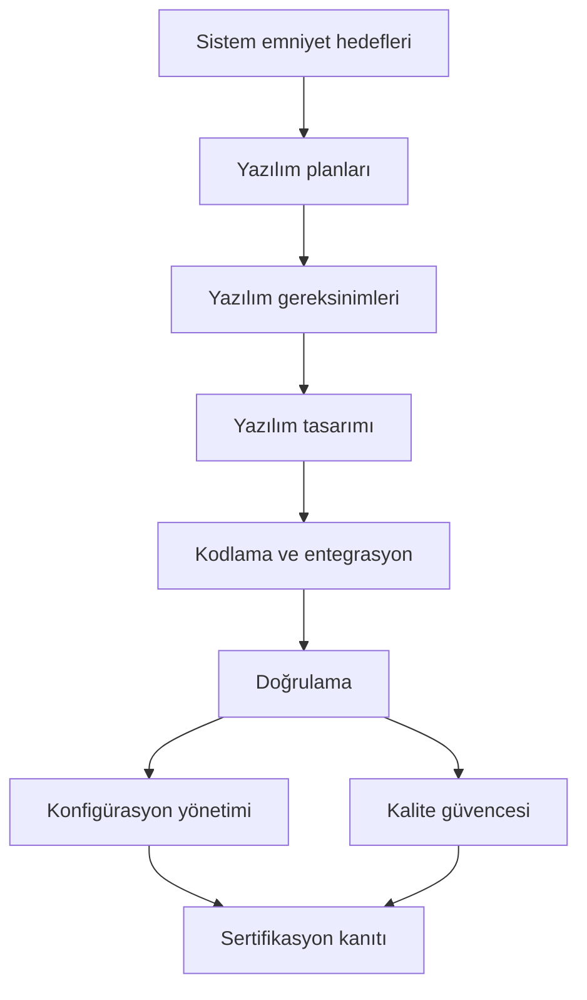

# 4. DO-178C ve Destekleyici Dokümanlara Genel Bakış

DO-178C, aviyonik yazılım için nasıl geliştirme yapılacağını adım adım emreden bir tarif
kitabı değildir; bunun yerine, emniyet-kritik yazılımın doğrulanabilir, izlenebilir ve
sertifikasyona uygun biçimde geliştirilmesi için bir çerçeve sunar. Bu nedenle belgeyi
okurken amaç, "ne yapılmalı?" sorusundan çok "hangi çıktılar gösterilmeli?" sorusuna
odaklanmaktır.

DO-178C’nin değeri, proje ekibine yalnızca teknik yönerge vermesinde değil, aynı zamanda
sertifikasyon otoritesinin beklediği kanıt dilini ortaklaştırmasında yatar. Belge;
faaliyetlerin sırasını, iş ürünlerini, gözden geçirme beklentilerini ve her seviyede
hangi amaçların karşılanması gerektiğini tarif eder.

## DO-178'in kısa tarihçesi

:::info Bu bölüm hazırlanıyor 🚧
DO-178'in ilk sürümünden DO-178C'ye uzanan gelişim; her sürümün getirdiği ana
değişiklikler ve DO-178C güncellemesinin gerekçeleri burada anlatılacak.
:::

## DO-178C neyi kapsar?

Standart, yazılım yaşam döngüsünü şu eksenlerde ele alır:

- planlama,
- gereksinim geliştirme,
- tasarım,
- kodlama ve entegrasyon,
- doğrulama,
- konfigürasyon yönetimi,
- kalite güvencesi,
- sertifikasyon irtibatı.

Bu eksenlerin üzerine bir de amaçlar yerleştirilir. Yani standart yalnızca görevleri
sıralamaz; her görevin sonunda neyin gösterilmiş olması gerektiğini de söyler.

## Belge ailesi

DO-178C tek başına kullanılmaz. Uygulamada onunla birlikte referans verilen birkaç
tamamlayıcı belge vardır:

| Belge | Rolü |
|---|---|
| DO-178C | Yazılım yaşam döngüsü için ana çerçeve |
| DO-278A | Yer tabanlı CNS/ATM yazılımları için DO-178C'nin karşılığı |
| DO-248C | Destekleyici materyal: sık sorulan sorular ve açıklama makaleleri |
| DO-330 | Araç kalifikasyonu (tool qualification) |
| DO-331 | Model tabanlı geliştirme ve doğrulama (model-based development and verification) |
| DO-332 | Nesne yönelimli teknoloji ve ilgili teknikler |
| DO-333 | Biçimsel yöntemler (formal methods) |

Bu ek dokümanlar, ana standardın bazı alanlarda bırakmadığı ayrıntıları tamamlar.
Örneğin model tabanlı bir akış kullanılıyorsa modelin rolünü anlatmak için DO-331,
kullanılan bir analiz aracının çıktısına güveniliyorsa o güveni temellendirmek için
DO-330 devreye girer.

## Süreç bakışı

Bu görünümde dikkat edilmesi gereken nokta, faaliyetlerin doğrusal görünmesine karşın
pratikte birbirini beslemesidir. Gereksinimlerdeki bir değişiklik tasarımı, kodlamayı ve
doğrulamayı etkiler; doğrulama bulguları ise planları ve hatta gereksinim dilini geri
besleyebilir.

## Uyumdan çok kanıt

DO-178C’nin en önemli zihinsel modeli şudur: amaç yalnızca "yazılımı geliştirmek" değil,
belirli hedeflerin sağlandığını gösterecek kanıtı üretmektir. Bu kanıt; planlar,
standartlar, gereksinimler, tasarım tanımları, kaynak kod, testler, gözden geçirme
kayıtları, kapsam sonuçları ve sorun kayıtları gibi iş ürünlerinden oluşur.

Bu yaklaşımın sonucu olarak:

- eksik izlenebilirlik bir kalite kusuru değil, doğrudan bir sertifikasyon problemi
  haline gelir,
- test faaliyetleri sadece hata bulmak için değil, hedefleri göstermek için de
  yürütülür,
- bağımsızlık beklentisi, özellikle doğrulama tarafında, organizasyon yapısını etkiler,
- her planlama kararı, sonraki iş ürünlerinin üretim biçimini değiştirir.

## Yazılım güvence seviyesi

DO-178C, yazılımın etkisine göre güvence seviyesi (software assurance level) mantığı ile
çalışır. Uçuş emniyetine etkisi arttıkça beklentiler sıkılaşır. En kritik seviyelerde
daha fazla hedef, daha güçlü bağımsızlık ve daha kapsamlı doğrulama gerekir.

Buradaki önemli nokta, güvence seviyesinin yalnızca bir etiket olmamasıdır. Seviye;

- hangi iş ürünlerinin gerekli olduğunu,
- hangi doğrulama derinliğinin beklendiğini,
- hangi bağımsızlık düzeyinin aranacağını,
- hangi kanıtların özellikle inceleneceğini

belirleyen bir çerçevedir.

## Bu kitabı nasıl okumalı?

Sonraki bölümler, DO-178C’yi katman katman açar:

- [Yazılım Planlama](./05-yazilim-planlama.md)
- [Yazılım Gereksinimleri](./06-yazilim-gereksinimleri.md)
- [Yazılım Tasarımı](./07-yazilim-tasarimi.md)
- [Yazılım Gerçekleştirme: Kodlama ve Entegrasyon](./08-yazilim-gerceklestirme-kodlama-entegrasyon.md)
- [Yazılım Doğrulama](./09-yazilim-dogrulama.md)

Bu sıralama birebir süreç akışı sunmaktan çok, standardın mantığını anlaşılır bir sırada
açmak için seçilmiştir. Önce planları, sonra iş ürünlerini, ardından bunların nasıl
doğrulanacağını ele almak, belgenin neden bu kadar sıkı bir izlenebilirlik beklediğini
anlamayı kolaylaştırır.

### Bu bölümden akılda kalması gerekenler

- DO-178C bir "nasıl kod yazılır" standardı değildir.
- Amaç, sürecin izlenebilir ve doğrulanabilir olmasıdır.
- Ek dokümanlar, özel tekniklerin nasıl ele alınacağını tamamlar.
- Kanıt üretmek, yazılım geliştirme kadar önemli bir iştir.
