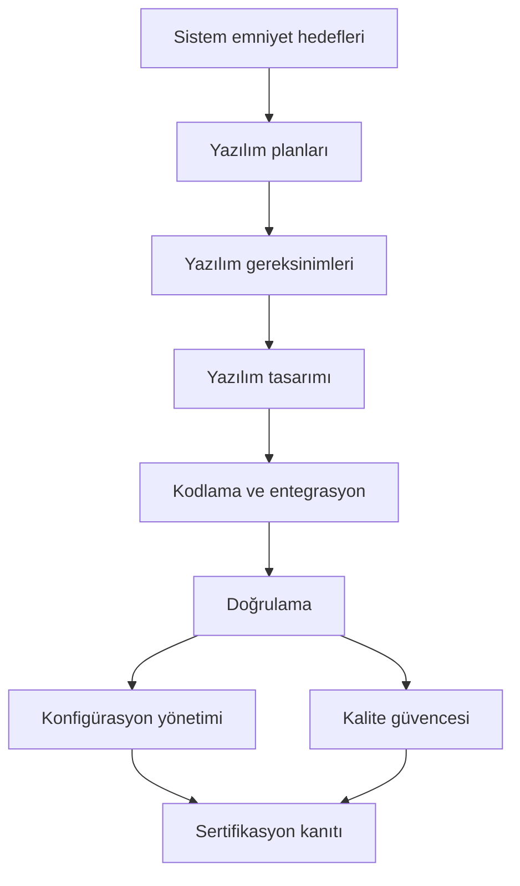

# 4. DO-178C ve Destekleyici Dokümanlara Genel Bakış

DO-178C, aviyonik yazılım için nasıl geliştirme yapılacağını adım adım emreden bir tarif
kitabı değildir; bunun yerine, emniyet-kritik yazılımın doğrulanabilir, izlenebilir ve
sertifikasyona uygun biçimde geliştirilmesi için bir çerçeve sunar. Bu nedenle belgeyi
okurken amaç, "ne yapılmalı?" sorusundan çok "hangi çıktılar gösterilmeli?" sorusuna
odaklanmaktır.

DO-178C’nin değeri, proje ekibine yalnızca teknik yönerge vermesinde değil, aynı zamanda
sertifikasyon otoritesinin beklediği kanıt dilini ortaklaştırmasında yatar. Belge;
faaliyetlerin sırasını, iş ürünlerini, gözden geçirme beklentilerini ve her seviyede
hangi amaçların karşılanması gerektiğini tarif eder.

## DO-178'in kısa tarihçesi

1970'lerin sonuna gelindiğinde yazılım, uçak sistemlerinde artık yardımcı bir unsur
olmaktan çıkıp uçuş fonksiyonlarının doğrudan parçası olmaya başlamıştı. Donanım için
yerleşmiş güvenilirlik yöntemleri (arıza oranı hesapları, yedekleme mimarileri) yazılıma
birebir uygulanamıyordu; çünkü yazılım "eskimez", hataları tasarım kaynaklıdır ve
istatistiksel arıza oranı kavramı ona iyi oturmaz. Endüstri ile otoritelerin ortak bir
dile ihtiyacı vardı. Bu ihtiyaçla RTCA (ABD tarafında) ve EUROCAE (Avrupa tarafında)
ortak komiteler kurdu; ortaya çıkan belgeler bu yüzden çift numara taşır (örneğin
DO-178C / ED-12C).

Gelişimi dört ana durak üzerinden özetlemek mümkündür:

| Sürüm | Yıl | Ana katkısı |
|---|---|---|
| DO-178 | 1982 | İlk ortak çerçeve; yazılımın kritikliğine göre kaba bir sınıflandırma |
| DO-178A | 1985 | Kademeli yazılım seviyeleri ve daha belirgin süreç/faaliyet tanımları |
| DO-178B | 1992 | Hedef tabanlı (objective-based) yaklaşım; A–E seviyeleri; amaç tabloları |
| DO-178C | 2011 | Netleştirilmiş metin; teknoloji ekleri (DO-330/331/332/333) ile modüler yapı |

**DO-178 (1982)**, konunun ilk kez ortak bir belgeye bağlanması açısından önemliydi;
ancak içerik büyük ölçüde nitelikseldi ve "iyi mühendislik pratiği" düzeyinde kalıyordu.
Yazılım, uçuş emniyetine etkisine göre yalnızca birkaç kaba kategoriye ayrılıyor, hangi
kanıtın yeterli sayılacağı büyük ölçüde projeye ve otoriteye bırakılıyordu.

**DO-178A (1985)**, ilk deneyimlerin ışığında yazılımı kademeli seviyelere ayırma
fikrini belirginleştirdi ve geliştirme ile doğrulama faaliyetlerini daha somut tanımladı.
Yine de belge, faaliyetleri belirli geliştirme yaklaşımlarına bağlı biçimde anlatıyordu;
bu da farklı yöntem kullanan projelerde yorum farklarına yol açıyordu.

**DO-178B (1992)**, bugün bildiğimiz yapının kurulduğu asıl kırılma noktasıdır. Belge,
"şu faaliyeti şöyle yap" demek yerine "şu hedefin sağlandığını göster" diyen hedef
tabanlı yaklaşıma geçti. Yazılım seviyeleri A'dan E'ye netleşti; her seviye için hangi
hedeflerin geçerli olduğu ve hangilerinin bağımsız kişilerce doğrulanması gerektiği
tablolara bağlandı. Yapısal kapsam (structural coverage) beklentileri de bu sürümle
kademelendi: en kritik
seviyede değiştirilmiş koşul/karar kapsama (modified condition/decision coverage, MC/DC)
dahil olmak üzere seviyeye göre artan kapsam ölçütleri tanımlandı. DO-178B yaklaşık
yirmi yıl boyunca fiilen tüm sivil aviyonik yazılım projelerinin ortak referansı oldu.

Bu uzun kullanım süresi, güncelleme ihtiyacını da biriktirdi. **DO-178C (2011)**
çalışmasının başlıca gerekçeleri şunlardı:

- DO-178B metnindeki bazı ifadeler farklı yorumlanabiliyordu; yıllar içinde biriken
  sık sorulan sorular ve açıklama yazıları (DO-248 serisi) bu belirsizliklerin
  giderilmesi gerektiğini gösteriyordu.
- Model tabanlı geliştirme (model-based development), nesne yönelimli teknoloji
  (object-oriented technology) ve biçimsel yöntemler (formal methods) gibi teknikler
  yaygınlaşmıştı; 1992 tarihli metin bunların nasıl ele alınacağını söylemiyordu.
- Araç kalifikasyonu (tool qualification), DO-178B içindeki kısa bölüme sığmayacak
  kadar büyümüştü; hem
  yazılım hem donanım projelerinde kullanılabilecek bağımsız bir belgeye ihtiyaç vardı.
- Amaçlar, faaliyetler ve iş ürünleri arasındaki eşleme yer yer tutarsızdı; terimlerin
  ve tabloların hizalanması gerekiyordu.

2005–2011 arasında yürütülen ortak komite çalışması (RTCA SC-205 / EUROCAE WG-71),
bilinçli bir tercihle DO-178B'nin çekirdeğini korudu: temel süreçler, seviyeler ve hedef
mantığı değişmedi. Yenilik, metnin netleştirilmesi ve teknolojiye özgü konuların ayrı
eklere (DO-330, DO-331, DO-332, DO-333) taşınmasıydı. Bu modüler yapı sayesinde ana
standart sık sık değişmek zorunda kalmadan, yeni teknikler kendi ekleri üzerinden ele
alınabilir hale geldi. Pratik sonucu şudur: DO-178B ile deneyimi olan bir ekip DO-178C'ye
geçerken süreçlerini baştan kurmaz; ama kullandığı teknikler bir ekin kapsamına
giriyorsa, o ekin hedeflerini de plan setine dahil etmek zorundadır.

## DO-178C neyi kapsar?

Standart, yazılım yaşam döngüsünü şu eksenlerde ele alır:

- planlama,
- gereksinim geliştirme,
- tasarım,
- kodlama ve entegrasyon,
- doğrulama,
- konfigürasyon yönetimi,
- kalite güvencesi,
- sertifikasyon irtibatı.

Bu eksenlerin üzerine bir de amaçlar yerleştirilir. Yani standart yalnızca görevleri
sıralamaz; her görevin sonunda neyin gösterilmiş olması gerektiğini de söyler.

## Belge ailesi

DO-178C tek başına kullanılmaz. Uygulamada onunla birlikte referans verilen birkaç
tamamlayıcı belge vardır:

| Belge | Rolü |
|---|---|
| DO-178C | Yazılım yaşam döngüsü için ana çerçeve |
| DO-278A | Yer tabanlı CNS/ATM yazılımları için DO-178C'nin karşılığı |
| DO-248C | Destekleyici materyal: sık sorulan sorular ve açıklama makaleleri |
| DO-330 | Araç kalifikasyonu (tool qualification) |
| DO-331 | Model tabanlı geliştirme ve doğrulama (model-based development and verification) |
| DO-332 | Nesne yönelimli teknoloji ve ilgili teknikler |
| DO-333 | Biçimsel yöntemler (formal methods) |

Bu ek dokümanlar, ana standardın bazı alanlarda bırakmadığı ayrıntıları tamamlar.
Örneğin model tabanlı bir akış kullanılıyorsa modelin rolünü anlatmak için DO-331,
kullanılan bir analiz aracının çıktısına güveniliyorsa o güveni temellendirmek için
DO-330 devreye girer.

## Süreç bakışı

Bu görünümde dikkat edilmesi gereken nokta, faaliyetlerin doğrusal görünmesine karşın
pratikte birbirini beslemesidir. Gereksinimlerdeki bir değişiklik tasarımı, kodlamayı ve
doğrulamayı etkiler; doğrulama bulguları ise planları ve hatta gereksinim dilini geri
besleyebilir.

## Uyumdan çok kanıt

DO-178C’nin en önemli zihinsel modeli şudur: amaç yalnızca "yazılımı geliştirmek" değil,
belirli hedeflerin sağlandığını gösterecek kanıtı üretmektir. Bu kanıt; planlar,
standartlar, gereksinimler, tasarım tanımları, kaynak kod, testler, gözden geçirme
kayıtları, kapsam sonuçları ve sorun kayıtları gibi iş ürünlerinden oluşur.

Bu yaklaşımın sonucu olarak:

- eksik izlenebilirlik bir kalite kusuru değil, doğrudan bir sertifikasyon problemi
  haline gelir,
- test faaliyetleri sadece hata bulmak için değil, hedefleri göstermek için de
  yürütülür,
- bağımsızlık beklentisi, özellikle doğrulama tarafında, organizasyon yapısını etkiler,
- her planlama kararı, sonraki iş ürünlerinin üretim biçimini değiştirir.

## Yazılım güvence seviyesi

DO-178C, yazılımın etkisine göre güvence seviyesi (software assurance level) mantığı ile
çalışır. Uçuş emniyetine etkisi arttıkça beklentiler sıkılaşır. En kritik seviyelerde
daha fazla hedef, daha güçlü bağımsızlık ve daha kapsamlı doğrulama gerekir.

Buradaki önemli nokta, güvence seviyesinin yalnızca bir etiket olmamasıdır. Seviye;

- hangi iş ürünlerinin gerekli olduğunu,
- hangi doğrulama derinliğinin beklendiğini,
- hangi bağımsızlık düzeyinin aranacağını,
- hangi kanıtların özellikle inceleneceğini

belirleyen bir çerçevedir.

## Bu kitabı nasıl okumalı?

Sonraki bölümler, DO-178C’yi katman katman açar:

- [Yazılım Planlama](./05-yazilim-planlama.md)
- [Yazılım Gereksinimleri](./06-yazilim-gereksinimleri.md)
- [Yazılım Tasarımı](./07-yazilim-tasarimi.md)
- [Yazılım Gerçekleştirme: Kodlama ve Entegrasyon](./08-yazilim-gerceklestirme-kodlama-entegrasyon.md)
- [Yazılım Doğrulama](./09-yazilim-dogrulama.md)

Bu sıralama birebir süreç akışı sunmaktan çok, standardın mantığını anlaşılır bir sırada
açmak için seçilmiştir. Önce planları, sonra iş ürünlerini, ardından bunların nasıl
doğrulanacağını ele almak, belgenin neden bu kadar sıkı bir izlenebilirlik beklediğini
anlamayı kolaylaştırır.

## Bu bölümden akılda kalması gerekenler

- DO-178C bir "nasıl kod yazılır" standardı değildir.
- Hedef tabanlı yaklaşım ve seviye mantığı DO-178B ile kuruldu; DO-178C bu çekirdeği
  korudu, metni netleştirdi ve teknolojiye özgü konuları ayrı eklere taşıdı.
- Amaç, sürecin izlenebilir ve doğrulanabilir olmasıdır.
- Ek dokümanlar, özel tekniklerin nasıl ele alınacağını tamamlar; kullanılan teknik bir
  ekin kapsamına giriyorsa o ekin hedefleri de plan setine dahil edilir.
- Kanıt üretmek, yazılım geliştirme kadar önemli bir iştir.
