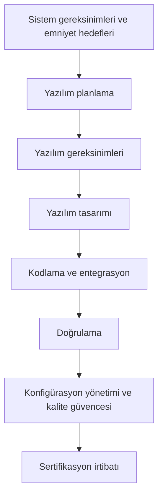

# 4. DO-178C ve Destekleyici Dokümanlara Genel Bakış

DO-178C, aviyonik yazılım için nasıl geliştirme yapılacağını adım adım emreden bir
tarif kitabı değildir; bunun yerine, emniyet-kritik yazılımın doğrulanabilir,
izlenebilir ve sertifikasyona uygun biçimde geliştirilmesi için bir çerçeve sunar.
Bu nedenle belgeyi okurken amaç, "ne yapılmalı?" sorusundan çok "hangi çıktılar
gösterilmeli?" sorusuna odaklanmaktır.

Bu bölümün amacı, standardın genel yapısını ve onu tamamlayan doküman ailesini
tanıtmak; sonraki bölümlerde ayrıntılandırılacak planlama, gereksinim, tasarım ve
doğrulama faaliyetleri için ortak bir zemin oluşturmaktır.

## DO-178C neyi kapsar?

DO-178C, yazılım yaşam döngüsündeki faaliyetleri; planlama, gereksinim geliştirme,
tasarım, kodlama, entegrasyon, doğrulama, konfigürasyon yönetimi, kalite güvencesi
ve sertifikasyon irtibatı olarak ele alır. Belgenin temel yaklaşımı, her faaliyet
sonucunda üretilen çıktıları ve bu çıktılarla gösterilmesi gereken hedefleri
(objectives) tanımlamaktır.

Standart özellikle şunlara odaklanır:

- yazılımın sistem emniyet hedefleriyle uyumlu olması,
- her önemli iş ürününün izlenebilir olması,
- doğrulamanın bağımsız ve yeterli kanıt üretmesi,
- konfigürasyonun kontrollü biçimde yönetilmesi,
- sertifikasyon otoritesine sunulacak kanıtların tutarlı olması.

## Belge ailesi

DO-178C tek başına kullanılmaz. Uygulamada onunla birlikte referans verilen birkaç
tamamlayıcı belge vardır:

| Belge | Rolü |
|---|---|
| DO-178C | Yazılım yaşam döngüsü için ana çerçeve |
| DO-330 | Araç kalifikasyonu (tool qualification) |
| DO-331 | Model tabanlı geliştirme ve doğrulama (model-based development and verification) |
| DO-332 | Nesne yönelimli teknoloji ve ilgili teknikler |
| DO-333 | Biçimsel yöntemler (formal methods) |

Bu ek dokümanlar, ana standardın bazı alanlardaki eksik bırakmadığı ayrıntıları
tamamlar. Örneğin model tabanlı bir akış kullanılıyorsa DO-331, kullanılan araçların
güvenilirliğini göstermek gerekiyorsa DO-330 devreye girer.

## Süreç bakışı

DO-178C'yi bir akış olarak düşünmek yararlıdır:

Bu görünümde dikkat edilmesi gereken nokta, faaliyetlerin doğrusal görünmesine
karşın pratikte birbirini beslemesidir. Gereksinimlerdeki bir değişiklik tasarımı,
kodlamayı ve doğrulamayı etkiler; doğrulama bulguları ise planları ve hatta gereksinim
dilini geri besleyebilir.

## Uyumdan çok kanıt

DO-178C'nin en önemli zihinsel modeli şudur: amaç yalnızca "yazılımı geliştirmek"
değil, belirli hedeflerin sağlandığını gösterecek kanıtı üretmektir. Bu kanıt;
planlar, standartlar, gereksinimler, tasarım tanımları, kaynak kod, testler, gözden
geçirme kayıtları, kapsam sonuçları ve sorun kayıtları gibi iş ürünlerinden oluşur.

Bu yaklaşımın sonucu olarak:

- eksik izlenebilirlik bir kalite kusuru değil, doğrudan bir sertifikasyon problemi
  haline gelir,
- test faaliyetleri sadece hata bulmak için değil, hedefleri göstermek için de
  yürütülür,
- bağımsızlık beklentisi, özellikle doğrulama tarafında, organizasyon yapısını
  etkiler.

## Yazılım güvence seviyesi

DO-178C, yazılımın etkisine göre güvence seviyesi (software assurance level) mantığı
ile çalışır. Uçuş emniyetine etkisi arttıkça beklentiler sıkılaşır. En kritik
seviyelerde daha fazla hedef, daha güçlü bağımsızlık ve daha kapsamlı doğrulama gerekir.

Bu konu, bu kitapta ilerleyen bölümlerde ayrıntılı olarak ele alınacaktır; burada
önemli olan, seviyenin yalnızca bir etiket değil, tüm yaşam döngüsü boyunca iş yükünü
ve kanıt derinliğini belirleyen bir çerçeve olduğudur.

## Bu kitabı nasıl okumalı?

Sonraki bölümler, DO-178C'yi yukarıdaki sıraya paralel biçimde açar:

- [Yazılım Planlama](./05-yazilim-planlama.md)
- [Yazılım Gereksinimleri](./06-yazilim-gereksinimleri.md)
- [Yazılım Tasarımı](./07-yazilim-tasarimi.md)
- [Yazılım Gerçekleştirme: Kodlama ve Entegrasyon](./08-yazilim-gerceklestirme-kodlama-entegrasyon.md)
- [Yazılım Doğrulama](./09-yazilim-dogrulama.md)

Bu sıralama birebir süreç akışı sunmaktan çok, standardın mantığını katman katman
açmak için seçilmiştir. Önce planları, sonra iş ürünlerini, ardından da bunların nasıl
doğrulanacağını ele almak, belgenin neden bu kadar sıkı bir izlenebilirlik beklediğini
anlamayı kolaylaştırır.
