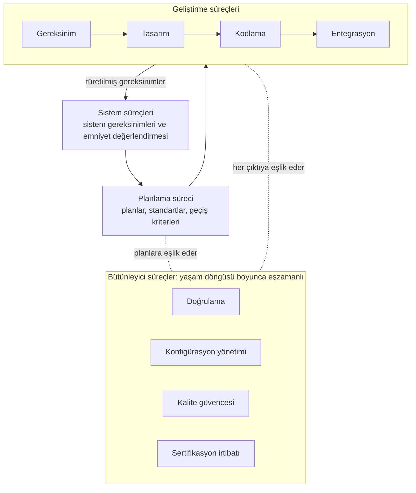

# 4. DO-178C ve Destekleyici Dokümanlara Genel Bakış

DO-178C, aviyonik yazılım için nasıl geliştirme yapılacağını adım adım emreden bir tarif
kitabı değildir; bunun yerine, emniyet-kritik yazılımın doğrulanabilir, izlenebilir ve
sertifikasyona uygun biçimde geliştirilmesi için bir çerçeve sunar. Bu bölüm standardın
tarihçesini, süreç ve hedef yapısını, yazılım seviyelerini, çevresindeki belge ailesini
ve düzenleyici konumunu özetleyerek sonraki bölümlerin zeminini kurar.

Belgeyi okurken amaç, "ne yapılmalı?" sorusundan çok "hangi çıktılar gösterilmeli?"
sorusuna odaklanmaktır. DO-178C'nin değeri, proje ekibine yalnızca teknik yönerge
vermesinde değil, aynı zamanda sertifikasyon otoritesinin (certification authority)
beklediği kanıt dilini ortaklaştırmasında yatar. Belge; yazılım yaşam döngüsü
süreçlerini, her sürecin hedeflerini (objective), üretilmesi beklenen veriyi, gözden
geçirme beklentilerini ve her seviyede hangi hedeflerin karşılanması gerektiğini tarif
eder. Faaliyetlerin sırasını ise dayatmaz: hangi yaşam döngüsü modelinin izleneceği ve
bir süreçten ötekine hangi koşulla geçileceği, projenin kendi planlarında tanımladığı
geçiş kriterlerine (transition criteria) bırakılır. Bu kriterlerin nasıl yazılabileceğini
[Ek A: Örnek Geçiş Kriterleri](../06-ekler/01-ek-a-ornek-gecis-kriterleri.md) gösterir.

## DO-178'in kısa tarihçesi

1970'lerin sonuna gelindiğinde yazılım, uçak sistemlerinde artık yardımcı bir unsur
olmaktan çıkıp uçuş fonksiyonlarının doğrudan parçası olmaya başlamıştı. Donanım için
yerleşmiş güvenilirlik yöntemleri (arıza oranı hesapları, yedekleme mimarileri) yazılıma
birebir uygulanamıyordu; çünkü yazılım "eskimez", hataları tasarım kaynaklıdır ve
istatistiksel arıza oranı kavramı ona iyi oturmaz. Endüstri ile otoritelerin ortak bir
dile ihtiyacı vardı. Bu ihtiyaçla RTCA (ABD tarafında) ve EUROCAE (Avrupa tarafında)
ortak komiteler kurdu; ortaya çıkan belgeler bu yüzden çift numara taşır (örneğin
DO-178C / ED-12C).

Gelişimi dört ana durak üzerinden özetlemek mümkündür:

| Sürüm | Yıl | Ana katkısı |
|---|---|---|
| DO-178 | 1982 | İlk ortak çerçeve; yazılımın kritikliğine göre kaba bir sınıflandırma |
| DO-178A | 1985 | Kademeli yazılım seviyeleri ve daha belirgin süreç/faaliyet tanımları |
| DO-178B | 1992 | Hedef tabanlı (objective-based) yaklaşım; A–E seviyeleri; hedef tabloları |
| DO-178C | 2011 | Netleştirilmiş metin; araç kalifikasyonu belgesi (DO-330) ve üç teknoloji eki (DO-331/332/333) ile modüler yapı |

**DO-178 (1982)**, konunun ilk kez ortak bir belgeye bağlanması açısından önemliydi;
ancak içerik büyük ölçüde nitelikseldi ve "iyi mühendislik pratiği" düzeyinde kalıyordu.
Yazılım, uçuş emniyetine etkisine göre yalnızca birkaç kaba kategoriye ayrılıyor, hangi
kanıtın yeterli sayılacağı büyük ölçüde projeye ve otoriteye bırakılıyordu.

**DO-178A (1985)**, ilk deneyimlerin ışığında yazılımı kademeli seviyelere ayırma
fikrini belirginleştirdi ve geliştirme ile doğrulama faaliyetlerini daha somut tanımladı.
Yine de belge, faaliyetleri belirli geliştirme yaklaşımlarına bağlı biçimde anlatıyordu;
bu da farklı yöntem kullanan projelerde yorum farklarına yol açıyordu.

**DO-178B (1992)**, bugün bildiğimiz yapının kurulduğu asıl kırılma noktasıdır. Belge,
"şu faaliyeti şöyle yap" demek yerine "şu hedefin sağlandığını göster" diyen hedef
tabanlı yaklaşıma geçti. Yazılım seviyeleri A'dan E'ye netleşti; her seviye için hangi
hedeflerin geçerli olduğu ve hangilerinin bağımsız kişilerce doğrulanması gerektiği
tablolara bağlandı. Yapısal kapsam (structural coverage) beklentileri de bu sürümle
kademelendi: en kritik seviyede değiştirilmiş koşul/karar kapsama (modified
condition/decision coverage, MC/DC) dahil olmak üzere seviyeye göre artan kapsam
ölçütleri tanımlandı. DO-178B yaklaşık yirmi yıl boyunca fiilen tüm sivil aviyonik
yazılım projelerinin ortak referansı oldu.

Bu uzun kullanım süresi, güncelleme ihtiyacını da biriktirdi. **DO-178C (2011)**
çalışmasının başlıca gerekçeleri şunlardı:

- DO-178B metnindeki bazı ifadeler farklı yorumlanabiliyordu; yıllar içinde biriken
  sık sorulan sorular ve açıklama yazıları (DO-248 serisi) bu belirsizliklerin
  giderilmesi gerektiğini gösteriyordu.
- Model tabanlı geliştirme (model-based development), nesne yönelimli teknoloji
  (object-oriented technology) ve biçimsel yöntemler (formal methods) gibi teknikler
  yaygınlaşmıştı; 1992 tarihli metin bunların nasıl ele alınacağını söylemiyordu.
- Araç kalifikasyonu (tool qualification), DO-178B içindeki kısa bölüme sığmayacak
  kadar büyümüştü; hem yazılım hem donanım projelerinde kullanılabilecek bağımsız bir
  belgeye ihtiyaç vardı.
- Hedefler, faaliyetler ve üretilen veri arasındaki eşleme yer yer tutarsızdı; bazı
  beklentiler metinde geçtiği hâlde hedef tablolarında görünmüyordu. Terimlerin ve
  tabloların hizalanması gerekiyordu.

2005–2011 arasında yürütülen ortak komite çalışması (RTCA SC-205 / EUROCAE WG-71),
bilinçli bir tercihle DO-178B'nin çekirdeğini korudu: temel süreçler, seviyeler ve hedef
mantığı değişmedi. Yenilik; metnin netleştirilmesi, teknolojiye özgü konuların üç ayrı
teknoloji ekine (supplement: DO-331, DO-332, DO-333) ve araç kalifikasyonunun bağımsız
bir belgeye (DO-330) taşınmasıydı. Bu modüler yapı sayesinde ana standart sık sık
değişmek zorunda kalmadan, yeni teknikler kendi ekleri üzerinden ele alınabilir hâle
geldi.

### DO-178B'den DO-178C'ye ne değişti?

Çekirdek aynı kaldığı için fark ilk bakışta küçük görünür; DO-178B bilen bir okurun
gündelik işine dokunan değişiklikler ise şunlardır:

- **Araç kalifikasyonu yeniden kuruldu.** "Geliştirme aracı / doğrulama aracı"
  ikiliğinin yerini, aracın sürece etkisine bakan üç ölçüt ve beş kademeli araç
  kalifikasyon seviyesi (tool qualification level, TQL) aldı; ayrıntı DO-330'a taşındı
  (bkz. [13. DO-330 ve Yazılım Aracı Kalifikasyonu](../04-arac-kalifikasyonu-ve-ekler/13-do330-arac-kalifikasyonu.md)).
- **Parametre verisi öğesi (parameter data item, PDI) tanımlandı.** Çalıştırılabilir
  nesne kodunu değiştirmeden yazılımın davranışını etkileyen veri dosyaları, adı konmuş
  bir yaşam döngüsü verisi oldu ve doğrulanması açıkça beklenir hâle geldi
  (bkz. [22. Konfigürasyon Verisi](../05-ozel-konular/22-konfigurasyon-verisi.md)).
- **İz verisi (trace data) ayrı bir veri öğesi oldu.** Gereksinim, tasarım, kod ve
  doğrulama arasındaki izlenebilirlik (traceability) bağları, başka belgelerin içine
  dağılmış bir özellik olmaktan çıkıp kendi başına üretilen ve denetlenen bir veri
  sayıldı.
- **Örtük beklentiler açık hedefe dönüştü.** DO-178B'nin metninde geçen ama hedef
  tablolarında yer almayan iki beklenti tablolara taşındı. Biri Seviye A'ya özgüdür:
  derleyicinin ürettiği ve kaynak koda doğrudan izlenemeyen nesne kodunun belirlenip
  doğrulanması artık ayrı bir hedeftir. Öteki kalite güvencesindedir: planların ve
  standartların geliştirilip tutarlılık açısından gözden geçirildiğine dair güvence.
  Bu iki hedefin, parametre verisi için eklenen iki doğrulama hedefinin ve tablolardaki
  yeniden düzenlemenin sonucunda Seviye A'nın hedef sayısı 66'dan 71'e çıktı.
- **Hedef tabloları faaliyetlere bağlandı.** Tablolara, her hedefi destekleyen
  faaliyetlerin atfı eklendi; "bu hedef için hangi iş öngörülüyor?" sorusu artık
  tablonun kendisinden yanıtlanabilir.
- **Dar ama etkili netleştirmeler yapıldı.** MC/DC tanımı genişledi: DO-178B'nin
  yorumu olan benzersiz neden MC/DC'nin (unique-cause MC/DC) yanında maskeleme MC/DC
  (masking MC/DC) ve kısa devre değerlendirmesi (short-circuit evaluation) de kabul
  edilir. Türetilmiş gereksinimlerin de yalnızca emniyet değerlendirme sürecine değil,
  onu da içeren sistem süreçlerine iletilmesi istenir.

Pratik sonucu şudur: DO-178B ile deneyimi olan bir ekip DO-178C'ye geçerken süreçlerini
baştan kurmaz; ama araç listesini yeni ölçütlerle yeniden sınıflandırır, iz verisini ve
parametre verisini planlarına yazar ve kullandığı teknikler bir ekin kapsamına giriyorsa
o ekin hedeflerini de plan setine dahil eder.

## DO-178C neyi kapsar?

DO-178C'nin konusu; uçakta, motorda, pervanede ve bölgeye göre yardımcı güç
ünitesinde kullanılan sistem ve ekipmanların yazılımıdır. Standart bu yazılımın yaşam
döngüsünü üç süreç grubuyla ele alır:

- **Planlama süreci (planning process):** planların ve standartların hazırlanması.
- **Geliştirme süreçleri (development processes):** gereksinim, tasarım, kodlama ve
  entegrasyon (integration).
- **Bütünleyici süreçler (integral processes):** doğrulama (verification),
  konfigürasyon yönetimi (configuration management), kalite güvencesi (quality
  assurance) ve sertifikasyon irtibatı (certification liaison).

Bu süreçlerin üzerine bir de hedefler yerleştirilir. Yani standart yalnızca görevleri
sıralamaz; her görevin sonunda neyin gösterilmiş olması gerektiğini de söyler.

Metnin düzeni de aynı gruplamayı izler. Giriş, sistemle ilişki ve yaşam döngüsü
kavramlarından sonra planlama sürecine, dört geliştirme sürecine birlikte ve
bütünleyici süreçlerin her birine ayrı birer kısım ayrılır; ardından sertifikasyon
sürecine bilgi amaçlı kısa bir bakış, yaşam döngüsü verisinin içeriği ve "ek hususlar"
(önceden geliştirilmiş yazılım, araç kalifikasyonu, alternatif yöntemler) gelir.
Hedeflerin seviyelere göre dökümü, belgenin sonundaki Ek A (Annex A) tablolarındadır.
Standardı ilk kez eline alan biri için pratik okuma sırası tersinedir: önce Ek A'da
ilgili tabloyu bulmak, sonra tablonun gösterdiği metin kısmına gitmek. Tablolar yine de
tek başına bir kontrol listesi değildir; standart, uyumun her yönünü yansıtmadıklarını
ve metnin bütünüyle birlikte okunmaları gerektiğini kendisi belirtir.

Neyin kapsam **dışında** kaldığını bilmek de aynı ölçüde önemlidir:

- Sistem gereksinimlerinin tanımlanması ve geçerlenmesi (validation), emniyet
  değerlendirmesi ve yazılım seviyesinin atanması sistem süreçlerinin işidir (ARP4754B
  ve ARP4761A). DO-178C bu süreçlerle bilgi alışverişini tarif eder, onların yerini
  tutmaz.
- Elektronik donanımın geliştirme güvencesi ayrı bir belgenin, DO-254'ün konusudur.
- Standart belirli bir programlama dili, yöntem, araç ya da yaşam döngüsü modeli
  önermez; seçim projeye aittir ve planlarda gerekçelendirilir.
- Başvuru sahibinin organizasyon yapısı, tedarikçileriyle ticari ilişkisi ve personel
  yeterlilik ölçütleri de standardın konusu değildir; otoritenin projeye ne ölçüde
  katılacağını da standart belirlemez.

Yazılımın bu sistem çerçevesindeki yeri
[2. Sistem Bağlamında Yazılım](../02-baglam/02-sistem-baglaminda-yazilim.md) bölümünde
anlatılmıştı.

## Süreç bakışı

Üç süreç grubunun birbirine göre konumu aşağıdaki gibidir. Düz oklar bilgi akışını,
kesikli çizgiler ise bir sırayı değil, eşlik ilişkisini gösterir.

```mermaid
flowchart TD
    SIS["Sistem süreçleri<br/>sistem gereksinimleri ve emniyet değerlendirmesi"]
    PLN["Planlama süreci<br/>planlar, standartlar, geçiş kriterleri"]
    subgraph GEL["Geliştirme süreçleri"]
        direction LR
        G1["Gereksinim"] --> G2["Tasarım"] --> G3["Kodlama"] --> G4["Entegrasyon"]
    end
    subgraph BUT["Bütünleyici süreçler: yaşam döngüsü boyunca eşzamanlı"]
        B1["Doğrulama"]
        B2["Konfigürasyon yönetimi"]
        B3["Kalite güvencesi"]
        B4["Sertifikasyon irtibatı"]
    end
    SIS --> PLN
    PLN --> GEL
    GEL -- "türetilmiş gereksinimler" --> SIS
    PLN -. "planlara eşlik eder" .- BUT
    GEL -. "her çıktıya eşlik eder" .- BUT
```

Bu görünümde dikkat edilmesi gereken iki nokta vardır.

Birincisi, bütünleyici süreçler geliştirmenin **ardından gelen adımlar değildir**;
planlama dahil yaşam döngüsünün tamamına eşlik eder. Planlar da gözden geçirilir,
konfigürasyon kontrolüne alınır ve kalite güvencesinin denetiminden geçer; otoriteyle
irtibat ilk planla başlar. Doğrulamayı "kod bittikten sonra yapılan test" olarak çizen
şemalar bu yüzden yanıltıcıdır: gereksinim yazıldığında gereksinim gözden geçirmesi,
tasarım çıktığında tasarım gözden geçirmesi yapılır.

İkincisi, geliştirme süreçleri art arda çizilse de akış tek yönlü değildir.
Gereksinimlerdeki bir değişiklik tasarımı, kodlamayı ve doğrulamayı etkiler; doğrulama
bulguları ise planları ve hatta gereksinim dilini geri besleyebilir. Geliştirme sırasında
ortaya çıkan türetilmiş gereksinimler (derived requirement) sistem süreçlerine geri
bildirilir; çünkü emniyet değerlendirmesinin hesaba katmadığı bir davranış
tanımlıyor olabilirler. Standart bu döngülerin hangi sırayla işleyeceğini belirlemez:
şelale, artımlı ya da yinelemeli bir model seçilebilir. Seçilen model ve geçiş
kriterleri planlara yazılır; proje de kendi yazdığı bu kurallara göre denetlenir.

## Hedef, faaliyet ve yaşam döngüsü verisi

DO-178C'yi okumanın anahtarı, üç kavram arasındaki ilişkidir:

- **Hedef:** bir sürecin sonunda gösterilmiş olması gereken şeydir. Uyum, hedefler
  üzerinden değerlendirilir.
- **Faaliyet (activity):** hedefe ulaşmak için standardın tarif ettiği iştir. Farklı bir
  yol izlenecekse bu, planlarda tanımlanır ve otoritenin onayına bağlıdır.
- **Yazılım yaşam döngüsü verisi (software life cycle data):** faaliyetin çıktısı ve
  hedefin sağlandığının kanıtıdır. Gündelik dilde "iş ürünü" de denir.

Bir örnek ilişkiyi somutlaştırır. Hedef, düşük seviyeli gereksinimlerin (low-level
requirement) yüksek seviyeli gereksinimlerle (high-level requirement) uyumlu olmasıdır.
Faaliyet, tasarım verisinin gözden geçirilmesi ve analizidir. Veri ise doğrulama
sonuçlarıdır: hangi gereksinim kümesinin hangi sürümünün neye karşı gözden geçirildiğini
ve bulguların nasıl kapandığını gösteren kayıt. Denetçi "gözden geçirme yaptınız mı?"
diye değil, "bu kayıt hedefin sağlandığını gösteriyor mu?" diye bakar; işaretlenmiş ama
neye bakıldığını söylemeyen bir kontrol listesi faaliyetin yapıldığını gösterir, hedefin
karşılandığını göstermez.

Hedefler Ek A'daki on tabloda toplanmıştır. Her satır bir hedeftir ve dört soruyu
yanıtlar: hedef hangi seviyelerde geçerlidir, hangilerinde bağımsızlıkla (independence)
karşılanmalıdır, kanıtı hangi veridir ve bu veri hangi kontrol kategorisinde (control
category) yönetilir. Kontrol kategorileri, verinin ne kadar sıkı bir konfigürasyon
yönetimine tabi olacağını belirler ve
[10. Yazılım Konfigürasyon Yönetimi](./10-yazilim-konfigurasyon-yonetimi.md) bölümünde
açıklanır.

| Tablo | Konusu | Kitapta |
|---|---|---|
| A-1 | Yazılım planlama süreci | Bölüm 5 |
| A-2 | Yazılım geliştirme süreçleri | Bölüm 6, 7 ve 8 |
| A-3 | Gereksinim sürecinin çıktılarının doğrulanması | Bölüm 6 ve 9 |
| A-4 | Tasarım sürecinin çıktılarının doğrulanması | Bölüm 7 ve 9 |
| A-5 | Kodlama ve entegrasyon süreçlerinin çıktılarının doğrulanması | Bölüm 8 ve 9 |
| A-6 | Entegrasyon sürecinin çıktılarının test edilmesi | Bölüm 9 |
| A-7 | Doğrulama sürecinin sonuçlarının doğrulanması (test kapsamı ve yapısal kapsam dahil) | Bölüm 9 ve 17 |
| A-8 | Yazılım konfigürasyon yönetimi süreci | Bölüm 10 |
| A-9 | Yazılım kalite güvencesi süreci | Bölüm 11 |
| A-10 | Sertifikasyon irtibatı süreci | Bölüm 12 |

Tablonun dağılımı standardın ağırlık merkezini de gösterir: on tablonun beşi doğrulamaya
ayrılmıştır. Geliştirme süreçleri tek tabloya sığarken, o süreçlerin çıktılarının doğru
olduğunu göstermek dört tablo, doğrulamanın kendisinin yeterli olduğunu göstermek ise
ayrı bir tablo tutar.

## Yazılım seviyesi

DO-178C, yazılımı uçuş emniyetine etkisine göre beş yazılım seviyesine (software level)
ayırır: Seviye A'dan Seviye E'ye. Seviye, yazılımın katkıda bulunabileceği en ağır
arıza durumunun (failure condition) şiddetine göre sistem emniyet değerlendirme
sürecinde belirlenir; yazılım ekibinin seçimi değildir. Eşlemenin nasıl kurulduğu
[3. Sistem Emniyet Değerlendirmesi Bağlamında Yazılım](../02-baglam/03-sistem-emniyet-degerlendirmesi-baglaminda-yazilim.md)
bölümünde anlatılmıştı. Uçuş emniyetine etki arttıkça beklentiler sıkılaşır: daha fazla
hedef, daha çok bağımsızlık ve daha derin doğrulama gerekir.

| Yazılım seviyesi | İlişkili arıza durumu şiddeti | Hedef sayısı | Bağımsızlıkla karşılanan hedef |
|---|---|---|---|
| Seviye A | Katastrofik | 71 | 30 |
| Seviye B | Tehlikeli | 69 | 18 |
| Seviye C | Majör | 62 | 5 |
| Seviye D | Minör | 26 | 2 |
| Seviye E | Emniyet etkisi yok | Otorite teyidinden sonra hedef uygulanmaz | — |

Tablodaki sayılar birkaç şeyi birden söyler:

- **A ile B arasındaki fark sayıda küçük, işte büyüktür.** Hedef sayısı yalnızca iki
  azalır: MC/DC ile kaynak koda doğrudan izlenemeyen nesne kodunun doğrulanması Seviye
  A'ya özgüdür. Asıl fark bağımsızlıktadır; bağımsızlıkla karşılanması gereken hedef
  sayısı 30'dan 18'e iner.
- **Yapısal kapsam seviyeyle kademelenir.** Satır kapsama (statement coverage) A, B ve
  C'de; karar kapsama (decision coverage) A ve B'de; MC/DC yalnızca A'da aranır. Seviye
  D'de yapısal kapsam hedefi yoktur. Ayrıntı
  [9. Yazılım Doğrulama](./09-yazilim-dogrulama.md) bölümündedir.
- **C ve D'de bağımsızlık, kalite güvencesinin bağımsızlığıdır.** Bu seviyelerde
  bağımsızlıkla işaretli hedefler kalite güvencesi hedefleridir; doğrulama hedeflerinde
  bağımsızlık A ve B'de aranır.
- **Seviye E muafiyet değil, gösterilmesi gereken bir sonuçtur.** DO-178C hedefleri
  uygulanmaz; ama yazılımın gerçekten emniyet etkisi taşımadığı emniyet
  değerlendirmesiyle gösterilmiş ve otoritece teyit edilmiş olmalıdır.

Seviye bu yüzden yalnızca bir etiket değildir; hangi verinin gerekli olduğunu, hangi
doğrulama derinliğinin beklendiğini, hangi hedeflerde bağımsızlık aranacağını ve
denetimde hangi kanıtın özellikle sorgulanacağını belirleyen çerçevedir.

Sahada aynı kavram için sıkça "DAL" dendiği duyulur. Geliştirme güvence seviyesi
(development assurance level, DAL) sistem tarafının terimidir: fonksiyona fonksiyon
geliştirme güvence seviyesi (FDAL), öğeye öğe geliştirme güvence seviyesi (IDAL) atanır.
Yazılım öğesine atanan IDAL, DO-178C'de yazılım seviyesi olarak karşılık bulur. Bu
kitapta DO-178C bağlamında hep "yazılım seviyesi" denir.

## Uyumdan çok kanıt

DO-178C'nin en önemli zihinsel modeli şudur: amaç yalnızca "yazılımı geliştirmek" değil,
belirli hedeflerin sağlandığını gösterecek kanıtı üretmektir. Bu kanıt, yazılım yaşam
döngüsü verisinin tamamıdır: planlar, standartlar, gereksinimler, tasarım tanımı, kaynak
kod, doğrulama durumları ve sonuçları, gözden geçirme kayıtları, kapsam sonuçları ve
problem raporları (problem report).

Bu verinin hepsi otoriteye gönderilmez. Asgari olarak üç belge sunulur: yazılım
sertifikasyon planı (Plan for Software Aspects of Certification, PSAC), yazılım
konfigürasyon indeksi (Software Configuration Index, SCI) ve yazılım başarı özeti
(Software Accomplishment Summary, SAS). Geri kalanı da üretilir ve kontrol altında
tutulur; talep edildiğinde ve denetimlerde gösterilir.

Bu yaklaşımın sonucu olarak:

- eksik izlenebilirlik bir kalite kusuru değil, doğrudan bir sertifikasyon problemi
  hâline gelir,
- test faaliyetleri sadece hata bulmak için değil, hedefleri göstermek için de
  yürütülür,
- bağımsızlık beklentisi rol ve görev dağılımını etkiler: bağımsızlığın arandığı
  hedeflerde doğrulayan kişi doğruladığı ürünün yazarı olamaz, ama bunun için ayrı bir
  organizasyon birimi şart değildir (Bölüm 9),
- her planlama kararı, sonraki iş ürünlerinin üretim biçimini değiştirir.

## Belge ailesi

DO-178C çoğu projede tek başına okunmaz; kullanılan tekniğe göre aşağıdaki belgelerden
biri ya da birkaçı devreye girer. Model, nesne yönelimli teknik, biçimsel yöntem ya da
kalifiye araç kullanmayan bir projede ise ana belge yeterlidir. Belgelerin tümü RTCA
tarafından 2011'de yayımlanmıştır; EUROCAE karşılıkları aynı içeriği taşır.

| Belge | EUROCAE karşılığı | Niteliği | Ne zaman devreye girer? | Kitapta |
|---|---|---|---|---|
| DO-178C | ED-12C | Ana çerçeve: süreçler, hedefler ve yaşam döngüsü verisi | Her uçak yazılımı projesinde | Bölüm 5–12 |
| DO-330 | ED-215 | Araç kalifikasyonu belgesi; teknoloji eki değildir | Bir araç bir süreci kaldırıyor, azaltıyor ya da otomatikleştiriyor ve çıktısı ayrıca doğrulanmıyorsa | [13. DO-330 ve Yazılım Aracı Kalifikasyonu](../04-arac-kalifikasyonu-ve-ekler/13-do330-arac-kalifikasyonu.md) |
| DO-331 | ED-218 | Teknoloji eki: model tabanlı geliştirme ve doğrulama (model-based development and verification) | Gereksinim ya da tasarım bir modelle ifade ediliyorsa | [14. DO-331 ve Model Tabanlı Geliştirme ve Doğrulama](../04-arac-kalifikasyonu-ve-ekler/14-do331-model-tabanli-gelistirme.md) |
| DO-332 | ED-217 | Teknoloji eki: nesne yönelimli teknoloji ve ilgili teknikler | Kalıtım, çok biçimlilik, istisna işleme ya da dinamik bellek yönetimi gibi teknikler kullanılıyorsa | [15. DO-332 ve Nesne Yönelimli Teknoloji ve İlgili Teknikler](../04-arac-kalifikasyonu-ve-ekler/15-do332-nesne-yonelimli-teknoloji.md) |
| DO-333 | ED-216 | Teknoloji eki: biçimsel yöntemler | Doğrulama kanıtının bir bölümü biçimsel analizle üretiliyorsa | [16. DO-333 ve Biçimsel Yöntemler](../04-arac-kalifikasyonu-ve-ekler/16-do333-bicimsel-yontemler.md) |
| DO-248C | ED-94C | Destekleyici bilgi: sık sorulan sorular, tartışma yazıları ve gerekçeler; yeni şart koymaz | Bir hedefin ya da ifadenin nasıl yorumlanacağı tartışıldığında | — |
| DO-278A | ED-109A | Yer tabanlı haberleşme, seyrüsefer, gözetim ve hava trafik yönetimi (CNS/ATM) yazılımı için DO-178C'nin paralel belgesi | Yazılım uçakta değil, yer sisteminde çalışıyorsa | — |

Tablodaki iki ayrım sık karıştırılır. İlki, **teknoloji eki (supplement)** ile bağımsız
belge ayrımıdır. DO-331, DO-332 ve DO-333 tek başına okunmaz; ana belgenin hedeflerine
ekleme yapar, bazılarını değiştirir ya da tekniğe uyarlar. DO-330 ise bir ek değildir:
kendi hedefleri, faaliyetleri ve veri kümesi olan, havacılık dışındaki alanlarda da
kullanılabilecek biçimde yazılmış ayrı bir belgedir. İkincisi sözcükle ilgilidir: bu
kitapta "teknoloji eki" ayrı yayımlanan bu üç belgeyi, "Ek A" ise DO-178C'nin kendi
içindeki hedef tablolarını anlatır.

Tamamlayıcı belgeler, ana standardın ayrıntıya girmediği alanları doldurur. Örneğin
model tabanlı bir akış kullanılıyorsa modelin gereksinim mi tasarım mı sayılacağını ve
hangi ek hedeflerin doğacağını DO-331 söyler; bir analiz aracının çıktısına ayrıca
doğrulamadan güveniliyorsa o güveni temellendirmek için DO-330 devreye girer.

Ailenin dışında kalan ama her projede karşılaşılan komşu belgeler de vardır: sistem
geliştirme için ARP4754B / ED-79B ve emniyet değerlendirmesi için ARP4761A / ED-135
(ikisi de 2023), elektronik donanım için DO-254 / ED-80 (2000).

## Standardın hukuki konumu

DO-178C bir yasa ya da yönetmelik değildir; RTCA ve EUROCAE çatısı altında endüstri ile
otoritelerin birlikte yazdığı bir uzlaşı belgesidir. Uçuşa elverişlilik (airworthiness)
kuralları sistemlerin emniyetli olmasını ister, yazılımın nasıl geliştirileceğini
söylemez. Aradaki bağı otoritelerin rehber dokümanları kurar: FAA'nın AC 20-115D ve
EASA'nın AMC 20-115D dokümanları (ikisi de 2017), DO-178C'yi DO-330 ve üç teknoloji
ekiyle birlikte **kabul edilebilir uyum yöntemi (acceptable means of compliance)**
olarak tanır.

Bu konumun pratikte üç sonucu vardır:

- **Tek yol değildir, ama fiilen ortak yoldur.** Başvuru sahibi başka bir yöntem
  önerebilir; ancak o yöntemin eşdeğer güvence sağladığını göstermek kendisine düşer.
  Pratikte projeler bu yükü almak yerine DO-178C'yi seçer.
- **Bağlayıcılık projenin kendi beyanından doğar.** Uyum yöntemi olarak DO-178C'nin
  seçildiği PSAC'ta yazılır ve otoriteyle mutabakata bağlanır; o andan sonra proje
  standarda ve kendi planlarına göre denetlenir.
- **Yazılım tek başına sertifikalandırılmaz.** Onay uçağa, motora ya da ekipmana
  verilir; yazılım kanıtı bu onayın bir parçasıdır. "DO-178C sertifikalı yazılım"
  ifadesi bu yüzden gevşek bir kısaltmadır: kastedilen, belirli bir sistem ve seviye
  için DO-178C hedeflerine uyumun otoriteye gösterilmiş olmasıdır.

Rehber dokümanlar yalnızca standardı tanımakla kalmaz. AC 20-115D ve AMC 20-115D,
önceki sürümlerle onaylanmış yazılımın değiştirilmesi gibi geçiş konularını da ele alır.
Belirli konular için ayrı dokümanlar yayımlanmıştır: açık problem raporlarının yönetimi
için AC 20-189 / AMC 20-189, çok çekirdekli işlemciler için AC 20-193 / AMC 20-193.
FAA'nın AC 00-69 dokümanı ile DO-248C ise yeni şart koymaz; iyi uygulamaları ve
gerekçeleri açıklar. Katılım aşaması (Stage of Involvement, SOI) denetimleri de DO-178C
metninde tanımlı değildir; otoritenin gözetimini nasıl yürüttüğüne ilişkin bir
uygulamadır ve [12. Sertifikasyon İrtibatı](./12-sertifikasyon-irtibati.md) bölümünde
ele alınır.

## Sonraki bölümler

Kısım III'ün geri kalanı, bu bölümde özetlenen süreçleri tek tek açar:

- [5. Yazılım Planlama](./05-yazilim-planlama.md)
- [6. Yazılım Gereksinimleri](./06-yazilim-gereksinimleri.md)
- [7. Yazılım Tasarımı](./07-yazilim-tasarimi.md)
- [8. Yazılım Gerçekleştirme: Kodlama ve Entegrasyon](./08-yazilim-gerceklestirme-kodlama-entegrasyon.md)
- [9. Yazılım Doğrulama](./09-yazilim-dogrulama.md)
- [10. Yazılım Konfigürasyon Yönetimi](./10-yazilim-konfigurasyon-yonetimi.md)
- [11. Yazılım Kalite Güvencesi](./11-yazilim-kalite-guvencesi.md)
- [12. Sertifikasyon İrtibatı](./12-sertifikasyon-irtibati.md)

Bu sıralama bir süreç akışı değildir; standardın mantığını anlaşılır bir sırada açmak
için seçilmiştir. Önce planları, sonra geliştirme süreçlerinin ürettiği veriyi, ardından
bu verinin nasıl doğrulandığını ve kontrol altında tutulduğunu ele almak, belgenin neden
bu kadar sıkı bir izlenebilirlik beklediğini anlamayı kolaylaştırır. Bütünleyici
süreçlerin kitapta sonda yer alması, projede sonda başladıkları anlamına gelmez. Araç
kalifikasyonu ve teknoloji ekleri ise Kısım IV'te, 13–16. bölümlerde işlenir.

## Bu bölümden akılda kalması gerekenler

- DO-178C bir "nasıl kod yazılır" standardı değildir; süreçleri, hedefleri ve beklenen
  veriyi tanımlar, faaliyet sırasını ve yaşam döngüsü modelini projenin planlarına
  bırakır.
- Hedef tabanlı yaklaşım ve seviye mantığı DO-178B ile kuruldu; DO-178C bu çekirdeği
  korudu, metni netleştirdi, teknolojiye özgü konuları üç teknoloji ekine (DO-331,
  DO-332, DO-333), araç kalifikasyonunu bağımsız bir belgeye (DO-330) taşıdı.
- Doğrulama, konfigürasyon yönetimi, kalite güvencesi ve sertifikasyon irtibatı
  bütünleyici süreçlerdir: geliştirmenin ardından gelmez, planlamadan itibaren ona eşlik
  eder.
- Uyum, Ek A tablolarındaki hedefler üzerinden değerlendirilir; her hedefin bir
  faaliyeti ve kanıtı olan bir yaşam döngüsü verisi vardır.
- Yazılım seviyesi emniyet değerlendirmesinden gelir ve hedef sayısını (A: 71, B: 69,
  C: 62, D: 26), bağımsızlığı ve yapısal kapsam derinliğini belirler.
- DO-178C yasa değildir; AC 20-115D ve AMC 20-115D ile kabul edilebilir uyum yöntemi
  olarak tanınır ve projeyi PSAC'taki beyan üzerinden bağlar.
- Kanıt üretmek, yazılım geliştirme kadar önemli bir iştir; kullanılan teknik bir ekin
  ya da DO-330'un kapsamına giriyorsa onun hedefleri de plan setine dahil edilir.
