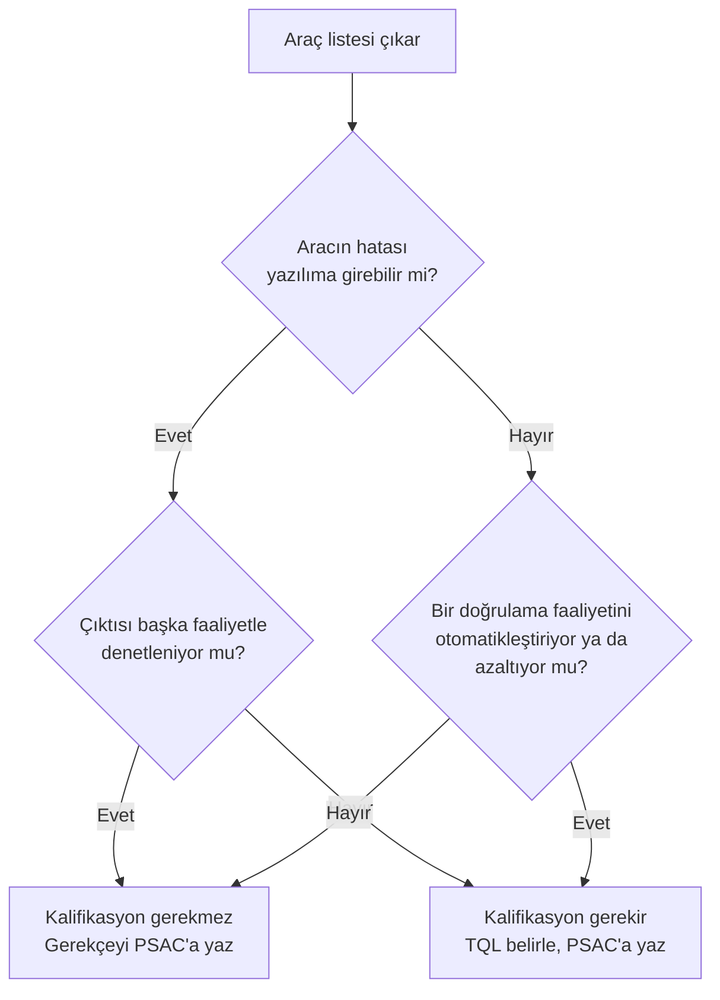

# 5. Yazılım Planlama

Yazılım planlama, projenin nasıl yönetileceğini ve hangi kanıtların üretileceğini
önceden tanımlar. PSAC, SDP, SVP, SCMP ve SQAP gibi planlar; kapsamı, sorumlulukları
ve beklenen iş ürünlerini netleştirir.

Planlama, DO-178C açısından bir idari formalite değildir. Aksine, projenin nasıl
çalışacağını, hangi kuralların uygulanacağını ve hangi kanıtların hangi sırayla
biriktirileceğini belirleyen ana sözleşmedir. Bu yüzden iyi bir plan, sonraki tüm
faaliyetlerin yanlış anlaşılmasını önleyen ortak bir referans noktasıdır.

## Planların amacı

Planlar, "ne yapıyoruz?" sorusundan çok "nasıl ve hangi disiplinle yapıyoruz?" sorusuna
cevap verir. Bu ayrım önemlidir; çünkü aynı proje içinde farklı ekipler aynı kelimeyi
farklı anlamlarda kullanabilir. Planlar bu belirsizliği azaltır.

Örneğin planlar şunları açıklar:

- hangi standartların uygulanacağını,
- hangi incelemelerin zorunlu olduğunu,
- bağımsızlığın nasıl sağlanacağını,
- araçların hangi rollerde kullanılacağını,
- konfigürasyon öğelerinin nasıl korunacağını,
- sorunların nasıl kapatılacağını.

## Ana planlar

En sık karşılaşılan planlar şunlardır:

- **PSAC**: sertifikasyon yaklaşımını ve otoriteyle ilişkiyi özetler,
- **SDP**: yazılım geliştirme kurallarını tanımlar,
- **SVP**: doğrulama kapsamını ve yöntemlerini açıklar,
- **SCMP**: konfigürasyon yönetimi yaklaşımını belirler,
- **SQAP**: kalite güvencesi faaliyetlerini tanımlar.

Bu planlar birbirinden bağımsız belgeler gibi görünse de gerçekte aynı sistemin farklı
bakış açılarıdır. Bir plandaki değişiklik diğer planları da etkileyebilir.

## Neden erken yazılmalı?

Planlar geç yazıldığında ekip çoğu kararı fiilen vermiş olur; belge ise sadece
gecikmiş bir açıklamaya dönüşür. Bu durum sertifikasyon açısından zayıftır, çünkü
kararların nasıl alındığını değil, sonradan nasıl anlatıldığını gösterir.

Erken yazılan planlar ise şu faydaları sağlar:

- ekip beklentilerini hizalar,
- rol ve sorumlulukları belirginleştirir,
- gereksinim ve test yaklaşımını baştan uyumlu hale getirir,
- dış incelemelerde sürprizleri azaltır.

## Planların içeriği

İyi bir plan tipik olarak şu soruları yanıtlar:

- Hangi yaşam döngüsü modeli izlenecek?
- Hangi iş ürünleri zorunlu?
- Hangi gözden geçirmeler yapılacak?
- Hangi bağımsızlık kuralları uygulanacak?
- Test ortamı nasıl yönetilecek?
- Sorunlar ve sapmalar nasıl ele alınacak?

Bu soruların net olması, özellikle ekip büyüdükçe önem kazanır. Çünkü planlar sadece
sertifikasyon için değil, ekip içi koordinasyon için de gereklidir.

## Üç geliştirme standardı

Planların yanında DO-178C, üç geliştirme standardının tanımlanmasını bekler:
gereksinim standardı, tasarım standardı ve kodlama standardı. Bunlar ekibin iş
ürünlerini hangi kurallara göre yazacağını belirler ve gözden geçirmelerin nesnel
ölçütü haline gelir.

Bu üç standart, planların "nasıl çalışacağız?" sorusuna verdiği cevabın teknik
karşılığıdır. Planlar süreci tarif ederken standartlar, üretilen her bir iş ürününün
kendisine bakar: gereksinim nasıl yazılır, tasarım nasıl ifade edilir, kod hangi
kurallara uyar. Gözden geçirme yapan kişi elinde bu standartlar olmadan "bence böyle
daha iyi olurdu" düzeyinde kalır; standart varsa "bu madde 4.2'ye aykırı" diyebilir.
Fark, öznel görüş ile nesnel bulgu arasındaki farktır.

### Gereksinim standardı

Gereksinim standardı (requirements standard), yüksek seviyeli gereksinimlerin nasıl
yazılacağını tanımlar. Tipik içeriği şunlardır:

- kullanılacak gereksinim yazım biçimi (örn. "Sistem ... yapmalıdır" kalıbı),
- her gereksinimin taşıması gereken nitelikler: tek bir davranışı anlatması,
  doğrulanabilir olması, belirsiz ifadelerden arınmış olması,
- yasaklı kelimeler listesi ("uygun şekilde", "hızlıca", "vb." gibi test edilemeyen
  ifadeler),
- gereksinim kimliklendirme ve izlenebilirlik kuralları,
- türetilmiş gereksinimlerin (derived requirements) nasıl işaretleneceği ve sistem
  emniyet sürecine nasıl bildirileceği,
- tolerans, birim ve zamanlama değerlerinin nasıl belirtileceği.

Sık yapılan hata, standardın "iyi gereksinim yazma" üzerine genel öğütlerle dolu olup
projeye özgü karar içermemesidir. "Gereksinimler açık olmalıdır" cümlesi bir gözden
geçirmede kullanılamaz; "her zamanlama gereksinimi milisaniye cinsinden alt ve üst
sınır içermelidir" cümlesi kullanılabilir.

### Tasarım standardı

Tasarım standardı (design standard), yazılım mimarisinin ve düşük seviyeli
gereksinimlerin ifade biçimini belirler. Tipik olarak şunları kapsar:

- mimari gösterim yöntemi (blok diyagramları, veri/kontrol akışı gösterimi),
- modülleşme ve arayüz tanımlama kuralları,
- düşük seviyeli gereksinimlerin ayrıntı düzeyi: koddan bire bir kopya olmayacak
  kadar soyut, kodlayıcıya yorum payı bırakmayacak kadar somut,
- kesme (interrupt) kullanımı, görev önceliklendirme ve zamanlama tasarımına dair
  sınırlar,
- özyineleme (recursion), dinamik bellek gibi riskli yapıların yasaklanması ya da
  hangi koşullarda serbest olduğu.

Burada en sık görülen sorun, düşük seviyeli gereksinim ayrıntı düzeyinin
tanımlanmamasıdır. Ayrıntı düzeyi ekipten ekibe değişince, aynı projede kimi modül
sözde kod (pseudocode) düzeyinde, kimi modül tek cümlelik özet düzeyinde kalır; bu da
doğrulama maliyetini öngörülemez hale getirir.

### Kodlama standardı

Kodlama standardı (coding standard), kaynak kodun uyacağı kuralları tanımlar. C ile
çalışan aviyonik projelerde genellikle MISRA C gibi yerleşik bir kural kümesi temel
alınır ve projeye özgü eklemelerle genişletilir:

- dil alt kümesi: hangi dil özelliklerinin yasak olduğu (örn. `goto`, işaretçi
  aritmetiğinin sınırlanması, örtük tip dönüşümleri),
- adlandırma, dosya düzeni ve yorum kuralları,
- karmaşıklık sınırları (örn. fonksiyon başına döngüsel karmaşıklık üst sınırı),
- derleyici uyarılarının nasıl ele alınacağı,
- sapma (deviation) mekanizması: bir kural ihlalinin hangi gerekçeyle, kimin onayıyla
  kabul edilebileceği.

Küçük bir örnek, kuralın ne kadar somut olabileceğini gösterir:

```c
/* Kural: her switch ifadesinde default dalı bulunmalı ve
   beklenmeyen değer bir hata işleyicisine raporlanmalıdır. */
switch (mod) {
    case MOD_BEKLEME:  bekleme_isle();  break;
    case MOD_CALISIYOR: calisma_isle(); break;
    default:
        hata_raporla(HATA_GECERSIZ_MOD);
        break;
}
```

Üç standardın ortak tuzağı aynıdır: standart yazılır ama uygulanmaz. Standardın
yaşaması için gözden geçirme kontrol listelerinin standarda madde madde atıf yapması
ve mümkün olan kuralların statik analiz araçlarıyla otomatik denetlenmesi gerekir.

| Standart | Neyi düzenler? | Tipik nesnel ölçüt örneği |
|---|---|---|
| Gereksinim standardı | Gereksinimlerin yazımı | Zamanlama değerleri alt/üst sınırla verilir |
| Tasarım standardı | Mimari ve düşük seviyeli gereksinimler | Dinamik bellek kullanımı yasaktır |
| Kodlama standardı | Kaynak kod | Fonksiyon başına karmaşıklık sınırı aşılamaz |

## Araç kalifikasyonu planlaması

Araç kalifikasyonu (tool qualification), bir yazılım aracının çıktısına insan
denetimi olmadan güvenilebileceğini göstermek için yapılan çalışmadır. Hangi araçların
kalifikasyon gerektirdiği sorusu bir doğrulama sorusu gibi görünse de aslında bir
planlama sorusudur: karar planlama aşamasında verilmez ve PSAC'a yazılmazsa, proje
sonunda ya beklenmedik bir kalifikasyon maliyeti ya da otoriteyle zor bir tartışma
ortaya çıkar.

Planlama aşamasında her araç için sorulacak iki temel soru vardır:

1. **Aracın çıktısı hatalı olursa bu hata yazılıma girebilir mi?** Örneğin bir kod
   üreteci hatalı kod üretirse bu kod doğrudan çalıştırılabilir nesne koduna gider.
2. **Aracın çıktısı başka bir faaliyetle zaten denetleniyor mu?** Üretilen kod, elle
   yazılmış kodla aynı gözden geçirme ve test sürecinden geçiyorsa aracın hatası
   yakalanır; kalifikasyon gerekmez.

Bu iki sorunun cevabına göre araçlar kabaca üç gruba ayrılır:

- çıktısı yazılımın parçası olan ve denetlenmeyen araçlar (örn. çıktısı ayrıca gözden
  geçirilmeyen kod üreteci) — en ağır kalifikasyon yükü,
- bir doğrulama faaliyetini otomatikleştiren ya da bir doğrulama faaliyetinin
  azaltılmasına/kaldırılmasına gerekçe olan araçlar (örn. yapısal kapsam analizi
  aracı, statik analiz aracı) — daha hafif kalifikasyon yükü,
- çıktısı zaten başka faaliyetlerle denetlenen araçlar (örn. derleyici çıktısının
  testlerle doğrulanması) — kalifikasyon gerekmez.

Kalifikasyon gerektiğine karar verilirse, gereken güvence düzeyi hem aracın rolüne hem
de yazılımın seviyesine bağlı olarak bir araç kalifikasyon seviyesi (Tool
Qualification Level, TQL) ile ifade edilir. Ayrıntılar
[DO-330 ve Yazılım Aracı Kalifikasyonu](../04-arac-kalifikasyonu-ve-ekler/13-do330-arac-kalifikasyonu.md)
bölümünde ele alınıyor; planlama açısından önemli olan, kararın kendisinin ve
gerekçesinin erken verilmesidir.



PSAC'ta her araç için en azından şunlar yer almalıdır: aracın adı ve sürümü, projedeki
rolü, kalifikasyon gerekip gerekmediği, gerekiyorsa öngörülen TQL ve kalifikasyon
verisinin nasıl üretileceği. Kalifikasyon gerekmediğine karar verilen araçlar için de
gerekçenin yazılması iyi bir alışkanlıktır; çünkü otoritenin ilk sorularından biri
genellikle "bu araca neden güveniyorsunuz?" olur.

Deneyimden gelen bir uyarı: en çok gözden kaçan araçlar, gösterişli geliştirme
araçları değil, arka plandaki küçük betiklerdir. Test sonuçlarını toplayan bir betik,
izlenebilirlik matrisini üreten bir makro ya da yapılandırma dosyalarını dönüştüren
bir araç da aynı sorgulamadan geçmelidir. Planlama aşamasında eksiksiz bir araç
envanteri çıkarmak, bu sürprizleri önlemenin en ucuz yoludur.

## Diğer planlar

Beş plan, sertifikasyon açısından beklenen çekirdeği oluşturur; ama gerçek projelerde
plan seti bununla sınırlı kalmaz. Kuruluşlar, kendi iç işleyişlerini yönetmek için ek
planlar yazar. Bunlar otoriteye sunulmak zorunda olmasa da beş planla çelişmemeli ve
gerektiğinde onlardan atıfla erişilebilir olmalıdır.

Sık karşılaşılan ek planlar şunlardır:

- **Proje yönetim planı (project management plan)**: takvim, bütçe, kaynak ataması ve
  risk yönetimi gibi konuları kapsar. DO-178C bu konularla doğrudan ilgilenmez; ancak
  gerçekçi olmayan bir takvim, en iyi yazılmış planları bile işlevsiz bırakır. Bu
  yüzden proje yönetim planındaki kilometre taşlarının, planlardaki geçiş
  kriterleriyle (transition criteria) uyumlu olması gerekir.
- **Gereksinim yönetim planı (requirements management plan)**: gereksinimlerin hangi
  araçta tutulacağını, öznitelik şemasını, değişiklik akışını ve izlenebilirlik
  bağlarının nasıl kurulacağını tanımlar. Gereksinim standardı "nasıl yazılır"
  sorusuna, gereksinim yönetim planı "nasıl yönetilir" sorusuna cevap verir.
- **Test planı (test plan)**: SVP'nin çizdiği çerçeveyi somutlaştırır; test
  ortamlarını, test donanımını, test kampanyalarının sırasını ve sorumluluklarını
  ayrıntılandırır. Küçük projelerde bu içerik doğrudan SVP içinde de verilebilir.
- **Entegrasyon planı, laboratuvar/ortam planı** gibi belgeler: hedef donanım
  üzerinde çalışma, test düzeneklerinin bakımı ve ortam konfigürasyonunun korunması
  gibi pratik konuları düzenler.

Bu belgelerle beş plan arasındaki ilişkiyi kurarken iki hataya dikkat edilmelidir:

1. **Aynı bilgiyi iki yerde tanımlamak.** Örneğin değişiklik onay akışı hem SCMP'de
   hem gereksinim yönetim planında farklı anlatılırsa, ekip hangisine uyacağını
   bilemez. Kural basittir: her konu tek bir belgede tanımlanır, diğer belgeler ona
   atıf yapar.
2. **Ek planları görünmez tutmak.** Otorite ya da müşteri denetimi sırasında ekip
   fiilen gereksinim yönetim planındaki akışa göre çalışıyorsa, bu belgenin varlığı ve
   beş planla ilişkisi PSAC'ta ya da ilgili planda anılmalıdır. Görünmeyen bir plan,
   denetimde "tanımsız süreç" izlenimi verir.

Özetle ek planlar, beş planın alternatifi değil tamamlayıcısıdır. İyi kurgulanmış bir
plan setinde okuyucu, hangi sorunun cevabının hangi belgede olduğunu tahmin edebilir;
kötü kurgulanmış bir sette ise aynı cevabın üç farklı sürümü üç farklı belgede yaşar.

## Planlara kısa örnek

- SDP, kodlama ve tasarım kurallarını tanımlar.
- SVP, hangi test seviyelerinin kullanılacağını açıklar.
- SCMP, hangi değişikliklerin nasıl onaylanacağını söyler.

## Bu bölümden akılda kalması gerekenler

- Planlama, sonradan belge yazma işi değildir; projenin çalışma biçimidir.
- Ana planlar birlikte okunmalı ve uyumlu olmalıdır.
- Erken planlama, doğrulama ve sertifikasyon riskini azaltır.
- Üç geliştirme standardı, gözden geçirmelerin nesnel ölçütüdür; projeye özgü ve
  denetlenebilir kurallar içermelidir.
- Araç kalifikasyonu kararı planlama aşamasında verilir ve gerekçesiyle birlikte
  PSAC'a yazılır; küçük betikler de araç envanterine dahildir.
- Ek planlar beş planı tamamlar; her konu tek belgede tanımlanmalı, diğerleri ona
  atıf yapmalıdır.
