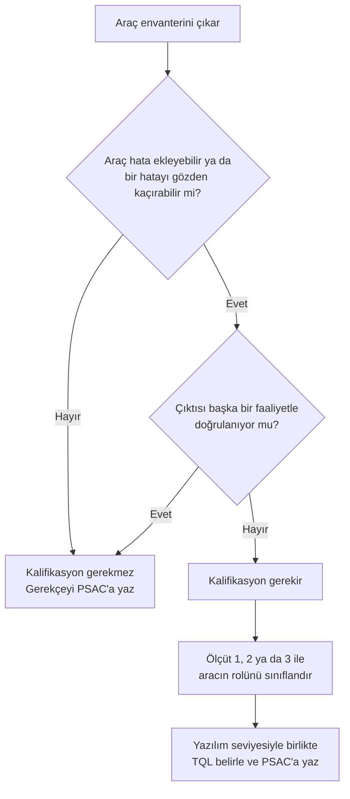

# 5. Yazılım Planlama

Yazılım planlama, projenin nasıl yürütüleceğini ve hangi kanıtların üretileceğini iş
başlamadan tanımlar. Bu bölüm beş yazılım planını, üç geliştirme standardını, geçiş
kriterlerini, yaşam döngüsü ortamını ve araç kalifikasyonu kararlarını ele alır.

Planlama, DO-178C açısından bir idari formalite değildir. Aksine, projenin nasıl
çalışacağını, hangi kuralların uygulanacağını ve hangi kanıtların hangi sırayla
biriktirileceğini belirleyen ana sözleşmedir. Bu yüzden iyi bir plan, sonraki tüm
faaliyetlerin yanlış anlaşılmasını önleyen ortak bir referans noktasıdır.

## Planların amacı

Planlar, "ne yapıyoruz?" sorusundan çok "nasıl ve hangi disiplinle yapıyoruz?" sorusuna
cevap verir. Bu ayrım önemlidir; çünkü aynı proje içinde farklı ekipler aynı kelimeyi
farklı anlamlarda kullanabilir. Planlar bu belirsizliği azaltır.

Plan seti birlikte okunduğunda şu soruların cevabı bulunabilmelidir:

- Hangi yaşam döngüsü modeli izlenecek, bir süreçten diğerine hangi koşulla geçilecek?
- Hangi yaşam döngüsü verisi (software life cycle data) üretilecek ve bu veri hangi
  standartlara göre yazılacak?
- Hangi gözden geçirmeler, analizler ve testler yapılacak; bağımsızlık (independence)
  nerede ve nasıl sağlanacak?
- Araçlar hangi rollerde kullanılacak, geliştirme ve test ortamı nasıl yönetilecek?
- Konfigürasyon öğeleri nasıl korunacak, problemler ve plandan sapmalar nasıl ele
  alınacak?

Bu soruların net olması, özellikle ekip büyüdükçe önem kazanır. Çünkü planlar sadece
sertifikasyon için değil, ekip içi koordinasyon için de gereklidir.

## Neden erken yazılmalı?

Planlar geç yazıldığında ekip çoğu kararı fiilen vermiş olur; belge ise sadece
gecikmiş bir açıklamaya dönüşür. Bu durum sertifikasyon açısından zayıftır, çünkü
kararların nasıl alındığını değil, sonradan nasıl anlatıldığını gösterir.

Erken yazılan planlar ise şu faydaları sağlar:

- ekip beklentilerini hizalar,
- rol ve sorumlulukları belirginleştirir,
- gereksinim ve test yaklaşımını baştan uyumlu hâle getirir,
- otorite ve müşteri denetimlerinde sürprizleri azaltır.

## Ana planlar

DO-178C beş plan bekler. Her biri ayrı bir soruya cevap verir ve ayrı bir okur kitlesine
seslenir:

| Plan | Yanıtladığı soru | Ayrıntısı |
|---|---|---|
| Yazılım sertifikasyon planı (Plan for Software Aspects of Certification, PSAC) | Standarda uyum otoriteye nasıl gösterilecek? | [12. Sertifikasyon İrtibatı](12-sertifikasyon-irtibati.md) |
| Yazılım geliştirme planı (Software Development Plan, SDP) | Yazılım hangi yaşam döngüsü, yöntem ve ortamla geliştirilecek? | Bu bölüm ve 6–8. bölümler |
| Yazılım doğrulama planı (Software Verification Plan, SVP) | Ürünün doğruluğu hangi yöntemlerle ve kim tarafından gösterilecek? | [9. Yazılım Doğrulama](09-yazilim-dogrulama.md) |
| Yazılım konfigürasyon yönetimi planı (Software Configuration Management Plan, SCMP) | Veri nasıl tanımlanacak, korunacak ve kontrollü biçimde değiştirilecek? | [10. Yazılım Konfigürasyon Yönetimi](10-yazilim-konfigurasyon-yonetimi.md) |
| Yazılım kalite güvencesi planı (Software Quality Assurance Plan, SQAP) | Süreçlerin planlara uyduğu nasıl ve kim tarafından güvence altına alınacak? | [11. Yazılım Kalite Güvencesi](11-yazilim-kalite-guvencesi.md) |

### Yazılım sertifikasyon planı (PSAC)

PSAC, sertifikasyon otoritesiyle varılacak mutabakatın yazılı hâlidir ve beş plan
içinde otoriteye sunulması beklenen plandır. Ayrıntıya girmez; otoritenin "bu projede
neye dikkat etmeliyim?" sorusunu cevaplar. Tipik içeriği şöyledir:

- sistemin ve yazılımın kısa tanıtımı: yazılımın hangi işlevi yerine getirdiği, hangi
  donanımda çalıştığı, emniyet ve yazılım bölümlemesi (software partitioning)
  yaklaşımı,
- sertifikasyon hususları: yazılım seviyesi (software level) ve bunun sistem emniyet
  değerlendirme sürecindeki dayanağı
  ([3. Sistem Emniyet Değerlendirmesi Bağlamında Yazılım](../02-baglam/03-sistem-emniyet-degerlendirmesi-baglaminda-yazilim.md)),
  uyumun hangi belgelere göre gösterileceği, hangi teknoloji eklerinin (supplement)
  uygulanacağı,
- izlenecek yaşam döngüsünün ve diğer planların özeti,
- üretilecek yaşam döngüsü verisi; hangisinin otoriteye sunulacağı, hangisinin talep
  edildiğinde gösterileceği,
- takvim ve otoritenin sürece katılacağı noktalar,
- ek hususlar (additional considerations): araç kalifikasyonu, önceden geliştirilmiş
  yazılım (previously developed software, PDS), ticari hazır yazılım (commercial
  off-the-shelf, COTS), devre dışı bırakılmış kod (deactivated code), sahada
  yüklenebilir yazılım (field-loadable software), kullanıcı tarafından değiştirilebilir
  yazılım (user-modifiable software), parametre verisi öğesi (parameter data item,
  PDI), alternatif yöntemler,
- tedarikçi kullanılıyorsa gözetim yaklaşımı.

En pahalı hata, ek hususları eksik bildirmektir. PSAC'ta anılmayan bir kod üreteci (code generator) ya
da yeniden kullanılan bir bileşen son denetimde ortaya çıkarsa, tartışma projenin en
az esnek olduğu anda yapılır.

### Yazılım geliştirme planı (SDP)

SDP, geliştirme ekibinin çalışma kılavuzudur ve üç şeyi tanımlar: yazılım yaşam
döngüsünü (süreçler, aralarındaki ilişki ve geçiş kriterleri), kullanılacak standartları
ve geliştirme ortamını (gereksinim ve tasarım yöntemleri, programlama dili, derleyici,
bağlayıcı, yükleyici, diğer araçlar ve bunların çalıştığı donanım platformları).
Gereksinim, tasarım ve kod kurallarının kendisi SDP'de değil standartlarda yer alır; SDP
onlara atıf yapar. Küçük projelerde standartlar SDP ile aynı belgede paketlenebilir; o
durumda da kurallar numaralı ve atıf yapılabilir kalmalıdır.

### Yazılım doğrulama planı (SVP)

SVP, doğrulama hedeflerinin (objective) nasıl karşılanacağını anlatır: doğrulama organizasyonu ve
bağımsızlığın hangi faaliyette kim tarafından sağlanacağı; gözden geçirme, analiz ve
test yöntemleri; doğrulama ortamı (test donanımı, emülatör, simülatör, araçlar);
doğrulama faaliyetlerine giriş için geçiş kriterleri; değişiklik sonrası yeniden
doğrulama yaklaşımı ve derleyiciye ilişkin varsayımlar. Bölümleme kullanılıyorsa
bütünlüğünün nasıl doğrulanacağı da burada yer alır.

Zayıf bir SVP "yazılım test edilecektir" düzeyinde kalır. Denetçi ise somut cevap arar:
yapısal kapsam (structural coverage) hangi araçla ölçülecek, kapsanmayan kod nasıl
çözümlenecek, hangi testler hedef donanımda koşulacak?

### Yazılım konfigürasyon yönetimi planı (SCMP)

SCMP; konfigürasyon tanımlama kurallarını (adlandırma, sürümleme), temel çizgileri
(baseline), problem raporlama (problem reporting) ve değişiklik kontrolü akışını,
konfigürasyon durum muhasebesini (configuration status accounting), arşivleme, geri
getirme ve sürüm teslimini, yazılım yükleme kontrolünü ve yaşam döngüsü ortamının
kontrolünü tanımlar. Hangi verinin hangi kontrol kategorisinde (control category)
yönetileceği ve tedarikçi verisinin nasıl kontrol edileceği de buradadır. Sık sorulan
bir soru, problem raporunun hangi andan itibaren zorunlu olduğudur: gözden geçirme
bulgusu ile problem raporu arasındaki sınırı SCMP çizer.

### Yazılım kalite güvencesi planı (SQAP)

SQAP; kalite güvencesinin yetkisini, sorumluluğunu ve bağımsızlığını, yapacağı
faaliyetleri (süreç denetimleri, geçiş kriterlerinin izlenmesi, yazılım uygunluk gözden
geçirmesi), bu faaliyetlerin zamanını, uygunsuzlukların nasıl kaydedilip kapatılacağını
ve tutulacak kayıtları tanımlar. Yazılım uygunluk gözden geçirmesi (software conformity
review), sertifikasyona sunulan sürüm için süreçlerin tamamlandığını, verinin eksiksiz
olduğunu ve çalıştırılabilir nesne kodunun kontrol altında ve yeniden üretilebilir
olduğunu gösteren kapanış denetimidir. Tipik zayıflık ölçülemeyen taahhüttür: "kalite
güvencesi tüm faaliyetleri izler" cümlesi ne planlanabilir ne de denetlenebilir; "her
temel çizgi öncesinde geçiş kriterleri kontrol listesiyle denetlenir" cümlesi ikisini
de sağlar.

### Planlar arasındaki ilişki

Bu planlar birbirinden bağımsız belgeler gibi görünse de gerçekte aynı sistemin farklı
bakış açılarıdır. SVP'nin vaat ettiği bağımsızlık organizasyon yapısıyla, SDP'deki geçiş
kriterleri SQAP'taki denetim noktalarıyla, SVP'deki test hatası akışı SCMP'deki problem
raporlamayla örtüşmelidir. Bir plandaki değişiklik bu yüzden diğer planları da
etkileyebilir.

Beş plan beş ayrı belge olmak zorunda da değildir. Küçük projelerde bazıları tek
belgede birleştirilir, büyük kuruluşlarda ise ortak kurum süreçlerine atıf yapan ince
proje planları yazılır. Belirleyici olan paketleme değil, beklenen içeriğin bulunabilir
ve tutarlı olmasıdır. Tek çekince şudur: bazı otoriteler PSAC'ı ve yazılım başarı
özetini ayrı belgeler olarak görmek isteyebilir.

Beş plan A'dan D'ye bütün yazılım seviyelerinde beklenir; seviyeyle değişen, yedi
planlama hedefinden kaçının arandığıdır. Seviye A, B ve C'de yedisi de geçerlidir.
Seviye D'de yalnızca ikisi aranır: yaşam döngüsü süreçlerinin faaliyetlerinin
tanımlanması ve ek hususların ele alınması (Ek A'nın planlama tablosunda 1. ve 4.
hedef). Yaşam döngüsünün ve geçiş kriterlerinin belirlenmesi, yaşam döngüsü ortamının
seçilip tanımlanması, geliştirme standartlarının tanımlanması, planların standarda
uyumu ve planların eşgüdümü Seviye D'de başvuru sahibinin takdirine bırakılır; üç
geliştirme standardı da bu seviyede beklenen veri arasında değildir. Kalite güvencesi
tarafı bununla uyumludur: Seviye D'de süreçlerin onaylı planlara uyduğuna ve yazılım
uygunluk gözden geçirmesinin yapıldığına dair güvence istenir; planların ve
standartların gözden geçirilmesi, standartlara uyum ve geçiş kriterlerinin sağlanması
için ayrıca güvence istenmez. Bu, düşük seviyede standart ya da geçiş kriteri
tanımlamanın yararsız olduğu anlamına gelmez; yalnızca standardın o seviyede bunları
şart koşmadığını gösterir.

## Yaşam döngüsü ve geçiş kriterleri

DO-178C belirli bir yaşam döngüsü modeli (life cycle model) dayatmaz. Şelale, artımlı
ya da yinelemeli bir model seçmek projenin kararıdır; SDP modeli tarif eder, PSAC
özetler. Standart süreçleri ve birbirlerini nasıl beslediklerini tanımlar; hangi
sırayla ve hangi geri beslemeyle yürüyeceklerini planlara bırakır. Bütünleyici süreçler
(integral processes) — doğrulama, konfigürasyon yönetimi, kalite güvencesi ve
sertifikasyon irtibatı — bu sıranın bir adımı değildir; geliştirmeyle eşzamanlı yürür.

Sırayı belirleyen araç geçiş kriterleridir (transition criteria): bir sürece girmek
için sağlanması gereken koşullar. İyi bir kriter, bir kaydın varlığıyla denetlenebilir.
"Gereksinimler yeterince olgunlaşınca tasarıma başlanır" cümlesi denetlenemez; "tasarımı
yapılacak işlevin yüksek seviyeli gereksinimleri gözden geçirilmiş, bulguları kapatılmış
ve temel çizgiye alınmıştır" cümlesi denetlenebilir.

Kriter yazarken iki noktaya dikkat edilir:

- **Kriter, ekibin gerçekte nasıl çalışacağını yansıtmalıdır.** Bir sürecin başlaması
  için girdilerinin tümünün tamamlanmış olması gerekmez; kriter işlev ya da artım
  bazında tanımlanabilir. Kâğıt üzerinde katı bir şelale tarif edip fiilen artımlı
  çalışan ekip, her denetimde planından sapmış görünür.
- **Kriterler yalnızca geliştirme süreçleri için yazılmaz.** Kredi alınacak testlerin
  hangi koşulda başlayabileceği (kod temel çizgiye alınmış mı, test prosedürleri gözden
  geçirilmiş mi, test ortamı kayıtlı mı) en az tasarıma geçiş kadar önemlidir.

Kriterlerin sağlandığını izlemek kalite güvencesinin işidir; bu yüzden her kriterin
arkasında gösterilebilir bir kayıt bulunmalıdır. Süreçler arası her geçiş için örnek
kriterler [Ek A: Örnek Geçiş Kriterleri](../06-ekler/01-ek-a-ornek-gecis-kriterleri.md)
sayfasındadır.

## Üç geliştirme standardı

Planların yanında DO-178C, Seviye A, B ve C'de üç geliştirme standardının
tanımlanmasını bekler: gereksinim standardı, tasarım standardı ve kodlama standardı.
Bunlar ekibin iş ürünlerini hangi kurallara göre yazacağını belirler ve gözden
geçirmelerin nesnel ölçütü hâline gelir.

Bu üç standart, planların "nasıl çalışacağız?" sorusuna verdiği cevabın teknik
karşılığıdır. Planlar süreci tarif ederken standartlar, üretilen her bir iş ürününün
kendisine bakar: gereksinim nasıl yazılır, tasarım nasıl ifade edilir, kod hangi
kurallara uyar. Gözden geçirme yapan kişi elinde bu standartlar olmadan "bence böyle
daha iyi olurdu" düzeyinde kalır; standart varsa "bu madde 4.2'ye aykırı" diyebilir.
Fark, öznel görüş ile nesnel bulgu arasındaki farktır.

### Gereksinim standardı

Gereksinim standardı (requirements standard), yüksek seviyeli gereksinimlerin nasıl
yazılacağını tanımlar. Tipik içeriği şunlardır:

- kullanılacak gereksinim yazım biçimi (örn. "Yazılım, ... olduğunda ... yapmalıdır"
  kalıbı),
- her gereksinimin taşıması gereken nitelikler: tek bir davranışı anlatması,
  doğrulanabilir olması, belirsiz ifadelerden arınmış olması,
- yasaklı kelimeler listesi ("uygun şekilde", "hızlıca", "vb." gibi test edilemeyen
  ifadeler),
- gereksinim kimliklendirme ve izlenebilirlik (traceability) kuralları,
- türetilmiş gereksinimlerin (derived requirements) nasıl işaretleneceği ve sistem
  emniyet değerlendirme süreci dahil sistem süreçlerine nasıl iletileceği,
- tolerans, birim ve zamanlama değerlerinin nasıl belirtileceği.

Sık yapılan hata, standardın "iyi gereksinim yazma" üzerine genel öğütlerle dolu olup
projeye özgü karar içermemesidir. "Gereksinimler açık olmalıdır" cümlesi bir gözden
geçirmede kullanılamaz; "her zamanlama gereksinimi milisaniye cinsinden alt ve üst
sınır içermelidir" cümlesi kullanılabilir. Standardın gereksinim yazımında nasıl
kullanıldığı [6. Yazılım Gereksinimleri](06-yazilim-gereksinimleri.md) bölümünde
işleniyor.

### Tasarım standardı

Tasarım standardı (design standard), yazılım mimarisinin ve düşük seviyeli
gereksinimlerin ifade biçimini belirler. Tipik olarak şunları kapsar:

- mimari gösterim yöntemi (blok diyagramları, veri/kontrol akışı gösterimi),
- modülleşme ve arayüz tanımlama kuralları,
- düşük seviyeli gereksinimlerin (low-level requirement) ayrıntı düzeyi: koddan bire bir kopya olmayacak
  kadar soyut, kodlayıcıya yorum payı bırakmayacak kadar somut,
- kesme (interrupt) kullanımı, görev önceliklendirme, çizelgeleme ve zamanlama
  tasarımına dair sınırlar,
- özyineleme (recursion), dinamik bellek gibi riskli yapıların yasaklanması ya da
  hangi koşullarda serbest olduğu.

Burada en sık görülen sorun, düşük seviyeli gereksinim ayrıntı düzeyinin
tanımlanmamasıdır. Ayrıntı düzeyi ekipten ekibe değişince, aynı projede kimi modül
sözde kod (pseudocode) düzeyinde, kimi modül tek cümlelik özet düzeyinde kalır; bu da
doğrulama maliyetini öngörülemez hâle getirir. Ayrıntı düzeyi tartışması
[7. Yazılım Tasarımı](07-yazilim-tasarimi.md) bölümünde sürüyor.

### Kodlama standardı

Kodlama standardı (coding standard), kaynak kodun uyacağı kuralları tanımlar. C ile
çalışan aviyonik projelerde genellikle MISRA C gibi yerleşik bir kural kümesi temel
alınır ve projeye özgü eklemelerle genişletilir. Kural kümesinin hangi sürümünün esas
alındığı standartta açıkça yazılır ve statik analiz aracının o sürümü desteklediği
planlama sırasında kontrol edilir. Tipik içerik şöyledir:

- dil alt kümesi: hangi dil özelliklerinin yasak olduğu (örn. `goto`, işaretçi
  aritmetiğinin sınırlanması, örtük tip dönüşümleri),
- adlandırma, dosya düzeni ve yorum kuralları,
- karmaşıklık sınırları (örn. fonksiyon başına çevrimsel karmaşıklık (cyclomatic
  complexity) üst sınırı),
- derleyici uyarılarının nasıl ele alınacağı,
- sapma (deviation) mekanizması: bir kural ihlalinin hangi gerekçeyle, kimin onayıyla
  kabul edilebileceği.

Küçük bir örnek, kuralın ne kadar somut olabileceğini gösterir:

```c
/* Kural: her switch ifadesinde default dalı bulunmalı ve
   beklenmeyen değer bir hata işleyicisine raporlanmalıdır. */
switch (mod) {
    case MOD_BEKLEME:
        bekleme_isle();
        break;
    case MOD_CALISIYOR:
        calisma_isle();
        break;
    default:
        hata_raporla(HATA_GECERSIZ_MOD);
        break;
}
```

Böyle bir kuralın doğrulamaya da yansıması vardır: savunmacı `default` dalına
gereksinim tabanlı testlerle ulaşılamayabilir ve yapısal kapsam analizinde gerekçe
ister. Bu durumun nasıl ele alınacağı
[17. Kapsanmayan Kodlar: Ölü, Gereksiz ve Devre Dışı Bırakılmış Kodlar](../05-ozel-konular/17-kapsanmayan-kodlar.md)
bölümünde, standardın kodlama sırasında uygulanması ise
[8. Yazılım Gerçekleştirme: Kodlama ve Entegrasyon](08-yazilim-gerceklestirme-kodlama-entegrasyon.md)
bölümünde anlatılıyor.

Üç standardın ortak tuzağı aynıdır: standart yazılır ama uygulanmaz. Standardın
yaşaması için gözden geçirme kontrol listelerinin standarda madde madde atıf yapması
ve mümkün olan kuralların statik analiz araçlarıyla otomatik denetlenmesi gerekir.

| Standart | Neyi düzenler? | Tipik nesnel ölçüt örneği |
|---|---|---|
| Gereksinim standardı | Gereksinimlerin yazımı | Zamanlama değerleri alt/üst sınırla verilir |
| Tasarım standardı | Mimari ve düşük seviyeli gereksinimler | Dinamik bellek kullanımı yasaktır |
| Kodlama standardı | Kaynak kod | Fonksiyon başına karmaşıklık sınırı aşılamaz |

## Yaşam döngüsü ortamının planlanması

Yazılım yaşam döngüsü ortamı (software life cycle environment), yazılımı geliştirmek,
doğrulamak, kontrol altında tutmak ve üretmek için kullanılan yöntem, araç ve
donanımların bütünüdür. Ortam seçimi bir satın alma kararı gibi görünse de sonraki
bütün doğrulama işinin maliyetini belirlediği için planlama kararıdır.

- **Dil, derleyici ve derleme seçenekleri.** Uçağa yüklenen ve doğrulanması gereken
  ürün çalıştırılabilir nesne kodu olduğundan, derleyicinin sürümü kadar hangi
  seçeneklerle ve hangi eniyileme (optimization) düzeyinde kullanılacağı da planlanır. Seviye A'da kaynak
  koda doğrudan izlenemeyen nesne kodu ek doğrulama gerektirdiği için bu seçim doğrudan
  iş yüküne dönüşür.
- **Geliştirme araçları.** Gereksinim yönetimi, modelleme ve kod üretimi araçları hem
  standartlarla (araç hangi gösterimi destekliyor?) hem de araç kalifikasyonu kararıyla
  birlikte düşünülür.
- **Test ortamı.** Hangi testin hedef donanımda, hangisinin emülatör ya da ana
  bilgisayar simülasyonunda koşulacağı SVP'de belirlenir. Hedef dışı bir ortamdan kredi
  alınacaksa, o ortamla hedef arasındaki farkların hata yakalama ve işlevi doğrulama
  yeteneğine etkisi değerlendirilir; o ortamda yakalanamayacak hataların hangi doğrulama
  faaliyetiyle yakalanacağı SVP'ye yazılır. Donanım arayüzleri ve zamanlama gibi yalnızca
  hedefte ortaya çıkabilecek hatalar için seçilmiş testler entegre hedef ortamında
  koşulacak biçimde planlanır.

Seçilen ortam, sürümleri ve ayarlarıyla birlikte yazılım yaşam döngüsü ortam
konfigürasyon indeksine (Software Life Cycle Environment Configuration Index, SECI)
kaydedilir. Proje ortasında derleyici sürümünü ya da derleme seçeneklerini değiştirmek,
önceki test ve kapsam sonuçlarının geçerliliğini sorgulatır; bu yüzden böyle bir
değişikliğin nasıl değerlendirileceği de baştan planlanır. Dil ve derleyici seçimindeki
ölçütler 8. bölümde, ortamın kayıt altına alınması
[10. Yazılım Konfigürasyon Yönetimi](10-yazilim-konfigurasyon-yonetimi.md) bölümünde
ayrıntılı işleniyor.

## Araç kalifikasyonu planlaması

Araç kalifikasyonu (tool qualification), bir yazılım aracının çıktısına, o çıktı
ayrıca doğrulanmadan güvenilebileceğini göstermek için yapılan çalışmadır. Hangi
araçların kalifikasyon gerektirdiği sorusu bir doğrulama sorusu gibi görünse de aslında
bir planlama sorusudur: karar planlama aşamasında verilmez ve PSAC'a yazılmazsa, proje
sonunda ya beklenmedik bir kalifikasyon maliyeti ya da otoriteyle zor bir tartışma
ortaya çıkar.

Planlama aşamasında her araç için sorulacak iki temel soru vardır:

1. **Araç yazılıma hata ekleyebilir ya da var olan bir hatayı gözden kaçırabilir mi?**
   Bir kod üreteci hatalı kod üretirse bu kod doğrudan çalıştırılabilir nesne koduna
   gider; bir test aracı başarısız bir testi başarılı gösterebilir.
2. **Aracın çıktısı başka bir faaliyetle zaten doğrulanıyor mu?** Üretilen kod, elle
   yazılmış kodla aynı gözden geçirme ve test sürecinden geçiyorsa ya da test aracının
   sonuçları bir mühendis tarafından ayrıca kontrol ediliyorsa aracın hatası yakalanır;
   kalifikasyon gerekmez.

Kalifikasyon yalnızca ilk sorunun cevabı "evet", ikincisinin cevabı "hayır" olduğunda
gerekir; bu koşul geliştirme araçları kadar doğrulama araçları için de geçerlidir.
Derleyici, kalifikasyon gerekmeyen durumun bilinen örneğidir: ürettiği nesne kodu
testlerle doğrulandığı için genellikle kalifiye edilmez.

Kalifikasyon gereken araçlar, projedeki rollerine göre üç ölçütten birine girer:

- **Ölçüt 1:** çıktısı uçuş yazılımının parçası olan, dolayısıyla hata ekleyebilen araç
  (örn. çıktısı ayrıca gözden geçirilmeyen kod üreteci) — en ağır kalifikasyon yükü.
- **Ölçüt 2:** doğrulamayı otomatikleştiren ve çıktısı başka geliştirme ya da doğrulama
  faaliyetlerini kaldırmanın ya da azaltmanın gerekçesi olarak kullanılan araç (örn.
  sonucuna dayanılarak bazı testlerden vazgeçilen bir statik analiz aracı).
- **Ölçüt 3:** kendi kullanım amacı içinde bir hatayı gözden kaçırabilen, ama başka bir
  faaliyetin azaltılmasına gerekçe yapılmayan araç (örn. yapısal kapsam analizi aracı)
  — en hafif kalifikasyon yükü.

Ölçüt, yazılım seviyesiyle birleşerek araç kalifikasyon seviyesini (Tool Qualification
Level, TQL) verir: Ölçüt 1'de Seviye D'den A'ya doğru TQL-4'ten TQL-1'e sıkılaşır,
Ölçüt 2'de Seviye A ve B için TQL-4, C ve D için TQL-5'tir, Ölçüt 3'te her seviyede
TQL-5'tir. Ölçütler 1'den 3'e doğru sırayla değerlendirilir. Tablonun tamamı ve
kalifikasyon süreci
[13. DO-330 ve Yazılım Aracı Kalifikasyonu](../04-arac-kalifikasyonu-ve-ekler/13-do330-arac-kalifikasyonu.md)
bölümünde ele alınıyor; planlama açısından önemli olan, kararın kendisinin ve
gerekçesinin erken verilmesidir.


```mermaid
flowchart TD
    A["Araç envanterini çıkar"] --> B{"Araç hata ekleyebilir ya da<br/>bir hatayı gözden kaçırabilir mi?"}
    B -- "Hayır" --> E["Kalifikasyon gerekmez<br/>Gerekçeyi PSAC'a yaz"]
    B -- "Evet" --> C{"Çıktısı başka bir faaliyetle<br/>doğrulanıyor mu?"}
    C -- "Evet" --> E
    C -- "Hayır" --> D["Kalifikasyon gerekir"]
    D --> F["Ölçüt 1, 2 ya da 3 ile<br/>aracın rolünü sınıflandır"]
    F --> G["Yazılım seviyesiyle birlikte<br/>TQL belirle ve PSAC'a yaz"]
```

PSAC'ta her araç için en azından şunlar yer almalıdır: aracın adı ve sürümü, projedeki
rolü, kalifikasyon gerekip gerekmediği, gerekiyorsa öngörülen TQL ve kalifikasyon
verisinin nasıl üretileceği. Kalifikasyon gerekmediğine karar verilen araçlar için de
gerekçenin yazılması iyi bir alışkanlıktır; çünkü otoritenin ilk sorularından biri
genellikle "bu araca neden güveniyorsunuz?" olur.

Deneyimden gelen bir uyarı: en çok gözden kaçan araçlar, gösterişli geliştirme
araçları değil, arka plandaki küçük betiklerdir. Test sonuçlarını toplayan bir betik,
izlenebilirlik matrisini üreten bir makro ya da yapılandırma dosyalarını dönüştüren
bir araç da aynı sorgulamadan geçmelidir. Planlama aşamasında eksiksiz bir araç
envanteri çıkarmak, bu sürprizleri önlemenin en ucuz yoludur.

## Planların gözden geçirilmesi, onayı ve değişmesi

Planlar ve standartlar da birer yaşam döngüsü verisidir: gözden geçirilir,
konfigürasyon kontrolüne alınır ve kontrollü biçimde değişir.

**Gözden geçirme** iki soruya bakar. Birincisi uyumdur: yazılım seviyesinin
gerektirdiği her hedef için planlarda bir faaliyet ve o faaliyetin üreteceği kanıt
tanımlı mı? Bunu göstermenin yaygın yolu, hedefleri plan bölümleriyle eşleyen bir uyum
matrisidir. İkincisi tutarlılıktır: bir planın "SVP'de tanımlanmıştır" dediği konu
gerçekten SVP'de var mı, iki plan aynı akışı farklı mı anlatıyor? Seviye A, B ve C'de
kalite güvencesinden, planların ve standartların geliştirildiğine ve bu iki açıdan
gözden geçirildiğine dair güvence beklenir.

**Onay** tarafında planların hepsi aynı yolu izlemez. PSAC otoriteye erken sunulur ve
üzerinde mutabakat aranır; yazılım konfigürasyon indeksi (Software Configuration Index,
SCI) ve yazılım başarı özeti (Software Accomplishment Summary, SAS) ile birlikte
otoriteye asgari olarak sunulan veriyi oluşturur. Diğer dört plan ve üç standart
otoritenin erişimine açık tutulur ve uygulamada ilk katılım aşaması (Stage of
Involvement, SOI) denetiminde incelenir. Bu denetimin giriş koşulları ve otoritenin
planlarda baktığı noktalar [SW SOI-1](../kaynaklar/soi-1.md) kontrol listesindedir.

**Değişiklik** kaçınılmazdır; önemli olan kontrollü olmasıdır. Plan değişikliği
değişiklik kontrolünden geçer, etkilenen diğer planlarla birlikte yeniden gözden
geçirilir; PSAC'ın özünü etkiliyorsa (seviye, kapsam, araç ya da yöntem değişikliği)
otoriteye bildirilir. Uygulama plandan ayrıldığında iki dürüst yol vardır: önce planı
değiştirmek ya da sapmayı kayda geçirmek. Plan ve standartlardan sapmalar problem
raporlama ve kalite güvencesi kayıtlarıyla izlenir, proje sonunda da SAS'ta özetlenir.
Denetimde en sık duyulan cümle "planınız şunu söylüyor, kaydını görebilir miyim?"
olduğundan, plana yalnızca gerçekten yapılacak ve kanıtlanabilecek şeyler yazılmalıdır.

## Diğer planlar

Beş plan, sertifikasyon açısından beklenen çekirdeği oluşturur; ama gerçek projelerde
plan seti bununla sınırlı kalmaz. Kuruluşlar, kendi iç işleyişlerini yönetmek için ek
planlar yazar. Bunlar DO-178C'nin tanımladığı yaşam döngüsü verisi arasında sayılmaz;
yine de beş planla çelişmemeli ve gerektiğinde onlardan atıfla erişilebilir olmalıdır.

Sık karşılaşılan ek planlar şunlardır:

- **Proje yönetim planı (project management plan)**: takvim, bütçe, kaynak ataması ve
  risk yönetimi gibi konuları kapsar. DO-178C bu konularla doğrudan ilgilenmez; ancak
  gerçekçi olmayan bir takvim, en iyi yazılmış planları bile işlevsiz bırakır. Bu
  yüzden proje yönetim planındaki kilometre taşlarının, planlardaki geçiş
  kriterleriyle uyumlu olması gerekir.
- **Gereksinim yönetim planı (requirements management plan)**: gereksinimlerin hangi
  araçta tutulacağını, öznitelik şemasını, değişiklik akışını ve izlenebilirlik
  bağlarının nasıl kurulacağını tanımlar. Gereksinim standardı "nasıl yazılır"
  sorusuna, gereksinim yönetim planı "nasıl yönetilir" sorusuna cevap verir.
- **Test planı (test plan)**: SVP'nin çizdiği çerçeveyi somutlaştırır; test
  ortamlarını, test donanımını, test kampanyalarının sırasını ve sorumluluklarını
  ayrıntılandırır. Küçük projelerde bu içerik doğrudan SVP içinde de verilebilir.
- **Entegrasyon planı, laboratuvar/ortam planı** gibi belgeler: hedef donanım
  üzerinde çalışma, test düzeneklerinin bakımı ve ortam konfigürasyonunun korunması
  gibi pratik konuları düzenler.

Bu belgelerle beş plan arasındaki ilişkiyi kurarken iki hataya dikkat edilmelidir:

1. **Aynı bilgiyi iki yerde tanımlamak.** Örneğin değişiklik onay akışı hem SCMP'de
   hem gereksinim yönetim planında farklı anlatılırsa, ekip hangisine uyacağını
   bilemez. Kural basittir: her konu tek bir belgede tanımlanır, diğer belgeler ona
   atıf yapar.
2. **Ek planları görünmez tutmak.** Otorite ya da müşteri denetimi sırasında ekip
   fiilen gereksinim yönetim planındaki akışa göre çalışıyorsa, bu belgenin varlığı ve
   beş planla ilişkisi PSAC'ta ya da ilgili planda anılmalıdır. Görünmeyen bir plan,
   denetimde "tanımsız süreç" izlenimi verir.

Özetle ek planlar, beş planın alternatifi değil tamamlayıcısıdır. İyi kurgulanmış bir
plan setinde okuyucu, hangi sorunun cevabının hangi belgede olduğunu tahmin edebilir;
kötü kurgulanmış bir sette ise aynı cevabın üç farklı sürümü üç farklı belgede yaşar.

## Bu bölümden akılda kalması gerekenler

- Planlama, sonradan belge yazma işi değildir; projenin çalışma biçimidir ve erken
  yapıldığında doğrulama ve sertifikasyon riskini azaltır.
- Beş plan (PSAC, SDP, SVP, SCMP, SQAP) ayrı sorulara cevap verir ama birlikte okunur.
  PSAC otoriteye sunulur; diğer planlar ve standartlar erişime açık tutulur ve SOI-1
  denetiminde incelenir. Planlar her seviyede beklenir; Seviye D'de yedi planlama
  hedefinden yalnızca ikisi aranır.
- DO-178C yaşam döngüsü modeli dayatmaz; süreçler arası sırayı planlardaki, kayıtla
  denetlenebilen geçiş kriterleri belirler.
- Üç geliştirme standardı, gözden geçirmelerin nesnel ölçütüdür; projeye özgü ve
  denetlenebilir kurallar içermelidir. Kurallar standartlarda durur, SDP onlara atıf
  yapar.
- Dil, derleyici, derleme seçenekleri ve test ortamı planlama kararıdır; ortam kayıt
  altına alınır ve proje ortasındaki değişikliği yeniden doğrulama gerektirebilir.
- Araç kalifikasyonu, araç hata ekleyebiliyor ya da gözden kaçırabiliyor ve çıktısı
  ayrıca doğrulanmıyorsa gerekir; karar gerekçesiyle PSAC'a yazılır ve küçük betikler de
  araç envanterine dahildir.
- Planlar gözden geçirilir ve kontrollü değişir; plandan sapma kayda geçer. Ek planlar
  beş planı tamamlar; her konu tek belgede tanımlanır, diğerleri ona atıf yapar.
