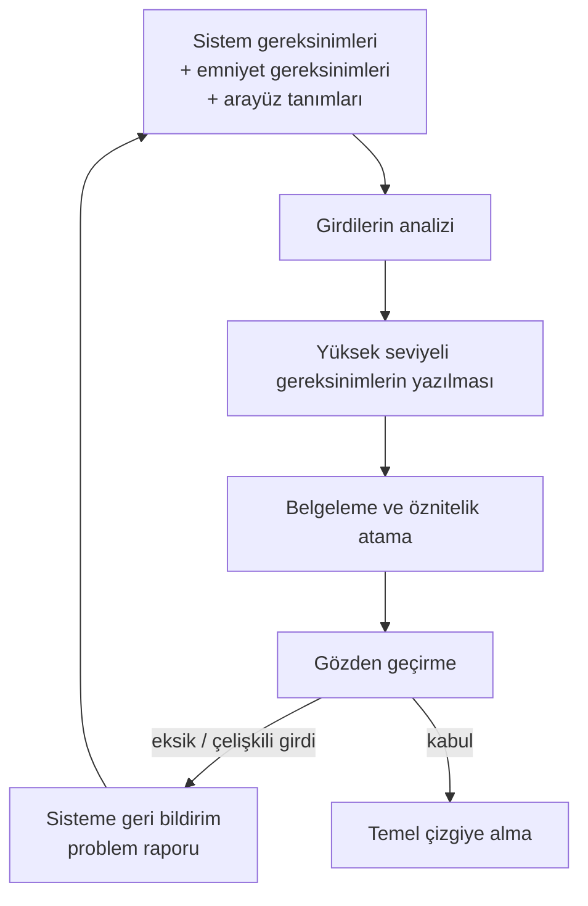

# 6. Yazılım Gereksinimleri

Yazılım gereksinimleri, sistem beklentilerini yazılımın gerçekleştirebileceği açık
ifadeye dönüştürür. Gereksinimler tutarlı, test edilebilir, izlenebilir ve belirsizlik
içermeyecek kadar nettir.

Bu bölüm, yüksek seviyeli gereksinimlerin nasıl türetildiğini ve doğrulama ile nasıl
eşlendiğini özetler. Güçlü gereksinimler, tasarım ve kod için sağlam bir başlangıç
noktası sağlar.

## Gereksinim neden bu kadar önemli?

Gereksinim, sistem ihtiyacını yazılım diline çeviren köprüdür. Köprü sağlam değilse,
tasarım yanlış yöne kayar, kod istenmeyen davranış üretir ve test ekibi neyi doğruladığını
tam olarak bilemez.

Bu yüzden gereksinim yazımı yalnızca doğru kelimeleri seçmek değildir; aynı zamanda doğru
düzeyi seçmektir. Çok üst düzey bir ifade test edilemez kalır, çok alt düzey bir ifade ise
gerekli mimari ayrımı bozar.

## Yüksek ve düşük seviye gereksinimler

Pratikte gereksinimler çoğu zaman katmanlıdır:

- **yüksek seviyeli gereksinimler** (high-level requirements) sistem ihtiyacını açıklar,
- **düşük seviyeli gereksinimler** (low-level requirements) yazılımın bunu nasıl
  karşılayacağını ayrıntılandırır.

Bu iki katman karışmamalıdır. Yüksek seviyeli gereksinim neyin gerekli olduğunu,
düşük seviyeli gereksinim ise bunu gerçekleştirmek için hangi davranışın beklendiğini
belirtir.

## İyi gereksinimin özellikleri

İyi bir gereksinim:

- tek bir davranışı anlatır,
- sınırları açıkça belirtir,
- test edilebilir,
- ölçülebilir,
- başka gereksinimlerle çakışmaz.

Örneğin "Sistem, sensör verisi 500 ms boyunca geçersiz kalırsa güvenli moda geçmelidir"
ifadesi:

- ölçülebilir,
- test edilebilir,
- hata durumunu açıkça tanımlar.

## Belirsizlik örnekleri

Aşağıdaki türde ifadeler sorunludur:

- "uygun şekilde",
- "yeterli hızda",
- "gerekli durumlarda",
- "mümkün olduğunca kısa sürede".

Bu kelimeler iletişimde faydalı olabilir; ancak sertifikasyon ve test açısından yeterli
değildir. Yerlerine koşul, zaman, sınır ve tepki içeren açık ifadeler gelmelidir.

## Gereksinim mühendisinin rolü

Gereksinim yazmak çoğu projede "boşta kalan mühendise verilen" bir iş gibi görülür;
oysa emniyet-kritik yazılımda bu, projenin kaderini belirleyen görevlerden biridir.
Gereksinim mühendisi (requirements engineer), sistem ekibi ile yazılım ekibi arasındaki
tercümandır: bir yanda uçuş mekaniği, sensör davranışı ve emniyet hedefleriyle konuşan
sistem mühendisleri, diğer yanda veri yapıları ve zamanlama kısıtlarıyla düşünen yazılım
geliştiriciler vardır. İkisinin de dilini konuşamayan bir gereksinim, iki tarafın da
yanlış anlayacağı bir metne dönüşür.

Deneyimlerime göre iyi bir gereksinim mühendisinde şu beceriler bir arada bulunur:

- **Alan bilgisi (domain knowledge):** Yazılan gereksinimin arkasındaki fiziksel ve
  operasyonel gerçeği anlamak. ARINC 429 etiketinin ne taşıdığını, bir pito-statik
  sensörün nasıl bozulduğunu bilmeyen kişi, o sensörle ilgili hata koşulunu doğru
  yazamaz.
- **Yazılı iletişim:** Gereksinim bir kez yazılır, yüzlerce kez okunur. Kısa, tek
  yorumlu ve dilbilgisi açısından tutarlı cümle kurabilmek başlı başına bir beceridir.
- **Soyutlama:** "Ne" ile "nasıl"ı ayırabilmek; davranışı tasarım kararlarına
  bulaştırmadan ifade edebilmek. Bu, deneyimli geliştiricilerin bile zorlandığı bir
  alışkanlıktır, çünkü geliştirici refleksi hemen çözüme atlamaktır.
- **Sorgulama:** Sistem gereksinimindeki boşluğu, çelişkiyi ve söylenmemiş varsayımı
  fark edip "burada ne olmalı?" diye sormaktan çekinmemek. En pahalı hatalar, kimsenin
  sormaya cesaret edemediği sorulardan doğar.
- **Sabır ve düzen:** Gereksinim çalışması, kod yazmak kadar "görünür" ilerlemez.
  Yüzlerce maddeyi tutarlı biçimde numaralandırmak, öznitelikleriyle birlikte
  yönetmek disiplin ister.

Ekip içindeki konumuna gelince: gereksinim mühendisi ne sistem ekibinin sekreteri
ne de yazılım ekibinin sözcüsüdür. Sistem gereksinimlerini olduğu gibi kopyalayan
kişi değer üretmez; yazılım ekibinin tasarım tercihlerini gereksinim diye yazan kişi
ise katmanları bozar. Sağlıklı projelerde gereksinim mühendisi:

- sistem ekibiyle birlikte girdileri analiz eder ve belirsizlikleri geri bildirir,
- yazılım mimarı ve geliştiricilerle uygulanabilirliği tartışır,
- test ekibiyle erken temas kurar; çünkü test edilemeyen gereksinimi ilk fark eden
  genellikle test mühendisidir.

Küçük projelerde bu rolü ayrı bir kişi üstlenmeyebilir; geliştirici ve gereksinim
yazarı aynı kişi olabilir. Bu durumda kritik olan, kişinin hangi şapkayla yazdığını
bilmesi ve gözden geçirmenin mutlaka başka bir çift göz tarafından yapılmasıdır.

## Gereksinim geliştirme süreci

Gereksinim geliştirme, tek oturuşta biten bir yazım işi değil; girdilerin toplanması,
analiz, yazım, belgeleme ve geri bildirimden oluşan yinelemeli bir süreçtir. DO-178C
terminolojisiyle bu, yazılım gereksinim sürecinin (software requirements process)
çıktısı olan yüksek seviyeli gereksinimlerin üretilmesidir; girdisi ise sistem
gereksinimleri, yazılıma tahsis edilen emniyet gereksinimleri ve arayüz tanımlarıdır.

**Girdilerin toplanması ve analizi.** İlk adım, yazılıma tahsis edilen sistem
gereksinimlerini, emniyet değerlendirmesinden gelen kısıtları ve donanım/yazılım
arayüz tanımlarını bir araya getirmektir. Analiz sırasında sorulacak sorular bellidir:
Bu gereksinim yazılımla mı karşılanacak, donanımla mı? Hata koşulları tanımlanmış mı?
Zamanlama ve doğruluk sınırları verilmiş mi? Eksik ya da çelişkili her nokta not edilir.

**Yazım ve belgeleme.** Gereksinimler tek tek numaralandırılır ve her birine kaynak
izi, gereksinim mi tasarım bilgisi mi olduğu, doğrulama yöntemi gibi öznitelikler
eklenir. Türetilmiş gereksinimler (derived requirements) — yani doğrudan bir sistem
gereksiniminden gelmeyen, yazılımın kendi yapısından doğan ihtiyaçlar — ayrıca
işaretlenir; çünkü bunlar emniyet etkisi açısından sistem ve emniyet ekibine geri
bildirilmek zorundadır.

**Sisteme geri bildirim.** Yazılım ekibi analiz sırasında sistem gereksinimindeki
boşluğu bulduğunda bunu kendi başına "düzeltmez"; problem raporu (problem report)
ya da benzeri resmî bir kanalla sistem ekibine iletir. Sistem gereksinimi değişir,
değişiklik yazılıma yeniden akar. Bu döngü yavaş görünür ama katmanlar arasındaki
tutarlılığı koruyan tek yoldur.

Sık düşülen tuzaklar da tanıdıktır:

- **Tasarıma erken inmek:** "Sistem geçersiz veri sayacını 3'e ulaşınca bayrağı set
  etmelidir" gibi bir cümle, davranış yerine gerçekleştirimi yazar. Sayaç bir tasarım
  kararıdır; gereksinim "500 ms boyunca geçersiz veri" gibi gözlemlenebilir bir koşul
  vermelidir.
- **Tek katmanlı gereksinim:** Yüksek ve düşük seviyeyi tek listede eritmek, kısa
  vadede zaman kazandırır ama izlenebilirliği (traceability) ve gözden geçirmeyi
  içinden çıkılmaz
  hâle getirir. Katman birleştirme ancak bilinçli, planlarda gerekçelendirilmiş bir
  karar olarak yapılabilir.
- **Doğrudan koda gitmek:** "Gereksinimi sonra yazarız" yaklaşımı, kodun davranışını
  gereksinim diye belgelemekle sonuçlanır. Bu durumda gereksinim artık bağımsız bir
  doğrulama ölçütü değildir; kodun aynasıdır ve koddaki hatayı da birlikte taşır.

## Gereksinimlerin gözden geçirilmesi

Gereksinim hatasını yakalamanın en ucuz anı, gereksinim henüz kağıt üzerindeyken
yapılan gözden geçirmedir. Aynı hata tasarımda yakalanırsa maliyet katlanır, testte
yakalanırsa daha da katlanır, sahada ortaya çıkarsa artık maliyet değil emniyet
konuşulur. Bu yüzden akran gözden geçirmesi (peer review), gereksinim sürecinin
süsü değil çekirdeğidir.

İşleyen bir gözden geçirme pratiğinde şunlar bulunur:

- **Doğru katılımcılar:** Yazarın kendisi, bir başka gereksinim/yazılım mühendisi,
  bir sistem veya emniyet temsilcisi ve mümkünse bir test mühendisi. Test mühendisi
  masadaki en değerli kişilerden biridir; "bunu nasıl test ederim?" sorusu belirsizliği
  herkesten önce yakalar.
- **Hazırlık süresi:** Katılımcıların malzemeyi toplantıdan önce okuması. Toplantıda
  ilk kez okunan gereksinim, gözden geçirilmiş sayılmaz.
- **Makul kapsam:** Tek oturumda yüzlerce gereksinim "geçirilmez". Yorgun gözden
  geçirici her şeyi onaylar; kısa ve odaklı oturumlar daha çok hata bulur.
- **Kontrol listesi (checklist):** Değerlendirmenin kişisel zevke değil ölçüte
  dayanmasını sağlar.

Tipik bir gereksinim gözden geçirme kontrol listesinden satırlar:

| Soru | Aradığı hata |
|---|---|
| Gereksinim tek bir davranışı mı anlatıyor? | Bileşik, bölünmesi gereken madde |
| Girdi, koşul ve beklenen tepki açık mı? | Belirsizlik, örtük varsayım |
| Ölçülebilir sınır/tolerans verilmiş mi? | Test edilemezlik |
| Kaynağına izlenebilir mi? | Dayanaksız (kayıp izli) gereksinim |
| Başka bir gereksinimle çelişiyor veya çakışıyor mu? | Tutarsızlık, tekrar |
| Hata ve sınır koşulları ele alınmış mı? | Yalnızca "mutlu yol" tanımı |
| Terminoloji sözlükle uyumlu mu? | Aynı kavrama iki ad |

Gözden geçirmenin ikinci işlevi kanıt üretmektir. Bulunan her bulgu, verilen karar
(düzeltildi, reddedildi, ertelendi) ve kapanış durumu kayda geçirilir. Bu kayıtlar,
sertifikasyon otoritesine ve kalite güvencesine "gereksinimler gerçekten gözden
geçirildi" iddiasının nesnel kanıtıdır; katılım aşaması (Stage of Involvement, SOI)
denetimlerinde ilk istenen
malzemeler arasındadır. İmzalanmış ama bulgu içermeyen yüzlerce kayıt ise tersine
şüphe uyandırır: hiç hata bulamayan bir gözden geçirme süreci, büyük olasılıkla
hata aramamıştır.

Son bir pratik not: gözden geçirme, yazarı savunmaya iten bir sınav değildir.
Bulgu sayısı yazarın karnesi gibi kullanılmaya başlandığı anda ekip bulgu saklamayı
öğrenir ve sürecin değeri sıfırlanır. Amaç kişiyi değil metni sınamaktır.

## Gereksinim yönetimi ve prototipleme

Gereksinimler yazılıp onaylandığı anda donmaz; proje boyunca değişir. Değişimin
kendisi sorun değildir — kontrolsüz değişim sorundur. Bu yüzden gereksinimler,
konfigürasyon yönetiminin (configuration management) kapsamına giren birer
konfigürasyon öğesi olarak ele alınır:
her gereksinim kümesinin bir sürümü vardır ve belirli bir olgunluk noktasında
**temel çizgi (baseline)** olarak dondurulur.

Temel çizgi alındıktan sonra işleyiş değişir:

- Temel çizgi öncesinde yazar, gereksinimi görece serbestçe düzenleyebilir.
- Temel çizgi sonrasında her değişiklik bir değişiklik talebi ya da problem raporu
  ile başlar, etkisi analiz edilir, yetkili bir kurul (çoğu projede değişiklik kontrol
  kurulu, change control board) tarafından onaylanır ve ancak ondan sonra uygulanır.

Etki analizi (change impact analysis) bu zincirin en kritik halkasıdır. Bir
gereksinim değiştiğinde yalnızca o madde değil, ona izlenebilirlikle bağlı düşük
seviyeli gereksinimler, tasarım öğeleri, kod ve testler de gözden geçirilmek zorundadır.
İzlenebilirlik verisi güncel tutulmuşsa etki analizi bir sorgudur; tutulmamışsa
arkeolojik kazıya dönüşür. Gereksinim yönetim araçlarının (DOORS ve benzerleri) asıl
değeri burada ortaya çıkar: sürüm geçmişi, öznitelikler ve bağlantılar tek yerde durur.

Pratik bir uyarı: "küçük değişiklik" diye bir kategori icat etmeyin. Deneyim,
en pahalı hataların "iki kelime değişti, analize gerek yok" denilen düzeltmelerden
çıktığını gösteriyor. Sürecin ağırlığı değişikliğin etkisine göre ölçeklenebilir;
ama etkiye kimin karar verdiği hep aynı olmalıdır: analiz, kişisel sezgi değil.

**Prototiplemeye** gelince: gereksinimler her zaman masa başında olgunlaşmaz.
Bir kontrol algoritmasının kazançları, bir ekran düzeninin okunabilirliği ya da bir
arayüzün zamanlama davranışı çoğu kez ancak çalışan bir deneme üzerinde görülür.
Prototip, "ne istediğimizi görmeden yazamayız" sorununa meşru bir cevaptır ve
gereksinim belirsizliğini erkenden azaltır.

Riski de aynı yerde başlar: prototip kodunun sertifikasyon kanıtı olmadan ürüne
sızması. Prototip, gereksinim ve tasarım disiplini uygulanmadan, hızla yazılmış
koddur; DO-178C süreç kanıtlarına (gözden geçirme, izlenebilirlik, yapısal kapsam)
sahip değildir. "Zaten çalışıyor, baştan yazmak israf" cümlesi duyulduğunda proje
tehlikeli bir yola girmiştir. Sağlıklı kullanım için:

- Prototipin amacı baştan yazılı olarak sınırlanır: neyi öğrenmek için yapılıyor?
- Prototipten beklenen çıktı **kod değil bilgidir**: öğrenilenler gereksinimlere
  yazılır, prototip kenara konur.
- Prototip kodu ürüne taşınacaksa bu bir istisna değil bilinçli bir karardır ve kod,
  ürün koduyla aynı doğrulama sürecinden eksiksiz geçirilir.

Doğru kullanılan prototip gereksinimi olgunlaştırır; yanlış kullanılan prototip,
gereksinim sürecini atlamanın kılıfı olur.

## İzlenebilirlik

Her gereksinimin bir kaynağı olmalıdır. Kaynak çoğu zaman:

- sistem gereksinimi,
- emniyet hedefi,
- arayüz kısıtı,
- operasyonel ihtiyaçtır.

İzlenebilirlik, gereksinimden tasarıma ve testten tekrar kaynağa dönüşü mümkün kılar.

## Gereksinim yazarken dikkat

- Davranış tek cümlede net olmalı.
- Girdi, koşul ve beklenen çıktı açık olmalı.
- Gereksinim başka bir gereksinimi tekrar etmemeli.
- Testi düşünerek yazılmalı.

## Bu bölümden akılda kalması gerekenler

- Gereksinim, tasarım ve testin ortak başlangıç noktasıdır.
- Belirsiz gereksinim, pahalı hata kaynağıdır; en ucuz yakalandığı yer gözden geçirmedir.
- Gereksinim mühendisi sistem ile yazılım arasındaki tercümandır; alan bilgisi,
  yazılı iletişim, soyutlama ve sorgulama becerilerini birlikte ister.
- Gereksinim geliştirme yinelemeli bir süreçtir; eksik ve çelişkili girdiler resmî
  kanalla sisteme geri bildirilir, türetilmiş gereksinimler emniyet ekibine iletilir.
- Akran gözden geçirmesi kontrol listesiyle yapılır ve kayıtları sertifikasyon kanıtıdır.
- Temel çizgi sonrası her değişiklik etki analizi ve onaydan geçer; "küçük değişiklik"
  istisnası yoktur.
- Prototipin çıktısı kod değil bilgidir; ürüne sızması yönetilmesi gereken bir risktir.
- İzlenebilirlik, gereksinim kalitesinin parçasıdır.
