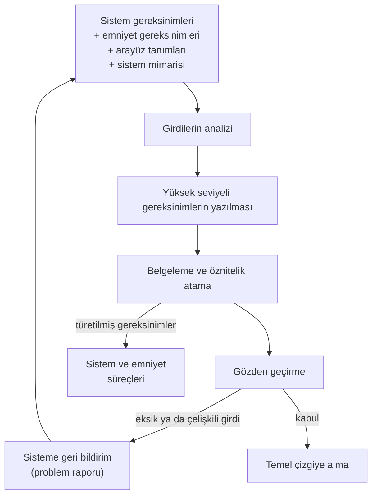
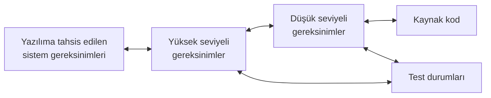

# 6. Yazılım Gereksinimleri

Yazılım gereksinimleri, sistemin yazılımdan beklediğini doğrulanabilir davranış
tanımlarına çevirir. Bu bölüm, yüksek seviyeli gereksinimlerin (high-level requirements)
sistem gereksinimlerinden nasıl geliştirildiğini, neleri kapsadığını, nasıl yazılıp
gözden geçirildiğini ve değişikliklerinin nasıl yönetildiğini anlatır.

Düşük seviyeli gereksinimler (low-level requirements) tasarım sürecinin çıktısıdır;
burada yalnızca iki katman arasındaki sınır çizilir, ayrıntısı
[7. Yazılım Tasarımı](./07-yazilim-tasarimi.md) bölümündedir. Güçlü gereksinimler
tasarım, kod ve test için sağlam bir başlangıç noktası sağlar; zayıf gereksinimin
bedeli ise bu üçünde birden ödenir.

## Gereksinim neden bu kadar önemli?

Gereksinim, sistem ihtiyacını yazılım diline çeviren köprüdür. Köprü sağlam değilse,
tasarım yanlış yöne kayar, kod istenmeyen davranış üretir ve test ekibi neyi doğruladığını
tam olarak bilemez.

DO-178C'de bu bağ gevşek bir benzetme değildir: test, gereksinim tabanlıdır
(requirements-based testing). Test durumları (test case) koddan değil gereksinimden üretilir ve
yazılım, gereksinimin söylediğine göre "doğru" ya da "yanlış" sayılır. Gereksinimde
yazmayan davranış test edilmez; yanlış yazılmış davranış ise kusursuz biçimde
kodlanıp "geçti" diye doğrulanır. Gereksinim hatası, sonraki bütün adımların sadakatle
taşıdığı bir hatadır.

Bu yüzden gereksinim yazımı yalnızca doğru kelimeleri seçmek değildir; aynı zamanda doğru
düzeyi seçmektir. Çok üst düzey bir ifade test edilemez kalır, çok alt düzey bir ifade ise
gerekli mimari ayrımı bozar.

## Yüksek ve düşük seviyeli gereksinimler

DO-178C yazılım gereksinimlerini iki katmanda ele alır. Katmanları ayıran, cümlelerin
uzunluğu ya da madde sayısı değil; hangi sürecin çıktısı oldukları ve kime hitap
ettikleridir.

- **Yüksek seviyeli gereksinimler**, yazılım gereksinim sürecinin çıktısıdır. Yazılıma
  tahsis edilen sistem gereksinimlerinin, emniyetle ilgili gereksinimlerin ve sistem
  mimarisinin analizinden geliştirilir. Yazılıma dışarıdan bakar: girdileri, çıktıları,
  gözlenen davranışı ve kısıtları söyler; yazılımın iç yapısına girmez.
- **Düşük seviyeli gereksinimler**, tasarım sürecinin çıktısıdır. Yüksek seviyeli
  gereksinimlerden ve tasarım kararlarından geliştirilir; ölçütü, kaynak kodun başka
  hiçbir bilgiye gerek kalmadan doğrudan yazılabileceği ayrıntıda olmasıdır.

İki katman her seviyede aynı ağırlıkta aranmaz. Yüksek seviyeli gereksinimlerin
geliştirilmesi Seviye A'dan Seviye D'ye bütün seviyelerde hedeftir; düşük seviyeli
gereksinimlerin geliştirilmesi ise Seviye D'de hedef olarak aranmaz.

Aynı işlevin üç katmandaki görünüşü farkı somutlaştırır:

| Katman | Örnek | Ne söylüyor? |
|---|---|---|
| Sistem gereksinimi | Sistem, hava hızı verisinin kaybını en geç 1 saniye içinde tespit etmeli ve mürettebata bildirmelidir. | Sistemin işlevi; işin ne kadarının yazılıma düştüğü belli değil |
| Yüksek seviyeli gereksinim | Yazılım, hava hızı verisi kesintisiz 500 ms (±20 ms) boyunca geçersiz kaldığında, bu sürenin dolmasından sonra en geç 50 ms içinde hava hızı arıza bayrağını etkinleştirmelidir. | Yazılımın sınırında gözlenen davranış: girdi, koşul, süre, tepki |
| Düşük seviyeli gereksinim | Hava hızı izleme işlevi 20 ms'lik görevde her çağrıldığında, girdi geçersizse geçersizlik sayacını bir artırır, geçerliyse sıfırlar; sayaç 25'e ulaştığında arıza bayrağını kurar. | Kodlayıcının doğrudan gerçekleştireceği ayrıntı |

Sistem gereksinimindeki 1 saniyelik bütçenin toleransla birlikte en çok 570 ms'si
yazılıma ayrılmış, kalanı sensör, veri yolu ve gösterge gecikmelerine bırakılmıştır.
Yüksek seviyeli gereksinim sayaçtan, görevden ya da işlev adından söz etmez; bunlar
tasarımın kararıdır ve yarın değişebilir. Düşük seviyeli gereksinim ise 25 çağrının
500 ms ettiğini bilen bir tasarımın ürünüdür.

Hangi katmanda olduğunuzdan emin değilseniz şu soru işe yarar: *bu cümleyi doğrulamak
için yazılımın içini bilmem gerekiyor mu?* Yalnızca girdileri sürüp çıktıları
gözleyerek doğrulanabiliyorsa yüksek seviyelidir; bir değişkenin, sayacın ya da
görevin adını anmadan yazılamıyorsa tasarıma inilmiştir.

Gereksinimler her zaman düz metin olmak zorunda da değildir; bir model olarak ifade
edildiklerinde katman ayrımı aynen geçerlidir, ama ek beklentiler doğar
([14. DO-331 ve Model Tabanlı Geliştirme ve Doğrulama](../04-arac-kalifikasyonu-ve-ekler/14-do331-model-tabanli-gelistirme.md)).

### Türetilmiş gereksinimler

Türetilmiş gereksinim (derived requirement), yazılım geliştirme süreçlerinin kendi
ürettiği ve şu iki koşuldan en az birini taşıyan gereksinimdir:

- bir üst seviye gereksinime doğrudan izlenemez, ya da
- izlenebilse bile üst seviyede belirtilenin ötesinde bir davranış tanımlar.

Terimin Türkçesi yanıltıcı olabilir: gündelik dilde "yüksek seviyeli gereksinimler
sistem gereksinimlerinden türetilir" denir, ama teknik anlamda türetilmiş gereksinim
tam tersine, üstünde karşılığı *olmayan* gereksinimdir. Emniyet değerlendirmesinden
yazılıma tahsis edilen bir gereksinim de türetilmiş değildir; onun kaynağı bellidir.

İki koşula birer örnek:

- **İzlenemeyen:** "Yazılım, donanımın bekçi köpeği zamanlayıcısını (watchdog timer)
  her 10 ms'lik çerçevede bir kez yenilemelidir." Hiçbir sistem gereksinimi bundan söz
  etmez; ihtiyaç, seçilen işlemci kartından doğmuştur.
- **Ötesinde davranış tanımlayan:** Sistem gereksinimi yalnızca "geçersiz hava hızı
  verisi kullanılmamalıdır" der; yazılım gereksinimi buna "ardışık iki örnek arasındaki
  fark 30 knot'tan büyükse veri geçersiz sayılmalıdır" kuralını ekler. İz vardır, ama
  bu makullük denetimi (reasonableness check) sistemin bilmediği yeni bir davranıştır.

Türetilmiş gereksinim hem yüksek hem düşük seviyede doğabilir; birincisi gereksinim
sürecinde, ikincisi tasarım sırasında ortaya çıkar. Her birinin **gerekçesi** yazılır
ve gereksinim, sistem süreçlerine — sistem emniyet değerlendirme süreci (system safety
assessment process) dahil — iletilir. Nedeni basittir: emniyet
değerlendirmesi, yazılımın ne yaptığına dair varsayımlar üzerine kuruludur ve sistemin
haberi olmayan bir davranış bu varsayımları bozabilir. Yukarıdaki makullük denetimi,
hava hızının gerçekten hızla değiştiği bir anda geçerli veriyi reddedebilir; bunun
kabul edilebilir olup olmadığına yazılım ekibi değil, sistem ve emniyet ekibi karar
verir. Geri bildirimin emniyet tarafındaki karşılığı
[3. Sistem Emniyet Değerlendirmesi Bağlamında Yazılım](../02-baglam/03-sistem-emniyet-degerlendirmesi-baglaminda-yazilim.md)
bölümünde anlatılır.

Gözden geçirmede iki uç da soru doğurmalıdır: hiç türetilmiş gereksinimi olmayan bir
yazılımda büyük olasılıkla türetilmiş gereksinimler işaretlenmemiştir; gereksinimlerinin
çoğu türetilmiş olan bir yazılım ise çoğu kez sistem gereksinimlerinin eksik kaldığına
işaret eder.

## Gereksinim geliştirme süreci

Gereksinim geliştirme, tek oturuşta biten bir yazım işi değil; girdilerin toplanması,
analiz, yazım, belgeleme ve geri bildirimden oluşan yinelemeli bir süreçtir. DO-178C
terminolojisiyle bu, yazılım gereksinim sürecinin (software requirements process)
çıktısı olan yüksek seviyeli gereksinimlerin üretilmesidir; girdisi ise emniyetle
ilgili olanlar dahil yazılıma tahsis edilen sistem gereksinimleri, donanım arayüzü ve
sistem mimarisi ile planlama sürecinden gelen yazılım geliştirme planı (Software
Development Plan, SDP) ve gereksinim standardıdır.

```mermaid
flowchart TD
    A["Sistem gereksinimleri<br/>+ emniyet gereksinimleri<br/>+ arayüz tanımları<br/>+ sistem mimarisi"] --> B[Girdilerin analizi]
    B --> C[Yüksek seviyeli gereksinimlerin yazılması]
    C --> D[Belgeleme ve öznitelik atama]
    D --> E[Gözden geçirme]
    D -- "türetilmiş gereksinimler" --> H["Sistem ve emniyet<br/>süreçleri"]
    E -- "eksik ya da çelişkili girdi" --> F["Sisteme geri bildirim<br/>(problem raporu)"]
    F --> A
    E -- "kabul" --> G[Temel çizgiye alma]
```

**Girdilerin toplanması ve analizi.** İlk adım, yazılıma tahsis edilen sistem
gereksinimlerini, emniyet değerlendirmesinden gelen kısıtları ve donanım/yazılım
arayüz tanımlarını bir araya getirmektir; bu girdilerin sistem tarafında nasıl
oluştuğu [2. Sistem Bağlamında Yazılım](../02-baglam/02-sistem-baglaminda-yazilim.md)
bölümünün konusudur. Analiz sırasında sorulacak sorular bellidir:
Bu gereksinim yazılımla mı karşılanacak, donanımla mı? Hata koşulları tanımlanmış mı?
Zamanlama ve doğruluk sınırları verilmiş mi? Eksik ya da çelişkili her nokta not edilir.

**Yazım ve belgeleme.** Gereksinimler tek tek numaralandırılır ve her birine kaynak
izi, gereksinim mi tasarım bilgisi mi olduğu, doğrulama yöntemi gibi öznitelikler
eklenir. Türetilmiş gereksinimler ayrıca işaretlenir ve gerekçeleriyle birlikte
kaydedilir. Yazım biçimi, öznitelikler ve işaretleme kuralları kişiden kişiye
değişmemelidir; bunları projenin gereksinim standardı (requirements standard) belirler
([5. Yazılım Planlama](./05-yazilim-planlama.md)).

**Sisteme geri bildirim.** Yazılım ekibi analiz sırasında sistem gereksinimindeki
boşluğu bulduğunda bunu kendi başına "düzeltmez"; problem raporu (problem report)
ya da benzeri resmî bir kanalla sistem ekibine iletir. Sistem gereksinimi değişir,
değişiklik yazılıma yeniden akar. Bu döngü yavaş görünür ama katmanlar arasındaki
tutarlılığı koruyan tek yoldur.

Sık düşülen tuzaklar da tanıdıktır:

- **Tasarıma erken inmek:** "Yazılım, geçersizlik sayacı 25'e ulaştığında arıza
  bayrağını kurmalıdır" gibi bir cümle, davranış yerine gerçekleştirimi yazar. Sayaç
  bir tasarım kararıdır; gereksinim "500 ms boyunca geçersiz veri" gibi gözlemlenebilir
  bir koşul vermelidir.
- **Tek katmanlı gereksinim:** Yüksek ve düşük seviyeyi tek listede eritmek, kısa
  vadede zaman kazandırır ama izlenebilirliği (traceability) ve gözden geçirmeyi
  içinden çıkılmaz hâle getirir. Kodun doğrudan yüksek seviyeli gereksinimlerden
  yazılabildiği küçük ve basit yazılımlarda tek katman mümkündür; ancak bu, planlarda
  gerekçelendirilmiş bilinçli bir karar olmalıdır ve o tek katman iki katmanın
  beklentilerini birden karşılamak zorundadır.
- **Doğrudan koda gitmek:** "Gereksinimi sonra yazarız" yaklaşımı, kodun davranışını
  gereksinim diye belgelemekle sonuçlanır. Bu durumda gereksinim artık bağımsız bir
  doğrulama ölçütü değildir; kodun aynasıdır ve koddaki hatayı da birlikte taşır.

Gereksinimden tasarıma ne zaman geçileceğini takvim değil, planlarda tanımlı geçiş
kriterleri (transition criteria) belirler; gereksinim süreci için örnekler
[Ek A: Örnek Geçiş Kriterleri](../06-ekler/01-ek-a-ornek-gecis-kriterleri.md)
sayfasındadır.

## Yüksek seviyeli gereksinimler neleri kapsar?

Tek tek iyi yazılmış cümleler, eksiksiz bir gereksinim kümesi anlamına gelmez.
Gereksinim belgelerinin en sık görülen kusuru yanlış yazılmış madde değil, hiç
yazılmamış maddedir: işlevler ayrıntıyla anlatılır, zamanlama, arayüz ve arıza
davranışı ise "nasılsa tasarımda netleşir" diye boş bırakılır. Yüksek seviyeli
gereksinim kümesinin şu başlıkların her birine yanıt vermesi beklenir:

| Kategori | Yanıtladığı soru | Örnek gereksinim |
|---|---|---|
| İşlevsel davranış ve çalışma kipleri | Yazılım hangi kipte ne yapar? | Yazılım, bakım verisi indirme isteğini yalnızca YER kipinde kabul etmelidir. |
| Performans | Ne kadar doğru, ne kadar hassas? | Yazılım, gösterilen hava hızını 40–450 knot aralığında ±1 knot doğrulukla hesaplamalıdır. |
| Zamanlama | Ne sıklıkta, ne kadar sürede? | Yazılım, hava hızı çıktısını 50 ms (±5 ms) aralıkla güncellemelidir. |
| Bellek kısıtları | Hangi bütçenin içinde? | Yazılım, arıza kayıtları için kalıcı bellekte en çok 64 kB yer kullanmalıdır. |
| Donanım ve yazılım arayüzleri | Hangi veri, hangi biçimde, hangi hızda? | Yazılım, hava hızını çıkış veri kelimesinde 0,25 knot çözünürlükle kodlamalıdır. |
| Arıza tespiti ve emniyet izleme | Yazılım arızayı nasıl fark eder, ne yapar? | Yazılım, açılışta hesapladığı program belleği sağlama toplamı (checksum) beklenen değerle uyuşmazsa çıkışlarını etkinleştirmemelidir. |
| Bölümleme | Hangi yazılım parçası hangisinden korunur? | Yazılım, bakım bölümünün (partition) gösterge bölümüne ait belleğe yazmasını engellemelidir. |
| Anormal girdi ve koşullar | Beklenmeyen durumda ne olur? | Yazılım, 0–512 knot aralığının dışındaki hava hızı değerini geçersiz saymalıdır. |

Bir kategori projeye uygulanmıyorsa (örneğin bölümleme yoksa) bunun açıkça söylenmesi,
başlığın sessizce atlanmasından iyidir; gözden geçiren kişi "unutulmuş mu, gerekmiyor
mu?" sorusuyla baş başa kalmaz. İlk yedi başlık DO-178C'nin yazılım gereksinim verisi
için saydığı içerikle örtüşür; sonuncusu orada ayrı bir başlık değildir, gürbüzlük
testlerinin dayanağı olduğu için eklenmiştir. Parametre verisi öğesi (parameter data
item, PDI) planlanıyorsa yüksek seviyeli gereksinimler ayrıca bu verinin yazılımca
nasıl kullanıldığını, yapısını ve veri elemanlarının özniteliklerini de tanımlar
([22. Konfigürasyon Verisi](../05-ozel-konular/22-konfigurasyon-verisi.md)).

Son satır özellikle önemlidir. Gürbüzlük (robustness) testleri, yazılımın geçersiz
girdilere ve anormal koşullara verdiği tepkiyi sınar; ancak test mühendisi beklenen
sonucu uyduramaz, gereksinimden okur. Aralık dışı değerde, bozuk veride, aşılan
çerçeve süresinde ya da izin verilmeyen durum geçişinde yazılımın ne yapacağı
gereksinimde yazmıyorsa, ortada test edilecek bir davranış da yoktur. Normal aralık ve
gürbüzlük testlerinin gereksinimden nasıl üretildiği
[9. Yazılım Doğrulama](./09-yazilim-dogrulama.md) bölümünde anlatılır.

## İyi gereksinimin özellikleri

Küme eksiksiz olduktan sonra sıra tek tek maddelerin kalitesine gelir. İyi bir
gereksinim:

- **tek bir davranışı anlatır:** "ve" ile bağlanmış iki tepki iki gereksinimdir; ayrı
  test edilir, ayrı izlenir, ayrı değişir;
- **tek biçimde yorumlanır:** yazar, tasarımcı ve test mühendisi aynı cümleden aynı
  davranışı anlar;
- **doğrulanabilir:** "karşılandı mı?" sorusuna evet ya da hayır denebilir; bunun için
  sınır, tolerans ve birim yazılıdır;
- **tutarlıdır:** başka bir gereksinimle çelişmez, onu yinelemez ve aynı kavramı aynı
  adla anar;
- **tasarımdan bağımsızdır:** neyin istendiğini söyler, nasıl yapılacağını değil.

İlk bakışta iyi görünen bir örnek üzerinden gidelim: "Sistem, sensör verisi 500 ms
boyunca geçersiz kalırsa güvenli moda geçmelidir." Koşul var, süre var, tepki var;
"uygun şekilde" türünden bir kaçamak yok. Yine de test mühendisi bu cümleyle test
yazamaz:

- Özne "sistem"dir; bu davranışın yazılımdan mı, donanımdan mı beklendiği belli değildir.
- Hangi sensör? "Geçersiz" neye göre?
- 500 ms'nin toleransı yoktur: 480 ms'de geçiş hata mıdır, 520 ms'de geçmemek hata mıdır?
- Koşul oluştuktan sonra tepkinin ne kadar sürede gelmesi gerektiği yazmaz.
- "Güvenli mod" tanımlı bir kip midir, yoksa okurun hayal gücüne mi bırakılmıştır?

Eksikler tamamlandığında bölümün başındaki katman tablosunda yer alan yüksek seviyeli
gereksinime varılır: özne
yazılımdır, veri bellidir, süre toleransıyla verilmiştir, tepki ve tepki süresi
yazılıdır. "Geçersiz" sözcüğünün ölçütü (örneğin verinin durum bilgisinin arıza
göstermesi ya da verinin beklenen sürede yenilenmemesi) ayrı bir gereksinimde
tanımlanır ve her yerde aynı anlamda kullanılır.

Belirsizliğin en tanıdık kaynağı ölçüsüz sözcüklerdir: "uygun şekilde", "yeterli hızda",
"gerekli durumlarda", "mümkün olduğunca kısa sürede". Bu sözcükler toplantıda
iletişimi kolaylaştırır; gereksinimde ise kararı yazardan alıp kodlayıcıya ve test
mühendisine devreder — ikisi de farklı karar verebilir. Yerlerine koşul, zaman, sınır
ve tepki içeren açık ifadeler gelmelidir:

| Zayıf ifade | Sorun | Yeniden yazım |
|---|---|---|
| Yazılım, hava hızını yüksek doğrulukla hesaplamalıdır. | Ölçüt yok | Yazılım, hava hızını 40–450 knot aralığında ±1 knot doğrulukla hesaplamalıdır. |
| Yazılım, arıza durumunda mümkün olduğunca kısa sürede uyarı vermelidir. | Hangi arıza, ne kadar süre? | Yazılım, hava hızı arıza bayrağı etkinleştikten sonra en geç 100 ms içinde uyarı çıkışını etkinleştirmelidir. |
| Yazılım, geçersiz veriyi reddetmeli, arızayı kaydetmeli ve mürettebatı uyarmalıdır. | Üç davranış tek maddede | Üç ayrı gereksinim; her birinin kendi koşulu, süresi, testi ve izi olur. |
| Yazılım, hiçbir zaman çerçeve süresini aşmamalıdır. | Süre yazmıyor; "hiçbir zaman" testle gösterilemez; aşım olursa ne olacağı belirsiz | İki gereksinim: "Yazılım, her çevrimini 20 ms'lik çerçeve içinde tamamlamalıdır" ve "Yazılım, çerçevesinde tamamlanmayan bir çevrim tespit ettiğinde çerçeve aşımı arızasını kaydetmelidir." |

Son satır iki şeyi birden gösterir. Mutlak ifadeler ("her zaman", "asla") yalnızca
testle doğrulanamaz; çerçeve süresine uyulduğu zamanlama analiziyle gösterilir ve
ölçümle desteklenir, bu yüzden doğrulama yöntemi gereksinim yazılırken düşünülür.
Ayrıca kuralın çiğnendiği durumdaki davranış da ayrı bir gereksinim ister; aksi hâlde
anormal koşul yine tanımsız kalır.

Projenin bu konudaki kararları — yasaklı sözcükler, toleransın ve birimin nasıl
yazılacağı, cümle kalıbı — tek tek yazarların sağduyusuna bırakılmaz; gereksinim
standardına yazılır ve gözden geçirmede o standarda göre denetlenir.

## İzlenebilirlik

İzlenebilirlik, iki iş ürününün öğeleri arasındaki kayıtlı ilişkidir: hangi yüksek
seviyeli gereksinim hangi sistem gereksinimini karşılıyor, hangi test durumu hangi
gereksinimi doğruluyor. DO-178C bu ilişkilerin kaydını — iz verisini (trace data) —
başlı başına bir yazılım yaşam döngüsü verisi (software life cycle data) sayar; yani
iz kaydı bir yan ürün değil, üretilmesi, gözden geçirilmesi ve kontrol altında
tutulması gereken bir çıktıdır. Standart bunun biçimini dayatmaz: iz ayrı bir matriste
de, adlandırma kuralıyla ya da verinin içine gömülü atıflarla da tutulabilir.

```mermaid
flowchart LR
    S["Yazılıma tahsis edilen<br/>sistem gereksinimleri"] <--> H["Yüksek seviyeli<br/>gereksinimler"]
    H <--> L["Düşük seviyeli<br/>gereksinimler"]
    L <--> K[Kaynak kod]
    H <--> T[Test durumları]
    L <--> T
```

Zincirin her halkası iki yönde okunur ve iki yön farklı hatayı yakalar:

- **Aşağı yönde** (sistem gereksiniminden yazılım gereksinimine): yazılıma tahsis
  edilen her sistem gereksinimi en az bir yüksek seviyeli gereksinimle karşılanıyor
  mu? Karşılığı olmayan sistem gereksinimi, unutulmuş bir işlevdir.
- **Yukarı yönde** (yazılım gereksiniminden sistem gereksinimine): her yüksek seviyeli
  gereksinimin bir dayanağı var mı? Dayanaksız gereksinim ya türetilmiştir — o zaman
  öyle işaretlenir, gerekçesi yazılır ve sistem süreçlerine iletilir — ya da kimsenin
  istemediği bir işlevdir ve kaldırılır.

Yazılım gereksinimi, yazılıma tahsis edilen sistem gereksinimine izlenir. Emniyet
hedefi, operasyonel ihtiyaç ya da arayüz kısıtı gibi kaynaklar yazılıma sistem
gereksinimleri ve arayüz belgeleri üzerinden ulaşır; bir gereksinim "emniyet için
gerekli" diye yazılmış ama hiçbir sistem gereksinimine bağlanamıyorsa, iz uydurulmaz,
gereksinim türetilmiş olarak ele alınır.

Zincir gereksinim sürecinde bitmez: tasarım onu düşük seviyeli gereksinimlere ve koda,
doğrulama ise test durumlarına, test prosedürlerine ve sonuçlara uzatır. Bu yüzden
izlenebilirlik sonradan kurulan bir tablo olmamalıdır. Proje sonunda geriye dönük
doldurulan matris, bağlantıların varlığını gösterir ama doğruluğunu göstermez; iz,
gereksinim yazılırken kurulur ve gözden geçirmede içeriğiyle birlikte sınanır.
"Bağlantı var" demek yetmez; bağlanan iki madde gerçekten aynı davranıştan mı söz
ediyor? Otoritenin denetimde yaptığı da budur: rastgele bir gereksinim seçer ve zinciri
iki yönde yürür ([SW SOI-2](../kaynaklar/soi-2.md) sayfasındaki iz sürme alıştırması
aynı yolu izler).

## Gereksinimlerin gözden geçirilmesi

Gereksinim hatasını yakalamanın en ucuz anı, gereksinim henüz kâğıt üzerindeyken
yapılan gözden geçirmedir. Aynı hata tasarımda yakalanırsa maliyet katlanır, testte
yakalanırsa daha da katlanır, sahada ortaya çıkarsa artık maliyet değil emniyet
konuşulur. Bu yüzden akran gözden geçirmesi (peer review), gereksinim sürecinin
süsü değil çekirdeğidir.

DO-178C, yüksek seviyeli gereksinimlerin doğrulanmasında yedi şeye bakılmasını ister:
sistem gereksinimleriyle uyum, doğruluk ve tutarlılık, hedef bilgisayarla (target
computer) uyumluluk, doğrulanabilirlik, gereksinim standardına uygunluk, sistem
gereksinimlerine izlenebilirlik ve algoritmaların doğruluğu. Bunların bir kısmı tek tek
cümlelere bakılarak, bir kısmı ise ancak küme bir bütün olarak ve sistem
gereksinimleriyle yan yana okunarak değerlendirilebilir. İyi bir kontrol listesi
yedisini de somut sorulara çevirir.

İşleyen bir gözden geçirme pratiğinde şunlar bulunur:

- **Doğru katılımcılar:** Yazarın kendisi, bir başka gereksinim/yazılım mühendisi,
  bir sistem veya emniyet temsilcisi ve mümkünse bir test mühendisi. Test mühendisi
  masadaki en değerli kişilerden biridir; "bunu nasıl test ederim?" sorusu belirsizliği
  herkesten önce yakalar.
- **Hazırlık süresi:** Katılımcıların malzemeyi toplantıdan önce okuması. Toplantıda
  ilk kez okunan gereksinim, gözden geçirilmiş sayılmaz.
- **Makul kapsam:** Tek oturumda yüzlerce gereksinim "geçirilmez". Yorgun gözden
  geçirici her şeyi onaylar; kısa ve odaklı oturumlar daha çok hata bulur.
- **Kontrol listesi (checklist):** Değerlendirmenin kişisel zevke değil ölçüte
  dayanmasını sağlar.

Tipik bir gereksinim gözden geçirme kontrol listesinden satırlar:

| Soru | Aradığı hata |
|---|---|
| Tahsis edilen sistem gereksiniminin istediği davranışı eksiksiz karşılıyor mu? | Eksik ya da yanlış yorumlanmış işlev |
| Gereksinim tek bir davranışı mı anlatıyor? | Bileşik, bölünmesi gereken madde |
| Girdi, koşul ve beklenen tepki açık mı? | Belirsizlik, örtük varsayım |
| Ölçülebilir sınır/tolerans verilmiş mi? | Test edilemezlik |
| Kaynağına izlenebilir mi; izlenemiyorsa türetilmiş olarak işaretli mi? | Dayanaksız gereksinim, bildirilmemiş türetilmiş gereksinim |
| Başka bir gereksinimle çelişiyor veya çakışıyor mu? | Tutarsızlık, tekrar |
| Hata ve sınır koşulları ele alınmış mı? | Yalnızca "mutlu yol" tanımı |
| Hedef donanımın yetenekleriyle bağdaşıyor mu (çözünürlük, hız, bellek)? | Gerçekleştirilemeyecek gereksinim |
| Formül, ölçekleme ve sınır geçişleri doğru mu? | Yanlış algoritma, süreksizlik noktasında hatalı davranış |
| Gereksinim standardına ve terim sözlüğüne uyuyor mu? | Standart sapması, aynı kavrama iki ad |

Neye bakılacağı ve kimin bakacağı yazılım seviyesine (software level) bağlıdır. Bu
başlığın girişinde sayılan yedi ölçüt standartta birer doğrulama hedefidir (objective).
Yedisi de Seviye A ve B'de geçerlidir; Seviye C'de hedef bilgisayarla uyumluluk
aranmaz, Seviye D'de ise yalnızca üçü kalır: sistem gereksinimleriyle uyum, doğruluk ve
tutarlılık, izlenebilirlik. Bağımsızlık (independence), yani hedefin yazardan başka
biri tarafından karşılanması, Seviye A ve B'de üç hedefte aranır: sistem
gereksinimleriyle uyum, doğruluk ve tutarlılık, algoritmaların doğruluğu. Seviye C ve
D'de bu hedeflerde bağımsızlık şart değildir. Bağımsızlığın nasıl sağlandığı ve
kayıtlarda nasıl gösterildiği
[9. Yazılım Doğrulama](./09-yazilim-dogrulama.md) bölümünde ele alınır.

Gözden geçirmenin ikinci işlevi kanıt üretmektir. Bulunan her bulgu, verilen karar
(düzeltildi, reddedildi, ertelendi) ve kapanış durumu kayda geçirilir. Bu kayıtlar,
sertifikasyon otoritesine ve kalite güvencesine "gereksinimler gerçekten gözden
geçirildi" iddiasının nesnel kanıtıdır; katılım aşaması (Stage of Involvement, SOI)
denetimlerinde, özellikle geliştirme verisine bakılan SOI-2'de ilk istenen malzemeler
arasındadır. İmzalanmış ama bulgu içermeyen yüzlerce kayıt ise tersine şüphe
uyandırır: hiç hata bulamayan bir gözden geçirme süreci, büyük olasılıkla hata
aramamıştır.

Son bir pratik not: gözden geçirme, yazarı savunmaya iten bir sınav değildir.
Bulgu sayısı yazarın karnesi gibi kullanılmaya başlandığı anda ekip bulgu saklamayı
öğrenir ve sürecin değeri sıfırlanır. Amaç kişiyi değil metni sınamaktır.

## Gereksinim yönetimi ve prototipleme

Gereksinimler yazılıp onaylandığı anda donmaz; proje boyunca değişir. Değişimin
kendisi sorun değildir — kontrolsüz değişim sorundur. Bu yüzden gereksinimler,
konfigürasyon yönetiminin (configuration management) kapsamına giren birer
konfigürasyon öğesi olarak ele alınır:
her gereksinim kümesinin bir sürümü vardır ve belirli bir olgunluk noktasında
**temel çizgi (baseline)** olarak dondurulur.

Temel çizgi alındıktan sonra işleyiş değişir:

- Temel çizgi öncesinde yazar, gereksinimi görece serbestçe düzenleyebilir; gözden
  geçirme bulguları gözden geçirme kaydında izlenip kapatılır.
- Temel çizgi sonrasında her değişiklik bir değişiklik talebi ya da problem raporu
  ile başlar, etkisi analiz edilir, yetkili bir kurul (çoğu projede değişiklik kontrol
  kurulu, change control board) tarafından onaylanır ve ancak ondan sonra uygulanır.

Bu mekanizmanın bütün iş ürünleri için nasıl işlediği
[10. Yazılım Konfigürasyon Yönetimi](./10-yazilim-konfigurasyon-yonetimi.md)
bölümünün konusudur.

Değişiklik etki analizi (change impact analysis) bu zincirin en kritik halkasıdır. Bir
gereksinim değiştiğinde yalnızca o madde değil, ona izlenebilirlikle bağlı düşük
seviyeli gereksinimler, tasarım öğeleri, kod ve testler de gözden geçirilmek zorundadır.
İz verisi güncel tutulmuşsa etki analizi bir sorgudur; tutulmamışsa
arkeolojik kazıya dönüşür. Gereksinim yönetim araçlarının (DOORS ve benzerleri) asıl
değeri burada ortaya çıkar: sürüm geçmişi, öznitelikler ve bağlantılar tek yerde durur.

Pratik bir uyarı: "küçük değişiklik" diye bir kategori icat etmeyin. Deneyim,
en pahalı hataların "iki kelime değişti, analize gerek yok" denilen düzeltmelerden
çıktığını gösteriyor. Sürecin ağırlığı değişikliğin etkisine göre ölçeklenebilir;
ama etkinin büyüklüğüne kişisel sezgi değil, analiz karar vermelidir.

**Prototiplemeye** gelince: gereksinimler her zaman masa başında olgunlaşmaz.
Bir kontrol algoritmasının kazançları, bir ekran düzeninin okunabilirliği ya da bir
arayüzün zamanlama davranışı çoğu kez ancak çalışan bir deneme üzerinde görülür.
Prototip, "ne istediğimizi görmeden yazamayız" sorununa meşru bir cevaptır ve
gereksinim belirsizliğini erkenden azaltır.

Riski de aynı yerde başlar: prototip kodunun sertifikasyon kanıtı olmadan ürüne
sızması. Prototip, gereksinim ve tasarım disiplini uygulanmadan, hızla yazılmış
koddur; DO-178C süreç kanıtlarına (gözden geçirme, izlenebilirlik, yapısal kapsam)
sahip değildir. "Zaten çalışıyor, baştan yazmak israf" cümlesi duyulduğunda proje
tehlikeli bir yola girmiştir. Sağlıklı kullanım için:

- Prototipin amacı baştan yazılı olarak sınırlanır: neyi öğrenmek için yapılıyor?
- Prototipten beklenen çıktı **kod değil bilgidir**: öğrenilenler gereksinimlere
  yazılır, prototip kenara konur.
- Prototip kodu ürüne taşınacaksa bu bir istisna değil bilinçli bir karardır ve kod,
  ürün koduyla aynı geliştirme ve doğrulama sürecinden eksiksiz geçirilir:
  gereksinimleri ve tasarımı yazılır, izlenebilirliği kurulur, kod standarda göre
  gözden geçirilir ve gereksinim tabanlı testlerle doğrulanır. Var olan koddan geriye
  doğru gereksinim ve tasarım üretmenin kendine özgü riskleri vardır;
  [25. Tersine Mühendislik](../05-ozel-konular/25-tersine-muhendislik.md) bölümü
  bunları ele alır.

Doğru kullanılan prototip gereksinimi olgunlaştırır; yanlış kullanılan prototip,
gereksinim sürecini atlamanın kılıfı olur.

## Gereksinim mühendisinin rolü

Gereksinim yazmak çoğu projede "boşta kalan mühendise verilen" bir iş gibi görülür;
oysa emniyet-kritik yazılımda bu, projenin kaderini belirleyen görevlerden biridir.
Gereksinim mühendisi (requirements engineer), sistem ekibi ile yazılım ekibi arasındaki
tercümandır: bir yanda uçuş mekaniği, sensör davranışı ve emniyet hedefleriyle konuşan
sistem mühendisleri, diğer yanda veri yapıları ve zamanlama kısıtlarıyla düşünen yazılım
geliştiriciler vardır. İkisinin de dilini konuşamayan bir gereksinim, iki tarafın da
yanlış anlayacağı bir metne dönüşür.

Deneyim, iyi bir gereksinim mühendisinde şu becerilerin bir arada bulunduğunu
gösteriyor:

- **Alan bilgisi (domain knowledge):** Yazılan gereksinimin arkasındaki fiziksel ve
  operasyonel gerçeği anlamak. ARINC 429 etiketinin ne taşıdığını, bir pitot-statik
  sensörün nasıl bozulduğunu bilmeyen kişi, o sensörle ilgili hata koşulunu doğru
  yazamaz.
- **Yazılı iletişim:** Gereksinim bir kez yazılır, yüzlerce kez okunur. Kısa, tek
  yorumlu ve dilbilgisi açısından tutarlı cümle kurabilmek başlı başına bir beceridir.
- **Soyutlama:** "Ne" ile "nasıl"ı ayırabilmek; davranışı tasarım kararlarına
  bulaştırmadan ifade edebilmek. Bu, deneyimli geliştiricilerin bile zorlandığı bir
  alışkanlıktır, çünkü geliştirici refleksi hemen çözüme atlamaktır.
- **Sorgulama:** Sistem gereksinimindeki boşluğu, çelişkiyi ve söylenmemiş varsayımı
  fark edip "burada ne olmalı?" diye sormaktan çekinmemek. En pahalı hatalar, kimsenin
  sormaya cesaret edemediği sorulardan doğar.
- **Sabır ve düzen:** Gereksinim çalışması, kod yazmak kadar "görünür" ilerlemez.
  Yüzlerce maddeyi tutarlı biçimde numaralandırmak, öznitelikleriyle birlikte
  yönetmek disiplin ister.

Ekip içindeki konumuna gelince: gereksinim mühendisi ne sistem ekibinin sekreteri
ne de yazılım ekibinin sözcüsüdür. Sistem gereksinimlerini olduğu gibi kopyalayan
kişi değer üretmez; yazılım ekibinin tasarım tercihlerini gereksinim diye yazan kişi
ise katmanları bozar. Sağlıklı projelerde gereksinim mühendisi:

- sistem ekibiyle birlikte girdileri analiz eder ve belirsizlikleri geri bildirir,
- yazılım mimarı ve geliştiricilerle uygulanabilirliği tartışır,
- test ekibiyle erken temas kurar; çünkü test edilemeyen gereksinimi ilk fark eden
  genellikle test mühendisidir.

Küçük projelerde bu rolü ayrı bir kişi üstlenmeyebilir; geliştirici ve gereksinim
yazarı aynı kişi olabilir. Bu durumda kritik olan, kişinin hangi şapkayla yazdığını
bilmesi ve gözden geçirmenin başka bir çift göz tarafından yapılmasıdır. Standart
yazar dışı gözden geçirmeyi yalnızca belirli seviye ve hedeflerde şart koşar; yine de
her seviyede iyi uygulamadır, çünkü yazarın kendi varsayımını kendi metninde görmesi
zordur.

## Bu bölümden akılda kalması gerekenler

- Yüksek seviyeli gereksinim yazılımın dışarıdan gözlenen davranışını, düşük seviyeli
  gereksinim kodun doğrudan yazılabileceği ayrıntıyı tanımlar; ilki gereksinim
  sürecinin, ikincisi tasarım sürecinin çıktısıdır.
- Türetilmiş gereksinim, üst seviyeye izlenemeyen ya da üst seviyede belirtilenin
  ötesinde davranış tanımlayan gereksinimdir; gerekçesi yazılır ve sistem emniyet
  değerlendirme süreci dahil sistem süreçlerine iletilir.
- Gereksinim kümesi yalnızca işlevleri değil performansı, zamanlamayı, arayüzleri,
  arıza tespitini ve anormal koşullardaki davranışı da kapsar; gürbüzlük testlerinin
  dayanağı bu son gruptur.
- İyi gereksinim tekil, tek yorumlu, toleransıyla ölçülebilir ve tasarımdan
  bağımsızdır; eksik ve çelişkili sistem girdileri yazılımda "düzeltilmez", resmî
  kanalla sisteme geri bildirilir.
- İzlenebilirlik iki yönlüdür: aşağı yön unutulmuş işlevi, yukarı yön dayanaksız
  gereksinimi yakalar; iz verisi güncel tutulursa değişiklik etki analizi bir sorguya
  iner.
- Akran gözden geçirmesi kontrol listesiyle yapılır, kayıtları sertifikasyon kanıtıdır;
  yedi doğrulama hedefinden üçünde Seviye A ve B'de bağımsızlık şarttır, yazar dışı
  gözden geçirme ise her seviyede iyi uygulamadır.
- Temel çizgi sonrası her değişiklik etki analizi ve onaydan geçer; prototipin çıktısı
  kod değil bilgidir ve ürüne sızması yönetilmesi gereken bir risktir.
