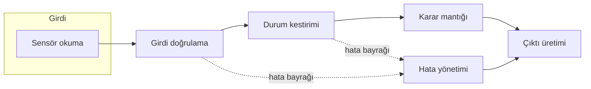
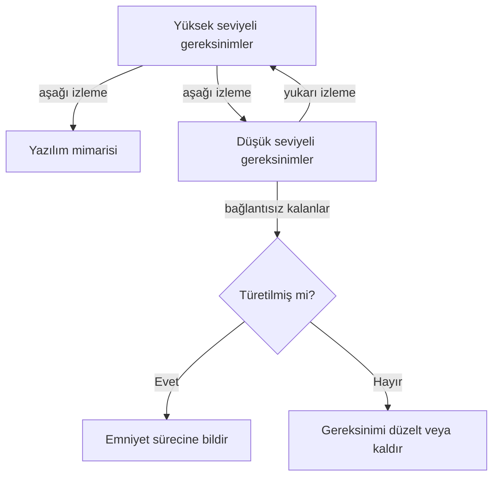

# 7. Yazılım Tasarımı

Tasarım, gereksinimlerin uygulanabilir bir yazılım yapısına dönüştüğü katmandır.
Bu aşamada mimari yapı, bileşen ayrımı, arayüzler ve hata davranışları netleşir.

İyi tasarım, kodun yalnızca çalışmasını değil, okunmasını, doğrulanmasını ve bakımının
yapılmasını da kolaylaştırır. Kritik nokta, tasarım kararlarının gereksinimlerle açık
biçimde bağlanmasıdır.

## Tasarımın rolü

Tasarım, bir gereksinimin "nasıl" tarafını görünür kılar. Yazılım ekibi burada işlevleri
alt bileşenlere ayırır, veri akışını tanımlar, durum geçişlerini belirler ve hata
işleme kurallarını netleştirir.

Bu aşama, yalnızca mimari çizim üretmek için değil, doğrulama için uygun bir yapı kurmak
için vardır. İyi tasarım, test ekibinin hangi davranışı hangi koşul altında gözlemlemesi
gerektiğini anlamasını sağlar.

DO-178C gözüyle tasarım iki iş ürününden oluşur: **yazılım mimarisi** (bileşenler ve
aralarındaki ilişkiler) ve **düşük seviyeli gereksinimler** (kodun doğrudan
gerçekleştireceği davranış tanımları). İkisinin de yüksek seviyeli gereksinimlere
izlenebilir olması beklenir.

## Tasarım yaklaşımları

Aviyonik yazılımda iki ana tasarım geleneği vardır: fonksiyonel ayrıştırmaya
(functional decomposition) dayalı **yapısal tasarım** (structured design) ve
**nesne yönelimli tasarım** (object-oriented design). İkisi de aynı soruyu yanıtlar
— sistem hangi parçalardan oluşacak ve bu parçalar nasıl konuşacak — ama parçalama
eksenleri farklıdır.

Yapısal tasarımda sistem, "ne yapıyor" sorusuna göre bölünür: girdi topla, doğrula,
hesapla, çıktı üret. Her modül bir işlevi temsil eder; veriler modüller arasında
açıkça taşınır. Nesne yönelimli tasarımda ise sistem, "neyi yönetiyor" sorusuna göre
bölünür: her birim, bir veri kümesini ve onun üzerinde geçerli işlemleri birlikte
kapsüller.

| Ölçüt | Yapısal tasarım | Nesne yönelimli tasarım |
|---|---|---|
| Parçalama ekseni | İşlevler | Veri ve sorumluluklar |
| Veri görünürlüğü | Açık veri akışı, izlemesi kolay | Kapsülleme, iç durum gizli |
| Çalışma zamanı davranışı | Statik, öngörülebilir çağrı yapısı | Dinamik bağlama kullanılırsa analiz zorlaşır |
| Doğrulama etkisi | Kontrol akışı doğrudan görünür | Sanal çağrılar ve kalıtım ek analiz ister |
| Aviyonikte yaygınlık | Çok yaygın (özellikle C ile) | Sınırlı; genellikle kısıtlanmış altkümelerle |

Emniyet-kritik projelerde C dilinin baskın olmasının bir nedeni de budur: yapısal
tasarım, çağrı grafiğinin ve veri akışının derleme zamanında tamamen belirli olmasını
kolaylaştırır. Nesne yönelimli teknikler yasak değildir; ancak kalıtım
(inheritance), çok biçimlilik (polymorphism) ve dinamik bellek gibi özellikler,
doğrulama yükünü artırdığı için genellikle bilinçli olarak kısıtlanır. DO-178C'nin
nesne yönelimli teknolojiye ayrılmış eki (DO-332), bu ek analiz konularını ayrıca ele
alır.

Hangi yaklaşım seçilirse seçilsin, tasarım en az iki görünümle anlatılmalıdır:

- **Veri akışı (data flow) görünümü**: hangi verinin nereden üretilip nerede
  tüketildiğini gösterir. Sensör girdisinden aktüatör çıktısına giden zinciri takip
  etmeyi sağlar.
- **Kontrol akışı (control flow) görünümü**: hangi bileşenin hangi sırayla ve hangi
  koşulda çalıştığını gösterir. Zamanlama, kesmeler ve görev öncelikleri burada
  görünür olur.



Yaklaşım seçiminde pratikte şu ölçütler belirleyicidir:

- **Yazılım seviyesi**: Seviye A/B projelerde analiz edilebilirlik öne çıkar; dinamik
  yapılar sınırlanır.
- **Ekip ve araç ekosistemi**: Derleyici, statik analiz ve kapsama araçlarının dili ve
  yapıları ne kadar desteklediği.
- **Mevcut kod ve yeniden kullanım**: Önceki projelerden gelen bileşenlerin tasarım
  tarzı, yeni tasarımı fiilen yönlendirir.
- **Sertifikasyon geçmişi**: Otoriteyle daha önce kabul görmüş bir yaklaşım, yeni ve
  savunulması zor bir yaklaşıma çoğu zaman tercih edilir.

## Tasarım kararları

Tasarımda tipik kararlar şunlardır:

- Fonksiyonları alt modüllere ayırmak.
- Hata durumları için ortak bir geri dönüş yolu belirlemek.
- Dış arayüzleri dar ve açık tutmak.
- Durum makineleriyle davranışı tanımlamak.
- Zamanlama ve öncelik etkilerini görünür kılmak.

Bu kararlar, kodun düzenini belirlediği kadar test stratejisini de belirler.

## Mimari düzey

İyi bir tasarım, büyük resmi korurken ayrıntıyı da yönetir. Örneğin:

- veri toplama ayrı modülde olabilir,
- karar verme ayrı modülde olabilir,
- çıkış üretimi ve hata raporlama ayrılabilir.

Bu ayrım, hata yayılımını sınırlar ve değişikliklerin etkisini küçültür.

## Arayüzler ve durumlar

Arayüzler sadece veri taşımak için değil, sorumluluk sınırını çizmek için de vardır.
Net olmayan arayüzler, modüllerin birbirinin iç detaylarına bağımlı hale gelmesine yol
açar.

Durum geçişleri ise özellikle emniyet-kritik davranışta önemlidir. Çünkü sistemin hangi
koşulda normal, hangi koşulda degrade ve hangi koşulda güvenli modda olduğunu açıkça
göstermek gerekir.

## Hata davranışı

İyi tasarım, hata durumunu sonradan eklenmiş bir istisna gibi değil, beklenen bir
işletim hali gibi ele alır. Bu nedenle tasarımda şunlar açık olmalıdır:

- hata nasıl algılanacak,
- hangi bileşen bildirim alacak,
- güvenli duruma nasıl geçilecek,
- geçiş sırasında ne tür sınırlamalar olacak.

## İyi tasarımın nitelikleri

İyi tasarımın en klasik iki ölçütü, **bağlaşım** (coupling) ve **uyum** (cohesion)
kavramlarıdır. Bağlaşım, iki modülün birbirine ne kadar bağımlı olduğunu; uyum, bir
modülün içindeki parçaların ne kadar tek bir amaca hizmet ettiğini anlatır. Hedef
her zaman aynıdır: **bağlaşım düşük, uyum yüksek** olmalıdır.

Bağlaşım düşükse bir modüldeki değişiklik komşularını daha az etkiler; değişiklik
etki analizi ve yeniden doğrulama kapsamı küçülür. Uyum yüksekse modülün ne yaptığı
tek cümleyle anlatılabilir; gözden geçirme ve test tasarımı kolaylaşır.

Bağlaşımın en sorunlu biçimi, modüllerin ortak global değişkenler üzerinden örtük
haberleşmesidir. Aşağıdaki C örneği farkı gösterir:

```c
/* Sıkı bağlaşım: iki modül global durumu paylaşıyor. */
extern float g_havahizi;          /* sensör modülü yazar, herkes okur */

void uyari_kontrol(void)
{
    if (g_havahizi > VNE_LIMIT) { /* kim, ne zaman güncelledi belli değil */
        uyari_ver(UYARI_ASIRI_HIZ);
    }
}

/* Gevşek bağlaşım: veri, açık bir arayüzden parametreyle taşınıyor. */
void uyari_kontrol2(float havahizi_knot)
{
    if (havahizi_knot > VNE_LIMIT) {
        uyari_ver(UYARI_ASIRI_HIZ);
    }
}
```

İkinci biçimde fonksiyonun tüm girdisi imzasında görünür; birim testi de sadece
parametre vererek yazılabilir. Birinci biçimde ise test, global durumu kurmak ve
başka modüllerin yan etkilerini dışlamak zorundadır.

Bağlaşım ve uyumun ötesinde, emniyet-kritik tasarımda aranan nitelikler şunlardır:

- **Doğrulanabilirlik**: Her düşük seviyeli gereksinim, gözlemlenebilir bir davranışa
  karşılık gelmeli; "test edilemeyen tasarım" bir tasarım hatasıdır.
- **Kararlılık**: Küçük bir gereksinim değişikliği tasarımın büyük bölümünü
  devirmemeli; değişikliğin etkisi az sayıda modülle sınırlı kalmalıdır.
- **Değiştirilebilirlik**: Donanım farklılıkları ve yapılandırma verileri, çekirdek
  mantıktan ayrı tutulmalı; taşıma işi yerelleşmelidir.
- **Basitlik**: Aynı davranışı sağlayan iki tasarımdan analizi kolay olan tercih
  edilir; zekice ama izlenemez çözümler sertifikasyonda pahalıya mal olur.
- **Öngörülebilirlik**: En kötü durum yürütme süresi ve bellek kullanımı tasarımdan
  kestirilebilmelidir; özyineleme ve dinamik bellek bu yüzden genellikle dışlanır.

Bu nitelikler ölçülebilir de kılınabilir. Pratikte kullanılan göstergeler:

| Nitelik | Tipik gösterge |
|---|---|
| Bağlaşım | Modül başına dış bağımlılık sayısı, global veri erişim sayısı |
| Uyum | Modülün tek sorumlulukla tarif edilebilmesi (gözden geçirme ölçütü) |
| Basitlik | Çevrimsel karmaşıklık (cyclomatic complexity) üst sınırı |
| Doğrulanabilirlik | Test edilemeyen düşük seviyeli gereksinim sayısı (hedef: sıfır) |
| Öngörülebilirlik | Statik olarak hesaplanabilen en derin çağrı zinciri ve yığın kullanımı |

Bu eşikler proje standartlarında (tasarım ve kodlama standartları) sayısal olarak
tanımlanır; gözden geçirmelerde ve statik analizde otomatik denetlenebilir hale
gelir.

## Tasarımın doğrulanması

Tasarım aşamasının doğrulaması test ile değil, ağırlıklı olarak **gözden geçirme ve
analiz** ile yapılır; çünkü ortada henüz çalıştırılacak kod yoktur. DO-178C bu
değerlendirmeyi iki iş ürünü için ayrı ayrı bekler: mimari ve düşük seviyeli
gereksinimler farklı sorulara farklı ölçütlerle tabi tutulur.

**Mimari değerlendirmesinde** tipik sorular şunlardır:

- Mimari, yüksek seviyeli gereksinimlerle uyumlu mu? Gereksinimlerin öngörmediği bir
  işlev ya da atlanmış bir işlev var mı?
- Bileşenler arası arayüzler tanımlı ve tutarlı mı? Bir tarafın gönderdiğini diğer
  taraf aynı biçimde mi bekliyor?
- Hata algılama ve güvenli duruma geçiş yolları mimaride görünüyor mu?
- Yazılım bölümlemesi kullanılıyorsa bölümler arası koruma ihlal edilebiliyor mu?
- Kaynak bütçeleri (işlemci zamanı, bellek, veri yolu) mimari düzeyde tutarlı mı?

**Düşük seviyeli gereksinimlerin değerlendirmesinde** ise odak davranış tanımının
kalitesidir:

- Her düşük seviyeli gereksinim tekil, belirsizlikten uzak ve test edilebilir mi?
- Yüksek seviyeli gereksinimlerle çelişki ya da boşluk var mı?
- Donanım/yazılım arayüzüne ve hedef bilgisayarın kısıtlarına uygun mu?
- Algoritmalar (filtreler, ölçekleme, sınır denetimleri) doğru ve kararlı mı?

Bu iki değerlendirmenin omurgası **izlenebilirlik** kontrolüdür. İki yönde bakılır:

- **Aşağı yönde**: Her yüksek seviyeli gereksinim, en az bir düşük seviyeli
  gereksinime ya da mimari öğeye iniyor mu? İnmeyen gereksinim, tasarımda unutulmuş
  demektir.
- **Yukarı yönde**: Her düşük seviyeli gereksinim bir yüksek seviyeli gereksinime
  bağlanıyor mu? Bağlanmayanlar ya **türetilmiş gereksinimdir** (derived requirement)
  ve emniyet değerlendirmesine bildirilmelidir, ya da gereksiz kod adayıdır.



Pratikte tasarım gözden geçirmeleri kontrol listeleriyle yürütülür ve bulgular kayıt
altına alınır: kim baktı, hangi sürüme baktı, hangi ölçüt geçti, hangi bulgu açık
kaldı. Bu kayıtlar hem kalite güvencesinin hem de katılım aşaması denetimlerinin
(özellikle SOI 2) doğrudan girdisidir. Deneyimle sabittir ki tasarım aşamasında
yakalanan bir tutarsızlık, kod ve test yazıldıktan sonra yakalanana göre kat kat
ucuza düzeltilir; gözden geçirmeye ayrılan zaman bu yüzden bir maliyet değil,
yatırımdır.

## Bu bölümden akılda kalması gerekenler

- Tasarım, gereksinimi uygulanabilir yapıya çevirir; DO-178C gözüyle mimari ve düşük
  seviyeli gereksinimlerden oluşur.
- Yaklaşım seçiminde (yapısal ya da nesne yönelimli) belirleyici ölçüt,
  analiz edilebilirlik ve doğrulama yüküdür; tasarım hem veri akışı hem kontrol
  akışı görünümüyle anlatılmalıdır.
- Bağlaşım düşük, uyum yüksek tutulur; doğrulanabilirlik, basitlik ve
  öngörülebilirlik proje standartlarında ölçülebilir eşiklere bağlanır.
- Arayüz ve hata davranışı tasarımın merkezindedir.
- Tasarım, gözden geçirme ve analizle doğrulanır; mimari ile düşük seviyeli
  gereksinimler ayrı ölçütlerle değerlendirilir ve iki yönlü izlenebilirlik kontrol
  edilir.
- İyi tasarım, doğrulamayı kolaylaştırır; tasarımda yakalanan hata en ucuz hatadır.
