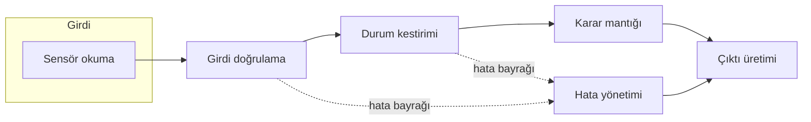
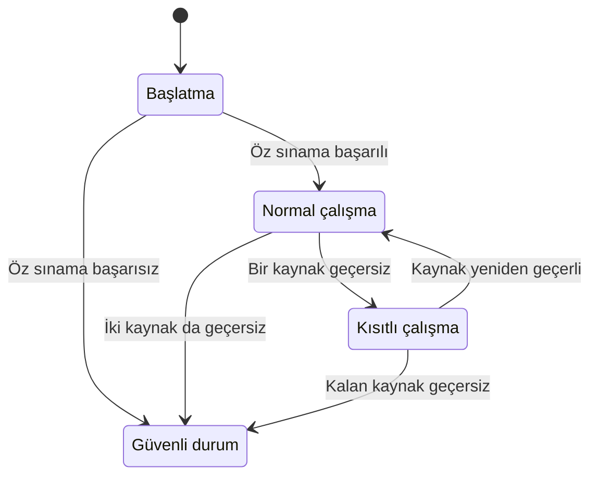
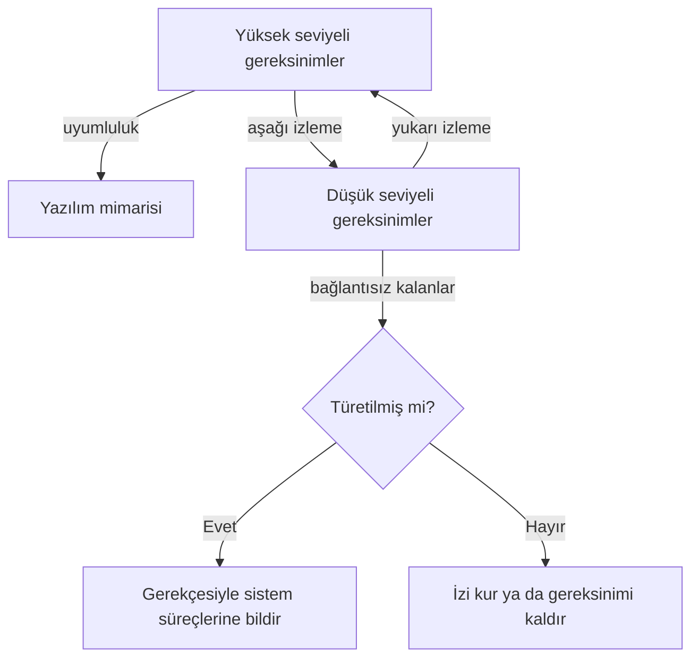

# 7. Yazılım Tasarımı

Tasarım, gereksinimlerin uygulanabilir bir yazılım yapısına dönüştüğü katmandır.
Bu bölüm, tasarımın iki çıktısını (yazılım mimarisi ve düşük seviyeli gereksinimler),
arayüzlerin, durumların ve hata davranışının nasıl tasarlandığını ve DO-178C'nin
tasarımdan beklediği doğrulamayı anlatır.

İyi tasarım, kodun yalnızca çalışmasını değil, okunmasını, doğrulanmasını ve bakımının
yapılmasını da kolaylaştırır. Kritik nokta, tasarım kararlarının gereksinimlerle açık
biçimde bağlanmasıdır.

## Tasarımın rolü

Tasarım, bir gereksinimin "nasıl" tarafını görünür kılar. Yazılım ekibi burada işlevleri
alt bileşenlere ayırır, veri akışını tanımlar, durum geçişlerini belirler ve hata
işleme kurallarını netleştirir.

Bu aşama, yalnızca mimari çizim üretmek için değil, doğrulama için uygun bir yapı kurmak
için vardır. İyi tasarım, test ekibinin hangi davranışı hangi koşul altında gözlemlemesi
gerektiğini anlamasını sağlar.

DO-178C gözüyle tasarım iki iş ürününden oluşur: **yazılım mimarisi** (software
architecture; bileşenler ve aralarındaki ilişkiler) ve **düşük seviyeli gereksinimler**
(low-level requirements; kodun doğrudan gerçekleştireceği davranış tanımları). Düşük
seviyeli gereksinimlerin yüksek seviyeli gereksinimlere (high-level requirements)
izlenebilir, mimarinin ise onlarla uyumlu olması beklenir. Yüksek seviyeli
gereksinimlerin nasıl yazıldığı
[6. Yazılım Gereksinimleri](./06-yazilim-gereksinimleri.md) bölümünde anlatılmıştır.

Tasarım tek yönlü bir aktarım da değildir. Bir gereksinimin eksik, çelişkili ya da
gerçekleştirilemez olduğunu çoğu zaman ilk fark eden kişi tasarımcıdır. Böyle bir
durumda boşluk tasarımda sessizce doldurulmaz; gereksinim sürecine geri bildirilir ve
gereksinimin kendisi düzeltilir.

## Tasarım tanımı ve düşük seviyeli gereksinimler

Tasarım sürecinin ürettiği yazılım yaşam döngüsü verisi (software life cycle data)
**tasarım tanımıdır** (design description). Adı tek bir belgeyi çağrıştırsa da içerik
pratikte bir mimari dokümanına, gereksinim yönetim aracındaki düşük seviyeli
gereksinimlere ve bir veri sözlüğüne (data dictionary) dağılabilir; önemli olan
paketleme değil,
içeriğin eksiksiz olmasıdır. Tasarım tanımında bulunması beklenenler şöyle
özetlenebilir:

- **Mimari**: bileşenler, sorumlulukları ve arayüzleri; veri akışı ve kontrol akışı.
- **Düşük seviyeli gereksinimler**: algoritmalar ve veri yapıları dahil, yüksek
  seviyeli gereksinimlerin nasıl karşılandığının ayrıntılı tanımı; tasarım sırasında
  doğan türetilmiş gereksinimler (derived requirements).
- **Girdi ve çıktı tanımları**: iç ve dış arayüzlerdeki verilerin sözlüğü.
- **Kaynak kullanımı**: işlemci zamanı ve bellek gibi kaynakların sınırları, bırakılan
  pay ve bunların nasıl ölçüleceği.
- **Çizelgeleme (scheduling) ve iletişim**: görev yapısı, kesmeler, görevler ya da
  işlemciler arası iletişim mekanizmaları.
- **Özel mekanizmalar**: varsa yazılım bölümlemesi (software partitioning) yöntemi,
  devre dışı bırakılmış kodun (deactivated code) etkinleşmesini önleyen düzen, yazılım
  yükleme ya da kullanıcı tarafından değiştirilebilir yazılım (user-modifiable
  software) için seçilen tasarım yöntemleri.
- **Bileşenlerin kaynağı**: hangi bileşenin yeni, hangisinin önceden geliştirilmiş
  olduğu.
- **Tasarım gerekçeleri**: emniyetle ilgili sistem gereksinimlerine dayanan tasarım
  kararlarının nedeni.

Bu içeriğin en çok tartışılan kısmı düşük seviyeli gereksinimlerin ayrıntı düzeyidir.
Ölçüt şudur: kodlayıcı, düşük seviyeli gereksinimi ve mimariyi okuyarak kodu başka
bilgiye ihtiyaç duymadan, kendi başına davranış kararı vermeden yazabilmelidir. Bunun
iki sınırı vardır. Fazla soyut kalan gereksinim ("uyarı mantığını uygula") kararı koda
bırakır; kodda gereksinimde yazmayan davranış belirir ve gereksinim tabanlı test (requirements-based testing) onu
sınayamaz. Fazla ayrıntılı gereksinim ise kodun düzyazıya çevrilmiş kopyasına dönüşür;
ondan türetilen test kodun doğruluğunu değil kendisiyle tutarlılığını gösterir, her kod
değişikliği de bir gereksinim değişikliğine dönüşür. Ayrıntı düzeyi bu yüzden kişisel
tercihe bırakılmaz; tasarım standardında tanımlanır (bkz.
[5. Yazılım Planlama](./05-yazilim-planlama.md)).

Aşağıdaki örnek, bölüm boyunca kullanılacak aşırı hız uyarısı işlevinde bir yüksek
seviyeli gereksinimin düşük seviyeli gereksinimlere nasıl indirildiğini gösterir.
Kimliklerdeki HLR ve LLR, yüksek ve düşük seviyeli gereksinimin yerleşik
kısaltmalarıdır; kimlikler ve sayılar temsilîdir:

| Kimlik | Gereksinim | İz |
|---|---|---|
| HLR-42 | Havahızı aşılmaması gereken hızı (VNE) geçtiğinde yazılım, en geç 200 ms içinde aşırı hız uyarısını etkinleştirmelidir. | Sistem gereksinimi |
| LLR-42-1 | Uyarı mantığı her 50 ms'lik çevrimde bir kez çalışır ve o çevrimde doğrulanmış havahızı örneğini kullanır. | HLR-42 |
| LLR-42-2 | Havahızı geçerliyse ve `VNE_LIMIT` değerinden büyükse uyarı çıkışı ETKİN yapılır. | HLR-42 |
| LLR-42-3 | Uyarı ETKİN iken havahızı `VNE_LIMIT` değerinin 3 knot altına inmeden uyarı kaldırılmaz. | HLR-42; türetilmiş |

İlk iki satır üst gereksinimin "ne zaman" ve "hangi koşulda" kısımlarını koda
yazılabilir hâle getirir. Üçüncü satır farklıdır: yüksek seviyeli gereksinim uyarının
ne zaman kalkacağını söylemez; histerezis (hysteresis), hız sınır çevresinde
dalgalanırken uyarının açılıp kapanmasını önlemek için tasarımda alınmış bir karardır.
Üst gereksinime bağlansa da orada belirtilenin ötesinde davranış tanımladığı için
türetilmiş gereksinimdir; gerekçesiyle kaydedilir ve emniyet değerlendirmesi dahil
sistem süreçlerine bildirilir. Filtre katsayıları, zaman aşımı değerleri ve teyit
süreleri tasarımda en sık karşılaşılan türetilmiş gereksinim kaynaklarıdır.

Yüksek seviyeli gereksinimler kodun doğrudan yazılabileceği ayrıntıdaysa tek
gereksinim katmanıyla çalışmak mümkündür; o durumda bu gereksinimler düşük seviyeli
gereksinim işlevini de görür ve her iki katman için beklenen doğrulama onlara
uygulanır. DO-178C bu yolu açık bırakır, ama tek gereksinim katmanı üreten bir süreç
için başvuru sahibinden gerekçe istenebileceğini de not eder. Otoriteler katmanların
birleştirilmesine temkinli yaklaşır: aradaki inceltme adımı görünmez olduğunda
izlenebilirlik analizinin boşlukları yakalaması zorlaşır. Böyle bir yaklaşım yazılım
sertifikasyon planında (Plan for Software Aspects of Certification, PSAC) açıkça
yazılmalı ve otoriteyle erkenden konuşulmalıdır.

## Tasarım yaklaşımları

Aviyonik yazılımda iki ana tasarım geleneği vardır: fonksiyonel ayrıştırmaya
(functional decomposition) dayalı **yapısal tasarım** (structured design) ve
**nesne yönelimli tasarım** (object-oriented design). İkisi de aynı soruyu yanıtlar
— sistem hangi parçalardan oluşacak ve bu parçalar nasıl konuşacak — ama parçalama
eksenleri farklıdır.

Yapısal tasarımda sistem, "ne yapıyor" sorusuna göre bölünür: girdi topla, doğrula,
hesapla, çıktı üret. Her modül bir işlevi temsil eder; veriler modüller arasında
açıkça taşınır. Nesne yönelimli tasarımda ise sistem, "neyi yönetiyor" sorusuna göre
bölünür: her birim, bir veri kümesini ve onun üzerinde geçerli işlemleri birlikte
kapsüller.

| Ölçüt | Yapısal tasarım | Nesne yönelimli tasarım |
|---|---|---|
| Parçalama ekseni | İşlevler | Veri ve sorumluluklar |
| Veri görünürlüğü | Açık veri akışı, izlemesi kolay | Kapsülleme, iç durum gizli |
| Çalışma zamanı davranışı | Statik, öngörülebilir çağrı yapısı | Dinamik bağlama kullanılırsa analiz zorlaşır |
| Doğrulama etkisi | Kontrol akışı doğrudan görünür | Sanal çağrılar ve kalıtım ek analiz ister |
| Aviyonikte yaygınlık | Çok yaygın (özellikle C ile) | Sınırlı; genellikle kısıtlanmış alt kümelerle |

Emniyet-kritik projelerde C dilinin baskın olmasının bir nedeni de budur: yapısal
tasarım, çağrı grafiğinin ve veri akışının derleme zamanında tamamen belirli olmasını
kolaylaştırır. Nesne yönelimli teknikler yasak değildir; ancak kalıtım
(inheritance), çok biçimlilik (polymorphism) ve dinamik bellek gibi özellikler,
doğrulama yükünü artırdığı için genellikle bilinçli olarak kısıtlanır. DO-178C'nin
nesne yönelimli teknolojiye ayrılmış eki (DO-332), bu ek analiz konularını ayrıca ele
alır; ayrıntısı
[15. DO-332 ve Nesne Yönelimli Teknoloji ve İlgili Teknikler](../04-arac-kalifikasyonu-ve-ekler/15-do332-nesne-yonelimli-teknoloji.md)
bölümündedir.

Hangi yaklaşım seçilirse seçilsin, tasarım en az iki görünümle anlatılmalıdır:

- **Veri akışı (data flow) görünümü**: hangi verinin nereden üretilip nerede
  tüketildiğini gösterir. Sensör girdisinden aktüatör çıktısına giden zinciri takip
  etmeyi sağlar.
- **Kontrol akışı (control flow) görünümü**: hangi bileşenin hangi sırayla ve hangi
  koşulda çalıştığını gösterir. Zamanlama, kesmeler ve görev öncelikleri burada
  görünür olur.

Aşağıdaki diyagram, tipik bir "algıla, karar ver, çıktı üret" zincirinin veri akışı
görünümüdür. Kontrol akışı görünümünün örnekleri (çevrim sırası ve durum diyagramı)
bir sonraki kısımdadır.


```mermaid
flowchart LR
  subgraph Girdi
    A[Sensör okuma]
  end
  A --> B[Girdi doğrulama]
  B --> C[Durum kestirimi]
  C --> D[Karar mantığı]
  D --> E[Çıktı üretimi]
  B -. hata bayrağı .-> F[Hata yönetimi]
  C -. hata bayrağı .-> F
  F --> E
```

Yaklaşım seçiminde pratikte şu ölçütler belirleyicidir:

- **Yazılım seviyesi (software level)**: Seviye A ve B projelerinde analiz edilebilirlik öne çıkar;
  dinamik yapılar sınırlanır.
- **Ekip ve araç ekosistemi**: Derleyici, statik analiz ve kapsama araçlarının dili ve
  yapıları ne kadar desteklediği.
- **Mevcut kod ve yeniden kullanım**: Önceki projelerden gelen bileşenlerin tasarım
  tarzı, yeni tasarımı fiilen yönlendirir.
- **Sertifikasyon geçmişi**: Otoriteyle daha önce kabul görmüş bir yaklaşım, yeni ve
  savunulması zor bir yaklaşıma çoğu zaman tercih edilir.

## Mimari: bileşenler, arayüzler ve durumlar

Mimari kararlarının çoğu üç soruya iner: sorumluluk hangi bileşende, bileşenler
birbirine hangi arayüzden bağlı ve yazılım hangi durumda ne yapıyor. Bu kararlar kodun
düzenini belirlediği kadar test stratejisini de belirler; neyin tek başına
sınanabileceği, hangi arayüzün entegrasyon testinde işletileceği burada kesinleşir.

**Bileşenler ve katmanlar.** Gömülü aviyonik yazılımda yaygın düzen katmanlı mimaridir
(layered architecture): donanıma dokunan sürücüler altta, zamanlama ve haberleşme gibi
ortak hizmetler ortada, uygulama mantığı üsttedir. Uygulama katmanı da kendi içinde
işleve göre ayrılır; veri toplama, girdi doğrulama, karar mantığı, çıktı üretimi ve
hata yönetimi ayrı bileşenlerdir. Bu düzeni değerli kılan çizimi değil, kurallarıdır:
bağımlılık yalnızca üstten alta doğrudur, katman atlanmaz ve donanım yazmaçlarına
(register) yalnızca sürücü katmanı erişir. Kural tutulduğunda donanım değişikliği sürücü
katmanında kalır, bir bileşendeki hata komşusuna ancak tanımlı arayüzden yayılabilir
ve değişiklik etki analizinin (change impact analysis) kapsamı küçülür.

**Arayüzler.** Arayüz veri taşıdığı kadar sorumluluk sınırını da çizer. Net olmayan
arayüz, bileşenlerin birbirinin iç ayrıntısına bağımlı hâle gelmesine yol açar.
Entegrasyonda sık görülen hata türü de iki tarafın aynı veriyi farklı yorumlamasıdır:
biri knot gönderir, öbürü metre/saniye bekler; biri "geçersiz" anlamında sıfır yazar,
öbürü sıfırı ölçüm sanır. Bu yüzden her arayüz verisi için en azından şu öznitelikler
tasarımda yazılı olmalıdır (değerler örnektir):

| Öznitelik | Örnek: doğrulanmış havahızı |
|---|---|
| Üreten ve tüketen | Girdi doğrulama üretir; uyarı mantığı tüketir |
| Tip ve birim | 32 bit kayan noktalı; knot |
| Geçerli aralık ve çözünürlük | 0–450 knot; 0,1 knot |
| Güncelleme hızı | 50 ms'de bir |
| Tazelik sınırı | 150 ms'den eski örnek geçersiz sayılır |
| Geçerlilik bilgisi | Ayrı bir geçerli/geçersiz bayrağı; geçersizken değer kullanılmaz |
| Başlangıç değeri | İlk geçerli örnek gelene kadar geçersiz |

Tabloda değerin kendisinden çok geçerlilik ve tazelik satırları belirleyicidir:
tüketen bileşenin veriyi kullanmadan önce neye bakacağı ve veri kullanılamazsa ne
yapacağı arayüz tanımının parçasıdır.

**Kontrol akışı ve durumlar.** Kontrol akışının en yalın biçimi sabit sıralı çevrimdir:
örnekte her 50 ms'lik çevrimde sırasıyla sensör okuma, girdi doğrulama, durum yönetimi,
uyarı mantığı ve çıktı üretimi çalışır. Sıra tasarımda yazılı olduğunda verinin
tazeliği ve uçtan uca gecikme hesapla gösterilebilir; 200 ms'lik tepki süresinin kaç
çevrime karşılık geldiği buradan okunur. Görevler, öncelikler ve kesmeler devreye
girdiğinde aynı bilgi çizelgeleme tasarımıyla verilir.

Davranışın kipe bağlı olduğu yerde durum makinesi (state machine) kullanılır.
Emniyet-kritik yazılımda en azından normal çalışma, kısıtlı çalışma (degraded mode) ve
güvenli durum (safe state) ayrımının, aralarındaki geçiş koşullarıyla birlikte açıkça
tanımlanması gerekir. İki havahızı kaynağından beslenen örnek için:


```mermaid
stateDiagram-v2
  state "Başlatma" as Baslatma
  state "Normal çalışma" as Normal
  state "Kısıtlı çalışma" as Kisitli
  state "Güvenli durum" as Guvenli
  [*] --> Baslatma
  Baslatma --> Normal : Öz sınama başarılı
  Baslatma --> Guvenli : Öz sınama başarısız
  Normal --> Kisitli : Bir kaynak geçersiz
  Kisitli --> Normal : Kaynak yeniden geçerli
  Normal --> Guvenli : İki kaynak da geçersiz
  Kisitli --> Guvenli : Kalan kaynak geçersiz
```

Durum diyagramının değeri eksikleri görünür kılmasıdır. Her durum için her olayın
karşılığı sorulur ("kısıtlı çalışmadayken ikinci kaynak da bozulursa?") ve tanımsız
kalan her çift ya bir düşük seviyeli gereksinimle doldurulur ya da bilerek yok
sayıldığı yazılır. Diyagramdaki her geçiş bir düşük seviyeli gereksinime, o da en az
bir test durumuna (test case) karşılık gelir; izin verilmeyen geçişler ise gürbüzlük
(robustness) testlerinin konusudur.

## Hata davranışının tasarımı

İyi tasarım, hata durumunu sonradan eklenmiş bir istisna gibi değil, beklenen bir
işletim hâli gibi ele alır. Arıza karşısında yazılımdan ne beklendiği — hangi durumun
güvenli sayıldığı dahil — yazılım ekibinin tercihi değildir; sistem gereksinimlerinden
ve onların arkasındaki emniyet değerlendirmesinden gelir (bkz.
[3. Sistem Emniyet Değerlendirmesi Bağlamında Yazılım](../02-baglam/03-sistem-emniyet-degerlendirmesi-baglaminda-yazilim.md)).
Tasarımın işi, bu beklentiyi dört soruya ayrıntılı yanıt vererek gerçekleştirmektir.
Havahızı kaynağının arızalandığı senaryoda yanıtlar şöyle olabilir:

| Soru | Örnekteki tasarım kararı |
|---|---|
| Hata nasıl algılanır? | Aralık denetimi (0–450 knot dışı değer), tazelik denetimi (150 ms'den eski örnek) ve sensörün kendi durum bildirimi |
| Kim bilgilendirilir? | Girdi doğrulama geçerlilik bayrağını düşürür; hata yönetimi bileşeni arızayı kaydeder ve durum yönetimine bildirir |
| Hangi duruma geçilir? | Tek kaynak kaybında kalan kaynakla kısıtlı çalışma; iki kaynak da kaybedilirse güvenli durum (uyarı işlevi "kullanılamıyor" olarak bildirilir) |
| Geçiş nasıl sınırlanır? | Arıza art arda üç çevrimde görülmeden durum değişmez; normale dönüş için kaynak belirli bir süre geçerli kalmalıdır; güvenli durumdan yalnızca yeniden başlatmayla çıkılır |

Bu konuda iki tasarım hatası sık görülür. İlki, "son geçerli değeri kullan" kuralını
süre sınırı olmadan yazmaktır: veri akışı kesildiğinde yazılım bayat değerle normal
çalışıyormuş gibi görünür. İkincisi, her bileşenin hataya kendi içinde, ötekilerden
habersiz tepki vermesidir: aynı arıza bir yerde yok sayılır, başka bir yerde yeniden
başlatmaya yol açar. Hata tepkisinin tek bir bileşende toplanması ve ortak bir geri
dönüş yoluna bağlanması hem davranışı tutarlı kılar hem de sınanacak yol sayısını
azaltır.

Tasarımda yazılan her algılama eşiği, teyit süresi ve geçiş koşulu aynı zamanda bir
gürbüzlük testinin girdisidir. Bu değerler tasarımda yoksa test ekibi neyi sınayacağını
koddan öğrenmek zorunda kalır; bu da gereksinim tabanlı testin mantığına aykırıdır.

## İyi tasarımın nitelikleri

İyi tasarımın en klasik iki ölçütü, **bağlaşım** (coupling) ve **iç uyum** (cohesion)
kavramlarıdır. Bağlaşım, iki modülün birbirine ne kadar bağımlı olduğunu; iç uyum, bir
modülün içindeki parçaların ne kadar tek bir amaca hizmet ettiğini anlatır. Hedef
her zaman aynıdır: **bağlaşım düşük, iç uyum yüksek** olmalıdır.

Bağlaşım düşükse bir modüldeki değişiklik komşularını daha az etkiler; değişiklik
etki analizi ve yeniden doğrulama kapsamı küçülür. İç uyum yüksekse modülün ne yaptığı
tek cümleyle anlatılabilir; gözden geçirme ve test tasarımı kolaylaşır.

Bağlaşımın en sorunlu biçimi, modüllerin ortak global değişkenler üzerinden örtük
haberleşmesidir. Aşağıdaki C örneği farkı gösterir:

```c
/* float32_t: projenin sabit genişlikli kayan nokta tipi. */

/* Sıkı bağlaşım: iki modül global durumu paylaşıyor. */
extern float32_t g_havahizi_knot;      /* sensör modülü yazar, herkes okur */

void uyari_kontrol_global(void)
{
    if (g_havahizi_knot > VNE_LIMIT) { /* kim, ne zaman güncelledi belli değil */
        uyari_ver(UYARI_ASIRI_HIZ);
    }
}

/* Gevşek bağlaşım: veri, açık bir arayüzden parametreyle taşınıyor. */
void uyari_kontrol(float32_t havahizi_knot)
{
    if (havahizi_knot > VNE_LIMIT) {
        uyari_ver(UYARI_ASIRI_HIZ);
    }
}
```

İkinci biçimde fonksiyonun tüm girdisi imzasında görünür; birim testi de sadece
parametre vererek yazılabilir. Birinci biçimde ise test, global durumu kurmak ve
başka modüllerin yan etkilerini dışlamak zorundadır.

Global veri yasak değildir; kesme ile görev arasında paylaşılan veri gibi durumlarda
kaçınılmaz da olabilir. Ancak paylaşılan her verinin yazanı, okuyanları ve erişim
koruması mimaride tanımlanmalıdır. Bileşenler arasındaki veri ve kontrol bağlaşımı
tasarım verisinin parçasıdır; Seviye A, B ve C'de gereksinim tabanlı testlerin bu
bağlaşımları ne ölçüde işlettiği ayrıca analiz edilir (bkz.
[9. Yazılım Doğrulama](./09-yazilim-dogrulama.md)). Mimaride görünmeyen bir bağlaşım, o
analizde de görünmez.

Bağlaşım ve iç uyumun ötesinde, emniyet-kritik tasarımda aranan nitelikler şunlardır:

- **Doğrulanabilirlik**: Her düşük seviyeli gereksinim, gözlemlenebilir bir davranışa
  karşılık gelmeli; "test edilemeyen tasarım" bir tasarım hatasıdır.
- **Kararlılık**: Küçük bir gereksinim değişikliği tasarımın büyük bölümünü
  devirmemeli; değişikliğin etkisi az sayıda modülle sınırlı kalmalıdır.
- **Değiştirilebilirlik**: Donanım farklılıkları ve konfigürasyon verileri, çekirdek
  mantıktan ayrı tutulmalı; taşıma işi yerelleşmelidir (bkz.
  [22. Konfigürasyon Verisi](../05-ozel-konular/22-konfigurasyon-verisi.md)).
- **Basitlik**: Aynı davranışı sağlayan iki tasarımdan analizi kolay olan tercih
  edilir; zekice ama izlenemez çözümler sertifikasyonda pahalıya mal olur.
- **Öngörülebilirlik**: En kötü durum yürütme süresi (worst-case execution time, WCET)
  ve bellek kullanımı tasarımdan kestirilebilmelidir; özyineleme ve dinamik bellek bu
  yüzden genellikle dışlanır.

Bu nitelikler ölçülebilir de kılınabilir. Pratikte kullanılan göstergeler:

| Nitelik | Tipik gösterge |
|---|---|
| Bağlaşım | Modül başına dış bağımlılık sayısı, global veri erişim sayısı |
| İç uyum | Modülün tek sorumlulukla tarif edilebilmesi (gözden geçirme ölçütü) |
| Basitlik | Çevrimsel karmaşıklık (cyclomatic complexity) üst sınırı |
| Doğrulanabilirlik | Test edilemeyen düşük seviyeli gereksinim sayısı (hedef: sıfır) |
| Öngörülebilirlik | Statik olarak hesaplanabilen en derin çağrı zinciri ve yığın kullanımı |

Bu eşikler proje standartlarında (tasarım ve kodlama standartları) sayısal olarak
tanımlanır; gözden geçirmelerde ve statik analizde otomatik denetlenebilir hâle
gelir.

## Tasarımda ayrıca düşünülecekler

Bazı konular kodlamaya ya da doğrulamaya bırakıldığında pahalıya çözülür; tasarımda
karara bağlanmaları gerekir. Ayrıntıları kitabın ilgili bölümlerindedir; burada
tasarıma düşen pay özetlenmiştir.

- **Devre dışı bırakılmış kod**: Yazılımda yalnızca belirli konfigürasyonlarda çalışan
  ya da hiç çalıştırılması amaçlanmayan kod bulunacaksa, bu kodun etkin işlevleri
  olumsuz etkilemesini ve istem dışı etkinleşmesini önleyen mekanizma tasarımda
  tanımlanır; kullanılması amaçlanmayan ortamlarda kodun gerçekten devre dışı olduğu
  kanıtla gösterilir. Kodun kendisi de gereksinime izlenebilir tutulur ve etkin kodla
  aynı hedeflere göre geliştirilir (bkz.
  [17. Kapsanmayan Kodlar: Ölü, Gereksiz ve Devre Dışı Bırakılmış Kodlar](../05-ozel-konular/17-kapsanmayan-kodlar.md)).
- **Kullanıcı tarafından değiştirilebilir yazılım**: Değiştirilebilen bileşenin
  değiştirilemeyen bileşeni etkilemesini önleyen koruma mimaride kurulur; koruma
  donanımla, yazılımla, değişikliği yapan araçla ya da bunların birleşimiyle
  sağlanabilir. Yazılımla sağlanıyorsa değiştirilemeyen bileşenin yazılım seviyesinde
  tasarlanır ve doğrulanır; araçla sağlanıyorsa araç, araç kalifikasyonu (tool
  qualification) kurallarına göre sınıflandırılır ve kalifiye edilir. Değiştirilebilen
  bileşenin yalnızca öngörülen yoldan değiştirilebildiği de gösterilir (bkz.
  [19. Kullanıcı Tarafından Değiştirilebilir Yazılım](../05-ozel-konular/19-kullanici-tarafindan-degistirilebilir-yazilim.md)).
- **Yazılım bölümlemesi**: Farklı yazılım seviyesindeki bileşenler aynı işlemciyi
  paylaşacaksa bölümleme yöntemi ve ihlali önleyen düzen mimarinin parçasıdır.
  Bölümleme ya da başka bir mimari önlem bileşenlerin yazılım seviyesini etkiliyorsa bu
  bilgi türetilmiş gereksinim olarak sistem süreçlerine bildirilir (bkz.
  [21. Yazılım Bölümlemesi](../05-ozel-konular/21-yazilim-bolumlemesi.md)).
- **Çizelgeleme ve paylaşılan kaynaklar**: Görev yapısı, öncelikler, kesme kullanımı
  ve paylaşılan verinin korunması tasarım kararıdır; işletim sistemi kullanılıyorsa
  hangi hizmetlerinin kullanılacağı da burada sınırlandırılır (bkz.
  [20. Gerçek Zamanlı İşletim Sistemleri](../05-ozel-konular/20-gercek-zamanli-isletim-sistemleri.md)).

## Tasarımın doğrulanması

Tasarım aşamasının doğrulaması test ile değil, ağırlıklı olarak **gözden geçirme ve
analiz** ile yapılır; çünkü ortada henüz çalıştırılacak kod yoktur. DO-178C bu
değerlendirmeyi iki iş ürünü için ayrı ayrı bekler: mimari ve düşük seviyeli
gereksinimler farklı sorulara farklı ölçütlerle tabi tutulur.

**Mimari değerlendirmesinde** tipik sorular şunlardır:

- Mimari, yüksek seviyeli gereksinimlerle uyumlu mu? Gereksinimlerin öngörmediği bir
  işlev ya da atlanmış bir işlev var mı?
- Bileşenler arası arayüzler tanımlı ve tutarlı mı? Bir tarafın gönderdiğini diğer
  taraf aynı biçimde mi bekliyor? Daha düşük yazılım seviyesindeki bir bileşenden veri
  alan bileşen, hatalı girdiye karşı kendini koruyor mu?
- Hata algılama ve güvenli duruma geçiş yolları mimaride görünüyor mu?
- Yazılım bölümlemesi kullanılıyorsa bölümler arası koruma ihlal edilebiliyor mu?
- Mimari hedef bilgisayarla uyumlu mu? Başlatma, eşzamanlama, eşzamansız çalışma ve
  kesme kullanımı donanımın özellikleriyle çatışıyor mu; kaynak bütçeleri (işlemci
  zamanı, bellek, veri yolu) mimari düzeyde tutarlı mı?
- Mimari doğrulanabilir mi; sınırsız özyineleme gibi doğrulanamayan yapılar içeriyor
  mu?
- Tasarım standardına uyulmuş mu, sapmalar gerekçelendirilmiş mi?

**Düşük seviyeli gereksinimlerin değerlendirmesinde** ise odak davranış tanımının
kalitesidir:

- Her düşük seviyeli gereksinim tekil, belirsizlikten uzak ve test edilebilir mi?
- Yüksek seviyeli gereksinimlerle çelişki ya da boşluk var mı?
- Donanım/yazılım arayüzüne ve hedef bilgisayarın kısıtlarına uygun mu?
- Algoritmalar (filtreler, ölçekleme, sınır denetimleri) doğru ve kararlı mı?
- Tasarım standardındaki yazım ve ayrıntı düzeyi kurallarına uyulmuş mu?

Düşük seviyeli gereksinimlerin değerlendirmesinin omurgası **izlenebilirlik**
kontrolüdür. İki yönde bakılır:

- **Aşağı yönde**: Her yüksek seviyeli gereksinim düşük seviyeli gereksinimlere iniyor
  mu? İnmeyen gereksinim, tasarımda unutulmuş demektir.
- **Yukarı yönde**: Her düşük seviyeli gereksinim bir yüksek seviyeli gereksinime
  bağlanıyor mu? Bağlanmayan gereksinim için üç yol vardır: eksik kalmış izi kurulur,
  **türetilmiş gereksinim** olarak gerekçesiyle işaretlenip emniyet değerlendirmesi
  dahil sistem süreçlerine bildirilir ya da gereksiz olduğu için kaldırılır.

Türetilmiş sayılmak için izin yokluğu şart değildir: histerezis örneğindeki gibi, üst
seviyede belirtilenin ötesinde davranış tanımlayan gereksinim de türetilmiştir. Tanım
ve geri bildirim yolu 6. bölümde anlatılmıştır.


```mermaid
flowchart TD
  A[Yüksek seviyeli gereksinimler] -- "uyumluluk" --> B[Yazılım mimarisi]
  A -- "aşağı izleme" --> C[Düşük seviyeli gereksinimler]
  C -- "yukarı izleme" --> A
  C -- "bağlantısız kalanlar" --> D{Türetilmiş mi?}
  D -- "Evet" --> E[Gerekçesiyle sistem süreçlerine bildir]
  D -- "Hayır" --> F[İzi kur ya da gereksinimi kaldır]
```

### Seviyeye göre beklentiler

Tasarımdan beklenen veri ve doğrulama yazılım seviyesine göre değişir:

| Yazılım seviyesi | Tasarım verisi | Tasarımın doğrulanması |
|---|---|---|
| Seviye A | Mimari ve düşük seviyeli gereksinimler | On üç tasarım doğrulama hedefinin (objective) tamamı; altısı bağımsızlıkla (independence) |
| Seviye B | Mimari ve düşük seviyeli gereksinimler | On üç hedefin tamamı; bağımsızlık üç hedefte aranır |
| Seviye C | Mimari ve düşük seviyeli gereksinimler | Dokuz hedef; hedef bilgisayarla uyumluluk ve doğrulanabilirlik hedefleri uygulanmaz, bağımsızlık aranmaz |
| Seviye D | Mimari; düşük seviyeli gereksinimler için hedef yoktur | Yalnızca, bölümleme kullanılıyorsa bölümleme bütünlüğünün doğrulanması |

Seviye B'de bağımsızlık üç hedefte aranır: düşük seviyeli gereksinimlerin yüksek
seviyeli gereksinimlere uyumu; doğruluğu ve tutarlılığı; algoritmaların doğruluğu.
Seviye A'da bunlara mimarinin yüksek seviyeli gereksinimlerle uyumluluğu, mimarinin
tutarlılığı ve bölümleme bütünlüğü eklenir.

İki noktaya dikkat etmek gerekir. Seviye D'de düşük seviyeli gereksinimlerin
sertifikasyon kanıtı olarak sunulması beklenmez; bu, tasarım yapılmayacağı anlamına
gelmez, yalnızca o verinin DO-178C hedefleriyle doğrulanmadığı anlamına gelir.
Bölümleme kullanılıyorsa mekanizmasının ayrıntısı bu seviyede de belgelenir.
Bağımsızlığın aranmadığı seviye ve hedeflerde ise tasarımın yazarı dışında biri
tarafından gözden geçirilmesi standart şartı değildir ama iyi uygulamadır; tasarım
hatasını en ucuza yakalayan yöntem budur.

Pratikte tasarım gözden geçirmeleri kontrol listeleriyle yürütülür ve bulgular kayıt
altına alınır: kim baktı, hangi sürüme baktı, hangi ölçüt geçti, hangi bulgu açık
kaldı. Bu kayıtlar hem kalite güvencesinin hem de katılım aşaması (Stage of
Involvement, SOI) denetimlerinin, özellikle geliştirme denetiminin
([SW SOI-2](../kaynaklar/soi-2.md)) doğrudan girdisidir. Deneyimle sabittir ki tasarım
aşamasında yakalanan bir tutarsızlık, kod ve test yazıldıktan sonra yakalanana göre
kat kat ucuza düzeltilir; gözden geçirmeye ayrılan zaman bu yüzden bir maliyet değil,
yatırımdır.

Tasarımdan kodlamaya hangi koşulla geçileceği planlardaki geçiş kriterleriyle
belirlenir; örnekleri
[Ek A: Örnek Geçiş Kriterleri](../06-ekler/01-ek-a-ornek-gecis-kriterleri.md)
sayfasındadır. Tasarımın koda dökülmesi ise
[8. Yazılım Gerçekleştirme: Kodlama ve Entegrasyon](./08-yazilim-gerceklestirme-kodlama-entegrasyon.md)
bölümünün konusudur.

## Bu bölümden akılda kalması gerekenler

- Tasarımın çıktısı tasarım tanımıdır: yazılım mimarisi ve düşük seviyeli
  gereksinimler. Düşük seviyeli gereksinimler yüksek seviyeli gereksinimlere
  izlenebilir, mimari onlarla uyumlu olmalıdır.
- Düşük seviyeli gereksinim, kodun başka bilgiye gerek kalmadan yazılabileceği kadar
  ayrıntılıdır ama kodun kopyası değildir; ayrıntı düzeyi tasarım standardında
  tanımlanır.
- Tasarımda doğan ve üst seviyede belirtilenin ötesine geçen her karar türetilmiş
  gereksinimdir; gerekçesiyle kaydedilir ve sistem süreçlerine bildirilir.
- Arayüz tanımı birim, aralık, güncelleme hızı ve geçerlilik bilgisini içerir; normal
  çalışma, kısıtlı çalışma ve güvenli durum arasındaki geçişler ile hata algılama ve
  tepki kuralları tasarımda yazılıdır.
- Bağlaşım düşük, iç uyum yüksek tutulur; doğrulanabilirlik, basitlik ve
  öngörülebilirlik proje standartlarında ölçülebilir eşiklere bağlanır.
- Tasarım, gözden geçirme ve analizle doğrulanır; beklenti yazılım seviyesine göre
  değişir ve Seviye D'de tasarım doğrulamasından yalnızca bölümleme bütünlüğü kalır.
- İyi tasarım doğrulamayı kolaylaştırır; tasarımda yakalanan hata en ucuz hatadır.
