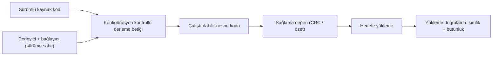

# 8. Yazılım Gerçekleştirme: Kodlama ve Entegrasyon

Bu bölümde tasarımın kaynak koda nasıl dönüştüğü ve bileşenlerin nasıl bir araya
getirildiği anlatılır. Kodlama standartları, hata kontrolü ve tutarlı entegrasyon
uygulamaları burada önem kazanır.

Amaç yalnızca derlenen bir yazılım üretmek değildir; aynı zamanda okunabilir,
test edilebilir ve sürüm değişikliklerine dayanıklı bir gerçekleştirimi sağlamaktır.

## Kodlama neden denetlenir?

Kod, tasarımın somut biçimidir. Eğer kodlama süreci disiplinsiz olursa, doğru tasarım
bile beklenmeyen davranışlar üretebilir. Bu nedenle kodlama kuralları yalnızca stil
kuralları değil, davranış güvenliği kurallarıdır.

İyi bir kodlama ortamında şu konular baştan tanımlanır:

- adlandırma kuralları,
- hata dönüşleri,
- veri tipi kullanımı,
- sabit ve değişken ayrımı,
- döngü ve koşul yazımı,
- yorum ve açıklama standardı.

## Kodun niteliği

Emniyet-kritik kod:

- anlaşılır olmalı,
- incelemesi kolay olmalı,
- yan etkiyi sınırlandırmalı,
- sınır durumlarda açık davranmalı,
- gereksiz karmaşıklık taşımamalıdır.

Bir kod parçası çalışıyor olabilir; ancak okunamıyor, test edilemiyor veya bakım
yapılamıyorsa sertifikasyon açısından zayıftır.

## Emniyet-kritik yazılımda diller ve derleyici seçimi

Programlama dili seçimi, projenin en kalıcı kararlarından biridir. Dil bir kez
seçildiğinde kodlama standardı, statik analiz araçları, derleyici, test ortamı ve
ekip eğitimi hep bu seçimin etrafında şekillenir. Aviyonik dünyasında bu seçim
çoğunlukla üç dil arasında yapılır: Assembly, Ada ve C.

**Assembly (çevirici dili)**, işlemciye en yakın dildir. Donanım kayıtlarına doğrudan
erişim, kesin zamanlama ve başlatma (boot) kodu gibi yerlerde hâlâ vazgeçilmezdir.
Ancak taşınabilirliği yoktur, okunması ve gözden geçirilmesi zordur; bu yüzden modern
projelerde yalnızca donanıma dokunan dar bir katmanla sınırlandırılır.

**Ada**, emniyet-kritik sistemler düşünülerek tasarlanmış bir dildir. Güçlü tip
denetimi, aralık kontrolü ve görev (tasking) modeli sayesinde birçok hata sınıfını
daha derleme aşamasında yakalar. SPARK gibi biçimsel yöntemler (formal methods)
destekli alt kümeleri, bazı özelliklerin matematiksel olarak kanıtlanmasına da imkân
verir. Buna karşılık ekip bulmak ve araç ekosistemini yaşatmak giderek zorlaşmaktadır.

**C**, bugün aviyonikte en yaygın dildir. Derleyici ve araç desteği geniştir, gömülü
donanımların hemen hepsinde olgun bir araç zinciri vardır. Ancak dilin kendisi
emniyetli değildir: tanımsız davranışlar, serbest işaretçi aritmetiği ve zayıf tip
denetimi ciddi tuzaklar barındırır. Bu yüzden C, hemen her projede **MISRA C** gibi
bir alt küme (subset) ile birlikte kullanılır; alt küme, dilin tehlikeli
özelliklerini yasaklayarak kalan kısmı öngörülebilir kılar.

| Ölçüt | Assembly | Ada / SPARK | C (+MISRA) |
|---|---|---|---|
| Donanım denetimi | Çok yüksek | Orta | Yüksek |
| Tip güvenliği | Yok | Çok güçlü | Zayıf (alt kümeyle iyileşir) |
| Araç ve derleyici ekosistemi | Dar | Daralıyor | Çok geniş |
| Ekip bulma kolaylığı | Zor | Zor | Kolay |
| Statik analiz olgunluğu | Sınırlı | İyi | Çok iyi |

Dil kadar **derleyici seçimi** de önemlidir; çünkü sertifikasyonun asıl konusu kaynak
kod değil, uçakta koşan çalıştırılabilir nesne kodudur (executable object code).
Derleyici değerlendirilirken şu ölçütlere bakılır:

- **Belirlenimcilik (determinism):** aynı kaynak ve aynı seçeneklerle her derlemede aynı çıktının
  üretilmesi; agresif eniyileme (optimization) seviyelerinden kaçınılması.
- **Hedef işlemci desteği:** kullanılan işlemci ve çalışma ortamı için kanıtlanmış,
  hatası bilinen ve belgelenmiş bir sürümün bulunması.
- **Hata geçmişi:** derleyici üreticisinin bilinen hata listesi yayımlaması ve
  projenin bu listeyi izleyip etkilenen yapıları yasaklayabilmesi.
- **Ekip deneyimi:** dil ve derleyiciyle daha önce sertifikasyon geçirmiş
  mühendislerin varlığı; deneyimsiz ekip, en iyi araçla bile riskli sonuç üretir.
- **Doğrulama stratejisiyle uyum:** nesne kodu ile kaynak kod arasındaki ilişkinin
  izlenebilir olması; özellikle A seviyesinde derleyicinin kaynakta görünmeyen kod
  eklemediğinin gösterilebilmesi.

Pratik bir not: derleyici sürümü ve derleme seçenekleri, projenin ömrü boyunca
**dondurulur** ve konfigürasyon yönetimi altında tutulur. Proje ortasında "yeni
derleyici sürümüne geçelim" kararı masum görünse de, üretilen nesne kodunu
değiştirdiği için yapılmış doğrulamanın önemli bir kısmını geçersiz kılabilir.

## Kodlamaya ilişkin özel konular

### Kodlama standardının uygulanması

Kodlama standardı, planlama aşamasında yazılır ama değerini kodlama aşamasında
gösterir. Standardın raflarda kalmaması için iki şey gerekir: kuralların **otomatik
denetlenebilir** olması ve istisnaların **kayıt altına alınması**. Bir kural statik
analiz aracıyla denetlenemiyorsa gözden geçirme kontrol listesine (checklist) girer;
haklı bir gerekçeyle ihlal edilmesi gerekiyorsa sapma (deviation) kaydı açılır ve
gerekçesiyle birlikte onaylanır. Sessizce ihlal edilen kural, standardın tamamına
olan güveni zedeler.

Tipik bir standardın davranışa dokunan kuralları şöyle örneklenebilir:

```c
/* Kural: her fonksiyon tek çıkış noktasına sahip olmalı,
   dönüş değeri her koşulda tanımlı olmalıdır. */
int32_t hiz_sinirla(int32_t hiz, int32_t alt, int32_t ust)
{
    int32_t sonuc = hiz;

    if (hiz < alt)
    {
        sonuc = alt;
    }
    else if (hiz > ust)
    {
        sonuc = ust;
    }
    else
    {
        /* MISRA: her if-else-if zinciri else ile kapanır. */
        sonuc = hiz;
    }

    return sonuc;
}
```

Bu örnekteki kurallar (tek çıkış, kapatılmış `else`, sabit genişlikli tipler) stil
tercihi değildir; gözden geçirmeyi kolaylaştırır ve yapısal kapsam analizinde
(structural coverage analysis) belirsizlikleri azaltır.

### Derleyici kütüphaneleri

Kod yalnızca sizin yazdığınız satırlardan oluşmaz. Derleyici, bölme, kayan nokta
işlemleri veya `memcpy` benzeri işlevler için kendi **çalışma zamanı
kütüphanelerinden** (runtime library) kod ekler. Bu kod da uçakta koşar; dolayısıyla
o da doğrulama kapsamındadır. Pratikte üç yaklaşım görülür:

- kullanılan kütüphane işlevlerini belirleyip her birini gereksinimlendirerek test
  etmek,
- sertifikasyona hazır (önceden doğrulanmış) bir kütüphane paketi tedarik etmek,
- kütüphane kullanımını tamamen yasaklayıp gereken işlevleri projede yazmak.

Hangi yol seçilirse seçilsin, bağlanan (link edilen) her nesnenin kaynağı ve
doğrulama durumu hesap verilebilir olmalıdır; "derleyici ekledi, bizden sorulmaz"
diyebileceğiniz bir kod parçası yoktur.

### Otomatik kod üreticileri

Model tabanlı geliştirme (model-based development) ortamlarında kaynak kodun bir
kısmı otomatik kod üreticisi (autocode generator) tarafından üretilir. Bu, kodlama
hatalarını azaltabilir ama doğrulama yükünü ortadan kaldırmaz; yalnızca yerini
değiştirir. İki temel strateji vardır:

- **Üretilen kodu elle yazılmış kod gibi ele almak:** üretilen kod gözden geçirilir,
  statik analize sokulur ve gereksinimlere karşı test edilir. Araç için ek bir kanıt
  gerekmez, ama üretilen kodun okunabilirliği inceleme yükünü artırabilir.
- **Aracı kalifiye etmek:** araç kalifikasyonu (tool qualification) ile kod üreticisinin çıktısına
  güvenildiği gösterilir ve bazı doğrulama adımları azaltılır. Bu, aracın kendisinin
  ciddi bir kanıt paketiyle desteklenmesini gerektirir.

Karma projelerde (üretilen kod + elle yazılmış kod) en sık yapılan hata, ikisinin
arayüzünü belirsiz bırakmaktır. Üretilen kodun hangi dosyalara elle dokunulmasının
yasak olduğu, üretim adımının derleme sürecinin neresinde koştuğu ve model
sürümü ile kod sürümü arasındaki izlenebilirlik baştan tanımlanmalıdır.

## Kaynak kodun doğrulanması

Kaynak kodun doğrulanması test ile başlamaz; testten önce kodun **incelenmesi** ve
**analiz edilmesi** gelir. Test, kodun ne yaptığını gösterir; inceleme ve analiz ise
kodun neden öyle yazıldığını sorgular. İkisi birbirinin yerine geçmez.

Kod gözden geçirmesinde (code review) yanıtlanması beklenen temel sorular şunlardır:

- Kod, izlendiği **düşük seviyeli gereksinimleri** (low-level requirements) doğru ve
  eksiksiz gerçekleştiriyor mu? Gereksinimde olmayan bir davranış eklenmiş mi?
- Kod, **yazılım mimarisine** uyuyor mu; tanımlı arayüzlerin dışına çıkan bir erişim
  var mı?
- **Kodlama standardına** uyuluyor mu; sapmalar kayıtlı ve gerekçeli mi?
- Kod **izlenebilir** mi; her fonksiyon en az bir gereksinime bağlanabiliyor mu?
  Bağlanamayan kod, ölü kod (dead code) veya gereksiz kod (extraneous code)
  şüphesidir ve açıklanmak zorundadır.
- Kod **doğru ve tutarlı** mı: taşma, sıfıra bölme, başlatılmamış değişken, yığın
  (stack) kullanımı, en kötü durum çalışma süresi gibi konular ele alınmış mı?

Gözden geçirmenin işe yaraması için birkaç pratik koşul vardır: incelemeyi kodu
yazan kişi dışında biri yapmalı, inceleme bir **kontrol listesine** dayanmalı,
bulgular kayıt altına alınıp kapanışları izlenmelidir. "Omuz üstünden bakıp onayladım"
tarzı incelemeler kanıt üretmez; denetimde de savunulamaz.

**Statik analiz**, insan gözünün sistematik olarak kaçırdığı hata sınıflarını yakalar
ve gözden geçirmeyi tamamlar:

| Analiz türü | Yakaladığı tipik sorunlar |
|---|---|
| Kodlama standardı denetimi | MISRA ihlalleri, yasaklı yapılar |
| Veri akışı analizi | Başlatılmamış değişken, kullanılmayan atama |
| Kontrol akışı analizi | Erişilemeyen kod, sonsuz döngü riski |
| Değer aralığı analizi | Taşma, dizi sınırı aşımı, sıfıra bölme |
| Kaynak analizi | Yığın kullanımı, özyineleme, bellek sınırları |

Statik analiz aracının çıktısı da tek başına kanıt değildir: her bulgu bir mühendis
tarafından değerlendirilir; gerçek hata ise düzeltilir, yanlış alarm (false positive)
ise gerekçesiyle kapatılır. Doğrulama faaliyetinin yerine geçen bir araç
kullanılıyorsa (örneğin gözden geçirme kuralının denetimini tamamen araca bırakmak),
aracın kalifikasyonu gündeme gelir.

Kaynak kod doğrulaması, sonuç olarak üç şeyi görünür kılmalıdır: kodun gereksinimlere
uygunluğu, standarda uygunluğu ve doğruluk/tutarlılık analizlerinin yapıldığı. Bu üç
kanıt tamamlanmadan koda "doğrulandı" damgası vurulmaz; test bu kanıtların üzerine
inşa edilir.

## Entegrasyon

Entegrasyon, ayrı ayrı doğrulanmış parçaların birlikte doğru davrandığını gösterir.
Buradaki kritik soru, modüllerin kendi başlarına çalışıp çalışmadığı değil, birlikte
çalıştıklarında beklenen davranışı sürdürüp sürdürmediğidir.

Entegrasyon sırasında şunlar önemlidir:

- arayüz uyumu,
- veri sırası ve zamanlama,
- başlatma sırası,
- hata propagasyonu,
- sürüm uyumu.

## Derleme ve yükleme süreci

Sertifikasyonun nesnesi kaynak kod değil, uçağa yüklenen çalıştırılabilir nesne
kodudur. Bu yüzden kaynak kodu nesne koduna çeviren derleme (build) süreci de
mühendislik ürünüdür ve doğrulamanın parçasıdır. Temel beklenti tek cümledir:
**aynı kaynaktan, aynı araçlarla, her zaman aynı ikili (binary) üretilebilmelidir.**

Bunu sağlamak için derleme sürecine giren her şey konfigürasyon yönetimi altında
tutulur:

- kaynak dosyaların sürümleri,
- derleme betikleri (makefile vb.) ve bağlayıcı (linker) betikleri,
- derleyici, bağlayıcı ve yardımcı araçların tam sürümleri,
- derleme seçenekleri ve tanımlı makrolar,
- derleme ortamının kendisi (işletim sistemi, kurulum paketleri).

Derleme seçenekleri özellikle kritiktir: bir eniyileme bayrağının değişmesi, test
edilmiş nesne kodundan farklı bir nesne kodu üretir. Bu nedenle seçenekler planlarda
belgelenir, betiğe gömülür ve elle geçersiz kılınamaz hâle getirilir. Mühendisin
kendi makinesinde "elle derleyip" ürettiği ikili, ne kadar doğru görünürse görünsün,
resmî bir yapılandırma değildir.



Resmî derlemeler tipik olarak temiz bir ortamda, sıfırdan (full build) alınır ve bir
**derleme kaydı** üretilir: hangi sürümlerden, hangi araçlarla, hangi seçeneklerle
üretildiği bu kayıtta yer alır. Tekrarlanabilirlik, sertifikasyondan yıllar sonra bir
hata düzeltmesi gerektiğinde aynı ortamı yeniden kurabilmek için de gereklidir; bu
yüzden derleme ortamının arşivlenmesi (hatta sanal makine olarak saklanması) yaygın
bir uygulamadır.

**Yükleme** süreci de aynı disiplinle ele alınır. Nesne kodunun hedef donanıma
aktarılması sırasında iki soru yanıtlanmalıdır:

- **Doğru yazılım mı yüklendi?** Parça numarası ve sürüm kimliği, yüklenen imaj ile
  belgelenen yapılandırma arasında birebir eşleşmelidir.
- **Eksiksiz ve bozulmadan mı yüklendi?** Sağlama toplamı (checksum) veya CRC gibi
  bütünlük kontrolleri, aktarım sırasında bozulma olmadığını göstermelidir.

Sahada yüklenebilir yazılım (field-loadable software) söz konusuysa, yükleme aracı ve
yükleme prosedürü de doğrulanır; yarım kalan yüklemede sistemin güvenli bir durumda
kalması (örneğin önceki geçerli imaja dönmesi veya kendini geçersiz sayması) ayrıca
gösterilir. Yüklemeyi yapan araç, hataları maskeleyebilecek konumdaysa araç
kalifikasyonu burada da karşımıza çıkar.

## Uygulama örneği

Bir ekibin kodlama standardı; isimlendirme, hata kontrolü ve sınır değer testleri için
ortak kurallar koyar. Böylece:

- kod incelemeleri kolaylaşır,
- entegrasyon sürprizleri azalır,
- hata kökeni daha hızlı bulunur.

## Gerçekleştirmede tipik riskler

- tasarımdan sapma,
- arayüzü yanlış yorumlama,
- hata durumunu eksik ele alma,
- entegrasyon sırasını belgelemeden ilerleme,
- gereksiz karmaşık kod üretme.

Bu riskler, sonradan yapılan testlerin maliyetini artırır.

## Bu bölümden akılda kalması gerekenler

- Kodlama, tasarımın kontrollü ifadesidir.
- Dil ve derleyici seçimi kalıcıdır; belirlenimcilik, araç desteği ve ekip deneyimi
  birlikte değerlendirilir, C gibi diller güvenli bir alt kümeyle kullanılır.
- Derleyici kütüphaneleri ve otomatik üretilen kod da uçakta koşar; ikisi de
  doğrulama kapsamının dışında bırakılamaz.
- Kaynak kod doğrulaması testten önce gelir: gözden geçirme ve statik analiz,
  gereksinim uygunluğunu, standart uygunluğunu ve doğruluk/tutarlılığı gösterir.
- Entegrasyon, parçaların birlikte çalıştığını gösterir.
- Derleme süreci tekrarlanabilir ve konfigürasyon kontrollü olmalıdır; yükleme,
  kimlik ve bütünlük kontrolleriyle doğrulanır.
- Kod standartları, doğrulama kalitesini doğrudan etkiler.
