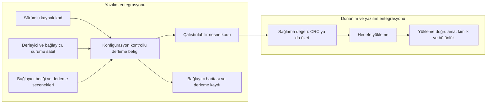

# 8. Yazılım Gerçekleştirme: Kodlama ve Entegrasyon

Bu bölüm, tasarımın kaynak koda dönüştürüldüğü kodlama sürecini ve kaynak koddan
uçağa yüklenen çalıştırılabilir nesne kodunun üretildiği entegrasyon sürecini anlatır.
Dil ve derleyici seçimi, kodlama standardının uygulanması, kaynak kodun doğrulanması,
derleme, bağlama ve hedefe yükleme bu sırayla ele alınır.

Amaç yalnızca derlenen bir yazılım üretmek değildir; okunabilir, test edilebilir,
gereksinimlerine izlenebilir ve yıllar sonra aynı biçimde yeniden üretilebilir bir
gerçekleştirme ortaya koymaktır.

## Kodlama sürecinin girdileri, çıktıları ve kodlama standardı

Kodlama ve entegrasyon, DO-178C'deki geliştirme süreçlerinin son ikisidir. İkisi de
kendi başına karar veren süreçler değildir: ne üretileceğini önceki süreçlerin
çıktıları, nasıl üretileceğini planlar ve standartlar belirler.

| Süreç | Girdiler | Çıktılar |
|---|---|---|
| Kodlama | Düşük seviyeli gereksinimler (low-level requirements), yazılım mimarisi (software architecture), kodlama standardı, yazılım geliştirme planı (Software Development Plan, SDP) | Kaynak kod (source code); kaynak kod ile düşük seviyeli gereksinimler arasındaki iz verisi (trace data) |
| Entegrasyon | Kaynak kod, yazılım mimarisi | Nesne kodu (object code) ve çalıştırılabilir nesne kodu (executable object code); varsa parametre verisi öğesi (parameter data item, PDI) dosyaları; derleme, bağlama ve yükleme verisi (tipik olarak derleme ve bağlama betikleri ile seçenekleri, bağlayıcı haritası (linker map), derleme kaydı ve yükleme talimatı) |

Düşük seviyeli gereksinimlerin ve mimarinin nasıl ortaya çıktığı
[7. Yazılım Tasarımı](./07-yazilim-tasarimi.md) bölümünde anlatıldı. Tablodan iki kural
çıkar. Birincisi, kod yalnızca girdilerinde yazanı gerçekleştirir: kodlayan kişi
gereksinimde olmayan bir davranışa ihtiyaç duyuyorsa onu sessizce koda gömmez; eksik,
tasarım sürecine bildirilir ve gerekiyorsa türetilmiş gereksinim (derived requirement)
olarak kaydedilir. İkincisi, kodlama ya da entegrasyon sırasında girdilerde fark edilen
her belirsizlik ve hata, kaynaklandığı sürece geri beslenir. Kodda "etrafından
dolaşılan" bir gereksinim hatası gereksinimde durmaya devam eder ve o gereksinimi
okuyan bir sonraki kişiyi — testi yazanı da — yanıltır.

Kod, tasarımın somut biçimidir. Kodlama süreci disiplinsiz yürürse doğru tasarım bile
beklenmeyen davranış üretebilir; bu yüzden kodlama standardı (coding standard) bir
stil kılavuzundan çok, davranışı öngörülebilir kılan kurallar bütünüdür. Standart
planlama aşamasında yazılır; içeriğinin ayrıntısı
[5. Yazılım Planlama](./05-yazilim-planlama.md) bölümündedir. Tipik konu başlıkları ve
her birinin kurala bağlanma nedeni şöyle özetlenebilir:

| Konu | Neden kurala bağlanır? |
|---|---|
| Dil alt kümesi ve yasaklı yapılar | Tanımsız davranışı (undefined behavior) ve derleyiciye bağlı davranışı kodun dışında tutmak |
| Veri tipleri ve dönüşümler | Sabit genişlikli tiplerle taşınabilirliği sağlamak; örtük dönüşümlerden doğan işaret ve taşma hatalarını önlemek |
| Hata dönüşleri | Her dönüş değerinin denetlenmesini, hatanın sessizce yutulmamasını sağlamak |
| Sabitler ve değişkenler | Anlamı belirsiz sayılar yerine adlandırılmış sabit kullanmak; global veriyi sınırlayarak bileşenler arası veri bağlaşımını (data coupling) görünür tutmak |
| Döngü, koşul ve karmaşıklık sınırları | Kontrol akışını gözden geçirilebilir ve test edilebilir tutmak |
| Adlandırma, dosya düzeni ve yorum | Gözden geçirmeyi hızlandırmak; izlenebilirlik etiketinin nereye ve nasıl yazılacağını belirlemek |

Bu kuralların hedeflediği nitelikler bellidir: emniyet-kritik kod anlaşılır olmalı,
kolay gözden geçirilebilmeli, yan etkilerini sınırlı tutmalı, sınır durumlarında açık
davranmalı ve gereksiz karmaşıklık taşımamalıdır. Bir kod parçası çalışıyor olabilir;
ancak okunamıyor, test edilemiyor ya da bakımı yapılamıyorsa sertifikasyon açısından
zayıftır, çünkü doğruluğu kimseye gösterilemez.

## Emniyet-kritik yazılımda diller ve derleyici seçimi

Programlama dili seçimi, projenin en kalıcı kararlarından biridir. Dil bir kez
seçildiğinde kodlama standardı, statik analiz araçları, derleyici, test ortamı ve
ekip eğitimi hep bu seçimin etrafında şekillenir. Aviyonikte bu seçim çoğunlukla dört
dil arasında yapılır: çevirici dili, Ada, C ve C++.

**Çevirici dili (assembly language)**, işlemciye en yakın dildir. Donanım yazmaçlarına
(register) doğrudan erişim, kesin zamanlama ve başlatma (boot) kodu gibi yerlerde hâlâ
vazgeçilmezdir. Ancak taşınabilirliği yoktur, okunması ve gözden geçirilmesi zordur;
bu yüzden modern projelerde yalnızca donanıma dokunan dar bir katmanla sınırlandırılır.

**Ada**, emniyet-kritik sistemler düşünülerek tasarlanmış bir dildir. Güçlü tip
denetimi, aralık kontrolü ve görev (tasking) modeli sayesinde birçok hata sınıfını
daha derleme aşamasında yakalar. SPARK gibi biçimsel yöntemler (formal methods)
destekli alt kümeleri, bazı özelliklerin matematiksel olarak kanıtlanmasına da imkân
verir; bu kanıtların doğrulamada nasıl kullanılabileceği
[16. DO-333 ve Biçimsel Yöntemler](../04-arac-kalifikasyonu-ve-ekler/16-do333-bicimsel-yontemler.md)
bölümünün konusudur. Dil ve araçları geliştirilmeye devam etmektedir; buna karşılık
ekosistem C'ye göre dardır, az sayıda tedarikçiye bağlıdır ve deneyimli ekip bulmak
daha zordur.

**C**, bugün aviyonikte en yaygın dildir. Derleyici ve araç desteği geniştir, gömülü
donanımların hemen hepsinde olgun bir araç zinciri vardır. Ancak dilin kendisi
emniyetli değildir: tanımsız davranışlar, serbest işaretçi aritmetiği ve zayıf tip
denetimi ciddi tuzaklar barındırır. Bu yüzden C, hemen her projede **MISRA C** gibi
bir alt küme (subset) ile birlikte kullanılır; alt küme, dilin tehlikeli
özelliklerini yasaklayarak kalan kısmı öngörülebilir kılar. Kodlama standardında
temel alınan kural kümesinin sürümü ve kullanılan C dil standardı açıkça yazılır; bu
satırların yazıldığı tarihte güncel sürüm MISRA C:2025'tir, yürüyen projelerde MISRA
C:2012 ve sonraki düzeltmeleri de yaygındır.

**C++**, özellikle büyük uygulama katmanlarında kullanımı artan bir dildir. Soyutlama
gücü büyük kod tabanlarını yönetmeyi kolaylaştırır; ancak
kalıtım, dinamik bağlama (dynamic dispatch), şablonlar, istisnalar ve dinamik bellek
yönetimi kaynak kod ile nesne kodu arasındaki mesafeyi açar ve doğrulamaya yeni
sorular getirir. Bu yüzden C++ da MISRA C++ gibi kısıtlayıcı bir kural kümesiyle
kullanılır; nesne yönelimli özellikler devredeyse DO-332'nin ek hedefleri (objective) ve analizleri
gündeme gelir (bkz.
[15. DO-332 ve Nesne Yönelimli Teknoloji ve İlgili Teknikler](../04-arac-kalifikasyonu-ve-ekler/15-do332-nesne-yonelimli-teknoloji.md)).

| Ölçüt | Çevirici dili | Ada / SPARK | C (+MISRA C) | C++ (kısıtlı alt küme) |
|---|---|---|---|---|
| Donanım denetimi | Çok yüksek | Orta | Yüksek | Yüksek |
| Tip güvenliği | Yok | Çok güçlü | Zayıf (alt kümeyle iyileşir) | Orta (alt kümeyle iyileşir) |
| Araç ve derleyici ekosistemi | Dar | Dar ama sürdürülüyor | Çok geniş | Geniş |
| Ekip bulma kolaylığı | Zor | Zor | Kolay | Orta |
| Statik analiz olgunluğu | Sınırlı | İyi | Çok iyi | İyi |
| Doğrulamada dikkat isteyen yan | Gözden geçirme maliyeti, taşınamazlık | Çalışma zamanı denetimleri ve kütüphanesi | Tanımsız davranışlar | Nesne yönelimli özelliklerin ek analizleri |

Rust gibi bellek güvenliğini derleme zamanında denetleyen yeni diller de gündemdedir.
Emniyet standartlarına göre kalifiye edilmiş Rust derleyicileri önce otomotiv ve
endüstriyel alanlarda ortaya çıkmıştır; havacılıkta araç zinciri, yerleşik kodlama kuralları ve
sertifikasyon deneyimi bu satırların yazıldığı tarihte henüz sınırlıdır. Böyle bir
dili seçen proje, bunu planlama aşamasında otoriteyle konuşulacak bir risk olarak ele
almalıdır.

Dil kadar **derleyici seçimi** de önemlidir; çünkü yazılım açısından uyumun
gösterildiği nihai ürün kaynak kod değil, uçakta çalışan çalıştırılabilir nesne
kodudur. Derleyici değerlendirilirken şu ölçütlere bakılır:

- **Belirlenimcilik (determinism):** aynı kaynak ve aynı seçeneklerle her derlemede
  aynı çıktının üretilmesi; agresif eniyileme (optimization) seviyelerinden kaçınılması.
- **Hedef işlemci desteği:** kullanılan işlemci ve çalışma ortamı için kanıtlanmış,
  hatası bilinen ve belgelenmiş bir sürümün bulunması.
- **Hata geçmişi:** derleyici üreticisinin bilinen hata listesi yayımlaması ve
  projenin bu listeyi izleyip etkilenen yapıları yasaklayabilmesi.
- **Ekip deneyimi:** dil ve derleyiciyle daha önce sertifikasyon geçirmiş
  mühendislerin varlığı; deneyimsiz ekip, en iyi araçla bile riskli sonuç üretir.
- **Doğrulama stratejisiyle uyum:** nesne kodu ile kaynak kod arasındaki ilişkinin
  izlenebilir olması. Derleyiciler sıklıkla kaynak satırlarına doğrudan izlenemeyen kod
  üretir (sınır denetimleri, örtük başlatma, yardımcı işlev çağrıları). Seviye A'da
  bu kodun belirlenmesi ve doğruluğunun ek doğrulamayla gösterilmesi beklenir; yani
  aranan, böyle bir kodun yokluğunu kanıtlamak değil, var olanı bulup doğrulamaktır.
  Kodun hangi yöntemle saptanacağı planlama aşamasında belirlenir ve ilgili plana
  yazılır. Bu işi kolaylaştıran ya da zorlaştıran, seçilen derleyici ve seçenekleridir
  (bkz.
  [9. Yazılım Doğrulama](./09-yazilim-dogrulama.md) ve [SW SOI-3](../kaynaklar/soi-3.md)).

Derleyici çoğu projede kalifiye edilmez: ürettiği nesne kodu gereksinim tabanlı
testlerle hedef ortamda zaten doğrulandığı için araç kalifikasyonu (tool
qualification) koşulu oluşmaz (bkz.
[13. DO-330 ve Yazılım Aracı Kalifikasyonu](../04-arac-kalifikasyonu-ve-ekler/13-do330-arac-kalifikasyonu.md)).
DO-178C de derleyiciyi, yazılım ürününün doğrulaması başarıyla tamamlandığında kabul
edilebilir sayar; ama yalnızca o ürün için. Derleyicinin, bağlayıcının ve yükleyicinin
doğruluğuna ilişkin varsayımlar da yazılım doğrulama planında (Software Verification
Plan, SVP) yazılır. Bu yaklaşımın bedeli şudur: doğrulama, o derleyicinin o seçeneklerle
ürettiği koda bağlıdır. Bu nedenle derleyici sürümü ve derleme seçenekleri projenin ömrü
boyunca **dondurulur** ve konfigürasyon yönetimi (configuration management) altında
tutulur. Proje ortasında "yeni derleyici sürümüne geçelim" kararı masum görünse de,
üretilen nesne kodunu değiştirdiği için yapılmış doğrulamanın önemli bir kısmını
geçersiz kılabilir.

## Kodlamaya ilişkin özel konular

### Kodlama standardının uygulanması

Kodlama standardı, planlama aşamasında yazılır ama değerini kodlama aşamasında
gösterir. Standardın raflarda kalmaması için iki şey gerekir: kuralların **otomatik
denetlenebilir** olması ve istisnaların **kayıt altına alınması**. Bir kural statik
analiz aracıyla denetlenemiyorsa gözden geçirme kontrol listesine (checklist) girer;
haklı bir gerekçeyle ihlal edilmesi gerekiyorsa sapma (deviation) kaydı açılır ve
gerekçesiyle birlikte onaylanır. Sessizce ihlal edilen kural, standardın tamamına
olan güveni zedeler.

Tipik bir standardın davranışa dokunan kuralları şöyle örneklenebilir:

```c
#include <stdint.h>

/* Kurallar: tek çıkış noktası; if ... else if zinciri else ile kapanır;
   sabit genişlikli tipler kullanılır.
   Ön koşul: alt <= ust; çağıran taraf sağlar (LLR-31-4). */
int32_t hiz_sinirla(int32_t hiz, int32_t alt, int32_t ust)
{
    int32_t sonuc;

    if (hiz < alt)
    {
        sonuc = alt;
    }
    else if (hiz > ust)
    {
        sonuc = ust;
    }
    else
    {
        sonuc = hiz;
    }

    return sonuc;
}
```

Örnekteki kurallar MISRA C:2012 numaralandırmasıyla Kural 15.5 (tek çıkış noktası),
Kural 15.7 (`if … else if` zincirinin `else` ile kapanması) ve Yönerge 4.6'ya (boyutu
ve işareti belli tipler) karşılık gelir. Bunlar stil tercihi değildir; gözden
geçirmeyi kolaylaştırır ve yapısal kapsam analizinde (structural coverage analysis)
belirsizlikleri azaltır. MISRA kuralları bağlayıcılığına göre sınıflandırılır: sapma
kabul etmeyenler (mandatory), ancak kayıtlı ve gerekçeli sapmayla ihlal edilebilenler
(required) ve tavsiye niteliğindekiler (advisory). Tek çıkış kuralı son gruptandır;
tavsiye kurallarından hangilerinin projede bağlayıcı olduğunu kodlama standardı söyler.

İki ayrıntı daha gözden geçirenin işini kolaylaştırır. `sonuc` her dalda atandığı
için tanımda ayrıca başlatılmamıştır; fazladan bir ilk atama, statik analizin
"kullanılmayan atama" diye işaretleyeceği bir bulgu olurdu. `alt <= ust` ön koşulu
ise kodlama kuralının değil tasarımın konusudur: ya çağıran tarafın bunu sağladığı
gereksinimde yazılır ya da işlev kendisi denetler. Yorumdaki tek satır, hangi seçimin
yapıldığını ve dayanağını gösterir.

### Derleyici kütüphaneleri

Kod yalnızca sizin yazdığınız satırlardan oluşmaz. Derleyici, bölme, kayan nokta
işlemleri veya `memcpy` benzeri işlevler için kendi **çalışma zamanı
kütüphanelerinden** (runtime library) kod ekler. Bu kod da uçakta çalışır; dolayısıyla
yazılımın geri kalanıyla aynı seviyenin hedeflerine tabidir. Pratikte üç yaklaşım
görülür:

- kullanılan kütüphane işlevlerini belirleyip her birini gereksinimlendirerek test
  etmek,
- sertifikasyona hazır (önceden doğrulanmış) bir kütüphane paketi tedarik etmek,
- kütüphane kullanımını tamamen yasaklayıp gereken işlevleri projede yazmak.

Hangi yol seçilirse seçilsin, bağlanan her nesnenin kaynağı ve doğrulama durumu hesap
verilebilir olmalıdır; "derleyici ekledi, bizden sorulmaz" diyebileceğiniz bir kod
parçası yoktur. Bağlandığı hâlde hiç çağrılmayan kütüphane işlevleri de bu hesabın
içindedir. DO-178C kullanılmayan kütüphane işlevlerini devre dışı bırakılmış kod
(deactivated code) örnekleri arasında sayar; ancak bu statü kendiliğinden doğmaz:
sınıfı belirleyen, işlevlerin bir gereksinime izlenmesi ve tasarım gereği
çalıştırılmamasıdır. Bu sınıfa giren kod ayrıca planlarda beyan edilir ve istem dışı
çalışmasının önlendiği gösterilir. Hiçbir gereksinime izlenemeyen işlev ise gereksiz
koddur (extraneous code) ve beklenen çözüm kaldırılmasıdır (bkz.
[17. Kapsanmayan Kodlar: Ölü, Gereksiz ve Devre Dışı Bırakılmış Kodlar](../05-ozel-konular/17-kapsanmayan-kodlar.md)).

### Otomatik kod üreteçleri

Model tabanlı geliştirme (model-based development) ortamlarında kaynak kodun bir
kısmı otomatik kod üreteci (automatic code generator) tarafından üretilir. Bu, kodlama
hatalarını azaltabilir ama doğrulama yükünü ortadan kaldırmaz; yalnızca yerini
değiştirir. İki temel strateji vardır:

- **Üretilen kodu elle yazılmış kod gibi ele almak:** üretilen kod gözden geçirilir,
  statik analize sokulur ve gereksinimlere karşı test edilir. Araç için ek bir kanıt
  gerekmez, ama üretilen kodun okunabilirliği gözden geçirme yükünü artırabilir.
- **Aracı kalifiye etmek:** araç kalifikasyonu ile kod üretecinin çıktısına
  güvenilebileceği gösterilir ve bazı doğrulama adımları azaltılır. Bu, aracın
  kendisinin ciddi bir kanıt paketiyle desteklenmesini gerektirir: çıktısı uçuş
  yazılımının parçası olduğu için kod üreteci Ölçüt 1'e girer; araç kalifikasyon
  seviyesi (tool qualification level, TQL) yazılım seviyesine göre Seviye A'daki
  TQL-1 ile Seviye D'deki TQL-4 arasında belirlenir. Her yazılım seviyesinde en sıkı
  kalifikasyonu bu ölçüt getirir.

Hangi strateji seçilirse seçilsin, kod üretecinin kullanımı planlarda tanımlanan
seçeneklere ve kısıtlara uymak zorundadır.

Modelin gereksinim mi tasarım mı sayıldığı ve simülasyondan ne kadar kredi alınabileceği
[14. DO-331 ve Model Tabanlı Geliştirme ve Doğrulama](../04-arac-kalifikasyonu-ve-ekler/14-do331-model-tabanli-gelistirme.md)
bölümünde, kalifikasyonun kendisi 13. bölümde anlatılıyor.

Karma projelerde (üretilen kod ve elle yazılmış kod birlikte) en sık yapılan hata,
ikisinin arayüzünü belirsiz bırakmaktır. Hangi dosyalara elle dokunulmasının yasak
olduğu, üretim adımının derleme sürecinin neresinde çalıştığı ve model sürümü ile kod
sürümü arasındaki izlenebilirlik (traceability) baştan tanımlanmalıdır.

## Kaynak kodun doğrulanması

Kaynak kodun doğrulanması testle başlamaz; testten önce kodun **gözden geçirilmesi**
ve **analiz edilmesi** gelir. Test, kodun ne yaptığını gösterir; gözden geçirme ve
analiz ise kodun neden öyle yazıldığını sorgular. İkisi birbirinin yerine geçmez.
Yöntemlerin ayrıntısı [9. Yazılım Doğrulama](./09-yazilim-dogrulama.md) bölümündedir;
burada koda özgü sorular ele alınır.

Kod gözden geçirmesinde (code review) yanıtlanması beklenen temel sorular şunlardır:

- Kod, izlendiği **düşük seviyeli gereksinimleri** doğru ve eksiksiz gerçekleştiriyor
  mu? Gereksinimde olmayan bir davranış eklenmiş mi?
- Kod, **yazılım mimarisine** uyuyor mu; tanımlı arayüzlerin dışına çıkan bir erişim
  var mı?
- Kod **doğrulanabilir** mi; test edilemeyen ya da sonucu gözlemlenemeyen yapılar
  içeriyor mu, test edebilmek için kodu değiştirmek gerekiyor mu?
- **Kodlama standardına** uyuluyor mu; sapmalar kayıtlı ve gerekçeli mi?
- Kod **izlenebilir** mi; her düşük seviyeli gereksinim kodda karşılığını bulmuş mu,
  her fonksiyon en az bir gereksinime bağlanabiliyor mu? Bağlanamayan kod, ölü kodu
  (dead code) da içeren gereksiz kod şüphesidir ve açıklanmak zorundadır; ayrımları
  17. bölümde yapılıyor.
- Kod **doğru ve tutarlı** mı: taşma, sıfıra bölme, başlatılmamış değişken, yığın
  (stack) kullanımı, en kötü durum yürütme süresi (worst-case execution time, WCET)
  gibi konular ele alınmış mı?

Gözden geçirmenin işe yaraması için birkaç pratik koşul vardır: gözden geçirme bir
**kontrol listesine** dayanmalı, belirli bir kod sürümü üzerinde yapılmalı, bulgular
kayıt altına alınıp kapanışları izlenmelidir. "Omuz üstünden bakıp onayladım" tarzı
gözden geçirmeler kanıt üretmez; denetimde de savunulamaz. Gözden geçirmeyi kodu yazan
kişi dışında birinin yapması da bu koşullardandır, ancak standart açısından statüsü
seviyeye bağlıdır.

:::note[Seviyeye göre beklenti]
Kaynak koda ilişkin doğrulama hedeflerinin kapsamı yazılım seviyesine (software level)
göre değişir. Seviye A'da üç hedef — kodun düşük seviyeli gereksinimlere uyumu,
mimariye uyumu ve doğruluk ile tutarlılığı — bağımsızlıkla (independence) karşılanır;
yani bu hedeflerde gözden geçiren, kodun yazarı olamaz. Seviye B'de bağımsızlık
yalnızca düşük seviyeli gereksinimlere uyumda aranır. Seviye C'de doğrulanabilirlik
dışındaki hedefler geçerliliğini korur, ancak bağımsızlık aranmaz. Seviye D'de kaynak
kodun gözden geçirilmesine ve analizine ilişkin hedef yoktur. Standart yazar dışı
gözden geçirmeyi yalnızca belirli seviye ve hedeflerde şart koşar; yine de her seviyede
iyi uygulamadır.
:::

**Statik analiz**, insan gözünün sistematik olarak kaçırdığı hata sınıflarını yakalar
ve gözden geçirmeyi tamamlar:

| Analiz türü | Yakaladığı tipik sorunlar |
|---|---|
| Kodlama standardı denetimi | MISRA ihlalleri, yasaklı yapılar |
| Veri akışı analizi | Başlatılmamış değişken, kullanılmayan atama |
| Kontrol akışı analizi | Erişilemeyen kod, sonsuz döngü riski |
| Değer aralığı analizi | Taşma, dizi sınırı aşımı, sıfıra bölme |
| Kaynak analizi | Yığın kullanımı, özyineleme, bellek sınırları |

Statik analiz aracının çıktısı da tek başına kanıt değildir: her bulgu bir mühendis
tarafından değerlendirilir; gerçek hata ise düzeltilir, yanlış alarm (false positive)
ise gerekçesiyle kapatılır. Doğrulama faaliyetinin yerine geçen bir araç
kullanılıyorsa (örneğin bir kuralın denetimini tamamen araca bırakmak ve çıktısını
ayrıca doğrulamamak), aracın kalifikasyonu gündeme gelir.

Kaynak kod doğrulaması, sonuç olarak üç şeyi görünür kılmalıdır: kodun gereksinimlere
uyumu, standarda uygunluğu ve doğruluk/tutarlılık analizlerinin yapıldığı. Bu üç
kanıt tamamlanmadan koda "doğrulandı" damgası vurulmaz; test bu kanıtların üzerine
inşa edilir.

## Entegrasyon: derleme, bağlama ve yükleme

Gündelik dilde entegrasyon, "parçaları birleştirip denemek" anlamına gelir. DO-178C'de
ise entegrasyon süreci bir üretim sürecidir: kaynak koddan çalıştırılabilir nesne
kodunu üretir ve onu hedef bilgisayara yükler. Parçaların birlikte doğru davrandığını
göstermek, entegrasyon testlerinin, yani doğrulamanın işidir. İkisi iç içe yürür ama
kanıtları ayrıdır: biri "doğru ürün, doğru biçimde üretildi mi", diğeri "üretilen ürün
gereksinimlerini karşılıyor mu" sorusunu yanıtlar.

### Yazılım entegrasyonu ve donanım/yazılım entegrasyonu

Süreç iki adımdan oluşur. **Yazılım entegrasyonu (software integration)**, kaynak
dosyaların derlenmesini, nesne dosyalarının bağlanmasını (link) ve kod ile verinin
bellek bölgelerine yerleştirilmesini kapsar; çıktısı çalıştırılabilir nesne kodudur.
**Donanım/yazılım entegrasyonu (hardware/software integration)**, bu imajın (image)
hedef bilgisayara yüklenmesidir; yazılım ilk kez gerçek işlemci, gerçek bellek ve
gerçek giriş/çıkış ile karşılaşır.

Parametre verisi öğesi kullanan projelerde PDI dosyaları da bu süreçte üretilir. Her
dosya ayrı bir konfigürasyon öğesidir ve birlikte çalışacağı çalıştırılabilir nesne
koduyla uyumlu olmalıdır; koşulları ve doğrulaması
[22. Konfigürasyon Verisi](../05-ozel-konular/22-konfigurasyon-verisi.md) bölümünde
anlatılıyor.

### Entegrasyon stratejisi ve sırası

Bütün bileşenleri en sonda tek seferde birleştirmek, hata çıktığında nereye
bakılacağını belirsiz bırakır. Bunun yerine **artımlı entegrasyon (incremental
integration)** uygulanır: her adımda az sayıda bileşen eklenir ve eklenen parça,
altındaki çalışan temelin üzerinde denenir. Gömülü bir aviyonik birimde tipik sıra
aşağıdan yukarıdır: önce başlatma kodu ve donanıma dokunan sürücüler, sonra işletim
sistemi ve çizelgeleme, ardından haberleşme ve giriş/çıkış katmanı, en sonda uygulama
işlevleri. Sıra ve her artımın içeriği önceden yazılır; her artım, konfigürasyonu
belli bir derleme sürümüdür. Henüz hazır olmayan bileşenlerin yerini tutan yer tutucu
kod (stub) ve test sürücüleri uçuş koduyla aynı yerde tutulmaz ve nihai imaja girmediği
gösterilir.

Entegrasyonun ortaya çıkardığı uyumsuzluklar, tek tek bileşenlere bakılarak görülemeyen
türdendir:

| Konu | Entegrasyonda görülen tipik uyumsuzluk |
|---|---|
| Arayüz uyumu | Birim, ölçek, bayt sırası ya da parametre sırası farkı |
| Veri sırası ve zamanlama | Bir bileşenin, diğerinin o çerçevede henüz güncellemediği veriyi okuması |
| Başlatma sırası | Henüz başlatılmamış sürücünün ya da verinin kullanılması |
| Hata yayılımı | Alt katmanın bildirdiği hata kodunun üst katmanda yok sayılması |
| Sürüm uyumu | Farklı temel çizgilerden (baseline) alınmış bileşenlerin aynı imajda buluşması |

Bu tür bir bulgunun düzeltmesi çoğu kez kodda değil, arayüz tanımında ya da
gereksinimdedir. Entegrasyon masasında koda hızlıca eklenen bir dönüşüm sorunu o gün
çözer, ama tasarım verisi yanlış kalır; doğru yol, bulguyu kaynaklandığı sürece geri
beslemektir.

### Derleme sürecinin tekrarlanabilirliği

Uçakta çalışan nesne kodu olduğuna göre, kaynak kodu nesne koduna çeviren derleme
(build) süreci de mühendislik ürünüdür ve doğrulamanın parçasıdır. Temel beklenti
tek cümledir: **aynı kaynaktan, aynı araçlarla, her zaman aynı ikili (binary)
üretilebilmelidir.** İkili birebir aynı çıkmıyorsa — örneğin imaja gömülen bir zaman
damgası yüzünden — farkın kaynağı bilinmeli, açıklanmalı ve tercihen giderilmelidir.

Bunu sağlamak için derleme sürecine giren her şey konfigürasyon yönetimi altında
tutulur:

- kaynak dosyaların sürümleri,
- derleme betikleri (makefile vb.) ve bağlayıcı (linker) betikleri,
- derleyici, bağlayıcı ve yardımcı araçların tam sürümleri,
- derleme seçenekleri ve tanımlı makrolar,
- derleme ortamının kendisi (işletim sistemi, kurulum paketleri).

Bu bilgilerin resmî adresi iki yaşam döngüsü verisidir: ortamı yazılım yaşam döngüsü
ortam konfigürasyon indeksi (Software Life Cycle Environment Configuration Index,
SECI), üretilen sürümün bileşenlerini ve yeniden derleme talimatını yazılım
konfigürasyon indeksi (Software Configuration Index, SCI) kayıt altına alır (bkz.
[10. Yazılım Konfigürasyon Yönetimi](./10-yazilim-konfigurasyon-yonetimi.md)).

Derleme seçenekleri özellikle kritiktir: bir eniyileme bayrağının değişmesi, test
edilmiş nesne kodundan farklı bir nesne kodu üretir. Bu nedenle seçenekler planlarda
belgelenir, betiğe gömülür ve elle geçersiz kılınamaz hâle getirilir. Mühendisin
kendi makinesinde "elle derleyip" ürettiği ikili, ne kadar doğru görünürse görünsün,
resmî bir konfigürasyon değildir.


```mermaid
flowchart LR
    subgraph S1["Yazılım entegrasyonu"]
        K["Sürümlü kaynak kod"] --> D["Konfigürasyon kontrollü derleme betiği"]
        A["Derleyici ve bağlayıcı, sürümü sabit"] --> D
        B["Bağlayıcı betiği ve derleme seçenekleri"] --> D
        D --> N["Çalıştırılabilir nesne kodu"]
        D --> H["Bağlayıcı haritası ve derleme kaydı"]
    end
    subgraph S2["Donanım ve yazılım entegrasyonu"]
        S["Sağlama değeri: CRC ya da özet"] --> Y["Hedefe yükleme"]
        Y --> DK["Yükleme doğrulama: kimlik ve bütünlük"]
    end
    N --> S
```

Resmî derlemeler tipik olarak temiz bir ortamda, sıfırdan (full build) alınır ve bir
**derleme kaydı** üretilir: hangi sürümlerden, hangi araçlarla, hangi seçeneklerle
üretildiği bu kayıtta yer alır. Tekrarlanabilirlik, sertifikasyondan yıllar sonra bir
hata düzeltmesi gerektiğinde aynı ortamı yeniden kurabilmek için de gereklidir; bu
yüzden derleme ortamının arşivlenmesi (hatta sanal makine olarak saklanması) yaygın
bir uygulamadır.

### Entegrasyon çıktılarının gözden geçirilmesi

Derlemenin hatasız bitmesi, çıktının doğru olduğunu göstermez. Entegrasyon çıktıları
da gözden geçirilir ve analiz edilir; aranan hatalar yanlış donanım adresi, çakışan ya
da taşan bellek bölgeleri ve eksik ya da fazladan bileşendir. Başlıca kaynak, derleyici
ve bağlayıcı uyarıları ile bağlayıcı haritasıdır. Çıktıların eksiksiz ve doğru olduğunu
gösterme hedefi Seviye A, B ve C'de geçerlidir ve hiçbirinde bağımsızlık aranmaz;
Seviye D'de uygulanmaz. Sadeleştirilmiş bir bellek özeti şöyle görünebilir:

```text
Bölge       Başlangıç    Bitiş        Uzunluk    Kullanılan
ONYUKLEME   0x08000000   0x08007FFF   0x008000   0x0061C0
UYGULAMA    0x08008000   0x08077FFF   0x070000   0x04A2C0
PARAMETRE   0x08078000   0x0807FFFF   0x008000   0x001200
RAM_VERI    0x20000000   0x2000DFFF   0x00E000   0x006F40
RAM_YIGIN   0x2000E000   0x2000FFFF   0x002000   (analizle)
```

Böyle bir çıktının karşısında sorulan sorular şunlardır:

- Bölgelerin adresleri, hedef donanımın gerçek adres haritasıyla ve tasarımda tanımlı
  yerleşimle örtüşüyor mu?
- Bölgeler birbirine giriyor mu; kullanılan miktar bölgenin uzunluğunu aşıyor mu;
  planlarda öngörülen bellek payı korunuyor mu?
- Haritada beklenmeyen bir nesne dosyası ya da kütüphane işlevi var mı; beklenen bir
  bileşen eksik mi; çözülmemiş sembol kalmış mı?
- Yığın bölgesi, yığın kullanımı analizinin en kötü durum sonucunu karşılıyor mu?
- Derleyici ve bağlayıcı uyarıları sıfırlanmış ya da her biri gerekçesiyle kapatılmış
  mı?

Bu soruların yöntem tarafı, yani bellek haritası analizi ile bağlantı ve yükleme
analizi, 9. bölümde anlatılıyor. Analiz belirli bir derleme sürümü üzerinde yapılır;
sürüm değiştiğinde yinelenir ya da değişikliğin sonucu etkilemediği gerekçelendirilir.

### Yamalar

Yama (patch), kaynak kodu değiştirip yeniden derlemek yerine çalıştırılabilir nesne
kodunun doğrudan değiştirilmesidir; planlı derleme ve bağlama adımlarından en az biri
atlanır. İmaja gömülen parça numarası, sürüm kimliği ya da sağlama değeri gibi kimlik
bilgileri bu tanımın dışındadır. Yama, emniyet-kritik yazılımda kural değil, dar bir
istisnadır; nedeni kanıt zinciridir. Gözden geçirme, izlenebilirlik ve kapsam analizi
kaynak kod üzerinden yapılmıştır; yamalanan ikili ise artık arşivlenen kaynaktan
yeniden üretilemez. Bu yüzden gereksinim ya da mimari değişiklikleri ve doğrulamada
bulunan hatalar yamayla kapatılmaz; kaynakta düzeltilir, yeniden derlenir ve etkilenen
doğrulama yinelenir.

Yamanın savunulabildiği durum, geliştirme ortamından kaynaklanan bilinen bir kusurun —
örneğin belgelenmiş bir derleyici hatasının — başka türlü aşılamamasıdır. O zaman da
üç şey gösterilir: yamanın konfigürasyon yönetimi altında tanımlandığı ve izlendiği,
yamalı yazılımın uygulanabilir bütün hedefleri hâlâ karşıladığını gösteren analiz ve
yazılım başarı özetinde (Software Accomplishment Summary, SAS) yamanın gerekçesi.

### Hedefe yükleme

**Yükleme** süreci de aynı disiplinle ele alınır. Nesne kodunun hedef donanıma
aktarılması sırasında iki soru yanıtlanmalıdır:

- **Doğru yazılım mı yüklendi?** Parça numarası ve sürüm kimliği, yüklenen imaj ile
  belgelenen konfigürasyon arasında birebir eşleşmelidir.
- **Eksiksiz ve bozulmadan mı yüklendi?** Sağlama toplamı (checksum) veya döngüsel
  artıklık denetimi (cyclic redundancy check, CRC) gibi bütünlük kontrolleri, aktarım
  sırasında bozulma olmadığını göstermelidir.

Sahada yüklenebilir yazılım (field-loadable software) söz konusuysa yükleme
mekanizması — hedefteki yükleme yazılımı ve bütünlük kontrolleri — ile yükleme
prosedürü de doğrulanır; yarım kalan yüklemede sistemin güvenli bir durumda kalması
(örneğin önceki geçerli imaja dönmesi veya kendini geçersiz sayması) ayrıca gösterilir.
Bütünlük güvencesi hedefteki bu kontrollere değil yer tarafındaki yükleyiciye
dayanıyorsa, yükleyicinin kendisinin güvenceye alınması (araç kalifikasyonu ya da
DO-178C'ye göre geliştirme) gündeme gelir; ayrıntısı
[18. Sahada Yüklenebilir Yazılım](../05-ozel-konular/18-sahada-yuklenebilir-yazilim.md)
bölümündedir.

## Gereksinimden koda: bir gözden geçirme örneği

Tasarımdan gelen düşük seviyeli gereksinim şöyle olsun:

> **LLR-73-2:** Ortalama sıcaklık, örnek toplamının geçerli örnek sayısına bölümüdür.
> Geçerli örnek sayısı sıfırsa son geçerli ortalama korunur ve sonuç geçersiz olarak
> işaretlenir.

Kodun gözden geçirmeye gelen ilk sürümü:

```c
/* İz: LLR-73-2 */
int32_t ortalama_sicaklik(int32_t toplam, int32_t ornek_sayisi)
{
    return toplam / ornek_sayisi;
}
```

Kod derlenir ve olağan girdilerle doğru sonuç verir. Kontrol listesiyle yapılan
gözden geçirme ise üç bulgu üretir:

1. **Gereksinim eksik gerçekleştirilmiş.** Örnek sayısının sıfır olduğu durum kodda
   yoktur; geçerlilik bilgisi üretilmemektedir.
2. **Tanımsız davranış.** C'de tamsayının sıfıra bölünmesi tanımsız davranıştır;
   sonuç derleyiciye, seçeneklere ve işlemciye göre değişebilir. Örnek sayısının
   işaretli tipte olması da anlamsız negatif değerlere kapı açar.
3. **Gereksinim belirsiz.** Bölmenin nasıl yuvarlanacağı yazılmamıştır. Bu, kodun
   değil gereksinimin eksiğidir.

İlk iki bulgu kodda kapatılır. Üçüncüsü tasarım sürecine geri beslenir: gereksinime
"sonuç sıfıra doğru kesilir" ifadesi eklenir ve kod, güncellenen gereksinime göre
yeniden gözden geçirilir.

```c
#include <stdbool.h>
#include <stdint.h>

typedef struct
{
    int32_t deger;    /* 0,1 °C çözünürlük */
    bool    gecerli;
} sicaklik_t;

/* İz: LLR-73-2 */
sicaklik_t ortalama_sicaklik(int32_t toplam, uint16_t ornek_sayisi,
                             sicaklik_t onceki)
{
    sicaklik_t sonuc;

    if (ornek_sayisi > 0U)
    {
        sonuc.deger   = toplam / (int32_t)ornek_sayisi;
        sonuc.gecerli = true;
    }
    else
    {
        sonuc.deger   = onceki.deger;   /* son geçerli değer korunur */
        sonuc.gecerli = false;
    }

    return sonuc;
}
```

Düzeltilmiş sürümde gereksinimin iki cümlesi kodun iki dalında bulunabilir, iz etiketi
ikisini birbirine bağlar ve gürbüzlük (robustness) testi sıfır örnek için beklenen
sonucu tahmin etmek yerine gereksinimden okur. Bulgular, kaynakları ve kapanışları
gözden geçirme kaydında kalır; geliştirme denetiminde ([SW SOI-2](../kaynaklar/soi-2.md))
örnekleme yapan denetçi tam da bu zinciri izler: gereksinim, kod, kayıt, kapanış.

## Gerçekleştirmede tipik riskler

| Risk | Belirtisi | Önlem |
|---|---|---|
| Tasarımdan sapma | Kodda gereksinime izlenemeyen işlev; mimaride tanımlı olmayan çağrı ya da veri erişimi | İz verisini kodla birlikte güncellemek; gözden geçirmede mimari uyumu ayrı madde olarak sormak |
| Arayüzü yanlış yorumlama | Bileşen testleri geçer, entegrasyon testinde birim, ölçek ya da sıra uyuşmazlığı çıkar | Arayüzü tip, birim ve aralıkla tanımlamak; erken ve artımlı entegrasyon |
| Hata durumunu eksik ele alma | Denetlenmeyen dönüş değerleri; gürbüzlük testlerinde beklenmeyen davranış | Dönüş değeri denetimini kural yapıp statik analizle denetlemek; hata davranışını gereksinimde tanımlamak |
| Tanımsız davranışa dayanan kod | Eniyileme seviyesi ya da derleyici değişince davranışın değişmesi | Dil alt kümesi, değer aralığı analizi, dondurulmuş derleyici ve seçenekler |
| Belgelenmemiş entegrasyon ve elle derleme | Aynı kaynaktan farklı ikili; yalnız bir mühendisin makinesinde üretilebilen sürüm | Betikle derleme, derleme kaydı, SECI ve SCI ile kayıt altına alınmış ortam |
| Gereksiz karmaşık kod | Aşılan karmaşıklık sınırı; uzayan gözden geçirmeler; yapısal kapsamı tamamlamanın zorlaşması | Karmaşıklık sınırını otomatik denetlemek; işlevi bölmek, gerekiyorsa tasarıma dönmek |

Bu risklerin ortak yanı, geç fark edildiklerinde bedellerinin doğrulama aşamasında
ödenmesidir: aynı hata gözden geçirmede bir satırlık bulgu, entegrasyon testinde
günler süren bir hata ayıklamadır.

## Bu bölümden akılda kalması gerekenler

- Kodlama, tasarımın kontrollü ifadesidir: kod yalnızca düşük seviyeli gereksinimleri
  ve mimariyi gerçekleştirir; girdilerde bulunan eksik, kaynaklandığı sürece geri
  beslenir.
- Dil ve derleyici seçimi kalıcıdır; C ve C++ kısıtlayıcı bir alt kümeyle kullanılır,
  derleyici sürümü ve seçenekleri dondurulur. Seviye A'da kaynak koda izlenemeyen
  nesne kodu belirlenir ve ayrıca doğrulanır.
- Derleyici kütüphaneleri ve otomatik üretilen kod da uçakta çalışır; ikisi de
  doğrulama kapsamının dışında bırakılamaz.
- Kaynak kod doğrulaması testten önce gelir: gözden geçirme ve statik analiz,
  gereksinimlere uyumu, standarda uygunluğu ve doğruluk/tutarlılığı gösterir.
  Bağımsızlık seviyeye ve hedefe göre aranır; yazar dışı gözden geçirme her seviyede
  iyi uygulamadır.
- Entegrasyon süreci çalıştırılabilir nesne kodunu üretir ve hedefe yükler; artımlı
  yürütülür, bağlayıcı haritası gibi çıktıları da gözden geçirilir.
- Derleme tekrarlanabilir ve konfigürasyon kontrollü olmalıdır; yama dar bir
  istisnadır ve gerekçesi SAS'ta yer alır.
- Yükleme, kimlik ve bütünlük kontrolleriyle doğrulanır; güvencenin hedefteki
  kontrollere mi yükleyiciye mi dayandığı, neyin doğrulanacağını belirler.
