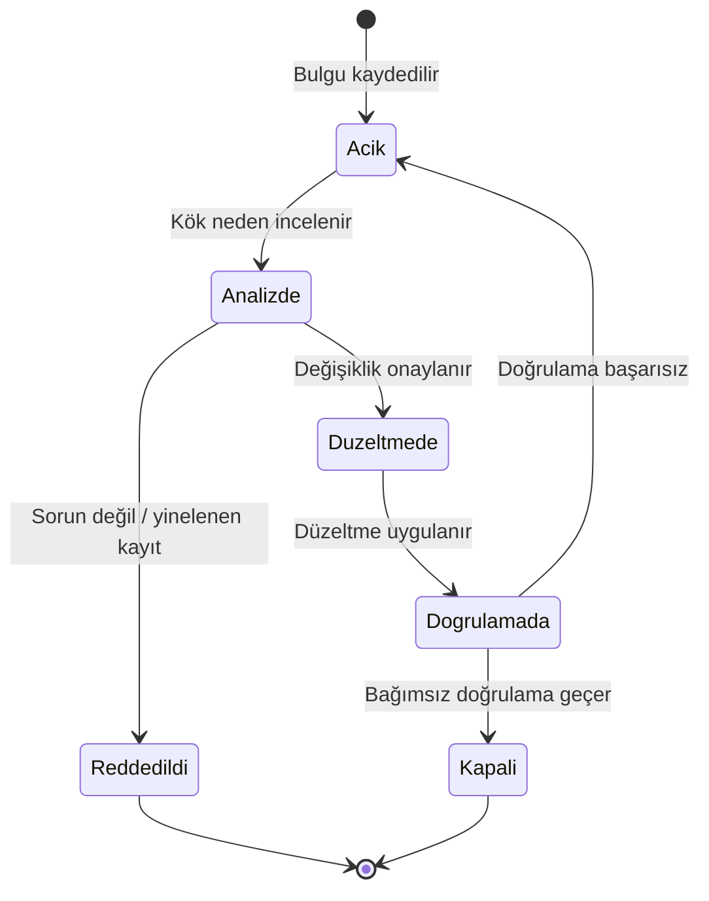

# 9. Yazılım Doğrulama

Doğrulama, yazılımın beklenen davranışı gerçekten sağladığını gösteren kanıt üretir.
Bu kanıt; gözden geçirme, analiz, test ve yapısal kapsam ölçümleri ile oluşur.

Kritik nokta, doğrulamanın sonradan eklenen bir adım olmamasıdır. Tasarım ve
gereksinimlerdeki belirsizlikler çoğu zaman doğrulama sırasında görünür hale gelir.

## Doğrulamanın amacı

Doğrulama, "çalışıyor mu?" sorusundan daha geniştir. Asıl soru, yazılımın tanımlanan
koşullarda, beklenen sınırlar içinde ve istenen güvenlik düzeyinde davranıp
davranmadığıdır.

Bu yüzden doğrulama sadece hata bulma faaliyeti değildir; aynı zamanda gereksinimlerin,
tasarımın ve kodun birbirini gerçekten desteklediğini gösterme faaliyetidir.

## Bağımsızlık

Doğrulama bağımsızlığı (verification independence), bir iş ürününü doğrulayan kişinin
o ürünü geliştiren kişiden farklı olması demektir. Buradaki amaç basit bir psikolojik
gerçeğe dayanır: kendi yazdığımız gereksinimi veya kodu okurken, yazarken yaptığımız
varsayımları farkında olmadan tekrar yaparız. Aynı kör noktaya iki kez bakan göz,
oradaki hatayı iki kez kaçırır. Bağımsız bir göz ise ürünü kendi varsayımları olmadan,
yalnızca yazılı olana bakarak değerlendirir.

Bağımsızlıkla ilgili en yaygın yanlış anlama, bunun **örgütsel** bir ayrım gerektirdiği
düşüncesidir. DO-178C bağlamında bağımsızlık **kişi düzeyindedir**: doğrulamayı yapan
kişinin ayrı bir bölümde, ayrı bir şirkette veya ayrı bir binada olması gerekmez. Aynı
takımdaki iki mühendis, birbirinin ürünlerini çapraz doğrulayarak bağımsızlığı
sağlayabilir. Önemli olan, doğrulayanın doğruladığı ürünün üreticisi olmamasıdır.
(Kalite güvencesi için durum farklıdır; orada örgütsel bağımsızlık da beklenir —
bu ayrımı kalite güvencesi bölümünde ele alıyoruz.)

Bağımsızlığın ikinci biçimi **araç desteğidir**: bazı doğrulama hedefleri, kişi yerine
kalifiye edilmiş bir araçla da bağımsız sayılabilir. Örneğin kodlama standardına
uygunluğu denetleyen bir statik analiz aracı, araç kalifikasyonu koşullarını
sağlıyorsa, bu denetimi yapan "bağımsız göz" rolünü üstlenebilir.

Hangi hedefler için bağımsızlık beklendiği yazılım seviyesine bağlıdır. Kaba çizgileriyle:

| Yazılım seviyesi | Bağımsızlık beklentisi |
|---|---|
| A | En geniş kapsam: kaynak kodun gereksinimlere ve mimariye uygunluğu, test sonuçlarının değerlendirilmesi ve kapsam analizleri dahil pek çok doğrulama hedefi bağımsız kişilerce yerine getirilir |
| B | A'ya yakın ancak daha dar; özellikle kod ile düşük seviyeli gereksinimler arasındaki uygunluk doğrulaması bağımsız yapılır |
| C | Bağımsızlık yalnızca birkaç hedef için beklenir |
| D | Bağımsızlık beklentisi yok denecek kadar azdır |

Pratikte bağımsızlık genellikle şöyle organize edilir:

- **Çapraz doğrulama:** Aynı takım içinde, A modülünü yazan mühendis B modülünün
  testlerini gözden geçirir; B'yi yazan da A'nınkileri. Küçük takımlarda en yaygın
  ve en ekonomik modeldir.
- **Ayrı doğrulama ekibi:** Büyük projelerde test geliştirme ve gözden geçirme işini
  yalnızca doğrulamaya ayrılmış bir ekip üstlenir. İzlenebilirlik ve kayıt disiplini
  daha kolay yönetilir; ancak alan bilgisi aktarımı için ek çaba gerekir.
- **Rol bazlı ayrım:** Aynı kişi projenin farklı bileşenlerinde farklı roller alabilir;
  kritik olan, hiçbir iş ürününde geliştiren ile doğrulayanın aynı kişi olmamasıdır.

Bağımsızlığın kanıtı kayıtlardır: gözden geçirme tutanaklarında ve test sonuç
kayıtlarında geliştiren ile doğrulayanın adları ayrı ayrı görünmelidir. Denetimlerde
(örneğin SOI değerlendirmelerinde) ilk bakılan şeylerden biri budur; "bağımsız yaptık"
demek yetmez, kimin neyi yaptığı kayıttan okunabilmelidir.

## Başlıca yöntemler

### Doğrulamada kullanılan başlıca yöntemler

- Gözden geçirme: insan hatasını erken bulur.
- Analiz: mantıksal tutarlılığı kontrol eder.
- Test: davranışı çalışır durumda doğrular.

### Ek olarak

- sınır değer analizi,
- arayüz kontrolü,
- yapısal kapsam ölçümü,
- negatif senaryo testi.

## Gözden geçirmeler

Gözden geçirme (review), bir iş ürününün başka gözler tarafından sistematik biçimde
incelenmesidir. En ucuz doğrulama yöntemidir, çünkü hatayı ürün henüz kağıt üzerindeyken
yakalar: gereksinimdeki bir belirsizlik gözden geçirmede on dakikada düzeltilir; aynı
belirsizlik teste kadar yaşarsa kod, test ve izlenebilirlik zinciri birlikte değişir.

Her geliştirme çıktısının kendine özgü bir gözden geçirme odağı vardır:

- **Gereksinim gözden geçirmesi:** Her gereksinim tekil, doğrulanabilir ve
  belirsizlikten arınmış mı? "Hızlı", "uygun", "yeterli" gibi ölçülemeyen ifadeler
  var mı? Sistem gereksinimlerine izlenebilirlik kurulmuş mu? Hata ve sınır durumları
  tanımlanmış mı?
- **Tasarım gözden geçirmesi:** Yazılım mimarisi gereksinimleri karşılıyor mu?
  Düşük seviyeli gereksinimler yüksek seviyeli gereksinimlerle tutarlı mı? Arayüzler,
  veri akışı ve kontrol akışı tanımlı mı? Tasarım kararlarının gerekçeleri kayıtlı mı?
- **Kod gözden geçirmesi:** Kaynak kod düşük seviyeli gereksinimleri eksiksiz ve
  doğru gerçekliyor mu? Kodlama standardına uyuluyor mu? Gereksinime izlenmeyen
  kod parçası (potansiyel gereksiz kod) var mı? Sınır koşulları, taşma ve hata
  yolları ele alınmış mı?
- **Test gözden geçirmesi:** Test durumları gereksinimdeki her koşulu — normal ve
  gürbüzlük (robustness) — kapsıyor mu? Beklenen sonuçlar gereksinimden mi türetilmiş, yoksa kodun
  mevcut davranışından mı kopyalanmış? Test prosedürleri tekrarlanabilir mi?

### Kontrol listeleri ve kayıt

Etkili gözden geçirmenin iki dayanağı vardır: **kontrol listesi** (checklist) ve
**kayıt**. Kontrol listesi, incelemenin kişisel deneyime bırakılmasını önler; her
gözden geçiren aynı asgari soruları sorar. İyi bir kontrol listesi kısa tutulur
(20-30 madde), projede sık görülen hata türleriyle güncellenir ve "evet/hayır" ile
yanıtlanabilen sorulardan oluşur.

Kayıt ise sertifikasyon kanıtıdır. Tipik bir gözden geçirme kaydında şunlar bulunur:

| Alan | İçerik |
|---|---|
| İncelenen ürün | Doküman/dosya adı ve konfigürasyon sürümü |
| Katılımcılar | Gözden geçiren(ler) ve yazar — bağımsızlık buradan izlenir |
| Kullanılan kontrol listesi | Sürümüyle birlikte |
| Bulgular | Her bulgu için sınıf (büyük/küçük/öneri) ve karar |
| Kapanış | Bulguların giderildiğinin teyidi ve yeniden inceleme kararı |

### Etkili akran gözden geçirmesi için pratikler

Deneyimin gösterdiği birkaç basit kural, gözden geçirmenin verimini belirgin artırır:

- Malzemeyi toplantıdan **önce** dağıtın; toplantı bulguları tartışmak içindir,
  ilk kez okumak için değil.
- Oturumları kısa tutun; bir saatten sonra bulgu bulma oranı hızla düşer. Büyük
  dokümanları parçalara bölün.
- Yazarı değil ürünü eleştirin; savunma refleksi başlayan bir gözden geçirme
  bulgu üretmeyi bırakır.
- Bulguları toplantıda **çözmeye çalışmayın**; kaydedin, sahiplendirin, kapanışını
  ayrıca takip edin.
- "Gözden geçirildi" damgasını, bulgular kapanmadan basmayın; açık bulgusu olan
  ürün konfigürasyon açısından hâlâ olgunlaşmamıştır.

## Analizler

Analiz, bir özelliğin **tüm** koşullar için geçerli olduğunu akıl yürütme ile
göstermeye çalışır; test ise yalnızca denenen durumlar için kanıt üretir. Bu yüzden
"her zaman doğru olmalı" türünden özellikler — zamanlama sınırları, bellek sınırları,
kaynak tüketimi — test yerine analizle gösterilir. Aviyonik projelerde en sık
karşılaşılan analizler şunlardır:

### En kötü durum çalışma zamanı analizi

En kötü durum çalışma zamanı (worst-case execution time, WCET) analizi, her kritik
görevin en olumsuz koşulda bile ayrılan zaman dilimini aşmadığını gösterir. Ortalama
süre yanıltıcıdır; önemli olan önbellek ıskalamaları, kesmeler ve en uzun kod yolunun
üst üste geldiği durumdur. İki temel yaklaşım vardır:

- **Ölçüme dayalı:** Kod hedef donanımda çalıştırılır, en uzun gözlenen süre bir
  güvenlik payı ile çarpılır. Basittir ama en kötü yolun gerçekten tetiklendiğinden
  emin olmak zordur.
- **Statik analiz:** Kodun kontrol akışı ve işlemci modeli üzerinden üst sınır
  hesaplanır. Kanıt gücü yüksektir; modern çok çekirdekli işlemcilerde modelleme
  güçlüğü nedeniyle çoğu proje iki yaklaşımı birleştirir.

WCET sonuçları zamanlama bütçesiyle karşılaştırılır ve kalan pay (margin) raporlanır;
sertifikasyon makamları tükenmek üzere olan zaman bütçelerini yakından sorgular.

### Yığın kullanımı analizi

Yığın (stack) taşması, emniyet-kritik sistemlerde sinsi bir hata kaynağıdır: taşma
anında değil, bozduğu veriler kullanıldığında belirti verir. Yığın analizi, en derin
çağrı zinciri ile kesme yükü üst üste geldiğinde bile ayrılan yığın alanının
aşılmadığını gösterir. Statik çağrı grafiği üzerinden hesap yapılır; işlev
işaretçileri ve özyineleme bu hesabı zorlaştırdığından çoğu kodlama standardı
özyinelemeyi zaten yasaklar. Hesap, hedefte doldurulmuş desenle (stack painting)
yapılan ölçümle çapraz kontrol edilir.

### Bellek haritası analizi

Bellek haritası analizi, bağlayıcı (linker) çıktısındaki yerleşimin tasarımla uyumunu
denetler: kod, sabit veri ve değişken veri doğru bölgelere mi yerleşmiş; bölgeler
taşıyor mu ya da birbirine giriyor mu; korumalı bölgelere (örneğin bir bölümleme
sınırının ötesine) beklenmedik bir yerleşim var mı? Yazılım bölümlemesi kullanan
sistemlerde bu analiz, bölümler arası izolasyon iddiasının temel dayanaklarındandır.

### Bağlantı ve yükleme analizi

Bağlantı (link) analizi, çalıştırılabilir nesne kodunun doğru bileşen sürümlerinden,
çözülmemiş sembol kalmadan ve beklenmeyen kütüphane kodu çekilmeden oluştuğunu
gösterir. Yükleme (load) analizi ise imajın hedef donanıma bütünlüğü bozulmadan
yüklendiğini doğrular: bellek aralığı uygunluğu, sağlama toplamı / CRC kontrolü ve
uçuşta yeniden programlanabilen sistemlerde yükleme prosedürünün güvenliği bu
kapsamdadır.

Tüm bu analizlerin ortak disiplini şudur: analiz **konfigürasyonu belli** bir yapı
(build) üzerinde yapılır ve o yapı değiştiğinde tekrarlanır ya da değişikliğin analizi
etkilemediği gerekçelendirilir. Son sürümde unutulmuş eski bir WCET raporu, denetimde
kanıt değil bulgu olur.

## Testin rolü

Test, yazılımın somut davranışını gözlemler. Bir gereksinim ne kadar iyi yazılmış olursa
olsun, test ile desteklenmiyorsa sertifikasyon açısından eksik kalır. Test; yalnızca
başarı durumunu değil, hata ve sınır durumlarını da kapsamalıdır.

DO-178C'de testler **gereksinim tabanlıdır**: her test bir gereksinime dayanır ve
normal koşulların yanında gürbüzlük koşullarını da kapsar.

### Test stratejileri

Gereksinim tabanlı test, gereksinimi okuyup akla ilk gelen senaryoyu yazmak değildir;
girdi uzayını sistematik tekniklerle taramaktır. Yerleşik teknikler şunlardır:

- **Eşdeğerlik sınıfı ayrımı (equivalence class partitioning):** Girdi uzayı, yazılımın
  aynı biçimde davranması beklenen sınıflara bölünür ve her sınıftan en az bir temsilci
  test edilir. Örneğin 0–350 knot aralığında geçerli bir hız girdisi için üç sınıf
  vardır: aralığın altı, aralığın içi, aralığın üstü.
- **Sınır değer testi (boundary value testing):** Hatalar sınıfların ortasında değil,
  kenarlarında yoğunlaşır (`<` yerine `<=` yazmak gibi). Her sınırın kendisi, bir
  altı ve bir üstü test edilir.
- **Durum geçiş testi (state transition testing):** Durum makinesi içeren yazılımlarda
  her geçerli geçiş en az bir kez tetiklenir; geçersiz geçiş denemelerinin
  reddedildiği de ayrıca gösterilir (gürbüzlük).
- **Karar tablosu testi (decision table testing):** Birden çok koşulun birleşimine
  göre davranan mantık için koşul kombinasyonları tablo halinde yazılır ve her
  anlamlı satır test edilir. Bu teknik, MC/DC hedefiyle doğal olarak örtüşür.
- **Entegrasyon testleri:** Bileşenler bir araya geldiğinde arayüzlerin — parametre
  aralıkları, birimler, çağrı sırası, zamanlama — doğru çalıştığını gösterir. Birim
  düzeyinde kusursuz iki modül, biri metre diğeri feet konuşuyorsa birlikte yanlıştır.
- **Performans testleri:** Zamanlama, iş çıkarma ve kaynak kullanımı gereksinimlerinin
  hedef donanımda karşılandığını gösterir; WCET analiziyle birbirini tamamlar.

Küçük bir C örneği üzerinden sınır değer düşünelim:

```c
/* Gereksinim: Hiz 0-350 knot araligindaysa gecerli kabul edilir. */
bool hiz_gecerli_mi(int32_t hiz_knot)
{
    return (hiz_knot >= 0) && (hiz_knot <= 350);
}
```

Bu işlev için sınır değer testi en az şu girdileri içerir: `-1`, `0`, `1`
(alt sınır) ve `349`, `350`, `351` (üst sınır). `175` gibi bir orta değer eşdeğerlik
sınıfını temsil eder; `INT32_MIN` ve `INT32_MAX` ise gürbüzlük durumlarıdır.

### Test planlama ve test geliştirme

Test faaliyeti iki ayrı iş ürünü üretir ve bu ayrım önemlidir:

| İş ürünü | İçerik | Sorusu |
|---|---|---|
| Test durumu (test case) | Girdi, ön koşullar, beklenen sonuç, izlendiği gereksinim | *Ne* test edilecek? |
| Test prosedürü (test procedure) | Test durumlarını çalıştırmak için adım adım talimat veya betik | *Nasıl* çalıştırılacak? |

Test durumları gereksinimden türetilir ve gereksinim değişmedikçe kararlıdır; test
prosedürleri ise test ortamına (yazılım entegrasyon ortamı, hedef donanım) bağlıdır.
Planlama aşamasında hangi testin hangi ortamda koşacağı, hangi seviyede (birim,
entegrasyon, donanım-yazılım entegrasyonu) yürütüleceği ve sonuçların nasıl
kaydedileceği belirlenir. Uygunluk kanıtı sayılacak son koşular hedef donanımda ya da
hedefe denkliği gerekçelendirilmiş bir ortamda yapılır.

### İyi bir testin nitelikleri

- **Gereksinime izlenir:** Hangi gereksinimi doğruladığı testin üzerinde yazar;
  "faydalı görünen" ama hiçbir gereksinime bağlanmayan test, gereksinim eksikliğinin
  işaretidir.
- **Beklenen sonucu gereksinimden alır:** Beklenen değer koddan kopyalanırsa test,
  kodun kendi kendine eşit olduğunu kanıtlar — hatayı değil.
- **Tekrarlanabilirdir:** Aynı yapı ve aynı ortamda her koşuda aynı sonucu verir;
  zamanlamaya veya koşu sırasına gizlice bağımlı test güven vermez.
- **Başarısız olmayı bilir:** Sonucu otomatik ve net biçimde geçti/kaldı olarak
  değerlendirir; "çıktıya göz atın" diyen prosedür kanıt üretmez.
- **Gürbüzlüğü unutmaz:** Geçersiz girdi, sınır aşımı ve hata yolları da normal
  senaryolar kadar testin konusudur.

## Doğrulamanın doğrulanması

Testlerin kendisi de bir iş ürünüdür ve doğrulanır: testler gereksinimleri gerçekten
kapsıyor mu, kodun yeterince derinine iniyor mu?

### Gereksinim kapsam analizi

Gereksinim kapsam analizi (requirements coverage analysis) şu soruyu yanıtlar: **her
gereksinim, en az bir test durumu ile karşılanıyor mu ve bu testler gereksinimin
tamamını mı sınıyor?** İzlenebilirlik verisi üzerinden yürütülür: gereksinimden test
durumuna, test durumundan test prosedürüne ve koşu sonucuna giden zincir uçtan uca
takip edilir.

Analizin iki düzeyi vardır ve ikisi de gereklidir:

1. **Eşleme kontrolü:** Her yüksek ve düşük seviyeli gereksinimin karşısında en az
   bir test durumu var mı? Bu, izlenebilirlik matrisinden mekanik olarak okunabilir.
2. **Yeterlilik kontrolü:** Eşlenen testler gereksinimin *tüm* koşullarını —
   aralıkları, kipleri, hata durumlarını, gürbüzlük beklentilerini — kapsıyor mu?
   Bu kısım mekanik değildir; testleri gereksinimle yan yana okuyan bir insan ister.
   "Gereksinim başına bir test var" demek, gereksinim üç kip tanımlıyorsa ve test
   yalnızca birini deniyorsa yeterlilik açısından boşluktur.

Analiz sonunda çıkan boşluklar tipik olarak dört gruptan birine düşer ve her grubun
çaresi farklıdır:

| Boşluk türü | Anlamı | Çözüm |
|---|---|---|
| Testsiz gereksinim | Gereksinim yazılmış, test unutulmuş | Test durumu eklenir |
| Eksik senaryo | Test var ama gereksinimin bazı koşulları denenmemiş | Test durumu genişletilir |
| Test edilemeyen gereksinim | Gereksinim ölçülebilir/doğrulanabilir yazılmamış | Gereksinim düzeltilir — test değil |
| Analizle karşılanan gereksinim | Test yerine analiz uygun (örn. "her koşulda" özellikleri) | Analiz kanıtı izlenebilirliğe bağlanır ve gerekçelendirilir |

Deneyimden bir uyarı: gereksinim kapsam analizini projenin sonuna bırakmayın. Test
geliştirme ilerledikçe matrisi canlı tutan projelerde bu analiz birkaç günlük bir
teyittir; sona bırakan projelerde ise yüzlerce boşluğun aynı anda ortaya döküldüğü,
takvimi sarsan bir krizdir.

### Yapısal kapsam analizi

Yapısal kapsam, testlerin kodun ne kadarını çalıştırdığını gösterir. Ancak bu ölçüm
tek başına yeterli değildir; amaç "yüksek sayı" değil, anlamlı kanıttır. Kapsam verisi,
gereksinim tabanlı testlerle birlikte yorumlanmalıdır.

Hangi kapsam ölçütünün arandığı yazılım seviyesine bağlıdır ve ölçütler birbirinin
üzerine inşa edilir:

| Ölçüt | Neyi ister | Arandığı seviye |
|---|---|---|
| Satır kapsama (statement coverage) | Her çalıştırılabilir satır en az bir kez çalışsın | C, B, A |
| Karar kapsama (decision coverage) | Her karar noktası hem doğru hem yanlış sonuçlansın | B, A |
| Değiştirilmiş koşul/karar kapsama (MC/DC) | Bileşik karardaki her koşulun sonucu tek başına etkilediği gösterilsin | A |

Seviye D'de yapısal kapsam ölçümü beklenmez. MC/DC'nin mantığı bir örnekle netleşir:

```c
if ((basinc_dusuk && motor_calisiyor) || bakim_kipi) {
    uyari_ver();
}
```

Karar kapsama için bu `if`'in bir kez doğru, bir kez yanlış olması yeter — üç koşuldan
biri hiç etkisini göstermeden bu sağlanabilir. MC/DC ise her koşul için, yalnızca o
koşulun değiştiği ve kararın sonucunun da değiştiği bir test çifti ister. Böylece
örneğin `bakim_kipi` teriminin gereksiz (veya yanlış) olup olmadığı test kümesinde
görünür olur. N koşullu bir karar için MC/DC tipik olarak N+1 test ile sağlanabilir;
maliyeti kombinasyonel patlamaya yol açmadan koşul düzeyinde duyarlılık sağlamasıdır.

Önemli bir ayrıntı: kapsam verisi **gereksinim tabanlı testlerin koşusundan** toplanır.
Kapsamı yükseltmek için gereksinimsiz "kapsam testi" yazmak yöntemi tersine çevirir;
düşük kapsam, ya testlerin ya gereksinimlerin ya da kodun eksik/fazla olduğunun
işaretidir ve önce bu kök neden bulunur.

### Veri bağlaşımı ve kontrol bağlaşımı analizi

Yapısal kapsamın bileşen içi ölçümünü, bileşenler **arası** bir analiz tamamlar:
veri bağlaşımı (data coupling) ve kontrol bağlaşımı (control coupling) analizi.
Veri bağlaşımı, bir bileşenin ürettiği verinin başka bileşenlerce kullanımıdır;
kontrol bağlaşımı ise bir bileşenin diğerinin çalışmasını etkilemesidir (çağrı,
kip seçimi vb.). Analizin amacı, mimaride tanımlanan tüm bağlaşımların gereksinim
tabanlı testler sırasında gerçekten **işletildiğini** göstermektir: her arayüz
en az bir testte veri taşımış mı, her çağrı ilişkisi tetiklenmiş mi? Bu analiz,
birim testleri kusursuz olsa bile entegrasyonda saklanan arayüz hatalarını hedefler
ve tipik olarak entegrasyon testi kapsam verisiyle beslenir.

### Kapsam boşluklarının ele alınması

Kapsam analizi bittiğinde çalışmamış kod parçaları listelenir ve her biri
sınıflandırılır; sınıfına göre yapılacak iş farklıdır:

- **Test eksiği:** Kod gereksinime izlenebiliyor ama test o yolu tetiklememiş.
  Çözüm yeni ya da genişletilmiş test durumudur; gereksinim de eksikse önce o
  tamamlanır.
- **Ölü kod:** Hiçbir gereksinime izlenmeyen ve hiçbir koşulda çalışması mümkün
  olmayan kod. Kural olarak **kaldırılır**; bırakılacaksa güçlü bir gerekçe ve
  emniyet değerlendirmesi gerekir.
- **Gereksiz kod:** Gereksinimlere izlenmeyen ancak çalışması mümkün olan kod
  (örneğin unutulmuş hata ayıklama çıktısı). Ya kaldırılır ya da eksik olan
  gereksinim yazılıp doğrulanır.
- **Devre dışı bırakılmış kod:** Bilinçli olarak bu konfigürasyonda çalıştırılmayan
  kod (örneğin başka bir uçak tipine ait seçenek). Kaldırılmaz; ancak devre dışı
  kalma mekanizmasının (derleme anahtarı, konfigürasyon verisi) yanlışlıkla
  etkinleşmeye izin vermediği ayrıca doğrulanır.

Bu sınıflandırmanın kayıtlı ve gerekçeli olması gerekir; "kapsam %100 değil ama
önemsiz" cümlesi denetimde kabul görmez, her boşluğun tek tek hesabı verilir.

## İnceleme ve analiz

Gözden geçirme ve analiz, testten önce veya testle paralel yürütülmelidir. Çünkü bazı
hatalar çalıştırma ile değil, mantık incelemesi ile daha erken ve daha düşük maliyetle
yakalanır.

## Problem raporlama

Doğrulama bulgu üretir; bulgular ancak kayıt altına alınırsa değer taşır. Problem
raporu (problem report), doğrulama sırasında bulunan her uygunsuzluğun — kod hatası,
gereksinim belirsizliği, test hatası, doküman tutarsızlığı — resmi kaydıdır ve
konfigürasyon yönetimi altında yaşar. Sözlü aktarılan ya da e-postada kalan bir bulgu,
sertifikasyon açısından hiç bulunmamış gibidir.

İyi bir problem raporu en azından şunları içerir: sorunun gözlendiği yapı ve ortam
(konfigürasyon sürümüyle), yeniden üretme adımları, gözlenen ve beklenen davranış,
etkilenen iş ürünleri ve sorumlu. Rapor açıldıktan sonra tanımlı bir yaşam döngüsünden
geçer:



Sınıflandırma iki eksende yapılır ve karar mekanizmalarını besler:

- **Etki (önem):** Sorun emniyeti veya bir gereksinim uyumunu mu etkiliyor, yoksa
  yalnızca dokümantasyon ya da kullanım kolaylığı sorunu mu? Emniyet etkisi olan
  raporlar sistem emniyet değerlendirmesine geri beslenir.
- **Kök nedenin bulunduğu ürün:** Hata kodda mı, gereksinimde mi, testte mi, yoksa
  araçta mı? Bu eksen, düzeltmenin hangi süreçten yeniden geçeceğini belirler —
  gereksinim hatası yalnızca kod yamasıyla kapatılamaz.

Her problem raporunun kapanışı da doğrulamadır: düzeltme yapıldıktan sonra sorunu
bulan test yeniden koşulur ve değişiklik etki analizine göre etkilenen diğer testler
tekrarlanır (regresyon).

### Açık problem raporlarıyla sertifikasyona gitmek

Gerçek projeler sertifikasyon anına sıfır açık raporla varmaz; bu normaldir. Kritik
olan, açık kalan her raporun **değerlendirilmiş** olmasıdır. Sertifikasyon öncesinde
açık raporlar tek tek gözden geçirilir ve her biri için şu sorular yanıtlanır:
emniyet veya işlevsellik etkisi var mı, işletme kısıtı gerektiriyor mu, hangi sürümde
düzeltilmesi planlanıyor? Bu değerlendirmenin özeti yazılım başarı özetinde
(Software Accomplishment Summary, SAS) sunulur ve sertifikasyon makamıyla paylaşılır.
Emniyeti etkileyen bir raporun "açık" olarak taşınması kabul edilmez; ya düzeltilir
ya da etkisi sistem düzeyinde kısıtlarla giderilir. Deneyimin öğrettiği kural şudur:
denetçiyi rahatsız eden açık rapor sayısı değil, sahipsiz ve değerlendirilmemiş
rapordur.

## Bu bölümden akılda kalması gerekenler

- Doğrulama, kanıt üretme faaliyetidir; kanıt kayıtlarda yaşar.
- Bağımsızlık kişi düzeyindedir: geliştiren ile doğrulayan aynı kişi olamaz; kimin
  neyi yaptığı kayıttan okunabilmelidir.
- Test tek başına yeterli değildir; gözden geçirme ve analiz (WCET, yığın, bellek
  haritası, bağlantı/yükleme) de gerekir — "her zaman doğru" özellikler testle değil
  analizle gösterilir.
- Testler gereksinim tabanlıdır ve sistematik tekniklerle (eşdeğerlik sınıfı, sınır
  değer, durum geçişi, karar tablosu) türetilir; gürbüzlük durumları normal durumlar
  kadar önemlidir.
- Gereksinim kapsamı eşlemeyle bitmez; testlerin gereksinimin tamamını sınadığı da
  gösterilir.
- Yapısal kapsam ölçütü seviyeye göre artar (satır → karar → MC/DC); kapsam verisi
  gereksinim tabanlı testlerden toplanır ve her boşluk (ölü, gereksiz, devre dışı
  kod) sınıflandırılıp gerekçelendirilir.
- Doğrulama bulguları problem raporuyla yaşar; sertifikasyona açık raporla gidilebilir,
  ama değerlendirilmemiş raporla gidilemez.
