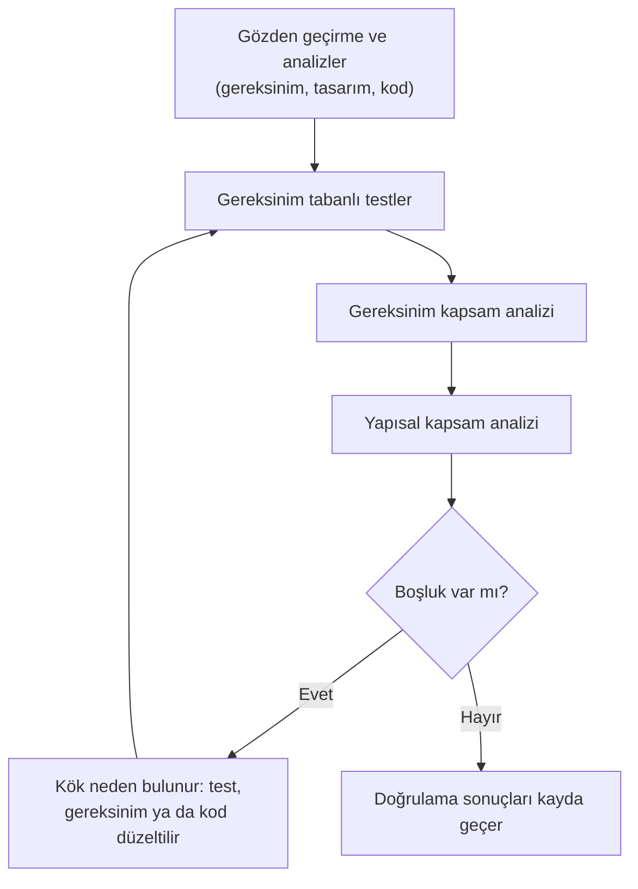
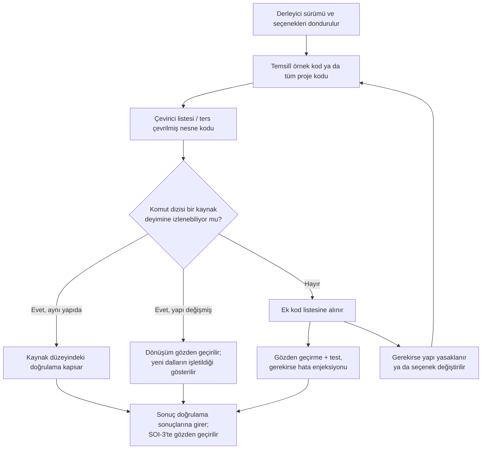
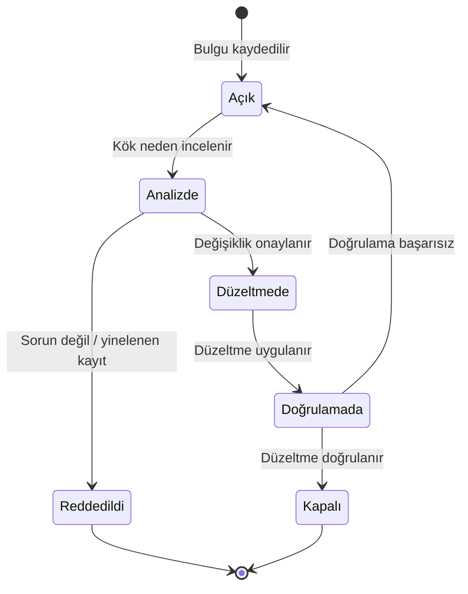

# 9. Yazılım Doğrulama

Doğrulama (verification), yazılımın gereksinimlerini doğru ve eksiksiz karşıladığını
gösteren kanıtı üretir; bu kanıt gözden geçirme, analiz ve testle oluşur. Bu bölüm
bağımsızlığı, bu üç yöntemi, gereksinim ve yapısal kapsam analizlerini ve bulguların
problem raporlarıyla yönetimini anlatır.

Kritik nokta, doğrulamanın sonradan eklenen bir adım olmamasıdır. Doğrulama,
geliştirmeyle eşzamanlı yürüyen bütünleyici süreçlerden (integral processes) biridir;
tasarım ve gereksinimlerdeki belirsizlikler çoğu zaman doğrulama sırasında görünür hâle
gelir.

## Doğrulamanın amacı

Doğrulama, "çalışıyor mu?" sorusundan daha geniştir. Asıl soru, yazılımın tanımlanan
koşullarda, beklenen sınırlar içinde ve istenen emniyet düzeyinde davranıp
davranmadığıdır.

Bu yüzden doğrulama sadece hata bulma faaliyeti değildir; aynı zamanda gereksinimlerin,
tasarımın ve kodun birbirini gerçekten desteklediğini gösterme faaliyetidir.

## Bağımsızlık

Doğrulama bağımsızlığı (verification independence), bir iş ürününü doğrulayan kişinin
o ürünü geliştiren kişiden farklı olması demektir. Buradaki amaç basit bir psikolojik
gerçeğe dayanır: kendi yazdığımız gereksinimi veya kodu okurken, yazarken yaptığımız
varsayımları farkında olmadan tekrar yaparız. Aynı kör noktaya iki kez bakan göz,
oradaki hatayı iki kez kaçırır. Bağımsız bir göz ise ürünü kendi varsayımları olmadan,
yalnızca yazılı olana bakarak değerlendirir.

Bağımsızlıkla ilgili en yaygın yanlış anlama, bunun **örgütsel** bir ayrım gerektirdiği
düşüncesidir. DO-178C bağlamında bağımsızlık **kişi düzeyindedir**: doğrulamayı yapan
kişinin ayrı bir bölümde, ayrı bir şirkette veya ayrı bir binada olması gerekmez. Aynı
takımdaki iki mühendis, birbirinin ürünlerini çapraz doğrulayarak bağımsızlığı
sağlayabilir. Önemli olan, doğrulayanın doğruladığı ürünün üreticisi olmamasıdır.
Standart bunun bir sonucunu ayrıca vurgular: düşük seviyeli gereksinimlere (low-level
requirements) dayalı test durumlarını yazan kişi, aynı gereksinimlerden kaynak kodu
geliştiren kişi olmamalıdır.
Kalite güvencesinde (quality assurance) bağımsızlık buna ek olarak düzeltici faaliyetin
(corrective action) yapılmasını sağlama yetkisini de kapsar; uygulamada bu çoğunlukla
ayrı bir raporlama hattıyla sağlanır. Ayrıntısı
[11. Yazılım Kalite Güvencesi](11-yazilim-kalite-guvencesi.md) bölümündedir.

Bağımsızlığın ikinci yolu **araç desteğidir**: insan eliyle yapılacak doğrulama
faaliyetine denk bir güvence sağlayan araç da "bağımsız göz" rolünü üstlenebilir.
Örneğin test çıktılarını beklenen sonuçlarla karşılaştıran ya da yapısal kapsamı ölçen
bir araç bu amaçla kullanılabilir; çıktısı ayrıca doğrulanmıyorsa araç kalifikasyonu
(tool qualification) koşullarını sağlaması gerekir (bkz.
[13. DO-330 ve Yazılım Aracı Kalifikasyonu](../04-arac-kalifikasyonu-ve-ekler/13-do330-arac-kalifikasyonu.md)).

Bağımsızlık her hedefte (objective) aranmaz: DO-178C'nin hedef tablolarında hangi
hedefin hangi yazılım seviyesinde (software level) bağımsızlıkla karşılanacağı ayrıca
işaretlidir. Kaba çizgileriyle:

| Yazılım seviyesi | Doğrulama hedeflerinde bağımsızlık |
|---|---|
| Seviye A | En geniş kapsam: 71 hedefin 30'u bağımsızlıkla karşılanır. Kaynak kodun gereksinimlere ve mimariye uygunluğu, test sonuçlarının değerlendirilmesi ve kapsam analizleri dahil pek çok doğrulama hedefi bu gruptadır |
| Seviye B | Daha dar: 69 hedefin 18'i. Gereksinimlerin bir üst seviyeye uygunluğu ve doğruluğu, kaynak kodun düşük seviyeli gereksinimlere uygunluğu ve yapısal kapsam gibi hedefler bağımsız kalır; mimari, test prosedürleri ve sonuçları ile gereksinim test kapsamı gibi hedeflerde bağımsızlık yalnızca Seviye A'da aranır |
| Seviye C | Doğrulama hedeflerinde bağımsızlık aranmaz; 62 hedeften bağımsızlıkla işaretli 5'i kalite güvencesi hedefleridir |
| Seviye D | Doğrulama hedeflerinde bağımsızlık aranmaz; 26 hedeften bağımsızlıkla işaretli 2'si kalite güvencesi hedefleridir |

Seviye A ve B'deki sayılara kalite güvencesi hedefleri de dahildir. Bağımsızlık
aranmayan hedeflerde de gözden geçirme ya da analiz yapılır; yalnızca bunu yazarın
kendisinin yapması standartça yasak değildir. Yine de yazar dışı bir gözün bakması her
seviyede iyi uygulamadır.

Pratikte bağımsızlık genellikle şöyle organize edilir:

- **Çapraz doğrulama:** Aynı takım içinde, A modülünü yazan mühendis B modülünün
  testlerini gözden geçirir; B'yi yazan da A'nınkileri. Küçük takımlarda en yaygın
  ve en ekonomik modeldir.
- **Ayrı doğrulama ekibi:** Büyük projelerde test geliştirme ve gözden geçirme işini
  yalnızca doğrulamaya ayrılmış bir ekip üstlenir. İzlenebilirlik ve kayıt disiplini
  daha kolay yönetilir; ancak alan bilgisi aktarımı için ek çaba gerekir.
- **Rol bazlı ayrım:** Aynı kişi projenin farklı bileşenlerinde farklı roller alabilir;
  kritik olan, bağımsızlığın arandığı hedeflerde aynı iş ürününü geliştiren ile
  doğrulayanın aynı kişi olmamasıdır.

Bağımsızlığın kanıtı kayıtlardır: gözden geçirme tutanaklarında ve test sonuç
kayıtlarında geliştiren ile doğrulayanın adları ayrı ayrı görünmelidir. Katılım aşaması
(Stage of Involvement, SOI) denetimlerinde ilk bakılan şeylerden biri budur; "bağımsız
yaptık" demek yetmez, kimin neyi yaptığı kayıttan okunabilmelidir.

## Doğrulama yöntemleri

Doğrulama üç yöntemle yürür; üçü birbirinin yerine değil, birbirini tamamlayacak
biçimde kullanılır:

| Yöntem | Ne üretir | Tipik kullanım |
|---|---|---|
| Gözden geçirme (review) | Bir iş ürününün doğruluğuna ilişkin, çoğunlukla kontrol listesiyle yürütülen nitel değerlendirme | Gereksinim, tasarım, kod ve testlerin standartlara ve bir üst seviyeye uygunluğu |
| Analiz (analysis) | Yinelenebilir, çoğu zaman araç destekli kanıt | Zamanlama, yığın ve bellek kullanımı; kapsam ve bağlaşım analizleri |
| Test | Çalışan kodun davranışının gözlemi | Gereksinimlerin karşılandığının ve istenmeyen davranış bulunmadığının gösterilmesi |

Gözden geçirme ve analiz testi beklemez, geliştirmeyle birlikte yürür; çünkü bazı
hatalar kodu çalıştırarak değil, okuyarak daha erken ve daha ucuza yakalanır. Sınır
değer ya da durum geçişi gibi adlar ise ayrı yöntem değil, test durumu (test case) türetme
teknikleridir. Akışın tamamı şöyle özetlenebilir:


```mermaid
flowchart TD
    A["Gözden geçirme ve analizler<br/>(gereksinim, tasarım, kod)"] --> B[Gereksinim tabanlı testler]
    B --> C[Gereksinim kapsam analizi]
    C --> D[Yapısal kapsam analizi]
    D --> E{Boşluk var mı?}
    E -- "Evet" --> F["Kök neden bulunur: test,<br/>gereksinim ya da kod düzeltilir"]
    F --> B
    E -- "Hayır" --> G[Doğrulama sonuçları kayda geçer]
```

Bu faaliyetlerin nasıl yürütüleceği yazılım doğrulama planında (Software Verification
Plan, SVP) tanımlanır (bkz. [5. Yazılım Planlama](05-yazilim-planlama.md)). Gözden
geçirme ve analiz prosedürleriyle test durumları ve prosedürleri, yazılım doğrulama
durumları ve prosedürleri (Software Verification Cases and Procedures, SVCP) verisini;
bunların uygulanmasıyla elde edilen kayıtlar yazılım doğrulama sonuçları (Software
Verification Results, SVR) verisini oluşturur.

## Gözden geçirmeler

Gözden geçirme, bir iş ürününün başka gözler tarafından sistematik biçimde
incelenmesidir. En ucuz doğrulama yöntemidir, çünkü hatayı ürün henüz kağıt üzerindeyken
yakalar: gereksinimdeki bir belirsizlik gözden geçirmede on dakikada düzeltilir; aynı
belirsizlik teste kadar yaşarsa kod, test ve izlenebilirlik zinciri birlikte değişir.

Her geliştirme çıktısının kendine özgü bir gözden geçirme odağı vardır:

- **Gereksinim gözden geçirmesi:** Her gereksinim tekil, doğrulanabilir ve
  belirsizlikten arınmış mı? "Hızlı", "uygun", "yeterli" gibi ölçülemeyen ifadeler
  var mı? Sistem gereksinimlerine izlenebilirlik (traceability) kurulmuş mu? Hata ve
  sınır durumları tanımlanmış mı?
- **Tasarım gözden geçirmesi:** Yazılım mimarisi gereksinimleri karşılıyor mu?
  Düşük seviyeli gereksinimler yüksek seviyeli gereksinimlerle (high-level
  requirements) tutarlı mı? Arayüzler, veri akışı ve kontrol akışı tanımlı mı? Tasarım
  kararlarının gerekçeleri kayıtlı mı?
- **Kod gözden geçirmesi:** Kaynak kod düşük seviyeli gereksinimleri eksiksiz ve
  doğru gerçekliyor mu? Kodlama standardına uyuluyor mu? Gereksinime izlenmeyen
  kod parçası (potansiyel gereksiz kod) var mı? Sınır koşulları, taşma ve hata
  yolları ele alınmış mı?
- **Test gözden geçirmesi:** Test durumları gereksinimdeki her koşulu — normal ve
  gürbüzlük (robustness) — kapsıyor mu? Beklenen sonuçlar gereksinimden mi türetilmiş,
  yoksa kodun mevcut davranışından mı kopyalanmış? Test prosedürleri tekrarlanabilir mi?

### Kontrol listeleri ve kayıt

Etkili gözden geçirmenin iki dayanağı vardır: **kontrol listesi** (checklist) ve
**kayıt**. Kontrol listesi, gözden geçirmenin kişisel deneyime bırakılmasını önler; her
gözden geçiren aynı asgari soruları sorar. İyi bir kontrol listesi kısa tutulur
(20-30 madde), projede sık görülen hata türleriyle güncellenir ve "evet/hayır" ile
yanıtlanabilen sorulardan oluşur.

Kayıt ise sertifikasyon kanıtıdır. Tipik bir gözden geçirme kaydında şunlar bulunur:

| Alan | İçerik |
|---|---|
| Gözden geçirilen ürün | Doküman/dosya adı ve konfigürasyon sürümü |
| Katılımcılar | Gözden geçiren(ler) ve yazar — bağımsızlık buradan izlenir |
| Kullanılan kontrol listesi | Sürümüyle birlikte |
| Bulgular | Her bulgu için sınıf (büyük/küçük/öneri) ve karar |
| Kapanış | Bulguların giderildiğinin teyidi ve yeniden gözden geçirme kararı |

### Etkili akran gözden geçirmesi için pratikler

Deneyimin gösterdiği birkaç basit kural, gözden geçirmenin verimini belirgin artırır:

- Malzemeyi toplantıdan **önce** dağıtın; toplantı bulguları tartışmak içindir,
  ilk kez okumak için değil.
- Oturumları kısa tutun; bir saatten sonra bulgu bulma oranı hızla düşer. Büyük
  dokümanları parçalara bölün.
- Yazarı değil ürünü eleştirin; savunma refleksi başlayan bir gözden geçirme
  bulgu üretmeyi bırakır.
- Bulguları toplantıda **çözmeye çalışmayın**; kaydedin, sahiplendirin, kapanışını
  ayrıca takip edin.
- "Gözden geçirildi" damgasını, bulgular kapanmadan basmayın; açık bulgusu olan
  ürün konfigürasyon açısından hâlâ olgunlaşmamıştır.

## Analizler

Analiz, bir özelliğin **tüm** koşullar için geçerli olduğunu akıl yürütme ile
göstermeye çalışır; test ise yalnızca denenen durumlar için kanıt üretir. Bu yüzden
"her zaman doğru olmalı" türünden özellikler — zamanlama sınırları, bellek sınırları,
kaynak tüketimi — yalnız testle gösterilemez; analiz gerekir ve ölçümle desteklenir.
Aviyonik projelerde en sık karşılaşılan analizler şunlardır:

### En kötü durum yürütme süresi analizi

En kötü durum yürütme süresi (worst-case execution time, WCET) analizi, her kritik
görevin en olumsuz koşulda bile ayrılan zaman dilimini aşmadığını gösterir. Ortalama
süre yanıltıcıdır; önemli olan önbellek ıskalamaları, kesmeler ve en uzun kod yolunun
üst üste geldiği durumdur. İki temel yaklaşım vardır:

- **Ölçüme dayalı:** Kod hedef donanımda çalıştırılır, en uzun gözlenen süreye bir
  emniyet payı eklenir. Basittir ama en kötü yolun gerçekten tetiklendiğinden
  emin olmak zordur.
- **Statik analiz:** Kodun kontrol akışı ve işlemci modeli üzerinden üst sınır
  hesaplanır. Kanıt gücü yüksektir; modern işlemcilerde modelleme güçlüğü nedeniyle
  çoğu proje iki yaklaşımı birleştirir.

WCET sonuçları zamanlama bütçesiyle karşılaştırılır ve kalan pay (margin) raporlanır;
sertifikasyon otoriteleri tükenmek üzere olan zaman bütçelerini yakından sorgular.

Çok çekirdekli işlemcilerde iş daha da zorlaşır: çekirdekler önbellek, veri yolu ve
bellek denetleyicisi gibi kaynakları paylaştığından bir çekirdekteki yük, diğerindeki
görevin süresini uzatabilir. Bu girişim (interference) kanalları belirlenip
sınırlandırılmadan WCET savunulamaz; otoritelerin beklentisi FAA AC 20-193 ve EASA
AMC 20-193'te toplanmıştır. Konunun işletim sistemi tarafı için
[20. Gerçek Zamanlı İşletim Sistemleri](../05-ozel-konular/20-gercek-zamanli-isletim-sistemleri.md)
bölümüne ve
[Ek B: Gerçek Zamanlı İşletim Sistemlerinde Endişe Alanları](../06-ekler/02-ek-b-rtos-endise-alanlari.md)
sayfasına bakılabilir.

### Yığın kullanımı analizi

Yığın (stack) taşması, emniyet-kritik sistemlerde sinsi bir hata kaynağıdır: taşma
anında değil, bozduğu veriler kullanıldığında belirti verir. Yığın analizi, en derin
çağrı zinciri ile kesme yükü üst üste geldiğinde bile ayrılan yığın alanının
aşılmadığını gösterir. Statik çağrı grafiği üzerinden hesap yapılır; işlev
işaretçileri ve özyineleme bu hesabı zorlaştırdığından çoğu kodlama standardı
özyinelemeyi zaten yasaklar. Hesap, hedefte doldurulmuş desenle (stack painting)
yapılan ölçümle çapraz kontrol edilir.

### Bellek haritası analizi

Bellek haritası analizi, bağlayıcı (linker) çıktısındaki yerleşimin tasarımla uyumunu
denetler: kod, sabit veri ve değişken veri doğru bölgelere mi yerleşmiş; bölgeler
taşıyor mu ya da birbirine giriyor mu; korumalı bölgelere (örneğin bir bölümleme
sınırının ötesine) beklenmedik bir yerleşim var mı? Yazılım bölümlemesi (software
partitioning) kullanan sistemlerde bu analiz, bölümler arası izolasyon iddiasının temel
dayanaklarındandır (bkz.
[21. Yazılım Bölümlemesi](../05-ozel-konular/21-yazilim-bolumlemesi.md)).

### Bağlantı ve yükleme analizi

Bağlantı (link) analizi, çalıştırılabilir nesne kodunun doğru bileşen sürümlerinden,
çözülmemiş sembol kalmadan ve beklenmeyen kütüphane kodu çekilmeden oluştuğunu
gösterir. Yükleme (load) analizi ise imajın (image) hedef donanıma bütünlüğü bozulmadan
yüklendiğini doğrular: bellek aralığı uygunluğu ile sağlama toplamı (checksum) ya da
döngüsel artıklık denetimi (cyclic redundancy check, CRC) bu kapsamdadır. Sahada
yüklenebilir yazılım (field-loadable software) içeren sistemlerde yükleme prosedürünün
doğruluğu ve yükleme işlevinin istem dışı etkinleşmesine (inadvertent enabling) karşı
korumalar da doğrulanır; ayrıntısı
[18. Sahada Yüklenebilir Yazılım](../05-ozel-konular/18-sahada-yuklenebilir-yazilim.md)
bölümündedir.

Tüm bu analizlerin ortak disiplini şudur: analiz **konfigürasyonu belli** bir derleme
sürümü (build) üzerinde yapılır ve o sürüm değiştiğinde tekrarlanır ya da değişikliğin
analizi etkilemediği gerekçelendirilir. Son sürümde unutulmuş eski bir WCET raporu,
denetimde kanıt değil bulgu olur.

## Testin rolü

Test, yazılımın somut davranışını gözlemler. Bir gereksinim ne kadar iyi yazılmış olursa
olsun, test ya da gerekçelendirilmiş bir analizle desteklenmiyorsa sertifikasyon
açısından eksik kalır.

DO-178C'de testler **gereksinim tabanlıdır** (requirements-based testing): her test
durumu bir gereksinime dayanır ve iki tür test durumu beklenir. **Normal aralık** (normal
range) test durumları, geçerli eşdeğerlik sınıflarını ve geçerli sınır değerleri
kullanarak yazılımın isteneni yaptığını gösterir. **Gürbüzlük** test durumları ise geçersiz
değerler, anormal başlatma, bozuk veri, aşılan çerçeve süresi ve izin verilmeyen durum
geçişi gibi anormal girdi ve koşullarda yazılımın tanımlı biçimde davrandığını gösterir.
İkisi de gereksinime dayanır: geçersiz girdide ne olacağı gereksinimde yazmıyorsa,
eksik olan testten önce gereksinimdir.

### Test stratejileri

Gereksinim tabanlı test, gereksinimi okuyup akla ilk gelen senaryoyu yazmak değildir;
girdi uzayını sistematik tekniklerle taramaktır. Yerleşik teknikler şunlardır:

- **Eşdeğerlik sınıfı ayrımı (equivalence class partitioning):** Girdi uzayı, yazılımın
  aynı biçimde davranması beklenen sınıflara bölünür ve her sınıftan en az bir temsilci
  test edilir. Örneğin 0–350 knot aralığında geçerli bir hız girdisi için üç sınıf
  vardır: aralığın altı, aralığın içi, aralığın üstü.
- **Sınır değer testi (boundary value testing):** Hatalar sınıfların ortasında değil,
  kenarlarında yoğunlaşır (`<` yerine `<=` yazmak gibi). Her sınırın kendisi, bir
  altı ve bir üstü test edilir.
- **Durum geçiş testi (state transition testing):** Durum makinesi içeren yazılımlarda
  her geçerli geçiş en az bir kez tetiklenir; geçersiz geçiş denemelerinin
  reddedildiği de ayrıca gösterilir (gürbüzlük).
- **Karar tablosu testi (decision table testing):** Birden çok koşulun birleşimine
  göre davranan mantık için koşul kombinasyonları tablo hâlinde yazılır ve her
  anlamlı satır test edilir. Bu teknik, MC/DC hedefiyle doğal olarak örtüşür.

Küçük bir C örneği üzerinden sınır değer düşünelim:

```c
#include <stdbool.h>
#include <stdint.h>

#define HIZ_ALT_SINIR_KNOT (0)
#define HIZ_UST_SINIR_KNOT (350)

/* Gereksinim: Hız 0-350 knot aralığındaysa geçerli kabul edilir. */
bool hiz_gecerli_mi(int32_t hiz_knot)
{
    return (hiz_knot >= HIZ_ALT_SINIR_KNOT) && (hiz_knot <= HIZ_UST_SINIR_KNOT);
}
```

Bu işlev için `0`, `1`, `349` ve `350` geçerli sınıfın sınır değerleri, `175` ise
temsilcisidir; bunlar normal aralık test durumlarıdır. `-1` ve `351` geçersiz sınıfların
sınır değerleri, `INT32_MIN` ve `INT32_MAX` türün uç değerleridir; bunlar gürbüzlük
test durumlarıdır. İşlevin görevi zaten geçerlilik denetimi olduğundan geçersiz girdide
beklenen sonuç (yanlış) gereksinimden okunabilir: gürbüzlük testi beklenen sonucu
tahmin etmez, gereksinimden alır.

### Test seviyeleri

Gereksinim tabanlı testler üç seviyede yürütülür; her seviye başka tür hataları
yakalamaya uygundur:

| Test seviyesi | Ne gösterir | Tipik yakaladığı hatalar |
|---|---|---|
| Donanım/yazılım entegrasyon testi (hardware/software integration testing) | Yazılımın hedef bilgisayar ortamında yüksek seviyeli gereksinimleri karşıladığını | Kesme işleme ve zamanlama hataları, donanım arayüzü uyuşmazlığı, yığın ve bellek sorunları, donanım arızasına yanlış tepki |
| Yazılım entegrasyon testi (software integration testing) | Bileşenlerin birbiriyle ve yazılım mimarisiyle uyumlu çalıştığını | Arayüz ve birim uyuşmazlığı, yanlış başlatılmış veri, parametre ya da çağrı sırası hatası, veri bozulması |
| Düşük seviyeli test (low-level testing) | Her bileşenin düşük seviyeli gereksinimlerini karşıladığını | Algoritma ve döngü hataları, taşma, yanlış mantık kararı, geçersiz girdinin işlenmemesi |

Seviyeler zorunlu bir sıra değildir; amaç her gereksinimi, hatasının ortaya çıkabileceği
yerde sınamaktır. Birim düzeyinde kusursuz iki modül, biri metre diğeri feet konuşuyorsa
birlikte yanlıştır; bunu ancak entegrasyon testi gösterir. Öte yandan üst seviyede
koşulan bir test düşük seviyeli gereksinimi ve ilgili yapısal kapsamı da karşılıyorsa
aynı testi alt seviyede yinelemek gerekmez.

Zamanlama, iş çıkarma (throughput) ve kaynak kullanımı gereksinimleri de test edilir:
performans testleri bu gereksinimlerin hedef donanımda karşılandığını gösterir ve WCET
analiziyle birbirini tamamlar.

Bazı hatalar yalnız hedef bilgisayar ortamında ortaya çıkar; bu yüzden tercih edilen
test ortamı hedefe yüklenmiş yazılımdır ve seçilmiş testler her durumda entegre hedef
ortamında koşulur. Emülatör ya da ana bilgisayar simülasyonundan kredi alınacaksa,
ortamın hedeften farklarının hata yakalama yeteneğine etkisi değerlendirilir; o ortamda
yakalanamayacak hataların hangi başka doğrulama faaliyetiyle yakalanacağı SVP'de
belirtilir. Emülatör ya da simülatörün kendisi de araç kalifikasyonu gerektirebilir.

### Test planlama ve test geliştirme

Test faaliyeti üç ayrı iş ürünü üretir ve bu ayrım önemlidir:

| İş ürünü | İçerik | Sorusu |
|---|---|---|
| Test durumu (test case) | Girdi, ön koşullar, beklenen sonuç ve geçti/kaldı ölçütü; testin amacı ve izlendiği gereksinim | *Ne* test edilecek? |
| Test prosedürü (test procedure) | Test durumlarını kurup çalıştırmak ve sonucu değerlendirmek için adım adım talimat veya betik; kullanılacak test ortamı | *Nasıl* çalıştırılacak? |
| Test sonucu (test result) | Koşulan yazılım, prosedür ve ortam sürümü; gözlenen sonuç ve geçti/kaldı kararı | *Ne* gözlendi? |

Test durumları gereksinimden türetilir ve gereksinim değişmedikçe kararlıdır; test
prosedürleri ise test ortamına (yazılım entegrasyon ortamı, hedef donanım) bağlıdır.
Planlama aşamasında hangi testin hangi ortamda ve hangi seviyede koşacağı ve sonuçların
nasıl kaydedileceği belirlenir.

Geliştirme boyunca testler defalarca koşulur; uyum kanıtı sayılan ise **kredi amaçlı
(for-credit) koşudur**: konfigürasyon kontrolündeki yazılım sürümü, gözden geçirilmiş
test durumları ve prosedürleri ve kayıtlı bir test ortamıyla yapılan, sonuçları SVR'ye
giren koşu. Hedef donanımda ya da hedefe denkliği gerekçelendirilmiş bir ortamda
yapılır. Bu koşuya hangi koşullarla girileceği geçiş kriterlerinde tanımlanır (bkz.
[Ek A: Örnek Geçiş Kriterleri](../06-ekler/01-ek-a-ornek-gecis-kriterleri.md));
otoritenin doğrulama verisinde baktığı noktalar ise [SW SOI-3](../kaynaklar/soi-3.md)
kontrol listesindedir.

### İyi bir testin nitelikleri

- **Gereksinime izlenir:** Hangi gereksinimi doğruladığı testin üzerinde yazar;
  "faydalı görünen" ama hiçbir gereksinime bağlanmayan test, gereksinim eksikliğinin
  işaretidir.
- **Beklenen sonucu gereksinimden alır:** Beklenen değer koddan kopyalanırsa test,
  kodun kendi kendine eşit olduğunu kanıtlar — hatayı değil.
- **Tekrarlanabilirdir:** Aynı derleme sürümü ve aynı ortamda her koşuda aynı sonucu
  verir; zamanlamaya veya koşu sırasına gizlice bağımlı test güven vermez.
- **Başarısız olmayı bilir:** Sonucu otomatik ve net biçimde geçti/kaldı olarak
  değerlendirir; "çıktıya göz atın" diyen prosedür kanıt üretmez.
- **Gürbüzlüğü unutmaz:** Geçersiz girdi, sınır aşımı ve hata yolları da normal
  senaryolar kadar testin konusudur.

## Doğrulamanın doğrulanması

Testlerin kendisi de bir iş ürünüdür ve doğrulanır: test prosedürleri test durumlarını
doğru yansıtıyor mu, sonuçlar doğru mu ve beklenenle gözlenen arasındaki her fark
açıklanmış mı; testler gereksinimleri gerçekten kapsıyor mu, kodun yeterince derinine
iniyor mu? DO-178C bu soruları ayrı bir hedef tablosunda toplar.

### Gereksinim kapsam analizi

Gereksinim kapsam analizi (requirements-based test coverage analysis) şu soruyu
yanıtlar: **her gereksinim, en az bir test durumu ile karşılanıyor mu ve bu testler
gereksinimin tamamını mı sınıyor?** İzlenebilirlik verisi üzerinden yürütülür:
gereksinimden test durumuna, test durumundan test prosedürüne ve koşu sonucuna giden
zincir iki yönde de uçtan uca takip edilir.

Analizin iki düzeyi vardır ve ikisi de gereklidir:

1. **Eşleme kontrolü:** Her yüksek ve düşük seviyeli gereksinimin karşısında en az
   bir test durumu var mı? Bu, iz verisinden (biçimi ne olursa olsun) mekanik olarak
   okunabilir.
2. **Yeterlilik kontrolü:** Eşlenen testler gereksinimin *tüm* koşullarını —
   aralıkları, kipleri, hata durumlarını, gürbüzlük beklentilerini — kapsıyor mu?
   Bu kısım mekanik değildir; testleri gereksinimle yan yana okuyan bir insan ister.
   "Gereksinim başına bir test var" demek, gereksinim üç kip tanımlıyorsa ve test
   yalnızca birini deniyorsa yeterlilik açısından boşluktur.

Seviye D'de bu analiz yalnızca yüksek seviyeli gereksinimler için aranır; düşük seviyeli
gereksinimlere dayalı test ve test kapsamı hedefleri Seviye C ve üstünde geçerlidir.

Analiz sonunda çıkan boşluklar tipik olarak dört gruptan birine düşer ve her grubun
çaresi farklıdır:

| Boşluk türü | Anlamı | Çözüm |
|---|---|---|
| Testsiz gereksinim | Gereksinim yazılmış, test unutulmuş | Test durumu eklenir |
| Eksik senaryo | Test var ama gereksinimin bazı koşulları denenmemiş | Test durumu genişletilir |
| Test edilemeyen gereksinim | Gereksinim ölçülebilir/doğrulanabilir yazılmamış | Gereksinim düzeltilir — test değil |
| Analizle karşılanan gereksinim | Test yerine analiz uygun (örn. "her koşulda" özellikleri) | Analiz kanıtı izlenebilirliğe bağlanır ve gerekçelendirilir |

Deneyimden bir uyarı: gereksinim kapsam analizini projenin sonuna bırakmayın. Test
geliştirme ilerledikçe iz verisini güncel tutan projelerde bu analiz birkaç günlük bir
teyittir; sona bırakan projelerde ise yüzlerce boşluğun aynı anda ortaya döküldüğü,
takvimi sarsan bir krizdir.

### Yapısal kapsam analizi

Yapısal kapsam analizi (structural coverage analysis), testlerin kodun ne kadarını
çalıştırdığını gösterir. Ancak bu ölçüm tek başına yeterli değildir; amaç "yüksek sayı"
değil, anlamlı kanıttır. Kapsam verisi, gereksinim tabanlı testlerle birlikte
yorumlanmalıdır.

Hangi kapsam ölçütünün arandığı yazılım seviyesine bağlıdır ve ölçütler birbirinin
üzerine inşa edilir:

| Ölçüt | Neyi ister | Arandığı seviye |
|---|---|---|
| Satır kapsama (statement coverage) | Her çalıştırılabilir deyim (statement) en az bir kez çalışsın | C, B, A |
| Karar kapsama (decision coverage) | Her giriş ve çıkış noktası en az bir kez işletilsin, her karar olası bütün sonuçlarını alsın | B, A |
| Değiştirilmiş koşul/karar kapsama (modified condition/decision coverage, MC/DC) | Bileşik karardaki her koşulun sonucu tek başına etkilediği gösterilsin | A |
| Veri ve kontrol bağlaşımı analizi | Bileşenler arası veri ve kontrol ilişkileri testlerde işletilmiş olsun | C, B, A |

Seviye D'de yapısal kapsam hedefi yoktur. Standardın sözlüğünde karar (decision) yalnızca
dallanma noktası değildir: koşullardan ve Boole işleçlerinden kurulu her Boole ifadesi
karardır. MC/DC'nin mantığı bir örnekle netleşir:

```c
if ((basinc_dusuk && motor_calisiyor) || bakim_kipi) {
    uyari_ver();
}
```

Karar kapsama için bu `if`'in bir kez doğru, bir kez yanlış olması yeter — üç koşuldan
biri hiç etkisini göstermeden bu sağlanabilir. MC/DC ise her koşul için, kararın
sonucunu yalnızca o koşulun değiştirdiğini gösteren bir test çifti, yani bir bağımsızlık
çifti (independence pair) ister. Bu karar için dört test yeter:

| Test | `basinc_dusuk` | `motor_calisiyor` | `bakim_kipi` | Karar |
|---|---|---|---|---|
| 1 | doğru | doğru | yanlış | doğru |
| 2 | yanlış | doğru | yanlış | yanlış |
| 3 | doğru | yanlış | yanlış | yanlış |
| 4 | doğru | yanlış | doğru | doğru |

1–2 çifti `basinc_dusuk`, 1–3 çifti `motor_calisiyor`, 3–4 çifti `bakim_kipi` koşulunun
bağımsız etkisini gösterir. Böylece örneğin `bakim_kipi` teriminin gereksiz (veya
yanlış) olup olmadığı test kümesinde görünür olur. N koşullu bir karar için MC/DC tipik
olarak N+1 testle sağlanabilir; üstünlüğü, 2 üzeri N kombinasyonun tamamını denemeden
koşul düzeyinde duyarlılık sağlamasıdır.

Bu çiftlerde öteki koşullar sabit tutulmuştur; bu biçime benzersiz neden MC/DC
(unique-cause MC/DC) denir. Aynı koşul kararda birden çok kez geçiyorsa (bağlı koşul,
coupled condition) ötekileri sabit tutmak mümkün olmaz; o zaman yalnızca sonucu
etkileyebilecek koşulların sabit kalmasını arayan maskeleme MC/DC (masking MC/DC)
kullanılır. DO-178C'nin MC/DC tanımı iki biçimi de kabul eder. C'deki kısa devre
değerlendirmesi (short-circuit evaluation) hangi koşulların gerçekten değerlendirildiğini
değiştirdiğinden test seti buna göre yorumlanır. Kendi kararlarınızın bağımsızlık
çiftlerini [MC/DC Test Seti Üretici](/araclar/dogrulama/mcdc-test-seti) ile
deneyebilirsiniz.

Önemli bir ayrıntı: kapsam verisi **gereksinim tabanlı testlerin koşusundan** toplanır.
Kapsamı yükseltmek için gereksinimsiz "kapsam testi" yazmak yöntemi tersine çevirir;
düşük kapsam, ya testlerin ya gereksinimlerin ya da kodun eksik/fazla olduğunun
işaretidir ve önce bu kök neden bulunur.

Kapsam, kaynak kod ya da nesne kodu düzeyinde ölçülebilir. Çoğu araç bunun için koda
sayaçlar ekler, yani kodu donatır (instrumentation). Donatılmış kod uçacak kod değildir;
boyutu ve zamanlaması farklıdır. Bu yüzden yaygın yaklaşım, kapsamı donatılmış derleme
sürümünden toplamak, kredi amaçlı test sonuçlarını donatılmamış kodla elde etmek ve iki
koşunun aynı sonucu verdiğini göstermektir. Kapsam aracı bir doğrulama faaliyetini
otomatikleştirdiği ve bir boşluğu gözden kaçırabileceği için, çıktısı ayrıca
doğrulanmıyorsa kalifiye edilir (bkz.
[13. DO-330 ve Yazılım Aracı Kalifikasyonu](../04-arac-kalifikasyonu-ve-ekler/13-do330-arac-kalifikasyonu.md)).

**Seviye A'da ek olarak**, kapsam hangi kod biçimi üzerinde ölçülmüş olursa olsun,
kaynak kod ile nesne kodu arasındaki mesafeye bakılır; bu iş aşağıda ayrı bir başlık
altında anlatılmıştır. Elle yazılmış çevirici dili modüllerinin kapsamı da ayrı bir
başlıktadır, çünkü C için kurulan ölçüm düzeni bu modüllerde çoğunlukla çalışmaz.

### Kaynak koda izlenemeyen nesne kodu

Kaynak kod düzeyinde tam MC/DC elde etmek, uçakta çalışan bütün komutların sınandığı
anlamına gelmez. Kapsam aracı kaynaktaki yapıları sayar; derleyici ise bu yapıları
makine komutlarına çevirirken kendi kararlarını verir ve kaynakta karşılığı olmayan bir
karşılaştırma, döngü ya da kütüphane çağrısı ekleyebilir. Gereksinim tabanlı testler
bu ek kodu tesadüfen çalıştırmış olabilir; ama bunu gösteren bir kayıt yoktur ve ek
kodun içindeki bir dal hiç işletilmemiş de olabilir. DO-178C bu yüzden Seviye A'da,
kapsam hangi kod biçiminde ölçülmüş olursa olsun, derleyicinin, bağlayıcının ya da
başka bir yolun ürettiği ve kaynak deyimlerine doğrudan izlenemeyen kodun doğruluğunun
ek doğrulamayla gösterilmesini ister (§6.4.4.2). Uygulamada bu işe kaynak koddan nesne
koduna izlenebilirlik analizi (source to object code traceability analysis) denir.
Hedef yalnızca Seviye A'dadır.

Beklentinin ne olduğu iyi anlaşılmalıdır. Amaç ek kodun hiç olmadığını kanıtlamak
**değildir**; eniyileme kapalı olsa bile bir derleyici neredeyse her zaman bir miktar
ek kod üretir. Amaç var olanı **bulmak**, ne yaptığını **anlamak** ve doğruluğunu
**göstermektir**. "Derleyicimiz ek kod üretmez" diyen bir plan, bunu gösteren analiz
olmadan kabul görmez; analiz ek kod bulmadıysa bu sonuç da kayda geçer.

**Ek kod nereden gelir?** Kaynaklar derleyiciye ve seçeneklere göre değişir; tipik
olanlar şunlardır:

| Kaynak | Örnek | Nesne kodunda ne görülür | Tipik doğrulama |
|---|---|---|---|
| Çalışma zamanı denetimleri | Ada'da aralık ve dizi indisi denetimi; C'de yalnızca böyle bir denetimi açan derleyici seçeneği kullanıldığında | Kaynakta görünmeyen bir karşılaştırma ve normal girdilerle hiç alınmayan hata dalı | Hata dalı gürbüzlük testiyle tetiklenir; tetiklenince ne olacağı (istisna işleyici, güvenli durum) gereksinimde yazılıdır |
| Örtük ilklendirme | Yerel diziye `= {0}` ataması; `.bss` bölgesini sıfırlayan, `.data` bölgesini kopyalayan başlangıç kodu | Bir döngü ya da `memset`/`memcpy` çağrısı | Başlangıç kodu kendi gereksinimleriyle doğrulanır; işlev içindeki ilklendirmenin sonucu testte gözlenir |
| Yardımcı kütüphane çağrıları | 32 bit işlemcide 64 bit bölme; kayan nokta birimi olmayan işlemcide kayan nokta işlemleri; büyük yapı ataması | Derleyici kütüphanesine çağrı; çağrılan rutinin kendi dalları ve döngüleri vardır | Rutin bir kütüphane bileşeni olarak ayrıca doğrulanır ya da yapı kodlama standardında yasaklanır |
| Kontrol akışı dönüşümleri | `switch`'in sınır denetimli atlama tablosuna dönüşmesi; döngü açma (loop unrolling) | Kaynakta tek olan karar birden çok dala bölünür ya da birkaç karar tek dalda birleşir | Dönüşümün anlamı koruduğu listede gözden geçirilir; ortaya çıkan dalların testlerde iki yönde de işletildiği gösterilir |
| Koruma kodu | Yığın koruyucu (stack protector) denetimi | Her işlev çıkışında, normalde hiç alınmayan bir hata dalı | Seçenek kapatılır ya da dal hata enjeksiyonuyla (fault injection) işletilir |
| Kod çoğaltma | Satır içine alma (inlining), işlev kopyalama | Aynı kaynak satırın birden çok kopyası; kaynak düzeyindeki sayaç kopyaları ayırt etmez | Her kopyanın işletildiği nesne kodunda gösterilir ya da satır içine alma sınırlanır |

Bunun ters yönü de vardır: eniyileyici kaynakta bulunan bir kararı dalsız komutlara,
örneğin koşullu atama komutuna çevirebilir. Kod kaynakta izlenebilir kalır, ama kapsam
nesne kodunda ölçülüyorsa bu karar ölçümde görünmez olur (aşağıya bakınız).

**Bir örnek: `switch` ve atlama tablosu.** Aşağıdaki işlev uçuş kipini bir veri yolu
koduna çevirir:

```c
typedef enum { KIP_YER, KIP_KALKIS, KIP_SEYIR, KIP_INIS } ucus_kipi_t;

uint8_t kip_kodu(ucus_kipi_t kip)
{
    uint8_t kod;

    switch (kip) {
    case KIP_YER:    kod = 0x10u; break;
    case KIP_KALKIS: kod = 0x21u; break;
    case KIP_SEYIR:  kod = 0x32u; break;
    case KIP_INIS:   kod = 0x43u; break;
    default:         kod = 0xFFu; break;   /* savunmacı dal */
    }
    return kod;
}
```

Bir ARM derleyicisi eniyileme açıkken bunu kabaca şöyle çevirebilir. Aşağıdaki liste
temsilîdir; gerçek çıktı derleyiciye, sürüme ve seçeneklere göre değişir ve analiz her
zaman projenin kendi çıktısı üzerinde yapılır:

```armasm
kip_kodu:
        cmp     r0, #3              @ (1) tablo sınırı denetimi
        bhi     .Lvarsayilan        @     kip > 3 (işaretsiz) ise default
        ldr     r3, =.Lkodlar       @ (2) dört case tek bir tablo okumasına dönüştü
        ldrb    r0, [r3, r0]
        bx      lr
.Lvarsayilan:
        movs    r0, #0xFF
        bx      lr
.Lkodlar:
        .byte   0x10, 0x21, 0x32, 0x43
```

Kaynakta beş dal vardır; nesne kodunda tek bir koşullu dal ve dört baytlık bir tablo.
Analiz bu dönüşümü şöyle kaydeder: (1) `cmp`/`bhi` çifti `default` dalının nesne
kodundaki karşılığıdır ve izlenebilirdir; karşılaştırma işaretsiz olduğu için negatif
değerler de `default`'a gider, bu da kaynağın anlamıyla uyumludur. (2) Tablonun dört
baytı dört `case`'in değerleridir; içerikleri her `case`'i işleten testlerle doğrulanır.
Sonuçta ek kod yoktur, ama yapı değişmiştir ve mevcut testlerin bu yapıyı tam olarak
işletmesi bir koşula bağlıdır: `default` dalını, yani tanım dışı bir kip değerini
deneyen bir gürbüzlük testi bulunmalıdır. Yoksa `bhi` komutunun alınan yönü hiçbir
testte işletilmemiş olur. Kaynak düzeyindeki kapsam raporu bu boşluğu, savunmacı dalı
"gerekçeli" saymışsa göstermez.

**Analiz nasıl yapılır?** Yaygın akış şöyledir:

1. **Kapsamı ve yöntemi planlamak.** Derleyici ve bağlayıcı, sürümleri ve seçenekleri
   (özellikle eniyileme düzeyi) dondurulur. Yöntem yazılım doğrulama planına, özeti
   PSAC'a yazılır. Analizin sonucu yalnızca bu araç zinciri ve bu seçenekler için
   geçerlidir.
2. **Temsilî örnek mi, tam analiz mi?** İki yol vardır. Temsilî örnekte, kodlama
   standardının izin verdiği her dil yapısı (karar biçimleri, döngüler, `switch`, dizi
   ve işaretçi erişimleri, yapı ataması, tamsayı ve kayan nokta işlemleri, çağrılar)
   için küçük örnekler yazılır ve projenin seçenekleriyle derlenir. Tam analizde ise
   projenin bütün nesne kodu incelenir. Temsilî örnek daha ucuzdur ama iki ek iddia
   gerektirir: proje kodunun örnekte bulunmayan bir yapı kullanmadığı (kodlama standardı
   denetimi ve statik analizle gösterilir) ve aynı yapının proje kodunda örnektekinden
   farklı derlenmediği. Eniyileme düzeyi arttıkça ikinci iddia zayıflar, çünkü derleyici
   çevredeki koda bakarak karar verir. Yüksek eniyilemede tam analiz ya da nesne kodu
   düzeyinde kapsam ölçümü daha savunulabilir hâle gelir.
3. **Listeyi çıkarmak ve eşlemek.** Derleyicinin çevirici listesi (assembly listing)
   ya da hata ayıklama bilgisiyle ters çevrilmiş (disassembled) nesne kodu, kaynak
   satırlarıyla yan yana konur. GNU araç zincirinde `-S` seçeneği ve `objdump -d -S`
   bunun bilinen yollarıdır. Analizin dayandığı listenin uçacak nesne koduyla aynı
   olduğu gösterilir: liste için ayrı bir derleme yapılıyorsa seçeneklerin aynı olduğu,
   mümkünse doğrudan uçacak imajın ters çevrildiği kayda geçer.
4. **Sınıflandırmak.** Her komut dizisi üç sınıftan birine konur: doğrudan izlenebilir;
   izlenebilir ama yapısı değişmiş (atlama tablosu, birleştirilmiş koşul); izlenemeyen
   ek kod. Ek kod için hangi yapının onu doğurduğu, nerede olduğu ve ne yaptığı yazılır.
5. **Ek kodu doğrulamak.** Her ek kod dizisinin doğruluğu liste üzerinde gözden
   geçirilir. İçinde dal varsa her yönünün testlerde işletildiği nesne kodu düzeyinde
   (izleme ya da hata ayıklayıcı ile) gösterilir; normal girdilerle işletilemeyen yön
   için gürbüzlük testi, hata enjeksiyonu ya da gerekçeli analiz kullanılır. Doğrulaması
   pahalı kalıplar kodlama standardında yasaklanır ya da bir seçenek değiştirilerek
   ortadan kaldırılır; analizin en değerli çıktısı çoğu zaman bu geri beslemedir.
6. **Kaydetmek ve güncel tutmak.** Sonuç yazılım doğrulama sonuçlarının parçasıdır ve
   SOI-3'te gözden geçirilir. Derleyici sürümü, bir seçenek ya da kodlama standardı
   değişirse değişiklik etki analizi (change impact analysis) yapılır; temsilî örneğin
   eski ve yeni listelerini karşılaştırmak çoğu zaman bunun için yeterlidir.


```mermaid
flowchart TD
    A["Derleyici sürümü ve seçenekleri dondurulur"] --> B["Temsilî örnek kod ya da tüm proje kodu"]
    B --> C["Çevirici listesi / ters çevrilmiş nesne kodu"]
    C --> D{"Komut dizisi bir kaynak<br/>deyimine izlenebiliyor mu?"}
    D -- "Evet, aynı yapıda" --> E["Kaynak düzeyindeki doğrulama kapsar"]
    D -- "Evet, yapı değişmiş" --> F["Dönüşüm gözden geçirilir;<br/>yeni dalların işletildiği gösterilir"]
    D -- "Hayır" --> G["Ek kod listesine alınır"]
    G --> H["Gözden geçirme + test,<br/>gerekirse hata enjeksiyonu"]
    G --> I["Gerekirse yapı yasaklanır<br/>ya da seçenek değiştirilir"]
    I --> B
    E --> J["Sonuç doğrulama sonuçlarına girer;<br/>SOI-3'te gözden geçirilir"]
    F --> J
    H --> J
```

**Kapsamı doğrudan nesne kodunda ölçmek.** Bir diğer yol, kapsamın kaynak kod yerine
nesne kodu üzerinde, örneğin işlemcinin izleme donanımıyla ölçülmesidir. Bu yolda
derleyicinin eklediği her dal ölçüme kendiliğinden girer ve "ek kod işletildi mi?"
sorusunun cevabı ölçümden okunur. Ancak ispat yükü yer değiştirir: nesne kodunda
kullanılan ölçütün, seviyenin kaynak düzeyinde istediği ölçütü karşıladığı gösterilmek
zorundadır. Nesne kodundaki her koşullu dalın iki yönde de alınması, kısa devre
biçiminde derlenmiş kararlarda MC/DC'ye çoğu zaman yaklaşır ama ona kendiliğinden denk
değildir: eniyileyici iki koşulu dalsız komutlarla birleştirdiğinde koşullardan biri
nesne kodunda hiç dal üretmez ve etkisi ölçülemez. Bu yolu seçen proje, denkliği hangi
kod kalıpları için gösterdiğini ve dalsız kalıpları nasıl ele aldığını (bir seçenekle
önleyerek ya da ayrıca analiz ederek) plana yazar. Nesne kodunda ölçüm, Seviye A'daki
ek doğrulama yükümlülüğünü de kaldırmaz; yalnızca ek kodun bulunma biçimini değiştirir.
Ek kod listede analizle değil ölçümde işletilmiş ya da işletilmemiş komut olarak
görünür, doğruluğunun gösterilmesi yine gerekir.

### Çevirici diliyle yazılmış modüllerde yapısal kapsam

Çoğu projede elle yazılmış birkaç çevirici dili (assembly language) modülü bulunur:
başlatma kodu, kesme ve istisna girişleri, bağlam değiştirme (context switch), önbellek
ve bellek yönetim birimi ayarları, zamanlaması kritik sürücü parçaları. Bu modüller
küçüktür ama en kritik anlarda çalışır. Yazılımın parçasıdırlar ve C koduyla aynı
hedeflere tabidirler: düşük seviyeli gereksinimlere izlenir, gözden geçirilir,
gereksinim tabanlı testlerle doğrulanır ve seviyenin istediği yapısal kapsam ölçütünü
karşılar. "Kapsam aracımız çevirici kodunu desteklemiyor" bir gerekçe değil, planlama
aşamasında cevaplanması gereken bir sorudur.

Çevirici kodunu C kodundan ayıran iki şey vardır. Birincisi, kaynak ile nesne kodu
neredeyse bire bir örtüşür, çünkü çevirici (assembler) derleyici gibi karar vermez; bu
yüzden kaynak–nesne izlenebilirliği çok daha kolaydır. "Neredeyse" sözcüğü önemlidir:
makrolar, sözde komutlar (pseudo-instruction; örneğin ARM'da bir sabiti sabit havuzundan,
literal pool, okuyan `ldr r0, =sabit`) ve bağlayıcının uzak çağrılar için eklediği ara
kod da listede görülür ve analizde hesaba katılır. İkincisi, C için hazır kapsam araçları
çoğunlukla kaynak kodu donatarak çalışır ve çevirici kodunda bu yol kapalıdır; ölçütlerin
çevirici diline nasıl uygulanacağı da projede tanımlanmalıdır.

**Ölçütleri çevirici diline uyarlamak.** Kaynak düzeyindeki ölçütlerin çevirici
dilindeki karşılığı planda yazılı olmalıdır. Tipik bir tanım şöyledir:

| Ölçüt | Çevirici dilindeki karşılığı | Dikkat edilecek nokta |
|---|---|---|
| Satır kapsama | Her komut, makro açılımları dahil, en az bir kez çalışmış | Kod içine gömülü sabit havuzu ve tablolar komut değildir; içerikleri gözden geçirmeyle doğrulanır |
| Karar kapsama | Her koşullu dal komutu hem alınmış hem alınmamış; her giriş noktası (rutin etiketi, istisna vektörü) ve her çıkış işletilmiş; dolaylı atlamalarda (atlama tablosu, yazmaç üzerinden atlama) olası her hedefe gidilmiş | Koşullu yürütülen komutlar (ARM'da `IT` bloğu, koşullu atama) dal olmadan karar verir; koşulun iki sonucu da ayrıca kaydedilir |
| MC/DC | Tek bir mantıksal kararı birlikte gerçekleyen koşullu dallar bir karar olarak gruplanır ve her koşul için bağımsızlık çifti gösterilir | Hangi dalların aynı karara ait olduğu koddan okunmaz; tasarımda ya da açıklama satırında belirtilir |

Koşullu yürütme ayrıca dikkat ister. Aşağıdaki iki komut her koşuda "geçilmiş" görünür,
ama yalnızca biri etkili olur:

```armasm
        cmp     r0, #0
        ite     eq                  @ K4: r0 == 0 mı? (GDG-KES-031)
        moveq   r1, #1              @ yalnızca Z = 1 iken etkili
        movne   r1, #0              @ yalnızca Z = 0 iken etkili
```

Komut düzeyinde bir sayaç burada satır kapsamayı her zaman tam gösterir; karar
kapsama için `eq` koşulunun iki sonucunun da en az bir testte gerçekleştiği kaydedilmelidir.
İzleme donanımı koşulu sağlanmadığı için etkisiz kalan komutu ayrıca işaretleyebiliyorsa
bu bilgi oradan okunur; okuyamıyorsa koşulun iki sonucunu gösteren test kaydı gerekir.

Kısa devre biçimiyle yazılmış bir zincirde, örneğin `(durum & HATA_MASKESI) == 0 &&
sayac < SINIR` kararı için art arda iki koşullu dal varsa, her iki dalın iki yönde de
alınması bu karar için bağımsızlık çiftlerini de verir. Bu her karar biçiminde
kendiliğinden doğru değildir; MC/DC iddiası karar başına, dalların gruplanmasıyla birlikte
gösterilir.

**Ölçüm yöntemleri.** Çevirici kodunu donatmak, yani komutların arasına sayaç eklemek,
çoğu zaman uygulanamaz. Eklenen sayaç koşul bayraklarını ya da bir yazmacı bozabilir:
`cmp` ile `bhi` arasına giren ve bayrakları değiştiren bir sayaç programın anlamını
değiştirir. Zamanlama ve hizalama değişir; başlatma kodu ise bellek ve yığın hazır
olmadan çalıştığı için sayacı yazacak bir yer bile bulamaz. Bu yüzden çevirici
modüllerinde koda dokunmayan yöntemler tercih edilir:

- **Donanım izleme (hardware trace).** İşlemcinin izleme birimi (ARM'da ETM, Power
  Architecture'da Nexus gibi) çalışan komutların adreslerini ve dalların alınıp
  alınmadığını dışarı aktarır; araç bunu bağlama haritası ve listeyle eşleştirir. Uçacak
  imaj değiştirilmeden, hedefte ölçülür. İzleme tamponu taşar ve veri kaybedilirse o koşu
  kapsam kanıtı olarak kullanılmaz; aracın kaybı bildirdiği ve kaybın raporu nasıl
  etkilediği bilinmelidir. Her işlemcide ve kartta izleme portu bulunmaz; bu yüzden karar
  donanım tasarımı sırasında verilmelidir.
- **Hata ayıklayıcı betiği.** Her temel bloğun (basic block) başına kesme noktası konur
  ve test koşulur; hangi blokların çalıştığı ve dalların hangi yöne gittiği ardışık
  durmalardan çıkarılır. Yavaştır ve donanım kesme noktalarının sayısı sınırlıdır; buna
  karşılık başlatma kodu gibi küçük modüllerde uygulanabilir.
- **Komut seti benzeticisi (instruction set simulator).** Ayrıntılı kapsam verir ama
  benzetici hedef bilgisayar değildir. Benzeticinin ilgili komutları doğru modellediği
  ve kredi alınan testlerin hedefte de koşulduğu gösterilir; çevre birimine ve
  zamanlamaya bağlı kod benzeticide farklı davranabilir.
- **Elle analiz.** Birkaç düzine komutluk modüllerde her testin izlediği yol kontrol
  akış çizgesi üzerinde işaretlenir ve bağımsız olarak gözden geçirilir. Yalnızca çok
  küçük ve dallanması az kodda savunulabilir; kayıt test sonuçlarıyla birlikte saklanır.

Hangi yöntem seçilirse seçilsin, ölçüm aracının ya da izleme verisini ayrıştıran proje
betiğinin çıktısı ayrıca doğrulanmıyorsa araç kalifikasyonu değerlendirilir; kapsam
ölçen araçlar tipik olarak bir hatayı gözden kaçırabilecek doğrulama araçlarıdır (bkz.
[13. DO-330 ve Yazılım Aracı Kalifikasyonu](../04-arac-kalifikasyonu-ve-ekler/13-do330-arac-kalifikasyonu.md)).

**Bir örnek: `.bss` bölgesinin sıfırlanması.** Başlatma kodundaki bu rutin, C kodu
çalışmadan önce ilk değeri verilmemiş değişkenlerin bölgesini sıfırlar:

```armasm
@ GDG-BOOT-012: [__bss_baslangic, __bss_bitis) aralığındaki her kelime sıfırlanır.
@ Ön koşul (bağlayıcı betiği): iki sınır da 4 bayta hizalıdır.
        .syntax unified
        .thumb
        .global bss_sifirla
bss_sifirla:
        ldr     r0, =__bss_baslangic
        ldr     r1, =__bss_bitis
        movs    r2, #0
1:      cmp     r0, r1              @ K1: bölge bitti mi?
        bhs     2f                  @     evet ise çık
        str     r2, [r0], #4        @ kelimeyi sıfırla, adresi ilerlet
        b       1b
2:      bx      lr
```

Gereksinim tabanlı test hedefte, hata ayıklayıcıyla yapılır: belleğe sıfırlamadan önce
bilinen bir desen yazılır, işlemci sıfırlanır ve `main`'e kadar koşturulur; ardından
bölgenin tamamen sıfır olduğu ve bölgenin hemen dışındaki kelimelerin değişmediği
denetlenir. Bu tek koşu, `.bss` boş olmadığı sürece bütün komutları ve `bhs` dalının
iki yönünü işletir; satır ve karar kapsama tamamdır. Yine de kapsamın tam olması
rutinin doğru olduğunu göstermez: sınırlardan biri 4 bayta hizalı değilse döngü son
kelimeyi bölgenin dışına taşarak yazar. Bu yüzden hizalama ön koşulu gereksinimde
yazılıdır ve bağlayıcı betiğinin ve bağlama haritasının gözden geçirilmesiyle doğrulanır
(bkz. yukarıdaki bağlantı ve yükleme analizi). `.bss` bölgesi boş olan bir
konfigürasyon varsa döngü gövdesi hiç çalışmaz; kapsam o konfigürasyon için ayrıca
değerlendirilir.

**C ile arayüz.** Çevirici modülü ile C kodu arasındaki sınır, veri ve kontrol
bağlaşımının en kırılgan yeridir. Çağrı kuralı (calling convention) — hangi yazmaçların
korunacağı, yığın hizası, parametrelerin ve dönüş değerinin nerede taşınacağı — burada
derleyici tarafından değil, elle sağlanır. Gözden geçirme kontrol listesinde bu maddeler
ayrıca yer alır, entegrasyon testleri arayüzü işletir; derleyici sürümü ya da çağrı
kuralını etkileyen bir seçenek değişirse modüller yeniden gözden geçirilir.

**Kodlama standardı çevirici dilini de kapsar.** Kapsamı ölçülebilir ve gözden
geçirilebilir kılan kurallar baştan konur: her rutinin tek girişi vardır; kendini
değiştiren kod yasaktır; dolaylı atlama yalnızca sınırı denetlenen tablo üzerinden
yapılır; her koşullu dal ve koşullu yürütülen komut, açıklama satırında karar ya da
koşul kimliği ve izlendiği gereksinimle işaretlenir; makro kullanımı sınırlıdır. En
etkili kural ise çevirici dilinin yalnızca C ile yapılamayan işlerle sınırlandırılmasıdır
(bkz. [8. Yazılım Gerçekleştirme: Kodlama ve Entegrasyon](08-yazilim-gerceklestirme-kodlama-entegrasyon.md)).

### Veri bağlaşımı ve kontrol bağlaşımı analizi

Yapısal kapsamın bileşen içi ölçümünü, bileşenler **arası** bir analiz tamamlar:
veri bağlaşımı (data coupling) ve kontrol bağlaşımı (control coupling) analizi.
Veri bağlaşımı, bir bileşenin başka bileşenlerle paylaştığı, yani tek başına
denetlemediği veriye bağımlı olmasıdır; kontrol bağlaşımı ise bir bileşenin diğerinin
çalışmasını etkilemesidir (çağrı, kip seçimi vb.). Analizin amacı, mimaride tanımlanan
tüm bağlaşımların gereksinim tabanlı testler sırasında gerçekten **işletildiğini**
göstermektir: her arayüz en az bir testte veri taşımış mı, her çağrı ilişkisi
tetiklenmiş mi? Bu analiz,
birim testleri kusursuz olsa bile entegrasyonda saklanan arayüz hatalarını hedefler
ve tipik olarak entegrasyon testi kapsam verisiyle beslenir. Seviye A, B ve C'de
beklenir.

Somut bir örnek: sensör işleme bileşeninin yazdığı `irtifa_gecerli` bayrağını kontrol
yasası bileşeni okuyorsa, veri bağlaşımının kanıtı bu bayrağın hem doğru hem yanlış
değeriyle okuyan bileşene ulaştığı ve davranışını değiştirdiği entegrasyon testleridir;
kontrol bağlaşımının kanıtı ise iki bileşenin tasarımda öngörülen sırayla çağrıldığının
aynı testlerde gözlenmesidir. Analizin dayanağı mimaride tanımlı arayüzler olduğundan,
örtük global değişkenlerle kurulmuş bağlaşımlar burada bulgu olarak geri döner (bkz.
[7. Yazılım Tasarımı](07-yazilim-tasarimi.md)).

### Kapsam boşluklarının ele alınması

Kapsam analizi bittiğinde çalışmamış kod parçaları listelenir ve her birinin nedeni
bulunur. Kapsanmayan kodun dört olası nedeni vardır; yapılacak iş nedene göre değişir:

- **Test eksikliği:** Kod bir gereksinime izlenebiliyor ama gereksinim tabanlı test
  durumları ya da prosedürleri o yolu tetiklememiş. Çözüm yeni ya da genişletilmiş
  test durumudur.
- **Gereksinim eksikliği:** Kod gerekli bir davranışı gerçekliyor ama bu davranış
  hiçbir gereksinimde yazmıyor. Önce gereksinim yazılır ve izlenebilirliği kurulur,
  sonra testi eklenir.
- **Gereksiz kod (extraneous code):** Hiçbir sistem ya da yazılım gereksinimine
  izlenemeyen kod ya da veri; unutulmuş hata ayıklama çıktısı gibi. Ölü kod (dead
  code) bunun özel hâlidir: bir geliştirme hatası sonucu çalıştırılabilir nesne
  kodunda bulunan ve hedef ortamın hiçbir işletim konfigürasyonunda çalıştırılamayan
  kod. Gereksiz kodun kaldırılması beklenir; kaldırma da bir değişiklik olduğundan
  etkisi analiz edilir ve gereken doğrulama yinelenir.
- **Devre dışı bırakılmış kod (deactivated code):** Gereksinime izlenebilen ve tasarım
  gereği ya hiç çalıştırılması amaçlanmayan ya da yalnızca belirli konfigürasyonlarda
  çalışan kod (örneğin başka bir uçak tipine ait seçenek). Kaldırılmaz; ancak devre
  dışı kalma mekanizmasının (pin programlama, konfigürasyon verisi) istem dışı
  etkinleşmeye izin vermediği ayrıca doğrulanır. Belirli konfigürasyonlarda çalışan
  kod, o konfigürasyon kurularak test edilir. Koşullu derlemeyle (conditional
  compilation) imajın dışında bırakılan kod çalıştırılabilir nesne kodunda bulunmadığı
  için sözlükteki tanımın dışında kalır; planlarda hangi başlık altında anılırsa anılsın
  her derleme varyantı ayrıca doğrulanır.

Savunmacı programlama yapıları — normalde ulaşılmaması gereken bir `default` dalı gibi —
bu ayrımda özel bir yer tutar: tasarım gereği vardır ve ölü kod sayılmaz, ama testle
tetiklenmesi güç olabilir. Böyle yapılar için gereksinim ya da tasarım dayanağı
gösterilir ve testle ulaşılamayan kısım analizle gerekçelendirilir.

Bu sınıflandırmanın kayıtlı ve gerekçeli olması gerekir; "kapsam %100 değil ama
önemsiz" cümlesi denetimde kabul görmez, her boşluğun tek tek hesabı verilir. Sınıfların
ayrıntısı ve karar akışı
[17. Kapsanmayan Kodlar: Ölü, Gereksiz ve Devre Dışı Bırakılmış Kodlar](../05-ozel-konular/17-kapsanmayan-kodlar.md)
bölümündedir.

## Problem raporlama

Doğrulama bulgu üretir; bulgular ancak kayıt altına alınırsa değer taşır. Problem
raporu (problem report) üç tür bulgunun resmî kaydıdır: konfigürasyon kontrolüne
alınmış bir iş ürünündeki kusur (kod hatası, gereksinim belirsizliği, test hatası,
doküman tutarsızlığı), plan ve standartlardan süreç sapması ve yazılımın anormal
davranışı. Temel çizgi (baseline) öncesindeki gözden geçirme bulguları ise gözden
geçirme kaydında izlenip kapatılır; sınırın tam yeri yazılım konfigürasyon yönetimi
planında (Software Configuration Management Plan, SCMP) tanımlanır (bkz.
[10. Yazılım Konfigürasyon Yönetimi](10-yazilim-konfigurasyon-yonetimi.md)). Hangi
kayıtta izlenirse izlensin, sözlü aktarılan ya da e-postada kalan bir bulgu
sertifikasyon açısından hiç bulunmamış gibidir.

İyi bir problem raporu en azından şunları içerir: sorunun gözlendiği derleme sürümü ve
ortam (konfigürasyon sürümüyle), yeniden üretme adımları, gözlenen ve beklenen davranış,
etkilenen iş ürünleri ve sorumlu; kapanışta yapılan düzeltici faaliyet de rapora
işlenir. Tanım, sorunun olası emniyet ve işlev etkisinin değerlendirilmesine yetecek
ayrıntıda olmalıdır. Rapor açıldıktan sonra tanımlı bir yaşam döngüsünden geçer:


```mermaid
stateDiagram-v2
    state "Açık" as Acik
    state "Düzeltmede" as Duzeltmede
    state "Doğrulamada" as Dogrulamada
    state "Kapalı" as Kapali
    [*] --> Acik : Bulgu kaydedilir
    Acik --> Analizde : Kök neden incelenir
    Analizde --> Duzeltmede : Değişiklik onaylanır
    Analizde --> Reddedildi : Sorun değil / yinelenen kayıt
    Duzeltmede --> Dogrulamada : Düzeltme uygulanır
    Dogrulamada --> Kapali : Düzeltme doğrulanır
    Dogrulamada --> Acik : Doğrulama başarısız
    Reddedildi --> [*]
    Kapali --> [*]
```

Proje içinde sınıflandırma iki eksende yapılır ve karar mekanizmalarını besler:

- **Etki (önem):** Sorun emniyeti veya bir gereksinim uyumunu mu etkiliyor, yoksa
  yalnızca dokümantasyon ya da kullanım kolaylığı sorunu mu? Emniyet etkisi olan
  raporlar sistem emniyet değerlendirme sürecine geri beslenir.
- **Kök nedenin bulunduğu ürün:** Hata kodda mı, gereksinimde mi, testte mi, yoksa
  araçta mı? Bu eksen, düzeltmenin hangi süreçten yeniden geçeceğini belirler —
  gereksinim hatası yalnızca kod yamasıyla kapatılamaz.

Her problem raporunun kapanışı da doğrulamadır: düzeltme yapıldıktan sonra sorunu
bulan test yeniden koşulur ve değişiklik etki analizine (change impact analysis) göre
etkilenen diğer testler tekrarlanır (regresyon, regression).

### Açık problem raporlarıyla sertifikasyona gitmek

Gerçek projeler sertifikasyon anına sıfır açık raporla varmaz; bu normaldir. Kritik
olan, açık kalan her raporun **değerlendirilmiş** olmasıdır. Otoritelerin bu konudaki
güncel beklentisi FAA AC 20-189 ve EASA AMC 20-189'da toplanmıştır: açık raporlar en az
aşağıdaki dört sınıfla sınıflandırılır ve her rapora, tablodaki öncelik sırasıyla tek
bir sınıf atanır.

| Sınıf | Kapsadığı açık rapor |
|---|---|
| Önemli (significant) | Katastrofik, tehlikeli ya da majör bir arıza durumuna (failure condition) yol açabilecek ya da işletme kurallarına uyumu etkileyebilecek problem |
| İşlevsel (functional) | Ürün, sistem ya da ekipman düzeyinde bir işlevi etkileyen problem |
| Süreç (process) | Emniyet ya da işlev etkisi doğuramayan süreç uygunsuzluğu |
| Yaşam döngüsü verisi (life-cycle data) | Süreç eksikliğine bağlı olmayan veri kusuru; örneğin bir doküman hatası |

Sertifikasyon öncesinde açık raporlar tek tek gözden geçirilir ve her biri için şu
sorular yanıtlanır: hangi sınıfta, hangi işlevi nasıl kısıtlıyor, işletme sınırlaması
gerektiriyor mu, hangi sürümde düzeltilmesi planlanıyor? Yeterli gerekçesi olmayan
"önemli" sınıfındaki rapor onaydan önce çözülür. Açık bırakılacaksa emniyet etkisinin
neden kabul edilebilir olduğu, sistem düzeyindeki hafifletmeler (mitigation) ve işletme
kısıtlarıyla birlikte açıkça yazılır; kısıtla hafifletilen rapor kapanmış değil,
gerekçesiyle açık taşınan rapordur.

Değerlendirmenin özeti, işlevsel kısıtlar ve gerekçeyle birlikte yazılım başarı
özetinde (Software Accomplishment Summary, SAS) yer alır ve sertifikasyon otoritesine
sunulur (bkz. [12. Sertifikasyon İrtibatı](12-sertifikasyon-irtibati.md)). Deneyimin
öğrettiği kural şudur: denetçiyi rahatsız eden açık rapor sayısı değil, sahipsiz ve
değerlendirilmemiş rapordur.

## Bu bölümden akılda kalması gerekenler

- Doğrulama, kanıt üretme faaliyetidir; kanıt kayıtlarda — doğrulama durumları,
  prosedürleri ve sonuçlarında — yaşar.
- Bağımsızlık kişi düzeyindedir ve yalnızca işaretli hedeflerde, seviyeye göre aranır:
  Seviye A ve B'de doğrulama hedeflerini kapsar, Seviye C ve D'de yalnızca kalite
  güvencesi hedeflerinde kalır. Arandığı yerde kimin neyi yaptığı kayıttan okunabilmelidir.
- Test tek başına yeterli değildir; gözden geçirme ve analiz (WCET, yığın, bellek
  haritası, bağlantı/yükleme) de gerekir — en kötü durum sınırları yalnız testle
  gösterilemez, analiz gerekir ve ölçümle desteklenir.
- Testler gereksinim tabanlıdır; normal aralık ve gürbüzlük test durumları sistematik
  tekniklerle türetilir ve kredi, kontrol altındaki sürümle hedefte ya da denkliği
  gerekçelendirilmiş ortamda yapılan koşudan alınır.
- Gereksinim kapsamı eşlemeyle bitmez; testlerin gereksinimin tamamını sınadığı da
  gösterilir.
- Yapısal kapsam ölçütü seviyeye göre artar (satır → karar → MC/DC); kapsam verisi
  gereksinim tabanlı testlerden toplanır ve her boşluk dört nedenden birine (test
  eksikliği, gereksinim eksikliği, gereksiz kod, devre dışı bırakılmış kod) bağlanır.
  Seviye A'da kaynak koda izlenemeyen nesne kodu bulunur, sınıflandırılır ve ayrıca
  doğrulanır; amaç böyle bir kodun yokluğunu kanıtlamak değil, var olanı doğrulamaktır.
- Elle yazılmış çevirici dili modülleri aynı kapsam ölçütüne tabidir; ölçütün çevirici
  dilindeki karşılığı planda tanımlanır ve kapsam çoğunlukla koda dokunmayan yöntemlerle
  (donanım izleme, hata ayıklayıcı) ölçülür.
- Doğrulama bulguları problem raporuyla yaşar; sertifikasyona açık raporla gidilebilir,
  ama sınıflandırılmamış ve SAS'ta gerekçelendirilmemiş raporla gidilemez.
