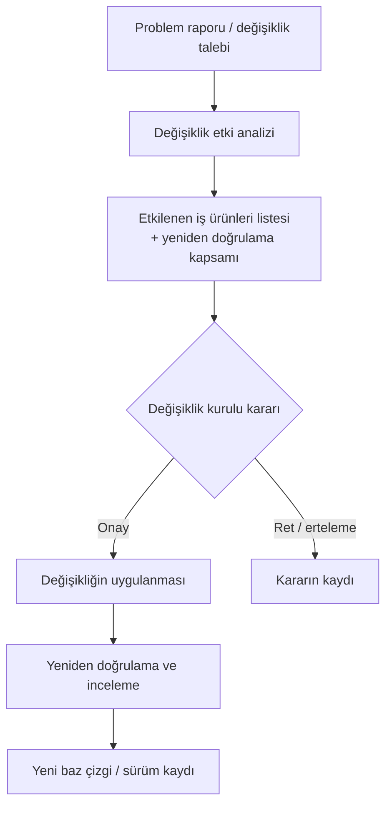

# 10. Yazılım Konfigürasyon Yönetimi

Konfigürasyon yönetimi (configuration management), hangi iş ürününün hangi sürümde
olduğunu ve neden değiştiğini izlenebilir kılar. Bu sayede gereksinim, kod, test ve dokümanlar arasında tutarlılık
korunur.

Değişiklik kontrolü, yalnızca dosya versiyonlarını değil, sertifikasyon kanıtının
tamamını korur. Bu yüzden baz çizgiler ve sürüm kayıtları önemlidir.

## Konfigürasyon yönetimi neden gerekli?

Aviyonik projelerde birçok belge birbirine bağlıdır. Bir gereksinim değiştiğinde bunun
tasarıma, koda, testlere, inceleme kayıtlarına ve bazen sertifikasyon sunumuna yansıması
gerekir. Bu zinciri yönetmenin tek yolu düzenli konfigürasyon kontrolüdür.

## Baz çizgiler

Baz çizgi (baseline), belirli bir anda "onaylı" kabul edilen iş ürünleri kümesidir. Bu kavram,
değişikliklerin rastgele yayılmasını engeller. Bir sürümün ne içerdiği açıkça bilinmeden
doğrulama sonuçları da anlamını kaybeder.

## Değişiklik kontrolü

İyi bir değişiklik kontrolü şu soruları cevaplar:

- Değişiklik neden gerekli?
- Hangi iş ürünleri etkileniyor?
- Kim onaylıyor?
- Hangi testler yeniden çalışmalı?
- Hangi sürüm etiketi kullanılacak?

Bu soruların cevabı yoksa değişiklik teknik olarak yapılmış olsa bile yönetimsel olarak
tamamlanmış sayılmaz.

## Konfigürasyon yönetimi faaliyetleri

Konfigürasyon yönetimi tek bir işlem değil, projenin başından
sonuna kadar süren bir faaliyetler bütünüdür. Bu faaliyetler yazılım konfigürasyon
yönetimi planında tanımlanır ve projenin her aşamasında fiilen uygulanır. Pratikte en çok
karşılaşılan faaliyetler şunlardır:

- **Konfigürasyon tanımlama (configuration identification):** Kontrol altına alınacak her
  iş ürününe — gereksinim dokümanı, tasarım verisi, kaynak kod dosyası, test prosedürü,
  derleme betiği — benzersiz bir kimlik ve sürüm numarası verilir. Bir öğe adlandırılıp
  tanımlanmadan onun "hangi sürümü" diye konuşmak mümkün değildir.
- **Baz çizgi oluşturma:** Belirli olgunluk noktalarında (örneğin gereksinim
  incelemesi tamamlandığında, ilk resmi test sürümü hazırlandığında) onaylı iş ürünleri
  kümesi dondurulur. Baz çizgiden sonraki her değişiklik, değişiklik kontrolü sürecinden
  geçmek zorundadır.
- **Problem raporlama (problem reporting):** Baz çizgideki bir iş ürününde tespit edilen
  her uygunsuzluk — kod hatası, doküman tutarsızlığı, test başarısızlığı — bir problem
  raporu ile kayıt altına alınır. Rapor; belirtiyi, etkilenen öğeyi ve sürümü, kararı ve
  kapanış kanıtını içerir.
- **Değişiklik kontrolü ve değişiklik incelemesi:** Önerilen değişiklikler yetkili bir
  kurul (genellikle değişiklik kontrol kurulu, change control board) tarafından
  değerlendirilir; onaylanan değişikliklerin doğru sürüme, eksiksiz ve yan etkisiz
  uygulandığı incelenir.
- **Konfigürasyon durum muhasebesi (configuration status accounting):** Hangi öğenin
  hangi sürümde olduğu, hangi problem raporlarının açık/kapalı olduğu ve hangi
  değişikliklerin hangi baz çizgiye girdiği her an raporlanabilir durumda tutulur.
- **Arşivleme, geri alma ve sürüm teslimi (archive, retrieval, release):** Onaylı sürümler
  bozulmaya karşı korunan bir ortamda saklanır; yıllar sonra bile aynı içerik geri
  alınabilmelidir. Sürüm teslimi, çalıştırılabilir nesne kodunun ve ilgili verilerin
  yetkili biçimde dağıtılmasını kapsar.
- **Yükleme kontrolü (load control):** Doğru çalıştırılabilir nesne kodunun doğru hedef
  donanıma yüklendiği, parça numarası ve bütünlük kontrolü (örneğin sağlama toplamı,
  checksum / CRC) ile güvence altına alınır.
- **Yaşam döngüsü ortamının kontrolü:** Derleyici, bağlayıcı, test araçları ve işletim
  ortamının sürümleri de kayıt altındadır; aksi hâlde aynı kaynak koddan aynı nesne kodun
  yeniden üretilebilmesi garanti edilemez.

DO-178C bu faaliyetlerin tümünü her veri öğesine aynı sıkılıkta uygulamaz. İki kontrol
kategorisi (control category) tanımlanır: birinci kategori (CC1) tam kontrol demektir;
problem raporlama, değişiklik kurulu onayı ve korumalı arşivleme gibi tüm faaliyetler
uygulanır. İkinci kategori (CC2) ise daha hafif bir rejimdir; öğenin tanımlanması,
değişikliğinin izlenmesi ve arşivlenmesi yeterlidir. Hangi verinin hangi kategoriye
gireceği yazılım seviyesine göre değişir:

| Özellik | CC1 | CC2 |
|---|---|---|
| Konfigürasyon tanımlama | Var | Var |
| Baz çizgi ve izlenebilirlik | Var | Gerekmez |
| Problem raporlama | Var | Gerekmez |
| Değişiklik kurulu onayı | Var | Gerekmez (değişiklik yine izlenir) |
| Korumalı arşiv ve geri alma | Var | Arşivleme yeterli |

Örneğin kaynak kod ve gereksinim verileri tipik olarak CC1 altındadır; bazı inceleme
kayıtları ise seviyeye bağlı olarak CC2 ile yönetilebilir. Bu ayrım, kaynakların en
kritik verilere odaklanmasını sağlar.

## Konfigürasyon yönetimi iş ürünleri

Konfigürasyon yönetimi faaliyetlerinin çıktısı, sertifikasyon dosyasının önemli bir
parçasını oluşturan somut iş ürünleridir. Denetimlerde en sık masaya gelen ürünler
şunlardır:

- **Yazılım konfigürasyon indeksi (Software Configuration Index, SCI):** Teslim edilen
  yazılım sürümünün "malzeme listesi"dir. Çalıştırılabilir nesne kodunu, onu üreten
  kaynak kod sürümlerini, ilgili yaşam döngüsü verilerini, açık problem raporlarını,
  yükleme ve yeniden üretim (build) talimatlarını tanımlar. Bir SCI okunduğunda o sürümün
  tam olarak nelerden oluştuğu ve nasıl yeniden üretileceği anlaşılabilmelidir.
- **Yazılım yaşam döngüsü ortam konfigürasyon indeksi (Software Life Cycle Environment
  Configuration Index, SECI):** Yazılımı üretmek ve doğrulamak için kullanılan ortamı
  tanımlar: derleyici ve bağlayıcı sürümleri, derleme seçenekleri, test araçları,
  kalifiye edilmiş araçlar ve donanım ortamı. SECI olmadan "aynı kodu beş yıl sonra
  yeniden derleyin" talebi karşılanamaz. SECI ayrı bir doküman olabileceği gibi SCI'nin
  bir bölümü olarak da verilebilir.
- **Problem raporları:** Her raporun tekil bir numarası, açık bir problem tanımı,
  etkilenen öğe ve sürüm bilgisi, sınıflandırması (örneğin kod hatası, doküman hatası,
  iyileştirme talebi), çözüm kararı ve kapanış kanıtı bulunur. Sürüm tesliminde açık
  kalan raporlar SCI'de listelenir ve emniyet üzerindeki etkileri gerekçelendirilir.
- **Konfigürasyon yönetimi kayıtları:** Baz çizgi kayıtları, değişiklik kurulu karar
  tutanakları, sürüm teslim kayıtları, arşiv doğrulama kayıtları gibi faaliyetlerin
  gerçekten yapıldığını gösteren kanıtlardır.

Aşağıdaki tablo, bu ürünlerin cevapladığı temel soruları özetler:

| İş ürünü | Cevapladığı soru |
|---|---|
| SCI | Bu sürümde tam olarak ne var, nasıl yeniden üretilir? |
| SECI | Bu sürüm hangi araçlarla ve hangi ortamda üretildi? |
| Problem raporları | Bilinen sorunlar neler, hangileri açık? |
| Konfigürasyon yönetimi kayıtları | Süreç gerçekten işletildi mi? |

Deneyimin gösterdiği önemli bir nokta: SCI ve SECI, teslim gününe bırakılırsa eksik ve
hatalı çıkar. En sağlıklı yaklaşım, bu indeksleri mümkün olduğunca derleme ve sürüm
altyapısından otomatik üretmek, elle tutulan kısmı en aza indirmektir.

## Değişiklik etki analizi

Değişiklik etki analizi (change impact analysis), bir değişikliğin dokunduğu her şeyi
değişiklik uygulanmadan **önce** sistematik biçimde ortaya çıkarma disiplinidir. Sık
yapılan hata, analizi "hangi dosyalar değişecek" sorusuna indirgemektir; oysa asıl soru
"hangi kanıtlar geçerliliğini yitirecek" sorusudur.

İyi bir etki analizi en azından şu eksenleri tarar:

- **Gereksinim ekseni:** Değişiklik hangi yüksek ve düşük seviyeli gereksinimleri
  etkiliyor? İzlenebilirlik (traceability) kayıtları bu taramanın ana aracıdır.
- **Tasarım ve mimari ekseni:** Yazılım mimarisi, arayüzler, zamanlama bütçeleri veya
  bellek kullanımı etkileniyor mu? Yazılım bölümlemesi varsa bölümler arası izolasyon
  varsayımları bozuluyor mu?
- **Kod ekseni:** Değişen fonksiyonlar, bunları çağıran ve bunlardan etkilenen kod
  bölgeleri, paylaşılan veri yapıları ve derleme seçenekleri.
- **Doğrulama ekseni:** Hangi testler yeniden koşulmalı? Yalnızca değişen gereksinimin
  testleri mi, yoksa regresyon kapsamı daha mı geniş? Yapısal kapsam analizi sonuçları
  hâlâ geçerli mi?
- **Sertifikasyon ekseni:** SCI, SECI, uyum matrisi ve otoriteye sunulan veriler
  güncellenecek mi? Değişiklik, daha önce verilen bir sapma (deviation) gerekçesini
  etkiliyor mu?

Tipik akış şu şekildedir:

Analizin çıktısı, değişiklik kurulunun karar verebileceği somut bir listedir: etkilenen
iş ürünleri, güncellenecek dokümanlar, yeniden koşulacak testler ve tahmini iş yükü.
Sertifikalı bir yazılımda sonradan yapılan değişikliklerde bu analiz ayrıca otorite ile
paylaşılan resmi bir veri hâline gelir; değişikliğin "küçük" mü "büyük" mü sayılacağı ve
yeniden doğrulama kapsamı bu analize dayanarak savunulur.

Pratik bir uyarı: etki analizi izlenebilirlik verisinin kalitesi kadar iyidir. Gereksinim,
kod ve test arasındaki izler eksik veya güncel değilse analiz kâğıt üzerinde tamam
görünse bile gerçek etkiyi kaçırır. Bu yüzden izlenebilirlik kayıtlarını güncel tutmak,
etki analizinin görünmez ön koşuludur.

## Sık düşülen tuzaklar

Konfigürasyon yönetimi hataları genellikle kötü niyetten değil, "sonra düzeltiriz"
yaklaşımından doğar. Sahada en sık karşılaşılan tuzaklar şunlardır:

- **Konfigürasyon kontrolünü geç kurmak.** Ekip, "önce prototipi bitirelim, kontrolü
  resmî faza girince başlatırız" der. Sonuç: hangi gereksinim sürümüne göre kod yazıldığı
  belirsizleşir ve geriye dönük baz çizgi kurmak, baştan kurmaktan çok daha pahalıya
  gelir. Kontrol, ilk incelemeden geçen iş ürünüyle birlikte başlamalıdır.
- **Kontrolsüz geliştirme ve doğrulama ortamları.** Derleyici sürümü geliştiricinin
  makinesine göre değişiyorsa aynı kaynak koddan farklı nesne kodlar üretiliyor demektir.
  Test bilgisayarındaki araç güncellemesi kayıt altına alınmamışsa geçmiş test sonuçları
  savunulamaz hâle gelir. Ortam da bir konfigürasyon öğesidir; SECI bu yüzden vardır.
- **Eksik veya gayriresmî problem kaydı.** "Küçük hataları e-postayla hallettik" cümlesi
  denetimde ciddi bir bulguya dönüşür. Problem raporu açılmayan hata, etki analizi
  yapılmamış, kararı kaydedilmemiş hata demektir. Küçük görünen bir sorunun başka bir
  bölgedeki etkisi ancak kayıt ve analizle görülür.
- **Değişikliği koda uygulayıp kanıtı güncellememek.** Kod değişir, testler koşulur ama
  tasarım verisi ve izlenebilirlik kayıtları eski hâlinde kalır. Doküman ile kod arasında
  açılan makas, ilerleyen aşamalarda büyük bir uyumsuzluk yığınına dönüşür.
- **Baz çizgiyi "her şey bitince" almak.** Tek ve dev bir baz çizgi, ara aşamalardaki
  doğrulama sonuçlarını hangi içeriğe bağlayacağınızı belirsizleştirir. Ara baz çizgiler
  (gereksinim, tasarım, test hazırlık) küçük ama düzenli adımlarla alınmalıdır.
- **Sürüm aracına aşırı güvenmek.** Modern sürüm kontrol araçları çok şeyi otomatik
  yapar; ancak araç, değişiklik kurulu kararını, etki analizini veya CC1/CC2 ayrımını
  kendiliğinden üretmez. Araç bir altyapıdır, süreç değildir.
- **Açık problem raporlarını teslimde görünmez kılmak.** Sürüm tesliminde açık raporları
  listelemeyip "nasılsa kapatacağız" demek, hem otorite nezdinde güveni zedeler hem de
  bilinen bir sorunun uçuşa etkisinin değerlendirilmeden kalmasına yol açar.

Bu tuzakların ortak ilacı aynıdır: konfigürasyon yönetimini bürokratik bir yük olarak
değil, doğrulama kanıtının geçerliliğini koruyan mühendislik altyapısı olarak görmek ve
projenin ilk gününden itibaren işletmek.

## Konfigürasyon yönetimi örneği

Bir gereksinim değiştiğinde aynı değişikliğin:

- tasarım dokümanına,
- test prosedürüne,
- sürüm etiketine

yansıması gerekir.

## Sürüm izlenebilirliği

Sürüm izlenebilirliği, hangi iş ürününün hangi anda hangi içerikle onaylandığını gösterir.
Bu bilgi, denetim ve geriye dönük sorun çözme açısından kritik önemdedir.

## Bu bölümden akılda kalması gerekenler

- Konfigürasyon yönetimi, kanıtın bütünlüğünü korur.
- Baz çizgi olmadan değişiklik kontrolü zayıflar.
- CC1/CC2 ayrımı, kontrol sıkılığını verinin kritikliğine göre ölçeklendirir.
- SCI sürümün içeriğini, SECI sürümü üreten ortamı tanımlar; ikisi olmadan sürüm
  yeniden üretilemez.
- Değişiklik etki analizi "hangi dosyalar değişecek" değil, "hangi kanıtlar geçersiz
  kalacak" sorusunu cevaplar ve izlenebilirlik verisinin kalitesine dayanır.
- Konfigürasyon kontrolü projenin ilk gününde başlar; geç kurulan kontrolün ve
  kontrolsüz ortamların bedeli sonradan katlanarak ödenir.
- Sürüm izlenebilirliği sertifikasyonun temel unsurudur.
