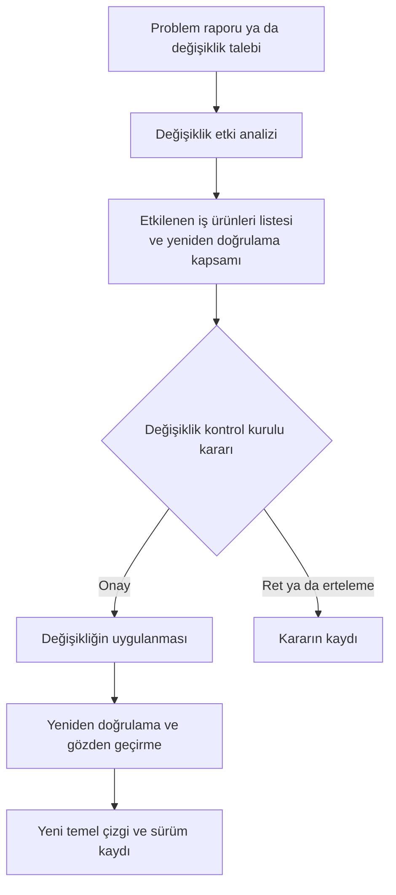

# 10. Yazılım Konfigürasyon Yönetimi

Yazılım konfigürasyon yönetimi (software configuration management), hangi iş ürününün
hangi sürümde olduğunu, neden değiştiğini ve teslim edilen yazılımın tam olarak nelerden
oluştuğunu her an gösterebilmeyi sağlar. Bu bölüm konfigürasyon yönetiminin hedeflerini
ve faaliyetlerini, temel çizgileri, kontrol kategorilerini, ürettiği iş ürünlerini ve
değişiklik etki analizini işlenmiş bir örnekle birlikte anlatır.

## Konfigürasyon yönetimi neden gerekli?

Aviyonik projelerde yazılım yaşam döngüsü verisi (software life cycle data) — kitapta
kısaca iş ürünü — birbirine bağlıdır. Bir gereksinim değiştiğinde bunun tasarıma, koda,
testlere, gözden geçirme (review) kayıtlarına ve bazen sertifikasyon otoritesine
(certification authority) sunulan veriye yansıması gerekir. Doğrulama kanıtı da belirli
bir içeriğe aittir: bir test sonucu, koşulduğu derlemenin ve sınadığı gereksinim
sürümünün kimliği bilinmiyorsa hiçbir şey kanıtlamaz. Konfigürasyon yönetiminin koruduğu
şey bu yüzden dosya sürümleri değil, sertifikasyon kanıtının geçerliliğidir.

DO-178C'de konfigürasyon yönetimi; doğrulama, kalite güvencesi (quality assurance) ve
sertifikasyon irtibatıyla birlikte bütünleyici süreçlerden (integral processes) biridir.
Geliştirmenin ardından gelen bir adım değildir; planlamadan itibaren diğer süreçlere
eşlik eder ve yazılım onaylandığında da bitmez, sistem ya da ekipman serviste kaldığı
sürece sürer (bkz.
[4. DO-178C ve Destekleyici Dokümanlara Genel Bakış](04-do178c-genel-bakis.md)).

## Hedefler ve seviyeye göre beklenti

DO-178C'nin konfigürasyon yönetimi hedefleri (objective), standardın Ek A'sındaki
Tablo A-8'de altı satırda toplanır: konfigürasyon öğelerinin tanımlanması; temel
çizgilerin ve izlenebilirliğin kurulması; problem raporlama, değişiklik kontrolü,
değişiklik gözden geçirmesi ve durum muhasebesinin işletilmesi; arşivleme, geri getirme
ve sürüm tesliminin sağlanması; yazılım yükleme kontrolü; yaşam döngüsü ortamının
kontrolü. Standardın gövde metni aynı kapsamı dokuz hedef olarak sayar; tablo bunlardan
dördünü (problem raporlama, değişiklik kontrolü, değişiklik gözden geçirmesi, durum
muhasebesi) tek satırda birleştirir.

Altı hedefin tamamı Seviye A'dan Seviye D'ye kadar geçerlidir ve hiçbirinde bağımsızlık
aranmaz. Yazılım seviyesi (software level) düştükçe hafifleyen şey hedeflerin kendisi
değil, hangi verinin hangi sıkılıkta kontrol edildiğidir; bunu aşağıda anlatılan kontrol
kategorileri belirler. "Seviye D yazılımda konfigürasyon yönetimi gerekmez" düşüncesi bu
yüzden yanlıştır.

Hedeflerin projede nasıl karşılanacağı yazılım konfigürasyon yönetimi planında (Software
Configuration Management Plan, SCMP) yazılır: adlandırma ve sürümleme kuralları, temel
çizgiler, problem raporu akışı, kurulun yetkisi, arşiv düzeni ve tedarikçi verisinin
kontrolü oradadır (bkz. [5. Yazılım Planlama](05-yazilim-planlama.md)). Faaliyetlerin
fiilen yapıldığını konfigürasyon yönetimi kayıtları gösterir; sürecin plana uygun
yürüdüğünü ise kalite güvencesi denetler.

## Konfigürasyon yönetimi faaliyetleri

Konfigürasyon yönetimi tek bir işlem değil, projenin başından sonuna kadar süren bir
faaliyetler bütünüdür. Pratikte en çok karşılaşılan faaliyetler şunlardır:

- **Konfigürasyon tanımlama (configuration identification):** Kontrol altına alınacak her
  iş ürününe — gereksinim dokümanı, tasarım verisi, kaynak kod dosyası, test prosedürü,
  derleme betiği — benzersiz bir kimlik ve sürüm numarası verilir. Bu kimliği taşıyan
  her birime konfigürasyon öğesi (configuration item) denir. Çalıştırılabilir nesne
  kodundan ayrı yüklenen parametre verisi öğesi (parameter data item, PDI) dosyaları da
  kendi kimliği ve sürümü olan konfigürasyon öğeleridir (bkz.
  [22. Konfigürasyon Verisi](../05-ozel-konular/22-konfigurasyon-verisi.md)). Bir öğe
  adlandırılıp tanımlanmadan onun "hangi sürümü" diye konuşmak mümkün değildir.
- **Temel çizgi oluşturma:** Belirli olgunluk noktalarında (örneğin gereksinim gözden
  geçirmesi tamamlandığında, ilk resmî test sürümü hazırlandığında) onaylı iş ürünleri
  kümesi dondurulur. Temel çizgiden sonraki her değişiklik, değişiklik kontrolünden
  geçmek zorundadır.
- **Problem raporlama (problem reporting):** Temel çizgiye alınmış bir iş ürünündeki
  kusur, plan ve standartlardan süreç sapması ve yazılımın anormal davranışı bir problem
  raporu (problem report) ile kayıt altına alınır. Rapor; belirtiyi, etkilenen öğeyi ve
  sürümü, kararı ve kapanış kanıtını içerir.
- **Değişiklik kontrolü ve değişiklik gözden geçirmesi (change control, change review):**
  Değişiklik kontrolü, kontrol altındaki öğeleri ve temel çizgileri izinsiz değişikliğe
  karşı korur; her değişikliğin öğenin kimliğine yansımasını, kaydedilmesini,
  onaylanmasını ve izlenmesini sağlar. Değişiklik kaynağına kadar izlenir ve yaşam
  döngüsü süreçleri, değişikliğin çıktılarını etkilediği noktadan başlayarak yinelenir;
  etkilenen verinin tamamı güncellenir. Değişiklik gözden geçirmesi bu kararın
  dayanağını üretir ve sonucunu izler: problemin ya da önerilen değişikliğin sistem
  gereksinimlerine ve yaşam döngüsü verisine etkisi değerlendirilir, sistem süreçlerine
  (sistem emniyet değerlendirmesi dahil) geri bildirim verilir, değişiklik onaylanır ya
  da reddedilir, onaylananın uygulandığı görülür ve karar etkilenen süreçlere iletilir.
  Çoğu projede bu değerlendirmeyi bir değişiklik kontrol kurulu (change control board)
  yapar; kurul standardın değil uygulamanın terimidir. İyi işleyen bir akış beş soruyu
  cevapsız bırakmaz: değişiklik neden gerekli, hangi iş ürünleri etkileniyor, kim
  onaylıyor, hangi doğrulama yeniden yapılacak ve değişiklik hangi sürüme girecek?
- **Konfigürasyon durum muhasebesi (configuration status accounting):** Hangi öğenin
  hangi sürümde olduğu, hangi problem raporlarının açık ya da kapalı olduğu ve hangi
  değişikliklerin hangi temel çizgiye girdiği her an raporlanabilir durumda tutulur.
- **Arşivleme, geri getirme ve sürüm teslimi (archive, retrieval, release):** Onaylı
  sürümler bozulmaya ve yetkisiz değişikliğe karşı korunan bir ortamda saklanır; yıllar
  sonra bile aynı içerik geri getirilebilmelidir. Saklama süresini projenin tercihi
  değil uçuşa elverişlilik (airworthiness) gerekleri belirler; pratikte veri, ürün
  serviste kaldığı sürece erişilebilir olmalıdır. Bu ufukta arşiv ortamı eskimeden
  yenilenir, kopyalar fiziksel olarak ayrı yerlerde tutulur ve geri getirme ara ara
  denenerek doğrulanır. Sürüm teslimi, bir öğenin kullanıma yetkili biçimde açılmasıdır:
  yazılım üretiminde yalnızca yayımlanmış öğeler kullanılır, yayımlama yetkisinin kimde
  olduğu bellidir ve en azından hedefe yüklenen çalıştırılabilir nesne kodu (executable
  object code) ile varsa PDI dosyaları bu yoldan geçer.
- **Yükleme kontrolü (load control):** Yazılımın ana kopyadan sisteme ya da ekipmana
  aktarılmasını kapsar. Yükleme fabrikada da sahada da yapılsa iki şey beklenir:
  yüklenmesi onaylanacak konfigürasyonları tanımlayan parça numaralama ve yükleme
  medyası kimliklendirme kuralları ile yazılımın donanımla uyumlu olduğunu gösteren
  kayıtlar.
  Uygulamada buna sağlama toplamı (checksum) ya da döngüsel artıklık denetimi (cyclic
  redundancy check, CRC) gibi bir bütünlük denetimi eşlik eder. Yükleme sahada
  yapılıyorsa konu genişler (bkz.
  [18. Sahada Yüklenebilir Yazılım](../05-ozel-konular/18-sahada-yuklenebilir-yazilim.md)).
- **Yaşam döngüsü ortamının kontrolü:** Derleyici, bağlayıcı, test araçları ve işletim
  ortamının sürümleri de kayıt altındadır; aksi hâlde çalıştırılabilir nesne kodunun
  arşivlenen kaynaktan tutarlı biçimde yeniden üretilebilmesi garanti edilemez.
  Yazılımı derleyen ve yükleyen araçların çalıştırılabilir sürümleri en az aşağıda
  anlatılan ikinci kontrol kategorisinin gerektirdiği kadar kontrol edilir. Kalifiye
  edilmiş araçların çalıştırılabilir sürümleri ve kalifikasyon verisi de kontrolün
  içindedir; onlarda sıkılığı araç kalifikasyonu belgesi DO-330 belirler (bkz.
  [13. DO-330 ve Yazılım Aracı Kalifikasyonu](../04-arac-kalifikasyonu-ve-ekler/13-do330-arac-kalifikasyonu.md)).

## Temel çizgiler

Temel çizgi (baseline), gözden geçirilip onaylanmış ve o andan sonra yalnızca değişiklik
kontrolüyle değiştirilebilen bir konfigürasyon öğeleri kümesidir. İşlevi, sonraki işe
sabit bir zemin vermektir: "tasarım hangi gereksinim sürümüne göre yapıldı", "bu test
hangi derlemeye karşı koşuldu" soruları ancak bir temel çizgi kimliğiyle cevaplanır.

DO-178C iki şeyi şart koşar: sertifikasyon kredisi alınacak konfigürasyon öğeleri temel
çizgiye alınır ve yazılım ürünü için, yazılım konfigürasyon indeksinde tanımlanan bir
ürün temel çizgisi kurulur. Ara temel çizgilerin sayısını ve adını ise belirlemez; bunlar
SCMP'de, yaşam döngüsünün geçiş kriterleriyle birlikte tanımlanır. Yaygın bir kurgu
şöyledir:

| Temel çizgi | Tipik içerik | Neyin zemini olur? |
|---|---|---|
| Planlama | Planlar ve standartlar | Geliştirme faaliyetlerinin başlaması |
| Gereksinim | Yüksek seviyeli gereksinimler ve iz verisi (trace data) | Tasarım, test durumlarının geliştirilmesi |
| Tasarım | Yazılım mimarisi ve düşük seviyeli gereksinimler | Kodlama |
| Kod ve derleme | Kaynak kod, derleme betikleri, çalıştırılabilir nesne kodu | Kredi alınacak test koşuları |
| Doğrulama | Test durumları ve test prosedürleri | Test koşuları ve kapsam analizi |
| Ürün | Yazılım konfigürasyon indeksinde tanımlanan sürümün tamamı | Otoriteye sunum, üretim ve yükleme |

Hangi kurgu seçilirse seçilsin üç kural değişmez:

- **Temel çizgi değiştirilmez.** Değişiklik, öğenin yeni bir sürümünü ve gerektiğinde
  yeni bir temel çizgiyi doğurur; eskisi olduğu gibi arşivde kalır. "Temel çizgiyi
  güncelledik" cümlesi, iz bırakmadan yapıldıysa bir denetim bulgusudur.
- **Yeni temel çizgi türetildiği temel çizgiye izlenebilir.** İki temel çizgi arasındaki
  farkın hangi problem raporları ve değişiklik talepleriyle oluştuğu kayıttan
  okunabilmelidir. Buradaki izlenebilirlik (traceability), gereksinim–kod–test
  izlenebilirliği değil, sürümler arasındaki soy bağıdır.
- **Ara temel çizgiler küçük ve sık alınır.** Her temel çizgi bir doğrulama faaliyetine
  zemin olacak kadar olgun, ama "her şey bitsin" diye bekletilmeyecek kadar erken
  kurulur.

Kontrolün ne zaman başladığı da buradan çıkar: konfigürasyon tanımlama ve sürüm kontrolü
projenin ilk gününden işler; resmî değişiklik kontrolü ve problem raporlama ise ilgili
iş ürününün ilk temel çizgisiyle başlar. Temel çizgi öncesindeki gözden geçirme bulguları
gözden geçirme kaydında izlenip kapatılır; sınırın tam yeri SCMP'de yazılıdır.

## Kontrol kategorileri: CC1 ve CC2

DO-178C yukarıdaki faaliyetlerin tümünü her veri öğesine aynı sıkılıkta uygulamaz. İki
kontrol kategorisi (control category) tanımlanır; ikincisinin faaliyetleri birincinin alt
kümesidir. Birinci kategori (CC1) tam kontroldür: temel çizgi, problem raporlama,
değişikliğin kaydı ve onayı, değişiklik gözden geçirmesi ve durum muhasebesi dahil tüm
faaliyetler uygulanır. İkinci kategori (CC2) daha hafif bir rejimdir: öğenin
tanımlanması, türetildiği öğeye izlenebilmesi, değişirken bütünlüğünün ve kimliğinin
korunması, yetkisiz değişikliğe karşı korunması, geri getirilebilmesi ve saklanması
yeterlidir. Standardın Tablo 7-1'i bu ayrımı faaliyet faaliyet verir ve her kategori
için asgariyi tanımlar; aşağıda aynı bilgi konuya göre gruplanmıştır:

| Konu | CC1 ve CC2'de ortak | Yalnızca CC1'de |
|---|---|---|
| Kimlik ve soy bağı | Konfigürasyon tanımlama; öğenin türetildiği öğeye ve ait olduğu çıktıya ya da sürece izlenebilmesi | Temel çizgi kurma, temel çizginin korunması ve temel çizgiler arası izlenebilirlik |
| Sorun ve değişiklik | Değişikliğe karşı bütünlüğün korunması; değişen öğenin kimliğinin de değişmesi | Problem raporlama; değişikliğin kaydı, onayı ve izlenmesi; değişiklik gözden geçirmesi |
| Durum bilgisi | — | Konfigürasyon durum muhasebesi |
| Arşiv ve teslim | Geri getirme; yetkisiz değişikliğe karşı koruma; veri saklama | Arşiv ortamının seçimi ve yenilenmesi, kopyaların ayrı yerde tutulması ve kopyalamanın doğrulanması; sürüm teslimi |

CC2 "kontrolsüz" demek değildir: bir test sonuç dosyasının hangi koşuya ait olduğu
bilinmeli, dosya yetkisiz biçimde değiştirilememeli ve yıllar sonra bulunabilmelidir.
Aranmayan şey, o dosyadaki bir düzeltme için problem raporu açıp kurul kararı
beklemektir.

Hangi verinin hangi kategoride yönetileceği yazılım seviyesine göre değişir. Yazılım
sertifikasyon planı (Plan for Software Aspects of Certification, PSAC), yazılım
konfigürasyon indeksi (Software Configuration Index, SCI) ve yazılım başarı özeti
(Software Accomplishment Summary, SAS) gibi otoriteye sunulan veriler uygulandıkları her
seviyede CC1'dir; geliştirme, doğrulama, konfigürasyon yönetimi ve kalite güvencesi
planları (sırasıyla SDP, SVP, SCMP, SQAP) ise seviyeye göre kategori değiştirir.
Standardın Ek A tablolarındaki dağılım şöyledir:

| Kontrol kategorisi | Veri |
|---|---|
| Uygulandığı her seviyede CC1 | PSAC, yazılım gereksinim verisi, kaynak kod, çalıştırılabilir nesne kodu, PDI dosyası, SCI, SAS |
| Seviye A, B ve C'de CC1; Seviye D'de CC2 | Tasarım tanımı (design description); yazılım yaşam döngüsü ortam konfigürasyon indeksi (Software Life Cycle Environment Configuration Index, SECI) |
| Seviye A ve B'de CC1; Seviye C ve D'de CC2 | SDP, SVP, SCMP, SQAP; doğrulama durumları ve prosedürleri |
| Seviye A ve B'de CC1; Seviye C'de CC2 | Gereksinim, tasarım ve kodlama standartları |
| Hangi sürecin çıktısı olduğuna göre | İz verisi: geliştirme süreçlerinin çıktısı olarak uygulandığı her seviyede CC1; test tarafında Seviye A ve B'de CC1, Seviye C ve D'de CC2 |
| Her seviyede CC2 | Doğrulama sonuçları, problem raporları, konfigürasyon yönetimi kayıtları, kalite güvencesi kayıtları |

Kaynak kod ile üç standart Seviye D'nin tablolarında çıktı olarak yer almaz; "uygulandığı
her seviye" ifadesi bu yüzden kullanılmıştır. Tablodaki kategoriler asgaridir: proje bir
veriyi standardın istediğinden daha sıkı kontrol etmeyi seçip bunu SCMP'ye yazabilir,
daha gevşek edemez. İlk bakışta şaşırtan bir ayrıntı: problem raporlama CC1 veriye
uygulanan bir faaliyettir, problem raporunun kendisi ise CC2 veridir — bir raporu
düzeltmek için ikinci bir rapor açılmaz.

## Konfigürasyon yönetimi iş ürünleri

Konfigürasyon yönetimi faaliyetlerinin çıktısı, sertifikasyon dosyasının önemli bir
parçasını oluşturan somut iş ürünleridir. Denetimlerde en sık masaya gelen ürünler
şunlardır:

- **Yazılım konfigürasyon indeksi (SCI):** Teslim edilen yazılım sürümünün "malzeme
  listesi"dir. Çalıştırılabilir nesne kodunu ve varsa PDI dosyalarını, bunları üreten
  kaynak kod sürümlerini, ilgili yaşam döngüsü verisini, arşiv ve teslim ortamını,
  derleme (build) ve yükleme talimatlarını ve çalıştırılabilir nesne kodunun bütünlük
  denetim değerlerini tanımlar. Bir SCI okunduğunda o sürümün tam olarak nelerden
  oluştuğu ve nasıl yeniden üretileceği anlaşılabilmelidir. SCI, PSAC ve SAS ile
  birlikte otoriteye asgari olarak sunulan üç veriden biridir; diğer veriler talep
  edildiğinde erişime açılır.
- **Yazılım yaşam döngüsü ortam konfigürasyon indeksi (SECI):** Yazılımı üretmek ve
  doğrulamak için kullanılan ortamı tanımlar: derleyici ve bağlayıcı sürümleri, derleme
  seçenekleri, test araçları, kalifiye edilmiş araçlar ve donanım ortamı. SECI olmadan
  "aynı kodu beş yıl sonra yeniden derleyin" talebi karşılanamaz. SECI ayrı bir doküman
  olabileceği gibi SCI'nin bir bölümü olarak da verilebilir.
- **Problem raporları:** Her raporun tekil bir numarası, açık bir problem tanımı,
  etkilenen öğe ve sürüm bilgisi, sınıflandırması, çözüm kararı ve kapanış kanıtı
  bulunur. DO-178C'nin rapordan beklediği çekirdek daha dardır: problemin görüldüğü ve
  düzeltilecek öğe ya da süreç, emniyet ve işlev etkisini değerlendirmeye yetecek
  ayrıntıda bir tanım ve yapılan düzeltici faaliyet; sınıflandırma ve kapanış kanıtı gibi
  alanları proje ekler. Raporun yaşam döngüsü ve sınıflandırma eksenleri
  [9. Yazılım Doğrulama](09-yazilim-dogrulama.md) bölümünde anlatılır; bu bölüm ayrı
  bir şema kurmaz. Sürüm tesliminde açık kalan raporlar FAA AC 20-189 ve EASA
  AMC 20-189'un beklediği sınıflarla (önemli, işlevsel, süreç, yaşam döngüsü verisi)
  sınıflandırılır; özetleri, işlevsel kısıtlar ve açık bırakma gerekçesi SAS'ta sunulur
  (bkz. [12. Sertifikasyon İrtibatı](12-sertifikasyon-irtibati.md)). Birçok kuruluş
  aynı listeyi SCI'ye ya da sürüm notuna da koyar; bu durumda listeler elle değil, aynı
  tarihte tek kaynaktan üretilmelidir.
- **Konfigürasyon yönetimi kayıtları:** Temel çizgi kayıtları, değişiklik kontrol kurulu
  karar tutanakları, sürüm teslim kayıtları, arşiv doğrulama kayıtları gibi faaliyetlerin
  gerçekten yapıldığını gösteren kanıtlardır.

Problem raporu ile kalite güvencesinin açtığı uygunsuzluk kaydı arasındaki sınır da
planlarda yazılı olmalıdır. Plan ve standartlardan süreç sapması problem raporlamanın
kapsamındadır; standart, süreç sorunlarıyla ürün sorunlarının ayrı sistemlerde
kaydedilmesine de izin verir. Projeler bunu iki biçimde düzenler. Bazıları süreç
uygunsuzluklarını da aynı problem raporlama sisteminde, türü ayrıca işaretlenmiş kayıtlar
olarak tutar. Bazıları uygunsuzlukları ayrı bir kalite güvencesi kaydı olarak izler ve
kendi takibiyle kapatır; bu durumda da uygunsuzluğun giderilmesi temel çizgideki bir
veriyi değiştirmeyi gerektiriyorsa o değişiklik problem raporu ve değişiklik kontrolü
üzerinden yürür. Hangisi seçilirse seçilsin SCMP ile SQAP aynı akışı anlatmalıdır (bkz.
[11. Yazılım Kalite Güvencesi](11-yazilim-kalite-guvencesi.md)).

Aşağıdaki tablo, bu ürünlerin cevapladığı temel soruları ve otoriteye nasıl ulaştıklarını
özetler:

| İş ürünü | Cevapladığı soru | Otoriteye sunum |
|---|---|---|
| SCI | Bu sürümde tam olarak ne var, nasıl yeniden üretilir? | Sunulur |
| SECI | Bu sürüm hangi araçlarla ve hangi ortamda üretildi? | SCI'nin parçasıysa onunla sunulur; ayrıysa talep üzerine gösterilir |
| Problem raporları | Bilinen sorunlar neler, hangileri açık? | Talep üzerine gösterilir; açık raporların özeti SAS'tadır |
| Konfigürasyon yönetimi kayıtları | Süreç gerçekten işletildi mi? | Talep üzerine, çoğunlukla denetimde gösterilir |

Deneyimin gösterdiği önemli bir nokta: SCI ve SECI, teslim gününe bırakılırsa eksik ve
hatalı çıkar. En sağlıklı yaklaşım, bu indeksleri mümkün olduğunca derleme ve sürüm
altyapısından otomatik üretmek, elle tutulan kısmı en aza indirmektir.

## Değişiklik etki analizi

Değişiklik etki analizi (change impact analysis), bir değişikliğin dokunduğu her şeyi
değişiklik uygulanmadan **önce** sistematik biçimde ortaya çıkarma disiplinidir. Sık
yapılan hata, analizi "hangi dosyalar değişecek" sorusuna indirgemektir; oysa asıl soru
"hangi kanıtlar geçerliliğini yitirecek" sorusudur.

DO-178C'de bu değerlendirme değişiklik gözden geçirmesinin işidir. İyi bir etki analizi
en azından şu eksenleri tarar:

- **Sistem ve emniyet ekseni:** Problem ya da değişiklik sistem gereksinimlerini
  etkiliyor mu? Etkiliyorsa sistem süreçlerine ve sistem emniyet değerlendirmesine
  bildirilmiş, gelen yanıt değerlendirilmiş mi?
- **Gereksinim ekseni:** Değişiklik hangi yüksek ve düşük seviyeli gereksinimleri
  etkiliyor? İz verisi bu taramanın ana aracıdır.
- **Tasarım ve mimari ekseni:** Yazılım mimarisi, arayüzler, zamanlama bütçeleri veya
  bellek kullanımı etkileniyor mu? Yazılım bölümlemesi varsa bölümler arası izolasyon
  varsayımları bozuluyor mu?
- **Kod ekseni:** Değişen fonksiyonlar, bunları çağıran ve bunlardan etkilenen kod
  bölgeleri, paylaşılan veri yapıları ve derleme seçenekleri.
- **Doğrulama ekseni:** Hangi testler yeniden koşulmalı? Yalnızca değişen gereksinimin
  testleri mi, yoksa regresyon kapsamı daha mı geniş? Yapısal kapsam analizi sonuçları
  hâlâ geçerli mi?
- **Sertifikasyon ekseni:** SCI, SECI, hedeflerle kanıtları eşleyen uyum matrisi
  (compliance matrix) ve otoriteye sunulan veriler güncellenecek mi? Değişiklik, daha
  önce verilen bir sapma (deviation) gerekçesini etkiliyor mu?

Tipik akış şu şekildedir:

```mermaid
flowchart TD
  PR["Problem raporu ya da değişiklik talebi"] --> CIA[Değişiklik etki analizi]
  CIA --> KAP["Etkilenen iş ürünleri listesi<br/>ve yeniden doğrulama kapsamı"]
  KAP --> CCB{Değişiklik kontrol kurulu kararı}
  CCB -- "Onay" --> UYG[Değişikliğin uygulanması]
  CCB -- "Ret ya da erteleme" --> KAYIT[Kararın kaydı]
  UYG --> DOG[Yeniden doğrulama ve gözden geçirme]
  DOG --> TC["Yeni temel çizgi ve sürüm kaydı"]
```

Analizin çıktısı, değişiklik kontrol kurulunun karar verebileceği somut bir listedir:
etkilenen iş ürünleri, güncellenecek dokümanlar, yeniden koşulacak testler ve tahmini iş
yükü. Sertifikalı bir yazılımda sonradan yapılan değişikliklerde bu analiz ayrıca otorite
ile paylaşılan resmî bir veri hâline gelir ve yeniden doğrulama kapsamı ona dayanarak
savunulur. Tip tasarımı değişikliğinin küçük (minor) ya da büyük (major) sayılması ise
bir DO-178C kararı değildir; ürün düzeyinde, sertifikasyon kuralları çerçevesinde verilir
ve yazılım değişiklik etki analizi bu karara girdi sağlar. Önceden geliştirilmiş
yazılımın değiştirilerek yeniden kullanılması
[24. Yazılım Yeniden Kullanımı](../05-ozel-konular/24-yazilim-yeniden-kullanimi.md)
bölümünde ele alınır.

Pratik bir uyarı: etki analizi iz verisinin kalitesi kadar iyidir. Gereksinim, kod ve
test arasındaki izler eksik veya güncel değilse analiz kâğıt üzerinde tamam görünse bile
gerçek etkiyi kaçırır. Gereksinim tarafındaki işleyiş
[6. Yazılım Gereksinimleri](06-yazilim-gereksinimleri.md) bölümünde anlatılır.

## Baştan sona bir örnek: tek bir gereksinim değişikliği

Kurgusal bir hava verisi bilgisayarını ele alalım. Yazılımın 2.1.0 sürümü temel çizgiye
alınmış ve testleri koşulmuştur. Sistem ekibi, pitot ısıtıcısı arızasının mürettebata
bildirilme süresini 2 saniyeden 1 saniyeye indiren bir sistem gereksinimi değişikliği
gönderir. Zincir şöyle işler:

1. **Kayıt.** Değişiklik talebi açılır; etkilenen temel çizgi (2.1.0) ve değişikliğin
   kaynağı (sistem gereksinimi değişikliği) yazılır.
2. **Etki analizi.** İz verisi sorgulanır: yüksek seviyeli gereksinim HLR-042, ona
   bağlı iki düşük seviyeli gereksinim, bir kaynak dosya, üç test durumu ve bir test
   prosedürü listelenir. Mimari ve arayüzler etkilenmez. Zamanlama bütçesi için gerekçe
   yazılır: izleme görevinin periyodu değişmemekte, yalnızca sayaç eşiği küçülmektedir.
   Geçersiz kalacak kanıt da listelenir: HLR-042'nin test sonuçları, değişen kaynak
   dosyanın gözden geçirme kaydı ve yapısal kapsam verisi.
3. **Karar.** Değişiklik kontrol kurulu talebi onaylar, hedef sürümü (2.2.0) ve yeniden
   doğrulama kapsamını karara bağlar: değişen gereksinimin testleri ile aynı görevdeki
   diğer izleme işlevlerinin regresyon testleri.
4. **Uygulama ve yeniden doğrulama.** Her öğe değiştirilir, gözden geçirilir ve yeni
   sürümüyle kaydedilir; testler 2.2.0 derlemesine karşı koşulur.
5. **Kapanış.** Etki analizindeki her kalemin kapandığı, yani onaylanan değişikliğin
   eksiksiz uygulandığı teyit edilir; yeni temel çizgi kurulur, talep kapanış
   kanıtlarıyla birlikte kapatılır.

Zincirin sonunda durum muhasebesi şu tabloyu verebilmelidir:

| Konfigürasyon öğesi | Önceki sürüm | Yeni sürüm | Açıklama |
|---|---|---|---|
| HLR-042 (yüksek seviyeli gereksinim) | B | C | Bildirim süresi 2 s yerine 1 s |
| LLR-118 (düşük seviyeli gereksinim) | D | E | Sayaç eşiği yeniden hesaplandı |
| LLR-119 (düşük seviyeli gereksinim) | B | B | Gözden geçirildi; değişiklik gerekmedi |
| `pitot_izleme.c` | 1.7 | 1.8 | Adlandırılmış sabit güncellendi |
| Test durumları TC-042-01…03 | C | D | Sınır değerler ve beklenen sonuçlar |
| Test prosedürü TP-07 | 2.3 | 2.4 | Yeni test durumlarına uyarlandı |
| İz verisi | 2.1.0 | 2.2.0 | Bağlar yeni sürümleri gösteriyor |
| Çalıştırılabilir nesne kodu | 2.1.0 | 2.2.0 | Yeniden derlendi; yeni bütünlük denetim değeri |
| SCI | 2.1.0 | 2.2.0 | Yukarıdaki sürümleri ve talebi listeliyor |
| SECI | 5 | 5 | Ortam değişmedi; yeni SCI aynı SECI'ye atıf yapıyor |

Tabloda iki satır özellikle öğreticidir. LLR-119 değişmemiştir ama etki analizinde yer
aldığı için gözden geçirildiği kayıtlıdır; "bakıldı ve değişmedi" ile "hiç bakılmadı"
arasındaki fark denetimde bu kayıtla gösterilir. SECI de değişmemiştir; değişmediğinin
bilinmesi, ortamın kontrol altında olmasının sonucudur. Bir denetçi 2.2.0 sürümünün
çalıştırılabilir nesne kodundan başlayıp SCI üzerinden kaynak dosyaya, oradan
gereksinime, test sonucuna ve değişiklik talebine kopmadan ulaşabiliyorsa konfigürasyon
yönetimi işini yapmıştır.

## Sık düşülen tuzaklar

Konfigürasyon yönetimi hataları genellikle kötü niyetten değil, "sonra düzeltiriz"
yaklaşımından doğar. Sahada en sık karşılaşılan tuzaklar şunlardır:

- **Konfigürasyon kontrolünü geç kurmak.** Ekip, "önce prototipi bitirelim, kontrolü
  resmî faza girince başlatırız" der. Sonuç: hangi gereksinim sürümüne göre kod yazıldığı
  belirsizleşir ve geriye dönük temel çizgi kurmak, baştan kurmaktan çok daha pahalıya
  gelir. Sürüm kontrolü ilk günden işlemeli, resmî değişiklik kontrolü ise gözden
  geçirilmiş ilk iş ürününün temel çizgisiyle devreye girmelidir.
- **Kontrolsüz geliştirme ve doğrulama ortamları.** Derleyici sürümü geliştiricinin
  makinesine göre değişiyorsa aynı kaynak koddan farklı nesne kodlar üretiliyor demektir.
  Test bilgisayarındaki araç güncellemesi kayıt altına alınmamışsa geçmiş test sonuçları
  savunulamaz hâle gelir. Ortam da bir konfigürasyon öğesidir; SECI bu yüzden vardır.
- **Eksik veya gayriresmî problem raporu.** "Küçük hataları e-postayla hallettik" cümlesi
  denetimde ciddi bir bulguya dönüşür. Problem raporu açılmayan hata, etki analizi
  yapılmamış, kararı kaydedilmemiş hata demektir. Küçük görünen bir sorunun başka bir
  bölgedeki etkisi ancak kayıt ve analizle görülür.
- **Değişikliği koda uygulayıp kanıtı güncellememek.** Kod değişir, testler koşulur ama
  tasarım verisi ve iz verisi eski hâlinde kalır. Doküman ile kod arasında açılan makas,
  ilerleyen aşamalarda büyük bir uyumsuzluk yığınına dönüşür.
- **Temel çizgiyi "her şey bitince" almak.** Tek ve dev bir temel çizgi, ara aşamalardaki
  doğrulama sonuçlarını hangi içeriğe bağlayacağınızı belirsizleştirir. Ara temel
  çizgiler (gereksinim, tasarım, test hazırlık) küçük ama düzenli adımlarla alınmalıdır.
- **Sürüm aracına aşırı güvenmek.** Modern sürüm kontrol araçları çok şeyi otomatik
  yapar; ancak araç, değişiklik kontrol kurulu kararını, etki analizini veya CC1/CC2
  ayrımını kendiliğinden üretmez. Araç bir altyapıdır, süreç değildir.
- **Açık problem raporlarını teslimde görünmez kılmak.** Sürüm tesliminde açık raporları
  SAS'ta listeleyip değerlendirmeden "nasılsa kapatacağız" demek, hem otorite nezdinde
  güveni zedeler hem de bilinen bir sorunun uçuşa etkisinin değerlendirilmeden kalmasına
  yol açar.

Bu tuzakların ortak ilacı aynıdır: konfigürasyon yönetimini bürokratik bir yük olarak
değil, doğrulama kanıtının geçerliliğini koruyan mühendislik altyapısı olarak görmek ve
projenin ilk gününden itibaren işletmek. Denetime hazırlanırken bu bölümdeki beklentilerin
kontrol listesi karşılıkları [SW SOI-2](../kaynaklar/soi-2.md) ve
[SW SOI-4](../kaynaklar/soi-4.md) sayfalarındadır.

## Bu bölümden akılda kalması gerekenler

- Konfigürasyon yönetimi dosya sürümlerini değil, doğrulama kanıtının geçerliliğini
  korur; hedef tablosundaki altı hedefi Seviye A'dan D'ye kadar geçerlidir ve
  bağımsızlık aranmaz.
- Kredi alınacak öğeler temel çizgiye alınır ve ürün temel çizgisi SCI'de tanımlanır.
  Temel çizgi değiştirilmez, yenisi türetilir; her temel çizgi öncekine izlenebilir.
- Konfigürasyon tanımlama ve sürüm kontrolü ilk günden işler; resmî değişiklik kontrolü
  ve problem raporlama ilk temel çizgiyle başlar.
- CC1 tam kontroldür; CC2'de temel çizgi, problem raporlama ve değişikliğin resmî onayı
  aranmaz ama tanımlama, bütünlük, koruma, geri getirme ve saklama yine beklenir. Hangi
  verinin hangi kategoride olduğunu seviyeye göre standardın Ek A tabloları belirler.
- SCI sürümün içeriğini, SECI sürümü üreten ortamı tanımlar; ikisi olmadan sürüm yeniden
  üretilemez. SCI, PSAC ve SAS ile birlikte otoriteye sunulur.
- Açık problem raporlarının değerlendirmesi SAS'ta yer alır; başka belgelerdeki listeler
  aynı kaynaktan üretilir.
- Değişiklik etki analizi "hangi dosyalar değişecek" değil, "hangi kanıtlar geçersiz
  kalacak" sorusunu cevaplar ve iz verisinin kalitesine dayanır.
