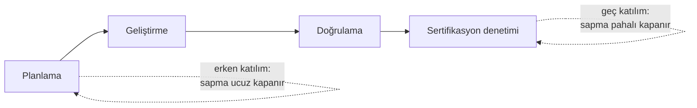

# 11. Yazılım Kalite Güvencesi

Kalite güvencesi (quality assurance, QA), sürecin tanımlı şekilde işletilip
işletilmediğini denetler. Burada
amaç ürün üretmekten çok, sürecin kanıta dayalı olarak uygun yürüdüğünü göstermektir.

Uygunsuzlukların kaydı, takibi ve kapatılması bu disiplinin merkezindedir. Böylece
küçük sapmaların zamanla büyük sertifikasyon sorunlarına dönüşmesi engellenir.

## QA neyi kontrol eder?

Kalite güvencesi, projenin "nasıl yürüdüğünü" kontrol eder. Yani planlara uyulup
uyulmadığını, kayıtların tam olup olmadığını ve düzeltici faaliyetlerin gerçekten
işlediğini takip eder.

Bu yüzden QA, test eden ekipten farklı bir soruya cevap verir:

- Test: yazılım doğru mu davranıyor?
- QA: süreç doğru mu işliyor?

## Uygunsuzluk yönetimi

Bir uygunsuzluk, planlanan ile gerçekleşen arasındaki farktır. Bu farkın görülmesi
başarısızlık değil, olgun süreç işaretidir. Önemli olan uygunsuzluğun kaydedilmesi,
izlenmesi ve uygun biçimde kapatılmasıdır.

İyi bir uygunsuzluk yönetimi:

- sorunu açık yazar,
- etkisini sınıflandırır,
- sorumlusunu belirler,
- kapanış kanıtı ister.

## Etkili ve etkisiz kalite güvencesi

Aynı standardı, aynı planları uygulayan iki projede kalite güvencesinin katkısı çok
farklı olabilir. Fark çoğu zaman ekibin büyüklüğünde değil; teknik yetkinliğinde,
bağımsızlığında ve projeye ne zaman dahil olduğundadır.

### Etkili kalite güvencesinin özellikleri

Etkili bir kalite güvencesi ekibini sahada üç özelliğiyle tanırsınız:

- **Teknik yetkinlik.** Denetlediği işi anlayacak kadar mühendislik bilgisine sahiptir.
  Bir gözden geçirme (review) kaydına baktığında yalnızca imzaların tam olup olmadığını
  değil, gözden geçirmenin gerçekten yapılıp yapılmadığını da sorgulayabilir. Yazılım
  ekibi, teknik konuşabildiği bir kalite güvencesi mühendisini ciddiye alır.
- **Bağımsızlık (independence).** Kalite güvencesi, denetlediği ekibin yöneticisine
  değil, ayrı bir raporlama hattına bağlıdır. Böylece takvim baskısı altında "bu
  seferlik göz yumalım" talebine hayır diyebilir. DO-178C'de kalite güvencesi
  bağımsızlığı her yazılım seviyesinde beklenir; bu, doğrulama bağımsızlığından ayrı
  ve ondan daha katı bir gerekliliktir.
- **Erken katılım.** Planlama aşamasından itibaren projededir. Planları, standartları
  ve geçiş kriterlerini (transition criteria) daha yazılırken gözden geçirir; ilk
  denetimini proje sonunda değil, ilk yaşam döngüsü verisi üretilirken yapar.

Erken katılımın etkisi en çok maliyet üzerinde görülür: planlama aşamasında yakalanan
bir süreç sapması birkaç saatlik düzeltmeyle kapanırken, aynı sapmanın sertifikasyon
denetiminde ortaya çıkması aylarca sürecek bir yeniden çalışma (rework) doğurabilir.

### Etkisiz kalite güvencesinin belirtileri

Etkisiz kalite güvencesi de kendini belli eden desenler üretir:

- **Salt evrak kontrolü.** Denetim, "belge var mı, imza var mı" sorusuna indirgenir.
  İçerik hiç sorgulanmadığı için süreç kâğıt üstünde kusursuz, sahada bozuk olabilir.
- **Geç katılım.** Kalite güvencesi projeye teslimat yaklaşırken dahil olur; artık
  sapmaları önleme değil, yalnızca belgeleme şansı vardır.
- **Yaptırım gücü eksikliği.** Uygunsuzluk kayıtları açılır ama kimse kapatmak zorunda
  hissetmez; kayıtlar aylarca açık kalır ve mekanizma inandırıcılığını yitirir.
- **Damgacılık (rubber-stamping).** Ekip, kalite güvencesini bir onay damgası gibi görür; kalite
  güvencesi de bu role razı olursa bağımsız gözetim fiilen ortadan kalkar.

İki profili yan yana koymak farkı netleştirir:

| Boyut | Etkili kalite güvencesi | Etkisiz kalite güvencesi |
|---|---|---|
| Odak | Sürecin içeriği ve kanıt kalitesi | Belge ve imza varlığı |
| Katılım zamanı | Planlama aşamasından itibaren | Teslimata yakın |
| Teknik derinlik | İşi anlar, teknik soru sorar | Kontrol listesini işaretler |
| Uygunsuzluk takibi | Kapanış kanıtı ister, eskalasyon yapar | Kayıt açar, takip etmez |
| Ekipteki algı | Erken uyarı mekanizması | Aşılması gereken engel |
| Denetimdeki sonuç | Bulgular önceden kapanmıştır | Bulgular denetimde ortaya çıkar |

Pratikte kalite güvencesinin etkisini ölçmenin en kestirme yollarından biri,
sertifikasyon otoritesinin katılım aşaması (Stage of Involvement, SOI) denetimlerinde
çıkan bulgu sayısına bakmaktır. Etkili bir kalite güvencesi, otoritenin bulacağı sorunları aylar önce kendi
uygunsuzluk kayıtlarıyla yakalamış ve kapatmış olur.

## Denetim ve gözlem

Kalite güvencesi, yalnızca masa başı belge kontrolü değildir. Gerekirse süreç denetimi,
gözlem ve kayıt incelemesi yapar. Hedef, ekibin gerçekten planladığı gibi çalıştığını
kanıtlamaktır.

## QA faaliyetleri örneği

- Uygunsuzluk kaydı açmak.
- Düzeltici aksiyonları izlemek.
- Süreç kayıtlarını denetlemek.

## Neden önemlidir?

Çünkü küçük bir kayıt eksikliği, sonradan büyük bir kanıt boşluğuna dönüşebilir. QA,
bu boşlukları erken görerek proje disiplini sağlar.

## Bu bölümden akılda kalması gerekenler

- QA, sürecin doğru işlendiğini kanıtlar.
- Uygunsuzluk kaydı ve kapanışı bu disiplinin merkezindedir.
- Etkili QA teknik yetkinlik, bağımsızlık ve erken katılımla tanınır; salt evrak
  kontrolü, geç katılım ve yaptırım gücü eksikliği etkisizliğin belirtileridir.
- QA, kanıt bütünlüğünü koruyan gözetim mekanizmasıdır.
