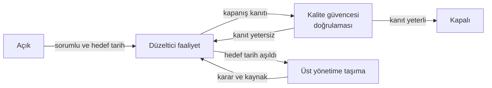

# 11. Yazılım Kalite Güvencesi

Kalite güvencesi (quality assurance, QA), DO-178C'de yazılım yaşam döngüsü süreçlerinin
ve çıktılarının onaylı planlara ve standartlara uygun olduğuna dair bağımsız güvence
sağlayan süreçtir. Bu bölüm kalite güvencesinin hedeflerini, bağımsızlığını, denetim
faaliyetlerini, uygunsuzluk yönetimini ve teslim öncesindeki yazılım uygunluk gözden
geçirmesini anlatır.

Kalite güvencesi yazılım üretmez, yazılımı doğrulamaz da. Ürettiği şey güvendir: planda
yazanın gerçekten yapıldığına, yapılanın kaydının durduğuna ve sapmaların görülüp
kapatıldığına dair güven. Sertifikasyon kanıta dayandığı için bu küçük bir iş değildir.
Bugün atlanan bir gözden geçirme (review) kaydı ya da temel çizgiye (baseline)
alınmadan koşulan bir test, aylar sonra kapatılması pahalı bir kanıt boşluğuna dönüşür.
Kalite güvencesi; doğrulama, konfigürasyon yönetimi (configuration management) ve
sertifikasyon irtibatıyla birlikte bütünleyici süreçlerden (integral processes) biridir:
proje sonunda atılan bir adım değil, planlamadan teslime kadar süren bir gözetimdir.

## Kalite güvencesi neyi güvence altına alır?

Kalite güvencesini doğrulamayla karıştırmak kolaydır, çünkü ikisi de "kontrol eden"
taraftadır. Ayrım, sordukları soruda ortaya çıkar:

| Süreç | Cevapladığı soru | Nasıl cevaplar |
|---|---|---|
| Doğrulama (verification) | Ürün gereksinimlerini karşılıyor mu, hata içeriyor mu? | Gereksinim, tasarım, kod ve testlerin teknik içeriğini gözden geçirme, analiz ve testle değerlendirir |
| Kalite güvencesi | Süreçler ve çıktıları onaylı plan ve standartlara uygun mu; sapmalar kaydedilip kapatılıyor mu? | Faaliyetleri ve kayıtlarını örnekleme yoluyla denetler, eksikleri izler |
| Sertifikasyon irtibatı ve sertifikasyon otoritesi (certification authority) | Sunulan uyum kanıtı yeterli ve inandırıcı mı? | Planları, özet verileri ve denetim bulgularını değerlendirir |

Bir kod gözden geçirmesi üzerinden düşünelim. Kodun düşük seviyeli gereksinimi doğru
gerçekleyip gerçeklemediğine karar vermek doğrulamanın işidir. Kalite güvencesi aynı
kararı ikinci kez vermez; gözden geçirmenin planda tarif edildiği gibi yapılıp
yapılmadığına bakar: doğru sürüm üzerinde mi yapıldı, kontrol listesi kullanıldı mı,
bağımsızlık gereken yerde sağlandı mı, bulgular kapanmadan kayıt kapatıldı mı?

Bu, kalite güvencesinin yalnızca sürece baktığı anlamına gelmez. Değerlendirme
süreçlerin çıktılarını da kapsar: bir tasarım verisinin tasarım standardına uyup
uymadığı, bir test sonucunun kayıtlı ortamda üretilip üretilmediği, teslim edilecek
sürümün verisinin eksiksiz olup olmadığı kalite güvencesinin sorularıdır. Fark,
ürünün teknik doğruluğunu yeniden kanıtlamaya çalışmaması; onaylı plan ve standartlara
uygunluğu ve kanıtın bütünlüğünü sorgulamasıdır.

## Kalite güvencesinin hedefleri ve seviyeye göre beklenti

DO-178C'nin hedef tablolarından biri kalite güvencesi sürecine ayrılmıştır (Tablo A-9)
ve beş hedef (objective) içerir. Bu hedeflerin ortak kalıbı önemlidir: kalite
güvencesinden işi bizzat yapması değil, işin yapıldığına dair güvence elde etmesi
beklenir.

| Kalite güvencesi hedefi | A | B | C | D |
|---|---|---|---|---|
| Planlar ve standartlar geliştirilmiş; DO-178C ile uyumu ve kendi aralarındaki tutarlılığı gözden geçirilmiştir | Evet | Evet | Evet | — |
| Yazılım yaşam döngüsü süreçleri onaylı planlara uygun yürümektedir | Evet | Evet | Evet | Evet |
| Yazılım yaşam döngüsü süreçleri onaylı standartlara uygun yürümektedir | Evet | Evet | Evet | — |
| Süreçler arası geçiş kriterleri (transition criteria) sağlanmıştır | Evet | Evet | Evet | — |
| Yazılım uygunluk gözden geçirmesi (software conformity review) yapılmıştır | Evet | Evet | Evet | Evet |

Standardın gövde metni kalite güvencesi için dört hedef sayar; tablo, plan ve
standartlara uygunluğu iki ayrı satıra böldüğü için beş hedef içerir. Ayrımın nedeni
seviyedir: planlara uygunluk Seviye D'de de aranır, standartlara uygunluk aranmaz.

Tablodan üç sonuç çıkar. Birincisi, uygulandığı her yerde bu hedefler bağımsızlıkla
karşılanır; Seviye C'deki beş, Seviye D'deki iki bağımsızlıklı hedefin tamamı kalite
güvencesi hedefleridir. İkincisi, yazılım seviyesi düştükçe kalite güvencesi ortadan
kalkmaz, daralır: Seviye D'de planlara uygunluk ve uygunluk gözden geçirmesi kalır.
Otoritenin teyit ettiği Seviye E'de DO-178C rehberliği uygulanmadığı için kalite
güvencesi hedefi de yoktur.
Üçüncüsü, ilk hedef kalite güvencesini planlama aşamasına bağlar: planların ve
standartların gözden geçirildiğine dair güvence, ilk satır kod yazılmadan önce elde
edilir. Bu hedef DO-178B'nin hedef tablosunda yer almıyordu; tabloya DO-178C ile girdi.

## Bağımsızlık ve yetki

DO-178C'de bağımsızlık (independence) iki ayrı anlamda kullanılır ve ikisi sık
karıştırılır. Doğrulamada bağımsızlık, bir iş ürününü doğrulayanın onu geliştiren kişi
olmamasıdır; ayrıntısı [9. Yazılım Doğrulama](09-yazilim-dogrulama.md) bölümündedir.
Kalite güvencesinde bağımsızlık buna bir öğe daha ekler: düzeltici faaliyetin
(corrective action) yapılmasını sağlama yetkisi. Bulgu yazabilen ama o bulguyu
kapattıramayan bir kalite güvencesi, tanım gereği bağımsız sayılmaz.

| | Doğrulama bağımsızlığı | Kalite güvencesi bağımsızlığı |
|---|---|---|
| Anlamı | Ürünü doğrulayan, onu geliştiren kişi değildir; insan faaliyetine denk güvence veren bir araç da kullanılabilir | Geliştirme faaliyetlerinden ayrı durmanın yanında düzeltici faaliyeti sağlatacak yetkiye sahip olmak |
| Nerede aranır | Hedef tablolarında bağımsızlıkla işaretli doğrulama hedeflerinde; fiilen Seviye A ve B'de | Seviyeye uygulanan bütün kalite güvencesi hedeflerinde; Seviye A'dan D'ye |
| Nasıl sağlanır | Aynı ekipten başka bir mühendis yeterlidir; ayrı organizasyon birimi şart değildir | Yaygın yol, proje yönetiminden ayrı bir raporlama hattıdır |
| Tipik zaafı | Yazarın kendi işini gözden geçirmesi | Takvimden sorumlu yöneticiye bağlı olmak; bulguyu kapattıracak yetkinin bulunmaması |

Ayrı raporlama hattı, yetkiyi sağlamanın alışılmış yoludur; standardın dayattığı bir
organizasyon şeması değildir. Aranan sonuçtur: kalite güvencesi, takvim baskısı altında
"bu seferlik göz yumalım" talebine hayır diyebilmeli ve çözülmeyen bir bulguyu proje
yöneticisinin üstüne taşıyabilmelidir. Küçük kuruluşlarda kalite güvencesi tam zamanlı
ayrı bir ekip olmayabilir; o zaman da kişinin kendi ürettiği işi denetlememesi ve
yetkisinin yazılı olması gerekir. Yetkinin kimde olduğu, kime raporlandığı ve
anlaşmazlığın nasıl çözüleceği yazılım kalite güvencesi planında tanımlanır.

## Kalite güvencesi planı ve kayıtları

Yazılım kalite güvencesi planı (Software Quality Assurance Plan, SQAP), bu sürecin
sözleşmesidir. Beş plan içindeki yeri
[5. Yazılım Planlama](05-yazilim-planlama.md) bölümünde anlatılır; burada içeriğine
kalite güvencesinin gözünden bakıyoruz. İyi bir SQAP şu soruları cevaplar:

- **Kim, hangi yetkiyle?** Kalite güvencesinin sorumluluğu, bağımsızlığı, raporlama
  hattı ve onay yetkisi.
- **Ne yapılacak, nasıl?** Her yaşam döngüsü süreci için kullanılacak yöntemler:
  denetim, gözden geçirmelere katılım, tanıklık, izleme ve raporlama.
- **Ne zaman?** Faaliyetlerin yaşam döngüsündeki yeri: hangi temel çizgiden önce,
  hangi geçişte, hangi sıklıkta.
- **Sapma bulunursa ne olur?** Uygunsuzluğun kaydı, sınıflandırılması, izlenmesi,
  kapanış ölçütü ve üst yönetime taşıma yolu; problem raporlama (problem reporting)
  akışıyla ilişkisi.
- **Teslimden önce ne yapılır?** Yazılım uygunluk gözden geçirmesinin yöntemi.
- **Tedarikçiler nasıl gözetilir?** Alt yüklenicilerin süreç ve çıktılarının
  uygunluğunun nasıl güvence altına alınacağı.
- **Hangi kayıtlar tutulur?** Üretilecek kalite güvencesi kayıtlarının tanımı.

Otoritenin planlama denetiminde, yani ilk katılım aşaması (Stage of Involvement, SOI)
denetiminde SQAP'ta baktığı noktalar [SW SOI-1](../kaynaklar/soi-1.md) kontrol
listesindedir. Tipik zayıflık ölçülemeyen taahhüttür: "süreçler düzenli olarak
denetlenir" cümlesinin ne zaman yerine getirildiği anlaşılamaz.

Kalite güvencesinin kendi çıktısı **kalite güvencesi kayıtlarıdır**. Standart bunlara
bir biçim dayatmaz, ama iki şeyin kayıtlarda bulunmasını açıkça bekler: denetim
sonuçları ve sertifikasyona sunulan her sürüm için uygunluk gözden geçirmesinin
tamamlandığının kanıtı. Onaylanmış süreç sapmalarının kayıtları, gözden geçirme
raporları ve toplantı tutanakları da çoğunlukla buradadır. Bu kayıtlar da yazılım yaşam
döngüsü verisidir (software life cycle data) ve ikinci kontrol kategorisiyle (control
category 2, CC2) yönetilir; kontrol kategorileri
[10. Yazılım Konfigürasyon Yönetimi](10-yazilim-konfigurasyon-yonetimi.md) bölümünde
açıklanır. İşe yarar bir denetim kaydı en azından şunları söyler: neyin, hangi temel
çizgi üzerinde, hangi ölçüte göre denetlendiği; hangi kayıtların örnek olarak seçildiği;
ne bulunduğu ve hangi uygunsuzlukların açıldığı. "Denetim yapıldı, sorun yok" yazan bir
kayıt, yapılan işi başkasının yeniden izlemesine imkân vermez.

## Denetim ve gözlem

Kalite güvencesi masa başında belge saymakla yürümez; işin yapıldığı yere gider. Temel
aracı denetimdir (audit), ama tek aracı değildir:

| Faaliyet | Neye bakar | Örnek soru |
|---|---|---|
| Süreç denetimi | Bir sürecin planda tarif edildiği gibi işletildiğine | "Plan her değişiklik için etki analizi istiyor; son beş değişikliğin analizini görebilir miyim?" |
| Veri denetimi | Bir çıktının standarda uyduğuna ve kontrol kategorisine göre yönetildiğine | "Bu tasarım verisi tasarım standardının zorunlu tuttuğu kısımları içeriyor mu, hangi temel çizgide?" |
| Gözden geçirmelere katılım | Gözden geçirmenin tanımlı yöntemle ve doğru sürüm üzerinde yapıldığına | "Kontrol listesi kullanıldı mı; bulgular kapanmadan kayıt kapatılmış mı?" |
| Tanıklık (witnessing) | Kredi amaçlı test koşusunun, derlemenin ya da yüklemenin prosedüre göre ve kayıtlı ortamda yapıldığına | "Test edilen imajın (image) kimliği temel çizgideki imajla aynı mı?" |
| Tedarikçi denetimi | Tedarikçinin süreç ve çıktılarının onaylı plan ve standartlara uyduğuna | "Tedarikçideki gözden geçirme kayıtları bizim planımızın istediği içeriği taşıyor mu?" |

Kalite güvencesinin güvence altına alacağı, projeden projeye değişmeyen konuları
DO-178C de sayar. Bir kısmı planlarla ilgilidir: planlar ekibin elindedir ve geliştirme
ortamı planlarda tanımlandığı gibi kurulmuştur. Bir kısmı sapmalarla ilgilidir: plan ve
standartlardan sapmalar fark edilir, kaydedilir, değerlendirilir ve çözülene kadar
izlenir; onaylanan sapmalar da kayıtlıdır. Geri kalanı süreçler arasındaki bağlardır: problem raporlama ve
düzeltici faaliyet akışı yazılım konfigürasyon yönetimi planına (Software Configuration
Management Plan, SCMP) göre işler, sistem süreçlerinden ve sistem emniyet
değerlendirmesinden gelen girdiler ele alınmıştır ve veri kontrol kategorisine uygun
yönetilir.

### Örnekleme ve ölçekleme

Kalite güvencesi her kaydı okuyamaz, okuması da beklenmez; örnekleme (sampling) yapar.
Örneklemin nasıl seçildiği denetimin değerini belirler. Rastgele beş kayıt yerine riske
göre seçim daha çok şey gösterir: ekibe yeni katılan birinin işi, yeni devreye alınan
bir araç ya da süreç, son anda değişen öğeler, daha önce uygunsuzluk çıkmış alanlar ve
emniyet açısından en kritik işlevler. Seçilen örneklem denetim kaydına yazılır; örneklem
bir sorun gösterdiğinde kapsam genişletilir, çünkü üç kayıttan birinde görülen eksik
çoğu zaman tek bir kişinin dalgınlığı değil, sürecin bir açığıdır.

Denetim sıklığı ve örneklem büyüklüğü SQAP'ta tanımlanır ve projeye göre ölçeklenir:
yazılım seviyesi, ekibin büyüklüğü ve deneyimi, tedarikçi sayısı ve önceki denetimlerin
sonuçları belirleyicidir. Seviye D'de iki hedefle sınırlı bir kalite güvencesi ile
Seviye A'da yaşam döngüsünün her sürecine yayılan bir kalite güvencesi aynı yoğunlukta
olmaz.

### Geçiş kriterlerinin denetimi

Planlar, bir süreçten diğerine hangi koşulda geçileceğini geçiş kriterleriyle tanımlar.
Kalite güvencesinin ayrı bir hedefi, bu kriterlerin yalnızca yazılmış değil, proje
boyunca sağlanmış olduğuna dair güvence elde etmektir. Uygulamada bu, kriter listesini
kayıtlarla karşılaştırmak demektir: "gereksinimler gözden geçirilmiş, açık büyük bulgu
yok, temel çizgiye alınmış" diyen bir kriter için gözden geçirme kaydına, bulgu
listesine ve temel çizgi kaydına bakılır.

Kriter sağlanmadan sonraki faaliyete başlanmışsa bu bir uygunsuzluktur. Aynı kriter
tekrar tekrar aşılıyorsa sorun ekipte değil kriterde olabilir; o zaman doğru çözüm
kriteri sessizce yok saymak değil, planı değişiklik kontrolünden geçirerek
güncellemektir. Artımlı çalışan projelerde denetim de artım ya da işlev bazında
yapılır. Her geçişin mi yoksa geçişlerden alınan bir örneklemin mi denetleneceğini
SQAP belirler. Süreçler arası geçişler için örnek kriterler ve kanıtları
[Ek A: Örnek Geçiş Kriterleri](../06-ekler/01-ek-a-ornek-gecis-kriterleri.md)
sayfasındadır.

### Tedarikçi gözetimi

Yazılım yaşam döngüsü faaliyetlerinin bir kısmı dışarıda yürüyorsa kalite güvencesinin
alanı da oraya uzanır. DO-178C, tedarikçilerin süreç ve çıktılarının onaylı plan ve
standartlara uyduğuna dair güvence elde etmeyi kalite güvencesinin faaliyetleri
arasında sayar; sertifikasyon sorumluluğu işi devredenden ayrılmaz. Tedarikçinin kendi
kalite güvencesi bulunsa bile ana yüklenici onun kayıtlarını örnekleyerek denetler ve
bu gözetimin kayıtlarını tutar. Denetim hakkının sözleşmeye nasıl yazılacağı ve
gözetimin nasıl kurulacağı
[26. Yazılım Yaşam Döngüsü Faaliyetlerinde Dış Kaynak Kullanımı](../05-ozel-konular/26-dis-kaynak-kullanimi.md)
bölümünde ele alınır.

### Yaşam döngüsü boyunca kalite güvencesi

Faaliyetler yaşam döngüsüne şöyle yayılır:

| Aşama | Kalite güvencesinin yaptığı | Bıraktığı kayıt |
|---|---|---|
| Planlama | SQAP'ın hazırlanması; planların ve standartların uyum ve tutarlılık açısından gözden geçirildiğine dair güvence | Plan gözden geçirmesi kayıtları, denetim raporu |
| Gereksinim, tasarım, kodlama, entegrasyon | Süreç ve veri denetimleri, gözden geçirmelere katılım, geçiş kriterlerinin denetimi | Denetim raporları, uygunsuzluk kayıtları |
| Doğrulama | Kredi amaçlı test koşularına tanıklık; test ortamının ve problem raporu akışının denetimi | Tanıklık kayıtları, denetim raporları |
| Teslim öncesi | Yazılım uygunluk gözden geçirmesi; açık uygunsuzlukların kapanışı | Uygunluk gözden geçirmesi kaydı |
| Bütün aşamalar | Uygunsuzlukların izlenmesi, tedarikçi gözetimi, durumun yönetime raporlanması | Uygunsuzluk durum raporları |

## Uygunsuzluk yönetimi

Uygunsuzluk (nonconformance), onaylı bir plana ya da standarda aykırı yürütülen bir
faaliyet ya da bir süreç çıktısında bu belgelere göre görülen eksikliktir. DO-178C aynı
durumu plan ve standartlardan sapma (deviation) olarak anar; kalite güvencesinden
beklenen, sapmaların fark edilip kayda geçtiğine, etkisinin değerlendirildiğine ve
çözülene kadar izlendiğine dair güvence elde etmesidir. Uygunsuzluğun görülmesi
başarısızlık değil, işleyen bir sürecin işaretidir; asıl sorun görülmeyen ya da görülüp
kayda geçmeyen sapmadır.

İyi bir uygunsuzluk kaydı dört şeyi açık yazar: neyin gözlendiği ve hangi plan ya da
standart maddesine aykırı olduğu; etkisinin ne olduğu ve nereye kadar uzandığı;
sorumlusu ve hedef tarihi; kapanış için hangi kanıtın isteneceği. Etki sorusu en çok
atlanandır. Bir süreç sapması çoğu zaman bir kanıtı da geçersiz kılar: temel çizgiye
alınmamış kod üzerinde koşulan test yalnızca bir süreç hatası değildir, o testin
sonucundan kredi alınamayacağı anlamına da gelir.

Düzeltici faaliyet de iki katmanlıdır. İlk katman görülen örneği düzeltir; ikinci
katman kök nedeni (root cause) giderir ki aynı sapma başka bir kayıtta yeniden ortaya
çıkmasın. Kalite güvencesi, kaydı ancak kapanış kanıtını gördükten sonra kapatır.
Hedef tarihi aşan ya da üzerinde anlaşılamayan kayıt üst yönetime taşınır; bağımsızlık
tanımındaki yetki tam burada işe yarar.

```mermaid
flowchart LR
    A["Açık"] -- "sorumlu ve hedef tarih" --> B["Düzeltici faaliyet"]
    B -- "kapanış kanıtı" --> C["Kalite güvencesi<br/>doğrulaması"]
    C -- "kanıt yeterli" --> D["Kapalı"]
    C -- "kanıt yetersiz" --> B
    B -- "hedef tarih aşıldı" --> E["Üst yönetime taşıma"]
    E -- "karar ve kaynak" --> B
```

### Uygunsuzluk ile problem raporu

DO-178C'de problem raporu yalnızca yazılım hatasının kaydı değildir. Problem raporlama
üç tür sorunu kapsar: yazılımın anormal davranışı, yaşam döngüsü verisindeki kusur ve
plan ya da standartlara süreç uyumsuzluğu. Kalite güvencesinin bulduğu uygunsuzluk
üçüncü türe girer; kayıt hangi sistemde tutulursa tutulsun, problem raporlamanın süreç
tarafıdır.

| | Ürün ya da veri kusuru | Süreç uygunsuzluğu |
|---|---|---|
| Örnek | Test başarısız olur; tasarım ile gereksinim çelişir | Test, temel çizgiye alınmamış kod üzerinde koşulmuştur; gözden geçirme kontrol listesi kullanılmamıştır |
| Çoğunlukla kim bulur | Doğrulama, entegrasyon, saha | Kalite güvencesi denetimi; ekipten herkes de bildirebilir |
| Düzeltme neyi değiştirir | Verinin kendisini, değişiklik kontrolünden geçerek | Çalışma biçimini; gerekirse etkilenen faaliyet tekrarlanır |
| Kapanışı kim doğrular | Doğrulama: düzeltme yeniden doğrulanır | Kalite güvencesi: kapanış kanıtı ve tekrarın önlendiği görülür |

Projeler bunu iki biçimde düzenler. Bazıları tek bir problem raporlama sistemi kullanır
ve kaydın türünü bir alanla ayırır. Bazıları kalite güvencesi uygunsuzluklarını ayrı
bir kayıt listesinde, kalite güvencesi kaydı olarak tutar; sapma kontrol altındaki bir
veride değişiklik gerektirdiğinde kayda bağlı bir problem raporu açılır. Hangisi
seçilirse seçilsin sınırı SCMP ile SQAP birlikte ve aynı biçimde tarif etmelidir; iki
planın iki ayrı akış anlatması, denetimde bulguya dönüşmeye adaydır. Problem
raporlamanın konfigürasyon yönetimindeki yeri 10. bölümde, problem raporlarının
sınıflandırılması ve teslimde açık kalan raporların ele alınışı 9. bölümde anlatılır.

### Örnek bir uygunsuzluk kaydı

Aşağıdaki kayıt kurgusaldır; bir denetimin tek bir bulgusunun açılıştan kapanışa nasıl
işlendiğini gösterir.

| Alan | İçerik |
|---|---|
| Kaynak | Kod gözden geçirme sürecinin denetimi; son temel çizgiye giren dosyalardan 12 gözden geçirme kaydı örneklenmiştir |
| Gözlem | 3 kayıtta gözden geçirilen dosya sürümü, temel çizgiye alınan sürümden eskidir; dosyalar gözden geçirmeden sonra değişmiş, yeniden gözden geçirilmemiştir |
| Dayanak | Yazılım doğrulama planı: gözden geçirme kaydı gözden geçirilen sürümü tanımlar; onaydan sonra yapılan değişiklik yeniden gözden geçirilir |
| Etki | Üç dosyada kod gözden geçirmesi kanıtı temel çizgideki kodu kapsamıyor; aynı dönemde birleştirilen diğer dosyalar da şüphelidir |
| Sınıf | Büyük: kredi alınan doğrulama kanıtını etkiliyor |
| Sorumlu ve hedef | Yazılım geliştirme lideri; bir sonraki temel çizgiden önce |
| Düzeltici faaliyet | Üç dosya güncel sürüm üzerinde yeniden gözden geçirilir; aynı dönemde birleştirilen bütün dosyalar için kayıttaki sürüm ile temel çizgideki sürüm karşılaştırılır; kök neden olarak depo, onaydan sonraki değişiklikte onayı düşürecek biçimde ayarlanır |
| Kapanış kanıtı | Yeniden gözden geçirme kayıtları, sürüm karşılaştırma listesi, depo ayarının kaydı; bir sonraki denetimde yeni örneklemde tekrar görülmemesi |

Kayıtta dikkat edilecek üç nokta var: gözlem ölçülebilir biçimde yazılmıştır ("bazı
kayıtlar eksik" değil, "12 kayıttan 3'ü"); dayanak bir plan maddesidir, denetçinin
kanaati değil; düzeltici faaliyet yalnız üç dosyayı düzeltmekle kalmaz, sapmanın
yayılımını ve kök nedenini de ele alır. Sınıflandırma ölçeği SQAP'ta tanımlanır;
buradaki "büyük" yalnızca bir örnektir.

## Yazılım uygunluk gözden geçirmesi

Yazılım uygunluk gözden geçirmesi, sertifikasyon başvurusunun parçası olarak sunulacak
bir yazılım sürümü için teslimden önce yapılan kapanış denetimidir. Üç şey hakkında
güvence arar: yaşam döngüsü süreçleri o sürüm için tamamlanmıştır; yaşam döngüsü verisi
eksiksizdir; çalıştırılabilir nesne kodu (executable object code) ve varsa parametre
verisi öğesi (parameter data item, PDI) dosyaları kontrol altındadır ve yeniden
üretilebilir. Kalite güvencesinin ayrı bir hedefidir ve Seviye A'dan D'ye bütün
seviyelerde beklenir.

Uygunluk gözden geçirmesi yeni bir doğrulama turu değildir; var olan kayıtların teslim
edilecek sürümle örtüştüğünü sınar. Aşağıdaki tablo, standardın bu gözden geçirmeden
beklediği tespitleri yukarıdaki üç güvenceye göre gruplar:

| Güvence | Sorulan soru | Tipik kanıt |
|---|---|---|
| Süreçler tamam | Planlarda kredi alınacağı söylenen her faaliyet yapılmış ve kaydı saklanmış mı? | Plandaki faaliyet listesinin gözden geçirme, analiz ve test kayıtlarıyla karşılaştırması |
| Süreçler tamam | Her problem raporu değerlendirilmiş, durumu kayıtlı mı; önceki bir uygunluk gözden geçirmesinden ertelenenler yeniden ele alınmış mı? | Problem raporu listesi, açık raporların gerekçeleri |
| Veri eksiksiz | Veri plan ve standartlara göre üretilmiş, SCMP'ye göre kontrol altına alınmış mı? | Yazılım konfigürasyon indeksindeki (Software Configuration Index, SCI) sürümlerin arşivdekilerle karşılaştırması |
| Veri eksiksiz | Veri, kaynaklandığı sistem gereksinimlerine, emniyetle ilgili gereksinimlere ve yazılım gereksinimlerine izlenebiliyor mu? | İz verisi (trace data); örneklemle iki yönde izleme |
| Veri eksiksiz | Yazılım gereksinimlerinden sapmalar kayıtlı ve onaylı mı? | Sapma kayıtları ve onayları |
| Kod kontrollü ve yeniden üretilebilir | Çalıştırılabilir nesne kodu ve varsa PDI dosyaları arşivlenmiş kaynak koddan yeniden üretilebiliyor mu? | Kayıtlı ortamda yeniden derleme ve karşılaştırma kaydı |
| Kod kontrollü ve yeniden üretilebilir | Onaylı yazılım, yayımlanmış yükleme talimatıyla yüklenebiliyor mu? | Yükleme denemesinin kaydı, kimlik denetimi |

Önceden geliştirilmiş yazılım (previously developed software) için kredi alınıyorsa bir
soru daha eklenir: güncel ürün temel çizgisi, önceki temel çizgiye ve ona yapılan onaylı
değişikliklere izlenebiliyor mu? Plan ve standartlardan sapmalar ise bu listenin değil,
yaşam döngüsü boyunca yapılan denetimlerin konusudur. Sertifikasyondan sonraki
değişikliklerde standart, gözden geçirmenin değişikliğin önemiyle gerekçelendirilen bir
alt kümesinin yapılmasına izin verir.

Zamanlama bu gözden geçirmenin en hassas yanıdır. Gözden geçirme, sertifikasyona esas
son temel çizgi üzerinde yapılır; ondan sonra veri ya da kod değişirse en azından
etkilenen kalemler için tekrarlanır. Takvim sıkıştığında gözden geçirmeyi öne çekip
ardından "küçük bir düzeltme" yapmak, son denetimin tipik bulgularından birini üretir:
kayıt, sunulan sürümü anlatmıyordur. Sürprizleri azaltmanın yolu, son temel çizgiden
önce bir prova yapmaktır: yeniden derlemenin aynı çıktıyı vermemesi ya da yükleme
talimatındaki eksik adım gibi sorunlar düzeltmeye zaman varken ortaya çıkar.

Çıktı, bulgularıyla birlikte bir kalite güvencesi kaydıdır; bulgular uygunsuzluk olarak
izlenir ve teslimden önce kapatılır ya da gerekçesiyle kayda geçer. Uygunluk gözden
geçirmesi başvuru sahibinin (applicant) kendi iç denetimidir; otoritenin son
denetiminin yerine geçmez, ona girdi olur. Otoritenin bu kayıtta ve çevresindeki
veride nelere baktığı [SW SOI-4](../kaynaklar/soi-4.md) kontrol listesindedir.

## Etkili ve etkisiz kalite güvencesi

Aynı standardı, aynı planları uygulayan iki projede kalite güvencesinin katkısı çok
farklı olabilir. Fark çoğu zaman ekibin büyüklüğünde değil; teknik yetkinliğinde,
bağımsızlığında ve projeye ne zaman dahil olduğundadır.

### Etkili kalite güvencesinin özellikleri

Etkili bir kalite güvencesi ekibini sahada üç özelliğiyle tanırsınız:

- **Teknik yetkinlik.** Denetlediği işi anlayacak kadar mühendislik bilgisine sahiptir.
  Bir gözden geçirme kaydına baktığında yalnızca imzaların tam olup olmadığını değil,
  gözden geçirmenin gerçekten yapılıp yapılmadığını da sorgulayabilir. Yazılım ekibi,
  teknik konuşabildiği bir kalite güvencesi mühendisini ciddiye alır.
- **Bağımsızlık.** Kalite güvencesi, denetlediği ekibin takviminden sorumlu yöneticiye
  bağlı değildir ve bulgusunu kapattıracak yetkiyi taşır. Bu yetki kâğıt üzerinde
  kalmamalıdır: açık bir uygunsuzlukla temel çizgi alınamadığını bir kez gören ekip,
  mekanizmanın gerçek olduğunu anlar.
- **Erken katılım.** Planlama aşamasından itibaren projededir. Planları, standartları
  ve geçiş kriterlerini daha yazılırken gözden geçirir; ilk denetimini proje sonunda
  değil, ilk yaşam döngüsü verisi üretilirken yapar.

Erken katılımın etkisi en çok maliyet üzerinde görülür: planlama aşamasında yakalanan
bir süreç sapması birkaç saatlik düzeltmeyle kapanırken, aynı sapmanın sertifikasyon
denetiminde ortaya çıkması aylarca sürecek bir yeniden çalışma (rework) doğurabilir.
Çünkü geç yakalanan sapma yalnızca düzeltilmez; o sapmanın gölgesinde üretilmiş bütün
kanıtın yeniden üretilmesi gerekir.

### Etkisiz kalite güvencesinin belirtileri

Etkisiz kalite güvencesi de kendini belli eden desenler üretir:

- **Salt evrak kontrolü.** Denetim, "belge var mı, imza var mı" sorusuna indirgenir.
  İçerik hiç sorgulanmadığı için süreç kâğıt üstünde kusursuz, sahada bozuk olabilir.
- **Geç katılım.** Kalite güvencesi projeye teslimat yaklaşırken dahil olur; artık
  sapmaları önleme değil, yalnızca belgeleme şansı vardır.
- **Yaptırım gücü eksikliği.** Uygunsuzluk kayıtları açılır ama kimse kapatmak zorunda
  hissetmez; kayıtlar aylarca açık kalır ve mekanizma inandırıcılığını yitirir.
- **Damgacılık (rubber-stamping).** Ekip, kalite güvencesini bir onay damgası gibi
  görür; kalite güvencesi de bu role razı olursa bağımsız gözetim fiilen ortadan kalkar.

İki profili yan yana koymak farkı netleştirir:

| Boyut | Etkili kalite güvencesi | Etkisiz kalite güvencesi |
|---|---|---|
| Odak | Sürecin içeriği ve kanıt kalitesi | Belge ve imza varlığı |
| Katılım zamanı | Planlama aşamasından itibaren | Teslimata yakın |
| Teknik derinlik | İşi anlar, teknik soru sorar | Kontrol listesini işaretler |
| Uygunsuzluk takibi | Kapanış kanıtı ister, gerektiğinde üst yönetime taşır | Kayıt açar, takip etmez |
| Ekipteki algı | Erken uyarı mekanizması | Aşılması gereken engel |
| Denetimdeki sonuç | Bulgular önceden kapanmıştır | Bulgular denetimde ortaya çıkar |

Pratikte kalite güvencesinin etkisini ölçmenin en kestirme yollarından biri,
sertifikasyon otoritesinin SOI denetimlerinde çıkan bulgu sayısına bakmaktır. Etkili
bir kalite güvencesi, otoritenin bulacağı sorunları aylar önce kendi uygunsuzluk
kayıtlarıyla yakalamış ve kapatmış olur. Bu denetimlerin işleyişi
[12. Sertifikasyon İrtibatı](12-sertifikasyon-irtibati.md) bölümünde anlatılır.

## Bu bölümden akılda kalması gerekenler

- Kalite güvencesi, süreçlerin ve çıktılarının onaylı plan ve standartlara uygun
  olduğuna dair güvence sağlar; ürünün teknik doğruluğunu yeniden kanıtlamak
  doğrulamanın işidir.
- DO-178C'nin hedef tablosunda kalite güvencesi için beş hedef vardır; hepsi
  bağımsızlıkla karşılanır. Seviye A, B ve C'de beşi de, Seviye D'de planlara uygunluk
  ve uygunluk gözden geçirmesi geçerlidir.
- Kalite güvencesinde bağımsızlık, geliştirmeden ayrı durmanın yanında düzeltici
  faaliyeti sağlatma yetkisini de içerir; ayrı raporlama hattı bunun alışılmış yoludur.
- Denetim örneklemeyle yapılır: süreç ve veri denetimi, gözden geçirmelere katılım,
  tanıklık, geçiş kriterlerinin denetimi ve tedarikçi gözetimi SQAP'ta planlanır,
  sonuçları kalite güvencesi kayıtlarına geçer.
- Uygunsuzluk, plan ya da standarda aykırılıktır; problem raporlamanın süreç tarafıdır.
  Kaydı, etkisinin değerlendirilmesi, kök nedenin giderilmesi ve kanıtla kapatılması
  bu disiplinin merkezindedir.
- Yazılım uygunluk gözden geçirmesi teslimden önceki son kapıdır: süreçlerin
  tamamlandığını, verinin eksiksiz olduğunu ve nesne kodun yeniden üretilip
  yüklenebildiğini son temel çizgi üzerinde gösterir.
- Etkili kalite güvencesi teknik yetkinlik, bağımsızlık ve erken katılımla tanınır;
  salt evrak kontrolü, geç katılım ve yaptırım gücü eksikliği etkisizliğin
  belirtileridir.
