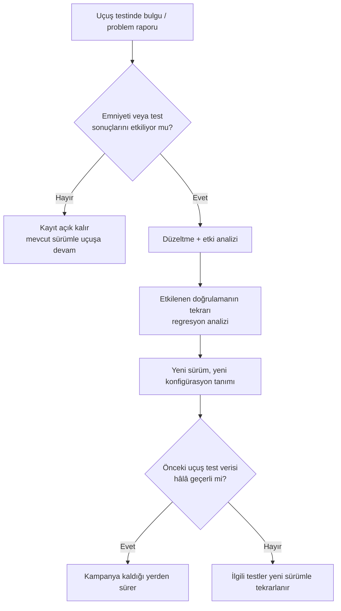

# 12. Sertifikasyon İrtibatı

Sertifikasyon irtibatı, proje ekibinin otoriteye hangi kanıtı, ne zaman ve hangi
gerekçeyle sunduğunu düzenler. Bu süreçte açıklık, tutarlılık ve izlenebilirlik
önemlidir.

İyi yönetilen bir irtibat, yanlış anlaşılmaları azaltır ve ek sorulara hızlı yanıt
verilmesini sağlar. Böylece teknik çalışma ile sertifikasyon beklentileri aynı çizgide
tutulur.

## İrtibatın amacı

Sertifikasyon irtibatı, otoriteyle "haberleşme"den daha fazlasıdır. Proje ekibinin
hangi kanıtı hangi bağlamda sunduğunu, hangi hedefi karşıladığını ve hangi riskleri
nasıl yönettiğini açıkça ifade etmesidir.

Bu disiplin, proje içinde zaten bilinen bilgilerin otoriteye net ve tutarlı biçimde
aktarılmasını sağlar.

## Ne tür içerik sunulur?

Sertifikasyon irtibatında tipik içerik şunlardır:

- Hangi iş ürünü sunuldu?
- Hangi hedef karşılandı?
- Hangi açık noktalar kaldı?

Bu soruların yanıtı net değilse, otoritenin ek açıklama istemesi normaldir. İyi
hazırlanmış irtibat, tekrar işini azaltır.

## İyi irtibatın özellikleri

İyi bir sertifikasyon iletişimi:

- kısa ama eksiksizdir,
- teknik olarak doğrudur,
- gereksiz savunmacı değildir,
- kanıtla desteklenir,
- açık soruları önceden tahmin eder.

## Yazılım Başarı Özeti

Yazılım başarı özeti (Software Accomplishment Summary, SAS), yazılım yaşam
döngüsünün sonunda otoriteye sunulan kapanış belgesidir. En kısa tanımıyla SAS,
projenin başında verilen sözün — yani PSAC'ın (Plan for Software Aspects of
Certification) — ne ölçüde ve nasıl yerine
getirildiğini anlatır. PSAC "şunu şöyle yapacağız" derken, SAS "şunu şöyle yaptık;
sapmalar, gerekçeleri ve kalan açık noktalar da bunlardır" der.

Bu ikili yapı, sertifikasyon irtibatının belki de en güçlü aracıdır: otorite iki
belgeyi yan yana koyduğunda projenin bütün hikâyesini görebilmelidir. Bu yüzden SAS,
PSAC ile aynı başlık düzenini izleyecek biçimde yazılırsa hem yazması hem okuması
kolaylaşır.

İyi bir SAS'ta tipik olarak şu içerik bulunur:

| İçerik | Yanıtladığı soru |
|---|---|
| Sistem ve yazılıma genel bakış | Bu yazılım ne yapar, hangi sistemin parçasıdır? |
| Yazılım seviyesi (software level) ve gerekçesi | Hangi seviye atandı, emniyet değerlendirmesiyle uyumlu mu? |
| Sertifikasyona esas hususlar | Hangi özel durumlar (araç kalifikasyonu, önceden geliştirilmiş yazılım (previously developed software), ek teknikler) kullanıldı? |
| Yaşam döngüsü özeti | Süreçler planlandığı gibi mi yürüdü? |
| Planlardan sapmalar | Nerede, neden ve hangi onayla plandan ayrılındı? |
| Yazılım tanımlaması | Sunulan yazılımın tam konfigürasyonu (sürüm, parça numarası) nedir? |
| Değişiklik geçmişi | Önceki sertifikasyondan bu yana ne değişti? (değişiklik projelerinde) |
| Açık problem raporları | Kapatılamayan problem raporlarının (problem report) emniyet ve işlevsellik etkisi nedir? |
| Uygunluk beyanı | Hedeflerin karşılandığına dair başvuru sahibinin açık ifadesi |

Deneyimden birkaç öneri:

- **SAS'ı proje sonunda sıfırdan yazmayın.** Her önemli kilometre taşında (özellikle
  SOI denetimlerinden sonra) taslağı güncellerseniz, kapanışta yalnızca son durumu
  işlemek kalır. Proje sonunda hafızadan yazılan SAS, tutarsızlıkların en sık
  görüldüğü belgedir.
- **Sapmaları saklamayın.** Otorite, plandan hiç sapmamış bir proje beklemez; sapmayı
  fark edip gerekçelendiren ve kalite güvencesi kaydına bağlayan bir ekip bekler.
  Denetimde ortaya çıkan gizli sapma, belgede açıkça yazılmış on sapmadan daha çok
  güven kaybettirir.
- **Açık problem raporlarını tek tek değerlendirin.** Her açık kayıt için sınıfı
  (emniyet etkisi var/yok), etkilenen işlev ve neden bu hâliyle kabul edilebilir
  olduğu yazılmalıdır. "Önemsiz olduğu için açık bırakıldı" gibi genel bir cümle,
  otoritenin ek soru sormasını garanti eder.
- **Konfigürasyon tanımlamasını üretim (build) kanıtına bağlayın.** SAS'ta beyan edilen sürüm,
  yazılım konfigürasyon indeksinde ve gerçek üretim çıktısında birebir aynı
  olmalıdır; buradaki bir yazım hatası bile nihai incelemede zaman kaybettirir.

SAS, sertifikasyon irtibatının final sınavı gibidir: buraya kadar anlatılan açıklık,
tutarlılık ve kanıta dayalı anlatım ilkelerinin hepsi bu tek belgede sınanır.

## Katılım aşaması denetimleri

Otorite, projeyi dört katılım aşaması (Stage of Involvement, SOI) denetimiyle izler:
planlama (SOI-1), geliştirme (SOI-2), doğrulama (SOI-3) ve nihai sertifikasyon
(SOI-4).

SOI denetimlerinin mantığı basittir: otorite, kanıtın tamamını proje sonunda tek
seferde görmek yerine, yaşam döngüsünün doğal duraklarında örnekleme yaparak
inceler. Böylece sistematik bir sorun varsa erken yakalanır; proje sonunda "her şeyi
yeniden yap" riskine girilmez. Her aşamanın kabaca giriş kriteri ve odağı şöyle
özetlenebilir:

| Aşama | Tipik giriş kriteri | Otoritenin odağı |
|---|---|---|
| SOI-1 (Planlama) | Beş plan ve standartlar yayımlanmış, ekip planlara göre çalışmaya başlamış | Planların hedefleri karşılaması, birbirleriyle tutarlılığı, araç kalifikasyonu kararları |
| SOI-2 (Geliştirme) | Gereksinim, tasarım ve kodun anlamlı bir kısmı (genelde en az yarısı) üretilmiş ve gözden geçirilmiş | Süreçlerin plana uygun işlediği, izlenebilirlik, geliştirme verisinin kalitesi |
| SOI-3 (Doğrulama) | Doğrulama faaliyetlerinin büyük bölümü tamamlanmış, kapsam analizi sonuçları mevcut | Test ve gözden geçirme kanıtının yeterliliği, yapısal kapsam boşluklarının çözümü, problem raporu yönetimi |
| SOI-4 (Nihai) | Tüm faaliyetler tamamlanmış, SAS ve konfigürasyon indeksi hazır | Açık kalemlerin kapanışı, nihai konfigürasyon, uygunluk beyanı |

Bu kriterler otoriteden otoriteye ve projeden projeye küçük farklılıklar gösterir;
tam listeler için ekteki [SOI-1](../kaynaklar/soi-1.md),
[SOI-2](../kaynaklar/soi-2.md), [SOI-3](../kaynaklar/soi-3.md) ve
[SOI-4](../kaynaklar/soi-4.md) sayfalarına bakılabilir.

Denetim akışı genellikle şu düzende ilerler:

Hazırlık için sahada işe yarayan birkaç öneri:

- **Giriş kriterini kendiniz doğrulamadan denetim istemeyin.** Erken çağrılan bir
  SOI-2, "veri henüz olgun değil" bulgusuyla kapanır ve hem takvimi hem güveni
  zedeler. Denetim öncesi bir iç ön denetim (kalite güvencesinin yürüttüğü bir prova)
  en etkili yatırımdır.
- **İzlenebilirliği canlı gösterebilecek durumda olun.** Otorite genellikle rastgele
  bir gereksinim seçer ve tasarıma, koda, teste kadar izini sürmek ister. Bu zincir
  ancak araç üzerinde dakikalar içinde gösterilebiliyorsa ikna edicidir.
- **Bulguları kişiselleştirmeyin, sistematik kökü arayın.** Tek bir gözden geçirme
  kaydındaki eksik imza önemsiz görünebilir; otoritenin asıl sorusu "bu tekil bir
  hata mı, süreç boşluğu mu"dur. Düzeltici faaliyet yanıtı da bu soruya göre
  yazılmalıdır.
- **Önceki aşamanın bulgularını kapatmadan sonrakine girmeyin.** Açık SOI-2 bulgusu
  ile gelinen SOI-3, daha ilk saatte güven sorununa dönüşür.
- **Denetim kayıtlarını konfigürasyon yönetimi altına alın.** Sorulan sorular,
  verilen yanıtlar ve taahhütler; sonraki aşamalarda "bunu konuşmuştuk" diyebilmenin
  tek dayanağıdır.

## Sertifikasyon uçuş testlerinden önce yazılım olgunluğu

Sertifikasyon amaçlı uçuş testleri, yazılım açısından özel bir eşiktir: uçakta artık
"deneme" yazılımı değil, sertifikasyona esas kanıtın toplanacağı yazılım
koşmaktadır. Bu yüzden otoriteler, resmi uçuş testine girecek yazılımın belirli bir
olgunluk düzeyine ulaşmış olmasını bekler. Sektörde bu ayrım geleneksel olarak etiket
renkleriyle anılır: geliştirme ve deneme amaçlı, henüz tam doğrulanmamış donanım ve
yazılım **kırmızı etiket** (red label) ile; doğrulaması tamamlanmış, konfigürasyonu
onaylı ürün **siyah etiket** (black label) ile işaretlenir.

Sertifikasyon uçuşuna aday bir yazılım sürümünden pratikte beklenenler şunlardır:

- **Gereksinimler ve kod dondurulmuş olmalıdır.** Uçuş testi sırasında işlevsellik
  hâlâ değişiyorsa, toplanan kanıtın hangi konfigürasyona ait olduğu tartışmalı hâle
  gelir.
- **Doğrulama büyük ölçüde tamamlanmış olmalıdır.** Kalan doğrulama işi (örneğin son
  kapsam analizi boşlukları) tanımlı, sınırlı ve emniyeti etkilemediği
  değerlendirilmiş olmalıdır.
- **Açık problem raporları değerlendirilmiş olmalıdır.** Uçuş güvenliğini veya test
  edilecek işlevi etkileyen açık kayıtla uçuşa çıkılmaz; kalanların "bu haliyle
  uçulabilir" kararı kayıt altında olmalıdır.
- **Sürüm, konfigürasyon yönetimi altında ve yeniden üretilebilir olmalıdır.**
  Uçaktaki çalıştırılabilir nesne kodunun hangi kaynak koddan, hangi araç zinciriyle
  üretildiği kesin olarak izlenebilmelidir.
- **Yükleme ve uygunluk kontrolü yapılmış olmalıdır.** Uçaktaki birimde gerçekten
  beyan edilen sürümün yüklü olduğu (parça numarası, sağlama toplamı) uçuş öncesi
  doğrulanır; buna uygunluk denetimi (conformity inspection) eşlik eder.

Uçuş testi kampanyası aylar sürebildiği için yazılımın hiç değişmemesi gerçekçi
değildir. Kritik olan, değişikliğin kontrollü olmasıdır:

Buradaki en pahalı hata, "küçük" bir yazılım değişikliğinin hangi uçuş test
noktalarını geçersiz kıldığının analiz edilmemesidir. Değişiklik etki analizi
yapılmadan sürüm atlanırsa, otorite haklı olarak önceki uçuşlarda toplanan verinin
geçerliliğini sorgular ve testlerin tekrarını isteyebilir.

Son bir deneyim notu: uçuş test ekibi ile yazılım ekibi arasındaki iletişim de bir
sertifikasyon irtibatı konusudur. Uçakta hangi sürümün olduğu, bilinen
kısıtlamaların neler olduğu ve hangi işlevlerin henüz doğrulanmadığı, her uçuş
öncesi test ekibine yazılı olarak bildirilmelidir. Bu bilgi akışı koptuğunda hem
emniyet riski doğar hem de toplanan kanıt kullanılamaz hâle gelir.

## Neden kritik?

Çünkü sertifikasyon yalnızca belge teslimi değildir; ortak anlayış kurma sürecidir.
Teknik ekip ne kadar iyi çalışırsa çalışsın, kanıtın sunulma biçimi zayıfsa süreç
yavaşlar.

## Bu bölümden akılda kalması gerekenler

- Sertifikasyon irtibatı, kanıtın doğru sunumudur.
- Açıklık ve tutarlılık soru sayısını azaltır.
- SAS, PSAC'ın aynasıdır: planlanan ile gerçekleşen arasındaki her sapma, gerekçesiyle
  birlikte açıkça yazılmalıdır.
- SOI denetimlerine giriş kriterleri karşılanmadan girilmez; iç ön denetim en ucuz
  sigortadır.
- Sertifikasyon uçuş testine giren yazılım dondurulmuş, doğrulanmış ve konfigürasyonu
  kesin olarak tanımlanmış olmalıdır; değişiklik kaçınılmazsa etki analizi ile
  yönetilir.
- İyi iletişim, teknik iş yükünü dolaylı olarak düşürür.
