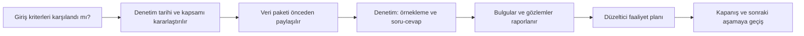
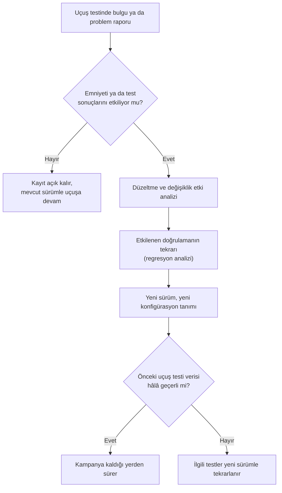

# 12. Sertifikasyon İrtibatı

Sertifikasyon irtibatı (certification liaison), onayı isteyen kuruluş ile sertifikasyon
otoritesi (certification authority) arasında uyumun nasıl gösterileceği üzerine kurulan
ve proje boyunca süren mutabakat sürecidir. Süreç yazılım sertifikasyon planıyla (Plan
for Software Aspects of Certification, PSAC) başlar, yazılım başarı özetiyle (Software
Accomplishment Summary, SAS) kapanır. Bu bölüm sürecin hedeflerini, taraflarını ve
kanallarını, SAS'ın içeriğini, katılım aşaması (Stage of Involvement, SOI) denetimlerini
ve sertifikasyon uçuş testlerinden önce beklenen yazılım olgunluğunu anlatır.

Sertifikasyon yalnızca belge teslimi değildir; ortak anlayış kurma sürecidir. Teknik
ekip ne kadar iyi çalışırsa çalışsın, uyumun nasıl gösterileceği otoriteyle erken
konuşulmamışsa ya da kanıt dağınık sunuluyorsa süreç yavaşlar; en kötü durumda
tamamlanmış iş yeniden yapılır. İrtibat bu yüzden proje sonunda yapılan bir teslim
değil; doğrulama, konfigürasyon yönetimi (configuration management) ve kalite güvencesi
(quality assurance) gibi yaşam döngüsü boyunca süren bütünleyici süreçlerden (integral
processes) biridir.

## İrtibat süreci ne ister?

DO-178C sertifikasyon irtibatı için üç hedef (objective) tanımlar. Üçü de Seviye A'dan
Seviye D'ye kadar her yazılım seviyesinde (software level) geçerlidir: seviye düştükçe
üretilecek kanıt azalır, otoriteyle anlaşma yükümlülüğü azalmaz.

| Hedef | Pratikte anlamı | Dayandığı veri |
|---|---|---|
| Başvuru sahibi (applicant) ile otorite arasında iletişim ve ortak anlayış kurulur | Otorite projeyi, yazılımın sistemdeki yerini ve takvimi bilir; sorular ortaya çıktığı anda konuşulur | PSAC |
| Uyum yöntemi (means of compliance) önerilir ve PSAC üzerinde mutabakat sağlanır | Uyumun hangi belgeye göre, hangi yaşam döngüsü, araç ve yöntemle gösterileceği iş başlamadan kararlaştırılır | PSAC |
| Uyum kanıtı sunulur | Planlananın yapıldığı ve hedeflerin karşılandığı gösterilir | SAS ve yazılım konfigürasyon indeksi (Software Configuration Index, SCI) |

İkinci hedefin arkasında standardın hukuki konumu vardır: DO-178C bir yasa değil,
otoritelerin kabul ettiği bir uyum yöntemidir
([4. DO-178C ve Destekleyici Dokümanlara Genel Bakış](04-do178c-genel-bakis.md)). Bu
yüzden "uyumu neye göre göstereceğiz?" sorusunun cevabı varsayılmaz, PSAC'ta yazılır:
hangi belge, hangi teknoloji ekleri (supplement), varsa hangi alternatif yöntem (alternative method).

PSAC üzerindeki mutabakat ürünün onayı değildir; otorite, önerilen yol izlenirse uyumun
gösterilebileceğini kabul etmiş olur. Bunun iki sonucu vardır. Birincisi, PSAC erken
gönderilmelidir: planlara göre aylarca veri üretildikten sonra gelen bir itiraz, o
verinin bir kısmını geçersiz kılar. İkincisi, mutabakat PSAC'ın anlattığı projeyi
kapsar: yazılım seviyesi, kapsam, araç ya da yöntem değişirse PSAC güncellenir ve
otoriteye yeniden bildirilir. PSAC'ın içeriği
[5. Yazılım Planlama](05-yazilim-planlama.md) bölümünde anlatılır.

Otoriteye sunulan veri ile erişime açık tutulan veri aynı şey değildir. Asgari olarak üç
veri sunulur: PSAC, SCI ve SAS; üçü de her yazılım seviyesinde tam kontrol isteyen
birinci kontrol kategorisindedir (CC1). Geri kalan yazılım yaşam döngüsü verisi (software
life cycle data) — diğer planlar, standartlar, gereksinim ve tasarım verisi, doğrulama
sonuçları, problem raporları (problem report), konfigürasyon yönetimi ve kalite
güvencesi kayıtları — gönderilmez; otorite istediğinde, çoğunlukla denetimde,
gösterilir. Hangi verinin sunulacağı, hangisinin talep üzerine gösterileceği PSAC'ta
yazılır. Bu ayrım yükü hafifletmez: sunulmayan veri de denetim günü, kontrol altındaki
sürümüyle dakikalar içinde açılabilmelidir.

Kalifikasyon gerektiren bir araç kullanılıyorsa asgari liste uzar: DO-330, yazılım yaşam
döngüsü ortam konfigürasyon indeksinin (Software Life Cycle Environment Configuration
Index, SECI) de sunulmasını bekler. Araç kalifikasyon seviyesi (tool qualification level,
TQL) TQL-1 ile TQL-4 arasındaysa buna araç kalifikasyon planı ile aracın konfigürasyon
indeksi ve başarı özeti eklenir.

Verinin bir bölümü ayrıca ürünün tip tasarımıyla (type design) ilişkilidir. Otoriteyle
aksi kararlaştırılmadıkça bu küme altı veriden oluşur: gereksinim verisi, tasarım tanımı,
kaynak kod, çalıştırılabilir nesne kodu (executable object code) ile varsa parametre
verisi öğesi (parameter data item, PDI) dosyaları, SCI ve SAS. Bu verinin geri
getirilebilmesi ve onayı, tip tasarım verisine ilişkin uçuşa elverişlilik kurallarına
tabidir.

İyi yürüyen bir irtibatın ortak özellikleri vardır ve hepsi otoritenin ek soru sorma
ihtiyacını azaltır:

- **Erken ve sürprizsizdir.** Kalifikasyon gerektiren bir araç
  ([13. DO-330 ve Yazılım Aracı Kalifikasyonu](../04-arac-kalifikasyonu-ve-ekler/13-do330-arac-kalifikasyonu.md)),
  yeniden kullanılan bir bileşen ya da plandan sapma, otoritenin denetimde kendi
  bulduğu bir şey olmamalıdır.
- **Kısa ama eksiksizdir.** Otorite uzmanının zamanı sınırlıdır; özet belge kararı ve
  gerekçesini verir, ayrıntı için kontrol altındaki veriye kimliğiyle atıf yapar.
- **Kanıta dayanır.** "Yaptık" cümlesinin yanında kaydın kimliği ve sürümü bulunur.
- **Savunmacı değil, açıktır.** Bilinen zayıflık, gerekçesi ve kapanış planıyla birlikte
  söylenir. Soruyu tahmin edip cevabını önceden yazmak, soruyu geçiştirmekten ucuzdur.
- **Tutarlıdır.** Sürüm numarası, açık rapor listesi ve terimler her belgede aynı
  görünür; belgeler arası küçük bir tutarsızlık, otoriteye örneklemeyi genişlettirir.

## Kiminle ve hangi kanaldan?

"Otorite" tek bir kişi değildir ve her projede aynı derinlikte yer almaz. İrtibatın
tarafları şöyle özetlenebilir:

| Taraf | Rolü |
|---|---|
| Başvuru sahibi | Onay için başvuran kuruluş: uçak, motor ya da ekipman üreticisi. Uyumu göstermek ve irtibatı yürütmek onun sorumluluğudur |
| Sertifikasyon otoritesi | Uyum gösterimini kabul eden kurum ve onun yazılım uzmanı: FAA, EASA ya da ulusal sivil havacılık otoritesi (Türkiye'de Sivil Havacılık Genel Müdürlüğü) |
| Yetkili temsilci ya da onaylı organizasyon | Otoritenin, uyumu kendi adına ya da kendi gözetimi altında doğrulama yetkisi tanıdığı kişi ya da birim. FAA düzeninde yetkilendirilmiş mühendislik temsilcisi (Designated Engineering Representative, DER) ve organizasyon yetkilendirmesi (Organization Designation Authorization, ODA); EASA düzeninde tasarım organizasyonu onayına (Design Organisation Approval, DOA) sahip kuruluşun uyum doğrulama mühendisleri (Compliance Verification Engineer, CVE) |
| Tedarikçi | Yazılımı ya da bir bölümünü geliştiren alt yüklenici. Kanıtı üretir; irtibat başvuru sahibi üzerinden yürür |

Otoritenin projeye ne kadar yakından bakacağı sabit değildir. Katılım düzeyi (level of
involvement) risk temelli belirlenir: yazılım seviyesi, kullanılan teknolojinin ya da
yöntemin yeniliği, tasarımın karmaşıklığı, başvuru sahibinin deneyimi ve geçmiş
performansı. Seviye A yazılımı ilk kez geliştiren bir kuruluş her denetimde otorite
uzmanını karşısında bulur; olgun bir kuruluşun türev projesinde otorite işin büyük
kısmını yetkili temsilciye bırakıp yalnızca PSAC ile SAS'ı kendisi inceleyebilir. Hangi
durumun geçerli olduğu tahmin edilmez; proje başında otoriteye sorulur ve otoritenin
katılacağı noktalar PSAC'a yazılır.

İrtibat birkaç kanaldan yürür ve her kanalın bir zamanı vardır:

| Kanal | Ne zaman | Ne için |
|---|---|---|
| Tanışma ve planlama toplantıları | Proje başında, PSAC gönderilmeden önce | Sistem, yazılım seviyesi, yenilikler ve takvim üzerine ilk ortak anlayış |
| PSAC | Geliştirme verisinin üretimi hızlanmadan | Uyum yöntemi, yaşam döngüsü, ek hususlar ve otoritenin katılım noktaları üzerine mutabakat |
| Konuya özel yazılı mutabakat belgesi | Genel rehberin doğrudan cevaplamadığı bir konu çıktığında | Otoritenin beklentisi ile başvuru sahibinin önerisinin aynı belgede kayda geçmesi: FAA'da "issue paper", EASA'da sertifikasyon gözden geçirme maddesi (Certification Review Item, CRI) |
| SOI denetimleri | Yaşam döngüsünün tipik olarak dört durağında | Sürecin planlara göre işlediğinin örneklemeyle görülmesi |
| SCI ve SAS | Sertifikasyona esas sürüm belirlendiğinde | Uyum kanıtının sunulması |

Alternatif yöntemler de aynı kanalı izler. Bir hedef standardın tarif ettiğinden farklı
bir yolla karşılanacaksa — örneğin servis geçmişinden kredi alınacaksa — bu, PSAC'ta
gerekçesiyle önerilir ve mutabakat işe başlamadan alınır. Sonradan savunulan alternatif
yöntem, tartışmayı projenin en az esnek olduğu ana taşır.

Tedarikçi kullanıldığında irtibat zinciri uzar ama sorumluluk yer değiştirmez. Otoritenin
muhatabı başvuru sahibidir; tedarikçinin planları, sapmaları ve açık problem raporları
başvuru sahibinin PSAC ve SAS'ına yansır, denetimler gerektiğinde tedarikçinin tesisinde
yapılır. Gözetimin nasıl kurulacağı
[26. Yazılım Yaşam Döngüsü Faaliyetlerinde Dış Kaynak Kullanımı](../05-ozel-konular/26-dis-kaynak-kullanimi.md)
bölümündedir. Ekipman tek başına onaylanıyorsa — teknik standart emri (Technical Standard
Order, TSO) ya da Avrupa'daki karşılığı ETSO kapsamında — başvuru sahibi ekipman
üreticisidir ve yazılım kanıtını o sunar. Ekipmanın belirli bir uçağa takılması ayrı bir
onay konusudur; uçak üreticisi SAS'taki kısıtlara ve açık problem raporlarına o aşamada
ihtiyaç duyar.

## Yazılım başarı özeti

Yazılım başarı özeti, yazılım yaşam döngüsünün sonunda otoriteye sunulan kapanış
belgesidir. En kısa tanımıyla SAS, projenin başında verilen sözün — yani PSAC'ın — ne
ölçüde ve nasıl yerine getirildiğini anlatır. PSAC "şunu şöyle yapacağız" derken, SAS
"şunu şöyle yaptık; sapmalar, gerekçeleri ve kalan açık noktalar da bunlardır" der.

Bu ikili yapı, sertifikasyon irtibatının belki de en güçlü aracıdır: otorite iki
belgeyi yan yana koyduğunda projenin bütün hikâyesini görebilmelidir. Bu yüzden SAS,
PSAC ile aynı başlık düzenini izleyecek biçimde yazılırsa hem yazması hem okuması
kolaylaşır.

İyi bir SAS'ta tipik olarak şu içerik bulunur:

| İçerik | Yanıtladığı soru |
|---|---|
| Sistem ve yazılıma genel bakış | Bu yazılım ne yapar, hangi sistemin parçasıdır? |
| Sertifikasyon hususları | Hangi yazılım seviyesi atandı, sistem emniyet değerlendirme süreciyle uyumlu mu; uyum hangi belgelere göre gösterildi? |
| Ek hususlar (additional considerations) | Hangi özel durumlar (araç kalifikasyonu, önceden geliştirilmiş yazılım (previously developed software, PDS), alternatif yöntemler) kullanıldı? |
| Yaşam döngüsü özeti | Süreçler planlandığı gibi mi yürüdü? |
| Planlardan sapmalar | Nerede, neden ve hangi onayla plandan ayrılındı? |
| Yaşam döngüsü verisi | Hangi veri üretildi; geçerli SCI ve SECI hangi kimlik ve sürümde; otorite bu veriye nasıl erişir? |
| Tedarikçi gözetimi | Tedarikçinin süreç ve çıktılarının planlara ve standartlara uyduğu nasıl güvence altına alındı? (tedarikçi kullanıldıysa) |
| Yazılım tanımlaması | Sunulan yazılımın tam konfigürasyonu (sürüm, parça numarası) nedir? |
| Yazılım karakteristikleri | Çalıştırılabilir nesne kodunun boyutu, zamanlama ve bellek payları ne kadar; her biri nasıl ölçüldü ya da hesaplandı? |
| Değişiklik geçmişi | Önceki sertifikasyondan bu yana yazılımda ve süreçlerde ne değişti; hangi değişiklik emniyeti etkileyen bir arıza yüzünden yapıldı? (değişiklik projelerinde) |
| Yazılım durumu | Sertifikasyon anında açık kalan problem raporları hangileri, hangi sınıfta; işleve, operasyona ve emniyete etkileri, açık bırakma gerekçesi ve hafifletici önlemleri nedir? |
| Uyum beyanı (compliance statement) | DO-178C'ye uyulduğuna dair başvuru sahibinin açık ifadesi ve uyumun hangi yöntemlerle gösterildiğinin özeti; otoritenin ek kararları ve başka başlıkta geçmeyen sapmalar da burada ele alınır |

Tablo, DO-178C'nin SAS için saydığı on iki içerik başlığını iki farkla izler. Standart
sistem ve yazılım genel bakışını ayrı başlıklar olarak sayar. Sapmalar için ise ayrı bir
başlık öngörmez: her başlık PSAC'ta önerilenden farkı kendi konusunda anlatır, başka
yerde geçmeyen sapmalar uyum beyanında ele alınır. Sapmaları ayrıca tek bir listede
toplamak, okuyanın işini kolaylaştıran yaygın bir uygulamadır.

Yazılım karakteristikleri, otoritenin SAS'ta özellikle aradığı bilgidir: en kötü durum
yürütme süresi (worst-case execution time, WCET) dahil zamanlama payları, bellek ve
yığın payları ve kaynak sınırlamaları, ölçüm ya da analiz yöntemiyle birlikte verilir.
Bu sayılar [9. Yazılım Doğrulama](09-yazilim-dogrulama.md) bölümünde anlatılan
analizlerin sertifikasyona esas sürüm için güncellenmiş sonuçlarıdır; aylar önceki bir
derlemenin payını SAS'a taşımak sık görülen bir hatadır.

SAS'ın yayımlanması tek başına bir yazı işi değildir. Kalite güvencesi, sertifikasyona
sunulan sürüm için yazılım uygunluk gözden geçirmesini (software conformity review)
tamamlar ([11. Yazılım Kalite Güvencesi](11-yazilim-kalite-guvencesi.md)); SAS'taki uyum
beyanı bu gözden geçirmenin sonucuna dayanır.

Deneyimden birkaç öneri:

- **SAS'ı proje sonunda sıfırdan yazmayın.** Her önemli kilometre taşında (özellikle
  SOI denetimlerinden sonra) taslağı güncellerseniz, kapanışta yalnızca son durumu
  işlemek kalır. Proje sonunda hafızadan yazılan SAS, tutarsızlıkların en sık
  görüldüğü belgedir.
- **Sapmaları saklamayın.** Otorite, plandan hiç sapmamış bir proje beklemez; sapmayı
  fark edip gerekçelendiren ve kalite güvencesi kaydına bağlayan bir ekip bekler.
  Denetimde ortaya çıkan gizli sapma, belgede açıkça yazılmış on sapmadan daha çok
  güven kaybettirir.
- **Açık problem raporlarını tek tek değerlendirin.** Her açık rapor, planlarda tanımlı
  şemaya göre tek bir sınıfa atanır; FAA AC 20-189 ve EASA AMC 20-189 bu şemanın en az
  önemli (significant), işlevsel (functional), süreç (process) ve yaşam döngüsü verisi
  (life-cycle data) sınıflarını içermesini bekler. Sınıfın yanında etkilenen işlev,
  getirdiği kısıt ve neden bu hâliyle kabul edilebilir olduğu yazılır. Etki
  değerlendirmesi yazılım ekibinin tek başına vereceği bir karar değildir; sistem ve
  emniyet ekibiyle birlikte yapılır. Sınıfların tanımı ve değerlendirme soruları
  [9. Yazılım Doğrulama](09-yazilim-dogrulama.md) bölümündedir. "Önemsiz olduğu için açık
  bırakıldı" gibi genel bir cümle, otoritenin ek soru sormasını garanti eder.
- **Konfigürasyon tanımlamasını derleme (build) kanıtına bağlayın.** SAS'ta beyan
  edilen sürüm, SCI'de ve gerçek derleme çıktısında birebir aynı olmalıdır; buradaki
  bir yazım hatası bile son denetimde zaman kaybettirir. SCI'nin içeriği
  [10. Yazılım Konfigürasyon Yönetimi](10-yazilim-konfigurasyon-yonetimi.md) bölümünde
  anlatılır.

SAS, sertifikasyon irtibatının final sınavı gibidir: buraya kadar anlatılan açıklık,
tutarlılık ve kanıta dayalı anlatım ilkelerinin hepsi bu tek belgede sınanır.

## Katılım aşaması denetimleri

Otorite, projeyi tipik olarak dört katılım aşaması denetimiyle izler: planlama (SOI-1),
geliştirme (SOI-2), doğrulama (SOI-3) ve son sertifikasyon (SOI-4).

Bu denetimler DO-178C'de tanımlı değildir; standart yalnızca otoritenin yaşam döngüsü
süreçlerini ve çıktılarını uygun gördüğü ölçüde gözden geçirebileceğini, başvuru
sahibinin de bu gözden geçirmeleri düzenleyip veriyi erişime açacağını söyler. Dört
aşamalı düzen otorite uygulamasından gelir: FAA'nın yazılım onay yönergesi Order 8110.49
(güncel sürümü 8110.49A) ile yazılım gözden geçirmelerine ilişkin iş yardımcısı (job
aid) bu düzeni tarif eder. EASA tarafında aynı düzeni anlatan CM-SWCEH-002 sertifikasyon
notu yürürlükten kalkmıştır; yine de Avrupa'daki projelerde aynı düzen yaygın olarak
izlenir.
"Dört" bu yüzden bir kural değil, tipik durumdur: katılım düzeyine göre aşamalar
birleştirilebilir, bir bölümü belge üzerinden masa başında yapılabilir ya da yetkili
temsilciye bırakılabilir; büyük projelerde bir aşama birden çok oturuma da bölünebilir.

SOI denetimlerinin mantığı basittir: otorite, kanıtın tamamını proje sonunda tek
seferde görmek yerine, yaşam döngüsünün doğal duraklarında örnekleme yaparak
inceler. Böylece sistematik bir sorun varsa erken yakalanır; proje sonunda "her şeyi
yeniden yap" riskine girilmez. Her aşamanın kabaca giriş kriteri ve odağı şöyle
özetlenebilir:

| Aşama | Tipik giriş kriteri | Otoritenin odağı |
|---|---|---|
| SOI-1 (Planlama) | Yazılım seviyesinin gerektirdiği planlar ve standartlar (Seviye A, B ve C'de beş plan ve üç standart) yayımlanmış ve gözden geçirilmiş, ekip planlara göre çalışmaya başlamış | Planların hedefleri karşılaması, birbirleriyle tutarlılığı, araç kalifikasyonu kararları |
| SOI-2 (Geliştirme) | Gereksinim, tasarım ve kodun temsil edici bir bölümü üretilmiş ve gözden geçirilmiş | Süreçlerin plana uygun işlediği, izlenebilirlik, geliştirme verisinin kalitesi |
| SOI-3 (Doğrulama) | Doğrulama verisinin temsil edici bir bölümü tamamlanmış ve gözden geçirilmiş, kapsam analizi sonuç üretmeye başlamış | Test ve gözden geçirme kanıtının yeterliliği, yapısal kapsam boşluklarının çözümü, problem raporu yönetimi |
| SOI-4 (Son sertifikasyon) | Tüm faaliyetler tamamlanmış, önceki bulgular kapanmış, SAS ve SCI yayımlanmış | Açık kalemlerin kapanışı, son konfigürasyon, uyum beyanı |

"Temsil edici bölüm" için otoriteler farklı eşikler anmıştır: FAA'nın Order 8110.49'u
SOI-2 ve SOI-3 için tipik olarak en az yarısını anar, EASA'nın yürürlükten kalkan notu
en az dörtte üçünü arıyordu. Projede geçerli eşik PSAC'ta otoriteyle kararlaştırılır.
Öteki kriterler de otoriteden otoriteye ve projeden projeye küçük farklılıklar gösterir;
tam listeler için Kaynaklar kısmındaki [SW SOI-1](../kaynaklar/soi-1.md),
[SW SOI-2](../kaynaklar/soi-2.md), [SW SOI-3](../kaynaklar/soi-3.md) ve
[SW SOI-4](../kaynaklar/soi-4.md) kontrol listelerine bakılabilir.

Denetim akışı genellikle şu düzende ilerler:

```mermaid
flowchart LR
    A["Giriş kriterleri karşılandı mı?"] --> B["Denetim tarihi ve kapsamı kararlaştırılır"]
    B --> C["Veri paketi önceden paylaşılır"]
    C --> D["Denetim: örnekleme ve soru-cevap"]
    D --> E["Bulgular ve gözlemler raporlanır"]
    E --> F["Düzeltici faaliyet planı"]
    F --> G["Kapanış ve sonraki aşamaya geçiş"]
```

Denetimin çıktısı çoğunlukla üç türde kaydedilir: bir hedefe uyumun gösterilemediğini
söyleyen bulgu (finding), uyumsuzluk olmayan ama iyileştirme öneren gözlem (observation)
ve sorumlusu ile tarihi belli aksiyon (action). Yanıt planında öncelik bulgulardadır:
onaydan önce kapanmaları gerekir. Gözlem bir uyum sorunu değildir; yine de değerlendirilip
yanıtlanması, aynı konunun sonraki denetimde bulguya dönüşmesini önler.

Hazırlık için sahada işe yarayan birkaç öneri:

- **Giriş kriterini kendiniz doğrulamadan denetim istemeyin.** Erken çağrılan bir
  SOI-2, "veri henüz olgun değil" bulgusuyla kapanır ve hem takvimi hem güveni
  zedeler. Denetim öncesi bir iç ön denetim (kalite güvencesinin yürüttüğü bir prova;
  bkz. [11. Yazılım Kalite Güvencesi](11-yazilim-kalite-guvencesi.md)) en etkili
  yatırımdır. Yaşam döngüsü geçiş kriterleriniz
  ([Ek A: Örnek Geçiş Kriterleri](../06-ekler/01-ek-a-ornek-gecis-kriterleri.md))
  düzenli işletiliyorsa bu doğrulamanın kanıtı zaten elinizdedir.
- **İzlenebilirliği canlı gösterebilecek durumda olun.** Otorite genellikle rastgele
  bir gereksinim seçer ve tasarıma, koda, teste kadar izini sürmek ister. Bu zincir
  ancak araç üzerinde dakikalar içinde gösterilebiliyorsa ikna edicidir.
- **Bulguları kişiselleştirmeyin, sistematik kökü arayın.** Tek bir gözden geçirme
  kaydındaki eksik imza önemsiz görünebilir; otoritenin asıl sorusu "bu tekil bir
  hata mı, süreç boşluğu mu"dur. Düzeltici faaliyet yanıtı da bu soruya göre
  yazılmalıdır.
- **Önceki aşamanın bulgularını kapatmadan — ya da en azından kapanış planında otoriteyle
  mutabık kalmadan — sonrakine girmeyin.** Sahipsiz bir SOI-2 bulgusuyla gelinen SOI-3,
  daha ilk saatte güven sorununa dönüşür. SOI-4'te ise önceki bulguların hepsinin
  kapanmış olması beklenir.
- **Denetim kayıtlarını konfigürasyon yönetimi altına alın.** Sorulan sorular,
  verilen yanıtlar ve taahhütler; sonraki aşamalarda "bunu konuşmuştuk" diyebilmenin
  tek dayanağıdır.

## Sertifikasyon uçuş testlerinden önce yazılım olgunluğu

Sertifikasyon amaçlı uçuş testleri, yazılım açısından özel bir eşiktir: uçakta artık
"deneme" yazılımı değil, sertifikasyona esas kanıtın toplanacağı yazılım koşmaktadır.
Eşiğin resmî bir karşılığı da vardır; örneğin FAA düzeninde sertifikasyon uçuş testleri
tip muayene yetkilendirmesi (Type Inspection Authorization, TIA) verildikten sonra
başlar. Öte yandan bu uçuşlar çoğu zaman yazılımın son onayından önce yapılır: doğrulama
sürmektedir, SOI-4 henüz yapılmamıştır. Uçaktaki sürüm bu yüzden henüz onaylı ürün
değildir ve otoriteler, resmî uçuş testine girecek yazılımın belirli bir olgunluk
düzeyine ulaşmış olmasını bekler.

Bazı üreticilerde bu ayrım etiket renkleriyle anılır: geliştirme ve test amaçlı,
doğrulaması henüz tamamlanmamış donanım ve yazılım **kırmızı etiket** (red label),
doğrulaması tamamlanmış ve konfigürasyonu onaylı ürün **siyah etiket** (black label)
diye adlandırılır. Bu adlar bir standart ya da otorite terimi değildir; kuruluşunuzda
başka adlar kullanılıyor olabilir, önemli olan ayrımın kendisidir.

Sertifikasyon uçuşuna aday bir yazılım sürümünden pratikte beklenenler şunlardır:

- **Gereksinimler ve kod dondurulmuş olmalıdır.** Uçuş testi sırasında işlevsellik
  hâlâ değişiyorsa, toplanan kanıtın hangi konfigürasyona ait olduğu tartışmalı hâle
  gelir.
- **Doğrulama büyük ölçüde tamamlanmış olmalıdır.** Kalan doğrulama işi (örneğin son
  kapsam analizi boşlukları) tanımlı, sınırlı ve emniyeti etkilemediği
  değerlendirilmiş olmalıdır.
- **Açık problem raporları değerlendirilmiş olmalıdır.** Uçuş emniyetini ya da test
  edilecek işlevi etkileyen açık kayıtla uçuşa çıkılmaz; kalanların "bu hâliyle
  uçulabilir" kararı kayıt altında olmalıdır.
- **Sürüm, konfigürasyon yönetimi altında ve yeniden üretilebilir olmalıdır.**
  Uçaktaki çalıştırılabilir nesne kodunun hangi kaynak koddan, hangi araç zinciriyle
  üretildiği kesin olarak izlenebilmelidir.
- **Yükleme ve uygunluk kontrolü yapılmış olmalıdır.** Uçaktaki birimde gerçekten
  beyan edilen sürümün yüklü olduğu (parça numarası, sağlama toplamı) uçuş öncesi
  doğrulanır; buna uygunluk denetimi (conformity inspection) eşlik eder. Bu denetim
  uçaktaki fiziksel konfigürasyonun beyan edilenle aynı olduğuna bakar; kalite
  güvencesinin yazılım uygunluk gözden geçirmesiyle karıştırılmamalıdır. Yüklemenin
  nasıl doğrulanacağı
  [18. Sahada Yüklenebilir Yazılım](../05-ozel-konular/18-sahada-yuklenebilir-yazilim.md)
  bölümünde anlatılır.

Uçuş testi kampanyası aylar sürebildiği için yazılımın hiç değişmemesi gerçekçi
değildir. Kritik olan, değişikliğin kontrollü olması, yani her değişikliğin değişiklik
etki analizinden (change impact analysis) geçmesidir:

```mermaid
flowchart TD
    A["Uçuş testinde bulgu ya da problem raporu"] --> B{"Emniyeti ya da test<br/>sonuçlarını etkiliyor mu?"}
    B -- "Hayır" --> C["Kayıt açık kalır,<br/>mevcut sürümle uçuşa devam"]
    B -- "Evet" --> D["Düzeltme ve değişiklik etki analizi"]
    D --> E["Etkilenen doğrulamanın tekrarı<br/>(regresyon analizi)"]
    E --> F["Yeni sürüm, yeni konfigürasyon tanımı"]
    F --> G{"Önceki uçuş testi verisi<br/>hâlâ geçerli mi?"}
    G -- "Evet" --> H["Kampanya kaldığı yerden sürer"]
    G -- "Hayır" --> I["İlgili testler yeni sürümle tekrarlanır"]
```

Buradaki en pahalı hata, "küçük" bir yazılım değişikliğinin hangi uçuş testi
noktalarını geçersiz kıldığının analiz edilmemesidir. Analiz yapılmadan sürüm atlanırsa,
otorite haklı olarak önceki uçuşlarda toplanan verinin geçerliliğini sorgular ve
testlerin tekrarını isteyebilir. Analizin yazılım tarafında neleri kapsadığı
[10. Yazılım Konfigürasyon Yönetimi](10-yazilim-konfigurasyon-yonetimi.md) bölümünde
anlatılır; uçuş testi döneminde buna "hangi test noktaları yeniden uçulmalı" sorusu
eklenir.

Son bir deneyim notu: uçuş test ekibi ile yazılım ekibi arasındaki iletişim de bir
sertifikasyon irtibatı konusudur. Uçakta hangi sürümün olduğu, bilinen
kısıtlamaların neler olduğu ve hangi işlevlerin henüz doğrulanmadığı, her uçuş
öncesi test ekibine yazılı olarak bildirilmelidir. Bu bilgi akışı koptuğunda hem
emniyet riski doğar hem de toplanan kanıt kullanılamaz hâle gelir.

## Bu bölümden akılda kalması gerekenler

- Sertifikasyon irtibatı PSAC ile başlar, SAS ile kapanır. Üç hedefi — ortak anlayış,
  uyum yöntemi üzerinde mutabakat, uyum kanıtının sunulması — Seviye A'dan Seviye D'ye
  her yazılım seviyesinde geçerlidir.
- Otoriteye asgari olarak PSAC, SCI ve SAS sunulur, kalifiye araç varsa DO-330 bu listeyi
  genişletir; geri kalan veri talep edildiğinde, kontrol altındaki sürümüyle
  gösterilebilir olmalıdır.
- Otoritenin muhatabı başvuru sahibidir ve katılım düzeyini otorite belirler. Genel
  rehberin cevaplamadığı konular ve alternatif yöntemler iş başlamadan yazılı mutabakata
  bağlanır.
- SAS, PSAC'ın aynasıdır: sapmalar, zamanlama ve bellek payları, sınıflandırılmış açık
  problem raporları ve uyum beyanı, SCI ile birebir tutarlı biçimde yazılır.
- SOI denetimleri DO-178C'den değil otorite uygulamasından gelir ve dört aşama tipik
  durumdur. Giriş kriterleri karşılanmadan denetim istenmez; önceki bulgular kapatılmış
  ya da kapanış planında mutabık kalınmış olmalıdır. İç ön denetim en ucuz sigortadır.
- Sertifikasyon uçuş testine giren yazılım dondurulmuş, büyük ölçüde doğrulanmış ve
  konfigürasyonu kesin olarak tanımlanmış olmalıdır; değişiklik kaçınılmazsa değişiklik
  etki analiziyle yönetilir.
