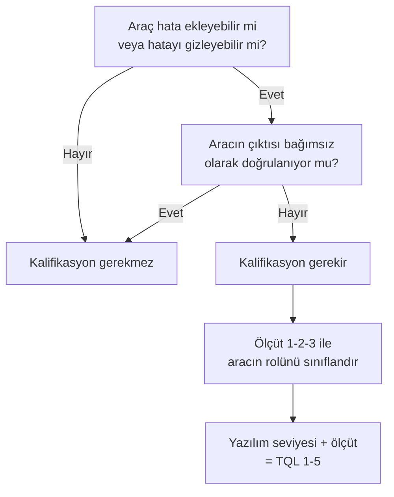

# 13. DO-330 ve Yazılım Aracı Kalifikasyonu

Araç kalifikasyonu, kullanılan yazılım aracının üretilen kanıta zarar vermediğini
göstermeye odaklanır. Bir araç hata üretebiliyor ya da mevcut hatayı gizleyebiliyorsa,
bu risk ayrıca ele alınmalıdır.

DO-330, aracın kullanım amacına göre ne kadar güven gösterilmesi gerektiğini
çerçeveler. Böylece otomasyon, sertifikasyon kanıtını zayıflatmak yerine güçlendirir.

## Araç neden kalifiye edilir?

Yazılım araçları, üretimi hızlandırır; ancak yanlış yapılandırılmış bir araç sessizce
hatalı kanıt da üretebilir. Bu yüzden "araç var" demek yeterli değildir; aracın kullanım
amacı için yeterince güvenilir olduğunun gösterilmesi gerekir.

## Risk türleri

Araçlar açısından tipik riskler:

- yanlış çıktı üretmek,
- hatayı gizlemek,
- dönüşüm sırasında bilgi kaybetmek,
- test sonucunu yanlış yorumlamak,
- kullanıcıyı yanlış yönlendirmek.

Bu risklerin hangisinin önemli olduğu, aracın ne işe yaradığına bağlıdır.

## DO-330 yaklaşımı

DO-330, aracın sertifikasyon sürecindeki rolüne bakar:

- araç sadece kolaylaştırıcı mı?
- aracı kanıt üretiminde kullanıyor muyuz?
- araç hatası yazılım ürününü etkileyebilir mi?

Bu sorular kalifikasyon derinliğini belirler.

## Kalifikasyon ihtiyacının ve seviyesinin belirlenmesi

Her araç kalifikasyon gerektirmez. Karar, iki temel soruya verilen yanıtla başlar:

1. **Araç hata ekleyebilir mi ya da mevcut bir hatayı gözden kaçırabilir mi?**
   Örneğin bir kod üreteci, ürettiği kaynak koda hata ekleyebilir; bir test aracı
   ise başarısız bir testi başarılı gösterebilir.
2. **Aracın çıktısı başka bir süreçle doğrulanıyor mu (verification)?**
   Aracın olası hatasını yakalayacak bağımsız bir kontrol varsa (örneğin üretilen
   kodun gözden geçirilmesi ve test edilmesi), araç hatası ürünü etkilemeden
   yakalanır ve kalifikasyona gerek kalmaz.

Yalnızca "araç hata yapabilir **ve** çıktısı doğrulanmıyor" durumunda kalifikasyon
gündeme gelir. Bu değerlendirme, aracın *fiilî kullanım biçimine* göre yapılır:
aynı araç bir projede kalifikasyon gerektirirken, çıktısı elle doğrulanan başka
bir projede gerektirmeyebilir.

Kalifikasyonun **derinliği**, aracın rolünü sınıflandıran üç ölçüte göre belirlenir:

- **Ölçüt 1:** Aracın çıktısı, uçuşa giden yazılımın bir parçası olur ve araç
  ürüne hata ekleyebilir (tipik örnek: kalifiye kod üreteci).
- **Ölçüt 2:** Araç doğrulama faaliyetlerini otomatikleştirir, bir hatayı gözden
  kaçırabilir **ve** çıktısı başka doğrulama ya da geliştirme faaliyetlerini
  azaltmak/ortadan kaldırmak için kullanılır.
- **Ölçüt 3:** Araç yalnızca doğrulama faaliyetlerini otomatikleştirir ve bir
  hatayı gözden kaçırabilir; ancak başka faaliyetleri ortadan kaldırmaz (tipik
  örnek: yapısal kapsam analizi aracı, statik analiz aracı).

Bu ölçüt, yazılım seviyesiyle (A–D) birleştirilerek **araç kalifikasyon seviyesi
(tool qualification level, TQL)** bulunur. TQL-1 en sıkı, TQL-5 en hafif seviyedir:

| Yazılım seviyesi | Ölçüt 1 | Ölçüt 2 | Ölçüt 3 |
|---|---|---|---|
| A | TQL-1 | TQL-4 | TQL-5 |
| B | TQL-2 | TQL-4 | TQL-5 |
| C | TQL-3 | TQL-5 | TQL-5 |
| D | TQL-4 | TQL-5 | TQL-5 |

Karar akışı özetle şöyledir:

Pratikte en sık yapılan hata, aracı olduğundan ağır sınıflandırmaktır. Örneğin bir
test otomasyon aracı, sonuçları bir mühendis tarafından ayrıca inceleniyorsa hiç
kalifikasyon gerektirmeyebilir. Tersi hata da görülür: bir betik "küçük" diye
göz ardı edilir; oysa doğrulama kanıtı üreten ve çıktısı kontrol edilmeyen üç
satırlık bir betik bile kalifikasyon değerlendirmesine girmelidir.

## DO-330 kalifikasyon süreci

DO-330'un temel fikri, aracın da kendi başına bir yazılım ürünü gibi ele
alınmasıdır: aracın bir yaşam döngüsü, planları, gereksinimleri (requirement),
doğrulama faaliyetleri ve konfigürasyon yönetimi vardır. Ancak buradaki hedef
uçuşa uygunluk değil, aracın **belirlenen kullanım amacı için** güvenilir
olduğunun gösterilmesidir. TQL yükseldikçe istenen faaliyetlerin sayısı ve
bağımsızlık beklentisi artar; TQL-5'te süreç oldukça hafiftir, TQL-1'de ise
seviye A yazılım geliştirmeye yaklaşan bir titizlik beklenir.

Sürecin merkezinde **araç operasyonel gereksinimleri (tool operational
requirements, TOR)** durur. TOR, aracın projede *nasıl kullanılacağını* tanımlar:

- aracın hangi girdilerle, hangi ortamda ve hangi ayarlarla çalıştırılacağı,
- her kullanım senaryosunda aracın üretmesi beklenen çıktı ve davranış,
- kullanım kısıtları (desteklenmeyen dil yapıları, yasaklı seçenekler),
- olası arıza durumlarında kullanıcının ne göreceği ve ne yapacağı.

TOR bilinçli olarak kullanım odaklıdır: bir aracın yüzlerce özelliği olabilir,
ama yalnızca projede fiilen kullanılan işlevler kalifiye edilir. Bu, hem işi
sınırlar hem de "araç her şeyi yapar" gibi savunulamaz iddialardan korur.

Yaşam döngüsü faaliyetleri kabaca ikiye ayrılır:

- **Araç geliştirme faaliyetleri:** araç gereksinimlerinin yazılması, tasarım,
  kodlama ve entegrasyon. Yüksek TQL'lerde araç için de gereksinim-tasarım-kod
  izlenebilirliği ve yapılandırılmış bir geliştirme süreci beklenir.
- **Araç doğrulama faaliyetleri:** aracın TOR'a ve kendi gereksinimlerine karşı
  test edilmesi, gözden geçirmeler ve analizler. Doğrulamanın en görünür parçası,
  aracın gerçek kullanım ortamında TOR senaryolarıyla çalıştırıldığı
  **operasyonel doğrulama** testleridir; bu adım her TQL'de vardır.

Başlıca iş ürünleri şunlardır:

| İş ürünü | İçeriği |
|---|---|
| Araç kalifikasyon planı | Aracın rolü, TQL, faaliyetler, sorumluluklar |
| Araç operasyonel gereksinimleri (TOR) | Kullanım senaryoları, ortam, kısıtlar |
| Araç geliştirme verileri | Araç gereksinimleri, tasarım, kaynak kod (yüksek TQL) |
| Araç doğrulama sonuçları | Test durumları, sonuçlar, gözden geçirme kayıtları |
| Araç konfigürasyon indeksi | Aracın ve ortamının tam sürüm tanımı |
| Araç kalifikasyon özeti | Planlanan ile yapılanın karşılaştırması, uygunluk beyanı |

Sorumluluk paylaşımı da DO-330'un önemli bir katkısıdır. Standart, **araç
geliştiricisi** ile **araç kullanıcısı** rollerini ayırır:

- **Araç geliştiricisi**, araç gereksinimlerini, geliştirme verilerini ve aracın
  kendi doğrulama kanıtını sağlar. Ticari araçlarda bu rol araç üreticisindedir.
- **Araç kullanıcısı** (yani sertifikasyon başvurusunu yapan proje), TQL'i
  belirler, TOR'u yazar, aracı kendi ortamında operasyonel olarak doğrular ve
  kalifikasyon iddiasının bütününden otoriteye karşı sorumlu kalır.

Kritik nokta şudur: araç üreticisinden ne kadar hazır veri alınırsa alınsın,
kalifikasyon sorumluluğu devredilemez. Kullanıcı, aracın kendi projesindeki
kullanım biçimini kapsayan kanıtı her durumda kendisi tamamlamalıdır.

## Özel kalifikasyon konuları

### Araç belirlenimciliği

**Araç belirlenimciliği (tool determinism)**, aynı girdi ve aynı yapılandırmayla
çalıştırılan aracın her seferinde aynı çıktıyı üretmesi beklentisidir. Bu önemlidir,
çünkü kalifikasyon kanıtı belirli bir çıktı üzerinden kurulur; araç bir dahaki
çalıştırmada farklı çıktı üretiyorsa o kanıt neyi temsil ettiğini yitirir.

Modern araçlarda katı bir "bit düzeyinde aynılık" her zaman gerçekçi değildir:
paralel çalışan bir derleyici, kayıt (register) atamalarını farklı sırada
yapabilir; bir kod üreteci değişkenleri farklı adlandırabilir. Bu nedenle pratikte
daha yararlı ölçüt, **işlevsel eşdeğerlik** düzeyinde belirlenimciliktir: çıktılar
biçimsel olarak farklılaşsa bile davranışları aynı olmalı ve bu fark analizle
gösterilebilmelidir. Belirlenimcilik değerlendirilirken şunlara bakılır:

- Aracın çıktısını etkileyen tüm girdiler (kaynak dosyalar, seçenekler, ortam
  değişkenleri, araç sürümü) konfigürasyon yönetimi altında mı?
- Aynı girdi kümesiyle tekrar üretilebilirlik test edilmiş mi?
- Kabul edilebilir çıktı farklılıkları tanımlanmış ve gerekçelendirilmiş mi?

### Önceden kalifiye edilmiş araçların yeniden kullanımı

Bir araç bir projede kalifiye edildiyse, bu kanıt sonraki projelerde büyük emek
tasarrufu sağlayabilir; ancak otomatik olarak geçerli olmaz. Yeniden kullanım
değerlendirmesinde üç soru sorulur:

1. **Araç aynı mı?** Sürüm, yamalar ve yapılandırma birebir aynı değilse fark
   analizi gerekir; küçük görünen bir sürüm atlaması bile davranışı değiştirebilir.
2. **Kullanım biçimi aynı mı?** Yeni projenin TOR'u öncekinin kapsamı içinde
   kalıyor mu? Yeni bir dil özelliği, yeni bir hedef işlemci ya da yeni bir seçenek
   kullanılıyorsa, kalifikasyon kanıtının o kısmı yeniden üretilmelidir.
3. **Gereken TQL aynı ya da daha hafif mi?** Önceki proje TQL-5 için kanıt
   üretmişse, yeni projede TQL-4 gerekiyorsa aradaki fark kapatılmalıdır.

Üç yanıt da olumluysa mevcut kalifikasyon verisi, yeni projenin planlarında
gerekçesiyle birlikte referans gösterilir; otorite ile katılım aşaması (Stage of
Involvement, SOI) görüşmelerinde bu yaklaşımın erken paylaşılması sürprizleri önler.

### Ticari araçların kalifikasyon paketleri

Birçok ticari araç üreticisi, DO-330 kanıtının geliştirici tarafını hazır sunan
**kalifikasyon paketi (qualification kit)** satar. Tipik bir paket; araç
gereksinimlerini, test durumlarını, test çalıştırma altyapısını ve şablon plan
belgelerini içerir. Bu paketler değerlidir, ancak iki sınırı iyi anlamak gerekir:

- Paket, aracı **sizin ortamınızda ve sizin kullanım biçiminizde** doğrulamaz.
  Testlerin projenin gerçek ortamında (işletim sistemi, sürümler, seçenekler)
  koşulması ve sonuçların değerlendirilmesi kullanıcının işidir.
- Paket, TQL kararını ve TOR'u veremez; çünkü bunlar aracın projedeki rolüne
  bağlıdır. "Paketi satın aldık, araç kalifiye" cümlesi otorite nezdinde geçersizdir.

Doğru kullanım şudur: paketi bir hızlandırıcı olarak alın, kendi TOR'unuzu yazın,
paketin kapsamadığı kullanım senaryolarını belirleyip ek testlerle kapatın ve
tümünü kendi araç kalifikasyon planınız altında birleştirin.

## Araç örneği

Bir statik analiz aracı yanlış alarm üretiyorsa, bu aracın kullanım amacına göre ek
değerlendirme gerekir. Kritik soru şudur: araç, sertifikasyon kanıtını üretmekte mi,
yoksa sadece kolaylaştırmakta mı?

## Pratik yaklaşım

Araç seçerken şunlar değerlendirilmelidir:

- kullanım amacı,
- yanlış pozitif/negatif davranışı,
- arıza etkisi,
- insan kontrolü,
- çıktıların bağımsız doğrulanabilirliği.

## Bu bölümden akılda kalması gerekenler

- Araçların hatası kanıta yansıyabilir; çıktısı bağımsız doğrulanmayan ve hata
  yapabilen araçlar kalifikasyon gerektirir.
- Kalifikasyon derinliğini, aracın rolünü tanımlayan üç ölçüt ile yazılım
  seviyesinin birleşimi (TQL-1'den TQL-5'e) belirler.
- DO-330 süreci araç operasyonel gereksinimleri (TOR) etrafında kurulur; yalnızca
  projede fiilen kullanılan işlevler kalifiye edilir.
- Araç üreticisinden hazır veri alınsa bile kalifikasyon sorumluluğu başvuru
  sahibinde kalır; operasyonel doğrulama kullanıcının kendi ortamında yapılır.
- Belirlenimcilik, yeniden kullanım ve ticari kalifikasyon paketleri emek
  tasarrufu sağlar; ancak her biri projeye özgü fark analizi ister.
- Otomasyon güvenliği artırmalı, riski gizlememelidir.
