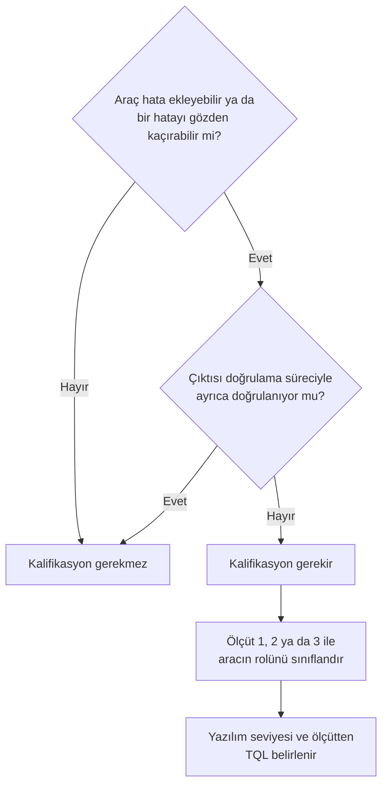

# 13. DO-330 ve Yazılım Aracı Kalifikasyonu

Araç kalifikasyonu (tool qualification), çıktısı ayrıca doğrulanmadan kullanılan bir
yazılım aracına duyulan güvenin kanıtla temellendirilmesidir. Bu bölüm, kalifikasyonun
hangi araçlar için gerektiğini, üç ölçüt ile yazılım seviyesinden araç kalifikasyon
seviyesinin nasıl bulunduğunu ve DO-330'un bu seviyeye göre aracın geliştiricisinden ve
kullanıcısından hangi kanıtı beklediğini anlatır.

## Araç neden kalifiye edilir?

Derleyiciden test betiğine kadar her araç, yaşam döngüsündeki bir işi insandan devralır.
İş hızlanır; ama aracın hatası da o işin çıktısına sessizce taşınır. Araç kaynaklı risk
iki temel biçimde ortaya çıkar:

- **Hata eklemek:** araç, ürüne giren bir çıktıyı yanlış üretir. Bir kod üreteci (code
  generator) modeli hatalı koda çevirebilir; bir dönüştürme aracı tablodaki bir değeri
  kesip yuvarlayabilir.
- **Hatayı gözden kaçırmak:** araç, var olan bir hatayı raporlamaz. Bir test aracı
  başarısız adımı başarılı gösterebilir; bir kapsam aracı hiç çalışmamış bir dalı
  çalışmış sayabilir; bir statik analiz (static analysis) aracı bir ihlali atlayabilir.

İkinci grupta sık yapılan bir karıştırma vardır: kalifikasyonu ilgilendiren, aracın
yanlış alarm vermesi (false positive) değil, gerçek bir hatayı raporlamamasıdır (false
negative). Yanlış alarm iş yükü doğurur ve mühendis sonucu incelediğinde düşer;
raporlanmayan hata ise kimsenin bakmadığı yerde kalır.

Bu risklerin varlığı tek başına kalifikasyon gerektirmez. Belirleyici olan, aracın
hatasını yakalayacak başka bir faaliyetin bulunup bulunmadığıdır: araç bir faaliyeti
kaldırıyor, azaltıyor ya da otomatikleştiriyorsa ve çıktısına başka kimse bakmıyorsa,
"araç var" demek yetmez; aracın o kullanım amacı için güvenilir olduğu gösterilmelidir.
Böylece otomasyon sertifikasyon kanıtını zayıflatmak yerine güçlendirir.

## DO-330 nedir, DO-178C ile ilişkisi

DO-330, "Software Tool Qualification Considerations" adıyla 2011'de DO-178C ile birlikte
yayımlanmıştır; EUROCAE karşılığı ED-215'tir. DO-331, DO-332 ve DO-333'ün aksine bir
teknoloji eki (supplement) değildir: DO-178C'nin hedeflerine (objective) ekleme yapmaz,
kendi hedef tabloları olan bağımsız bir araç kalifikasyonu belgesidir. Bu yapı onu
alandan bağımsız kılar; örneğin yer tabanlı haberleşme, seyrüsefer, gözetim ve hava
trafik yönetimi (CNS/ATM) yazılımını konu alan DO-278A da araç kalifikasyonu için ona
başvurur ve aynı mantık havacılık verisi işleyen araçlara da taşınır (bkz.
[23. Havacılık Verileri](../05-ozel-konular/23-havacilik-verileri.md)).

İki belge arasındaki iş bölümü nettir:

- **DO-178C**, "bu araç kalifiye edilmeli mi, edilecekse hangi seviyede?" sorusunu
  yanıtlar. Kalifikasyonun ne zaman gerektiği, aracın rolünü sınıflandıran üç ölçüt ve
  seviye tablosu, DO-178C'nin ek hususlar (additional considerations) kısmındadır
  (bölüm 12.2).
- **DO-330**, "bu seviyede kalifikasyon nasıl yapılır?" sorusunu yanıtlar: aracın yaşam
  döngüsü süreçlerini, seviyeye göre karşılanacak hedefleri ve üretilecek veriyi tanımlar.

FAA AC 20-115D ve EASA AMC 20-115D, DO-330'u DO-178C ve teknoloji ekleriyle birlikte
kabul edilebilir uyum yöntemi olarak tanır. Belge ailesinin tamamı
[4. DO-178C ve Destekleyici Dokümanlara Genel Bakış](../03-do178c-ile-gelistirme/04-do178c-genel-bakis.md)
bölümünde tablo hâlinde verilmiştir.

## Kalifikasyon ihtiyacının ve seviyesinin belirlenmesi

Her araç kalifikasyon gerektirmez. Karar, iki temel soruya verilen yanıtla başlar:

1. **Araç hata ekleyebilir mi ya da mevcut bir hatayı gözden kaçırabilir mi?**
   Örneğin bir kod üreteci, ürettiği kaynak koda hata ekleyebilir; bir test aracı
   ise başarısız bir testi başarılı gösterebilir.
2. **Aracın çıktısı doğrulama süreciyle ayrıca doğrulanıyor mu?**
   Aracın olası hatasını yakalayacak bir gözden geçirme, analiz ya da test varsa
   (örneğin üretilen kodun gözden geçirilmesi ve test edilmesi), araç hatası ürünü
   etkilemeden yakalanır ve kalifikasyona gerek kalmaz.

Yalnızca "araç hata yapabilir **ve** çıktısı doğrulanmıyor" durumunda kalifikasyon
gündeme gelir; bu koşul geliştirme araçları kadar doğrulama araçları için de geçerlidir.
Değerlendirme, aracın *fiilî kullanım biçimine* göre yapılır: aynı araç bir projede
kalifikasyon gerektirirken, çıktısı elle doğrulanan başka bir projede gerektirmeyebilir.
Derleyici bunun bilinen örneğidir: ürettiği nesne kodu gereksinim tabanlı testlerle hedef
ortamda doğrulandığı için genellikle kalifiye edilmez. Karar planlama aşamasında verilir
ve yazılım sertifikasyon planına (Plan for Software Aspects of Certification, PSAC)
yazılır; bu yanı [5. Yazılım Planlama](../03-do178c-ile-gelistirme/05-yazilim-planlama.md)
bölümünde işlenmiştir.

Kalifikasyonun **derinliği**, aracın rolünü sınıflandıran üç ölçüte (criteria) göre
belirlenir:

- **Ölçüt 1:** Aracın çıktısı uçuş yazılımının bir parçası olur; dolayısıyla araç ürüne
  hata ekleyebilir. Tipik örnek, ürettiği kod ayrıca gözden geçirilmeyen kod üretecidir.
- **Ölçüt 2:** Araç bir doğrulama faaliyetini otomatikleştirir, bir hatayı gözden
  kaçırabilir **ve** çıktısı, kendi otomatikleştirdiği faaliyetin dışındaki doğrulama ya
  da geliştirme faaliyetlerini azaltmanın ya da kaldırmanın gerekçesi yapılır. Tipik
  örnek, sonucuna dayanılarak bazı testlerden vazgeçilen statik analiz ya da ispat
  aracıdır.
- **Ölçüt 3:** Araç, kullanım amacı içinde bir hatayı gözden kaçırabilir; ancak çıktısı
  başka bir faaliyetin azaltılmasına gerekçe yapılmaz. Tipik örnekler: yapısal kapsam
  analizi (structural coverage analysis) aracı, kodlama standardı denetleyicisi, test
  sonuçlarını beklenen değerlerle karşılaştıran araç.

Ölçütler sırayla, 1'den 3'e doğru değerlendirilir: araç ancak öncekine girmiyorsa
sonrakine bakılır. Okurun en çok zorlandığı ayrım Ölçüt 2 ile Ölçüt 3 arasındadır ve
aracın türüne değil, sonucundan ne kadar kredi alındığına bağlıdır. Sıfıra bölme gibi
çalışma zamanı hatalarının bulunmadığını gösteren bir statik analiz aracını düşünün.
Sonuç yalnızca kaynak kodun doğruluğu ve tutarlılığına ilişkin kanıt olarak
kullanılıyorsa araç Ölçüt 3'tedir. Aynı sonuç, ilgili gürbüzlük testlerinin bir kısmını
yapmamanın gerekçesi de yapılıyorsa araç artık kendi otomatikleştirmediği bir faaliyeti
azaltmaktadır ve Ölçüt 2'ye geçer. Biçimsel analiz araçlarında bu durum sık görülür
(bkz. [16. DO-333 ve Biçimsel Yöntemler](16-do333-bicimsel-yontemler.md)).

Ölçüt, yazılım seviyesiyle (software level) birleştirilerek **araç kalifikasyon seviyesi
(tool qualification level, TQL)** bulunur. TQL-1 en sıkı, TQL-5 en hafif seviyedir:

| Yazılım seviyesi | Ölçüt 1 | Ölçüt 2 | Ölçüt 3 |
|---|---|---|---|
| A | TQL-1 | TQL-4 | TQL-5 |
| B | TQL-2 | TQL-4 | TQL-5 |
| C | TQL-3 | TQL-5 | TQL-5 |
| D | TQL-4 | TQL-5 | TQL-5 |

Karar akışı özetle şöyledir:

```mermaid
flowchart TD
    A{"Araç hata ekleyebilir ya da<br/>bir hatayı gözden kaçırabilir mi?"} -- "Hayır" --> B["Kalifikasyon gerekmez"]
    A -- "Evet" --> C{"Çıktısı doğrulama süreciyle<br/>ayrıca doğrulanıyor mu?"}
    C -- "Evet" --> B
    C -- "Hayır" --> D["Kalifikasyon gerekir"]
    D --> E["Ölçüt 1, 2 ya da 3 ile<br/>aracın rolünü sınıflandır"]
    E --> F["Yazılım seviyesi ve ölçütten<br/>TQL belirlenir"]
```

Pratikte en sık yapılan hata, aracı olduğundan ağır sınıflandırmaktır. Örneğin bir
test otomasyon aracı, sonuçları bir mühendis tarafından ayrıca gözden geçiriliyorsa hiç
kalifikasyon gerektirmeyebilir. Tersi hata da görülür: bir betik "küçük" diye
göz ardı edilir; oysa doğrulama kanıtı üreten ve çıktısı kontrol edilmeyen üç
satırlık bir betik bile kalifikasyon değerlendirmesine girmelidir.

## DO-330 kalifikasyon süreci

DO-330'un temel fikri, aracın da kendi başına bir yazılım ürünü gibi ele alınmasıdır:
aracın bir yaşam döngüsü, planları, gereksinimleri, doğrulama faaliyetleri,
konfigürasyon yönetimi (configuration management) ve kalite güvencesi (quality
assurance) vardır. Ancak buradaki hedef uçuşa elverişlilik değil, aracın **belirlenen
kullanım amacı için** güvenilir olduğunun gösterilmesidir.

### Araç operasyonel gereksinimleri

Sürecin merkezinde **araç operasyonel gereksinimleri (tool operational
requirements, TOR)** durur. TOR, aracın projede *nasıl kullanılacağını* tanımlar:

- aracın hangi girdilerle, hangi ortamda ve hangi ayarlarla çalıştırılacağı,
- her kullanım senaryosunda aracın üretmesi beklenen çıktı ve davranış,
- kullanım kısıtları (desteklenmeyen dil yapıları, yasaklı seçenekler),
- aracın algılaması gereken anormal çalıştırma kipleri ve tutarsız girdiler ile bunlara
  vereceği tepki (bu kalem TQL-5'te aranmaz).

TOR bilinçli olarak kullanım odaklıdır: bir aracın yüzlerce özelliği olabilir, ama
yalnızca projede fiilen kredi alınan işlevler kalifiye edilir. DO-178C bunun koşulunu
da koyar: bu işlevlerin aracın öteki işlevlerinden olumsuz etkilenmediği, yani
aralarında koruma (protection) bulunduğu gösterilmelidir. Bu, hem işi sınırlar hem de
"araç her şeyi yapar" gibi savunulamaz iddialardan korur.

TOR, **araç gereksinimleri (tool requirements)** ile karıştırılmamalıdır. TOR kullanıcının
gözünden yazılır ve "bu projede araçtan ne bekliyoruz?" sorusunu yanıtlar. Araç
gereksinimleri ise geliştiricinin gözünden, aracın işlevlerini onu geliştirmeye ve test
etmeye yetecek ayrıntıda tanımlar. Birincisi her kalifikasyonda vardır; ikincisi ancak
aracın nasıl geliştirildiğine de bakılan seviyelerde istenir.

Yaşam döngüsü faaliyetleri de buna koşut olarak ikiye ayrılır:

- **Araç geliştirme ve doğrulama faaliyetleri:** araç gereksinimlerinin yazılması,
  tasarım, kodlama, entegrasyon ve aracın bu gereksinimlere karşı gözden geçirme, analiz
  ve testle doğrulanması. Daha sıkı TQL'lerde (TQL-1 – TQL-3) araç için de
  gereksinim-tasarım-kod izlenebilirliği beklenir.
- **Operasyonel faaliyetler:** TOR'un yazılması, aracın kullanım ortamına kurulması ve
  **operasyonel doğrulama ve geçerleme (tool operational verification and validation)**.
  Burada araç gerçek kullanım ortamında TOR senaryolarıyla çalıştırılır; ayrıca TOR'un,
  aracın yerine geçtiği faaliyetin ihtiyacını gerçekten karşıladığı gösterilir. Bu adım
  her TQL'de vardır.

### TQL'e göre beklentiler

TQL sıkılaştıkça (TQL-5'ten TQL-1'e doğru) hem faaliyetlerin sayısı hem de bağımsızlık
(independence) beklentisi artar. Seviyeler arasındaki farkı anlamanın kolay yolu, her
seviyenin bir öncekine ne eklediğine bakmaktır:

| TQL | Hangi durumda | Kabaca beklenen |
|---|---|---|
| TQL-5 | Ölçüt 3 (her seviye); Ölçüt 2 (Seviye C, D) | TOR, kurulum, operasyonel doğrulama ve geçerleme; araç için sınırlı kapsamda konfigürasyon yönetimi (tanımlama, arşivleme) ve kalite güvencesi, otoriteyle irtibat. Aracın nasıl geliştirildiğine bakılmaz |
| TQL-4 | Ölçüt 2 (Seviye A, B); Ölçüt 1 (Seviye D) | Ek olarak araç planları, araç gereksinimleri ve araç mimarisi; gereksinimlerin gözden geçirilmesi, aracın bu gereksinimlere karşı test edildiğinin ve gereksinimlerin testlerle kapsandığının kanıtı; temel çizgi, problem raporlama ve değişiklik kontrolü |
| TQL-3 | Ölçüt 1 (Seviye C) | Ek olarak araç geliştirme standartları, düşük seviyeli araç gereksinimleri ve kaynak kodun doğrulanması; aracın kendi kodu için satır kapsama (statement coverage) düzeyinde yapısal kapsam ile veri ve kontrol bağlaşımı (data and control coupling) analizi |
| TQL-2 | Ölçüt 1 (Seviye B) | Ek olarak karar kapsama (decision coverage) ve doğrulama hedeflerinin bir kısmında bağımsızlık |
| TQL-1 | Ölçüt 1 (Seviye A) | Ek olarak değiştirilmiş koşul/karar kapsama (modified condition/decision coverage, MC/DC), dış bileşenlere (external components) ilişkin analiz ve en geniş bağımsızlık; Seviye A yazılım geliştirmeye yaklaşan bir titizlik |

Tablo yön göstermek içindir; hangi hedefin hangi TQL'de ve hangi bağımsızlıkla arandığı
DO-330'un hedef tablolarından okunur. Projeler açısından en çok maliyet farkı yaratan
basamak TQL-5 ile TQL-4 arasındadır. TQL-5'te araç bir kara kutu gibi ele alınır ve işin
neredeyse tamamını kullanıcı kendi ortamında yapabilir. TQL-4'ten itibaren aracın *nasıl
geliştirildiğini* gösteren veri gerekir; bu veri araç üreticisinde yoksa ya da
paylaşılmıyorsa kalifikasyon çok güçleşir. Bu yüzden ekipler çoğu zaman aracı
kullanım biçimini daraltarak Ölçüt 3'te tutmayı, yani araç sonucunu başka bir faaliyeti
azaltmanın gerekçesi yapmamayı seçer.

### Kalifikasyon verisi

Başlıca veriler ve hangi seviyelerde ayrı birer belge olarak beklendikleri şöyledir:

| Veri | İngilizce adı | İçeriği | Hangi TQL'de |
|---|---|---|---|
| Araca özgü bilgi (PSAC, SECI ve SAS içinde) | Tool-specific information | Aracın rolü, ölçüt ve TQL gerekçesi; aracın sürüm tanımı; proje sonunda kalifikasyonun durumu | Tümü |
| Araç operasyonel gereksinimleri (TOR) | Tool Operational Requirements | Kullanım senaryoları, ortam, kısıtlar | Tümü |
| Araç kurulum raporu | Tool Installation Report | Kullanım ortamı ve kurulan araç sürümü; SECI içinde de verilebilir | Tümü |
| Operasyonel doğrulama ve geçerleme sonuçları | Tool Operational Verification and Validation Results | TOR senaryolarının kullanım ortamında koşulmasına ait kayıtlar | Tümü |
| Araç kalifikasyon planı | Tool Qualification Plan (TQP) | Kalifikasyon faaliyetleri, üretilecek veri, sorumluluklar | TQL-1 – TQL-4 |
| Araç gereksinimleri | Tool Requirements | Aracın işlevlerinin doğrulanabilir tanımı | TQL-1 – TQL-4 |
| Araç tasarım tanımı ve kaynak kod | Tool Design Description, Tool Source Code | Mimari, düşük seviyeli gereksinimler, kod | Mimari TQL-1 – TQL-4; düşük seviyeli gereksinimler, kaynak kod ve bunların doğrulanması TQL-1 – TQL-3 |
| Araç doğrulama sonuçları | Tool Verification Results | Araç gereksinimlerine karşı testler, gözden geçirme ve analiz kayıtları | TQL-1 – TQL-4 |
| Araç konfigürasyon indeksi | Tool Configuration Index (TCI) | Aracın ve ortamının tam sürüm tanımı | TQL-1 – TQL-4 |
| Araç başarı özeti | Tool Accomplishment Summary (TAS) | Planlananla yapılanın karşılaştırması, bilinen problemler, uyum beyanı | TQL-1 – TQL-4 |

TQL-5'te ayrı bir TQP, TCI ve TAS beklenmez; karşılıkları projenin kendi verisinin araca
özgü kısımlarıdır: plan bilgisi PSAC'ta, aracın sürüm tanımı yazılım yaşam döngüsü ortam
konfigürasyon indeksinde (Software Life Cycle Environment Configuration Index, SECI),
sonuç ise yazılım başarı özetinde (Software Accomplishment Summary, SAS) verilir. Bu,
"TQL-5'te yazacak bir şey yok" demek değildir: aracın kimliği ve kullanım amacı, araçtan
alınmak istenen kredi, TQL ve gerekçesi, sorumluluklar, kullanım ortamı ve kalifikasyon
verisine atıf yine kayıt altında olmalıdır; isteyen proje bunları TQL-5'te de ayrı
belgeler olarak düzenleyebilir.

### Araç geliştiricisi ve araç kullanıcısı

Sorumluluk paylaşımı da DO-330'un önemli bir katkısıdır. Belge, özellikle ticari hazır
(commercial off-the-shelf, COTS) araçlar için **araç geliştiricisi** ile **araç
kullanıcısı** rollerini ayırır:

- **Araç geliştiricisi**, araç gereksinimlerini, geliştirme verilerini ve aracın
  kendi doğrulama kanıtını sağlar. Ticari araçlarda bu rol araç üreticisindedir.
- **Araç kullanıcısı** (yani sertifikasyon başvurusunu yapan proje), TQL'i
  belirler, TOR'u yazar, aracı kendi ortamında operasyonel olarak doğrular ve
  kalifikasyon iddiasının bütününden otoriteye karşı sorumlu kalır.

Ticari araç çoğu zaman belirli bir projenin TOR'u ortada yokken geliştirilir. DO-330
bu boşluğu bir **geliştirici TOR'u (developer-TOR)** ile kapatır: geliştirici aracın
öngörülen ortamlarını, girdi-çıktılarını ve işlevlerini tanımlayıp doğrulamasını buna
karşı yapar; kullanıcı kendi TOR'unu bunun üzerine projeye özgü kullanım ve kısıtlarla
kurar.

Kritik nokta şudur: araç üreticisinden ne kadar hazır veri alınırsa alınsın,
kalifikasyon sorumluluğu devredilemez. Kullanıcı, aracın kendi projesindeki
kullanım biçimini kapsayan kanıtı her durumda kendisi tamamlamalıdır.

## Özel kalifikasyon konuları

### Araç belirlenimciliği

**Araç belirlenimciliği (tool determinism)**, aynı girdi ve aynı yapılandırmayla
çalıştırılan aracın her seferinde aynı çıktıyı üretmesi beklentisidir. Bu önemlidir,
çünkü kalifikasyon kanıtı belirli bir çıktı üzerinden kurulur; araç bir dahaki
çalıştırmada farklı çıktı üretiyorsa o kanıt neyi temsil ettiğini yitirir.

DO-178B bu beklentiyi katı biçimde koyuyor, yalnızca aynı ortamda aynı girdiyle hep aynı
çıktıyı veren araçların kalifiye edilebileceğini söylüyordu. Modern araçlarda bit
düzeyinde aynılık her zaman gerçekçi değildir: bir test aracı rapora zaman damgası
gömebilir, bir analiz aracı bulgularını her çalıştırmada farklı sırada dökebilir.
DO-330 bu yüzden bir ayrım yapar. Çıktısı uçuş yazılımının parçası olan ve hata
ekleyebilen araçta (Ölçüt 1; örneğin kod üreteci) beklenti katı kalır: kalifiye edilen
işlevlerin aynı ortamda aynı girdiyle aynı çıktıyı ürettiği gösterilir. Çıktısı beklenen
sınırlar içinde değişebilen diğer araçlarda ise gösterilmesi gereken iki şeydir:
farklılık çıktının kullanım amacını olumsuz etkilememektedir ve çıktının doğruluğu
belirlenebilmektedir. FAA'nın DO-178B dönemindeki uygulama talimatı (Order 8110.49)
aynı yorumu daha önce yapmıştı: aynı girdi için ortaya çıkabilecek çıktı çeşitlerinin
hepsinin doğru olduğu gösterilebiliyorsa araç, kalifikasyon açısından belirlenimci
kabul edilir. Pratikteki karşılığı **işlevsel eşdeğerlik** düzeyinde belirlenimciliktir:
çıktılar biçimce farklılaşsa bile anlamları aynı olmalı ve bu, analizle
gösterilebilmelidir. Değerlendirirken şunlara bakılır:

- Aracın çıktısını etkileyen tüm girdiler (kaynak dosyalar, seçenekler, ortam
  değişkenleri, araç sürümü) konfigürasyon yönetimi altında mı?
- Aynı girdi kümesiyle tekrar üretilebilirlik test edilmiş mi?
- Kabul edilebilir çıktı farklılıkları tanımlanmış ve gerekçelendirilmiş mi?

Bu esneklik yalnızca çıktısı ürüne girmeyen kalifiye araçlar içindir; çalıştırılabilir
nesne kodunun arşivlenen kaynaktan ve kayıtlı ortamdan tutarlı biçimde yeniden
üretilebilmesi beklentisini gevşetmez. Derleyiciden her derlemede aynı çıktıyı beklemek,
kalifiye edilmese de geçerli bir seçim ölçütüdür (bkz.
[8. Yazılım Gerçekleştirme: Kodlama ve Entegrasyon](../03-do178c-ile-gelistirme/08-yazilim-gerceklestirme-kodlama-entegrasyon.md)
ve
[10. Yazılım Konfigürasyon Yönetimi](../03-do178c-ile-gelistirme/10-yazilim-konfigurasyon-yonetimi.md)).

### Önceden kalifiye edilmiş araçların yeniden kullanımı

Bir araç bir projede kalifiye edildiyse, bu kanıt sonraki projelerde büyük emek
tasarrufu sağlayabilir; ancak otomatik olarak geçerli olmaz: DO-178C'ye göre araç,
PSAC'ta beyan edildiği belirli sistem için kalifiye edilir. Yeniden kullanım
değerlendirmesinde üç soru sorulur:

1. **Araç ve ortamı aynı mı?** Sürüm, yamalar ve yapılandırma birebir aynı değilse ya
   da aracın çalıştığı ortam (örneğin işletim sistemi) öncekine eşdeğer değilse fark
   analizi gerekir; küçük görünen bir sürüm atlaması bile davranışı değiştirebilir.
2. **Kullanım biçimi aynı mı?** Yeni projenin TOR'u öncekinin kapsamı içinde
   kalıyor mu? Yeni bir dil özelliği, yeni bir hedef işlemci ya da yeni bir seçenek
   kullanılıyorsa, kalifikasyon kanıtının o kısmı yeniden üretilmelidir.
3. **Gereken TQL aynı ya da daha hafif mi?** Önceki proje TQL-5 için kanıt
   üretmişse, yeni projede TQL-4 gerekiyorsa aradaki fark kapatılmalıdır.

Üç yanıt da olumluysa ve onaylı kalifikasyon verisine erişilebiliyorsa bu veri, yeni
projenin planlarında gerekçesiyle birlikte referans gösterilir; önceki kalifikasyondan
bu yana açılmış ya da açık kalmış araç problem raporları da yeniden değerlendirilir.
Otorite ile katılım aşaması (Stage of Involvement, SOI) denetimlerinde, özellikle
planların ele alındığı ilk denetimde bu yaklaşımın erken paylaşılması sürprizleri önler
(bkz. [SW SOI-1](../kaynaklar/soi-1.md)).

DO-178B döneminde kalifiye edilmiş araçlar ayrı bir geçiş sorusu doğurur. DO-178B
araçları yalnızca iki türe ayırıyordu: geliştirme aracı (development tool) ve doğrulama
aracı (verification tool). DO-178C bu ikilinin yerine üç ölçütü ve beş TQL'i koydu.
DO-330'un sonundaki açıklayıcı soru-yanıtlar ile FAA AC 20-115D ve EASA AMC 20-115D eski
türlerle yeni seviyeler arasında bir eşleme verir: geliştirme aracı Ölçüt 1'e karşılık
gelir ve kalifiye edildiği yazılım seviyesine göre TQL-1 ile TQL-4 arasında bir seviye
alır; doğrulama aracı ise yeni projedeki kullanımına göre Ölçüt 2 ya da Ölçüt 3'e girer
ve TQL-4 ya da TQL-5 alır. Eşleme krediyi kendiliğinden vermez; istenen kredi PSAC'ta
yazılır ve otoriteyle kararlaştırılır. Eski kalifikasyon yeni projede gereken TQL'i
karşılıyorsa DO-178B'ye göre kurulmuş kalifikasyon süreci sürdürülebilir; araç ya da
kullanım ortamı değiştiyse önce değişiklik etki analizi (change impact analysis)
yapılır. Dikkat isteyen durum, eskiden doğrulama aracı olarak kalifiye edilmiş bir
aracın yeni projede Ölçüt 2 kapsamında Seviye A ya da B için kullanılmasıdır: gereken
TQL-4, eski kalifikasyonun üretmediği araç geliştirme verisini ister ve araç DO-330'a
göre yeniden kalifiye edilir. "Geliştirme aracı kalifikasyonu" deyimi gündelik dilde
hâlâ yaşar; bugünkü karşılığı Ölçüt 1'dir.

### Ticari araçların kalifikasyon paketleri

Birçok ticari araç üreticisi, DO-330 kanıtının geliştirici tarafını hazır sunan
**kalifikasyon paketi (qualification kit)** satar. Tipik bir paket; araç
gereksinimlerini, test durumlarını, test çalıştırma altyapısını ve şablon plan
belgelerini içerir. Bu paketler değerlidir, ancak iki sınırı iyi anlamak gerekir:

- Paket, aracı **sizin ortamınızda ve sizin kullanım biçiminizde** doğrulamaz.
  Testlerin projenin gerçek ortamında (işletim sistemi, sürümler, seçenekler)
  koşulması ve sonuçların değerlendirilmesi kullanıcının işidir.
- Paket, TQL kararını ve TOR'u veremez; çünkü bunlar aracın projedeki rolüne
  bağlıdır. "Paketi satın aldık, araç kalifiye" cümlesi otorite nezdinde geçersizdir.

Doğru kullanım şudur: paketi bir hızlandırıcı olarak alın, kendi TOR'unuzu yazın,
paketin kapsamadığı kullanım senaryolarını belirleyip ek testlerle kapatın ve
tümünü kendi araç kalifikasyon planınız altında birleştirin.

## Çalışılmış örnek: bir projenin araç envanteri

Kuralların nasıl işlediğini görmek için varsayımsal bir projenin araç listesine iki soruyu
ve ölçütleri uygulayalım. Son iki sütun, aynı kullanımın Seviye A ve Seviye C yazılımda
hangi TQL'e götürdüğünü gösterir:

| Araç ve kullanım biçimi | Risk | Çıktısı ayrıca doğrulanıyor mu? | Ölçüt | Seviye A | Seviye C |
|---|---|---|---|---|---|
| Derleyici ve bağlayıcı | Hata ekleyebilir | Evet: nesne kodu gereksinim tabanlı testlerle hedef ortamda doğrulanır | — | Gerekmez | Gerekmez |
| Kod üreteci; üretilen kod elle yazılmış kod gibi gözden geçirilip test ediliyor | Hata ekleyebilir | Evet | — | Gerekmez | Gerekmez |
| Aynı kod üreteci; üretilen kodun gözden geçirmesi kaldırılmış | Hata ekleyebilir | Hayır | 1 | TQL-1 | TQL-3 |
| Yapısal kapsam aracı; raporu kapsam kanıtı olarak kullanılıyor | Gözden kaçırabilir | Hayır | 3 | TQL-5 | TQL-5 |
| Statik analiz aracı; sonucu hem kod doğruluğu kanıtı hem bazı gürbüzlük testlerini azaltmanın gerekçesi | Gözden kaçırabilir | Hayır | 2 | TQL-4 | TQL-5 |
| Test sonuçlarını beklenen değerlerle karşılaştırıp geçti/kaldı kararı veren betik; sonuçlara ayrıca bakılmıyor | Gözden kaçırabilir | Hayır | 3 | TQL-5 | TQL-5 |

Tablodan üç ders çıkar. Birincisi, kod üreteci iki ayrı satırda yer alır: aracı değil,
kullanım biçimini sınıflandırıyoruz. Üretilen kodu elle yazılmış kod gibi ele almak ile
aracı kalifiye edip bazı doğrulama adımlarından kredi almak arasındaki seçim
[8. Yazılım Gerçekleştirme: Kodlama ve Entegrasyon](../03-do178c-ile-gelistirme/08-yazilim-gerceklestirme-kodlama-entegrasyon.md)
bölümünde, model tabanlı geliştirmedeki karşılığı
[14. DO-331 ve Model Tabanlı Geliştirme ve Doğrulama](14-do331-model-tabanli-gelistirme.md)
bölümünde tartışılır. Kalifiye bir kod üreteci de kod düzeyindeki yapısal kapsam
yükümlülüğünü kendiliğinden kaldırmaz.

İkincisi, statik analiz aracı test azaltma iddiasından vazgeçilirse Ölçüt 3'e ve Seviye
A'da bile TQL-5'e iner. Üreticiden geliştirme verisi alınamayan araçlarda bu, çoğu zaman
tek uygulanabilir yoldur; bedeli, azaltılmak istenen testlerin yine yapılmasıdır.

Üçüncüsü, en küçük araç da listededir. Yapısal kapsam aracı ile karşılaştırma betiği aynı
ölçüte girer; birinin ticari ürün, diğerinin ekip içinde yazılmış birkaç satır olması
sonucu değiştirmez (kapsam araçlarının kullanımı
[9. Yazılım Doğrulama](../03-do178c-ile-gelistirme/09-yazilim-dogrulama.md) bölümündedir).

Bu tablo aslında planlama aşamasında tutulması gereken **araç envanterinin** bir
örneğidir. Her satırda en az şunlar bulunmalıdır: aracın adı ve sürümü, yaşam döngüsündeki
rolü, çıktısını doğrulayan faaliyet (varsa), ölçüt, TQL ve kararın gerekçesi. Envanter
PSAC'taki araç bilgisinin kaynağıdır; "kalifikasyon gerekmez" denen satırların gerekçesi
de en az diğerleri kadar sorgulanır (bkz.
[5. Yazılım Planlama](../03-do178c-ile-gelistirme/05-yazilim-planlama.md)).

## Bu bölümden akılda kalması gerekenler

- Araç hatası kanıta yansıyabilir; hata ekleyebilen ya da gözden kaçırabilen ve çıktısı
  ayrıca doğrulanmayan araç kalifikasyon gerektirir. Karar araca değil, kullanım
  biçimine göre verilir.
- Ölçütler ve TQL tablosu DO-178C'dedir; DO-330 ise bir teknoloji eki değil, seçilen
  TQL'de kalifikasyonun nasıl yapılacağını anlatan bağımsız bir belgedir.
- Kalifikasyon derinliğini, aracın rolünü tanımlayan üç ölçüt ile yazılım
  seviyesinin birleşimi (TQL-1'den TQL-5'e) belirler; Ölçüt 2 ile Ölçüt 3'ü ayıran,
  araç sonucunun başka bir faaliyeti azaltmanın gerekçesi yapılıp yapılmadığıdır.
- Süreç araç operasyonel gereksinimleri (TOR) etrafında kurulur; araç işlevleri
  arasındaki koruma gösterilebiliyorsa yalnızca projede fiilen kredi alınan işlevler
  kalifiye edilir. TQL-5 kullanım odaklı kanıtla yetinir; TQL-4 ve daha sıkı seviyeler
  aracın nasıl geliştirildiğini gösteren veriyi de ister.
- Araç üreticisinden hazır veri alınsa bile kalifikasyon sorumluluğu başvuru
  sahibinde kalır; operasyonel doğrulama kullanıcının kendi ortamında yapılır.
- Belirlenimcilik bir tasarruf yolu değil, kalifikasyon kanıtının geçerlilik koşuludur:
  çıktısı ürüne giren araç aynı girdiyle aynı çıktıyı üretmeli, diğer araçlarda
  farklılığın kullanım amacını etkilemediği ve çıktının doğruluğu gösterilebilmelidir.
- Yeniden kullanım ve ticari kalifikasyon paketleri emek tasarrufu sağlar; ancak araç,
  kullanım biçimi ve TQL farkları için projeye özgü analiz ister.
