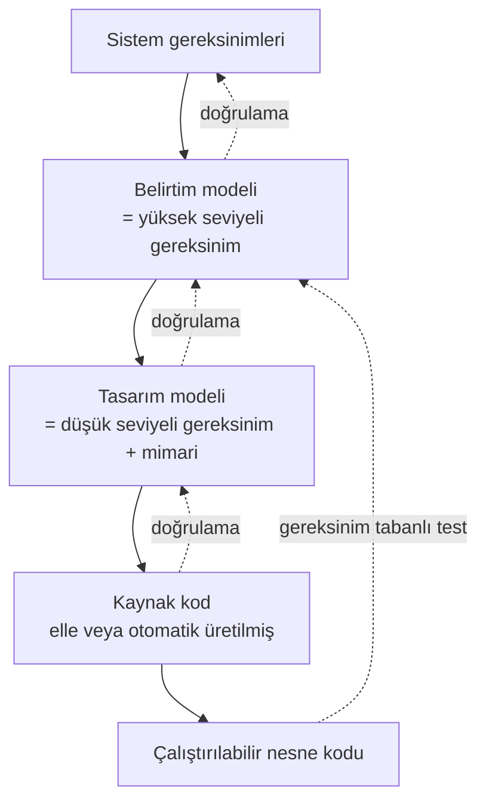

# 14. DO-331 ve Model Tabanlı Geliştirme ve Doğrulama

Model tabanlı geliştirme, gereksinim ve tasarımın bir model üzerinde ifade edilmesini
sağlar. Bu yaklaşım, özellikle karmaşık davranışların erken simülasyonla görülmesini
kolaylaştırır.

DO-331, modelin kendisinin ve modelden türetilen çıktının nasıl doğrulanacağını
tanımlar. Önemli nokta, modelin bir rahatlık aracı değil, izlenebilir bir mühendislik
artefaktı olarak ele alınmasıdır.

## Model neden kullanılır?

Model, davranışı soyut ama çalıştırılabilir biçimde ifade etmeye yardım eder. Bu sayede
ekipler tasarım kararlarını erken görür, senaryoları simüle eder ve gereksinim
uyumsuzluklarını daha kod yazmadan fark edebilir.

## Modelin rolü

Model üç farklı şekilde kullanılabilir:

- tasarım anlatımı,
- simülasyon kaynağı,
- kod üretim temeli.

Hangi rolün geçerli olduğu baştan açık olmalıdır. Çünkü her rol farklı doğrulama ihtiyacı
doğurur.

## DO-331 neye bakar?

DO-331, modelin:

- izlenebilir olup olmadığına,
- simülasyon davranışına,
- üretim çıktısının kontrolüne,
- model ile kaynak arasındaki tutarlılığa

odaklanır.

## Model türleri

DO-331'in en temel kavramsal katkısı, "model" sözcüğünün tek bir şey ifade etmediğini
netleştirmesidir. Bir model, yaşam döngüsünde hangi iş ürününün yerini alıyorsa o iş
ürünü gibi ele alınır. Bu bakışla iki ana tür ayrılır:

- **Belirtim modeli (specification model):** Yüksek seviyeli gereksinimin (high-level
  requirement) yerine geçer. Yazılımın *ne* yapması gerektiğini tanımlar; iç yapı,
  mimari ya da algoritma detayı içermez. Sistem gereksinimlerinden izlenebilir olmalı
  ve tıpkı metinsel bir gereksinim gibi gözden geçirilip doğrulanmalıdır.
- **Tasarım modeli (design model):** Düşük seviyeli gereksinimin (low-level
  requirement) ve/veya yazılım mimarisinin yerine geçer. Yazılımın *nasıl*
  gerçekleştirileceğini tanımlar; veri akışları, durum makineleri, blok şemaları gibi
  gerçekleştirmeye yakın detay içerir. Otomatik kod üretiminin girdisi genellikle bu
  modeldir.

Bu ayrımın pratikte kritik bir sonucu vardır: **bir model kendi kendisinin doğrulama
referansı olamaz.** Model hangi seviyeyi temsil ediyorsa, ona uygunluk bir üst
seviyedeki gereksinime göre gösterilir. Örneğin tasarım modeli kullanılıyorsa, onun
üstünde modelden bağımsız yüksek seviyeli gereksinimler bulunmalı ve model bu
gereksinimlere karşı doğrulanmalıdır. Aynı modeli hem gereksinim hem tasarım ilan edip
"model modele uygundur" demek, doğrulama zincirini kısa devre yapar; DO-331 bu tuzağı
açıkça kapatır.

| Model türü | Karşılık geldiği DO-178C iş ürünü | Neye karşı doğrulanır | Tipik içerik |
|---|---|---|---|
| Belirtim modeli | Yüksek seviyeli gereksinimler | Sistem gereksinimleri | Girdi/çıktı davranışı, modlar, işlevsel kurallar |
| Tasarım modeli | Düşük seviyeli gereksinimler + yazılım mimarisi | Yüksek seviyeli gereksinimler | Durum makineleri, veri/kontrol akışı, algoritmalar |

Modelin türü, doğrulama zincirinin şeklini doğrudan belirler:

Projede hangi türün kullanıldığı, planlama aşamasında (PSAC düzeyinde) açıkça beyan
edilmelidir. Deneyimde en sık görülen sorun, ekibin tek bir Simulink/SCADE modelini
fiilen hem gereksinim hem tasarım olarak kullanması, ama bunu hiçbir planda
adlandırmamasıdır. Sertifikasyon otoritesi ilk katılım aşamasında (Stage of
Involvement, SOI) bu soruyu sorar; cevap belirsizse tüm izlenebilirlik ve doğrulama
argümanı yeniden kurgulanmak zorunda kalır. Modelin türünü baştan yazılı hâle
getirmek, sonradan zincir onarmaktan çok daha ucuzdur.

## Model simülasyonu ve kredisi

Model simülasyonu (model simulation), modelin bir simülasyon ortamında çalıştırılarak
davranışının gözlemlenmesidir. DO-331 bunu yalnızca bir geliştirme kolaylığı olarak
değil, belirli koşullar altında **doğrulama kredisi (verification credit)**
alınabilecek, tanımlı ve disiplinli bir doğrulama aracı olarak tanır. "Kredi" burada şu anlama
gelir: normalde gözden geçirme, analiz ya da test ile kapatılacak bir doğrulama
hedefinin, simülasyon sonuçlarına dayanarak kapatılması.

Kredi alınabilmesi için simülasyon, serbest bir "modeli çalıştırıp bakma" etkinliği
olmaktan çıkarılmalıdır. Pratikte bu şu disiplini gerektirir:

- Simülasyon senaryoları, bir üst seviyedeki gereksinimlerden türetilir; yani
  gereksinim tabanlı test (requirement-based testing) mantığıyla yazılır.
- Her senaryonun beklenen sonucu ve geçti/kaldı ölçütü önceden tanımlanır.
- Senaryolar, prosedürler ve sonuçlar konfigürasyon yönetimi altına alınır ve
  gereksinimlere izlenebilirlik kurulur.
- Simülasyon senaryolarının kendisi de gözden geçirilir; yanlış senaryo, yanlış
  güven üretir.

Simülasyonun neye kredi sağlayıp neye sağlayamayacağı, en çok yanlış anlaşılan
konudur. Kaba bir özet:

| Doğrulama hedefi | Simülasyon kredisi | Not |
|---|---|---|
| Modelin bir üst seviye gereksinime uygunluğu | Evet, uygun koşullarda | Senaryolar üst seviye gereksinimlerden türetilmişse |
| Modelin doğruluğu ve tutarlılığının bir kısmı | Kısmen | Gözden geçirme ve analizle birlikte |
| Çalıştırılabilir nesne kodunun gereksinimlere uygunluğu | Hayır | Hedef ortam testi gerekir |
| Kaynak kod üzerinde yapısal kapsam analizi (structural coverage analysis) | Hayır | Model kapsamı, kod kapsamının yerine geçmez |
| Hedef donanımla uyumluluk (zamanlama, bellek, G/Ç) | Hayır | Yalnızca hedef üzerinde gösterilebilir |

Bunun nedeni **temsil yeteneğidir**: simülasyon ortamı, hedef ortamın yalnızca bir
yaklaşıklamasıdır. Masaüstü işlemcinin kayan nokta davranışı, çözücünün (solver) zaman
adımı, sıralama ve zamanlama varsayımları, donanım giriş/çıkışlarının idealize
edilmesi gibi farklar, modelde doğru görünen davranışın hedefte farklılaşmasına yol
açabilir. Bu yüzden krediye başvururken simülasyon ortamı ile hedef ortam arasındaki
farklar tanımlanmalı ve bu farkların doğrulanan özellik üzerinde etkisi olmadığı
gerekçelendirilmelidir. Gerekçelendirilemeyen her fark, o hedefin hedef ortam
testiyle kapatılması gerektiği anlamına gelir.

Ek olarak, model kapsam analizi (model coverage analysis) simülasyon senaryolarının
modeli ne ölçüde uyardığını ölçer ve eksik gereksinim ya da istenmeyen model öğesi
bulmaya yarar; ancak kaynak kod üzerindeki yapısal kapsam analizinin yerini almaz.
Otomatik kod üretimi olsa bile karar kapsama (decision coverage) ya da değiştirilmiş
koşul/karar kapsama (MC/DC) yükümlülüğü kod düzeyinde
devam eder — üretici araç kalifiye edilerek bazı kod doğrulama etkinliklerinden kredi
alınması ayrı bir konudur ve araç kalifikasyonu bölümünün kapsamına girer.

Deneyimden bir uyarı: simülasyon geri beslemesi hızlı olduğu için ekipler doğal
olarak ona güvenmeye başlar ve hedef testlerini "formalite" gibi görme eğilimi
oluşur. Zamanlama, kesme etkileşimi ve donanım arayüzü kaynaklı hataların neredeyse
tamamı yalnızca hedefte görünür. Simülasyon, hedef testinin *ikamesi* değil, ona
gelmeden önce hata sayısını düşüren bir *ön filtresi* olarak konumlandırılmalıdır.

## Model tabanlı akış örneği

- Modelde davranış tanımlanır.
- Simülasyonla erken hata aranır.
- Kod üretimi varsa üretilen kod ayrıca doğrulanır.

## Avantajlar

- davranış erken görülür,
- karmaşıklık daha düzenli ifade edilir,
- simülasyon geri beslemesi hızlıdır,
- bazı hata sınıfları koddan önce yakalanır.

## Riskler

Model, gereksinimden koparsa yanıltıcı olur. Ayrıca model ile üretilen kod arasında
tutarlılık korunmazsa otomasyon hata büyütebilir.

## Bu bölümden akılda kalması gerekenler

- Model, mühendislik artefaktı olarak yönetilmelidir.
- Modelin türü (belirtim mi tasarım mı) planlamada açıkça beyan edilmeli; bir model
  kendi kendisinin doğrulama referansı olamaz.
- Simülasyon erken hata yakalamaya yarar ve disiplinli yürütülürse bazı doğrulama
  hedefleri için kredi sağlayabilir.
- Simülasyon ortamı ile hedef ortam arasındaki farklar gerekçelendirilmedikçe
  simülasyon, hedef ortam testinin yerine geçmez.
- Model kapsam analizi, kod üzerindeki yapısal kapsam analizinin yerini almaz.
- Üretilen kod yine ayrıca doğrulanmalıdır.
