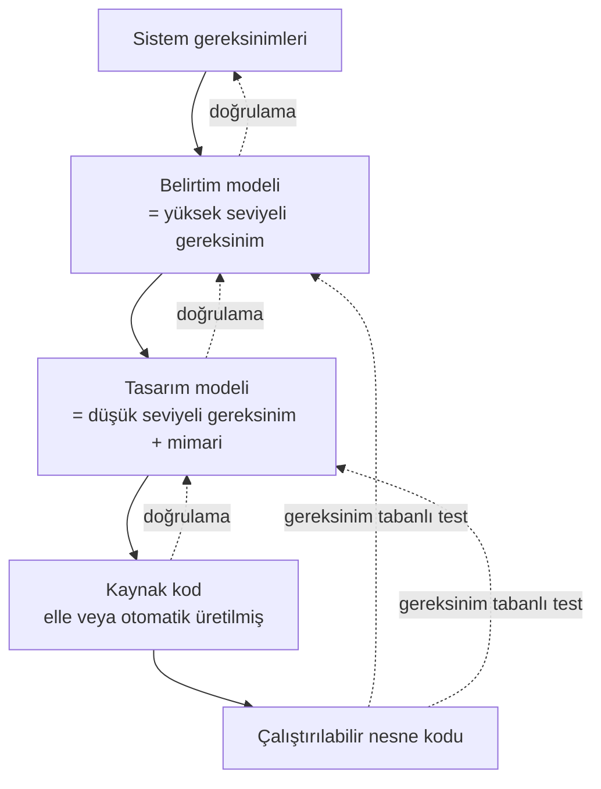
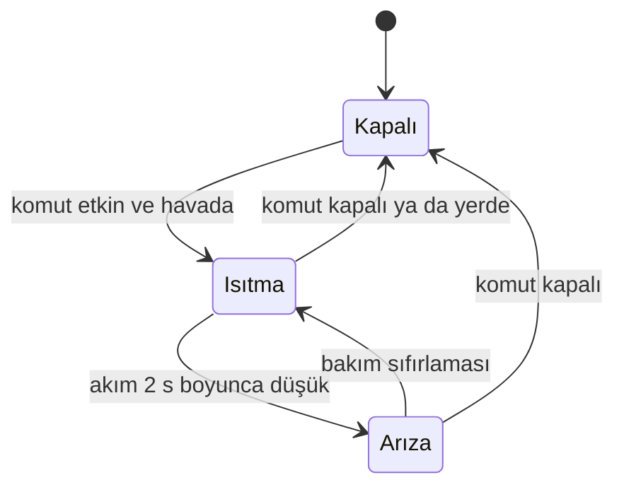

# 14. DO-331 ve Model Tabanlı Geliştirme ve Doğrulama

Model tabanlı geliştirme (model-based development), yazılım gereksinimlerinin ya da
tasarımının metin yerine bir modelle ifade edilmesidir; DO-331 bu durumda modelin hangi
yaşam döngüsü verisi sayılacağını, nasıl doğrulanacağını ve simülasyondan hangi
koşullarda doğrulama kredisi alınabileceğini tanımlar. Bu bölüm model türlerini,
planlama beklentilerini, simülasyon kredisini, model kapsam analizini ve model tabanlı
akışta kullanılan araçları ele alır.

DO-331'in tam adı "Model-Based Development and Verification Supplement to DO-178C and
DO-278A"dır; 2011'de DO-178C ile birlikte yayımlanmıştır ve EUROCAE karşılığı
ED-218'dir. Bir ek (supplement) olduğu için tek başına okunmaz: DO-178C'nin bölüm
yapısını izler, model kullanılan yerlerde ana belgenin metnine ekleme ve değişiklik
yapar, hedef (objective) tablolarına da modele özgü hedefler ekler. Yazılımın modelle
geliştirilmeyen kısımları için DO-178C olduğu gibi geçerlidir. Ekin ana fikri tek
cümleyle şudur: model bir rahatlık aracı değil, izlenebilir ve doğrulanması gereken bir
yazılım yaşam döngüsü verisidir (software life cycle data).

## Model tabanlı geliştirme ve DO-331'in kapsamı

Model, davranışı soyut ama çalıştırılabilir biçimde ifade eder. Durum makineleri, blok
şemaları ve veri akış diyagramları, uzun metin paragraflarının bıraktığı belirsizliği
azaltır; ekip tasarım kararlarını erken görür, senaryoları simüle eder ve gereksinim
uyumsuzluklarını daha kod yazılmadan fark edebilir. Modelden otomatik kod üretimi de
elle kodlamadan kaynaklanan hata sınıflarını daraltır. Bu kazanımların bir bedeli vardır:
model de metin kadar yanlış olabilir ve çalıştırılabildiği için "doğru görünme" gücü
metinden fazladır. DO-331'in bütün düzeni, bu yanıltıcı güveni disipline bağlamak
üzerine kuruludur.

Ek, model yazılım gereksinimlerinin ya da tasarımının yerini aldığında uygulanır; yani
kod o modelden geliştiriliyorsa (elle ya da otomatik) ya da doğrulama o modele
dayanıyorsa. Modeli kimin ürettiği bu sonucu değiştirmez: sistem mühendislerinin
hazırladığı bir model yazılımın geliştirilmesine temel oluyorsa eke tabidir. Yalnızca
kavram çalışması için kullanılan ve yaşam döngüsü verisi olarak sunulmayan bir model
kapsam dışında kalır; ancak "açıklama amaçlı" denen bir modelden kod yazılıyorsa bu
iddia geçerliliğini yitirir.

DO-331'in DO-178C'ye ekledikleri beş başlıkta toplanabilir; bölümün geri kalanı bu
sırayı izler:

- **Model türleri:** modelin hangi yaşam döngüsü verisinin yerini aldığı ve neye karşı
  doğrulanacağı.
- **Planlama ve modelleme standartları:** modelin planlarda beyanı, modelleme
  kuralları, model öğe kütüphaneleri ve model öğelerinin izlenebilirliği (traceability).
- **Model simülasyonu:** simülasyonun hangi doğrulama hedeflerine, hangi koşullarda
  kanıt sayılabileceği.
- **Model kapsam analizi:** gereksinim tabanlı doğrulamanın modeli ne ölçüde uyardığı
  ve uyarılmayan öğelerin nasıl çözümleneceği.
- **Araçlar:** simülatörün, kapsam aracının ve kod üretecinin (code generator) çıktısına ne zaman
  güvenilebileceği.

## Model türleri

DO-331'in en temel kavramsal katkısı, "model" sözcüğünün tek bir şey ifade etmediğini
netleştirmesidir. Bir model, yaşam döngüsünde hangi iş ürününün yerini alıyorsa o iş
ürünü gibi ele alınır. Bu bakışla iki ana tür ayrılır:

- **Belirtim modeli (specification model):** Yüksek seviyeli gereksinimin (high-level
  requirement) yerine geçer. Yazılımın *ne* yapması gerektiğini tanımlar; iç veri
  yapısı, iç veri akışı ya da kontrol akışı gibi tasarım ayrıntısı içermez. Sistem
  gereksinimlerinden izlenebilir olmalı ve tıpkı metinsel bir gereksinim gibi gözden
  geçirilip doğrulanmalıdır.
- **Tasarım modeli (design model):** Düşük seviyeli gereksinimin (low-level
  requirement) ve/veya yazılım mimarisinin yerine geçer. Yazılımın *nasıl*
  gerçekleştirileceğini tanımlar; veri akışları, durum makineleri, blok şemaları gibi
  gerçekleştirmeye yakın detay içerir. Kodun doğrudan kendisinden yazıldığı ya da
  üretildiği model tasarım modelidir; otomatik kod üretimi
  ([8. Yazılım Gerçekleştirme: Kodlama ve Entegrasyon](../03-do178c-ile-gelistirme/08-yazilim-gerceklestirme-kodlama-entegrasyon.md))
  bu modeli girdi alır.

Bu ayrımın pratikte kritik bir sonucu vardır: **bir model kendi kendisinin doğrulama
referansı olamaz.** Model hangi seviyeyi temsil ediyorsa, ona uygunluk bir üst
seviyedeki gereksinime göre gösterilir. Örneğin tasarım modeli kullanılıyorsa, onun
üstünde modelden bağımsız gereksinimler bulunmalı ve model bu gereksinimlere karşı
doğrulanmalıdır. Aynı modeli hem gereksinim hem tasarım ilan edip "model modele
uygundur" demek, doğrulama zincirini kısa devre yapar; DO-331 bu tuzağı açıkça kapatır:
bir model aynı anda hem belirtim hem tasarım modeli sayılamaz.

| Model türü | Karşılık geldiği DO-178C iş ürünü | Neye karşı doğrulanır | Tipik içerik |
|---|---|---|---|
| Belirtim modeli | Yüksek seviyeli gereksinimler | Yazılıma tahsis edilmiş sistem gereksinimleri | Girdi/çıktı davranışı, modlar, işlevsel kurallar |
| Tasarım modeli | Düşük seviyeli gereksinimler + yazılım mimarisi | Modelin geliştirildiği gereksinimler (çoğunlukla yüksek seviyeli gereksinimler) | Durum makineleri, veri/kontrol akışı, algoritmalar |

Modelin türü, doğrulama zincirinin şeklini doğrudan belirler. Aşağıdaki diyagram iki
modelin birlikte kullanıldığı düzeni gösterir; bu, olası düzenlerden yalnızca biridir.

```mermaid
flowchart TD
    SR["Sistem gereksinimleri"] --> SM["Belirtim modeli<br/>= yüksek seviyeli gereksinim"]
    SM --> DM["Tasarım modeli<br/>= düşük seviyeli gereksinim + mimari"]
    DM --> SC["Kaynak kod<br/>elle veya otomatik üretilmiş"]
    SC --> EOC["Çalıştırılabilir nesne kodu"]
    SM -. doğrulama .-> SR
    DM -. doğrulama .-> SM
    SC -. doğrulama .-> DM
    EOC -. gereksinim tabanlı test .-> SM
    EOC -. gereksinim tabanlı test .-> DM
```

Çalıştırılabilir nesne kodu (executable object code) yalnızca yüksek seviyeli
gereksinimlere karşı test edilmez; Seviye A, B ve C'de düşük seviyeli gereksinimlere,
yani bu düzende tasarım modeline dayalı testler de beklenir.

Projede hangi türün kullanıldığı planlama aşamasında açıkça beyan edilmelidir.
Deneyimde en sık görülen sorun, ekibin tek bir Simulink/SCADE modelini fiilen hem
gereksinim hem tasarım olarak kullanması, ama bunu hiçbir planda adlandırmamasıdır.
Sertifikasyon otoritesi ilk katılım aşaması (Stage of Involvement, SOI) denetiminde bu
soruyu sorar; cevap belirsizse tüm izlenebilirlik ve doğrulama argümanı yeniden
kurgulanmak zorunda kalır. Modelin türünü baştan yazılı hâle getirmek, sonradan zincir
onarmaktan çok daha ucuzdur.

### Modelin geliştirildiği gereksinimler ve tipik düzenler

"Bir üst seviye" her projede aynı veri değildir. DO-331 bunun için daha genel bir
kavram kullanır: **modelin geliştirildiği gereksinimler** (requirements from which the
model is developed). Model neyin üzerine kurulduysa ona karşı doğrulanır, simülasyon
senaryoları oradan türetilir ve model öğeleri oraya izlenir. Ek, modelin yaşam
döngüsüne nereden girdiğine göre değişen örnek düzenler verir; pratikte karşılaşılan
başlıcaları şöyle özetlenebilir:

| Düzen | Modelin geliştirildiği gereksinimler | Model ve yerini aldığı veri | Dikkat edilecek nokta |
|---|---|---|---|
| Metinsel gereksinim + tasarım modeli | Metinsel yüksek seviyeli gereksinimler | Tasarım modeli: düşük seviyeli gereksinimler ve mimari | En yaygın düzen; gereksinimler modele bakılarak değil, modelden bağımsız yazılmalıdır |
| Belirtim modeli + tasarım modeli | Belirtim modeli için sistem gereksinimleri; tasarım modeli için belirtim modeli | İki ayrı model, iki ayrı veri | İkinci model birincinin kopyası olmamalı; iki model ayrı ayrı doğrulanır |
| Belirtim modeli + metinsel tasarım | Sistem gereksinimleri | Belirtim modeli: yüksek seviyeli gereksinimler | Tasarım ve kod için DO-178C olduğu gibi uygulanır |
| Sistem gereksinimi + tasarım modeli | Yazılıma tahsis edilmiş sistem gereksinimleri | Tasarım modeli; yazılım ya da sistem süreçlerinde üretilmiş olabilir | Arada ayrı bir yazılım gereksinim katmanı yoktur; sistem ve yazılım verisinin sınırı planlarda çizilmelidir |

Son düzen, kontrol yasalarını sistem mühendislerinin modellediği projelerde sık görülür
ve en çok soru doğuran düzendir. Model sistem ekibinde doğar, yazılım ekibi ondan kod
üretir; aynı veri iki tarafa da hizmet ettiği için kimin neyi doğruladığı kolayca
belirsizleşir. Bu durumda iki şey netleştirilmelidir. Birincisi, modelin üstündeki
gereksinimler yüksek seviyeli gereksinimlerin yükünü taşır: modelden bağımsız yazılmış,
gözden geçirilmiş ve test durumu (test case) türetilebilecek kadar ayrıntılı olmalıdır.
"Kontrol yasası modeldeki gibidir" diyen bir gereksinim, modeli yine kendi referansı
yapar. İkincisi, modelin sahipliği, konfigürasyon kontrolü ve değişiklik akışı planlarda
tanımlanmalıdır: sistem ekibinin modelde yaptığı her değişiklik artık bir yazılım
tasarım değişikliğidir. Sistem ve yazılım süreçleri arasındaki veri alışverişi
[2. Sistem Bağlamında Yazılım](../02-baglam/02-sistem-baglaminda-yazilim.md), gereksinim
katmanlarının ayrımı ise
[6. Yazılım Gereksinimleri](../03-do178c-ile-gelistirme/06-yazilim-gereksinimleri.md)
bölümünde anlatılmıştır.

## Planlama ve modelleme standartları

Model tabanlı akışın kararları planlara yazılır
([5. Yazılım Planlama](../03-do178c-ile-gelistirme/05-yazilim-planlama.md)). Yazılım
sertifikasyon planı (Plan for Software Aspects of Certification, PSAC) hangi yazılım
bileşenlerinde model kullanıldığını, her modelin türünü ve yerini aldığı veriyi,
simülasyondan kredi istenip istenmediğini ve araçların kalifikasyon durumunu beyan
eder. Yazılım geliştirme planı (Software Development Plan, SDP) modelleme ortamını —
araç, sürüm, kod üretim ayarları — tanımlar ve uygulanacak modelleme standartlarına
atıf yapar. Yazılım doğrulama planı (Software Verification Plan, SVP) modelin nasıl
doğrulanacağını, simülasyon ortamını ve hedeften farklarını, model kapsam ölçütlerini
ve kapsam boşluklarının nasıl çözümleneceğini yazar. Planlama denetiminde
([SW SOI-1](../kaynaklar/soi-1.md)) plan ve standartlara yöneltilen her soru, model
kullanan projede model için de yanıtlanır.

**Yazılım modelleme standartları (software model standards),** gereksinim, tasarım ve
kodlama standartlarının yanına eklenen dördüncü standart türüdür. Modelleme dilleri ve
araçları, emniyet-kritik kullanım için uygun olmayan pek çok özellik barındırır; standart
bunların hangilerine izin verildiğini söyler. Tipik içerik:

- izin verilen ve yasaklanan model öğeleri ile araç ayarları (örneğin örtük veri tipi
  dönüşümü, yürütme sırasını araca bırakan yapılar, değişken adımlı çözücü (solver));
- adlandırma, yerleşim ve karmaşıklık sınırları (iç içe düzey sayısı, bir diyagramdaki
  öğe sayısı, bir durum makinesindeki geçiş sayısı);
- gereksinim ya da tasarım ifade eden öğelerin, açıklama notu gibi bilgi amaçlı
  öğelerden nasıl ayırt edileceği;
- izlenebilirliğin hangi birimle (blok, alt sistem, durum, geçiş) kurulacağı ve
  türetilmiş gereksinimlerin nasıl işaretleneceği.

Belirtim modeli ile tasarım modeli farklı soyutlama düzeyinde olduğundan, ikisi de
kullanılıyorsa her biri için ayrı kurallar gerekir. Standarda uygunluk bir doğrulama
hedefidir; kural denetimi araçla otomatikleştirilebilir, ancak aracın denetlemediği
kurallar gözden geçirmeyle kapatılır.

**Model öğe kütüphaneleri (model element libraries)** ayrı bir dikkat ister. Bir
kütüphane bloğu modele konduğunda davranışı modelin, üretilen kodu da uçuş yazılımının
parçası olur. Bu yüzden kullanılan her kütüphane öğesi, modelin yazılım seviyesine uygun
biçimde geliştirilmiş ve doğrulanmış olmalıdır: ne yaptığını tanımlayan bir gereksinimi,
doğrulama kanıtı ve konfigürasyon kontrolü vardır. Bu güvenceye sahip olmayan ya da
projede kullanılmayan öğeler ya kütüphaneden çıkarılır ya da modelleme standardıyla
yasaklanır. Araçla birlikte gelen hazır blokları "aracın parçası" sayıp doğrulama
dışında bırakmak, derleyici kütüphanelerini hesaba katmamakla aynı hatadır.

**İzlenebilirlik** model öğesi düzeyinde kurulur: her öğe ya da anlamlı
öğe grubu, modelin geliştirildiği gereksinimlerden birine izlenir. Hiçbir gereksinime
izlenemeyen bir model öğesi için iki olasılık vardır. Öğe gerekliyse — örneğin bir
sayacın taşmasını önleyen sınırlama — bir türetilmiş gereksinimdir (derived
requirement): gerekçesiyle kaydedilir ve sistem süreçlerine, sistem emniyet
değerlendirmesi dahil, geri bildirilir. Gerekli değilse istenmeyen işlevdir ve modelden
kaldırılır. Tasarım modeli için beklenen tasarım niteliklerinin kendisi
[7. Yazılım Tasarımı](../03-do178c-ile-gelistirme/07-yazilim-tasarimi.md) bölümündekilerle
aynıdır; model yalnızca gösterimi değiştirir.

## Model simülasyonu ve kredisi

Model simülasyonu (model simulation), modelin bir simülasyon ortamında çalıştırılarak
davranışının gözlemlenmesidir. DO-331 bunu yalnızca bir geliştirme kolaylığı olarak
değil, belirli koşullar altında **doğrulama kredisi (verification credit)**
alınabilecek, tanımlı ve disiplinli bir doğrulama yöntemi olarak tanır. "Kredi" burada
şu anlama gelir: normalde gözden geçirme, analiz ya da test ile kapatılacak bir
doğrulama hedefinin, simülasyon sonuçlarına dayanarak kapatılması.

Kredi alınabilmesi için simülasyon, serbest bir "modeli çalıştırıp bakma" etkinliği
olmaktan çıkarılmalıdır. Pratikte bu şu disiplini gerektirir:

- Simülasyon senaryoları, modelin geliştirildiği gereksinimlerden türetilir; yani
  gereksinim tabanlı test (requirements-based testing) mantığıyla yazılır.
- Her senaryonun beklenen sonucu ve geçti/kaldı ölçütü önceden tanımlanır; beklenen
  sonuç modelin çıktısından değil, gereksinimden üretilir.
- Senaryolar, prosedürler ve sonuçlar konfigürasyon yönetimi altına alınır ve
  gereksinimlere izlenebilirlik kurulur.
- Simülasyon senaryolarının kendisi de gözden geçirilir; yanlış senaryo, yanlış
  güven üretir.

Son madde bir tavsiye olmanın ötesindedir: kredi alınan simülasyonda senaryolar,
prosedürler ve sonuçlar doğrulama verisidir ve DO-331 bunların doğruluğunu ayrı hedefler
olarak arar; tıpkı test durumlarının ve test sonuçlarının doğruluğunun aranması gibi.

Simülasyonun neye kredi sağlayıp neye sağlayamayacağı, en çok yanlış anlaşılan
konudur. Kaba bir özet:

| Doğrulama hedefi | Simülasyon kredisi | Not |
|---|---|---|
| Modelin, geliştirildiği gereksinimlere uygunluğu | Evet, uygun koşullarda | Senaryolar o gereksinimlerden türetilmişse |
| Modelin doğruluğu, tutarlılığı ve algoritmalarının doğruluğu | Kısmen | Gözden geçirme ve analizle birlikte |
| Modelin modelleme standartlarına uygunluğu ve izlenebilirliği | Hayır | Gözden geçirme ya da analizle gösterilir |
| Çalıştırılabilir nesne kodunun yüksek seviyeli gereksinimlere uygunluğu | Kısmen, sıkı koşullarda | Yalnızca tasarım modeli simülasyonu; testle ve fark analiziyle birlikte |
| Çalıştırılabilir nesne kodunun düşük seviyeli gereksinimlere (tasarım modeline) uygunluğu | Hayır | Senaryolar modelin üstündeki gereksinimlerden türetilir; modele dayalı testin yerini tutmaz |
| Kod üzerindeki yapısal kapsam analizi (structural coverage analysis) | Model kapsamıyla karşılanmaz | Yapısal kapsam kod üzerinde ölçülür; model üzerinde ölçülen kapsam onun yerine geçmez |
| Hedef donanımla uyumluluk (zamanlama, bellek, G/Ç) ve donanım/yazılım entegrasyonu | Hayır | Yalnızca hedef üzerinde gösterilebilir |

Çalıştırılabilir nesne kodunun doğrulanması esas olarak hedef ortamda testle yapılır
([9. Yazılım Doğrulama](../03-do178c-ile-gelistirme/09-yazilim-dogrulama.md)). DO-331,
tasarım modeli simülasyonunun bu test hedeflerinin bir kısmına, testle ve özel
analizlerle birlikte kullanıldığında *kısmi* katkı verebileceğini kabul eder. Böyle bir
kredi isteği en azından şunları göstermelidir: simüle edilen model, kodun üretildiği
modelin aynısıdır; senaryolar modelin geliştirildiği gereksinimlerden türetilmiştir;
simülasyon ortamı ile hedef arasındaki farklar analiz edilmiştir; hangi test hedefinin
hangi ölçüde simülasyonla desteklendiği planlarda yazılmış ve otoriteyle
kararlaştırılmıştır. Kredi iki yerde kesin olarak durur. Simülasyon senaryoları modelin
üstündeki gereksinimlerden türetilir ve çalıştırılan şey kod değil modeldir; bu yüzden
düşük seviyeli gereksinimlere, yani tasarım modeline dayalı testlerin ve bu testlerin
kapsamının yerini simülasyon tutamaz. Hedef bilgisayarla uyumluluğu ve donanım/yazılım
entegrasyonunu gösteren testler de her durumda hedefte yapılır.

Hedefe ilişkin sınırın nedeni **temsil yeteneğidir**: simülasyon ortamı, hedef ortamın
yalnızca bir yaklaşıklamasıdır. Masaüstü işlemcinin kayan nokta davranışı, çözücünün zaman
adımı, sıralama ve zamanlama varsayımları, donanım giriş/çıkışlarının idealize
edilmesi gibi farklar, modelde doğru görünen davranışın hedefte farklılaşmasına yol
açabilir. Bu yüzden krediye başvururken simülasyon ortamı ile hedef ortam arasındaki
farklar tanımlanmalı ve bu farkların doğrulanan özellik üzerinde etkisi olmadığı
gerekçelendirilmelidir. Gerekçelendirilemeyen her fark, o hedefin hedef ortam
testiyle kapatılması gerektiği anlamına gelir.

Deneyimden bir uyarı: simülasyon geri beslemesi hızlı olduğu için ekipler doğal
olarak ona güvenmeye başlar ve hedef testlerini "formalite" gibi görme eğilimi
oluşur. Zamanlama, kesme etkileşimi ve donanım arayüzü kaynaklı hatalar ise çoğunlukla
ancak hedefte ortaya çıkar. Simülasyon, hedef testinin *ikamesi* değil, ona gelmeden
önce hata sayısını düşüren bir *ön filtresi* olarak konumlandırılmalıdır.

## Model kapsam analizi

Model kapsam analizi (model coverage analysis), gereksinim tabanlı doğrulamanın —
simülasyon senaryolarının ya da testlerin — tasarım modelini ne ölçüde uyardığını
ölçer. Sorduğu soru şudur: modelin geliştirildiği gereksinimlerden türetilen senaryolar
koşulduğunda, modelin ifade ettiği davranışlardan hangileri hiç çalışmadı? Uyarılmayan
bir geçiş ya da dal, o davranışı kimsenin istemediğinin ya da kimsenin denemediğinin
işaretidir. DO-331 bu analizi tasarım modelleri için tanımlar: kodun geliştirildiği
veri tasarım modelidir ve istenmeyen işlev koda oradan taşınır.

Model kapsamının tek bir hazır tanımı yoktur; ölçütü proje belirler ve SVP'de yazar.
Tipik ölçütler durum makinelerinde her durumun ve her geçişin, mantık ifadelerinde her
kararın ve koşulun, sayısal girdilerde eşdeğerlik sınıflarının ve sınır değerlerin,
anahtarlama ve doygunluk gibi öğelerde her çalışma kolunun uyarılmasıdır. Ölçüt araçtan
araca değiştiği için "model kapsamı tam" cümlesi, hangi ölçüte göre tam olduğu
söylenmeden bir şey ifade etmez.

Kapsanmayan her model öğesi tek tek çözümlenir. Olası nedenler ve karşılıkları:

- **Senaryo eksikliği:** Öğe bir gereksinime izleniyor ama hiçbir senaryo onu
  tetiklememiş. Yeni ya da genişletilmiş senaryo yazılır.
- **Gereksinim eksikliği:** Öğe gerekli bir davranışı ifade ediyor ama modelin
  geliştirildiği gereksinimlerde bu davranış yazmıyor. Önce gereksinim tamamlanır,
  sonra senaryosu eklenir.
- **Türetilmiş gereksinim:** Öğe, tasarımın gerektirdiği ve üst seviyeye izlenemeyen bir
  davranıştır. Türetilmiş gereksinim olarak kaydedilir, sistem süreçlerine bildirilir ve
  kendi senaryosuyla doğrulanır.
- **Devre dışı bırakılmış işlev:** Öğe tasarım gereği bu konfigürasyonda çalışmaz.
  Gerekçesi kaydedilir ve istem dışı etkinleşemeyeceği gösterilir.
- **İstenmeyen işlev:** Öğenin hiçbir dayanağı yoktur. Modelden kaldırılır.

Bu sınıflandırma, kod üzerindeki yapısal kapsam boşluklarının çözümlenmesiyle aynı
mantığı izler
([9. Yazılım Doğrulama](../03-do178c-ile-gelistirme/09-yazilim-dogrulama.md) ve
[17. Kapsanmayan Kodlar: Ölü, Gereksiz ve Devre Dışı Bırakılmış Kodlar](../05-ozel-konular/17-kapsanmayan-kodlar.md));
fark, sorunun kod yazılmadan önce yakalanmasıdır. Ancak model kapsam analizi kod
üzerindeki yapısal kapsam analizinin yerini almaz. Üretilen ya da elle yazılan kod,
modelde karşılığı olmayan yapılar içerebilir: kod üretecinin eklediği koruma dalları,
kütüphane işlevleri, elle yazılmış arayüz kodu. Otomatik kod üretimi olsa bile satır
kapsama (statement coverage), karar kapsama (decision coverage) ya da değiştirilmiş
koşul/karar kapsama (modified condition/decision coverage, MC/DC) yükümlülüğü, yazılım
seviyesinin gerektirdiği ölçüde, kod düzeyinde devam eder. Model kapsamı tam olan bir
projede kod kapsamındaki boşluklar azalır, ama ölçüm yine kod üzerinde yapılır.

## Model tabanlı akışta araçlar

Model tabanlı akış araçsız yürümez; her aracın çıktısına ne kadar güvenildiği de bir
sertifikasyon sorusudur. Kural diğer araçlarla aynıdır: araç bir süreci kaldırıyor,
azaltıyor ya da otomatikleştiriyorsa ve çıktısı ayrıca doğrulanmıyorsa araç
kalifikasyonu (tool qualification) gerekir. Ölçütler ve araç kalifikasyon seviyeleri
[13. DO-330 ve Yazılım Aracı Kalifikasyonu](./13-do330-arac-kalifikasyonu.md)
bölümünde anlatılmıştır; model tabanlı akışın tipik araçları şöyle değerlendirilir:

| Araç | Yapabileceği hata | Kalifikasyon ne zaman gündeme gelir | Tipik sınıflandırma |
|---|---|---|---|
| Kod üreteci | Modele aykırı ya da modelde olmayan kod üretir | Üretilen kodun modele karşı doğrulanması azaltılıyor ya da kaldırılıyorsa | Ölçüt 1 |
| Simülatör | Modelin davranışını yanlış hesaplar, hatalı modeli doğru gösterir | Simülasyon sonucundan kredi alınıyor ve sonuç başka yolla doğrulanmıyorsa | Çoğunlukla Ölçüt 3 |
| Model kapsam aracı | Uyarılmamış öğeyi kapsanmış gösterir | Kapsam raporu ayrıca doğrulanmadan kanıt olarak kullanılıyorsa | Ölçüt 3 |
| Modelleme standardı denetleyicisi | Kural ihlalini gözden kaçırır | Aracın denetlediği kurallar için gözden geçirme yapılmıyorsa | Ölçüt 3 |

Simülatörde sınıflandırma kullanım biçimine bağlıdır: simülasyon sonucu, aracın
otomatikleştirdiği faaliyetin ötesinde başka bir geliştirme ya da doğrulama sürecini
azaltmanın gerekçesi yapılıyorsa Ölçüt 2 tartışması açılır. Hangi ölçütün neden
seçildiği PSAC'ta gerekçelendirilir. DO-330'un açıklayıcı soru-yanıtları simülatör için
bir ayrım daha yapar: simülasyon yalnızca modelin doğrulanmasında kullanılıyor ve
sonuçlar, senaryolarda önceden tanımlanmış beklenen sonuçlara karşı doğrulanıyorsa
başvuru sahibi simülatörü kalifiye etmemeyi önerebilir. Sonuçların karşılaştırılmasını
ya da prosedür üretimini otomatikleştiren işlevler ise, çıktıları ayrıca doğrulanmıyorsa
kalifikasyon ister.

Kod üreteci için iki strateji vardır. Kalifiye edilmemiş üreteçte üretilen kod elle
yazılmış kod gibi ele alınır: tasarım modeline karşı gözden geçirilir, analiz edilir ve
test edilir. Kalifiye üreteçte ise üretilen kaynak kodun tasarım modeline uygunluğunu
gösteren gözden geçirme ve analizlerden kredi istenir. Bu kredinin üç sınırı vardır.
Birincisi, üreteç Ölçüt 1 aracıdır; Seviye A yazılımda bu, en ağır kalifikasyon
seviyesi demektir. İkincisi, kredi üretecin kalifiye edildiği ayarlar ve model öğeleri
alt kümesiyle sınırlıdır; modelleme standardı bu alt kümeyi zorunlu kılmalıdır.
Üçüncüsü, kalifikasyon üretecin çıktısında, yani kaynak kodda biter: derleyici ve
bağlayıcı kapsam dışındadır. Çalıştırılabilir nesne kodunun hedefte test edilmesi,
donanım/yazılım entegrasyonu, kod üzerindeki yapısal kapsam, en kötü durum yürütme
süresi ve yığın kullanımı analizleri yerinde durur. DO-330'un açıklayıcı soru-yanıtları,
kalifiye üreteçle düşük seviyeli gereksinimlere dayalı testlerin ve yapısal kapsam
analizinin amaçlarına hangi ek analizlerle başka yoldan ulaşılabileceğini senaryolarla
tartışır; bunlar rehber değil açıklamadır ve her biri otoriteyle mutabakat ister.
Üretecin girdisinin üstündeki gereksinimlere dayalı testler, entegrasyon testleri ve
derleyicinin eklediği kodun doğrulanması her senaryoda projede kalır.

Araçlarla ilgili gözden kaçan bir ayrıntı daha vardır: simülatör modeli çoğu zaman
yorumlayarak ya da simülasyona özgü bir kod üreterek çalıştırır; bu, uçuş için üretilen
kodla aynı kod değildir. Simülasyonun gösterdiği, modelin davranışıdır. Üretilen kodun
aynı davranışı sergilediği ayrıca — kalifiye üreteçle, kodun doğrulanmasıyla ve hedef
testleriyle — gösterilir.

## Çalışılmış örnek: ısıtıcı mod mantığı

Aşağıdaki kurgusal örnek, en yaygın düzeni — metinsel yüksek seviyeli gereksinimler ve
onlardan geliştirilen bir tasarım modeli — baştan sona izler. İşlev, bir ısıtıcı
çıkışını denetleyen küçük bir mod mantığıdır. Yüksek seviyeli gereksinimler metin
olarak yazılmıştır:

- **G-1:** Isıtma komutu etkinken ve uçak havadayken ısıtıcı çıkışı etkinleştirilir;
  bu iki koşuldan biri ortadan kalktığında çıkış kesilir.
- **G-2:** Çıkış etkinken ölçülen ısıtıcı akımı kesintisiz 2 saniye boyunca alt sınırın
  altında kalırsa çıkış kesilir ve arıza bildirilir.
- **G-3:** Arıza bildirimi, ısıtma komutu kapatılana dek korunur.

Tasarımcı bu gereksinimlerden bir durum makinesi geliştirir. Model tasarım modelidir:
durumlar, geçişler ve 2 saniyelik sayacın nasıl tutulduğu tasarım kararlarıdır.

```mermaid
stateDiagram-v2
    state "Kapalı" as Kapali
    state "Isıtma" as Isitma
    state "Arıza" as Ariza
    [*] --> Kapali
    Kapali --> Isitma: komut etkin ve havada
    Isitma --> Kapali: komut kapalı ya da yerde
    Isitma --> Ariza: akım 2 s boyunca düşük
    Ariza --> Kapali: komut kapalı
    Ariza --> Isitma: bakım sıfırlaması
```

Doğrulama mühendisi modele değil gereksinimlere bakarak simülasyon senaryolarını yazar;
beklenen sonuçlar da gereksinimlerden çıkar:

| Senaryo | Gereksinim | Uyarım | Beklenen sonuç |
|---|---|---|---|
| S1 | G-1 | Yerde komut etkinleştirilir, ardından uçak havalanır | Çıkış yerdeyken kapalı kalır, havalanınca etkinleşir |
| S2 | G-1 | Isıtma sürerken komut kapatılır | Çıkış kesilir, arıza bildirilmez |
| S3 | G-2 | Akım 1,9 saniye düşük kalır, sonra normale döner | Çıkış etkin kalır, arıza bildirilmez |
| S4 | G-2, G-3 | Akım kesintisiz 2 saniye düşük kalır; komut etkin tutulur | Çıkış kesilir ve arıza bildirilir; komut etkin kaldıkça bildirim korunur |
| S5 | G-3 | Arıza durumundayken komut kapatılır | Arıza bildirimi kalkar, çıkış kapalıdır |

Beş senaryo da geçer. Ekip burada durursa model "doğrulanmış" görünür; oysa model
kapsam analizi iki boşluk gösterir:

- *Isıtma* durumundan *Kapalı* durumuna geçişin "yerde" koşulu hiç uyarılmamıştır. Öğe
  G-1'e izlenir; sorun senaryo eksikliğidir. Isıtma sürerken inişi deneyen bir senaryo
  eklenir.
- *Arıza* durumundan *Isıtma* durumuna "bakım sıfırlaması" geçişi hiç uyarılmamıştır ve
  hiçbir gereksinime izlenmez. Tasarımcı bunu bakım kolaylığı için eklemiştir. Geçiş
  yalnızca izlenemeyen bir öğe değildir; G-3'ün tanımladığı davranışı da değiştirir. Bu
  yüzden tasarım içinde çözülemez: ya gereksinim sahiplerine götürülür ve emniyet etkisi
  değerlendirilerek gereksinim değiştirilir, ya da geçiş modelden kaldırılır.

İkinci boşluk, model kapsam analizinin varlık nedenini gösterir: bütün gereksinim tabanlı
senaryolar geçtiği hâlde modelde kimsenin istemediği bir işlev durmaktadır ve hiçbir
senaryo ona dokunmadığı için simülasyon bunu kendiliğinden ortaya çıkarmaz.

Model düzeltildikten sonra kod üretilir. Üreteç kalifiye değilse üretilen kod modele
karşı gözden geçirilir. Ardından çalıştırılabilir nesne kodu hedefte test edilir:
gereksinimlerden türetilen test durumları ile tasarım modeline dayalı test durumları
hedefte koşulur, yapısal kapsam bu testler sırasında kod üzerinde ölçülür. Hedefin
simülasyona eklediği bilgi somuttur. Simülasyonda 2 saniye ideal bir zaman adımıyla
sayılır ve akım kusursuz bir sinyaldir; hedefte ise süre görevin gerçek çalışma
periyoduyla sayılır ve akım ölçümü, çıkış etkinleştikten sonra bir süre oturmamış
olabilir. G-2'nin bu koşullarda da sağlandığı ancak hedefte gösterilebilir.

## Sık yapılan hatalar

- **Tek modele iki rol yüklemek.** Aynı model hem gereksinim hem tasarım olarak
  kullanılır; doğrulama modelin kendisiyle karşılaştırılmasına dönüşür.
- **Gereksinimi modelden geri yazmak.** Önce model kurulur, sonra modelin yaptığı metne
  dökülüp "gereksinim" diye adlandırılır. Böyle bir gereksinim modeldeki hatayı da
  içerir; ondan türetilen senaryolar hatayı doğrular.
- **Beklenen sonucu modelden üretmek.** Senaryo modelde koşulur, çıkan değer beklenen
  sonuç olarak kaydedilir. Bu, regresyon (regression) denetimi için işe yarar ama
  gereksinime uygunluk kanıtı değildir.
- **Kütüphane bloklarını doğrulama dışında bırakmak.** Hazır blokların davranışı ve
  ürettikleri kod, uçuş yazılımının parçasıdır.
- **Model ile kod arasındaki bağı koparmak.** Üretilen koda elle dokunmak ya da modelin
  hangi sürümünden, hangi üreteç ayarlarıyla kod üretildiğini kaydetmemek, model
  üzerindeki bütün doğrulamayı o kod için geçersiz kılar.
- **Model kapsamını kod kapsamının, simülasyonu hedef testinin yerine sunmak.** İkisi
  de erken hata yakalar; ikisi de kod ve hedef üzerindeki kanıtın yerini tutmaz.

## Bu bölümden akılda kalması gerekenler

- DO-331 tek başına okunmaz; DO-178C'nin hedeflerine, model kullanılan yerlerde ekleme
  ve değişiklik yapar. Model, izlenebilir ve doğrulanması gereken bir yaşam döngüsü
  verisidir.
- Modelin türü (belirtim mi tasarım mı) planlarda açıkça beyan edilmeli; bir model
  kendi kendisinin doğrulama referansı olamaz ve her zaman, geliştirildiği gereksinimlere
  karşı doğrulanır.
- Modelleme standartları, model öğe kütüphanelerinin doğrulanması ve model öğesi
  düzeyinde izlenebilirlik planlama verisidir; izlenemeyen ama gerekli öğe türetilmiş
  gereksinimdir.
- Simülasyon, disiplinli yürütülürse modelin doğrulanmasında kredi sağlar;
  çalıştırılabilir nesne kodunun test hedeflerine ise en çok kısmi kredi sağlar ve hedef
  ortam testini tümüyle ikame etmez.
- Model kapsam analizi tasarım modelindeki istenmeyen işlevi ve eksik gereksinimi erken
  yakalar; kod üzerindeki yapısal kapsam analizinin yerini almaz.
- Simülatör, kapsam aracı ve kod üreteci için kalifikasyon sorusu, çıktılarına ne kadar
  güvenildiğine göre yanıtlanır; kalifiye kod üreteci bile hedef testlerini ve yapısal
  kapsamı ortadan kaldırmaz.
