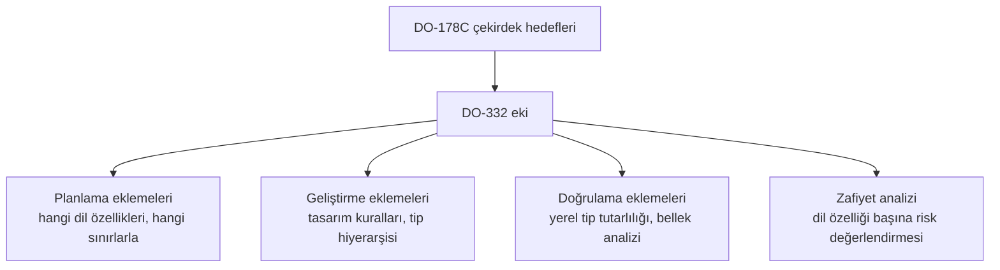

# 15. DO-332 ve Nesne Yönelimli Teknoloji ve İlgili Teknikler

Nesne yönelimli teknikler, soyutlama ve yeniden kullanım sağlasa da, kalıtım
(inheritance) ve çok biçimlilik (polymorphism) gibi özellikler doğrulama
açısından yeni riskler getirir. DO-332 bu
risklerin nasıl ele alınacağını anlatır.

Bu bölümde amaç, nesne yönelimli tasarımın kendisini reddetmek değil; bu yaklaşımın
hangi denetimlerle güvenli biçimde kullanılabileceğini özetlemektir.

## Neden özel dikkat gerekir?

Nesne yönelimli teknikler, kodu düzenlemeyi kolaylaştırır; ancak davranışın hangi alt
sınıfta nasıl değiştiğini anlamayı zorlaştırabilir. Özellikle çok biçimlilik, görünürde
aynı arayüzün farklı davranışlar üretmesine neden olur.

## DO-332 yaklaşımı

DO-332, nesne yönelimli yapıların şu yönlerini değerlendirir:

- kalıtım ilişkileri,
- arayüz sözleşmeleri,
- çok biçimlilik etkileri,
- tekrar kullanılabilirlik ile denetlenebilirlik dengesi.

Amaç, esnekliği korurken davranış belirsizliğini artırmamaktır.

## Tasarım denetimleri

Güvenli kullanım için genellikle:

- kalıtım derinliği sınırlandırılır,
- temel sınıf sözleşmesi net yazılır,
- yan etkiler görünür hale getirilir,
- alt sınıf davranışı test edilir.

### Nesne yönelimli kullanım örneği

Bir uçuş modülü ortak arayüz üzerinden farklı sensör sınıflarını kullanabilir. Bu
durumda:

- arayüz davranışı sabit tutulur,
- kalıtım zinciri sınırlandırılır,
- testler alt sınıf etkilerini kapsar.

## Havacılıkta nesne yönelimli teknolojinin kullanımı

Nesne yönelimli programlama, 1990'ların ortasından itibaren yer sistemlerinde ve
kabin/eğlence gibi düşük kritiklikli alanlarda hızla yaygınlaştı. Emniyet-kritik
uçuş yazılımına girişi ise çok daha temkinli oldu; çünkü dönemin geçerli rehberi
olan DO-178B; kalıtım, çok biçimlilik ve dinamik bağlama (dynamic binding) gibi
mekanizmaları hiç öngörmüyordu. Proje ekipleri
C++ veya Ada 95 kullanmak istediğinde, sertifikasyon otoriteleri her seferinde
projeye özel sorular soruyor, her başvuru sahibi (applicant) aynı tartışmaları
yeniden yaşıyordu.

Tartışmaların odağında birkaç somut doğrulama sorunu vardı:

- **Dinamik bağlama ve yapısal kapsam analizi (structural coverage analysis)
  ilişkisi.** Sanal bir çağrı noktasında hangi alt sınıf metodunun çalışacağı
  ancak çalışma zamanında (run time) belli olur. Kaynak kod üzerinde satır kapsama
  (statement coverage) veya karar kapsama (decision coverage) yüzde yüz görünse bile, çağrı hedeflerinin tamamının denendiği bunu
  göstermez. "Bir sanal çağrı, olası her hedefi için ayrı ayrı mı kapsanmalı?"
  sorusu yıllarca net bir cevaba kavuşamadı.
- **Kaynak kod ile çalıştırılabilir nesne kodu arasındaki mesafe.** Sanal metot
  tabloları, örtük kurucu/yıkıcı çağrıları ve derleyicinin ürettiği yardımcı kod,
  izlenebilirlik zincirini kaynak kod düzeyinde görünmez hale getirebiliyordu.
- **Dinamik bellek yönetimi.** Nesnelerin çalışma zamanında yaratılıp yok edilmesi,
  bellek tükenmesi ve parçalanma (fragmentation) gibi zamanla ortaya çıkan hata
  kiplerini gündeme getirdi; en kötü durum davranışını kanıtlamak zorlaştı.
- **Test kapsamının anlamı.** Temel sınıfa karşı yazılmış testlerin alt sınıflar
  için de geçerli sayılıp sayılamayacağı, yani test mirasının (test inheritance)
  meşruiyeti belirsizdi.

Bu belirsizliği azaltmak için 2000'li yılların başında FAA ve NASA öncülüğünde
sektör çalıştayları düzenlendi; bunların çıktısı olarak havacılıkta nesne
yönelimli teknoloji üzerine bir el kitabı (OOTiA — Object-Oriented Technology
in Aviation) yayımlandı. OOTiA bağlayıcı bir standart değildi, ama riskleri ve
olası önlemleri sistemli biçimde ilk kez derledi. Ayrıca sertifikasyon
otoritelerinin ortak görüş yazıları, tek tek projelerde verilen kararların
sektöre duyurulmasını sağladı.

DO-178C hazırlanırken bu birikim doğrudan girdi oldu. Çekirdek dokümanı dil ve
teknolojiden bağımsız tutma kararı alınınca, nesne yönelimli teknolojiye özgü
hususlar ayrı bir teknoloji ekine taşındı: DO-332 (Avrupa'daki karşılığı
ED-217). Böylece OOTiA'nın tavsiye niteliğindeki içeriği, hedefler ve
faaliyetler düzeyinde tanımlı, denetlenebilir bir rehbere dönüştü. Bugün bir
projede C++ gibi nesne yönelimli bir dil kullanılacaksa, planlama aşamasında
DO-332'nin uygulanacağı beyan edilir ve aşağıda anlatılan ek faaliyetler
yazılım geliştirme planlarına işlenir.

## DO-332'nin yapısı

DO-332 kendi başına okunacak bağımsız bir standart değildir; DO-178C'nin bir
**teknoloji ekidir (technology supplement)**. Çekirdek dokümanın süreç ve hedef
iskeletini aynen kullanır; nesne yönelimli teknolojinin etkilediği yerlerde
hedefleri genişletir, faaliyet ekler veya mevcut faaliyetlerin nasıl
yorumlanacağını netleştirir. Uygulamada bu şu anlama gelir: proje zaten DO-178C
hedeflerini karşılamak zorundadır; DO-332 bunların üzerine, kullanılan dil
özelliklerine bağlı ek yükümlülükler getirir.



Ekin katkıları üç ana eksende toplanabilir:

**1. Planlama ve geliştirme eklemeleri.** Hangi dil özelliklerinin — kalıtım,
şablonlar (templates), aşırı yükleme (overloading), istisna işleme (exception
handling), dinamik bellek — kullanılacağı ve
hangilerinin kodlama standardıyla yasaklanacağı planlama aşamasında açıkça
belirlenir. Yazılım mimarisi tanımlanırken tip hiyerarşisi de tasarım verisinin
parçası sayılır; kalıtım ilişkileri gereksinimlere karşı izlenebilirlik
kapsamına girer.

**2. Doğrulama eklemeleri — tip güvenliği (type safety).** Ekin en bilinen
katkısı **yerel tip tutarlılığı doğrulamasıdır (local type consistency
verification)**. Fikir, yerine geçme ilkesine (Liskov substitution principle)
dayanır: bir alt sınıf nesnesi temel sınıfın beklendiği her yerde
kullanılabildiğine göre, alt sınıfın davranışının temel sınıf sözleşmesini bozmadığı
**gösterilmelidir** — varsayılamaz. Bu gösterim iki yoldan yapılabilir:

- her sanal çağrı noktasında, o noktadan erişilebilen bütün alt sınıf
  metotlarının test edilmesi, ya da
- temel sınıfın gereksinim tabanlı testlerinin her alt sınıf üzerinde yeniden
  koşulması (test mirası) veya sözleşme uyumunun biçimsel yöntemlerle
  (formal methods) kanıtlanması.

Bu, yapısal kapsam analizinin nesne yönelimli koda uyarlanmasıdır: kapsanması
gereken şey artık yalnızca kod satırları değil, dinamik çağrının olası hedef
kümesidir.

**3. Zafiyet analizi (vulnerability analysis).** DO-332, dil özelliği başına
"bu mekanizma neyi bozabilir, hangi önlem bunu kapatır" sorusunu işleyen
sistematik bir değerlendirme çerçevesi sunar. Sık başvurulan örnekler:

| Dil özelliği / teknik | Tipik zafiyet | Beklenen önlem |
|---|---|---|
| Kalıtım, çok biçimlilik | Sözleşmeyi bozan alt sınıf, belirsiz çağrı hedefi | Yerel tip tutarlılığı doğrulaması, kalıtım derinliği sınırı |
| Aşırı yükleme (overloading) | Örtük tip dönüşümüyle yanlış fonksiyonun seçilmesi | Kodlama standardı kısıtları, statik analiz |
| Şablonlar / genel türler (generics) | Her somutlaştırmanın ayrı kod üretmesi, kapsam boşluğu | Somutlaştırma başına doğrulama kanıtı |
| İstisna işleme (exception handling) | Denetim akışının görünmez dallanması | Kısıtlı kullanım, istisna yollarının testi |
| Dinamik bellek yönetimi | Tükenme, parçalanma, referans kaçağı, belirlenimsiz süre | Bellek analizi, en kötü durum kanıtı, tahsis stratejisi kısıtı |
| Sanal makine (virtual machine) | Yorumlayıcının kendisinin doğrulanmamış olması | Sanal makinenin de yazılım gibi (veya araç kalifikasyonu benzeri) kanıtlanması |
| Çöp toplama (garbage collection) | Kesilemeyen duraklamalar, zamanlama belirsizliği | En kötü durum duraklama analizi ya da tamamen yasaklama |

Zafiyet analizi, "DO-332 yalnızca C++ içindir" yanılgısını da düzeltir: dinamik
bellek veya sanal makine gibi başlıklar, C ile yazılmış ama fonksiyon
işaretçileriyle tablo tabanlı dağıtım yapan tasarımlar için bile yol
göstericidir. Aşağıdaki C parçası, dilde sınıf olmasa da aynı doğrulama
sorusunun doğduğunu gösterir:

```c
typedef struct {
    float (*oku)(void);      /* sensor turune gore farkli fonksiyon */
    int   (*sagli_mi)(void);
} sensor_arayuzu_t;

float irtifa_hesapla(const sensor_arayuzu_t *s)
{
    if (s->sagli_mi()) {
        return s->oku();     /* dinamik cagri: hedef calisma zamaninda belli */
    }
    return SON_GECERLI_DEGER;
}
```

`s->oku()` çağrısının hangi fonksiyona gideceği çalışma zamanında belirlenir;
dolayısıyla "olası bütün hedefler sözleşmeye uyuyor mu ve test edildi mi?"
sorusu, tıpkı sanal metotlarda olduğu gibi burada da cevaplanmalıdır. DO-332'yi
resmen uygulamayan projelerde bile bu bakış açısı iyi bir mühendislik
alışkanlığıdır.

## Riskler

- gizli davranış değişimi,
- derin kalıtım zinciri,
- aşırı soyutlama,
- test kapsamının yüzeysel kalması.

## Bu bölümden akılda kalması gerekenler

- Nesne yönelimli teknikler faydalıdır, ama denetlenmelidir; DO-332 bunları
  yasaklamaz, kanıt yükümlülüğü tanımlar.
- DO-332 bağımsız bir standart değil, DO-178C'nin teknoloji ekidir; çekirdek
  hedeflerin üzerine dil özelliğine bağlı ek faaliyetler getirir.
- Ekin çekirdeği yerel tip tutarlılığı doğrulamasıdır: alt sınıfın temel sınıf
  sözleşmesine uyduğu varsayılmaz, gösterilir.
- Zafiyet analizi; dinamik bellek, istisna işleme, sanal makine ve çöp toplama
  gibi teknikler için özellik başına risk/önlem eşlemesi sunar.
- Dinamik çağrı sorunu dile özgü değildir: C'de fonksiyon işaretçisiyle dağıtım
  yapan tasarımlar da aynı doğrulama sorusunu cevaplamalıdır.
- Arayüz sözleşmesi açık olmazsa doğrulama zorlaşır; alt sınıf davranışı test
  kapsamına dahil edilmelidir.
