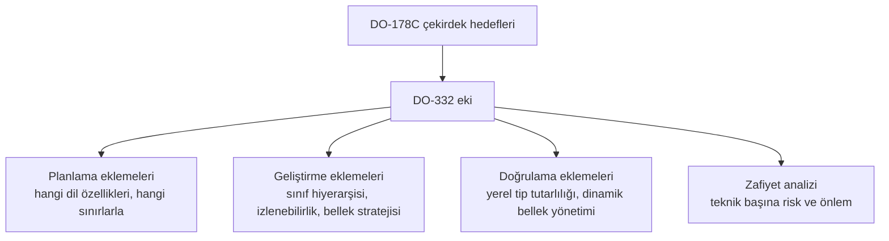
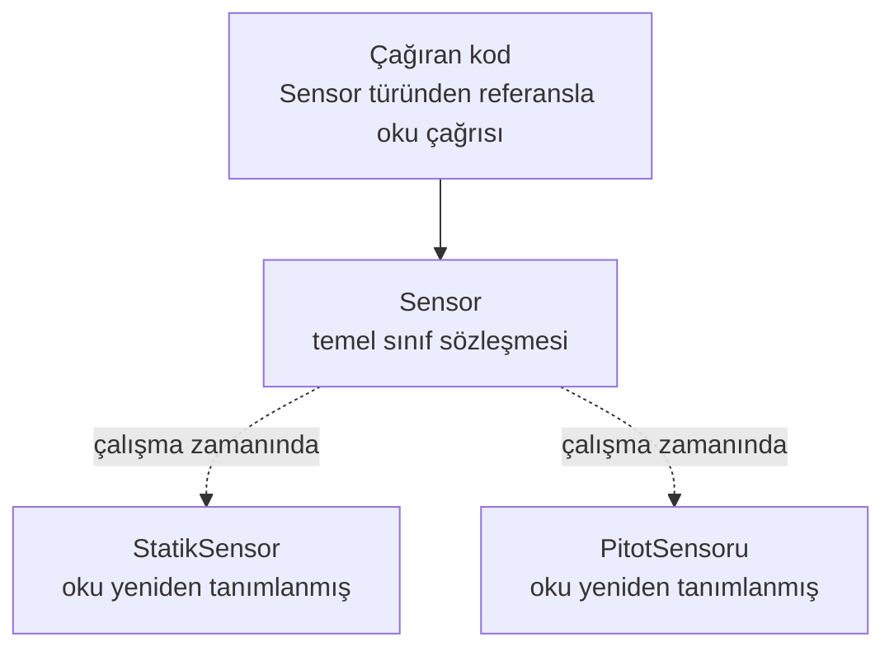

# 15. DO-332 ve Nesne Yönelimli Teknoloji ve İlgili Teknikler

Nesne yönelimli teknoloji (object-oriented technology) soyutlama ve yeniden kullanım
sağlar; ancak kalıtım (inheritance), çok biçimlilik (polymorphism) ve dinamik bellek
yönetimi gibi özellikler doğrulamada yeni sorular doğurur. Bu bölüm, DO-178C'nin bu
konuya ayrılmış teknoloji eki DO-332'nin getirdiklerini — yerel tip tutarlılığı,
dinamik bellek yönetiminin doğrulanması ve zafiyet analizi — ve bunların tasarım ile
kodlama kurallarına nasıl yansıdığını anlatır.

DO-332, "Object-Oriented Technology and Related Techniques Supplement to DO-178C and
DO-278A" adıyla 2011'de DO-178C ile birlikte yayımlanmıştır; EUROCAE karşılığı
ED-217'dir. Adından anlaşıldığı gibi yalnızca uçuş yazılımına değil, DO-278A
kapsamındaki yer tabanlı haberleşme, seyrüsefer, gözetim ve hava trafik yönetimi
(CNS/ATM) yazılımına da ek olarak uygulanır. Ek, nesne yönelimli tasarımı ne yasaklar ne
de özendirir; bu tekniklerin hangi kanıtlarla emniyetli biçimde kullanılabileceğini
tanımlar.

## Havacılıkta nesne yönelimli teknolojinin kullanımı

Nesne yönelimli programlama, 1990'ların ortasından itibaren yer sistemlerinde ve
kabin/eğlence gibi düşük kritiklikli alanlarda hızla yaygınlaştı. Emniyet-kritik
uçuş yazılımına girişi ise çok daha temkinli oldu; çünkü dönemin geçerli rehberi
olan DO-178B; kalıtım, çok biçimlilik ve dinamik bağlama (dynamic binding) gibi
mekanizmaları hiç öngörmüyordu. Proje ekipleri
C++ veya Ada 95 kullanmak istediğinde, sertifikasyon otoriteleri her seferinde
projeye özel sorular soruyor, her başvuru sahibi (applicant) aynı tartışmaları
yeniden yaşıyordu.

Tartışmaların odağında birkaç somut doğrulama sorunu vardı:

- **Dinamik bağlama ve yapısal kapsam analizi (structural coverage analysis)
  ilişkisi.** Sanal bir çağrı noktasında hangi alt sınıf metodunun çalışacağı
  ancak çalışma zamanında (run time) belli olur. Kaynak kod üzerinde satır kapsama
  (statement coverage) veya karar kapsama (decision coverage) yüzde yüz görünse bile,
  çağrı hedeflerinin tamamının denendiği bunu göstermez. "Bir sanal çağrı, olası her
  hedefi için ayrı ayrı mı kapsanmalı?" sorusu yıllarca net bir cevaba kavuşamadı.
- **Kaynak kod ile çalıştırılabilir nesne kodu arasındaki mesafe.** Sanal metot
  tabloları, örtük kurucu/yıkıcı çağrıları ve derleyicinin ürettiği yardımcı kod,
  izlenebilirlik (traceability) zincirini kaynak kod düzeyinde görünmez hâle getirebiliyordu.
- **Dinamik bellek yönetimi.** Nesnelerin çalışma zamanında yaratılıp yok edilmesi,
  bellek tükenmesi ve parçalanma (fragmentation) gibi zamanla ortaya çıkan hata
  kiplerini gündeme getirdi; en kötü durum davranışını kanıtlamak zorlaştı.
- **Test kapsamının anlamı.** Temel sınıfa karşı yazılmış testlerin alt sınıflar
  için de geçerli sayılıp sayılamayacağı, yani test mirasının (test inheritance)
  meşruiyeti belirsizdi.

Bu belirsizliği azaltmak için 2000'li yılların başında FAA ve NASA'nın desteğiyle
sektör çalıştayları düzenlendi; bunların çıktısı olarak FAA, 2004'te dört ciltlik bir
el kitabı yayımladı: Handbook for Object-Oriented Technology in Aviation (OOTiA).
OOTiA bağlayıcı bir standart değildi, ama riskleri ve olası önlemleri sistemli biçimde
ilk kez derledi. Aynı dönemde sertifikasyon otoritelerinin yazılım uzmanlarından oluşan
ekip (Certification Authorities Software Team, CAST), nesne yönelimli teknolojinin
doğurduğu sertifikasyon kaygılarını (CAST-4, 2000) ve C++ kullanımını (CAST-8, 2002)
ele alan tutum belgeleri (position papers) yayımladı. Bu belgeler resmî politika
değildi; otoritelerin ortak bakışını sektöre duyuruyordu. Bugün güncel rehber olarak
sürdürülmezler ve DO-178B döneminden kalma tarihî başvuru kaynaklarıdır.

DO-178C hazırlanırken bu birikim doğrudan girdi oldu. Çekirdek dokümanı dil ve
teknolojiden bağımsız tutma kararı alınınca, nesne yönelimli teknolojiye özgü hususlar
ayrı bir teknoloji ekine, DO-332'ye taşındı. Böylece OOTiA'nın tavsiye niteliğindeki
içeriği, hedefler (objective) ve faaliyetler düzeyinde tanımlı, denetlenebilir bir
rehbere dönüştü. Tasarım yaklaşımı olarak nesne yönelimin yapısal tasarımla
karşılaştırması
[7. Yazılım Tasarımı](../03-do178c-ile-gelistirme/07-yazilim-tasarimi.md) bölümündedir;
bu bölüm, o seçimin sertifikasyon kanıtına etkisini ele alır.

## DO-332'nin yapısı

DO-332 kendi başına okunacak bağımsız bir standart değildir; DO-178C'nin bir
**teknoloji ekidir (supplement)**. Çekirdek dokümanın süreç ve hedef
iskeletini aynen kullanır; nesne yönelimli teknolojinin etkilediği yerlerde
hedefleri genişletir, faaliyet ekler veya mevcut faaliyetlerin nasıl
yorumlanacağını netleştirir. Uygulamada bu şu anlama gelir: proje zaten DO-178C
hedeflerini karşılamak zorundadır; DO-332 bunların üzerine, kullanılan dil
özelliklerine bağlı ek yükümlülükler getirir. Ekin hedef düzeyindeki katkısı sınırlıdır:
yalnızca iki yeni hedef tanımlar, geri kalan rehberliği mevcut DO-178C hedeflerine
eklenen faaliyetler olarak verir.


```mermaid
flowchart TD
    A["DO-178C çekirdek hedefleri"] --> B["DO-332 eki"]
    B --> C["Planlama eklemeleri<br/>hangi dil özellikleri, hangi sınırlarla"]
    B --> D["Geliştirme eklemeleri<br/>sınıf hiyerarşisi, izlenebilirlik, bellek stratejisi"]
    B --> E["Doğrulama eklemeleri<br/>yerel tip tutarlılığı, dinamik bellek yönetimi"]
    B --> F["Zafiyet analizi<br/>teknik başına risk ve önlem"]
```

**Kapsam: "ilgili teknikler" dile bağlı değildir.** Başlıktaki ikinci yarı en az
birincisi kadar önemlidir. Şablonlar ve genel türler (templates, generics), aşırı yükleme
(overloading), tip dönüşümü (type conversion), istisna işleme (exception handling),
dinamik bellek yönetimi ve sanallaştırma (virtualization) nesne yönelimli olmayan
kodda da karşımıza çıkar. C ile yazılmış ama öbek (heap) belleği ya da gömülü bir
yorumlayıcı kullanan proje, sınıf tanımlamasa da ekin ilgili rehberini dikkate alır.
"DO-332 yalnızca C++ içindir" düşüncesi bu yüzden yanıltıcıdır.

**Planlama eklemeleri.** Bir projede C++ ya da Ada'nın nesne yönelimli özellikleri
kullanılacaksa DO-332'nin uygulanacağı yazılım sertifikasyon planında (Plan for Software
Aspects of Certification, PSAC) beyan edilir. Hangi dil özelliklerinin kullanılacağı,
hangilerinin kodlama standardıyla yasaklanacağı, yerel tip tutarlılığının hangi
yöntemle gösterileceği ve belleğin hangi stratejiyle yönetileceği planlama kararıdır;
doğrulama aşamasına bırakılırsa mimari çoktan bu kararları örtük olarak vermiş olur.
Planların içeriği [5. Yazılım Planlama](../03-do178c-ile-gelistirme/05-yazilim-planlama.md)
bölümünde, otoritenin planlama denetiminde bu beyanı nasıl aradığı
[SW SOI-1](../kaynaklar/soi-1.md) kontrol listesinde yer alır.

**Geliştirme eklemeleri.** Sınıf hiyerarşisi yazılım mimarisinin parçasıdır ve tasarım
verisinde tanımlanır. İzlenebilirlik de buna göre kurulur: nesne yönelimli tasarımda
işlev metotlarda gerçekleştiği için gereksinimler, onları karşılayan metotlara ve
niteliklere izlenir. Yeniden tanımlanan (override) her metot kendi gereksinimine
izlenebilmelidir; "üst sınıftaki gereksinim zaten kapsıyor" varsayımı, davranışı
değiştiren alt sınıfı gözden kaçırır. Bellek yönetimi ve istisna işleme stratejisi de
kod düzeyine bırakılmaz, mimari kararı olarak tasarımda yazılır.

**Doğrulama eklemeleri ve zafiyet analizi.** İki yeni hedef doğrulama sürecindedir ve
aşağıda ayrı ayrı ele alınır. Zafiyet analizi ise ek faaliyetlerin gerekçesini açıklayan
destekleyici kısımdır.

## Doğrulama eklemeleri: iki yeni hedef

### Yerel tip tutarlılığı

Ekin en bilinen katkısı **yerel tip tutarlılığının doğrulanmasıdır (local type
consistency verification)**. Fikir, yerine geçme ilkesine (Liskov substitution
principle) dayanır: bir alt sınıf nesnesi temel sınıfın beklendiği her yerde
kullanılabildiğine göre, alt sınıfın davranışının temel sınıf sözleşmesini bozmadığı
**gösterilmelidir** — varsayılamaz. Sözleşme açısından kural üç maddedir: yeniden
tanımlanan metot önkoşulu (precondition) sıkılaştıramaz, artkoşulu (postcondition)
gevşetemez ve temel sınıfın değişmezlerini (invariant) korur.

Küçük bir örnek sorunu görünür kılar. Hava verisi işleyen bir bileşen, sensörlere ortak
bir temel sınıf üzerinden erişsin:


```mermaid
flowchart TD
    C["Çağıran kod<br/>Sensor türünden referansla oku çağrısı"]
    S["Sensor<br/>temel sınıf sözleşmesi"]
    C --> S
    S -. "çalışma zamanında" .-> T["StatikSensor<br/>oku yeniden tanımlanmış"]
    S -. "çalışma zamanında" .-> P["PitotSensoru<br/>oku yeniden tanımlanmış"]
```

| Sınıf | `oku` için önkoşul | `oku` için artkoşul | Yerine geçme ilkesi |
|---|---|---|---|
| `Sensor` (temel sınıf) | Başlatma tamamlanmış olmalı | Değer tanımlı aralıktadır ya da geçersiz olarak işaretlenmiştir | — |
| `StatikSensor` | Aynı | Aynı; ek olarak değer süzgeçten geçirilmiştir | Korunur: artkoşul yalnızca güçlenmiştir |
| `PitotSensoru` | Başlatma tamamlanmış ve ısınma süresi dolmuş olmalı | Aynı | Bozulur: önkoşul sıkılaşmıştır |

Çağıran kod yalnızca `Sensor` sözleşmesini bilir ve başlatmadan hemen sonraki çevrimde
`oku` çağırır. Hedef `PitotSensoru` ise önkoşul ihlal edilmiştir ve dönen değerin ne
olacağını hiçbir gereksinim söylemez.
Sorunun sinsi yanı, tek tek bakıldığında her şeyin doğru görünmesidir: `PitotSensoru`
kendi gereksinimlerine göre yazılmış testlerden geçer, çünkü o testler ısınma süresini
bekler; çağıran kod da temel sınıfla test edildiğinde geçer. Kusur yalnızca ikisinin
birleşiminde ortaya çıkar. Çözüm sözleşmeyi onarmaktır: alt sınıf ısınma süresince
değeri geçersiz işaretleyerek temel sınıfın artkoşuluna uyar ya da ısınma koşulu temel
sınıfın sözleşmesine taşınır ve bütün çağıranlar buna göre gözden geçirilir.

"Yerel" sözcüğü kapsamı belirler. Hiyerarşideki bütün sınıfların her bağlamda birbirinin
yerine geçebildiğini göstermek gerekmez; gösterim, kodda gerçekten bulunan dinamik çağrı
noktaları ve o noktalara fiilen ulaşabilen tipler için yapılır. Ek, bunun için üç yol
tanır ve seçimi başvuru sahibine bırakır:

- **Biçimsel ispat.** Her yeniden tanımlanan metodun temel sınıf sözleşmesini
  sağladığı [16. DO-333 ve Biçimsel Yöntemler](./16-do333-bicimsel-yontemler.md)
  bölümünde anlatılan tekniklerle ispatlanır. Sözleşmelerin biçimsel dille yazılmış
  olmasını gerektirir.
- **Üst sınıf testlerinin alt sınıf örnekleriyle koşulması (test mirası).** Temel
  sınıfın gereksinim tabanlı testleri (requirements-based testing), onun yerine geçebilen her alt sınıfın nesnesiyle
  yeniden koşulur ve hepsinin geçmesi beklenir. Derin hiyerarşilerde en ekonomik yol
  çoğunlukla budur. Yukarıdaki örnekte temel sınıfın başlatmadan hemen sonra `oku`
  çağıran testi, `PitotSensoru` nesnesiyle koşulduğunda kusuru ortaya çıkarır.
- **Kötümser test (pessimistic testing).** Yerine geçebilirlik iddia edilmez; her
  dinamik çağrı noktası, oraya ulaşabilecek her hedef için ayrı ayrı gereksinim tabanlı
  testle sınanır. Az sayıda alt sınıfı olan sığ hiyerarşilerde pratiktir, derinlik
  arttıkça birleşim sayısı hızla büyür.

Bu hedef yapısal kapsam analizini tamamlar, onun bir türü değildir: kapsam analizi
hangi kodun çalıştırıldığını ölçer, yerel tip tutarlılığı ise dinamik çağrının olası
hedef kümesindeki her metodun çağıranın güvendiği sözleşmeyi karşıladığını gösterir.
Hedef, Seviye A, B ve C yazılım için aranır.

### Dinamik bellek yönetiminin doğrulanması

DO-332'nin eklediği ikinci hedef, dinamik bellek yönetiminin gürbüz (robust) olduğunun
doğrulanmasıdır. Kapsamı ilk bakışta sanıldığından geniştir: yalnızca açık ayırma ve
serbest bırakma çağrılarını değil, çöp toplamayı (garbage collection) ve kap
(container) sınıfları gibi üst düzey yapıların örtük bellek kullanımını da içerir.
Gösterilmesi beklenen özellikler yedi başlıkta toplanır:

| Gösterilecek özellik | Kapatılan risk | Tipik kanıt |
|---|---|---|
| Ayırıcı her seferinde geçerli ve başka kullanımda olmayan bir alan döndürür | Aynı alanın iki nesneye verilmesi (belirsiz referans) | Ayırıcının gereksinim tabanlı testi ve gözden geçirmesi |
| Yeterli boş alan varken ayırma, parçalanma yüzünden başarısız olmaz | Parçalanmadan doğan açlık | Sabit boyutlu bloklar ya da parçalanma analizi |
| Erişilemez hâle gelen bellek, ihtiyaç doğmadan geri kazanılır | Geri kazanımın gecikmesinden doğan açlık | Serbest bırakma disiplini ya da çöp toplayıcının hız analizi |
| Uygulamanın ihtiyaç duyduğu toplam bellek her an mevcuttur | Öbek belleğin tükenmesi | En kötü durum bellek ihtiyacı analizi |
| Nesne ancak artık kullanılmadığında serbest bırakılır | Erken serbest bırakma, sarkan referans | Sahiplik kuralları, statik analiz |
| Bellek yöneticisi nesneleri taşıyorsa referanslar tutarlı kalır | Kayıp güncelleme, bayat referans | Taşıma işleminin bölünmezliğinin gösterilmesi |
| Ayırma ve serbest bırakma sınırlı sürede tamamlanır | Belirlenimci (deterministic) olmayan yürütme süresi | En kötü durum yürütme süresi (worst-case execution time) analizi |

Bu özelliklerin kimin tarafından sağlanacağı seçilen tekniğe bağlıdır. Ek, uygulama
kodu ile bellek yönetimi altyapısını (çalışma zamanı kütüphanesi, işletim sisteminin
ayırıcısı, çöp toplayıcı) ayırır ve her teknik için sorumluluğun hangisine düştüğünü
tartışır. Çöp toplayıcı kullanıldığında yükün çoğu altyapıya geçer; ama o altyapı da
uçuş yazılımıdır ve aynı seviyede doğrulanır. Uygulamanın kendi yazdığı nesne havuzunda
ise yükün çoğu uygulama kodundadır. Toplam bellek ihtiyacının karşılandığını göstermek,
teknik ne olursa olsun uygulamanın işidir.

Uygulamada üç strateji görülür ve kanıt yükü bu sırayla artar:

1. **Yalnızca başlatmada ayırma, hiç serbest bırakmama.** En yaygın ve en kolay
   savunulan yoldur. Parçalanma, erken serbest bırakma ve geri kazanım sorunları
   tanım gereği ortadan kalkar; geriye başlatma sırasında yeterli belleğin bulunduğunu
   ve normal çalışmaya geçildikten sonra ayırma yapılmadığını göstermek kalır.
2. **Sabit boyutlu havuzlar.** Çalışma sırasında nesne alınıp geri verilir; bloklar eş
   boyutlu olduğu için parçalanma oluşmaz ve süre sınırlıdır. Havuzun en kötü durumda
   yetmesi ve geri verilen bloğu gösteren referans kalmaması ayrıca gösterilir.
3. **Çalışma sırasında genel amaçlı öbek kullanımı.** Yedi özelliğin tamamı açık kalır;
   özellikle parçalanmanın sınırlı olduğunu göstermek güçtür. Emniyet-kritik projelerin
   çoğu bu yüzden bu seçeneği kodlama standardıyla yasaklar.

Belirlenimci ayırma mekanizmalarının işletim sistemi tarafı
[20. Gerçek Zamanlı İşletim Sistemleri](../05-ozel-konular/20-gercek-zamanli-isletim-sistemleri.md)
bölümünde anlatılır.

## Zafiyet analizi

DO-332, teknik başına "bu mekanizma neyi bozabilir, hangi önlem bunu kapatır" sorusunu
işleyen sistematik bir **zafiyet analizi (vulnerability analysis)** içerir. Bu kısım
yeni hedef koymaz; ekin istediği faaliyetlerin neden istendiğini açıklar ve projenin
kendi kullandığı özellikler için benzer bir değerlendirme yapmasına örnek olur. Sık
başvurulan başlıklar:

| Dil özelliği / teknik | Tipik zafiyet | Beklenen önlem |
|---|---|---|
| Kalıtım, çok biçimlilik | Sözleşmeyi bozan alt sınıf, belirsiz çağrı hedefi | Yerel tip tutarlılığı doğrulaması, kalıtım derinliği sınırı |
| Aşırı yükleme | Örtük tip dönüşümüyle beklenmeyen fonksiyonun seçilmesi | Kodlama standardı kısıtları, statik analiz, kaynak kod gözden geçirmesi |
| Tip dönüşümü | Daraltan dönüşümde veri kaybı ya da taşma; hiyerarşide aşağı doğru dönüşümde yanlış tip varsayımı | Örtük dönüşümlerin kısıtlanması, açık ve denetimli dönüşüm |
| Şablonlar, genel türler | Aynı şablonun farklı somutlaştırmalarının farklı davranması, kapsam boşluğu | Her somutlaştırmanın ayrı test edilmesi ve kapsanması |
| İstisna işleme | Kontrol akışının görünmez dallanması, yakalanmayan istisna, yarım güncellenmiş veri | Mimari düzeyinde istisna stratejisi, kısıtlı kullanım, istisna yollarının testi |
| Dinamik bellek yönetimi | Tükenme, parçalanma, sarkan referans, belirlenimci olmayan süre | Yukarıdaki yedi özelliğin gösterilmesi, ayırma stratejisinin kısıtlanması |
| Çöp toplama | Kesilemeyen duraklamalar, zamanlama belirsizliği | En kötü durum duraklama analizi ya da tamamen yasaklama |
| Sanallaştırma (sanal makine, yorumlayıcı) | Yorumlanan kodun "veri" sayılıp doğrulamanın dışında kalması | Sanal makine uçuş yazılımı olarak DO-178C'ye göre doğrulanır; yorumlanan kod çalıştırılabilir kod gibi ele alınır |

Son satır sık karıştırılan bir noktayı düzeltir. Uçakta çalışan sanal makine ya da
yorumlayıcı bir araç değildir; çalıştırılabilir nesne kodunun parçasıdır ve yazılım
seviyesinin gerektirdiği bütün hedeflerle geliştirilip doğrulanır. Araç kalifikasyonu,
uçuş yazılımının parçası olmayan geliştirme ve doğrulama araçları içindir (bkz.
[13. DO-330 ve Yazılım Aracı Kalifikasyonu](./13-do330-arac-kalifikasyonu.md)).
Sanal makinenin yorumladığı ara kod (örneğin bayt kodu) da bir yapılandırma dosyası gibi
geçiştirilemez: gereksinimlere izlenir, gözden geçirilir, test edilir ve kapsamı
ölçülür.

## Dile bağlı olmayan sorun: C'de fonksiyon işaretçisiyle dağıtım

Fonksiyon işaretçileriyle tablo tabanlı dağıtım yapan bir C tasarımı resmen DO-332'nin
kapsamında sayılmasa da yerel tip tutarlılığının sorduğu soruyu aynen doğurur. Aşağıdaki
parça, dilde sınıf olmadan da aynı doğrulama sorusunun doğduğunu gösterir:

```c
#include <stdbool.h>
#include <stddef.h>

/* baro_* ve radar_* işlevlerinin bildirimleri kısalık için gösterilmemiştir. */

typedef struct {
    bool (*saglikli_mi)(void);
    bool (*oku)(float *irtifa_m);   /* true: *irtifa_m geçerli */
} sensor_arayuzu_t;

#define SENSOR_SAYISI ((size_t)2)

/* Olası hedef kümesi: sabit tablo, derleme zamanında sayılabilir. */
static const sensor_arayuzu_t SENSOR_TABLOSU[SENSOR_SAYISI] = {
    { baro_saglikli_mi,  baro_oku  },
    { radar_saglikli_mi, radar_oku }
};

bool irtifa_oku(size_t sensor_no, float *irtifa_m)
{
    bool gecerli = false;

    if ((irtifa_m != NULL) && (sensor_no < SENSOR_SAYISI)) {
        const sensor_arayuzu_t *s = &SENSOR_TABLOSU[sensor_no];

        if (s->saglikli_mi()) {
            gecerli = s->oku(irtifa_m);   /* dinamik çağrı */
        }
    }
    return gecerli;   /* false ise *irtifa_m kullanılmaz */
}
```

`s->oku()` çağrısının hangi fonksiyona gideceği çalışma zamanında belirlenir;
dolayısıyla "olası bütün hedefler sözleşmeye uyuyor mu ve test edildi mi?" sorusu,
tıpkı sanal metotlarda olduğu gibi burada da cevaplanmalıdır. Örnekteki iki tasarım
kararı cevabı kolaylaştırır. Tablo sabit (`const`) olduğu için olası hedef kümesi
kaynak koddan okunur: iki sensör, dört fonksiyon; çalışma zamanında yeni hedef
eklenemez ve işaretçiler boş kalamaz. Arayüzün sözleşmesi de imzada görünür: `oku`
geçerlilik bilgisini döndürür, böylece "sağlıksız sensörde ne döner" sorusu her
gerçekleştirim için aynı biçimde cevaplanır. `baro_oku` ile `radar_oku` bu sözleşmeye
karşı ayrı ayrı test edilir; `irtifa_oku` ise her iki hedefle sınanır. DO-332'yi resmen
uygulamayan projelerde bile bu bakış açısı iyi bir mühendislik alışkanlığıdır.

## Uygulamada dil alt kümesi ve kaynak–nesne kodu ilişkisi

DO-332 bir dil alt kümesi tanımlamaz; hangi özelliğin kullanılacağına proje karar verir
ve bu karar kodlama standardıyla bağlayıcı hâle gelir. Standardın yasakladığı özellik
için kanıt üretmek gerekmez, izin verdiği her özellik için ise ekteki ilgili faaliyet
planlanır. Bu yüzden projeler sıfırdan kural yazmak yerine yerleşik bir standardı
temel alıp üzerine kendi kısıtlarını ekler. C++ için güncel başvuru MISRA C++:2023'tür;
C++17'yi hedefler ve MISRA C++:2008 ile AUTOSAR C++14 yönergelerini tek belgede
birleştirerek onların yerini almıştır. Askerî bir uçak programı için 2005'te hazırlanan
JSF AV C++ kodlama standardı da hâlâ sık anılan bir kaynaktır. Ada tarafında dilin
kendi kısıtlama mekanizmaları ve SPARK alt kümesi aynı işi görür; Ada 2012 ile gelen
sınıf geneli önkoşul ve artkoşullar, yerine geçme ilkesini dilin içinde ifade etmeyi
sağlar. Kodlama standardının projede nasıl uygulandığı
[8. Yazılım Gerçekleştirme: Kodlama ve Entegrasyon](../03-do178c-ile-gelistirme/08-yazilim-gerceklestirme-kodlama-entegrasyon.md)
bölümündedir.

Başta anılan kaynak kod–nesne kodu mesafesi için DO-178C'nin cevabı değişmez: Seviye
A'da derleyicinin ürettiği ve kaynak koda doğrudan izlenemeyen nesne kodu belirlenir ve
doğruluğu ek doğrulamayla gösterilir. Nesne yönelimli özellikler bu ek doğrulamanın
konusunu büyütür: sanal metot tabloları ve dağıtım kodu, örtük kurucu ve yıkıcı
çağrıları, geçici nesneler, istisna çözme tabloları, şablon somutlaştırmaları. Dil alt kümesini daraltmak
ve derleyici seçeneklerini (örneğin istisna desteğini kapatmak) planlama aşamasında
sabitlemek, bu iş yükünü belirleyen asıl karardır.

Mevcut doğrulama faaliyetlerinin yorumu da genişler. Yapısal kapsam analizinde her
şablon somutlaştırması ayrı kod sayılır ve ayrı kapsanır. Kalıtım ve dinamik çağrı,
bileşenler arasında parametre, çağrı ve ortak veriye ek olarak yeni bir bağlaşım biçimi
yaratır; veri ve kontrol bağlaşımı analizi bunu da kapsamalıdır. En kötü durum yürütme
süresi ve yığın kullanımı analizlerinde ise dinamik çağrının olası hedeflerinin en
kötüsü esas alınır; pratik yol, süre ve yığın sınırını temel sınıf sözleşmesine yazıp
her alt sınıfın buna uyduğunu göstermektir. Bu analizlerin genel anlatımı
[9. Yazılım Doğrulama](../03-do178c-ile-gelistirme/09-yazilim-dogrulama.md)
bölümündedir.

## Pratik tasarım ve kodlama kuralları

Aşağıdaki kurallar DO-332'nin metninden değil, onun istediği kanıtı üretilebilir kılma
kaygısından doğar. Her biri bir doğrulama maliyetine karşılık gelir.

- **Kalıtım derinliğini ve çoklu kalıtımı sınırlayın.** Her ek düzey, yerel tip
  tutarlılığı kanıtına yeni bir sınıf ve yeni metot birleşimleri ekler. Çoklu kalıtım
  çağrı hedefinin belirlenmesini ve nesne yerleşimini karmaşıklaştırdığı için kodlama
  standartlarında çoğunlukla yasaklanır ya da saf arayüz sınıflarıyla sınırlanır.
- **Temel sınıf sözleşmesini düşük seviyeli gereksinim olarak yazın.** Önkoşul, artkoşul,
  değişmezler ve kaynak sınırları yazılı değilse "alt sınıf sözleşmeyi bozdu mu?" sorusu
  gözden geçirmede de testte de cevaplanamaz.
- **Yeniden tanımlamayı açık ve izlenebilir kılın.** Yeniden tanımlanan her metot kendi
  gereksinimine izlenir; imza uyuşmazlığı yüzünden kazara yeni bir metot tanımlamak
  derleyici denetimiyle (C++'ta `override` belirteci) engellenir. Gizli davranış
  değişiminin en sık kaynağı budur.
- **Dinamik çağrının hedef kümesini kapalı tutun.** Hedefler derleme zamanında
  sayılabilmeli, bağlama başlatmadan sonra değişmemelidir. Çalışma zamanında sınıf
  yükleme ya da işaretçi tablosunu güncelleme, doğrulanmış hedef kümesinin dışına
  çıkmanın yoludur.
- **Belleği başlatmada ayırın, örtük ayırmaları arayın.** Standart kütüphane kapları,
  dizgi sınıfları ve bazı dil yapıları öbeği sessizce kullanır; kural yalnızca açık
  ayırma çağrılarını yasaklıyorsa bunlar gözden kaçar.
- **Yan etkileri görünür kılın.** Kurucu ve yıkıcılarda iş mantığı, operatör aşırı
  yüklemesi ve örtük tip dönüşümleri kaynak kodda görünmeyen çağrılar üretir; gözden
  geçiren kişinin okuduğu ile çalışan kod arasındaki fark büyür.
- **Soyutlamayı gereksinim sürüklesin.** Tek alt sınıfı olan soyut katmanlar ve
  "ileride lazım olur" diye eklenen sanal metotlar, gereksinime izlenemeyen ya da hiç
  çalıştırılmayan kod üretir ve kapsam analizinde açıklanması gereken boşluklar olarak
  geri döner.
- **Alt sınıf testlerini temel sınıf testlerinin üzerine kurun.** Alt sınıfı yalnızca
  kendi gereksinimlerine karşı test etmek, yukarıdaki sensör örneğindeki türden kusurları
  görmez; test düzeneği temel sınıf testlerini her alt sınıfla koşacak biçimde kurulur.

## Bu bölümden akılda kalması gerekenler

- DO-332 bağımsız bir standart değil, DO-178C ve DO-278A'nın teknoloji ekidir; nesne
  yönelimli teknikleri yasaklamaz, kullanılan özelliğe bağlı kanıt yükümlülüğü tanımlar.
- Ek yalnızca iki yeni hedef getirir: yerel tip tutarlılığının ve dinamik bellek
  yönetiminin gürbüzlüğünün doğrulanması. Geri kalan rehberlik mevcut hedeflere eklenen
  faaliyetlerdir.
- Yerel tip tutarlılığında alt sınıfın temel sınıf sözleşmesine uyduğu varsayılmaz;
  biçimsel ispatla, üst sınıf testlerinin alt sınıflarla koşulmasıyla ya da her çağrı
  noktasında her hedefin test edilmesiyle gösterilir.
- Dinamik bellek için gösterilecek özellikler bellidir; yalnızca başlatmada ayırma ve
  sabit boyutlu havuzlar bu kanıtı üretilebilir kılan stratejilerdir.
- "İlgili teknikler" dile bağlı değildir: şablon, tip dönüşümü, istisna, dinamik bellek
  ve sanallaştırma C projelerini de ilgilendirir. Sanal makine araç değil uçuş
  yazılımıdır; yorumladığı kod veri değil çalıştırılabilir koddur.
- Dinamik çağrı sorunu da dile özgü değildir: C'de fonksiyon işaretçisiyle dağıtım
  yapan tasarım aynı soruyu cevaplar; sabit bir tablo hedef kümesini sayılabilir kılar.
- Hangi özelliğin kullanılacağı planlama kararıdır ve kodlama standardıyla bağlanır;
  bu karar hem yerel tip tutarlılığı kanıtının hem de Seviye A'da kaynak koda doğrudan
  izlenemeyen nesne kodu için yapılacak ek doğrulamanın büyüklüğünü belirler.
