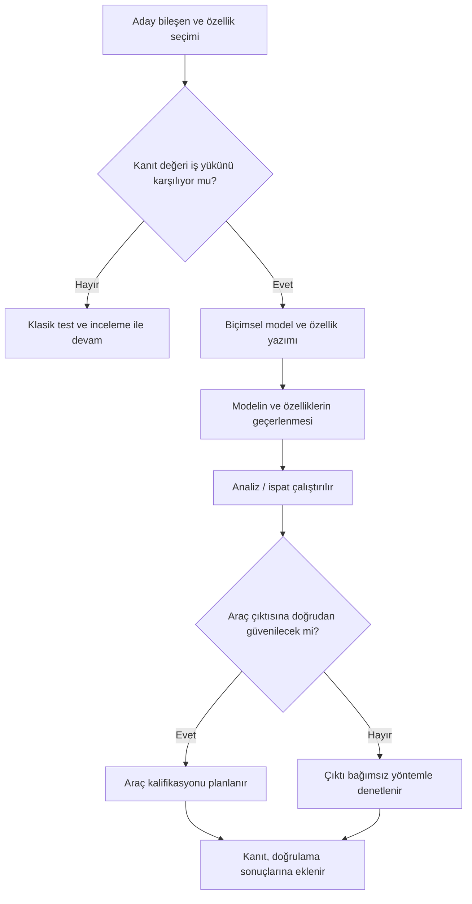

# 16. DO-333 ve Biçimsel Yöntemler

Biçimsel yöntemler (formal methods), yazılım davranışını matematiksel olarak ifade
edip kanıtlamaya dayanır. Bu, özellikle karmaşık mantıkların açık ve tekrar edilebilir biçimde
gösterilmesinde faydalıdır.

DO-333, bu yöntemlerin test ve incelemeyi nasıl tamamlayabileceğini açıklar. Buradaki
hedef, daha az doğrulama yapmak değil; daha güçlü ve daha net kanıt üretmektir.

## Neden biçimsel yöntem?

Bazı davranışlar sözlü olarak anlatıldığında ya da örnek testlerle gösterildiğinde eksik
kalabilir. Özellikle durum makinesi (state machine) yoğun, sınır koşulu karmaşık veya
güvenlik mantığı
hassas sistemlerde matematiksel ifade daha güçlü kanıt sağlar.

## DO-333 neyi tamamlar?

DO-333, biçimsel yöntemlerin:

- hangi amaçla kullanıldığını,
- hangi kanıtı güçlendirdiğini,
- hangi sınırları olduğunu

açıklar.

Bu belge, testin yerine geçmeyi değil, test ve incelemeyi daha sağlam hale getirmeyi
hedefler.

## Biçimsel yöntem kategorileri

Pratikte üç ana yaklaşım öne çıkar: model kontrolü (model checking), teorem ispatı
(theorem proving) ve soyut yorumlama (abstract interpretation). Üçü de matematiksel
temellidir; ancak sordukları soru, verdikleri cevabın biçimi ve gerektirdikleri emek
birbirinden oldukça farklıdır.

### Model kontrolü

Model kontrolü, sistemin davranışını sonlu bir durum uzayı olarak modeller ve
"istenmeyen durum hiçbir çalışma senaryosunda oluşmaz" gibi bir özelliği bu uzayın
**tamamını** otomatik tarayarak denetler. En değerli çıktısı, özellik ihlal
edildiğinde üretilen **karşı örnektir (counterexample)**: aracı, hataya götüren somut
olay dizisini adım adım gösterir. Bu, hata ayıklamada test loglarından çok daha
yönlendirici bir bilgidir.

- **Güçlü yönleri:** yüksek otomasyon, durum makinesi ve eşzamanlılık (concurrency)
  mantığında derinlemesine tarama, anlaşılır karşı örnekler.
- **Zayıf yönleri:** durum uzayı patlaması (state space explosion) — durum sayısı
  değişken sayısıyla üstel büyür; sürekli (analog) büyüklükler ve sınırsız veri
  yapıları doğrudan modellenemez, soyutlama gerekir.

### Teorem ispatı

Teorem ispatı, sistemi ve istenen özelliği bir mantık dilinde ifade eder; ardından
özelliğin sistem tanımından mantıksal çıkarım kurallarıyla türetilebildiğini gösterir.
İspat, çoğunlukla bir ispat asistanı (proof assistant) eşliğinde, insan yönlendirmesiyle
kurulur. Durum uzayını saymadığı için sonsuz durumlu sistemlerde ve genel (parametrik)
özelliklerde çalışabilir: "her N için bu tampon taşmaz" türünden bir iddia, tek bir
ispatla kapatılabilir.

- **Güçlü yönleri:** ifade gücü çok yüksektir; ölçek sınırı model kontrolündeki gibi
  mekanik değildir; ispat, gerekçesiyle birlikte kalıcı bir kanıt nesnesidir.
- **Zayıf yönleri:** ciddi uzmanlık ister; ispat kurmak emek yoğundur; özellik ihlal
  edildiğinde otomatik bir karşı örnek üretmez — ispatın "çıkmaması" tek başına hata
  yerini göstermez.

### Soyut yorumlama

Soyut yorumlama, programın somut çalışmasını her tek tek yürütmeyi izlemeden, değer
kümelerini soyut alanlar (örneğin değer aralıkları) üzerinden **aşırı-yaklaşık**
(over-approximation) biçimde hesaplar. Tipik hedefi, çalışma zamanı hatası
(run-time error) sınıflarının — taşma, sıfıra bölme, dizi sınırı aşımı, tanımsız
davranış — **yokluğunu** kaynak kod üzerinde doğrudan kanıtlamaktır. Ayrıca en kötü
durum yürütme süresi (worst-case execution time, WCET) ve yığın kullanımı analizleri
de bu aileden sayılır.

- **Güçlü yönleri:** gerçek kaynak kod üzerinde, model kurmadan, yüksek otomasyonla
  çalışır; "bu hata sınıfı bu kodda yoktur" gibi kesin negatif iddialar üretir.
- **Zayıf yönleri:** aşırı yaklaşıklık nedeniyle **yanlış alarmlar (false alarm)**
  üretebilir; her uyarının gerçek hata mı, analiz kabalığı mı olduğunun elle
  gerekçelendirilmesi gerekir; işlevsel (gereksinim düzeyi) doğruluk için uygun
  değildir.

### Karşılaştırma

| Özellik | Model kontrolü | Teorem ispatı | Soyut yorumlama |
|---|---|---|---|
| Otomasyon düzeyi | Yüksek | Düşük–orta (insan yönlendirmeli) | Yüksek |
| Tipik hedef | Durum makinesi / eşzamanlılık özellikleri | Genel işlevsel doğruluk, algoritma kanıtı | Çalışma zamanı hatası yokluğu, WCET |
| Ölçek sınırı | Durum uzayı patlaması | İspat emeği | Yanlış alarm oranı |
| Hata bulunduğunda | Karşı örnek verir | Doğrudan vermez | Uyarı verir (yanlış alarm olabilir) |
| Uzmanlık ihtiyacı | Orta | Yüksek | Orta |

Bu üç yaklaşım rakip değil, tamamlayıcıdır. Aynı projede durum makinesi mantığı model
kontrolüyle, kritik bir aritmetik algoritma ispatla, tüm kaynak kod tabanı ise soyut
yorumlamayla doğrulanabilir; her biri farklı bir doğrulama hedefine kanıt üretir.

## Zorluklar

Biçimsel yöntemlerin sağladığı kanıt gücü bedava gelmez. Bir projede bu yöntemleri
plana yazmadan önce dört pratik engelin dürüstçe değerlendirilmesi gerekir.

### Uzmanlık gereksinimi

Biçimsel bir özellik yazmak, gereksinim yazmaktan farklı bir beceridir: zamansal
mantık (temporal logic), önkoşul/artkoşul sözleşmeleri veya ispat taktikleri gibi
kavramlara hâkimiyet ister. Ekipte bu birikim yoksa iki tipik sonuç görülür: ya
özellikler o kadar zayıf yazılır ki kanıt neredeyse hiçbir şey söylemez, ya da
çalışma birkaç uzmanın darboğazına dönüşür. İşe yarayan yaklaşım, yöntemi dar ve
yüksek değerli bir alanda (örneğin mod geçiş mantığı) başlatıp ekip birikimini
kademeli büyütmektir.

### Ölçeklenebilirlik

Yöntemlerin her biri farklı bir noktada ölçek duvarına çarpar: model kontrolünde
durum uzayı patlaması, teorem ispatında ispat emeğinin bileşen sayısıyla büyümesi,
soyut yorumlamada büyük kod tabanlarında artan yanlış alarm sayısı. Bu nedenle
gerçek projelerde biçimsel analiz genellikle **seçici** uygulanır: sistemin tamamına
değil, hata etkisi en ağır olan bileşenlere. "Her şeyi kanıtlarız" hedefi, çoğu zaman
"hiçbir şeyi bitiremeyiz" ile sonuçlanır.

### Biçimsel modelin geçerlenmesi

Bir kanıt, ancak dayandığı model ve özellikler gerçeği yansıttığı ölçüde değerlidir.
Burada iki ayrı soru vardır:

- **Model, gerçek yazılımı/donanımı doğru temsil ediyor mu?** Modelde yapılan her
  soyutlama (zamanlamanın yok sayılması, değer aralıklarının daraltılması) bir
  varsayımdır ve kayıt altına alınıp gerekçelendirilmelidir.
- **Yazılan biçimsel özellik, gerçekten kastedilen gereksinimi mi ifade ediyor?**
  Yanlış formüle edilmiş bir özellik "kanıtlanmış ama alakasız" bir sonuç üretir.

Bu yüzden biçimsel özelliklerin gereksinimlere karşı gözden geçirilmesi ve
izlenebilirliğinin kurulması, kanıtın kendisi kadar önemlidir. Kanıt doğrulamayı
otomatikleştirir; geçerleme (validation) — doğru şeyi kanıtladığımızdan emin olma —
insan işi olarak kalır.

### Araç kalifikasyonu ihtiyacı

Biçimsel yöntemler tanımı gereği araçla yürütülür ve çıktıları çoğu zaman başka bir
doğrulama faaliyetinin (örneğin bazı test veya inceleme adımlarının) yerine kanıt
olarak kullanılır. Bir aracın çıktısına elle kontrol edilmeden güveniliyorsa, o araç
için araç kalifikasyonu (tool qualification) gündeme gelir; kalifikasyon kapsamı,
aracın hangi hedefe kanıt sağladığına ve hatasının fark edilip edilemeyeceğine göre
belirlenir. Bu da lisans maliyetinin üzerine ek bir planlama ve kanıt yükü getirir.
Bazı ispat asistanlarında, ispatın küçük ve bağımsız bir çekirdek tarafından yeniden
denetlenebilmesi bu yükü hafifletebilir; ama bu strateji de sertifikasyon otoritesiyle
erken aşamada konuşulmalıdır.

Bu engellerin hiçbiri aşılmaz değildir; ancak hepsi planlama aşamasında görünür
kılınmalı ve maliyeti kabul edilmelidir. Biçimsel yöntemler, "sona doğru eklenen bir
araç" olarak değil, en baştan doğrulama stratejisinin parçası olarak kurgulandığında
karşılığını verir.

## Biçimsel yöntemlere örnek

Bir kilit koşulun mümkün tüm durumlarda doğru olduğunu göstermek için model kontrolü
veya ispat yöntemleri kullanılabilir. Bu, özellikle karmaşık durum makinelerinde fayda
sağlar.

## Avantajlar

- belirsizliği azaltır,
- bazı hata sınıflarını erken yakalar,
- kanıtın tekrar edilebilirliğini artırır,
- karmaşık davranışı daha sıkı tanımlar.

## Sınırlamalar

Biçimsel yöntemler her problemi çözmez. Modelin doğru kurulması gerekir; aksi halde
kanıt, yanlış varsayımlar üzerinde güçlü görünse bile güvenilir olmaz.

## Bu bölümden akılda kalması gerekenler

- Biçimsel yöntemler, kanıtı güçlendirmek için kullanılır.
- DO-333 testin yerine geçmez; onu tamamlar.
- Üç ana yaklaşım — model kontrolü, teorem ispatı ve soyut yorumlama — rakip değil,
  tamamlayıcıdır; her biri farklı bir doğrulama hedefine uygundur.
- Model doğruluğu ve özelliklerin geçerlenmesi, kanıtın güvenilirliği için kritiktir.
- Uzmanlık, ölçeklenebilirlik ve araç kalifikasyonu maliyeti en baştan planlanmalıdır.
