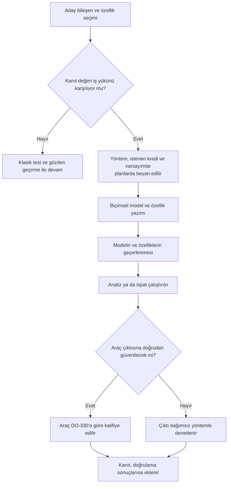

# 16. DO-333 ve Biçimsel Yöntemler

Biçimsel yöntemler (formal methods), yazılımın davranışını matematiksel bir gösterimle
ifade edip istenen özelliklerin sağlandığını örnek denemelerle değil ispatla gösterir;
DO-333 bu tür bir analizin hangi koşullarda gözden geçirme, analiz ve bazı testlerin
yerine doğrulama kanıtı sayılabileceğini tanımlar. Bu bölüm DO-333'ün getirdiklerini;
model kontrolü (model checking), teorem ispatı (theorem proving) ve soyut yorumlama
(abstract interpretation) yaklaşımlarını; biçimsel analiz testin yerini aldığında
değişenleri; pratikteki zorlukları ve iki küçük örneği ele alır.

DO-333'ün tam adı "Formal Methods Supplement to DO-178C and DO-278A"dır; 2011'de DO-178C
ile birlikte yayımlanmıştır ve EUROCAE karşılığı ED-216'dır. Bir ek (supplement) olduğu
için tek başına okunmaz: DO-178C'nin bölüm yapısını izler, biçimsel yöntem kullanılan
yerlerde ana belgenin metnine ekleme ve değişiklik yapar, hedef (objective) tablolarına
da biçimsel analize özgü hedefler ekler. Yazılımın biçimsel yöntemle doğrulanmayan
kısımları için DO-178C olduğu gibi geçerlidir (belge ailesinin bütünü için bkz.
[4. DO-178C ve Destekleyici Dokümanlara Genel Bakış](../03-do178c-ile-gelistirme/04-do178c-genel-bakis.md)).
Ekin ana fikri şudur: biçimsel analiz testi tümüyle ortadan kaldırmaz; ama koşulları
sağlandığında bazı gözden geçirme, analiz ve testlerin yerine geçebilecek güçte bir
kanıttır. Amaç daha az doğrulama yapmak değil, aynı hedefe daha kesin bir kanıtla
ulaşmaktır.

## Neden biçimsel yöntem?

Test, doğası gereği örneklemedir: mümkün girdilerin ve durumların küçük bir alt kümesi
seçilir, yazılım bu noktalarda çalıştırılır ve sonuç beklenenle karşılaştırılır. 32 bitlik
iki girdisi olan durumsuz bir fonksiyonun bile 2⁶⁴ farklı girdi çifti vardır; iç durum,
zamanlama ve eşzamanlılık (concurrency) eklendiğinde uzay pratikte sayılamaz hâle gelir.
Gereksinim tabanlı test (requirements-based testing) ve yapısal kapsam analizi
(structural coverage analysis) bu örneklemeyi disipline eder, ama seçilmeyen noktalar
hakkında bir şey söylemez.

Biçimsel analiz soruyu tersinden sorar: "şu girdide ne oluyor?" yerine "bu özelliğin
bozulduğu herhangi bir girdi ya da durum var mı?". Cevap, modelin ve yazılı varsayımların
kapsadığı uzayın tamamı için geçerlidir. Bu fark en çok şu tür mantıkta karşılığını verir:
çok sayıda durumu ve geçişi olan mod mantığı; "şu koşul yokken bu komut asla verilmez"
türünden emniyet kilitlemeleri (interlock); artıklık yönetimi ve oylama mantığı; taşma ya
da sıfıra bölme gibi yalnızca dar bir girdi aralığında ortaya çıkan aritmetik hatalar.
Ortak yanları, hatanın nadir bir olay sıralamasında ya da bir sınırda saklanması ve
testle bulunmasının, birinin o senaryoyu akıl etmesine bağlı olmasıdır.

Bu gücün iki sınırı vardır: sonuç, model ve varsayımlar gerçeği yansıttığı ölçüde
geçerlidir ve gerçek donanım üzerindeki davranışı tek başına göstermez. DO-333'ün büyük
kısmı bu iki sınırın nasıl yönetileceğiyle ilgilidir.

## DO-333 ne getirir?

### Biçimsel model ve biçimsel analiz

DO-333'e göre bir biçimsel yöntem iki parçadan oluşur; DO-178C'nin sözlüğü de biçimsel
yöntemi aynı ikiliyle tanımlar. **Biçimsel model (formal model)**, yazılımın bir yönünün
— gereksinimlerin, tasarımın ya da kodun — sözdizimi ve anlamı matematiksel olarak
tanımlı, tek biçimde yorumlanabilen bir gösterimle (formal notation) ifadesidir.
**Biçimsel analiz (formal analysis)**, bu modelin belirli bir özelliği sağladığını
matematiksel akıl yürütmeyle gösterir. Anlamı araçtan araca ya da okurdan okura değişen
bir kutu-ok diyagramı ya da serbest metin bu anlamda model değildir. Kaynak kod ise,
dilin anlamı kesin tanımlandığı ölçüde, biçimsel model olarak ele alınabilir; soyut
yorumlama araçlarının ayrı bir model kurmadan doğrudan kod üzerinde çalışabilmesi
bundandır.

### Kredinin üç ön koşulu

Bir analizin doğrulama kanıtı sayılabilmesi için ek, yöntemin türünden bağımsız üç şey
ister:

- **Kesin gösterim.** Kullanılan her biçimsel gösterimin sözdizimi ve anlamı matematiksel
  olarak tanımlı ve belirsizlikten uzak olmalıdır.
- **Sağlamlık (soundness).** Sağlam bir analiz yöntemi, özelliğin sağlanmadığı bir durumda
  asla "sağlanıyor" demez. Tersi serbesttir: gerçekte sorun yokken uyarı verebilir. Her
  yöntemin sağlamlığı gerekçelendirilir. Aradığı hatayı kaçırabilen sezgisel statik
  analiz araçları yararlı olabilir, ama bu anlamda biçimsel analiz değildir. Buradaki
  sağlamlık yönteme ilişkindir; yöntemi uygulayan aracın hatasız çalışıp çalışmadığı
  ayrı bir sorudur ve araç kalifikasyonuyla (tool qualification) ele alınır.
- **Yazılı ve gerekçeli varsayımlar.** Girdi aralıkları, hedef işlemcideki tamsayı
  genişlikleri ve kayan nokta davranışı, kesme ve çizelgeleme düzeni gibi analizin
  dayandığı her kabul kayda geçirilir ve gerekçelendirilir. Gerekçesi olmayan varsayım,
  ispatın sessizce dışarıda bıraktığı bir durum demektir.

### Ek hedefler

Biçimsel analizin kullanıldığı doğrulama hedefi tablolarına, yöntemin kendisine bakan
hedefler eklenir. Özü dört soruya iner:

1. Biçimsel analiz durumları (formal analysis case) ve prosedürleri doğru mu? Bunlar
   kabaca test durumu ile test prosedürünün karşılığıdır: neyin hangi varsayımlarla
   gösterileceği ve analizin hangi araç ayarlarıyla nasıl yürütüleceği.
2. Analiz sonuçları doğru mu ve beklenmeyen her sonuç açıklanmış mı?
3. Gereksinimlerin biçimsel gösterime aktarımı — biçimselleştirme — aslına sadık mı?
4. Seçilen yöntem doğru tanımlanmış, gerekçelendirilmiş ve bu iş için uygun mu?

Bu sorular uygulamada gözden geçirmeyle yanıtlanır. İspat ne kadar otomatik olursa olsun,
"doğru şeyi mi ispatladık?" sorusunun cevabı insandan beklenir.

### Hangi hedeflerde kullanılabilir?

İlke olarak doğrulama hedeflerinin çoğu biçimsel analize adaydır. Aşağıdaki tablo
standardın hedef tablolarının dökümü değil, kredinin nerelerde arandığının özetidir;
hedef grupları [9. Yazılım Doğrulama](../03-do178c-ile-gelistirme/09-yazilim-dogrulama.md)
bölümünde anlatılmıştır.

| Doğrulama hedefi grubu | Biçimsel analizle karşılanabilir mi? | Koşul |
|---|---|---|
| Yüksek seviyeli gereksinimlerin (high-level requirements) gözden geçirme ve analizi (üst gereksinimlere uyum, doğruluk ve tutarlılık, algoritma doğruluğu) | Evet | Gereksinimler biçimsel gösterimle yazılmış ya da biçimselleştirilmiş olmalı; aktarımın doğruluğu gözden geçirilir |
| Tasarımın gözden geçirme ve analizi (düşük seviyeli gereksinimler (low-level requirements), mimari) | Evet | Tasarım biçimsel bir modelle ifade edilmiş olmalı |
| Kaynak kodun gözden geçirme ve analizi (gereksinimlere uyum, doğruluk ve tutarlılık) | Evet | Dilin anlamı ile derleyici ve hedef işlemciye ilişkin varsayımlar yazılı olmalı |
| Çalıştırılabilir nesne kodunun (executable object code) gereksinimlere uyumu ve gürbüzlüğü (robustness) | Evet, kısmen ya da tümüyle | Analiz nesne kodu üzerinde yapılır ya da kaynak kodda ispatlanan özelliklerin nesne kodunda korunduğu gösterilir |
| Çalıştırılabilir nesne kodunun hedef bilgisayarla uyumluluğu | Hayır; test kalır | Donanım/yazılım entegrasyon testleri (hardware/software integration testing) hedefte koşulur |
| Doğrulamanın yeterliliği (kapsam analizleri) | Biçimsel analizle doğrulanan kısımda yapısal kapsamın yerini başka ölçütler alır | Bkz. aşağıda "Biçimsel analiz testin yerini aldığında" |

Standartlara uygunluk gibi biçimsel özellik olarak ifade edilmesi güç hedeflerde gözden
geçirme çoğunlukla yerinde kalır. Hangi hedefte tam, hangisinde kısmi kredi isteneceği
proje bazında belirlenir.

### Planlarda beyan

Biçimsel analizden kredi almak sonradan eklenebilecek bir ayrıntı değildir. Yazılım
sertifikasyon planında (Plan for Software Aspects of Certification, PSAC) ekin hangi
bileşenlere uygulanacağı ve hangi hedeflerde ne ölçüde kredi isteneceği; yazılım
doğrulama planında (Software Verification Plan, SVP) yöntem, gösterim, araçlar,
varsayımların nasıl yönetileceği ve testle biçimsel analiz arasındaki iş bölümü yer
alır. Bu beyan sertifikasyon otoritesiyle (certification authority) varılacak
mutabakatın temelidir; planların içeriği
[5. Yazılım Planlama](../03-do178c-ile-gelistirme/05-yazilim-planlama.md) bölümünde
işlenmiştir.

## Biçimsel yöntem kategorileri

DO-333 biçimsel analizi üç ailede toplar: tümdengelimli yöntemler (deductive methods;
yaygın adıyla teorem ispatı), model kontrolü ve soyut yorumlama. Üçü de matematiksel
temellidir; ancak sordukları soru, verdikleri cevabın biçimi ve gerektirdikleri emek
birbirinden oldukça farklıdır.

### Model kontrolü

Model kontrolü, sistemin davranışını sonlu bir durum uzayı olarak modeller ve
"istenmeyen durum hiçbir çalışma senaryosunda oluşmaz" gibi bir özelliği bu uzayın
**tamamını** otomatik tarayarak denetler. En değerli çıktısı, özellik ihlal
edildiğinde üretilen **karşı örnektir (counterexample)**: araç, hataya götüren somut
olay dizisini adım adım gösterir. Bu, hata ayıklamada test kayıtlarından çok daha
yönlendirici bir bilgidir. Tasarım, anlamı kesin tanımlı bir modelleme diliyle
yazılmışsa (bkz.
[14. DO-331 ve Model Tabanlı Geliştirme ve Doğrulama](14-do331-model-tabanli-gelistirme.md))
model kontrolü ayrı bir model kurmadan doğrudan tasarım modeli üzerinde çalıştırılabilir.

- **Güçlü yönleri:** yüksek otomasyon, durum makinesi (state machine) ve eşzamanlılık
  mantığında derinlemesine tarama, anlaşılır karşı örnekler.
- **Zayıf yönleri:** durum uzayı patlaması (state space explosion) — durum sayısı
  değişken sayısıyla üstel büyür; sürekli (analog) büyüklükler ve sınırsız veri
  yapıları doğrudan modellenemez, soyutlama gerekir.

### Teorem ispatı

Teorem ispatı, sistemi ve istenen özelliği bir mantık dilinde ifade eder; ardından
özelliğin sistem tanımından mantıksal çıkarım kurallarıyla türetilebildiğini gösterir.
İspat, çoğunlukla bir ispat asistanı (proof assistant) eşliğinde, insan yönlendirmesiyle
kurulur. Durum uzayını saymadığı için sonsuz durumlu sistemlerde ve genel (parametrik)
özelliklerde çalışabilir: "her N için bu tampon taşmaz" türünden bir iddia, tek bir
ispatla kapatılabilir.

Kod düzeyindeki yaygın biçimi sözleşme (contract) tabanlı ispattır: her fonksiyona bir
önkoşul (precondition) ve bir artkoşul (postcondition) yazılır; araç bunlardan ispat
yükümlülükleri (proof obligation) üretir ve çoğunu otomatik çözücülerle kapatır. Nesne
yönelimli tasarımda alt sınıfın temel sınıf sözleşmesini bozmadığı da bu yolla
gösterilebilir (bkz.
[15. DO-332 ve Nesne Yönelimli Teknoloji ve İlgili Teknikler](15-do332-nesne-yonelimli-teknoloji.md)).

- **Güçlü yönleri:** ifade gücü çok yüksektir; ölçek sınırı model kontrolündeki gibi
  mekanik değildir; ispat, gerekçesiyle birlikte kalıcı bir kanıt nesnesidir.
- **Zayıf yönleri:** ciddi uzmanlık ister; ispat kurmak emek yoğundur; özellik ihlal
  edildiğinde otomatik bir karşı örnek üretmez — ispatın "çıkmaması" tek başına hata
  yerini göstermez.

### Soyut yorumlama

Soyut yorumlama, programın somut çalışmasını her tek tek yürütmeyi izlemeden, değer
kümelerini soyut alanlar (örneğin değer aralıkları) üzerinden **aşırı-yaklaşık**
(over-approximation) biçimde hesaplar. Tipik hedefi, çalışma zamanı hatası
(run-time error) sınıflarının — taşma, sıfıra bölme, dizi sınırı aşımı, tanımsız
davranış — **yokluğunu** kaynak kod üzerinde doğrudan göstermektir. En kötü durum
yürütme süresi (worst-case execution time, WCET) ve yığın kullanımı için üst sınır
hesaplayan, çoğunlukla nesne kodu üzerinde çalışan analizler de bu ailedendir; bunların
doğrulamadaki yeri
[9. Yazılım Doğrulama](../03-do178c-ile-gelistirme/09-yazilim-dogrulama.md) bölümünde
anlatılmıştır.

- **Güçlü yönleri:** gerçek kaynak kod üzerinde, model kurmadan, yüksek otomasyonla
  çalışır; "bu hata sınıfı bu kodda yoktur" gibi kesin negatif iddialar üretir.
- **Zayıf yönleri:** aşırı yaklaşıklık nedeniyle **yanlış alarmlar (false alarm)**
  üretebilir; her uyarının gerçek hata mı, analiz kabalığı mı olduğunun elle
  gerekçelendirilmesi gerekir; işlevsel (gereksinim düzeyi) doğruluk için uygun
  değildir.

### Karşılaştırma

| Özellik | Model kontrolü | Teorem ispatı | Soyut yorumlama |
|---|---|---|---|
| Otomasyon düzeyi | Yüksek | Düşük–orta (insan yönlendirmeli) | Yüksek |
| Tipik hedef | Durum makinesi / eşzamanlılık özellikleri | Genel işlevsel doğruluk, algoritma ispatı | Çalışma zamanı hatası yokluğu, WCET |
| Ölçek sınırı | Durum uzayı patlaması | İspat emeği | Yanlış alarm oranı |
| Hata bulunduğunda | Karşı örnek verir | Doğrudan vermez | Uyarı verir (yanlış alarm olabilir) |
| Uzmanlık ihtiyacı | Orta | Yüksek | Orta |
| Bilinen araç örnekleri | SPIN, nuXmv | SPARK, Frama-C (WP), Isabelle | Astrée, Polyspace Code Prover, Frama-C (Eva) |

Araç adları yalnızca aileyi somutlaştırmak içindir; öneri ya da kalifikasyon durumu
beyanı değildir.

Bu üç yaklaşım rakip değil, tamamlayıcıdır. Aynı projede durum makinesi mantığı model
kontrolüyle, kritik bir aritmetik algoritma ispatla, tüm kaynak kod tabanı ise soyut
yorumlamayla doğrulanabilir; her biri farklı bir doğrulama hedefine kanıt üretir.

## Biçimsel analiz testin yerini aldığında

DO-178C'de çalıştırılabilir nesne kodu gereksinim tabanlı testle doğrulanır; testin
yeterliliği de gereksinim kapsamı ve yapısal kapsam analiziyle sınanır. Bu testlerin bir
kısmı yerine biçimsel analiz konduğunda üç soru doğar: kapsam nasıl gösterilecek, kaynak
kodda ispatlanan şey nesne kodu için de geçerli mi ve hangi testler yine de koşulacak?

### Yapısal kapsamın yerini alan ölçütler

Yapısal kapsam analizi testle birlikte anlamlıdır: koşulan testlerin kodun ne kadarını
çalıştırdığını ölçer. Çalıştırılmadan ispatlanan bir bileşende ölçülecek bir "çalıştırma"
yoktur; ama kapsam analizinin yanıtladığı sorular — gereksinimler eksik mi, doğrulanmamış
davranış kaldı mı, gereksinime dayanmayan kod var mı — yanıtsız bırakılamaz. DO-333 bu
yüzden, yalnızca biçimsel analizle doğrulanan kısım için dört şeyin gösterilmesini ister:

| Gösterilecek olan | Pratikteki anlamı |
|---|---|
| Her gereksinimin tam kapsandığı | Gereksinim, varsayımlarla daraltılmış bir alt kümede değil, geçerli olduğu tüm koşullarda ispatlanmıştır; ispatın dayandığı her varsayım ayrıca doğrulanmıştır |
| Gereksinim kümesinin tam olduğu | Olası her girdi koşulu için beklenen çıktı tanımlıdır; tanımsız bırakılmış davranış yoktur |
| İstenmeyen veri akışının bulunmadığı | Kodda, gereksinimlerin öngörmediği bir girdi–çıktı bağımlılığı yoktur |
| Gereksiz kodun bulunmadığı | Ölü kod (dead code) dahil gereksiz kod (extraneous code) yoktur; devre dışı bırakılmış kod (deactivated code) belirlenmiştir |

Son satırdaki kavramlar
[17. Kapsanmayan Kodlar: Ölü, Gereksiz ve Devre Dışı Bırakılmış Kodlar](../05-ozel-konular/17-kapsanmayan-kodlar.md)
bölümünde tanımlanmıştır. Çoğu projede bileşenlerin bir kısmı testle, bir kısmı biçimsel
analizle doğrulanır. Testle doğrulanan kod için DO-178C'nin yapısal kapsam ölçütleri
aynen geçerlidir; aynı kod parçasında iki yöntem birlikte kullanılıyorsa aralarında boşluk
kalmadığı ayrıca gösterilir.

### Kaynak koddan nesne koduna özellik korunumu

İspatların çoğu kaynak kod üzerinde yapılır; uçakta çalışan ise derleyicinin ve
bağlayıcının ürettiği çalıştırılabilir nesne kodudur. Testte bu fark kendiliğinden
kapanır, çünkü test edilen şey nesne kodunun kendisidir. İspatta ise derleyici güven
zincirine girer: kaynak düzeyinde gösterilen bir özelliğin nesne kodu hedeflerine
sayılabilmesi için o özelliğin derlemeden sonra da korunduğu (property preservation)
gösterilmelidir.

Bunun tek bir reçetesi yoktur. Analiz doğrudan nesne kodu üzerinde yapılabilir;
derleyicinin ilgili özellikleri koruduğuna ilişkin kanıt sunulabilir (kısıtlı eniyileme
(optimization) seçenekleri, derleyici çıktısının ek doğrulaması); ya da kaynak düzeyinde
ispatlanan özellikler hedefte koşulan testlerle örneklenerek çapraz denetlenebilir. Hangi
yolun izleneceği planlama aşamasında otoriteyle kararlaştırılır. Her durumda, analizin
hedefe ilişkin kabulleri — tamsayı genişlikleri, kayan nokta yuvarlama kipi, hizalama —
gerçek derleyici ve işlemciyle aynı olmalıdır; farklı bir hedef modeliyle yapılmış ispat,
başka bir programın ispatıdır.

### Hedefte kalan testler

Hangi yöntem seçilirse seçilsin, çalıştırılabilir nesne kodunun hedef bilgisayarla
uyumluluğunu gösteren donanım/yazılım entegrasyon testleri koşulur. Model gerçek donanımı
ancak varsayımlar yoluyla içerir; kesme gecikmeleri, çevre birimi zamanlaması, bellek
haritası, açılış sırası ve donanım arızalarına tepki hedefte gözlenir. WCET ve yığın
kullanımında da analiz sonucu hedefteki ölçümlerle desteklenir. Pratik sonuç şudur:
biçimsel analiz test sayısını azaltır ve testin ağırlığını birim düzeyinden entegrasyon
düzeyine kaydırır; test laboratuvarını kapatmaz.

## Zorluklar

Biçimsel yöntemlerin sağladığı kanıt gücü bedava gelmez. Bir projede bu yöntemleri
plana yazmadan önce dört pratik engelin dürüstçe değerlendirilmesi gerekir.

### Uzmanlık gereksinimi

Biçimsel bir özellik yazmak, gereksinim yazmaktan farklı bir beceridir: zamansal
mantık (temporal logic), önkoşul/artkoşul sözleşmeleri veya ispat taktikleri gibi
kavramlara hâkimiyet ister. Ekipte bu birikim yoksa iki tipik sonuç görülür: ya
özellikler o kadar zayıf yazılır ki ispat neredeyse hiçbir şey söylemez, ya da
çalışma birkaç uzmanın darboğazına dönüşür. İşe yarayan yaklaşım, yöntemi dar ve
yüksek değerli bir alanda (örneğin mod geçiş mantığı) başlatıp ekip birikimini
kademeli büyütmektir.

### Ölçeklenebilirlik

Yöntemlerin her biri farklı bir noktada ölçek duvarına çarpar: model kontrolünde
durum uzayı patlaması, teorem ispatında ispat emeğinin bileşen sayısıyla büyümesi,
soyut yorumlamada büyük kod tabanlarında artan yanlış alarm sayısı. Bu nedenle
gerçek projelerde biçimsel analiz genellikle **seçici** uygulanır: sistemin tamamına
değil, hata etkisi en ağır olan bileşenlere. "Her şeyi ispatlarız" hedefi, çoğu zaman
"hiçbir şeyi bitiremeyiz" ile sonuçlanır.

### Biçimsel modelin geçerlenmesi

Bir ispat, ancak dayandığı model ve özellikler gerçeği yansıttığı ölçüde değerlidir.
Burada iki ayrı soru vardır:

- **Model, gerçek yazılımı/donanımı doğru temsil ediyor mu?** Modelde yapılan her
  soyutlama (zamanlamanın yok sayılması, değer aralıklarının daraltılması) bir
  varsayımdır ve kayıt altına alınıp gerekçelendirilmelidir.
- **Yazılan biçimsel özellik, gerçekten kastedilen gereksinimi mi ifade ediyor?**
  Yanlış formüle edilmiş bir özellik "ispatlanmış ama alakasız" bir sonuç üretir.

Bu yüzden biçimsel özelliklerin gereksinimlere karşı gözden geçirilmesi ve
izlenebilirliğinin kurulması, ispatın kendisi kadar önemlidir. İspat doğrulamayı
otomatikleştirir; geçerleme (validation) — doğru şeyi ispatladığımızdan emin olma —
insan işi olarak kalır. DO-333'ün ek hedefleri tam da bu boşluğa bakar.

### Araç kalifikasyonu ihtiyacı

Biçimsel analiz pratikte neredeyse her zaman araçla yürütülür ve çıktısına çoğu zaman
elle yeniden denetlenmeden güvenilir; bu da araç kalifikasyonu sorusunu açar. Yöntemin
sağlamlığını gerekçelendirmek aracın doğru çalıştığını göstermez; bu güven DO-330'a göre
kalifikasyonla kurulur. DO-330 ayrıca araçta uygulanan kuramın olgunluğunun ve bu işe
uygunluğunun PSAC'ta gerekçelendirilmesini bekler. Kalifikasyonun derinliğini aracın
türü değil, sonucundan alınan kredi belirler. Araç yalnızca kendi otomatikleştirdiği
doğrulama faaliyeti için kullanılıyorsa — örneğin kaynak kodun doğruluk ve tutarlılık
analizinde — Ölçüt 3'tedir ve her yazılım seviyesinde araç kalifikasyon seviyesi (tool
qualification level, TQL) TQL-5'tir. Sonucu ayrıca bazı testleri ya da gözden
geçirmeleri yapmamanın gerekçesi yapılıyorsa Ölçüt 2'ye geçer; Seviye A ve B'de TQL-4,
Seviye C ve D'de TQL-5 gerekir. Ölçütler ve kalifikasyon verisi
[13. DO-330 ve Yazılım Aracı Kalifikasyonu](13-do330-arac-kalifikasyonu.md) bölümünde
anlatılmıştır. Bu, lisans maliyetinin üzerine ek bir planlama ve kanıt yükü getirir.
Bazı ispat asistanlarında, ispatın küçük ve bağımsız bir çekirdek tarafından yeniden
denetlenebilmesi bu yükü hafifletebilir; ama bu strateji de sertifikasyon otoritesiyle
erken aşamada konuşulmalıdır.


```mermaid
flowchart TD
    A[Aday bileşen ve özellik seçimi] --> B{"Kanıt değeri iş yükünü karşılıyor mu?"}
    B -- "Hayır" --> C[Klasik test ve gözden geçirme ile devam]
    B -- "Evet" --> P["Yöntem, istenen kredi ve varsayımlar<br/>planlarda beyan edilir"]
    P --> D[Biçimsel model ve özellik yazımı]
    D --> E[Modelin ve özelliklerin geçerlenmesi]
    E --> F[Analiz ya da ispat çalıştırılır]
    F --> G{"Araç çıktısına doğrudan güvenilecek mi?"}
    G -- "Evet" --> H["Araç DO-330'a göre kalifiye edilir"]
    G -- "Hayır" --> I[Çıktı bağımsız yöntemle denetlenir]
    H --> J["Kanıt, doğrulama sonuçlarına eklenir"]
    I --> J
```

Bu engellerin hiçbiri aşılmaz değildir; ancak hepsi planlama aşamasında görünür
kılınmalı ve maliyeti kabul edilmelidir. Biçimsel yöntemler, "sona doğru eklenen bir
araç" olarak değil, en baştan doğrulama stratejisinin parçası olarak kurgulandığında
karşılığını verir.

## İki küçük örnek

Aşağıdaki örnekler öğretim amacıyla sadeleştirilmiştir; amaç bir biçimsel özelliğin, bir
analiz uyarısının ve bir karşı örneğin neye benzediğini göstermektir.

### Aritmetik hata ve sözleşme

Kalan yakıtla uçulabilecek süreyi hesaplayan şu fonksiyonu ele alalım:

```c
#include <stdint.h>

#define SAATTEKI_DAKIKA (60)

/* Kalan yakıtla uçulabilecek süre, dakika cinsinden. */
int32_t kalan_sure_dk(int32_t yakit_kg, int32_t akis_kg_saat)
{
    return (yakit_kg * SAATTEKI_DAKIKA) / akis_kg_saat;
}
```

Kod gözden geçirmede masum görünür ve tipik değerlerle yazılmış testlerden geçer. Girdiler
hakkında hiçbir bilgi verilmeden çalıştırılan sağlam bir soyut yorumlama aracı ise en az
şu iki uyarıyı üretir:

| Uyarı | İfade | Hangi koşulda |
|---|---|---|
| İşaretli tamsayı taşması olabilir | `yakit_kg * SAATTEKI_DAKIKA` | `yakit_kg` mutlak değerce yaklaşık 35,8 milyonu aşarsa |
| Sıfıra bölme olabilir | `/ akis_kg_saat` | `akis_kg_saat` sıfırsa |

İlki, gerçek yakıt miktarları düşünüldüğünde bir yanlış alarmdır; ama araç bu aralığı
bilemez. İkincisi gerçek bir hatadır: motor durduğunda ya da algılayıcı arızasında akış
sıfır okunabilir. Çözüm, koda gömülü örtük kabulleri sözleşmeye dönüştürmektir. Aşağıda
sözleşme, C için bir belirtim dili olan ACSL (ANSI/ISO C Specification Language)
gösterimiyle özel bir yorum bloğuna yazılmıştır:

```c
#include <stdint.h>

#define SAATTEKI_DAKIKA        (60)
#define YAKIT_UST_SINIR_KG     (200000)
#define AKIS_ALT_SINIR_KG_SAAT (100)
#define AKIS_UST_SINIR_KG_SAAT (20000)

/*@ requires 0 <= yakit_kg <= YAKIT_UST_SINIR_KG;
  @ requires AKIS_ALT_SINIR_KG_SAAT <= akis_kg_saat <= AKIS_UST_SINIR_KG_SAAT;
  @ assigns \nothing;
  @ ensures \result == (yakit_kg * SAATTEKI_DAKIKA) / akis_kg_saat;
  @ ensures 0 <= \result;
  @*/
int32_t kalan_sure_dk(int32_t yakit_kg, int32_t akis_kg_saat)
{
    return (yakit_kg * SAATTEKI_DAKIKA) / akis_kg_saat;
}
```

`requires` satırları önkoşul, `ensures` satırları artkoşuldur. Sözleşmedeki aritmetik
matematiksel tamsayılar üzerindedir; dolayısıyla ilk artkoşul "sonuç, taşma olmadan
hesaplanan değere eşittir" demektir. Bu önkoşullar altında her iki uyarı da kapanır ve
artkoşullar ispatlanabilir.

İş burada bitmez: yükümlülük çağıran tarafa geçmiştir. Araç her çağrı noktasında
önkoşulun sağlandığını göstermek zorundadır; değer bir algılayıcıdan geliyorsa bu ancak
arayüz sınırındaki bir aralık denetimiyle ve akış alt sınırın altındayken hesabın hiç
çağrılmamasıyla mümkündür. DO-333'ün "varsayımlar yazılır ve gerekçelendirilir" koşulunun
pratikteki karşılığı budur: bir girdi aralığı, ya başka bir ispatla ya da çalışan bir
denetim koduyla kapatılana kadar açık kalemdir.

### Kilitleme özelliği ve karşı örnek

Gereksinim şöyle olsun: "İtki ters çevirici (thrust reverser) açma komutu yalnızca uçak
yerdeyken verilir." Doğrusal zamansal mantıkla (linear temporal logic, LTL) bu özellik
tek satırdır; `G` "her zaman" işlecidir:

```text
G (ac_komutu -> yerde)
```

Tasarımcı, iniş sırasındaki sekmelerde tekerleklerde ağırlık (weight-on-wheels) sinyali
anlık kesildiğinde komut düşmesin diye bir mandal eklemiştir: izin, uçak yerdeyken ters
itki kolu (`kol`) çekildiğinde kurulur ve kol çekili kaldıkça korunur. Her çevrimde şu iki
atama işletilir:

```text
izin      = (yerde VE kol) VEYA (onceki_izin VE kol)
ac_komutu = izin
```

Model kontrol aracı özelliğin sağlanmadığını bildirir ve iki çevrimlik bir karşı örnek
verir:

| Çevrim | yerde | kol | onceki_izin | izin | ac_komutu | Özellik |
|---|---|---|---|---|---|---|
| 1 | doğru | doğru | yanlış | doğru | doğru | sağlanıyor |
| 2 | yanlış | doğru | doğru | doğru | doğru | **ihlal** |

İkinci çevrimde uçak yerden kesilmiş, kol hâlâ çekilidir ve mandal komutu ayakta
tutmaktadır. Bu senaryo, "kol çekiliyken yerde bilgisi düşerse" diye düşünülmediği sürece
test listesinde yer almaz; araç ise sormadan bulur.

Karşı örnek aynı zamanda gereksinimdeki bir boşluğu açığa çıkarır. Mandal havada açma
komutuna izin vermektedir; ama sekme sırasında komutun anında kesilmesi de istenmeyebilir.
Yazılmamış karar şudur: yerde bilgisi ne kadar süre kesilirse komut düşmelidir? Gereksinim
bir doğrulama süresiyle netleştirilir, özellik buna göre yeniden yazılır ve model yeniden
denetlenir. Model kontrolünün asıl getirisi çoğu zaman budur: ispatın kendisinden önce,
gereksinimi kesinleştirmeye zorlaması.

## Bu bölümden akılda kalması gerekenler

- DO-333 biçimsel yöntemi, biçimsel model ile sağlam bir biçimsel analizin
  birleşimi olarak tanımlar; gösterim kesin, yöntem sağlam, varsayımlar yazılı ve
  gerekçeli olmalıdır.
- Biçimsel analiz bazı gözden geçirme, analiz ve testlerin yerine kanıt olabilir; testi
  tümüyle ortadan kaldırmaz. Hedef bilgisayarla uyumluluğu gösteren donanım/yazılım
  entegrasyon testleri her durumda kalır.
- Testin yerini alan ispatta yapısal kapsam yerine gereksinimlerin tam kapsandığı,
  gereksinim kümesinin tamlığı, istenmeyen veri akışının ve gereksiz kodun bulunmadığı
  gösterilir; kaynak kodda ispatlanan özelliğin nesne kodunda korunduğu da
  gerekçelendirilir.
- Üç ana yaklaşım — model kontrolü, teorem ispatı ve soyut yorumlama — rakip değil,
  tamamlayıcıdır; her biri farklı bir doğrulama hedefine uygundur.
- İspat, doğru şeyin ispatlandığını göstermez: modelin ve özelliklerin geçerlenmesi,
  biçimselleştirmenin gözden geçirilmesi ve izlenebilirlik insan işi olarak kalır.
- Yöntem, istenen kredi ve araç kalifikasyonu (Ölçüt 2 ya da Ölçüt 3) planlama aşamasında
  PSAC ve SVP'ye yazılır ve otoriteyle erken konuşulur; uzmanlık ve ölçek maliyeti de o
  aşamada hesaba katılır.
