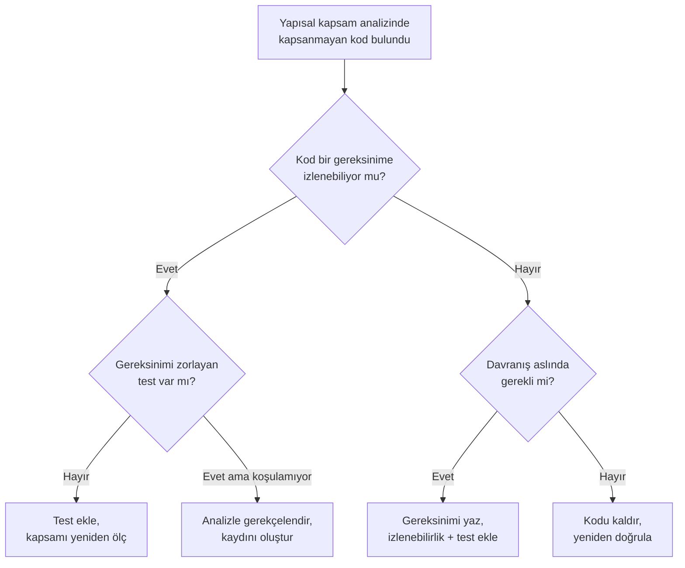

# 17. Kapsanmayan Kodlar: Ölü, Gereksiz ve Devre Dışı Bırakılmış Kodlar

Kod tabanında her görünen satır gerçek amaç taşımayabilir. Ölü, gereksiz ve devre dışı
bırakılmış kod birbirine benzer görünse de sertifikasyon açısından farklı biçimde ele
alınır.

Bu bölüm, bu tür kodların neden risk oluşturduğunu ve bunların nasıl tanımlanıp
gerekçelendirileceğini açıklar.

## Neden sorun oluştururlar?

Görünürde zararsız satırlar bile yanlış anlaşılmaya yol açabilir. Bir kod yolu artık
çalışmıyorsa ama kaynakta duruyorsa, inceleyen kişi o yolun gerçekten etkin olup
olmadığını tekrar kontrol etmek zorunda kalır. Bu da hem test yükünü hem de denetim
süresini artırır.

## Kod türleri

### Kod türlerine kısa bakış

- Ölü kod (dead code): artık hiç çalışmayan yol.
- Gereksiz kod (extraneous code): aynı işi başka yerde yapan tekrar.
- Devre dışı bırakılmış kod (deactivated code): şartla kapatılmış eski davranış.

Bu ayrım önemlidir; çünkü her birinin kaldırılması, bırakılması veya gerekçelendirilmesi
farklı kanıt ister.

## Riskler

- yanlış anlaşılma,
- gereksiz bakım yükü,
- kapsam hedeflerini bozma,
- eski davranışın kazara yeniden etkinleşmesi.

## Ölü ve gereksiz kodun ele alınması

Ölü kod ve gereksiz kod çoğunlukla yapısal kapsam
analizi (structural coverage analysis) sırasında kendini gösterir: gereksinim
tabanlı testlerin tamamı koşulmuş, ama bazı kod parçaları hiç çalışmamıştır.
Buradaki kritik nokta şudur: kapsanmayan kod, kendi başına bir sonuç değil, bir
**belirtidir**. Asıl iş, bu belirtinin arkasındaki kök nedeni bulmaktır.

### Kök neden analizi

Deneyim, kapsanmayan kodun genellikle şu dört nedenden birine indiğini gösterir:

1. **Test eksikliği** — Kod aslında bir gereksinimi gerçekliyor, ama o gereksinimi
   yeterince zorlayan test senaryosu yazılmamış. Çözüm: test eklemek veya mevcut
   testi güçlendirmek.
2. **Gereksinim eksikliği** — Kod gerekli bir davranışı gerçekliyor, ama bu davranış
   hiçbir yüksek/düşük seviyeli gereksinimde ifade edilmemiş. Çözüm: gereksinimi
   yazmak, izlenebilirliği (traceability) kurmak ve ardından testi eklemek.
3. **Gerçekten gereksiz kod** — Kod hiçbir gereksinime izlenemiyor; kopyala-yapıştır
   kalıntısı, terk edilmiş bir tasarım denemesi veya aynı işi başka yerde yapan bir
   tekrar. Çözüm: kaldırmak.
4. **Kasıtlı ama koşulamayan kod** — Savunmacı programlama kalıpları gibi, tasarım
   gereği var olan ama normal test ortamında tetiklenemeyen yollar. Çözüm: analizle
   gerekçelendirmek (bkz. aşağıdaki karar tablosu).

Bu ayrımı akışa dökersek:



### Kaldırma mı, gerekçelendirme mi?

Varsayılan karar **kaldırmaktır**. Gereksinime izlenemeyen kodun kaynak kodda
kalması, hem inceleme yükünü artırır hem de gelecekteki değişikliklerde kazara
etkinleşme riski taşır. Kaldırma kararı verildiğinde değişiklik, olağan değişiklik
sürecinden geçer: problem raporu açılır, etki analizi yapılır, etkilenen doğrulama
faaliyetleri (yeniden test, yeniden inceleme) tekrarlanır ve konfigürasyon yönetimi
(configuration management) kayıtları güncellenir. "Sadece siliyoruz, test gerekmez"
yaklaşımı tehlikelidir; silme işlemi de bir kod değişikliğidir ve derleyicinin
üreteceği çalıştırılabilir nesne kodunu değiştirebilir.

Kaldırmanın pratik olmadığı durumlar da vardır — örneğin sertifikasyon sürecinin
çok geç bir aşamasında bulunan, işlevsel etkisi olmayan küçük bir artık. Bu durumda
gerekçelendirme yoluna gidilir; ancak gerekçe "vakit yoktu"dan fazlasını söylemeli,
kodun hiçbir koşulda emniyeti etkilemeyeceğini analizle göstermelidir.

| Durum | Tipik karar | Beklenen kanıt |
|---|---|---|
| Test eksikliği | Test ekle | Yeni test senaryosu, güncel kapsam sonucu |
| Gereksinim eksikliği | Gereksinim + test ekle | Güncel gereksinim, izlenebilirlik kaydı, test |
| İzlenemeyen artık kod | Kaldır | Problem raporu, etki analizi, yeniden doğrulama |
| Savunmacı/koşulamayan yol | Analizle gerekçelendir | Yazılı analiz, inceleme kaydı |
| Geç aşamada bulunan zararsız artık | Gerekçelendir, sonraki sürümde kaldır | Analiz + açık problem raporu |

Sonuç ne olursa olsun, her kapsanmayan kod bulgusu ve verilen karar **kanıt
dosyasına yansıtılmalıdır**: bulgular yapısal kapsam analizi sonuçlarında, açık
kalan gerekçelendirmeler ise yazılım başarım özeti (software accomplishment
summary) niteliğindeki kapanış
dokümanında görünür olmalıdır. Denetçinin sormadan önce cevabı dosyada bulması,
sürecin olgunluğunun en iyi göstergesidir.

## Devre dışı bırakılmış kodun ele alınması

Devre dışı bırakılmış kod, ölü ve gereksiz koddan temel bir
noktada ayrılır: varlığı **kasıtlıdır** ve tasarım kararıyla açıklanır. Kod, mevcut
konfigürasyonda çalışmaz; ama başka bir konfigürasyonda, başka bir müşteride veya
gelecekteki bir sürümde çalışması planlanmıştır.

### Meşru kullanım senaryoları

Sahada en sık karşılaşılan durumlar şunlardır:

- **Opsiyonel donanım**: Aynı yazılım, bazı uçaklarda takılı olan bir sensörü veya
  harici bir üniteyi destekler; donanım yoksa ilgili sürücü kodu hiç çalışmaz.
- **Müşteri konfigürasyonları**: Tek bir yazılım parçası, konfigürasyon verisiyle
  farklılaşan birden çok müşteri seçeneğini barındırır (birim tercihleri, opsiyonel
  ekran sayfaları vb.).
- **Uçak tipi/model farklılıkları**: Aynı ekipman ailesi birden çok platformda
  kullanılır; platforma özgü yollar diğer platformlarda devre dışıdır.
- **Bakım ve fabrika modları**: Yalnızca yerde, özel bir bağlantı veya komutla
  etkinleşen test ve kalibrasyon işlevleri.
- **Gelecek sürüm işlevleri**: Kodda hazır bekleyen ama bu sertifikasyon temel
  hattında (baseline) etkinleştirilmeyen özellikler. Bu senaryo meşru olmakla birlikte en
  riskli olanıdır ve otoriteyle erken konuşulmalıdır.

### Yanlışlıkla etkinleşmeye karşı önlemler

Devre dışı bırakılmış kodun kabul edilebilirliği, tek bir soruya verilen cevaba
bağlıdır: **bu kod, hedef konfigürasyonda kazara çalışabilir mi?** Bunu güvence
altına almanın iki temel mekanizması vardır:

1. **Derleme zamanı ayrımı** — Kod, koşullu derleme ile nesne koduna hiç girmez.
   En güçlü yalıtımı sağlar; çalıştırılabilir nesne kodunda kod fiilen yoktur.
   Bedeli, her konfigürasyon için ayrı derleme ve ayrı doğrulama izi gerektirmesidir.
2. **Çalışma zamanı ayrımı** — Kod nesne kodunda vardır; bir konfigürasyon
   parametresi (pin programlama, konfigürasyon dosyası, strap girişi) onu kapalı
   tutar. Bu durumda parametrenin kendisi de doğrulanması gereken bir veri hâline
   gelir ve kapalı yolun kapalı kaldığı testle gösterilmelidir.

Basit bir çalışma zamanı örneği:

```c
/* Konfigürasyon verisi: uçak kablajından okunan pin programlama girişi. */
typedef enum {
    CFG_SENSOR_ABSENT  = 0u,
    CFG_SENSOR_PRESENT = 1u
} sensor_config_t;

void process_sensor_channel(sensor_config_t cfg)
{
    if (cfg == CFG_SENSOR_PRESENT) {
        /* Opsiyonel donanim takiliysa calisan yol. */
        read_optional_sensor();
        update_display_page();
    } else {
        /* Devre disi konfigurasyon: yol bilincli olarak bos birakilir,
           varsayilan guvenli deger yayimlanir. */
        publish_default_value();
    }
}
```

Bu örnekte `read_optional_sensor()` yolunun "sensörsüz" konfigürasyonda asla
çalışmayacağı, `cfg` değerinin nereden geldiğine ve nasıl doğrulandığına bağlıdır.
Pin programlama girişinin açık devre, kısa devre gibi arıza durumlarında hangi
değere düştüğü de analiz edilmelidir; aksi hâlde bir kablaj arızası, devre dışı
kodu kazara etkinleştirebilir.

### Gereken doğrulama kanıtı

Devre dışı bırakılmış kod için beklenen kanıt seti kabaca şöyledir:

- **Planlarda beyan**: Devre dışı kodun varlığı ve ele alınma yöntemi, sertifikasyon
  planlamasında baştan açıklanır; denetimde sürpriz olarak çıkmaz.
- **Tasarımda tanım**: Hangi kodun hangi konfigürasyonda devre dışı olduğu, yazılım
  mimarisi ve tasarım tanımında açıkça belirtilir.
- **Etkinleşememe kanıtı**: Kapalı yolun hedef konfigürasyonda çalışamayacağını
  gösteren analiz ve/veya test — kapatma mekanizmasının kendisi de doğrulanır.
- **Devre dışı kodun kendi doğrulaması**: Kod ileride etkinleştirilecekse, kendi
  gereksinimlerine karşı geliştirilmiş ve doğrulanmış olmalıdır; "nasılsa kapalı"
  diyerek doğrulamasız bırakılan kod, etkinleştirildiği gün borç olarak geri döner.
- **Konfigürasyon yönetimi kaydı**: Hangi temel hatta hangi konfigürasyonun geçerli
  olduğu izlenebilir olmalıdır.

Ölü kodla devre dışı kodu ayıran çizgi tam da budur: ölü kodun varlığının gerekçesi
yoktur, devre dışı kodun ise **belgelenmiş bir gerekçesi ve kontrollü bir açma
mekanizması** vardır. Gerekçe belgelenmemişse, kod fiilen ölü kod muamelesi görür.

## Yönetim yaklaşımı

Kapsanmayan kod bulunursa önce kaynağı anlaşılmalıdır. Ardından:

- gerçekten gerekli mi?
- başka yerde mi uygulanıyor?
- devre dışı bırakma gerekçesi yeterli mi?
- test ve inceleme ile doğrulandı mı?

Bu sorulara net yanıt verilemiyorsa kodun varlığı başlı başına bir risk işaretidir.

## Bu bölümden akılda kalması gerekenler

- Her satır gerçek amaç taşımayabilir.
- Ölü, gereksiz ve devre dışı kod farklı riskler doğurur.
- Kapsanmayan kod bir belirtidir; önce kök neden (eksik test mi, eksik gereksinim
  mi, gerçekten artık kod mu?) bulunur.
- Gereksinime izlenemeyen kod için varsayılan karar kaldırmaktır; kaldırma da bir
  değişikliktir ve yeniden doğrulama gerektirir.
- Devre dışı bırakılmış kodu meşru kılan şey, belgelenmiş gerekçesi ve kazara
  etkinleşmeyi önleyen doğrulanmış bir mekanizmadır.
- Her bulgu ve karar kanıt dosyasına yansıtılır; denetçi cevabı dosyada bulmalıdır.
- Kod temizliği, sertifikasyon kanıtını sadeleştirir.
