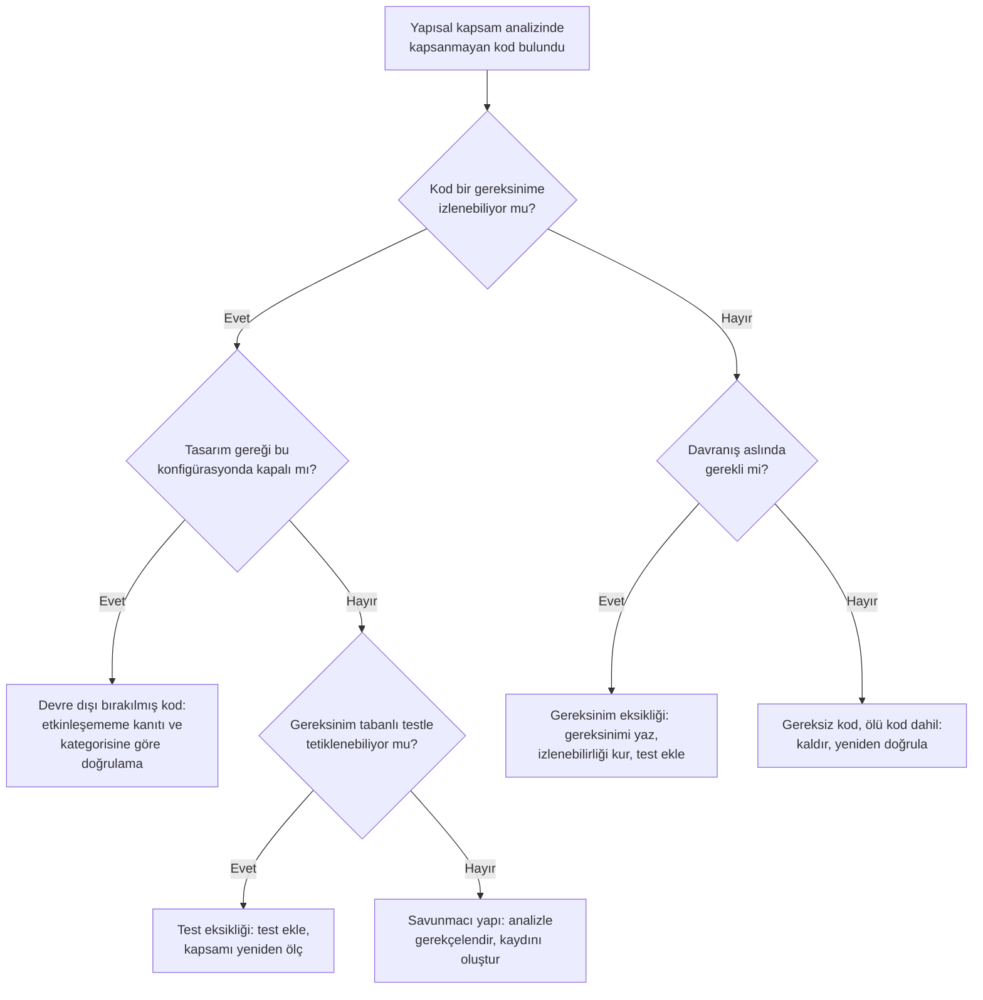

# 17. Kapsanmayan Kodlar: Ölü, Gereksiz ve Devre Dışı Bırakılmış Kodlar

Yapısal kapsam analizinde (structural coverage analysis) testlerin hiç çalıştırmadığı
kod, eksik bir testin ya da gereksinimin işareti olabileceği gibi ölü kod (dead code),
gereksiz kod (extraneous code) ya da devre dışı bırakılmış kod (deactivated code) da
olabilir. Bu bölüm, DO-178C'nin farklı ele aldığı bu üç kavramı ayıran ölçütleri,
kapsanmayan kodun kök neden analizini ve her durumda beklenen kanıtı anlatır.

Kapsam ölçütlerinin kendisi ve boşlukların kısa sınıflandırması
[9. Yazılım Doğrulama](../03-do178c-ile-gelistirme/09-yazilim-dogrulama.md) bölümündedir;
burada o sınıflandırmanın ayrıntısına ve pratikteki kararlara inilir.

## Kapsanmayan kod neden önemlidir?

Yapısal kapsam analizi iki soruya yanıt arar: gereksinim tabanlı testler
(requirements-based testing) kod yapısını yazılım seviyesinin istediği ölçüde çalıştırdı
mı, ve kodda gereksinimlere dayanmayan, niyet edilmemiş bir işlev var mı? Kapsanmayan
kod iki soruyu da açık bırakır: ya testler eksiktir ya da kodda gereksinimlerin
istemediği bir şey vardır. Hangisi olursa olsun, çalıştırılabilir nesne kodunda
(executable object code) bulunan ama hiçbir testte çalışmamış bir parçanın davranışı
bilinmez. O parça bir gün çalışırsa — bozulmuş bir işlev göstericisi, hatalı bir
konfigürasyon değeri ya da onu erişilebilir kılan sonraki bir değişiklik yüzünden — ne
yapacağını gösteren kanıt yoktur.

Emniyet gerekçesinin yanında gündelik bedeller de vardır. Kaynakta duran ama çalışmayan
bir yol, her gözden geçirmede "bu etkin mi?" sorusunu yeniden sordurur. Bakım yapan
kişi kodu gereksinimlerle eşleştiremez ve değişikliğinin etkisini kestiremez. Kapsam
raporunda açıklanmamış her boşluk da denetimde tek tek hesabı sorulan bir kalemdir.

## Üç kavram ve ayırt edici ölçütler

Üç kavramı birbirinden ayıran, kodun görünüşü değil, üç sorunun yanıtıdır:

| Kavram | Gereksinime izlenir mi? | Tasarım gereği mi var? | Çalıştırılabilir mi? | Beklenen işlem |
|---|---|---|---|---|
| Gereksiz kod | Hayır | Hayır | Olabilir | Kaldırılır; kaldırmanın etkisi analiz edilir |
| Ölü kod | Hayır | Hayır; bir geliştirme hatasının kalıntısıdır | Hayır; hiçbir işletim konfigürasyonunda | Kaldırılır; gereksiz kodun özel hâlidir |
| Devre dışı bırakılmış kod | Evet | Evet | Ya hiç ya da yalnızca belirli konfigürasyonlarda | Korunur; istem dışı çalışmasının önlendiği gösterilir |

Tabloyu okurken dört noktaya dikkat etmek gerekir:

- **Ölü kod, gereksiz kodun alt kümesidir.** Gereksiz kod çalışabilir de çalışamayabilir
  de; hiçbir işletim konfigürasyonunda çalıştırılamayan ve bir geliştirme hatası sonucu
  orada bulunan kısmına ölü kod denir. İkisinin de sonu aynıdır: kaldırılır.
- **Tanımlar veri için de geçerlidir.** Hiç okunmayan bir sabit tablo ya da kullanılmayan
  bir değişken de aynı ölçütlerle değerlendirilir; kod için "çalıştırılma" ne ise veri
  için "kullanılma" odur.
- **Düzey önemlidir.** Ölü kod ve devre dışı bırakılmış kod, çalıştırılabilir nesne
  kodunda bulunan kod ve veri üzerinden tanımlanır. Gereksiz kod ise kaynak kod ya da
  nesne kodu düzeyinde bulunabilir.
- **Ölçüt kodun yaşı değildir.** Önceden geliştirilmiş bir bileşenin kullanılmayan eski
  kısmı, gereksinime izleniyor ve tasarım kararıyla açıklanıyorsa devre dışı bırakılmış
  koddur. Gereksinimi silindiği hâlde yerinde unutulan eski kod ise gereksiz koddur.

### Sık yapılan yanlış sınıflandırmalar

Kapsam raporundaki her kırmızı satır ölü kod değildir; her "bilerek bıraktık" açıklaması
da devre dışı bırakılmış kod üretmez. Sahada en çok karıştırılan yapılar şunlardır:

| Yapı | Sık yapılan hata | Doğru ele alış |
|---|---|---|
| Savunmacı programlama (defensive programming) yapısı; ör. ulaşılmaması gereken `default` dalı | Ölü kod sayıp silmek | Ölü kod değildir; gereksinim ya da tasarım dayanağı gösterilir, testle ulaşılamayan kısım analizle gerekçelendirilir |
| Gömülü tanımlayıcı (embedded identifier); ör. imaja (image) yerleştirilmiş parça numarası, sürüm dizgesi | Kullanılmayan veri diye ölü kod saymak | Ölü kod değildir; varlık nedeni tasarımda açıklanır |
| Bağlanan ama çağrılmayan kütüphane ya da işletim sistemi işlevi | Ölü kod saymak ya da hiç anmamak | Gereksinime izleniyor ve tasarım gereği çalıştırılmıyorsa devre dışı bırakılmış koddur; planlarda beyan edilir ve etkinleşemeyeceği gösterilir. Hiçbir gereksinime izlenmiyorsa gereksiz koddur |
| Derleyicinin ya da bağlayıcının imaja almadığı kaynak kod | "İmajda yok, sorun yok" deyip bırakmak | Gereksinime izlenmiyorsa kaynak düzeyinde gereksiz koddur; kaldırılır ya da aşağıdaki iki koşul sağlanır |
| Koşullu derleme (conditional compilation) ile dışarıda bırakılan kod | Çalışma zamanında kapatılan kodla aynı kanıtı yeterli saymak | İmajda bulunmaz; sözlük tanımı çalıştırılabilir nesne kodunu esas aldığından tanımın harfiyle devre dışı bırakılmış kod değildir, ama uygulamada o başlık altında planlandığı da görülür. Her derleme varyantı ayrı doğrulanır |
| Derleyicinin eklediği, kaynak koda doğrudan izlenemeyen nesne kodu | Gereksiz ya da devre dışı bırakılmış kod saymak | Aralık ve dizi indisi denetimi gibi eklemeler gerçekleştirmenin parçasıdır; Seviye A'da belirlenir ve doğruluğu ek doğrulamayla gösterilir |

Savunmacı yapı etiketi kolayca kötüye kullanılır: açıklanamayan her boşluğa "savunmacı"
demek cazip gelir. Denetimde sorulan soru bellidir: bu yapıyı hangi gereksinim, hangi
tasarım kararı ya da kodlama standardının hangi kuralı istiyor? Yanıt yoksa yapı savunmacı
değil, gereksizdir.

Kütüphane ve gerçek zamanlı işletim sistemi (real-time operating system, RTOS) işlevleri
ayrı bir dikkat ister, çünkü bağlayıcı çoğu zaman projenin çağırmadığı işlevleri de imaja
çeker. Bunların hangi sınıfa girdiğini kullanılmamaları değil, ardındaki veri belirler;
ayrıntısı [20. Gerçek Zamanlı İşletim Sistemleri](./20-gercek-zamanli-isletim-sistemleri.md)
bölümünde ve
[Ek B: Gerçek Zamanlı İşletim Sistemlerinde Endişe Alanları](../06-ekler/02-ek-b-rtos-endise-alanlari.md)
sayfasındadır. Önceden geliştirilmiş yazılımın (previously developed software, PDS)
kullanılmayan kısımları için aynı soru
[24. Yazılım Yeniden Kullanımı](./24-yazilim-yeniden-kullanimi.md) bölümünde ele alınır.

Kaynakta bulunan ama imaja girmeyen gereksiz kod için DO-178C dar bir kapı bırakır: kodun
çalıştırılabilir nesne kodunda bulunmadığı analizle gösterilir ve sonraki derlemelere
girmesini önleyen prosedürler tanımlanırsa kod kaynakta kalabilir. Eniyileme düzeyi ya da
bağlayıcı seçeneği değiştiğinde aynı kod imaja geri dönebileceği için ikinci koşul
birincisi kadar önemlidir. Temiz çözüm yine kaldırmaktır.

## Ölü ve gereksiz kodun ele alınması

Ölü kod ve gereksiz kod çoğunlukla yapısal kapsam analizi sırasında kendini gösterir:
gereksinim tabanlı testlerin tamamı koşulmuş, ama bazı kod parçaları hiç çalışmamıştır.
Buradaki kritik nokta şudur: kapsanmayan kod, kendi başına bir sonuç değil, bir
**belirtidir**. Asıl iş, bu belirtinin arkasındaki kök nedeni bulmaktır.

### Kök neden analizi

DO-178C, kapsanmayan kod için dört olası neden sayar:

1. **Test eksikliği** — Kod bir gereksinimi gerçekliyor, ama gereksinim tabanlı test
   durumları ya da prosedürleri o yolu tetiklememiş. Çözüm: test durumu (test case)
   eklemek ya da mevcut testi güçlendirmek; boşluğu gereksinim kapsam analizinin neden
   yakalamadığına da bakılır.
2. **Gereksinim eksikliği** — Kod gerekli bir davranışı gerçekliyor, ama bu davranış
   hiçbir yüksek ya da düşük seviyeli gereksinimde yazmıyor. Çözüm: gereksinimi yazmak,
   izlenebilirliği (traceability) kurmak ve ardından testi eklemek.
3. **Gereksiz kod (ölü kod dahil)** — Kod hiçbir gereksinime izlenemiyor: kopyala-yapıştır
   kalıntısı, terk edilmiş bir tasarım denemesi, unutulmuş bir hata ayıklama işlevi.
   Çözüm: kaldırmak.
4. **Devre dışı bırakılmış kod** — Kod gereksinime izleniyor ve tasarım gereği bu
   konfigürasyonda çalışmıyor. Çözüm: korumak ve aşağıda anlatılan kanıtı üretmek.

Savunmacı programlama yapıları bu sınıflandırmada özel bir yer tutar: kod gereksinime
ya da tasarıma izlenir ve her konfigürasyonda etkindir, ama onu tetikleyecek koşul test
ortamında üretilemeyebilir. Testle ulaşılamayan kısım analizle gerekçelendirilir.

İzlenebilirlik sorusu işlev düzeyinde değil, kapsanmayan yapının düzeyinde sorulur.
İşlevin bütünü bir gereksinime bağlı olabilir; önemli olan, çalışmayan dalın ya da
deyimin o gereksinimin hangi cümlesini gerçeklediğidir. Bu ayrımı akışa dökersek:


```mermaid
flowchart TD
    A["Yapısal kapsam analizinde<br/>kapsanmayan kod bulundu"] --> B{"Kod bir gereksinime<br/>izlenebiliyor mu?"}
    B -- Evet --> K{"Tasarım gereği bu<br/>konfigürasyonda kapalı mı?"}
    K -- Evet --> L["Devre dışı bırakılmış kod:<br/>etkinleşememe kanıtı ve<br/>kategorisine göre doğrulama"]
    K -- Hayır --> C{"Gereksinim tabanlı testle<br/>tetiklenebiliyor mu?"}
    C -- Evet --> D["Test eksikliği: test ekle,<br/>kapsamı yeniden ölç"]
    C -- Hayır --> E["Savunmacı yapı: analizle<br/>gerekçelendir, kaydını oluştur"]
    B -- Hayır --> F{"Davranış aslında<br/>gerekli mi?"}
    F -- Evet --> G["Gereksinim eksikliği: gereksinimi yaz,<br/>izlenebilirliği kur, test ekle"]
    F -- Hayır --> H["Gereksiz kod, ölü kod dahil:<br/>kaldır, yeniden doğrula"]
```

"Davranış aslında gerekli mi?" sorusuna kolayca "evet" denmemelidir. Kodu haklı çıkarmak
için sonradan gereksinim yazmak tersine mühendisliktir: gereksinim gerçek bir ihtiyacı
anlatmalı, gözden geçirilmeli ve türetilmiş gereksinimse (derived requirement) sistem
süreçlerine geri bildirilmelidir (bkz.
[25. Tersine Mühendislik](./25-tersine-muhendislik.md)).

### İki kısa örnek

İlki ölü kod. Aşağıdaki işlevde dıştaki koşul hızın üst sınırı aşmadığını zaten
güvenceye alıyor; içteki son `else` dalına hiçbir girdiyle ulaşılamaz:

```c
#define HIZ_UST_SINIR_KNOT   (350u)
#define HIZ_BANT_SINIRI_KNOT (150u)
#define KAZANC_DUSUK_HIZ     (12)
#define KAZANC_YUKSEK_HIZ    (7)
#define KAZANC_VARSAYILAN    (0)

bool kazanc_sec(uint16_t hiz_knot, int32_t *kazanc)
{
    bool gecerli = false;

    if ((kazanc != NULL) && (hiz_knot <= HIZ_UST_SINIR_KNOT)) {
        if (hiz_knot < HIZ_BANT_SINIRI_KNOT) {
            *kazanc = KAZANC_DUSUK_HIZ;
        } else if (hiz_knot <= HIZ_UST_SINIR_KNOT) {
            *kazanc = KAZANC_YUKSEK_HIZ;
        } else {
            *kazanc = KAZANC_VARSAYILAN;  /* ulaşılamaz: dış koşul bu durumu dışlar */
        }
        gecerli = true;
    }

    return gecerli;
}
```

Kapsam raporunda bu durum iki izle görünür: son atama deyimi hiç çalışmamıştır ve
`else if` kararı hiç yanlış sonuçlanmamıştır. Dal, aralık denetimi dışarı taşınırken
içeride unutulmuş bir kalıntıdır; hiçbir gereksinim "varsayılan kazanç" diye bir
davranış tanımlamaz. Çözüm ikinci koşulu ve ölü dalı silmektir. Aynı satırlar bir
tasarım kararına dayansaydı savunmacı yapı sayılırdı; sınıfı belirleyen kodun biçimi
değil, dayanağıdır. Derleyici bu dalı eniyileme sırasında atabilir; o zaman kod imajda
yoktur ama kaynakta gereksiz kod olarak durmaya devam eder.

İkincisi ölü olmayan gereksiz kod. Bakım portundan gelen komutları işleyen tabloda bir
geliştirme kalıntısı duruyor:

```c
static const komut_girdisi_t komut_tablosu[] = {
    { KOMUT_DURUM_SORGULA, durum_sorgula },
    { KOMUT_OZ_TEST,       oz_test_baslat },
    { KOMUT_BELLEK_DOKUMU, bellek_dokumu_gonder }  /* gereksinimi yok */
};
```

Hiçbir gereksinim bellek dökümü komutundan söz etmediği için hiçbir test bu komutu
göndermez; kapsam raporunda `bellek_dokumu_gonder()` işlevinin tamamı çalışmamış
görünür. Kod ölü değildir: komut kodu porta ulaştığı anda çalışır ve davranışı hiç
doğrulanmamıştır. Gereksiz kodun emniyet açısından asıl rahatsız edici türü budur.

### Kaldırma mı, gerekçelendirme mi?

Varsayılan karar **kaldırmaktır**. Gereksinime izlenemeyen kodun kaynak kodda kalması,
hem gözden geçirme yükünü artırır hem de gelecekteki değişikliklerde istem dışı
etkinleşme (inadvertent enabling) riski taşır. Kaldırma kararı verildiğinde değişiklik,
olağan değişiklik sürecinden geçer: problem raporu (problem report) açılır, değişiklik
etki analizi (change impact analysis) yapılır, etkilenen doğrulama faaliyetleri (yeniden
test, yeniden gözden geçirme) tekrarlanır ve konfigürasyon yönetimi (configuration
management) kayıtları güncellenir. "Sadece siliyoruz, test gerekmez" yaklaşımı
tehlikelidir; silme işlemi de bir kod değişikliğidir ve derleyicinin üreteceği
çalıştırılabilir nesne kodunu değiştirebilir.

Kaldırmanın pratik olmadığı durumlar da yaşanır — örneğin sertifikasyon sürecinin çok
geç bir aşamasında bulunan, işlevsel etkisi olmayan küçük bir artık. Kodu bu sürümde
bırakmak standardın öngördüğü bir çözüm değildir; standarttan sapma olarak ele alınır
ve uygulamada üç şey gerektirir: sertifikasyon otoritesiyle önceden mutabakat, kodun
hiçbir koşulda emniyeti etkilemeyeceğini gösteren ve sistem emniyet değerlendirme
süreciyle desteklenen bir analiz, ve konunun açık problem raporu olarak sunulması.
Gerekçe "vakit yoktu"dan fazlasını söylemelidir. Açık raporların nasıl sınıflandırıldığı
[9. Yazılım Doğrulama](../03-do178c-ile-gelistirme/09-yazilim-dogrulama.md) bölümünde
anlatılır.

| Durum | Tipik karar | Beklenen kanıt |
|---|---|---|
| Test eksikliği | Test durumu ekle | Yeni test durumu ve prosedürü, güncel kapsam sonucu |
| Gereksinim eksikliği | Gereksinim ve test ekle | Güncel gereksinim, izlenebilirlik kaydı, test |
| Gereksiz kod (ölü kod dahil) | Kaldır | Problem raporu, değişiklik etki analizi, yeniden doğrulama |
| Savunmacı yapı | Analizle gerekçelendir | Gereksinim ya da tasarım dayanağı, yazılı analiz, gözden geçirme kaydı |
| Devre dışı bırakılmış kod | Koru | Planlarda beyan, etkinleşememe kanıtı, kategorisine göre doğrulama |
| Geç aşamada bulunan gereksiz kod | Otoriteyle mutabakat; sonraki sürümde kaldır | Emniyet analizi, açık problem raporu |

Sonuç ne olursa olsun, her kapsanmayan kod bulgusu ve verilen karar **kanıt dosyasına
yansıtılmalıdır**: bulgular ve gerekçeleri yapısal kapsam analizi sonuçlarında, açık
kalan konular ise yazılım başarı özetinde (Software Accomplishment Summary, SAS) görünür
olmalıdır (bkz.
[12. Sertifikasyon İrtibatı](../03-do178c-ile-gelistirme/12-sertifikasyon-irtibati.md)).
Denetçinin sormadan önce cevabı dosyada bulması, sürecin olgunluğunun en iyi
göstergesidir.

## Devre dışı bırakılmış kodun ele alınması

Devre dışı bırakılmış kod, ölü ve gereksiz koddan temel bir noktada ayrılır: varlığı
**kasıtlıdır**, gereksinime izlenir ve tasarım kararıyla açıklanır. DO-178C iki
kategoriyi ayırır ve doğrulama beklentisi kategoriye göre değişir:

- **Birinci kategori: sertifikalı hiçbir ürünün güncel konfigürasyonunda çalıştırılması
  amaçlanmayan kod** — önceden geliştirilmiş bir bileşenin kullanılmayan kısmı,
  kullanılmayan kütüphane işlevi, gelecekteki büyüme için eklenmiş kod.
- **İkinci kategori: hedef ortamın yalnızca belirli onaylı konfigürasyonlarında çalışan
  kod** — donanım pinleriyle ya da yazılımla programlanan bir seçenekle etkinleşen işlev.

### Meşru kullanım senaryoları

Sahada en sık karşılaşılan durumlar şunlardır:

- **Opsiyonel donanım**: Aynı yazılım, bazı uçaklarda takılı olan bir sensörü veya
  harici bir üniteyi destekler; donanım yoksa ilgili sürücü kodu hiç çalışmaz.
- **Müşteri konfigürasyonları**: Tek bir yazılım parçası, konfigürasyon verisiyle
  farklılaşan birden çok müşteri seçeneğini barındırır (birim tercihleri, opsiyonel
  ekran sayfaları vb.).
- **Uçak tipi/model farklılıkları**: Aynı ekipman ailesi birden çok platformda
  kullanılır; platforma özgü yollar diğer platformlarda devre dışıdır.
- **Bakım ve fabrika modları**: Yalnızca yerde, özel bir bağlantı veya komutla
  etkinleşen test ve kalibrasyon işlevleri.
- **Yeniden kullanılan bileşenler ve kütüphaneler**: Başka bir proje için geliştirilmiş
  bileşenin ya da bir kütüphanenin, bu projenin çağırmadığı ama imaja giren işlevleri.
- **Gelecek sürüm işlevleri**: Kodda hazır bekleyen ama bu sertifikasyon temel çizgisinde
  (baseline) etkinleştirilmeyen özellikler. Bu senaryo meşru olmakla birlikte en
  riskli olanıdır ve otoriteyle erken konuşulmalıdır.

### İstem dışı etkinleşmeye karşı önlemler

Devre dışı bırakılmış kodun kabul edilebilirliği, tek bir soruya verilen cevaba
bağlıdır: **bu kod, hedef konfigürasyonda istem dışı çalışabilir mi?** Tasarımdan
beklenen, devre dışı kodun etkin işlevleri olumsuz etkilemesini önleyen bir mekanizmanın
bilerek tasarlanıp gerçekleştirilmesidir. Bozulmuş bir program sayacı gibi anormal sistem
koşullarından doğan istem dışı çalışmayı ise standart, etkin kodun istem dışı
çalışmasından ayrı tutmaz. Pratikte iki ayrım yolu görülür:

1. **Derleme zamanı ayrımı** — Kod, koşullu derleme ile nesne koduna hiç girmez.
   En güçlü yalıtımı sağlar; çalıştırılabilir nesne kodunda kod fiilen yoktur.
   Sözlük tanımı çalıştırılabilir nesne kodunu esas aldığından bu kod tanımın harfiyle
   devre dışı bırakılmış kod sayılmaz; standart bu durumu ayrıca ele almaz, uygulamada
   ise yine bu başlık altında planlandığı sık görülür. Adı ne olursa olsun kanıt yükü
   etkinleşememeyi göstermekten, kodun imajda gerçekten bulunmadığını teyit etmeye, her
   derleme varyantını ayrı bir çalıştırılabilir nesne kodu olarak doğrulamaya ve derleme
   seçeneklerini konfigürasyon kontrolünde tutmaya kayar.
2. **Çalışma zamanı ayrımı** — Kod nesne kodunda vardır; bir konfigürasyon
   parametresi (pin programlama, konfigürasyon dosyası, strap girişi) onu kapalı
   tutar. Bu durumda parametrenin kendisi de doğrulanması gereken bir veri hâline
   gelir ve kapalı yolun kapalı kaldığı testle gösterilmelidir. Parametre ayrı bir
   dosyada tutuluyorsa parametre verisi öğesi (parameter data item, PDI) kuralları da
   devreye girer (bkz. [22. Konfigürasyon Verisi](./22-konfigurasyon-verisi.md)).

Basit bir çalışma zamanı örneği:

```c
/* Konfigürasyon verisi: uçak kablajından okunan pin programlama girişi. */
typedef enum {
    SENSOR_YOK = 0,
    SENSOR_VAR = 1
} sensor_konfig_t;

void opsiyonel_sensoru_oku(void);
void ekran_sayfasini_guncelle(void);
void varsayilan_degeri_yayimla(void);
void konfigurasyon_arizasi_bildir(void);

void sensor_kanalini_isle(sensor_konfig_t konfig)
{
    if (konfig == SENSOR_VAR) {
        /* Opsiyonel donanım takılıysa çalışan yol. */
        opsiyonel_sensoru_oku();
        ekran_sayfasini_guncelle();
    } else if (konfig == SENSOR_YOK) {
        /* Sensör yolu çalıştırılmaz; varsayılan emniyetli değer yayımlanır. */
        varsayilan_degeri_yayimla();
    } else {
        /* Tanımsız konfigürasyon değeri: sensör yolu kapalı kalır, arıza bildirilir. */
        varsayilan_degeri_yayimla();
        konfigurasyon_arizasi_bildir();
    }
}
```

Bu örnekte `opsiyonel_sensoru_oku()` yolunun "sensörsüz" konfigürasyonda asla
çalışmayacağı, `konfig` değerinin nereden geldiğine ve nasıl doğrulandığına bağlıdır.
Tanımlı iki değerin dışındaki her değer kapalı tarafa düşer ve arıza olarak bildirilir;
bozuk bir değerin sessizce "sensör var" diye yorumlanması önlenmiştir. Pin programlama
girişinin açık devre, kısa devre gibi arıza durumlarında hangi değere düştüğü de analiz
edilmelidir; aksi hâlde bir kablaj arızası, devre dışı kodu istem dışı
etkinleştirebilir.

### Gereken doğrulama kanıtı

Devre dışı bırakılmış kod da gereksinime izlenir ve geliştirilmesi etkin kodla aynı
hedeflere (objective) tabidir: gereksinimi, tasarımı ve gözden geçirmesi vardır. Bunun
üzerine beklenen kanıt seti kabaca şöyledir:

- **Planlarda beyan**: Devre dışı kodun varlığı ve ele alınma yöntemi yazılım
  sertifikasyon planında (Plan for Software Aspects of Certification, PSAC) baştan
  açıklanır, doğrulama yaklaşımı yazılım doğrulama planında (Software Verification Plan,
  SVP) yer alır; denetimde sürpriz olarak çıkmaz (bkz.
  [5. Yazılım Planlama](../03-do178c-ile-gelistirme/05-yazilim-planlama.md)).
- **Tasarımda tanım**: Hangi kodun hangi konfigürasyonda devre dışı olduğu ve onu kapalı
  tutan mekanizma, yazılım mimarisi ve tasarım tanımında açıkça belirtilir.
- **Birinci kategori için etkinleşememe kanıtı**: Kodu çalıştırabilecek yollar (çağrı,
  işlev göstericisi, konfigürasyon değeri) tek tek çıkarılır; her birinin kapalı,
  yalıtılmış ya da hiç var olmadığı analizle ortaya konur ve kapatma mekanizması testle
  sınanır. Bu koda farklı bir yazılım seviyesi atanacaksa gerekçesi sistem emniyet
  değerlendirme sürecinden, doğrulaması hafifletilecekse gerekçesi yazılım geliştirme
  süreçlerinden gelir; ikisi de PSAC'a yazılır.
- **İkinci kategori için kendi doğrulaması**: Kodun çalıştığı konfigürasyon kurulur ve
  kapsam hedefleri ek test durumları ve prosedürleriyle o konfigürasyonda karşılanır.
  Hedef konfigürasyon için ise yolun kapalı kaldığı gösterilir.
- **Konfigürasyon yönetimi kaydı**: Hangi temel çizgide hangi konfigürasyonun geçerli
  olduğu ve hangi kodun devre dışı kaldığı izlenebilir olmalıdır.

Gelecek sürüm işlevleri birinci kategoriye girer; bu sürümde yapısal kapsam açısından
beklenen, etkinleşememelerinin gösterilmesidir. Ancak "nasılsa kapalı" diyerek
gereksinimsiz ve gözden geçirmesiz bırakılan kod, etkinleştirileceği gün borç olarak geri
döner: o gün kendi konfigürasyonunda testleri ve kapsam analizi tamamlanmadan kredi
alınamaz.

Gereksiz kodla devre dışı bırakılmış kodu ayıran çizgi tam da budur: devre dışı kod
gereksinime izlenir, tasarım kararıyla açıklanır ve **doğrulanmış bir kapatma
mekanizması** vardır. Bu izlenebilirlik yoksa kod gereksiz kod — çalışması olanaksızsa
ölü kod — olarak ele alınır ve kaldırılması beklenir.

## Önleme: sorunu kapsam analizinden önce yakalamak

Kapsam analizi bu kodları bulmanın son ve en pahalı yeridir; bulgu oraya kaldığında
testler yazılmış, temel çizgiler atılmıştır. Daha erken ve ucuz üç denetim noktası
vardır:

- **Kod gözden geçirmesinde izlenebilirlik denetimi.** Her işlevin, hatta her dalın
  hangi gereksinimi gerçeklediği sorulur; bağlanamayan kod o anda açıklanır ya da
  silinir (bkz.
  [8. Yazılım Gerçekleştirme: Kodlama ve Entegrasyon](../03-do178c-ile-gelistirme/08-yazilim-gerceklestirme-kodlama-entegrasyon.md)).
- **Statik analiz ve derleyici uyarıları.** Erişilemeyen kod, hiç çağrılmayan işlev ve
  kullanılmayan değişken, araçların iyi bulduğu kusurlardır. Bağlayıcının harita
  dosyası da imaja hangi işlevlerin gerçekten girdiğini gösterir.
- **Kapsamın geliştirme boyunca izlenmesi.** Kapsam verisi testler yazıldıkça
  toplanırsa her boşluk, bağlamı tazeyken tek tek çözülür.

Bir de süreç alışkanlığı vardır: bir gereksinim silindiğinde ya da değiştiğinde, ona
izlenen kod ve testler aynı değişiklik kapsamında ele alınır. Gereksiz kodun en yaygın
kaynağı, gereksinimi kaldırılıp kodu yerinde bırakılan işlevlerdir. Otoritenin kapsam
boşluklarında baktığı noktalar [SW SOI-3](../kaynaklar/soi-3.md) kontrol listesindedir.

## Bu bölümden akılda kalması gerekenler

- Kapsanmayan kod bir belirtidir; önce kök neden bulunur: test eksikliği, gereksinim
  eksikliği, gereksiz kod (ölü kod dahil) ya da devre dışı bırakılmış kod.
- Sınıfı kodun görünüşü değil üç soru belirler: gereksinime izleniyor mu, tasarım
  gereği mi var, çalıştırılabilir mi? Aynı ölçütler veri için de geçerlidir.
- Ölü kod gereksiz kodun özel hâlidir. İkisi de kaldırılır; kaldırma da bir
  değişikliktir, etkisi analiz edilir ve gereken doğrulama yinelenir.
- Savunmacı yapılar, gömülü tanımlayıcılar ve koşulları sağlanan kullanılmayan kütüphane
  işlevleri ölü kod değildir; ama her biri dayanağını göstermek zorundadır.
- Devre dışı bırakılmış kod gereksinime izlenir, planlarda beyan edilir ve
  kategorisine göre doğrulanır: ya istem dışı çalışmasının önlendiği gösterilir ya da
  çalıştığı konfigürasyonda test edilir.
- Gereksiz kodu geç aşamada yerinde bırakmak standardın yolu değildir; otorite
  mutabakatı, emniyet analizi ve açık problem raporu gerektirir.
- Her bulgu ve karar kanıt dosyasına yansıtılır; denetçi cevabı dosyada bulmalıdır.
