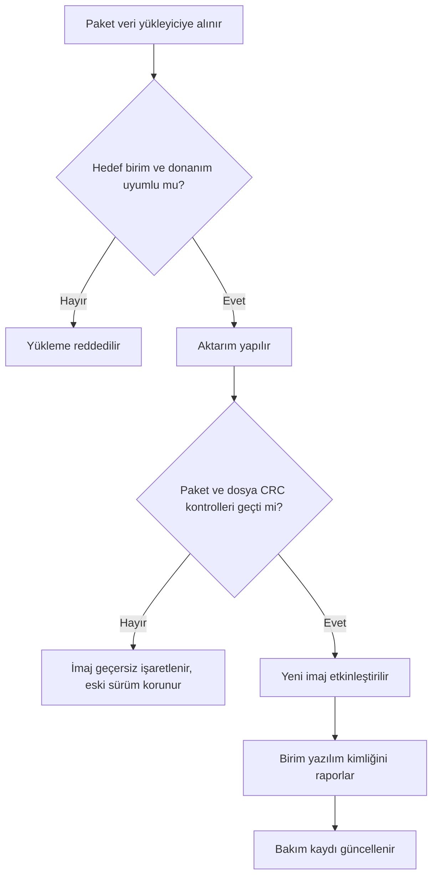

# 18. Sahada Yüklenebilir Yazılım

Sahada yüklenebilir yazılım (field-loadable software, FLS), sistemin kullanım
sırasında güncellenmesini sağlar.
Ancak bu esneklik, bütünlük, uyumluluk ve geri dönüş planı gereksinimlerini de
beraberinde getirir.

Bu bölüm, güncelleme paketlerinin nasıl kontrol edildiğini ve yükleme sonrası
sistemin güvenli durumda kalmasının nasıl gösterildiğini açıklar.

## Sahada yükleme ne demektir?

Sahada yüklenebilir yazılım, bakım veya operasyon aşamasında yeni bir sürümün sisteme
aktarılmasıdır. Bu süreçte yalnızca paket içeriği değil, yükleme koşulları, kimlik
doğrulama ve geri dönüş stratejisi de önemlidir.

## Ana riskler

- yanlış paketin yüklenmesi,
- uyumsuz sürüm çifti,
- kurulum sırasında güç kesilmesi,
- bütünlüğü bozuk dosya,
- geri dönüş planının eksik olması.

Bu riskler, yalnızca kurulum anını değil, uçuş sonrası davranışı da etkileyebilir.

## Kontrol noktaları

Bir yükleme akışında genellikle şu kontroller vardır:

1. paket kimlik doğrulaması,
2. sürüm ve platform uyumu,
3. bütünlük kontrolü,
4. yükleme sonrasında doğrulama,
5. gerektiğinde eski sürüme dönüş.

### Yükleme örneği

Bir yazılım paketi önce kimlik doğrulamasından geçer, sonra uygun sürümle eşleştiği
doğrulanır, en son kurulumdan sonra bütünlük testi yapılır.

## Faydaları ve zorlukları

Sahada yüklenebilir yazılım yaklaşımının en görünür
faydası, bir yazılım güncellemesi için donanımın uçaktan sökülüp üretici tesisine
gönderilmesine gerek kalmamasıdır. Klasik yaklaşımda yazılım, hat değiştirilebilir
birimin (line replaceable unit, LRU) fabrikada programlanan kalıcı bir parçasıdır;
her yazılım değişikliği, birimin sökülmesi, yeniden programlanması ve uçağa geri
takılması demektir. Sahada yükleme bu döngüyü, hangarda birkaç saatlik bir bakım
işlemine indirger.

Filo ölçeğinde bakıldığında fayda daha da belirginleşir:

- **Hızlı hata düzeltme:** Operasyonda keşfedilen bir yazılım hatası, tüm filoya
  haftalar yerine günler içinde dağıtılabilir.
- **Kademeli işlev ekleme:** Yeni işlevler, donanım değişikliği olmadan sonraki
  yazılım sürümleriyle devreye alınabilir.
- **Yedek parça sadeleşmesi:** Aynı donanım parça numarası farklı yazılım
  sürümleriyle kullanılabildiğinden, depoda tutulması gereken donanım çeşidi azalır.
- **Filo yönetimi:** Hangi uçakta hangi yazılım sürümünün bulunduğu merkezi olarak
  izlenebilir ve güncelleme kampanyaları planlı biçimde yürütülebilir.

Bu esnekliğin bedeli, konfigürasyon yönetimi yükünün belirgin biçimde artmasıdır.
Yazılım artık donanımın içine gömülü tek bir bütün değil, kendi parça numarasına
(part number) sahip ayrı bir konfigürasyon öğesidir. Bu da şu zorlukları getirir:

- **Parça numarası yönetimi:** Donanım parça numarası ile yazılım parça numarası
  ayrışır; her yazılım sürümü ayrı bir parça numarası alır ve uçak kayıtlarında
  ayrı izlenir. Yanlış parça numarasının yüklenmesi, fiziksel olarak yanlış parçanın
  takılmasıyla eşdeğer bir bakım hatasıdır.
- **Uyumluluk matrisi:** Hangi yazılım sürümünün hangi donanım revizyonuyla, hangi
  komşu sistem sürümleriyle ve hangi uçak konfigürasyonuyla birlikte kullanılabileceği
  bir uyumluluk matrisinde tanımlanır ve her sürümde güncellenir. Matris dışı bir
  kombinasyon, tek tek onaylı iki parçanın birlikte onaysız bir sistem oluşturması
  anlamına gelir.
- **Onaylı yükleme prosedürleri:** Yükleme işlemi, bakım dokümantasyonunda tanımlı,
  eğitimli personelce uygulanan ve kayıt altına alınan onaylı bir prosedürle yapılır.
  Yükleme sonrasında sürüm doğrulaması yapılıp bakım kaydına işlenmeden uçak servise
  verilmez.
- **Sertifikasyon kanıtı:** Yükleme mekanizmasının kendisi de (yer ekipmanı, veri
  yükleyici, uçaktaki yükleme yazılımı) güvenilirliğini gösteren kanıtlarla
  desteklenmelidir; bütünlük kontrolleri yeterince güçlüyse aktarım zincirinin
  her halkasını ayrı ayrı nitelemek gerekmeyebilir, ancak bu gerekçe açıkça
  yazılmalıdır.

| Boyut | Fayda | Karşılığında gelen yük |
|---|---|---|
| Bakım süresi | Söküm yok, hangarda güncelleme | Onaylı prosedür ve kayıt zorunluluğu |
| Hata düzeltme | Filoya hızlı dağıtım | Her sürüm için ayrı parça numarası |
| Donanım lojistiği | Daha az donanım çeşidi | Yazılım/donanım uyumluluk matrisi |
| İşlev geliştirme | Donanımsız işlev ekleme | Sürüm başına yeniden doğrulama kapsamı |

Deneyim şunu gösteriyor: sahada yükleme kararı geç alındığında, faydalar aynı kalır
ama zorluklar katlanır. Bu nedenle bir sonraki alt bölümün konusu olan "baştan
tasarım" yaklaşımı, bu dengeyi lehinize çevirmenin tek gerçekçi yoludur.

## Sistemin sahada yüklenebilir tasarlanması

Sahada yüklenebilirlik, sonradan eklenebilecek bir özellik değildir; bellek düzeninden
gereksinim setine kadar sistemin pek çok katmanını etkiler. Baştan tasarlandığında
dört ana yapı taşı öne çıkar: yükleme arayüzü, paket biçimi, bütünlük mekanizmaları
ve yükleme sonrası kimlik raporlama.

**Yükleme arayüzü.** Uçaktaki birim ile yer ekipmanındaki veri yükleyici (data loader)
arasındaki fiziksel ve mantıksal arayüz erken tanımlanmalıdır. Endüstride yaygın
uygulama, Ethernet üzerinden çalışan standartlaşmış veri yükleme protokolleridir
(örneğin ARINC 615A ailesi); özel arayüzler de mümkündür ama her özel çözüm, yer
ekipmanı tarafında ek geliştirme ve bakım yükü demektir. Arayüz tasarımında yalnızca
"mutlu yol" değil, bağlantı kopması, zaman aşımı ve yarıda kesilen aktarım gibi
durumların davranışı da gereksinim olarak yazılmalıdır.

**Paket biçimi.** Yüklenen şey tek bir ikili dosya değil, üst veri (metadata) ile
birlikte paketlenmiş bir yazılım parçasıdır. İyi bir paket biçimi en azından şunları
içerir:

- yazılım parça numarası ve sürüm bilgisi,
- hedef donanım tanımı (hangi birime, hangi donanım revizyonuna),
- dosya listesi ve her dosyanın bütünlük değeri,
- paketin tamamını kapsayan bir bütünlük değeri.

Bu alanlar sayesinde yükleyici, aktarıma başlamadan önce "bu paket bu birime uygun mu"
sorusunu yanıtlayabilir; yanlış paketin yanlış birime yüklenmesi mekanizma düzeyinde
engellenir.

**Bütünlük mekanizmaları.** Aktarım ve saklama sırasında bozulmayı yakalamak için her
dosyaya ve pakete sağlama toplamı (checksum) veya döngüsel artıklık denetimi (cyclic
redundancy check, CRC) eklenir. Kritik nokta, kontrolün yalnızca aktarım sırasında
değil, birimin her açılışında da yapılmasıdır: çalıştırılabilir nesne kodu bellekten
okunup CRC'si beklenen değerle karşılaştırılmadan uçuş yazılımı başlatılmaz.

```c
/* Açılışta yazılım bölgesinin bütünlük kontrolü (kavramsal örnek) */
uint32_t hesaplanan = crc32_hesapla(yazilim_baslangic, yazilim_boyut);

if (hesaplanan != yuklu_paket.beklenen_crc) {
    /* Bozuk imaj: uygulama başlatılmaz, birim yükleme moduna geçer */
    hata_kaydi_yaz(HATA_IMAJ_BUTUNLUK);
    yukleme_moduna_gec();
}
```

**Yükleme sonrası kimlik raporlama.** Yükleme bittiğinde birim, üzerinde fiilen hangi
yazılımın bulunduğunu kanıtlanabilir biçimde bildirebilmelidir: bakım terminaline veya
kokpit ekranına yazılım parça numarasını, sürümünü ve bütünlük değerini raporlamak gibi.
Bu rapor, bakım personelinin "yükleme başarılı" kararını dayandırdığı nesnel kanıttır
ve uçak konfigürasyon kayıtlarıyla izlenebilirlik sağlar.



Bu yapı taşlarının ortak amacı şudur: yükleme sürecinin her adımı ya doğrulanabilir
biçimde başarılıdır ya da sistem bilinen güvenli bir duruma (eski sürüm veya yükleme
modu) döner. Ara durumda kalmış, kimliği belirsiz bir birim kabul edilemez.

## Güvenli durum

Sahada yükleme sırasında sistemin güvenli durumda kalması gerekir. Bu nedenle yükleme
yarıda kalırsa ne olacağı, hangi modun etkin olacağı ve operasyona nasıl geri dönüleceği
önceden tanımlanmalıdır.

## Bu bölümden akılda kalması gerekenler

- Sahada yükleme, operasyonel esneklik sağlar ama risk de taşır.
- Faydanın bedeli konfigürasyon yönetimi yüküdür: yazılım ayrı bir parça numarasıyla
  izlenir, uyumluluk matrisi her sürümde güncellenir ve yükleme yalnızca onaylı
  prosedürle yapılır.
- Sahada yüklenebilirlik baştan tasarlanır: yükleme arayüzü, üst verili paket biçimi,
  CRC tabanlı bütünlük kontrolleri ve yükleme sonrası kimlik raporlama sistemin
  parçasıdır.
- Paket bütünlüğü ve sürüm uyumu kritik kontrol noktalarıdır; bütünlük kontrolü her
  açılışta tekrarlanmalıdır.
- Geri dönüş planı olmadan güncelleme güvenli sayılmaz; her adım ya doğrulanabilir
  biçimde başarılıdır ya da sistem bilinen güvenli duruma döner.
