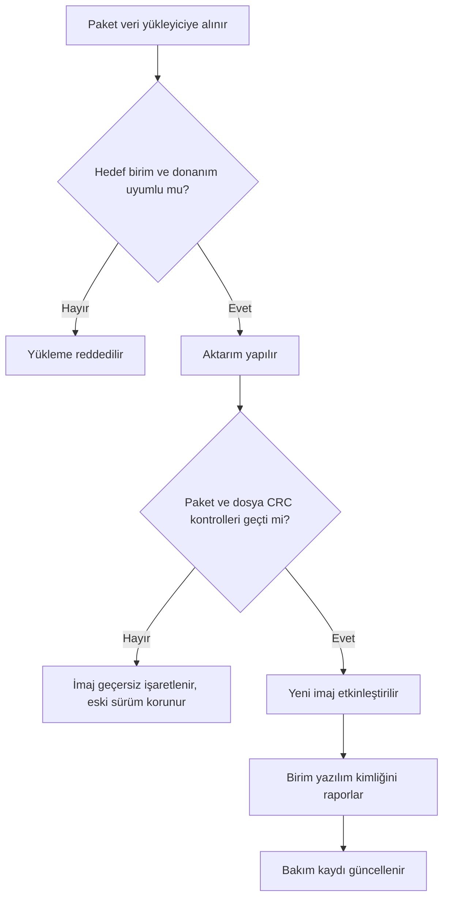

# 18. Sahada Yüklenebilir Yazılım

Sahada yüklenebilir yazılım (field-loadable software, FLS), sistemin kullanım
sırasında güncellenmesini sağlar.
Ancak bu esneklik; bütünlük, uyumluluk ve geri dönüş planı gereksinimlerini de
beraberinde getirir.

Bu bölüm, DO-178C'nin sahada yüklemeyi neden bir sistem emniyet konusu olarak ele
aldığını, emniyet değerlendirmesinden hangi somut tasarım şartlarının türediğini ve
yükleme sürecinin konfigürasyon yönetimi ile bilgi güvenliği ayaklarını açıklar.

## Sahada yükleme ne demektir?

Sahada yüklenebilir yazılım, ekipman kurulu olduğu yerden — tipik olarak uçaktan veya
motordan — sökülmeden yüklenebilen **yazılım veya veri tablolarıdır**. Tanımın iki ucu
da önemlidir: yüklenen şey çalıştırılabilir nesne kodu olabileceği gibi, davranışı
belirleyen bir veri kümesi de olabilir (yüklenebilir verinin kendi yaşam döngüsü için
bkz. [Konfigürasyon Verisi](./22-konfigurasyon-verisi.md)). Kavramın karşıtı, fabrika
yüklemeli yazılımdır (factory-loadable software): orada yazılım, birimin mührü bozulup
kutusu açılarak ya da devre kartı programlanarak yüklenir. FLS'de ise aktarım bir veri
portu üzerinden yapılır; birim yerinden sökülmez, kutusu açılmaz. Yükleme genellikle
hangarda bir yer veri yükleyicisi (data loader) aracılığıyla yapılır; yetkili bir
onarım istasyonunda veya servis merkezinde veri portundan yapılan yüklemeler de aynı
kapsamda değerlendirilir.

Yükleme ortamı zamanla değişir: 1990'larda 3,5 inçlik disketlerle başlayan uygulama —
ilk Boeing 777'lerde yazılım güncellemeleri klasörler dolusu disketle taşınırdı —
bugün optik ortamlardan USB belleklere, yığın depolama aygıtlarından yerel ağlara
uzanır. Gerekli emniyet önlemleri alındığı ve her sürüm otoritece onaylandığı sürece
hemen her ekipman sahada yüklenebilir olabilir: uçuş kumandalarından motor kontrolüne,
seyrüsefer ve haberleşme sistemlerinden uçuş yönetim ve çarpışma önleme sistemlerine
kadar.

Baştan netleştirilmesi gereken üç ayrım vardır:

- **Onaylanan şey medya değil, imajdır.** Sertifikasyon açısından onaylanan ürün,
  yazılımı taşıyan disk, USB bellek veya sunucudaki dosya değil, hedef bilgisayara
  yüklenen çalıştırılabilir görüntünün kendisidir. Medya yalnızca taşıyıcıdır; parça
  numarası ve bütünlük kontrolleri imaja aittir.
- **FLS, kullanıcı tarafından değiştirilebilir yazılım (UMS) değildir.** UMS, onay
  kapsamı dışında tutulmuş ve tanımlı sınırlar içinde operatörce değiştirilen bölümdür;
  FLS ise onaylı yazılımın kendisinin yeni bir sürümle değiştirilmesidir. Her yeni FLS
  sürümü kendi geliştirme, doğrulama ve onay sürecinden geçer; UMS için ayrı koşullar
  geçerlidir (bkz.
  [Kullanıcı Tarafından Değiştirilebilir Yazılım](./19-kullanici-tarafindan-degistirilebilir-yazilim.md)).
- **Havacılık veri tabanları FLS gibi ele alınmaz.** Seyrüsefer veya arazi veri
  tabanları da sahaya yüklenir; ancak bunlar DO-178C'nin değil DO-200A'nın kapsamına
  girer ve kendi güvence zinciriyle yönetilir (bkz.
  [Havacılık Verileri](./23-havacilik-verileri.md)).

## Faydaları ve zorlukları

Sahada yüklenebilir yazılım yaklaşımının en görünür
faydası, bir yazılım güncellemesi için donanımın uçaktan sökülüp üretici tesisine
gönderilmesine gerek kalmamasıdır. Klasik yaklaşımda yazılım, hat değiştirilebilir
birimin (line replaceable unit, LRU) fabrikada programlanan kalıcı bir parçasıdır;
her yazılım değişikliği, birimin sökülmesi, yeniden programlanması ve uçağa geri
takılması demektir. Sahada yükleme bu döngüyü, hangarda birkaç saatlik bir bakım
işlemine indirger.

Filo ölçeğinde bakıldığında fayda daha da belirginleşir:

- **Hızlı hata düzeltme:** Operasyonda keşfedilen bir yazılım hatası, tüm filoya
  haftalar yerine günler içinde dağıtılabilir.
- **Kademeli işlev ekleme:** Yeni işlevler, donanım değişikliği olmadan sonraki
  yazılım sürümleriyle devreye alınabilir.
- **Yedek parça sadeleşmesi:** Aynı donanım parça numarası farklı yazılım
  sürümleriyle kullanılabildiğinden, depoda tutulması gereken donanım çeşidi azalır.
- **Filo yönetimi:** Hangi uçakta hangi yazılım sürümünün bulunduğu merkezi olarak
  izlenebilir ve güncelleme kampanyaları planlı biçimde yürütülebilir.

Bu esnekliğin bedeli, konfigürasyon yönetimi yükünün belirgin biçimde artmasıdır.
Yazılım artık donanımın içine gömülü tek bir bütün değil, kendi parça numarasına
(part number) sahip ayrı bir konfigürasyon öğesidir. Üstelik bu yük tek bir tarafın
omzunda da değildir: yazılım ve ekipman geliştiricisi, uçak veya motor üreticisi,
havayolu ve sertifikasyon otoritesi aynı sürecin paydaşlarıdır ve zincirin her halkası
kendi payına düşeni yönetmek zorundadır. Başlıca zorluklar şunlardır:

- **Parça numarası yönetimi:** Donanım parça numarası ile yazılım parça numarası
  ayrışır; her yazılım sürümü ayrı bir parça numarası alır ve uçak kayıtlarında
  ayrı izlenir. Yanlış parça numarasının yüklenmesi, fiziksel olarak yanlış parçanın
  takılmasıyla eşdeğer bir bakım hatasıdır.
- **Uyumluluk matrisi:** Hangi yazılım sürümünün hangi donanım revizyonuyla, hangi
  komşu sistem sürümleriyle ve hangi uçak konfigürasyonuyla birlikte kullanılabileceği
  bir uyumluluk matrisinde tanımlanır ve her sürümde güncellenir. Matris dışı bir
  kombinasyon, tek tek onaylı iki parçanın birlikte onaysız bir sistem oluşturması
  anlamına gelir.
- **Onaylı yükleme prosedürleri:** Yükleme işlemi, bakım dokümantasyonunda tanımlı,
  eğitimli personelce uygulanan ve kayıt altına alınan onaylı bir prosedürle yapılır.
  Yükleme sonrasında sürüm doğrulaması yapılıp bakım kaydına işlenmeden uçak servise
  verilmez.
- **Sertifikasyon kanıtı:** Yükleme mekanizmasının kendisi de (yer ekipmanı, veri
  yükleyici, uçaktaki yükleme yazılımı) güvenilirliğini gösteren kanıtlarla
  desteklenmelidir; bütünlük kontrolleri yeterince güçlüyse aktarım zincirinin
  her halkasını ayrı ayrı nitelemek gerekmeyebilir, ancak bu gerekçe açıkça
  yazılmalıdır.
- **Mevzuatın yorumlanması:** Parça işaretleme ve onarım istasyonu kuralları gibi
  düzenlemeler, uçak ve motorlar ile onlara takılan donanım düşünülerek yazılmıştır.
  FLS ile yazılım bağımsız bir parça hâline gelince, donanım için yazılmış bu
  kuralların yazılım düzeyinde nasıl uygulanacağı yorum gerektirir; ekipman, uçak ve
  operasyon seviyelerinin her birinde ayrı düzenlemeler devreye girer.

| Boyut | Fayda | Karşılığında gelen yük |
|---|---|---|
| Bakım süresi | Söküm yok, hangarda güncelleme | Onaylı prosedür ve kayıt zorunluluğu |
| Hata düzeltme | Filoya hızlı dağıtım | Her sürüm için ayrı parça numarası |
| Donanım lojistiği | Daha az donanım çeşidi | Yazılım/donanım uyumluluk matrisi |
| İşlev geliştirme | Donanımsız işlev ekleme | Sürüm başına yeniden doğrulama kapsamı |

Deneyim şunu gösteriyor: sahada yükleme kararı geç alındığında, faydalar aynı kalır
ama zorluklar katlanır. Bu dengeyi lehinize çevirmenin tek gerçekçi yolu, bu bölümün
geri kalanının ana teması olan "baştan tasarım" yaklaşımıdır.

## DO-178C'nin bakışı: yükleme bir sistem emniyet konusudur

DO-178C sahada yüklemeyi yazılım süreçlerinin bir ayrıntısı olarak değil, standardın
sistem yönlerini anlatan 2. bölümünde (§2.5.5) bir **sistem tasarımı konusu** olarak
ele alır. Yaklaşımın özü şudur: veri yükleme işlevine ilişkin emniyet gereksinimleri
sistem gereksinimlerinin parçasıdır ve sistem emniyet değerlendirmesi (system safety
assessment, SSA) sürecinde ele alınır. Başka bir deyişle "yükleme nasıl yapılır"
sorusundan önce "yükleme neyi bozabilir" sorusu cevaplanır.

Emniyet değerlendirmesinin ele alması beklenen hususlar şunlardır:

- bozuk veya kısmen yüklenmiş yazılımın **tespit edilememesi**,
- yanlış (uygunsuz) yazılımın yüklenmesinin etkileri ve sistem bunun üzerine bir
  varsayılan moda düşüyorsa bu moddaki davranış,
- donanım/yazılım uyumluluğu,
- yazılım/yazılım uyumluluğu — özellikle yedekli veya birbiriyle etkileşen birimlerde
  eski ve yeni sürümlerin aynı uçakta karışık bulunduğu geçiş durumları,
- uçak/yazılım uyumluluğu,
- yükleme işlevinin **istem dışı etkinleşmesi** (inadvertent enabling) — özellikle
  uçuşta,
- yüklü yazılım konfigürasyonunu gösteren kimlik bilgisinin kaybı veya bozulması.

Bu hususların her biri, aşağıdaki alt bölümlerde ele alınan somut tasarım şartlarına
dönüşür:

| Emniyet hususu | Tipik tasarım karşılığı |
|---|---|
| Bozuk / kısmi yükleme | Yükleme sırasında ve her açılışta bütünlük kontrolü |
| Yanlış yazılımın yüklenmesi | Paket üst verisiyle hedef doğrulama, uyumsuz yüklemenin reddi |
| Donanım/yazılım, yazılım/yazılım, uçak/yazılım uyumu | Uyumluluk matrisi + yükleme öncesi otomatik kontrol |
| İstem dışı etkinleşme | Tekerleklerde ağırlık + bakım modu kilitleri |
| Kimlik bilgisinin kaybı | Tekil parça numarası ve elektronik parça işaretleme |

Bu hususların ortak paydası, hepsinin sistem seviyesinde gereksinim ve tasarım işi
olmasıdır; dolayısıyla emniyet ekibi sürece **erken** katılmalıdır. Sahada tekrarlanan
başarısızlık kalıbı şudur: yükleme stratejisi emniyet değerlendirmesine danışılmadan
kurulur ve kusur, ancak yazılım sertifikasyon planı (Plan for Software Aspects of
Certification, PSAC) otoriteyle paylaşılıp gözden geçirilirken fark edilir. PSAC,
sistem mimarisi kurulduktan ve ilk emniyet değerlendirmesi yapıldıktan sonra
hazırlandığı için bu aşamada yakalanan bir yükleme kusuru, projenin geç bir evresinde
sistem seviyesinde yeniden tasarım demektir — erken bir emniyet katılımıyla
önlenebilecek bir maliyet.

### Bütünlük tespiti ve seviye ataması

Sistem, bozuk veya yarım kalmış bir yüklemeyi tespit edebilmelidir; asıl soru bu tespit
mekanizmasının **hangi güvenceyle** geliştirileceğidir. Kural şudur: tespit edilemeyen
bir bozuk yükleme hangi arıza durumunu (failure condition) doğurabiliyorsa, tespit
mekanizması o arıza durumlarının en ağırına karşılık gelen yazılım seviyesinde
geliştirilir — emniyet değerlendirmesi aksini gerekçelendirmedikçe. Seviye A yazılım
taşıyan bir birimde açılıştaki bütünlük kontrolü de tipik olarak Seviye A güvencesiyle
geliştirilir; "bu yalnızca birkaç satırlık CRC döngüsü" diyerek güvenceyi düşürmek,
ancak emniyet değerlendirmesiyle savunulabiliyorsa mümkündür.

Pratik görünümü: imaj, hem yükleme sırasında hem de **her açılışta** doğrulanır.
Doğrulama başarısızsa uygulama hiç başlatılmaz; birim başlatma (boot) veya bakım
modunda kalır ve durumunu raporlar. Yaklaşım "kabul et, sonra düzelt" değil,
"doğrulanamayanı hiç çalıştırma"dır.

Bütünlük kontrolünün **yeterliliği** de kendi başına gösterilmesi gereken bir
özelliktir: bir kontrolün hatayı kaçırma olasılığı, algoritmasına ve koruduğu veri
miktarına bağlıdır. Dosyalar büyüdükçe aynı algoritmanın sağladığı koruma zayıflar; bu
durumda ya daha uzun bir kontrol değeri seçilir (örneğin 8 veya 16 bit yerine 32 bit
CRC) ya da veri daha küçük paketlere bölünüp her paket ayrıca korunur. Hedef, tespit
edilemeyen hata olasılığının yüklenen yazılımın seviyesiyle tutarlı olmasıdır; seçilen
yöntemin bu yeterliliği sağladığı, ileride görüleceği gibi planlama aşamasında
gerekçelendirilir.

### Uyumluluk üç eksende doğrulanır

- **Donanım/yazılım:** Hedef birimin donanım parça numarası ve revizyonu, paketin üst
  verisindeki hedef tanımıyla eşleşmelidir; yanlış hedefe yükleme reddedilir.
- **Yazılım/yazılım:** Birbiriyle konuşan veya yedekli çalışan birimlerin sürümleri,
  birlikte onaylanmış bir kombinasyon oluşturmalıdır. En sinsi senaryo filo geçişidir:
  güncelleme kampanyası sırasında aynı uçakta sol birim yeni, sağ birim eski sürümde
  kalabilir. Tipik örnek çift kanallı motor kontrolüdür: iki tam yetkili sayısal motor
  kontrol biriminden (full authority digital engine control, FADEC) yalnızca biri
  güncellenebiliyorsa, ortaya çıkan eski–yeni kombinasyonun ya açıkça onaylanmış
  olması ya da ikisinin birlikte güncellenmesinin prosedür ve mekanizmayla garanti
  edilmesi gerekir.
- **Uçak/yazılım:** Aynı ekipman, farklı uçak tiplerinde veya konfigürasyonlarında
  farklı yazılım sürümleri gerektirebilir; paketin o uçak konfigürasyonuna uygunluğu
  doğrulanır.

Bu kontroller, yükleme kabul edilmeden önce paket üst verisi üzerinden otomatik
yapılır. Prosedürün "dikkatli olun" demesi yeterli değildir: koruma, yanlış yüklemenin
doğuracağı arıza durumunun şiddetiyle orantılı olmalı ve mekanizmaya dayanmalıdır.
Yanlış yükleme her şeye rağmen gerçekleşir ve sistem bunu algılayıp bir **varsayılan
moda** düşüyorsa, bu moddaki davranış da tanımsız bırakılamaz: hangi işlevlerin hangi
durumda olduğu ve ekibin nasıl uyarıldığı için ayrıca emniyet gereksinimleri yazılır.

### İstem dışı etkinleşmeye karşı koruma

Yükleme işlevinin yanlışlıkla — özellikle uçuşta — etkinleşmesi başlı başına bir arıza
durumu doğurabilir. Bu yüzden yükleme yalnızca güvenli koşullarda etkinleştirilebilir
olmalıdır. Tipik kilit kombinasyonu:

- tekerleklerde ağırlık (weight-on-wheels) sinyali — uçak yerde,
- ayrık bakım girişi veya bakım modu seçimi — bilinçli bir bakım eylemi,
- gerekiyorsa ek koşullar (motorların çalışmıyor olması, park freni gibi).

Uçuşta yüklemenin engellenmesi tek bir yazılım bayrağına bırakılmaz; donanım ve
yazılım kilitleri birlikte kullanılır. Kilidin kendisi de arıza analizine girer:
tekerleklerde ağırlık sinyali yanlış tarafta arızalanırsa yükleme kapısı açılıyor mu?

### Konfigürasyon kimliği: yüklü olan neyse, görünen o olmalı

Her FLS parçası **tekil bir parça numarası** taşır ve yazılım değiştiğinde parça
numarası da değişir. Donanım kutusunun üzerindeki fiziksel etiket artık içindekini
anlatmaz; bu yüzden yüklü parça numarası uçak üzerinde **elektronik olarak
doğrulanabilir** olmalıdır (elektronik parça işaretleme — electronic part marking):
bakım terminalinden sorgulama, ARINC 429 kelimeleriyle yayınlama veya kokpit/bakım
ekranında gösterme gibi.

İncelikli nokta şudur: uçağın onaylı konfigürasyona uygunluğu bu gösterim işleviyle
kanıtlanıyorsa, gösterimin kendisinin bozulması da değerlendirilmelidir; yanlış parça
numarasını "doğru" diye göstermek, hiç göstermemekten daha tehlikelidir. Bu nedenle
kimlik gösterim zinciri ya yüklenecek en yüksek yazılım seviyesine uygun güvenceyle
geliştirilir ya da uçtan uca kimlik kontrolünün bütünlüğü emniyet değerlendirmesiyle
ayrıca gerekçelendirilir.

Parça işaretleme yaklaşımının kendisi de sistem tasarımında baştan kararlaştırılır.
İki yerleşik yöntem vardır: bazı üreticiler her yazılım yüklemesinde donanımın parça
numarasını ya da modifikasyon durumunu günceller; bazıları ise donanım ve yazılım
parça numaralarını baştan sona ayrı yönetir. İkisi de kabul edilebilirdir — yeter ki
seçim açıkça yapılmış ve kayıt, etiketleme, gösterim mekanizmaları buna göre kurulmuş
olsun. Bu bölümdeki anlatım, günümüzde yaygın olan ayrı yazılım parça numarası
yaklaşımını izler.

## Sistemin sahada yüklenebilir tasarlanması

Sahada yüklenebilirlik, sonradan eklenebilecek bir özellik değildir; bellek düzeninden
gereksinim setine kadar sistemin pek çok katmanını etkiler. Baştan tasarlandığında
dört ana yapı taşı öne çıkar: yükleme arayüzü, paket biçimi, bütünlük mekanizmaları
ve yükleme sonrası kimlik raporlama.

**Yükleme arayüzü.** Uçaktaki birim ile yer ekipmanındaki veri yükleyici arasındaki
fiziksel ve mantıksal arayüz erken tanımlanmalıdır. Endüstride yaygın uygulama,
standartlaşmış veri yükleme protokolleridir: ARINC 615 bu iletişimi ARINC 429 veri
yolu üzerinden, ARINC 615A ise Ethernet tabanlı ağlar üzerinden tanımlar; yer
tarafında havayollarının kullandığı taşınabilir çok amaçlı erişim terminali için de
ARINC 644A rehberlik sağlar. Özel arayüzler de mümkündür, ama her özel çözüm yer
ekipmanı tarafında ek geliştirme ve bakım yükü demektir. Arayüz tasarımında yalnızca "mutlu yol" değil; bağlantı kopması,
zaman aşımı ve yarıda kesilen aktarım gibi durumların davranışı da gereksinim olarak
yazılmalıdır.

**Paket biçimi.** Yüklenen şey tek bir ikili dosya değil, üst veri (metadata) ile
birlikte paketlenmiş bir yazılım parçasıdır. İyi bir paket biçimi en azından şunları
içerir:

- yazılım parça numarası ve sürüm bilgisi,
- hedef donanım tanımı (hangi birime, hangi donanım revizyonuna),
- dosya listesi ve her dosyanın bütünlük değeri,
- paketin tamamını kapsayan bir bütünlük değeri.

Bu alanlar sayesinde yükleyici, aktarıma başlamadan önce "bu paket bu birime uygun mu"
sorusunu yanıtlayabilir; yanlış paketin yanlış birime yüklenmesi mekanizma düzeyinde
engellenir. Bu alanların endüstrideki standart karşılığı ARINC 665'tir: yüklenebilir
yazılım parçasının (loadable software part, LSP) başlık yapısını, dosya ve yük
CRC'lerini, parça numarası biçimini ve medya setlerini tanımlar. ARINC 665'e uyum,
farklı üreticilerin yükleyicileri ile hedef birimleri arasında birlikte çalışabilirlik
sağlar.

**Bütünlük mekanizmaları.** Aktarım ve saklama sırasında bozulmayı yakalamak için her
dosyaya ve pakete sağlama toplamı (checksum) veya döngüsel artıklık denetimi (cyclic
redundancy check, CRC) eklenir. Kritik nokta, kontrolün yalnızca aktarım sırasında
değil, birimin her açılışında da yapılmasıdır: çalıştırılabilir nesne kodu bellekten
okunup CRC'si beklenen değerle karşılaştırılmadan uçuş yazılımı başlatılmaz.

```c
/* Açılışta yazılım bölgesinin bütünlük kontrolü (kavramsal örnek) */
uint32_t hesaplanan = crc32_hesapla(yazilim_baslangic, yazilim_boyut);

if (hesaplanan != yuklu_paket.beklenen_crc) {
    /* Bozuk imaj: uygulama başlatılmaz, birim yükleme moduna geçer */
    hata_kaydi_yaz(HATA_IMAJ_BUTUNLUK);
    yukleme_moduna_gec();
}
```

**Yükleme sonrası kimlik raporlama.** Yükleme bittiğinde birim, üzerinde fiilen hangi
yazılımın bulunduğunu kanıtlanabilir biçimde bildirebilmelidir: bakım terminaline veya
kokpit ekranına yazılım parça numarasını, sürümünü ve bütünlük değerini raporlamak gibi.
Bu rapor, bakım personelinin "yükleme başarılı" kararını dayandırdığı nesnel kanıttır
ve uçak konfigürasyon kayıtlarıyla izlenebilirlik sağlar.



Bu yapı taşlarının ortak amacı şudur: yükleme sürecinin her adımı ya doğrulanabilir
biçimde başarılıdır ya da sistem bilinen güvenli bir duruma (eski sürüm veya yükleme
modu) döner. Ara durumda kalmış, kimliği belirsiz bir birim kabul edilemez.

## Geliştirme ve planlara yansıması

Sahada yüklenebilir olmak, yazılıma hiçbir doğrulama muafiyeti kazandırmaz: FLS de
her uçuş yazılımı gibi DO-178C'ye (ve uygulanabilir eklerine) göre geliştirilir.
Fark, üzerine binen ek tasarım yükümlülükleridir — bütünlük kontrolü, koruma
kilitleri ve çoğu tasarımda uçuş uygulamasından **ayrı bir yükleme uygulaması**
(birimde kalıcı duran başlatma/bakım yazılımı). Bu ek parçalar da onaylı yazılımın
bileşenidir ve kendi gereksinimleriyle geliştirilip doğrulanır.

Sahada yükleme kararının en görünür olduğu yer planlardır. Beş planın her birinde
FLS'ye özgü bir bölüm beklenir:

| Plan | Sahada yüklemeye özgü içerik |
|---|---|
| PSAC | Yükleme stratejisi; seçilen bütünlük kontrolünün yazılım seviyesi için yeterliliğinin gerekçesi; geliştirme sonrası konfigürasyon yönetimi sorumluluğunun kimde olduğu |
| SDP | Koruma mekanizmalarının ve bütünlük kontrollerinin tasarımına ilişkin kurallar; uygulanan özel standartlar (örneğin ARINC 615A, ARINC 665) |
| SVP | Bütünlük kontrolünün, koruma kilitlerinin ve yükleme uygulamasının doğrulanma yöntemi; kesilen ve bozuk yükleme senaryolarının test kapsamı |
| SCMP | FLS parça numaralandırması, medya tanımı ve yükleme prosedürlerinin yönetimi; teslim sonrası sorumluluk devri |

Planların özellikle cevaplaması gereken soru şudur: **geliştirme bittikten sonra
konfigürasyon yönetimini kim yürütecek?** Geliştirme sırasında FLS'nin konfigürasyon
yönetimi, sahada yüklenemeyen yazılımınkiyle büyük ölçüde aynıdır; ayrışma teslimle
başlar. Sahadaki yüklemelerin kaydını kimin tutacağı, uyumluluk matrisini kimin
güncelleyeceği planlarda tanımlanmamışsa, bu sorular filo büyüdükçe cevapsız kalır.

## Yükleme sürecinin güvencesi ve konfigürasyon yönetimi

Her yükleme işleminin tek tek doğrulanması gerekip gerekmediği, güvencenin nereye
yaslandığına bağlıdır:

- Bütünlük **hedef taraftaki kontrollerle** (başlık doğrulama, dosya ve imaj CRC'leri,
  açılış kontrolü) garanti ediliyorsa, her yüklemenin ayrıca doğrulanması gerekmez:
  mekanizma bir kez geliştirilip doğrulanır, sahadaki her yükleme onun güvencesinden
  yararlanır.
- Güvence **yer tarafındaki yükleyiciye** dayanıyorsa — örneğin hedef birim gelen
  veriyi sorgusuz kabul ediyorsa — bu kez yükleyicinin kendisinin doğrulanmış ve
  konfigürasyon kontrolü altında olması gerekir: araç kalifikasyonu (tool
  qualification) sorusu gündeme gelir, yükleyici yazılımının DO-178C veya DO-330'a
  göre geliştirilmesi ve yüklemenin yalnızca bu onaylı yükleyiciyle yapılması şart
  koşulabilir. Hedef taraflı kontroller olgunlaştığı için bu yaklaşım günümüzde
  nadiren tercih edilir.

Konfigürasyon yönetimi tarafında sahada yükleme, yükleme kontrolü (load control)
faaliyetinin ta kendisidir (bkz.
[Yazılım Konfigürasyon Yönetimi](../03-do178c-ile-gelistirme/10-yazilim-konfigurasyon-yonetimi.md)).
Yazılım konfigürasyon indeksi (Software Configuration Index, SCI); onaylı yükleme
prosedürlerini, medya tanımını ve çalıştırılabilir parça numaralarını tanımlar.
Yükleme prosedürleri yazılım ekibinin değil de sistem veya uçak seviyesindeki
dokümantasyonun sorumluluğundaysa, SCI en azından bunların nerede olduğunu açıkça
söylemelidir. Sahadaki fiilî konfigürasyonun izlenebilirliği ise bakım kayıtları ve
filo konfigürasyon yönetimiyle sağlanır.

Yüklemeyi bu iş için yetkilendirilmiş personel yapar ve otorite rehberlerinde
yerleşmiş beklenti, her yüklemenin şu koşulları sağlamasıdır:

1. Yüklenen yazılım sürümü sertifikasyon otoritesince onaylıdır.
2. Onaylı yükleme prosedürü izlenmiştir.
3. Donanım/yazılım kombinasyonu onaylıdır: yazılım, üzerine yüklendiği donanım için
   onaylanmış sürümdür.
4. Uçak veya motor konfigürasyonu onaylıdır — yedekli birimler dahil; karışık
   eski–yeni sürüm kombinasyonu ancak açıkça onaylıysa bırakılabilir.
5. Yükleme eksiksiz ve hatasız tamamlanmıştır: hesaplanan bütünlük değeri, yükleme
   talimatında verilen beklenen değerle karşılaştırılır.
6. Yükleme sonrası parça numarası (varsa sürüm numarasıyla birlikte) arayüzden
   okunarak teyit edilmiştir.
7. Konfigürasyon değişikliği, uçak veya motor konfigürasyon kayıtlarına ve ilgili
   bakım kayıtlarına işlenmiştir.

Filo çapında yüklenebilir yazılımın yönetimi için ARINC 667 ek rehberlik sağlar.

## Güvenli durum

Yarıda kalan yükleme bir istisna değil, tasarımın baştan hesaba kattığı bir senaryodur:
güç kesilebilir, kablo çekilebilir, aktarım hata verebilir. İki yaygın mimari cevap
vardır:

- **Çift banka (dual bank):** Yeni imaj pasif bellek bankasına yazılır ve doğrulama
  tamamlanmadan aktif işaretlenmez. Yükleme yarıda kalırsa aktif bankadaki eski sürüm
  el değmemiş durur; birim bir sonraki açılışta bilinen konfigürasyonla kalkar. Bedeli,
  iki kat imaj belleğidir.
- **Tek banka + kalıcı başlatma yazılımı:** Uygulama alanı silinip yeniden yazılır.
  Yükleme yarıda kalırsa açılıştaki bütünlük kontrolü imajı reddeder; birim, sahada
  değiştirilmeyen ve ayrı korunan başlatma (boot) yazılımı sayesinde yükleme/bakım
  modunda bekler ve durumunu raporlar. Birim, yükleme tamamlanana kadar servis dışıdır.

İki mimaride de ilke aynıdır: birim hiçbir zaman kimliği belirsiz bir yazılımla uçuşa
verilmez — ya bilinen onaylı sürüm çalışır ya da birim bakım modunda bekler. Eski
sürüme bilinçli geri dönüş (rollback) de sıradan bir yükleme işlemidir: aynı uyumluluk
ve bütünlük kontrollerinden geçer ve dönülen sürümün o uçak konfigürasyonu için hâlâ
onaylı olması gerekir.

## Sahada yüklenebilir yazılımın değiştirilmesi

Sahada yüklemenin varlık nedeni, yazılımın ekipman üreticiye dönmeden
değiştirilebilmesidir; ama bu kolaylık, değişikliğin kendisine uygulanan disiplini
hafifletmez. FLS'de yapılan her değişiklik, diğer uçuş yazılımlarıyla aynı yoldan
geçer:

- Süreç, değişiklik etki analiziyle başlar: hangi gereksinimler, kod ve veriler
  değişti; hangileri dolaylı olarak etkilendi?
- Değişen ve etkilenen her öğe yeniden doğrulanır — ve doğrulama, kurulumun
  hedeflendiği donanım ile uçak veya motor konfigürasyonu üzerinde geçerli olmalıdır.
- Değiştirilmiş yazılım, kuruluma alınmadan **önce** o ekipman ve uçak/motor
  konfigürasyonu için otorite onayı alır; yeni parça numarası uyumluluk matrisine ve
  konfigürasyon kayıtlarına işlenir.

Sahada yüklemenin kazandırdığı hız, doğrulama ve onaydan kırpılan zaman değil,
söküm–nakliye–takma döngüsünden kazanılan zamandır. "Küçük bir yamaydı, hangarda
yükleyiverdik" cümlesi, bu bölümün anlattığı çerçevenin tam karşıtıdır.

## Bütünlük yetmez: bilgi güvenliği boyutu

Bu bölümdeki kontrollerin tamamı **kazara bozulmayı** hedefler: aktarım hatası, bellek
bozulması, yanlış paket. DO-178C'nin çerçevesi budur — bütünlüğü (integrity) kapsar,
kötü niyetli müdahaleyi kapsamaz. Oysa CRC'yi, imajı bilerek değiştiren biri de
yeniden hesaplayabilir; sağlama toplamı sahtecilik karşısında koruma sağlamaz.

Özgünlük (authenticity) ve müdahale tespiti gereksinimleri, uçuşa elverişlilik
güvenliği (airworthiness security) standartlarından gelir: süreç için DO-326A/ED-202A,
yöntemler için DO-356A/ED-203A, sürekli uçuşa elverişlilik için DO-355/ED-204. Yeni
bir veri yükleme sistemi veya mevcut sistemde büyük bir değişiklik, günümüzde bir
güvenlik risk analiziyle desteklenir.

Endüstri pratiğinde bu ihtiyaç, açık anahtar altyapısına dayalı **dijital imza** ile
karşılanır: yüklenebilir parçalar üreticide imzalanır; elektronik dağıtım paketleri
için ARINC 827, parça imzalama için ARINC 835 kullanılır. İmza, parçanın geliştiricinin
elinden çıktığı andan uçağa yüklendiği ana kadar kaynağının ve içeriğinin
doğrulanabilmesini sağlar. Dijital imza, açılıştaki hızlı bütünlük kontrolünün yerine
geçmez; saklama sırasındaki bozulmayı yakalamak yine CRC'nin işidir — iki mekanizma
farklı tehditlere karşı birlikte çalışır.

## Onay çerçevesi: hangi doküman neyi anlatır

Sahada yüklenebilir yazılımın kuralları tek bir dokümanda toplanmış değildir; üç
katmana yayılır: standardın sistem seviyesi hükümleri, otorite rehberleri ve endüstri
standartları.

| Doküman | Katkısı |
|---|---|
| DO-178C §2.5.5 | Sistem tasarımı hususları: emniyet değerlendirmesinin ele alacağı yükleme riskleri |
| AC 20-115D / AMC 20-115D | Geliştiriciye düşen şartlar (FAA ve EASA metinleri teknik olarak birebir aynıdır) |
| AC 00-69 | DO-178C uygulama pratiği; eski Order 8110.49 içeriğinin büyük bölümünün taşındığı yer |
| EASA CM-SWCEH-002 | EASA'nın yazılım onayına dair sertifikasyon notu; FLS'ye ayrılmış bölüm içerir |
| ARINC 615 / 615A | Yükleyici–hedef birim protokolü (ARINC 429 / Ethernet üzerinden) |
| ARINC 644A | Taşınabilir çok amaçlı erişim (bakım) terminali rehberi |
| ARINC 665 | Yüklenebilir parça ve medya biçimi, parça numarası şeması, CRC'ler |
| ARINC 667 | Filo çapında yüklenebilir yazılım yönetimi |
| ARINC 827 / 835 | Elektronik dağıtım paketi ve dijital imza |
| DO-326A/ED-202A ailesi | Uçuşa elverişlilik güvenliği süreci ve yöntemleri |
| DO-200A | Havacılık veri tabanları (FLS sayılmaz, kendi güvence zinciri vardır) |

Otorite rehberi katmanının geliştiriciden istedikleri dört başlıkta özetlenebilir:
sistem seviyesi hususları destekleyecek bilgiyi sağlamak; yazılımı kendi yazılım
seviyesiyle orantılı bir bütünlük düzeyinde bozulmaya ve kısmi yüklemeye karşı
korumak; yükleme sonrasında parça numarasının uçak üzerinde doğrulanabilir olmasını
sağlamak; ve yükleme işlevinin uçuşun emniyet açısından kritik safhalarında istem dışı
etkinleşmesini önleyecek korumaları koymak.

Tarihçe notu: FAA tarafında sahada yüklenebilir yazılımın onayı uzun yıllar
Order 8110.49'un ilgili bölümlerinde düzenlendi; 2017'de bu bölümler iptal edilerek
içerik AC 20-115D ve AC 00-69'a taşındı. Değişmeyen ilke şudur: onaylanan şey taşıyıcı
medya değil, hedef bilgisayara yüklenen çalıştırılabilir görüntüdür.

## Bu bölümden akılda kalması gerekenler

- FLS, ekipman uçaktan veya motordan sökülmeden veri portu üzerinden yüklenebilen
  yazılım **veya veri tablolarıdır**; onay medyaya değil imaja verilir. FLS ne
  kullanıcı tarafından değiştirilebilir yazılımdır ne de havacılık veri tabanıdır —
  ikincisi DO-200A'ya tabidir.
- DO-178C sahada yüklemeyi sistem emniyet konusu olarak ele alır: bozuk/kısmi yükleme
  tespiti, üç eksenli uyumluluk (donanım, yazılım, uçak/motor), istem dışı etkinleşme
  ve kimlik gösterimi emniyet değerlendirmesinde ele alınır; emniyet ekibinin geç
  katılımı, geç bir sistem yeniden tasarımı riskidir.
- Bütünlük tespit mekanizması, ilgili en ağır arıza durumuna karşılık gelen yazılım
  seviyesinde geliştirilir; kontrolün yeterliliği dosya boyutuna göre gösterilir;
  doğrulanamayan imaj hiç çalıştırılmaz, birim bakım modunda bekler.
- FLS de DO-178C'ye göre geliştirilir; beş plan yükleme stratejisini, bütünlük
  kontrolünün yeterlilik gerekçesini ve **teslim sonrası konfigürasyon yönetimi
  sorumluluğunu** açıkça tanımlar.
- Faydanın bedeli konfigürasyon yönetimi yüküdür: her FLS parçası tekil parça numarası
  taşır, uyumluluk matrisi her sürümde güncellenir, SCI yükleme prosedürlerini ve
  onaylı parça numaralarını tanımlar; her yükleme yedi koşullu kabul listesinden geçer
  ve kayda işlenir.
- Sahada yüklenebilirlik baştan tasarlanır: yükleme arayüzü (ARINC 615/615A), üst
  verili paket biçimi (ARINC 665), her açılışta bütünlük kontrolü ve yükleme sonrası
  kimlik raporlama sistemin parçasıdır.
- Yarıda kalan yüklemede sistem ya bilinen onaylı sürümle çalışır ya da bakım modunda
  kalır; kimliği belirsiz birim uçuşa verilmez.
- FLS'yi değiştirmek de değişiklik etki analizi, yeniden doğrulama ve kurulum öncesi
  otorite onayı demektir; kazanılan hız doğrulamadan değil, söküm–nakliye döngüsünden
  gelir.
- Bütünlük, güvenlik değildir: CRC kazara bozulmayı yakalar; kasıtlı müdahaleye karşı
  dijital imza gerekir (DO-326A ailesi, ARINC 827/835).
