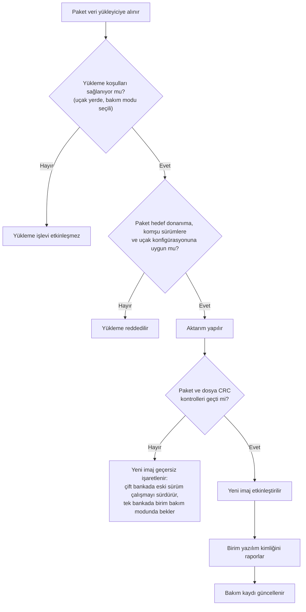

# 18. Sahada Yüklenebilir Yazılım

Sahada yüklenebilir yazılım (field-loadable software, FLS), ekipman uçaktan sökülmeden
bir veri portu üzerinden yüklenebilen yazılımdır. Bu esneklik bütünlük (integrity),
uyumluluk ve konfigürasyon kimliği şartlarını beraberinde getirir.

Bu bölüm, DO-178C'nin sahada yüklemeyi neden bir sistem emniyet konusu olarak ele
aldığını, emniyet değerlendirmesinden hangi somut tasarım şartlarının türediğini ve
yükleme sürecinin konfigürasyon yönetimi ile bilgi güvenliği ayaklarını açıklar.

## Sahada yükleme ne demektir?

DO-178C'nin tanımı kısadır: sahada yüklenebilir yazılım, sistem ya da ekipman kurulu
olduğu yerden — tipik olarak uçaktan veya motordan — sökülmeden yüklenebilen yazılımdır
(§2.5.5). Standartta yazılım, çalıştırılabilir nesne kodunu (executable object code) da
veriyi de kapsadığı için tanım **yazılımı da veri tablolarını da** içine alır: yüklenen
şey çalıştırılabilir kod olabileceği gibi, davranışı belirleyen bir veri kümesi de
olabilir (yüklenebilir verinin kendi yaşam döngüsü için bkz.
[22. Konfigürasyon Verisi](./22-konfigurasyon-verisi.md)). Kavramın karşıtı, fabrika
yüklemeli yazılımdır (factory-loadable software): orada yazılım, birimin mührü bozulup
kutusu açılarak ya da devre kartı programlanarak yüklenir. FLS'de ise aktarım bir veri
portu üzerinden yapılır; birim yerinden sökülmez, kutusu açılmaz. Yükleme genellikle
hangarda bir yer veri yükleyicisi (data loader) aracılığıyla yapılır; yetkili bir
onarım istasyonunda veya servis merkezinde veri portundan yapılan yüklemeler de aynı
kapsamda değerlendirilir.

Taşıyıcı ortam teknolojiyle birlikte değişti — disket setlerinden optik disklere, USB
belleklere ve bugün ağ üzerinden dağıtıma — ama bu bölümde anlatılan ilkeler ortamdan
bağımsızdır. Sahada yüklenebilirlik belirli bir ekipman sınıfına özgü de değildir:
emniyet önlemleri alınmış ve her sürüm otoritece onaylanmışsa, uçuş kumandaları ve motor
kontrolü gibi en kritik işlevleri taşıyan birimler de bu yolla güncellenir.

Baştan netleştirilmesi gereken üç ayrım vardır:

- **Onaylanan şey medya değil, imajdır.** İmaj (image), çalıştırılabilir nesne kodunun
  ve ona eşlik eden verinin hedef bilgisayara yüklenen biçimidir. Sertifikasyon
  açısından onaylanan ürün, yazılımı taşıyan disk, USB bellek veya sunucudaki dosya
  değil, bu imajın kendisidir. Medya yalnızca taşıyıcıdır; parça numarası (part number)
  ve bütünlük kontrolleri imaja aittir.
- **FLS ile kullanıcı tarafından değiştirilebilir yazılım (user-modifiable software,
  UMS) aynı şey değildir.** UMS, ilk sertifikasyonda onaylanan değişiklik kısıtları
  içinde kalındığı sürece kullanıcının otorite gözden geçirmesi olmadan değiştirebildiği
  yazılımdır; FLS ise yazılımın ekipmana hangi yoldan ulaştığını anlatır. Onaylı
  yazılımın her yeni FLS sürümü kendi geliştirme, doğrulama ve onay sürecinden geçer;
  UMS için ayrı koşullar geçerlidir. İki kavram birbirini dışlamaz: değiştirilebilir
  bileşen de sahada yüklenebilir ve o zaman iki konunun koşulları birlikte ele alınır
  (bkz.
  [19. Kullanıcı Tarafından Değiştirilebilir Yazılım](./19-kullanici-tarafindan-degistirilebilir-yazilim.md)).
- **Havacılık veri tabanları FLS gibi ele alınmaz.** Seyrüsefer veya arazi veri
  tabanları da sahaya yüklenir; ancak bunlar DO-178C'nin değil, havacılık verisinin
  işlenmesini düzenleyen DO-200B'nin kapsamına girer ve kendi güvence zinciriyle
  yönetilir (bkz. [23. Havacılık Verileri](./23-havacilik-verileri.md)).

## Faydaları ve zorlukları

Sahada yüklenebilir yazılım yaklaşımının en görünür
faydası, bir yazılım güncellemesi için donanımın uçaktan sökülüp üretici tesisine
gönderilmesine gerek kalmamasıdır. Klasik yaklaşımda yazılım, hat değiştirilebilir
birimin (line replaceable unit, LRU) fabrikada programlanan kalıcı bir parçasıdır;
her yazılım değişikliği, birimin sökülmesi, yeniden programlanması ve uçağa geri
takılması demektir. Sahada yükleme bu döngüyü, hangarda birkaç saatlik bir bakım
işlemine indirger.

Filo ölçeğinde bakıldığında fayda daha da belirginleşir:

- **Hızlı hata düzeltme:** Operasyonda keşfedilen bir yazılım hatası, tüm filoya
  haftalar yerine günler içinde dağıtılabilir.
- **Kademeli işlev ekleme:** Yeni işlevler, donanım değişikliği olmadan sonraki
  yazılım sürümleriyle devreye alınabilir.
- **Yedek parça sadeleşmesi:** Aynı donanım parça numarası farklı yazılım
  sürümleriyle kullanılabildiğinden, depoda tutulması gereken donanım çeşidi azalır.
- **Filo yönetimi:** Hangi uçakta hangi yazılım sürümünün bulunduğu merkezi olarak
  izlenebilir ve güncelleme kampanyaları planlı biçimde yürütülebilir.

Bu esnekliğin bedeli, konfigürasyon yönetimi (configuration management) yükünün belirgin biçimde artmasıdır.
Yazılım artık donanımın içine gömülü tek bir bütün değil, kendi parça numarasına
sahip ayrı bir konfigürasyon öğesidir. Üstelik bu yük tek bir tarafın omzunda da
değildir: yazılım ve ekipman geliştiricisi, uçak veya motor üreticisi,
havayolu ve sertifikasyon otoritesi (certification authority) aynı sürecin paydaşlarıdır ve zincirin her halkası
kendi payına düşeni yönetmek zorundadır. Başlıca zorluklar şunlardır:

- **Parça numarası yönetimi:** Donanım parça numarası ile yazılım parça numarası
  ayrışır; her yazılım sürümü ayrı bir parça numarası alır ve uçak kayıtlarında
  ayrı izlenir. Yanlış parça numarasının yüklenmesi, fiziksel olarak yanlış parçanın
  takılmasıyla eşdeğer bir bakım hatasıdır.
- **Uyumluluk matrisi:** Hangi yazılım sürümünün hangi donanım revizyonuyla, hangi
  komşu sistem sürümleriyle ve hangi uçak konfigürasyonuyla birlikte kullanılabileceği
  bir uyumluluk matrisinde tanımlanır ve her sürümde güncellenir. Matris dışı bir
  kombinasyon, tek tek onaylı iki parçanın birlikte onaysız bir sistem oluşturması
  anlamına gelir.
- **Onaylı yükleme prosedürleri:** Yükleme işlemi, bakım dokümantasyonunda tanımlı,
  eğitimli personelce uygulanan ve kayıt altına alınan onaylı bir prosedürle yapılır.
  Yükleme sonrasında sürüm doğrulaması yapılıp bakım kaydına işlenmeden uçak servise
  verilmez.
- **Sertifikasyon kanıtı:** Yükleme mekanizmasının kendisi de (yer ekipmanı, veri
  yükleyici, uçaktaki yükleme yazılımı) güvenilirliğini gösteren kanıtlarla
  desteklenmelidir; bütünlük kontrolleri yeterince güçlüyse aktarım zincirinin
  her halkasını ayrı ayrı kalifikasyona tabi tutmak gerekmeyebilir, ancak bu gerekçe
  açıkça yazılmalıdır.
- **Mevzuatın yorumlanması:** Parça işaretleme ve onarım istasyonu kuralları gibi
  düzenlemeler, uçak ve motorlar ile onlara takılan donanım düşünülerek yazılmıştır.
  FLS ile yazılım bağımsız bir parça hâline gelince, donanım için yazılmış bu
  kuralların yazılım düzeyinde nasıl uygulanacağı yorum gerektirir; ekipman, uçak ve
  operasyon seviyelerinin her birinde ayrı düzenlemeler devreye girer.

| Boyut | Fayda | Karşılığında gelen yük |
|---|---|---|
| Bakım süresi | Söküm yok, hangarda güncelleme | Onaylı prosedür ve kayıt zorunluluğu |
| Hata düzeltme | Filoya hızlı dağıtım | Her sürüm için ayrı parça numarası |
| Donanım lojistiği | Daha az donanım çeşidi | Yazılım/donanım uyumluluk matrisi |
| İşlev geliştirme | Donanımsız işlev ekleme | Sürüm başına yeniden doğrulama kapsamı |

Deneyim şunu gösteriyor: sahada yükleme kararı geç alındığında, faydalar aynı kalır
ama zorluklar katlanır. Bu dengeyi lehinize çevirmenin tek gerçekçi yolu, bu bölümün
geri kalanının ana teması olan "baştan tasarım" yaklaşımıdır.

## DO-178C'nin bakışı: yükleme bir sistem emniyet konusudur

DO-178C sahada yüklemeyi öncelikle standardın sistem yönlerini anlatan 2. bölümünde
(§2.5.5), yani bir **sistem tasarımı konusu** olarak ele alır; yazılım süreçlerinde
konuya yalnızca birkaç noktada döner (entegrasyon testleri, konfigürasyon kimliği,
yükleme kontrolü ve yazılım konfigürasyon indeksi (Software Configuration Index, SCI) —
sırası geldikçe anılacak).
Yaklaşımın özü şudur: yükleme işlevine ilişkin emniyet gereksinimleri sistem
gereksinimlerinin parçasıdır ve hangi gereksinimlerin gerektiği sistem emniyet
değerlendirme sürecinde (system safety assessment process) belirlenir (bkz.
[3. Sistem Emniyet Değerlendirmesi Bağlamında Yazılım](../02-baglam/03-sistem-emniyet-degerlendirmesi-baglaminda-yazilim.md)).
Başka bir deyişle "yükleme nasıl yapılır" sorusundan önce "yükleme neyi bozabilir"
sorusu cevaplanır.

Standardın bu değerlendirmede ele alınmasını beklediği hususlar dört soruda toplanabilir;
her biri aşağıdaki alt bölümlerde anlatılan somut tasarım şartlarına dönüşür:

| Soru | Emniyet değerlendirmesinin ele aldığı husus | Tipik tasarım karşılığı |
|---|---|---|
| Yüklenen şey sağlam mı? | Bozuk ya da yarım kalmış yüklemenin tespiti | Yükleme sırasında ve her açılışta bütünlük kontrolü |
| Yüklenen şey doğru şey mi? | Uygunsuz yazılımın yüklenmesinin etkileri; donanım/yazılım, yazılım/yazılım ve uçak/yazılım uyumluluğu | Paket üst verisiyle (metadata) hedef doğrulama, uyumluluk matrisi, uyumsuz yüklemenin reddi |
| Yükleme yanlış zamanda başlayabilir mi? | Yükleme işlevinin istem dışı etkinleşmesi (inadvertent enabling) | Tekerleklerde ağırlık + bakım modu kilitleri |
| Yüklü olan biliniyor mu? | Konfigürasyon kimliği gösteriminin kaybı ya da bozulması | Tekil parça numarası ve elektronik parça işaretleme |

Bu hususların ortak paydası, hepsinin sistem seviyesinde gereksinim ve tasarım işi
olmasıdır; dolayısıyla emniyet ekibi sürece **erken** katılmalıdır. Yükleme stratejisi
emniyet değerlendirmesinden bağımsız kurulursa kusur çoğu zaman ancak yazılım
sertifikasyon planı (Plan for Software Aspects of Certification, PSAC) otoriteyle
paylaşıldığında, yani mimari çoktan oturduktan sonra görünür olur; o noktada düzeltme,
projenin geç bir evresinde sistem seviyesinde yeniden tasarım demektir.

### Bütünlük tespiti ve seviye ataması

Sistem, bozuk veya yarım kalmış bir yüklemeyi tespit edebilmelidir; asıl soru bu tespit
mekanizmasının **hangi seviyede** geliştirileceğidir. DO-178C'nin kuralı yalındır: tespit
mekanizmasına, yüklenen yazılımı kullanan işlevle ilişkili en ağır arıza durumu (failure
condition) sınıfı ya da en yüksek yazılım seviyesi (software level) atanır — sistem
emniyet değerlendirme süreci aksini gerekçelendirmedikçe. Seviye A yazılım taşıyan bir
birimde açılıştaki bütünlük kontrolü — çoğu tasarımda bir döngüsel artıklık denetimi
(cyclic redundancy check, CRC) — bu yüzden Seviye A olarak geliştirilir; "bu yalnızca
birkaç satırlık bir CRC hesabı" diyerek seviyeyi düşürmek, ancak emniyet
değerlendirmesiyle savunulabiliyorsa mümkündür.

Pratik görünümü: imaj, hem yükleme sırasında hem de **her açılışta** doğrulanır.
Doğrulama başarısızsa uygulama hiç başlatılmaz; birim başlatma (boot) veya bakım
modunda kalır ve durumunu raporlar. Yaklaşım "kabul et, sonra düzelt" değil,
"doğrulanamayanı hiç çalıştırma"dır.

Bir bütünlük kontrolünün var olması, **yeterli** olduğu anlamına gelmez. n bitlik bir
kontrol değeri, rastgele bozulmuş bir imajı kabaca 2 üzeri −n olasılıkla kaçırır (32 bit
için yaklaşık dört milyarda bir); ayrıca bir CRC polinomunun belirli sayıda bit hatasını
kesin yakalama garantisi yalnızca sınırlı bir veri uzunluğuna kadar geçerlidir.
Megabaytlarca imajı tek bir kısa kontrol değeriyle korumak bu yüzden savunulamaz: ya
kontrol değeri uzatılır ya da imaj ayrı ayrı korunan bloklara bölünür. Hangi yol
seçilirse seçilsin kaçırma olasılığının yüklenen yazılımın seviyesiyle bağdaştığı
gösterilir; bu gerekçe, ileride görüleceği gibi planlarda yer alır.

### Uyumluluk üç eksende doğrulanır

- **Donanım/yazılım:** Hedef birimin donanım parça numarası ve revizyonu, paketin üst
  verisindeki hedef tanımıyla eşleşmelidir; yanlış hedefe yükleme reddedilir.
- **Yazılım/yazılım:** Birbiriyle konuşan veya yedekli çalışan birimlerin sürümleri,
  birlikte onaylanmış bir kombinasyon oluşturmalıdır. En sinsi senaryo filo geçişidir:
  güncelleme kampanyası sırasında aynı uçakta sol birim yeni, sağ birim eski sürümde
  kalabilir. Tipik örnek çift kanallı motor kontrolüdür: iki tam yetkili sayısal motor
  kontrol biriminden (full authority digital engine control, FADEC) yalnızca biri
  güncellenebiliyorsa, ortaya çıkan eski–yeni kombinasyonun ya açıkça onaylanmış
  olması ya da ikisinin birlikte güncellenmesinin prosedür ve mekanizmayla garanti
  edilmesi gerekir. Aynı ilke tek bir birimin içinde de geçerlidir: yazılım birden çok
  konfigürasyon öğesinden oluşuyorsa (uygulama, parametre verisi, başlatma yazılımı)
  bunların birbiriyle uyumu da güvence altına alınır.
- **Uçak/yazılım:** Aynı ekipman, farklı uçak tiplerinde veya konfigürasyonlarında
  farklı yazılım sürümleri gerektirebilir; paketin o uçak konfigürasyonuna uygunluğu
  doğrulanır.

Bu kontroller, yükleme kabul edilmeden önce paket üst verisi üzerinden otomatik
yapılır. DO-178C yükleme işlevini destek sistemleri ve prosedürleriyle bir bütün olarak
görür: yanlış yazılım, donanım ve uçak birleşimleri yakalanabilmeli, koruma da ilgili
işlevin arıza durumuyla orantılı olmalıdır. Prosedür korumanın parçasıdır, ama arıza
durumu ağırlaştıkça "dikkatli olun" demesi yetmez; koruma mekanizmaya dayanmalıdır.
Yanlış ya da bozuk yükleme her şeye rağmen gerçekleşir ve sistem bunu algılayıp bir
**varsayılan moda** ya da güvenli duruma düşüyorsa, bu moddaki davranış da tanımsız
bırakılamaz: sistemin bölümlenmiş her bileşeni için bu moda geçiş ve bu modda çalışma
emniyet gereksinimleriyle tanımlanır. Hangi işlevlerin hangi durumda olduğu, mürettebatın
(flight crew) nasıl uyarıldığı ve arayüzdeki komşu sistemlerin bu modla doğru çalışıp
çalışmadığı bu kapsamda ele alınır.

### İstem dışı etkinleşmeye karşı koruma

Yükleme işlevinin istem dışı — özellikle uçuşta — etkinleşmesi başlı başına bir arıza
durumu doğurabilir; DO-178C böyle bir durumda yükleme işlevi için sistem gereksinimlerine
bir emniyet gereksinimi yazılmasını ister. Pratikte bu, yüklemenin yalnızca emniyetli
koşullarda etkinleştirilebilmesi demektir. Tipik kilit kombinasyonu:

- tekerleklerde ağırlık (weight-on-wheels) sinyali — uçak yerde,
- ayrık bakım girişi veya bakım modu seçimi — bilinçli bir bakım eylemi,
- gerekiyorsa ek koşullar (motorların çalışmıyor olması, park freni gibi).

Uçuşta yüklemenin engellenmesi tek bir yazılım bayrağına bırakılmaz; donanım ve
yazılım kilitleri birlikte kullanılır. Kilidin kendisi de arıza analizine girer:
tekerleklerde ağırlık sinyali yanlış tarafta arızalanırsa yükleme kapısı açılıyor mu?

### Konfigürasyon kimliği: yüklü olan neyse, görünen o olmalı

Her FLS parçası **tekil bir parça numarası** taşır ve yazılım değiştiğinde parça
numarası da değişir. Donanım kutusunun üzerindeki fiziksel etiket artık içindekini
anlatmaz; bu yüzden yüklü parça numarası uçak üzerinde **elektronik olarak
doğrulanabilir** olmalıdır (elektronik parça işaretleme — electronic part marking):
bakım terminalinden sorgulama, ARINC 429 kelimeleriyle yayınlama veya kokpit/bakım
ekranında gösterme gibi. DO-178C'nin konfigürasyon tanımlama faaliyetleri de aynı yere
varır: ürünün kimliği fiziksel bakışla belirlenemiyorsa çalıştırılabilir nesne kodu ve
varsa parametre verisi öğesi (parameter data item, PDI) dosyaları, sistemin başka
parçalarının erişebildiği bir konfigürasyon kimliği taşır (§7.2.1).

İncelikli nokta şudur: uçağın onaylı konfigürasyona uygunluğu bu gösterim işleviyle
kanıtlanıyorsa, gösterimin kendisinin bozulması da değerlendirilmelidir; yanlış parça
numarasını "doğru" diye göstermek, hiç göstermemekten daha tehlikelidir. Bu nedenle
gösterim mekanizmasının parçası olan yazılım ya yüklenecek yazılımların en yüksek yazılım
seviyesinde geliştirilir ya da uçtan uca kimlik kontrolünün bütünlüğü emniyet
değerlendirmesiyle ayrıca gerekçelendirilir.

Kutunun üzerindeki donanım parça numarası ile içindeki yazılımın parça numarası
arasındaki ilişki de baştan karara bağlanır: kimi üretici her yazılım yüklemesini
donanımın parça numarasına ya da modifikasyon durumuna yansıtır, kimi iki numarayı
birbirinden bağımsız yönetir. Hangisinin seçildiğinden çok, seçimin sistem tasarımında
açıkça yapılmış ve kayıt, etiketleme, gösterim mekanizmalarının ona göre kurulmuş olması
önemlidir. Bu bölümdeki anlatım, günümüzde yaygın olan ayrı yazılım parça numarası
yaklaşımını izler.

## Sistemin sahada yüklenebilir tasarlanması

Sahada yüklenebilirlik, sonradan eklenebilecek bir özellik değildir; bellek düzeninden
gereksinim setine kadar sistemin pek çok katmanını etkiler. Baştan tasarlandığında
dört ana yapı taşı öne çıkar: yükleme arayüzü, paket biçimi, bütünlük mekanizmaları
ve yükleme sonrası kimlik raporlama.

**Yükleme arayüzü.** Uçaktaki birim ile yer ekipmanındaki veri yükleyici arasındaki
fiziksel ve mantıksal arayüz erken tanımlanmalıdır. Endüstride yaygın uygulama,
standartlaşmış veri yükleme protokolleridir: ARINC 615 bu iletişimi ARINC 429 veri
yolu üzerinden, ARINC 615A ise Ethernet tabanlı ağlar üzerinden tanımlar; yer
tarafında havayollarının kullandığı taşınabilir çok amaçlı erişim terminali için de
ARINC 644A rehberlik sağlar. Özel arayüzler de mümkündür, ama her özel çözüm yer
ekipmanı tarafında ek geliştirme ve bakım yükü demektir. Arayüz tasarımında yalnızca
"mutlu yol" değil; bağlantı kopması, zaman aşımı ve yarıda kesilen aktarım gibi
durumların davranışı da gereksinim olarak yazılmalıdır.

**Paket biçimi.** Yüklenen şey tek bir ikili dosya değil, üst veri ile birlikte
paketlenmiş bir yazılım parçasıdır. İyi bir paket biçimi en azından şunları
içerir:

- yazılım parça numarası ve sürüm bilgisi,
- hedef donanım tanımı (hangi birime, hangi donanım revizyonuna),
- dosya listesi ve her dosyanın bütünlük değeri,
- paketin tamamını kapsayan bir bütünlük değeri.

Bu alanlar sayesinde yükleyici, aktarıma başlamadan önce "bu paket bu birime uygun mu"
sorusunu yanıtlayabilir; yanlış paketin yanlış birime yüklenmesi mekanizma düzeyinde
engellenir. Bu alanların endüstrideki standart karşılığı ARINC 665'tir: yüklenebilir
yazılım parçasının (loadable software part, LSP) başlık yapısını, dosya ve yük
CRC'lerini, parça numarası biçimini ve medya setlerini tanımlar. ARINC 665'e uyum,
farklı üreticilerin yükleyicileri ile hedef birimleri arasında birlikte çalışabilirlik
sağlar.

**Bütünlük mekanizmaları.** Aktarım ve saklama sırasındaki bozulmayı yakalamak için
her dosyaya ve paketin tamamına bir bütünlük değeri — sağlama toplamı (checksum) ya da
CRC — eklenir. Yukarıda anlatılan ilke burada koda dönüşür: imaj bellekten okunup
hesaplanan değer beklenen değerle eşleşmeden uygulama başlatılmaz.

```c
/* Açılışta yazılım bölgesinin bütünlük kontrolü (kavramsal örnek) */
uint32_t hesaplanan = crc32_hesapla(yazilim_baslangic, yazilim_boyut);

if (hesaplanan == yuklu_paket.beklenen_crc) {
    uygulamayi_baslat();
} else {
    /* Bozuk imaj: uygulama başlatılmaz, birim yükleme/bakım modunda bekler */
    hata_kaydi_yaz(HATA_IMAJ_BUTUNLUK);
    yukleme_moduna_gec();
}
```

**Yükleme sonrası kimlik raporlama.** Elektronik parça işaretlemenin yükleme anındaki
karşılığıdır: yükleme bittiğinde birim, yazılım parça numarasını, sürümünü ve bütünlük
değerini bakım terminaline veya kokpit ekranına raporlar. Bu rapor, bakım personelinin
"yükleme başarılı" kararını dayandırdığı nesnel kanıttır ve uçak konfigürasyon
kayıtlarına işlenir.

Dört yapı taşı ile yukarıda anlatılan etkinleştirme kilitleri tek bir yükleme akışında
birleşir:


```mermaid
flowchart TD
    A[Paket veri yükleyiciye alınır] --> K{"Yükleme koşulları sağlanıyor mu?<br/>(uçak yerde, bakım modu seçili)"}
    K -- Hayır --> N[Yükleme işlevi etkinleşmez]
    K -- Evet --> B{"Paket hedef donanıma, komşu sürümlere<br/>ve uçak konfigürasyonuna uygun mu?"}
    B -- Hayır --> R[Yükleme reddedilir]
    B -- Evet --> C[Aktarım yapılır]
    C --> D{"Paket ve dosya CRC<br/>kontrolleri geçti mi?"}
    D -- Hayır --> E["Yeni imaj geçersiz işaretlenir:<br/>çift bankada eski sürüm çalışmayı sürdürür,<br/>tek bankada birim bakım modunda bekler"]
    D -- Evet --> F[Yeni imaj etkinleştirilir]
    F --> G[Birim yazılım kimliğini raporlar]
    G --> H[Bakım kaydı güncellenir]
```

Bu yapı taşlarının ortak amacı şudur: yükleme sürecinin her adımı ya doğrulanabilir
biçimde başarılıdır ya da sistem bilinen güvenli bir duruma (eski sürüm veya yükleme
modu) döner. Ara durumda kalmış, kimliği belirsiz bir birim kabul edilemez.

### Yarıda kalan yükleme ve güvenli durum

Yarıda kalan yükleme bir istisna değil, tasarımın baştan hesaba kattığı bir senaryodur:
güç kesilebilir, kablo çekilebilir, aktarım hata verebilir. İki yaygın mimari cevap
vardır:

- **Çift banka (dual bank):** Yeni imaj pasif bellek bankasına yazılır ve doğrulama
  tamamlanmadan aktif işaretlenmez. Yükleme yarıda kalırsa aktif bankadaki eski sürüm
  el değmemiş durur; birim bir sonraki açılışta bilinen konfigürasyonla kalkar. Bedeli,
  iki kat imaj belleğidir.
- **Tek banka + kalıcı başlatma yazılımı:** Uygulama alanı silinip yeniden yazılır.
  Yükleme yarıda kalırsa açılıştaki bütünlük kontrolü imajı reddeder; birim, sahada
  değiştirilmeyen ve ayrı korunan başlatma yazılımı sayesinde yükleme/bakım modunda
  bekler ve durumunu raporlar. Birim, yükleme tamamlanana kadar servis dışıdır.

İki mimaride de ilke aynıdır: birim hiçbir zaman kimliği belirsiz bir yazılımla uçuşa
verilmez — ya bilinen onaylı sürüm çalışır ya da birim bakım modunda bekler. Eski
sürüme bilinçli geri dönüş (rollback) de sıradan bir yükleme işlemidir: aynı uyumluluk
ve bütünlük kontrollerinden geçer ve dönülen sürümün o uçak konfigürasyonu için hâlâ
onaylı olması gerekir.

## Geliştirme ve planlara yansıması

Sahada yüklenebilir olmak, yazılıma hiçbir doğrulama muafiyeti kazandırmaz: FLS de
her uçuş yazılımı gibi DO-178C'ye (ve uygulanabilir eklerine) göre geliştirilir.
Fark, üzerine binen ek tasarım yükümlülükleridir — bütünlük kontrolü, koruma
kilitleri ve çoğu tasarımda uçuş uygulamasından **ayrı bir yükleme uygulaması**
(birimde kalıcı duran başlatma/bakım yazılımı). Bu ek parçalar da onaylı yazılımın
bileşenidir ve kendi gereksinimleriyle geliştirilip doğrulanır.

Sahada yükleme kararının en görünür olduğu yer planlardır (bkz.
[5. Yazılım Planlama](../03-do178c-ile-gelistirme/05-yazilim-planlama.md)). DO-178C'nin
buradaki payı sınırlıdır: FLS'yi PSAC'ın ek hususları arasında sayar, yükleme tasarımının
tasarım tanımında yer almasını bekler ve donanım/yazılım entegrasyon testlerinin
yakalaması beklenen hatalar arasında, yüklenen yazılımın doğruluğunu ve uyumluluğunu
teyit eden mekanizmaların yanlış çalışmasını anar (§11.1, §11.10, §6.4.3). Gerisi otorite
rehberlerinden ve yerleşik uygulamadan gelir; tipik dağılım şöyledir:

| Plan | Sahada yüklemeye özgü içerik |
|---|---|
| PSAC | Yükleme stratejisi; seçilen bütünlük kontrolünün yazılım seviyesi için yeterliliğinin gerekçesi; geliştirme sonrası konfigürasyon yönetimi sorumluluğunun kimde olduğu |
| Yazılım geliştirme planı (Software Development Plan, SDP) | Koruma mekanizmalarının ve bütünlük kontrollerinin geliştirilme yaklaşımı; uyulan endüstri standartları (örneğin ARINC 615A, ARINC 665) |
| Yazılım doğrulama planı (Software Verification Plan, SVP) | Bütünlük kontrolünün, koruma kilitlerinin ve yükleme uygulamasının doğrulanma yöntemi; kesilen ve bozuk yükleme senaryolarının test kapsamı |
| Yazılım konfigürasyon yönetimi planı (Software Configuration Management Plan, SCMP) | FLS parça numaralandırması, medya tanımı ve yükleme prosedürlerinin yönetimi; teslim sonrası sorumluluk devri |

Planların özellikle cevaplaması gereken soru şudur: **geliştirme bittikten sonra
konfigürasyon yönetimini kim yürütecek?** Geliştirme sırasında FLS'nin konfigürasyon
yönetimi, sahada yüklenemeyen yazılımınkiyle büyük ölçüde aynıdır; ayrışma teslimle
başlar. Sahadaki yüklemelerin kaydını kimin tutacağı, uyumluluk matrisini kimin
güncelleyeceği planlarda tanımlanmamışsa, bu sorular filo büyüdükçe cevapsız kalır.

## Yükleme sürecinin güvencesi ve konfigürasyon yönetimi

Her yükleme işleminin tek tek doğrulanması gerekip gerekmediği, güvencenin nereye
yaslandığına bağlıdır:

- Bütünlük **hedef taraftaki kontrollerle** (başlık doğrulama, dosya ve imaj CRC'leri,
  açılış kontrolü) garanti ediliyorsa, her yüklemenin ayrıca doğrulanması gerekmez:
  mekanizma bir kez geliştirilip doğrulanır, sahadaki her yükleme onun güvencesinden
  yararlanır.
- Güvence **yer tarafındaki yükleyiciye** dayanıyorsa — örneğin hedef birim gelen
  veriyi sorgusuz kabul ediyorsa — bu kez yükleyicinin kendisinin doğrulanmış ve
  konfigürasyon kontrolü altında olması gerekir: araç kalifikasyonu (tool
  qualification) sorusu gündeme gelir (bkz.
  [13. DO-330 ve Yazılım Aracı Kalifikasyonu](../04-arac-kalifikasyonu-ve-ekler/13-do330-arac-kalifikasyonu.md)),
  yükleyici yazılımının DO-178C veya DO-330'a göre geliştirilmesi ve yüklemenin
  yalnızca bu onaylı yükleyiciyle yapılması şart koşulabilir. Hedef taraflı kontroller
  olgunlaştığı için bu yaklaşım günümüzde nadiren tercih edilir.

Konfigürasyon yönetimi tarafında sahada yükleme, DO-178C'nin yazılım yükleme kontrolü
(software load control) başlığına girer; aynı başlık fabrikada programlanmış bellek
aygıtlarının takılmasını da kapsar (bkz.
[10. Yazılım Konfigürasyon Yönetimi](../03-do178c-ile-gelistirme/10-yazilim-konfigurasyon-yonetimi.md)).
Yöntem hangisi olursa olsun iki şey istenir: onaya sunulan yazılım konfigürasyonlarını
belirleyen parça numaralandırma ve medya tanımlama prosedürleri ile yazılımın ekipman
donanımıyla uyumluluğunu teyit eden kayıtlar (§7.4). SCI de buna göre kurulur:
çalıştırılabilir nesne kodunu ve varsa PDI dosyalarını kimlikleriyle, arşiv ve sürüm
medyasını, kullanılıyorsa nesne kodunun bütünlük kontrol değerlerini ve yazılımı hedef
donanıma yükleme prosedürlerini tanımlar (§11.16); yazılım uygunluk gözden geçirmesi
(software conformity review) de onaylı yazılımın yayımlanmış talimatlarla yüklenebildiğini
teyit eder (§8.3).
Yükleme prosedürleri yazılım ekibinin değil de sistem veya uçak seviyesindeki
dokümantasyonun sorumluluğundaysa, SCI en azından bunların nerede olduğunu açıkça
söylemelidir. Sahadaki fiilî konfigürasyonun izlenebilirliği ise bakım kayıtları ve
filo konfigürasyon yönetimiyle sağlanır.

Yüklemeyi bu iş için yetkilendirilmiş personel yapar. Aşağıdaki koşullar, bugünkü
AC 20-115D / AMC 20-115D metninde madde madde sayılan şartlar değildir; önceki otorite
rehberlerinden bu yana endüstride yerleşmiş iyi uygulamayı özetler. Her yüklemede:

1. Yüklenen yazılım sürümü sertifikasyon otoritesince onaylıdır.
2. Onaylı yükleme prosedürü izlenmiştir.
3. Donanım/yazılım kombinasyonu onaylıdır: yazılım, üzerine yüklendiği donanım için
   onaylanmış sürümdür.
4. Uçak veya motor konfigürasyonu onaylıdır — yedekli birimler dahil; karışık
   eski–yeni sürüm kombinasyonu ancak açıkça onaylıysa bırakılabilir.
5. Yükleme eksiksiz ve hatasız tamamlanmıştır: hesaplanan bütünlük değeri, yükleme
   talimatında verilen beklenen değerle karşılaştırılır.
6. Yükleme sonrası parça numarası (varsa sürüm numarasıyla birlikte) arayüzden
   okunarak teyit edilmiştir.
7. Konfigürasyon değişikliği, uçak veya motor konfigürasyon kayıtlarına ve ilgili
   bakım kayıtlarına işlenmiştir.

İşin bakım ve işletme tarafı bugün ayrı rehberlerle ele alınır: FAA'da uçak bakımı
sırasında yazılım yönetimini AC 43-216A (2023) anlatır; filo çapında yüklenebilir
yazılımın yönetimi için de ARINC 667 endüstri rehberliği sağlar.

## Sahada yüklenebilir yazılımın değiştirilmesi

Sahada yüklemenin varlık nedeni, yazılımın ekipman üreticiye dönmeden
değiştirilebilmesidir; ama bu kolaylık, değişikliğin kendisine uygulanan disiplini
hafifletmez. FLS'de yapılan her değişiklik, diğer uçuş yazılımlarıyla aynı yoldan
geçer:

- Süreç, değişiklik etki analiziyle (change impact analysis) başlar: hangi
  gereksinimler, kod ve veriler değişti; hangileri dolaylı olarak etkilendi?
- Değişen ve etkilenen her öğe yeniden doğrulanır — ve doğrulama, kurulumun
  hedeflendiği donanım ile uçak veya motor konfigürasyonu üzerinde geçerli olmalıdır.
- Değiştirilmiş yazılım, kuruluma alınmadan **önce** o ekipman ve uçak/motor
  konfigürasyonu için otorite onayı alır; yeni parça numarası uyumluluk matrisine ve
  konfigürasyon kayıtlarına işlenir.

Sahada yüklemenin kazandırdığı hız, doğrulama ve onaydan kırpılan zaman değil,
söküm–nakliye–takma döngüsünden kazanılan zamandır. "Küçük bir yamaydı, hangarda
yükleyiverdik" cümlesi, bu bölümün anlattığı çerçevenin tam karşıtıdır.

## Bütünlük yetmez: bilgi güvenliği boyutu

Bu bölümdeki kontrollerin tamamı **kazara bozulmayı** hedefler: aktarım hatası, bellek
bozulması, yanlış paket. DO-178C'nin çerçevesi budur — bütünlüğü kapsar, kötü niyetli
müdahaleyi kapsamaz. Oysa CRC'yi, imajı bilerek değiştiren biri de yeniden
hesaplayabilir; sağlama toplamı sahtecilik karşısında koruma sağlamaz.

Özgünlük (authenticity) ve müdahale tespiti gereksinimleri, uçuşa elverişlilik
güvenliği (airworthiness security) standartlarından gelir: süreç için DO-326A,
yöntemler için DO-356A, sürekli uçuşa elverişlilik için DO-355A (süreç standardının
Avrupa'daki karşılığı 2024'te ED-202B olarak güncellendi). Yeni bir veri yükleme
sistemi veya mevcut sistemde büyük bir değişiklik, günümüzde bir güvenlik risk
analiziyle desteklenir.

Endüstri pratiğinde bu ihtiyaç, açık anahtar altyapısına dayalı **dijital imza** ile
karşılanır: yüklenebilir parçalar üreticide imzalanır; elektronik dağıtım paketleri
için ARINC 827, parça imzalama için ARINC 835 kullanılır. İmza, parçanın geliştiricinin
elinden çıktığı andan uçağa yüklendiği ana kadar kaynağının ve içeriğinin
doğrulanabilmesini sağlar. Dijital imza, açılıştaki hızlı bütünlük kontrolünün yerine
geçmez; saklama sırasındaki bozulmayı yakalamak yine CRC'nin işidir — iki mekanizma
farklı tehditlere karşı birlikte çalışır.

## Onay çerçevesi: hangi doküman neyi anlatır

Sahada yüklenebilir yazılımın kuralları tek bir dokümanda toplanmış değildir; üç
katmana yayılır: standardın sistem seviyesi hükümleri, otorite rehberleri ve endüstri
standartları.

| Doküman | Katkısı |
|---|---|
| DO-178C §2.5.5 (ayrıca §6.4.3, §7.2.1, §7.4, §11.16) | Sistem tasarımı hususları: emniyet değerlendirmesinin ele alacağı yükleme riskleri; yazılım süreçlerinde test, kimlik, yükleme kontrolü ve SCI karşılıkları |
| AC 20-115D / AMC 20-115D (8. bölüm) | Geliştiriciye düşen şartlar (FAA ve EASA metinleri teknik olarak aynıdır) |
| AC 43-216A | Uçak bakımı sırasında yazılım yönetimi (operatör ve bakım kuruluşu tarafı) |
| ARINC 615 / 615A | Yükleyici–hedef birim protokolü (ARINC 429 / Ethernet üzerinden) |
| ARINC 644A | Taşınabilir çok amaçlı erişim (bakım) terminali rehberi |
| ARINC 665 | Yüklenebilir parça ve medya biçimi, parça numarası şeması, CRC'ler |
| ARINC 667 | Filo çapında yüklenebilir yazılım yönetimi |
| ARINC 827 / 835 | Elektronik dağıtım paketi ve dijital imza |
| DO-326A, DO-356A, DO-355A | Uçuşa elverişlilik güvenliği süreci, yöntemleri ve sürekli uçuşa elverişlilik |
| DO-200B | Havacılık veri tabanları (FLS sayılmaz, kendi güvence zinciri vardır); 2024'te DO-200C yayımlandı |

Otorite rehberi katmanının geliştiriciden istedikleri dört başlıkta özetlenebilir:
sistem seviyesi hususları destekleyecek bilgiyi sağlamak; yazılımı kendi yazılım
seviyesiyle orantılı bir bütünlük düzeyinde bozulmaya ve kısmi yüklemeye karşı
korumak; yükleme sonrasında parça numarasının uçak üzerinde doğrulanabilir olmasını
sağlamak; ve yükleme işlevinin uçuşun emniyet açısından kritik safhalarında istem dışı
etkinleşmesini önleyecek korumaları koymak.

Tarihçe notu: FAA tarafında sahada yüklenebilir yazılımın onayı uzun yıllar
Order 8110.49'un bu konuya ayrılmış bölümlerinde, EASA tarafında ise CM-SWCEH-002
sertifikasyon notunda düzenlendi. 2017'de FLS'ye ilişkin hükümler sadeleştirilerek
AC 20-115D / AMC 20-115D'ye alındı; EASA'nın notu AMC 20-115D ile yürürlükten kalktı,
Order'ın 2018'de yayımlanan 8110.49A sürümünde de bu bölümler artık yer almıyor. Eski
projelerin planlarında bu iki dokümana atıf görmek bu yüzden olağandır; yeni bir projede
dayanak AC/AMC 20-115D'dir. Değişmeyen ilke şudur: onaylanan şey taşıyıcı medya değil,
hedef bilgisayara yüklenen imajdır.

## Bu bölümden akılda kalması gerekenler

- FLS, ekipman uçaktan veya motordan sökülmeden veri portu üzerinden yüklenebilen
  yazılım **veya veri tablolarıdır**; onay medyaya değil imaja verilir. FLS,
  kullanıcı tarafından değiştirilebilir yazılımla da havacılık veri tabanıyla da aynı
  şey değildir; ikincisi DO-200B'ye tabidir.
- DO-178C sahada yüklemeyi sistem emniyet konusu olarak ele alır: bozuk/kısmi yükleme
  tespiti, üç eksenli uyumluluk (donanım, yazılım, uçak/motor), istem dışı etkinleşme
  ve kimlik gösterimi sistem emniyet değerlendirme sürecinde ele alınır; emniyet
  ekibinin geç katılımı, geç bir sistem yeniden tasarımı riskidir.
- Bozuk ya da yarım yüklemeyi tespit eden mekanizmaya, emniyet değerlendirmesi aksini
  gerekçelendirmedikçe, yüklenen yazılımı kullanan işlevin en ağır arıza durumu sınıfı
  ya da en yüksek yazılım seviyesi atanır; kontrolün yeterliliği imaj boyutuna göre
  gösterilir; doğrulanamayan imaj hiç çalıştırılmaz.
- Sahada yüklenebilirlik baştan tasarlanır: yükleme arayüzü (ARINC 615/615A), üst
  verili paket biçimi (ARINC 665), her açılışta bütünlük kontrolü ve kimlik raporlama
  sistemin parçasıdır. Yarıda kalan yüklemede birim ya bilinen onaylı sürümle çalışır
  ya da bakım modunda bekler; kimliği belirsiz birim uçuşa verilmez.
- FLS de DO-178C'ye göre geliştirilir; planlar yükleme stratejisini, bütünlük
  kontrolünün yeterlilik gerekçesini ve **teslim sonrası konfigürasyon yönetimi
  sorumluluğunu** açıkça tanımlar. Değişiklik de aynı yoldan geçer: değişiklik etki
  analizi, yeniden doğrulama ve kurulum öncesi otorite onayı; kazanılan hız
  doğrulamadan değil, söküm–nakliye döngüsünden gelir.
- Faydanın bedeli konfigürasyon yönetimi yüküdür: her FLS parçası tekil parça numarası
  taşır, uyumluluk matrisi her sürümde güncellenir. Yükleme kontrolü parça numaralandırma
  ve medya tanımlama prosedürleri ile donanım uyumluluğu kayıtlarını ister; SCI yüklenen
  kodun kimliğini ve yükleme prosedürlerini tanımlar; her yükleme onaylı prosedürle
  yapılır, teyit edilir ve kayda işlenir.
- Bütünlük, güvenlik değildir: CRC kazara bozulmayı yakalar; kasıtlı müdahaleye karşı
  dijital imza gerekir (DO-326A ailesi, ARINC 827/835).
