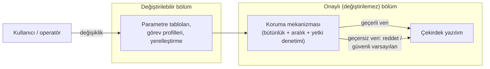

# 19. Kullanıcı Tarafından Değiştirilebilir Yazılım

Kullanıcı tarafından değiştirilebilir yazılım (user-modifiable software, UMS),
genellikle parametreler, ayarlar veya konfigürasyon tabloları üzerinden esneklik sağlar. Bu esneklik, yazılımın kontrolsüz
değişmesine izin vermemelidir.

Bu bölümde temel odak, değiştirilebilir alanların sınırlarının net tanımlanması ve
değişikliklerin doğrulanabilir olmasıdır.

## Neden özel yönetim gerekir?

Parametre üzerinden davranış değiştirmek, kod değiştirmekten daha güvenli görünebilir;
ancak sınır iyi çizilmezse aynı etkiyi daha sinsi biçimde yaratabilir. Bir limit değeri
yanlış girildiğinde kod değişmemiş olsa da sistem davranışı değişmiş olur.

## Değiştirilebilir alanlar

### Değiştirilebilir alanlara örnek

- Limit değerleri
- Dil/yerelleştirme tabloları
- Görev profilleri

Bu alanlar esnek olabilir; ama hangi değişikliğin hangi sınırda kalacağı net olmalıdır.

## Kontrol ilkeleri

- hangi alan değiştirilebilir açık olmalı,
- hangi aralık geçerli kabul edilecek belirtilmeli,
- değişiklik yapan kişinin yetkisi doğrulanmalı,
- değişiklik sonrası test veya kontrol tanımlı olmalı.

## Sistemin değiştirilebilirliğe göre tasarlanması

UMS yaklaşımının işleyebilmesi için değiştirilebilirlik sonradan eklenen bir özellik değil,
baştan verilmiş bir tasarım kararı olmalıdır. Sertifikasyon açısından temel fikir şudur:
onaylanan sistem, "değiştirilemez çekirdek + tanımlı sınırlar içinde değiştirilebilir
bölüm + ikisini ayıran koruma mekanizması (protection mechanism)" üçlüsünün bütünüdür.
Kullanıcı, değiştirilebilir bölümde tanımlı sınırlar içinde kaldığı sürece sistemin
onaylı durumunu bozmaz; koruma mekanizması da tam olarak bu sınırın aşılamayacağını
garanti eder.

### Değiştirilebilir bölümün ayrılması

Ayrımın somut olarak nasıl yapılacağı sistemin mimarisine bağlıdır; yaygın yöntemler
şunlardır:

- **Fiziksel ayrım:** Değiştirilebilir veriler ayrı bir bellek aygıtında ya da ayrı bir
  donanım biriminde tutulur; çekirdek yazılımın bulunduğu bellek, kullanıcı arayüzünden
  yazılamaz.
- **Yazılım bölümlemesi (software partitioning):** Değiştirilebilir bölüm ayrı bir
  bölme (partition) içinde
  çalıştırılır; bellek koruma birimi (memory protection unit, MPU) veya bölümlemeli
  işletim sistemi, bu bölmenin çekirdeğin belleğine ve zamanlamasına etki etmesini
  engeller.
- **Veri düzeyinde ayrım:** Değiştirilebilir içerik yalnızca veri (parametre tablosu,
  konfigürasyon dosyası) olarak tanımlanır; çekirdek yazılım bu veriyi her kullanımda
  bütünlük ve aralık denetiminden geçirir.



Koruma mekanizmasının kritik özelliği, kendisinin **değiştirilemez bölümde** yer
almasıdır. Kullanıcının erişebildiği bir denetim, denetim sayılmaz. Çekirdek yazılım,
değiştirilebilir veriyi okurken tipik olarak üç şeyi doğrular: verinin bütünlüğü
(örneğin döngüsel artıklık kontrolü — cyclic redundancy check, CRC), her alanın geçerli
aralıkta olduğu ve verinin çekirdek sürümüyle uyumlu olduğu. Basit bir örnek:

```c
typedef struct {
    uint32_t schema_version;   /* çekirdeğin beklediği tablo biçimi   */
    int16_t  alt_limit_ft;     /* değiştirilebilir limit değeri       */
    uint32_t crc32;            /* tablo bütünlüğü                      */
} ums_table_t;

bool ums_table_gecerli(const ums_table_t *t)
{
    if (crc32_hesapla(t, offsetof(ums_table_t, crc32)) != t->crc32) {
        return false;                      /* bozuk veri              */
    }
    if (t->schema_version != UMS_SCHEMA_V2) {
        return false;                      /* sürüm uyumsuzluğu       */
    }
    if ((t->alt_limit_ft < ALT_LIMIT_MIN) || (t->alt_limit_ft > ALT_LIMIT_MAX)) {
        return false;                      /* sınır dışı parametre    */
    }
    return true;
}
```

Tablo geçersizse sistemin ne yapacağı da tasarımın parçasıdır: güvenli varsayılan
değerlerle çalışmak, ilgili işlevi devre dışı bırakmak veya durumu ekip üyesine bildirmek
gibi seçenekler emniyet değerlendirmesine göre belirlenir; "son geçerli değeri sessizce
kullanmaya devam etmek" genellikle en riskli seçenektir, çünkü operatör değişikliğin
alındığını sanır.

### Koruma sınırının doğrulanması ve onay kapsamı

Koruma mekanizması, onaylı yazılımın parçası olduğu için çekirdekle **aynı yazılım
seviyesinde** geliştirilir ve doğrulanır. Doğrulama yalnızca "geçerli veri kabul
ediliyor mu" sorusunu değil, asıl olarak olumsuz senaryoları hedefler: bozuk CRC, sınır
dışı değerler, yanlış sürüm, kesilen yazma işlemi sonrası yarım kalmış tablo,
değiştirilebilir bölümden çekirdek belleğe yazma girişimi. Ayrıca kullanıcı
değişikliğinin çekirdeğin **zamanlama ve bellek bütçesini** etkileyemediği gösterilmelidir;
örneğin değiştirilebilir bir tablo, çekirdekte sınırsız bir döngüye ya da taşmaya yol
açabiliyorsa ayrım kâğıt üzerinde kalmış demektir.

Onay kapsamı da bu sınıra göre tanımlanır: sertifikasyon verisi, "kullanıcı şu alanları,
şu aralıklar içinde, şu prosedürle değiştirebilir; bunun dışındaki her değişiklik
tasarım değişikliğidir" ifadesini açıkça içermelidir. Sınırlar içindeki değişiklikler
yeniden onay gerektirmez; sınırın kendisinin değişmesi (yeni bir alanın değiştirilebilir
hale getirilmesi, bir aralığın genişletilmesi) ise koruma mekanizmasının ve emniyet
değerlendirmesinin yeniden ele alınmasını gerektirir.

## Değişikliklerin yönetimi ve bakımı

Değiştirilebilir bölüm onay kapsamının dışında kaldığı için, teslimden sonra bu bölümün
disiplinli yönetilmesi sorumluluğu büyük ölçüde **kullanıcıya (operatöre)** geçer. Bu,
geliştiricinin işinin bittiği anlamına gelmez: geliştirici, kullanıcının bu sorumluluğu
taşıyabilmesi için gereken prosedürleri, araçları ve kısıtları tanımlayıp belgelemek
zorundadır. Sahada sık görülen bir sorun, koruma mekanizması sağlam tasarlanmış bir
sistemin, değişiklik kayıtları tutulmadığı için "hangi uçakta hangi tablo yüklü"
sorusuna cevap verilemez hale gelmesidir.

### Değişikliklerin kayıt altına alınması

Kullanıcı değişiklikleri, çekirdek yazılımdan bağımsız ama onun kadar ciddi bir
konfigürasyon yönetimi (configuration management) ister. Asgari beklentiler:

- Her değiştirilebilir veri kümesinin (parametre tablosu, görev profili) kendine ait bir
  **tanım ve sürüm kimliği** olmalıdır; çekirdek yazılım bu kimliği okuyup
  raporlayabilmelidir.
- Kim, ne zaman, hangi değeri, hangi gerekçeyle değiştirdi — bu bilgiler bir değişiklik
  kaydında tutulmalıdır. Sistem elektronik günlük tutabiliyorsa iyi; tutamıyorsa
  prosedürel kayıt (form, bakım kaydı) tanımlanmalıdır.
- Değişiklik yapma yetkisi sınırlandırılmalı (fiziksel anahtar, parola, bakım modu) ve
  yetkilendirme prosedürü yazılı olmalıdır.
- Değişiklik sonrası yapılacak kontrol (geri okuma, özet/CRC karşılaştırması, kısa bir
  işlev testi) prosedürün parçası olmalıdır; "yazdım, olmuştur" kabul edilmez.

Değişikliği üreten bir yer araçsa (örneğin parametre tablosunu derleyip ikili biçime
çeviren bir yer destek aracı), bu aracın çıktısındaki bir hatanın koruma mekanizması
tarafından yakalanıp yakalanamayacağına bakılır; yakalanamayan hata sınıfları varsa araç
için araç kalifikasyonu (tool qualification) gündeme gelir.

### Sürüm uyumunun izlenmesi

Değiştirilebilir veri ile çekirdek yazılım ayrı yaşam döngülerinde ilerlediği için
zamanla **uyumsuzluk** riski doğar: çekirdek güncellenir, tablo biçimi değişir, ama
sahadaki eski tablolar kalır. Bunu yönetmenin pratik yolları:

| Mekanizma | Amaç |
|---|---|
| Tabloya gömülü şema/biçim sürümü | Çekirdeğin uyumsuz tabloyu reddetmesi |
| Uyumluluk matrisi (çekirdek sürümü × tablo sürümü) | Bakım personelinin doğru eşleşmeyi seçmesi |
| Açılışta sürüm raporlama | Yüklü konfigürasyonun görünür ve denetlenebilir olması |
| Servis bülteni / bakım talimatı | Çekirdek güncellemesinde tabloların da ele alınması |

Çekirdek yazılımın her sürüm değişikliğinde, değiştirilebilir bölümle olan arayüzün
değişip değişmediği açıkça değerlendirilmeli ve sonuç kullanıcıya bildirilmelidir.

### Operatör sorumlulukları

Operatör tarafında tipik sorumluluklar şunlardır:

- değişiklikleri yalnızca üreticinin tanımladığı prosedür ve araçlarla yapmak,
- tanımlı sınırların dışına çıkan bir ihtiyaç doğduğunda bunu kendi başına zorlamak
  yerine üreticiye tasarım değişikliği olarak iletmek,
- filo genelinde hangi birimde hangi konfigürasyonun yüklü olduğunu izlemek,
- değişiklik kayıtlarını denetime hazır tutmak,
- şüpheli davranış raporlarında yüklü konfigürasyonu da olay bilgisine dahil etmek.

Bu sorumlulukların belirsiz kaldığı durumlarda değiştirilebilirlik, esneklik yerine
izlenemeyen bir varyasyon kaynağına dönüşür; bir sonraki başlıktaki riskler tam da bu
boşluktan beslenir.

## Riskler

- yetkisiz değişiklik,
- sınır dışı parametre,
- kayıt tutulmaması,
- sürümle uyuşmayan konfigürasyon.

## Bu bölümden akılda kalması gerekenler

- Değiştirilebilirlik, kontrolsüzlük anlamına gelmez.
- Parametreler de yazılım davranışının parçasıdır.
- Değişiklik sınırları ve doğrulama adımları açık olmalıdır.
- Değiştirilebilirlik baştan tasarlanır: onaylı sistem, değiştirilemez çekirdek ile
  koruma mekanizmasının bütünüdür ve koruma mekanizması çekirdekle aynı yazılım
  seviyesinde doğrulanır.
- Koruma sınırı içindeki değişiklikler yeniden onay gerektirmez; sınırın kendisini
  değiştirmek tasarım değişikliğidir.
- Teslimden sonra değişiklik kaydı, sürüm uyumu ve yetki denetimi operatörün
  sorumluluğudur; geliştirici bunun prosedür ve araçlarını sağlamakla yükümlüdür.
