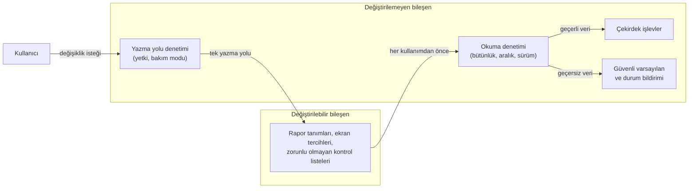

# 19. Kullanıcı Tarafından Değiştirilebilir Yazılım

Kullanıcı tarafından değiştirilebilir yazılım (user-modifiable software, UMS),
kullanıcının onaylı kısıtlar içinde, otorite gözden geçirmesi olmadan değiştirebildiği
yazılımdır. Bu bölüm UMS'yi benzer kavramlardan ayırır; değiştirilebilirliğin tasarımda
nasıl kurulup korunduğunu ve teslimden sonra değişikliklerin nasıl yönetildiğini anlatır.

## UMS nedir, ne değildir?

Tanımın üç öğesi vardır. Birincisi **niyet**: yazılım, kullanıcı değiştirsin diye
tasarlanmıştır; sonradan açılmış bir arka kapı değildir. İkincisi **kısıt**: neyin,
hangi aralıkta, hangi araç ve prosedürle değiştirilebileceği ilk sertifikasyonda
belirlenir. Üçüncüsü **gözden geçirmeden muafiyet**: bu kısıtlar içinde kalan bir
değişiklik için sertifikasyon otoritesine (certification authority), uçak üreticisine ya
da ekipman üreticisine gidilmez. Buradaki kullanıcı, birimin başındaki pilot ya da
teknisyen değil, uçağı işleten kuruluştur (operatör; tipik olarak bir havayolu).
Değiştirilen şey veri, çalıştırılabilir kod ya da ikisi birden olabilir.

UMS'yi belirleyen, demek ki içeriğin türü değildir. "Parametre tablosu" ya da
"konfigürasyon dosyası" olmak bir veriyi UMS yapmaz. Ölçüt şudur: kısıtlar içindeki
değişikliğin emniyeti olumsuz etkileyemeyeceği sistem düzeyinde gösterilmiş midir?
Gösterilmişse içerik kullanıcıya bırakılabilir; yanlış değeri emniyeti etkileyebilen
veri ise aynı biçimde bir tablo olsa bile UMS olamaz.

Sahada karşılaşılan tipik UMS örnekleri şunlardır:

- havayolunun kendi düzenlediği, zorunlu olmayan kontrol listesi içerikleri,
- uçak durum izleme (aircraft condition monitoring) raporlarının tanımları: hangi
  parametrenin hangi koşulda ve hangi sıklıkta kaydedileceği,
- bakım ya da kabin ekranlarındaki dil, birim ve sayfa düzeni tercihleri.

UMS olmaya uygun olmayanlar da aynı açıklıkla sayılabilir: uçak ya da motor performans
verisi, emniyet marjını belirleyen limitler, zorunlu uyarıların mantığı ve eşikleri.
Bunlar değişecekse yol, değişikliğin geliştirici tarafından doğrulanıp onaya
sunulmasıdır.

UMS en çok, yine "sahada bir şeyin değiştiği" üç kavramla karıştırılır:

| Kavram | Kullanıcı ne yapar? | Yeni içerik gözden geçirme ve onaydan geçer mi? | Kitapta |
|---|---|---|---|
| Kullanıcı tarafından değiştirilebilir yazılım (UMS) | Kısıtlar içinde kodu ya da veriyi kendisi değiştirir | Hayır; onaylanan, kısıtlar ve korumadır | Bu bölüm |
| Parametre verisi öğesi (PDI) | Onaylı veri dosyasını kullanır; içeriği kendisi belirlemez | Evet; her PDI dosyası doğrulanır ve onaylı konfigürasyonun parçasıdır | [22. Konfigürasyon Verisi](./22-konfigurasyon-verisi.md) |
| Seçenekle seçilebilir yazılım (option-selectable software) | Seçimi çoğu zaman uçak üreticisi ya da kurulumu yapan kuruluş yapar; kullanıcı yapsa bile yalnızca önceden onaylanmış seçeneklerden birini etkinleştirir, yeni davranış tanımlamaz | Seçenekler ve izin verilen birleşimleri baştan doğrulanıp onaylanmıştır | [17. Kapsanmayan Kodlar: Ölü, Gereksiz ve Devre Dışı Bırakılmış Kodlar](./17-kapsanmayan-kodlar.md) |
| Sahada yüklenebilir yazılım (field-loadable software, FLS) | Onaylı imajı, donanımı sökmeden uçakta yükler | Evet; her sürüm kendi geliştirme, doğrulama ve onay sürecinden geçer | [18. Sahada Yüklenebilir Yazılım](./18-sahada-yuklenebilir-yazilim.md) |

Seçenekle seçilebilir yazılımda seçilmeyen seçeneğin kodu birimde durmaya devam eder
ve devre dışı bırakılmış kod (deactivated code) olarak ele alınır; seçimi kim yaparsa
yapsın, yalnızca hazır seçenekler arasından seçilir ve DO-178C onaylanmamış bir
konfigürasyonun yanlışlıkla seçilmesini önleyen bir önlem ister (§2.5.4). Sahada
yüklenebilirlik ise içeriğin kimin sorumluluğunda olduğunu değil, birime nasıl ulaştığını
anlatır: bir UMS tablosu da bir PDI dosyası da sahada yüklenebilir.

Bu kavramlar birbirini dışlamaz: standart, kullanımına göre bir PDI için UMS, seçenekle
seçilebilir yazılım ve FLS rehberliğinin de ele alınmasını ister (§2.5.1) ve iki ekipman
seçeneğinden birini seçen tek bir bellek bitini UMS örneği sayar (§5.2.3). Ayırt edici
soru bu yüzden biçim değil, her zaman şudur: bu içeriği kim belirliyor ve belirlenen
içerik kimin gözden geçirmesinden geçiyor?

## Neden özel yönetim gerekir?

Parametre üzerinden davranış değiştirmek, kod değiştirmekten daha zararsız görünebilir;
oysa bir değer değiştiğinde kod aynı kalsa da sistemin davranışı değişmiş olur. Onaylı
yazılımda her değişikliğin arkasında gözden geçirme, doğrulama ve onay zinciri vardır.
UMS'de bu zincir bilerek kaldırılır ve yerini tek bir iddia tutar: **kısıtlar içinde
yapılan hiçbir değişiklik, doğru ya da yanlış yapılmış olsun, emniyeti, değiştirilemeyen
bileşeni ve koruma mekanizmasını, operasyonel yetenekleri ya da mürettebat (flight crew)
iş yükünü olumsuz etkileyemez.** DO-178C bu gösterilemiyorsa yazılımın kullanıcı
tarafından değiştirilebilir diye sınıflandırılamayacağını açıkça söyler (§2.5.2). Bu iddia
yazılım ekibinin kendi başına kurabileceği bir iddia değildir. Kullanıcı değişikliğine
izin veren ve onu sınırlayan mekanizmayı sistem gereksinimleri tanımlar; iddianın kendisi
de sistem emniyet değerlendirme sürecinde savunulur.

Bunun pratik sonucu, aralık denetiminin anlamının değişmesidir. Onaya giren bir veri
dosyasında aralık "geçerli" değerleri tanımlar; aralığın içinden doğru değerin seçildiğini
göstermek doğrulamanın işidir. UMS'de değerin doğruluğunu kimse doğrulamayacağı için
aralık "zararsız" değerleri tanımlamak zorundadır: izin verilen zarfın her noktası,
kullanıcı onu yanlışlıkla seçmiş olsa bile kabul edilebilir olmalıdır.

Bir örnek ayrımı netleştirir. Havayolunun kendi eğilim izlemesi için kullandığı,
zorunlu bakım programına girdi olmayan bir raporu tetikleyen sıcaklık eşiği kullanıcıya
açılabilir: eşik yanlış girilirse rapor gereğinden sık ya da seyrek üretilir, uçuş
emniyeti etkilenmez. Aynı sıcaklık için mürettebat uyarısını tetikleyen eşik kullanıcıya
açılamaz. Bir limit tablosu ancak koruma mekanizmasının zorladığı aralıktaki her değerin
emniyetli olduğu gösterilmişse UMS olabilir; "aralık denetimi var" demek bu gösterimin
yerini tutmaz.

Aynı ilke gösterilen bilgi için de geçerlidir. Kullanıcının düzenlediği içerik
mürettebata gösteriliyorsa onaylı bilgiyle karıştırılmayacak biçimde ayırt edilir;
mürettebatın emniyetle ilgili kararını dayandırdığı bilgi ise kullanıcıya bırakılmaz.

## Dayanak ve planlara yansıması

DO-178C, UMS'yi başlıca iki yerde ele alır: sistem yönlerini anlatan 2. bölümünde
(§2.5.2) sistem düzeyinde sağlanması gerekenleri sayar, yazılım tasarım sürecinde de
(§5.2.3) değiştirilebilir bileşenle değiştirilemeyen bileşenin ayrılmasına ilişkin
faaliyetleri verir. Standart, yazılımın operasyonel yönlerini ele almadığını, örneğin
kullanıcı tarafından değiştirilebilir verinin sertifikasyon yönlerinin kapsamı dışında
kaldığını baştan söyler (§1.2); §2.5.2 de sistem düzeyindeki faaliyetleri anlattığı için
yazılım geliştiricisinin payına düşeni tek tek ayırmaz. FAA AC 20-115D ve
EASA AMC 20-115D bu boşluğu 8. bölümlerindeki iki beklentiyle kapatır: geliştirici, sistem
düzeyindeki hususların karşılanabilmesi için gereken bilgiyi sağlar; değiştirilebilir
bileşen de kendisine atanan yazılım seviyesinden (software level) düşük olmayan bir
seviyede geliştirilir. Bu dokümanlardan önce FAA tarafında konu Order 8110.49'un ayrı bir
bölümünde ele alınıyordu; bugün başvurulacak rehber AC 20-115D ve AMC 20-115D'dir.

Projede UMS ilk olarak yazılım sertifikasyon planında (Plan for Software Aspects of
Certification, PSAC) görünür. UMS bir ek husus (additional consideration) olarak beyan
edilir; değiştirilebilir bileşenin kapsamı, yazılım seviyesi, koruma yaklaşımı ve
değişiklik için öngörülen araç ve prosedür burada otoriteyle mutabakata sunulur. DO-178C
de UMS öngörülüyorsa ilgili süreç, araç, ortam ve veri öğelerinin planlarda belirtilmesini
ister (§4.2). Bu sıra önemlidir: kısıtlar ilk sertifikasyonda belirlendiği için, planlama
aşamasında açılmamış bir UMS kararını sonradan "bu tabloyu havayolu değiştirsin" diye
eklemek yeni bir sertifikasyon tartışması başlatır.

Sonraki veriler aynı kararı izler. Koruma mekanizması ve değiştirilebilir bileşenle
arayüz, tasarım tanımında yer alır. Yazılım konfigürasyon indeksi (Software
Configuration Index, SCI) kullanıcı değişikliği için öngörülen prosedür, yöntem ve
araçları tanımlar (§11.16). SCI'de tanımlanan yazılım ürünü temel çizgisi (baseline) ise
UMS'nin yalnızca koruma ve sınır bileşenlerini içerir, değiştirilebilir içeriğin kendisini
içermez (§7.2.2); kullanıcı değişikliğinin onaylı ürünün konfigürasyon kimliğini
değiştirmemesini sağlayan da budur. Yazılım başarı özeti (Software Accomplishment
Summary, SAS) PSAC'ta beyan edilen yaklaşımdan farkları açıklar; uygulamada korumanın
nasıl sağlandığı ve kısıtların son hâli de burada özetlenir.

## Sistemin değiştirilebilirliğe göre tasarlanması

UMS yaklaşımının işleyebilmesi için değiştirilebilirlik sonradan eklenen bir özellik değil,
baştan verilmiş bir tasarım kararı olmalıdır. Mimari üç öğeden oluşur: değiştirilemeyen
bileşen (non-modifiable component; bu bölümde kısaca çekirdek), kısıtlar içinde
değiştirilebilir bileşen (modifiable component) ve ikisini ayıran koruma mekanizması
(protection mechanism). Onay; çekirdeği, koruma mekanizmasını ve değişiklik kısıtlarını
kapsar. Değiştirilebilir bileşenin kısıtlar içindeki güncel içeriği ise otoritenin tek
tek gözden geçirmesine tabi değildir. Kullanıcı kısıtlar içinde kaldığı sürece sistemin
onaylı durumunu bozmaz; koruma mekanizması da tam olarak bu sınırın aşılamayacağını
garanti eder.

Tasarım dört soruya yazılı cevap verir: hangi alanlar değiştirilebilir, her alan için
izin verilen zarf nedir, değişikliği kim ve hangi yolla yapabilir, değişiklikten sonra
hangi kontrol yapılır? İlk iki soru bu başlığın, son ikisi bir sonraki başlığın
konusudur.

### Değiştirilebilir bileşenin ayrılması

Ayrımın somut olarak nasıl yapılacağı sistemin mimarisine bağlıdır; yaygın yöntemler
şunlardır:

- **Fiziksel ayrım:** Değiştirilebilir içerik ayrı bir bellek aygıtında ya da ayrı bir
  donanım biriminde tutulur; çekirdeğin bulunduğu bellek, kullanıcı arayüzünden
  yazılamaz.
- **Yazılım bölümlemesi (software partitioning):** Değiştirilebilir bileşen, özellikle
  kod içeriyorsa, bölümlemeli bir işletim sisteminde ayrı bir bölüme (partition)
  yerleştirilir. Bellek koruma birimi (memory protection unit, MPU) ya da bellek yönetim
  birimi (memory management unit, MMU) bu bileşenin çekirdeğin belleğine yazmasını,
  işletim sisteminin zaman çizelgesi de çekirdeğe ayrılan işlemci zamanını tüketmesini
  engeller; biri diğerinin yerini tutmaz (bkz.
  [21. Yazılım Bölümlemesi](./21-yazilim-bolumlemesi.md)).
- **Veri düzeyinde ayrım:** Değiştirilebilir içerik yalnızca veri (parametre tablosu,
  rapor tanımı) olarak tanımlanır; çekirdek bu veriyi her kullanımdan önce bütünlük ve
  aralık denetiminden geçirir.

Yöntem hangisi olursa olsun iki koşul değişmez. Koruma, **kullanıcının değiştiremeyeceği
bir yerde** durur; kullanıcının erişebildiği bir denetim, denetim sayılmaz. DO-178C
korumanın donanımla, yazılımla, değişikliği yapmakta kullanılan araçla ya da bunların
birleşimiyle sağlanabileceğini kabul eder (§5.2.3); bu bölümdeki örnekler korumayı
değiştirilemeyen yazılım bileşenine yerleştirir. Ayrıca değişiklik için sağlanan yolun,
değiştirilebilir bileşeni değiştirmenin **tek yolu** olduğu gösterilmelidir: bakım
portundan, hata ayıklama arayüzünden ya da dosya sisteminden aynı belleğe ulaşan ikinci
bir yol varsa yetki denetimi de kayıt da atlanabilir.


```mermaid
flowchart LR
  U["Kullanıcı"]
  subgraph ums["Değiştirilebilir bileşen"]
    P["Rapor tanımları, ekran tercihleri,<br/>zorunlu olmayan kontrol listeleri"]
  end
  subgraph onayli["Değiştirilemeyen bileşen"]
    Y["Yazma yolu denetimi<br/>(yetki, bakım modu)"]
    KM["Okuma denetimi<br/>(bütünlük, aralık, sürüm)"]
    K["Çekirdek işlevler"]
    V["Güvenli varsayılan<br/>ve durum bildirimi"]
  end
  U -- "değişiklik isteği" --> Y
  Y -- "tek yazma yolu" --> P
  P -- "her kullanımdan önce" --> KM
  KM -- "geçerli veri" --> K
  KM -- "geçersiz veri" --> V
```

Koruma mekanizması iki noktada çalışır. Yazma yolunda, değişikliği yapanın yetkisini ve
birimin değişikliğe uygun durumda olduğunu denetler. Okuma yolunda çekirdek,
değiştirilebilir veriyi kullanmadan önce üç şeyi doğrular: verinin bozulmadığını,
çekirdeğin beklediği biçim sürümünde olduğunu ve her alanın izin verilen zarfın içinde
kaldığını. Bozulmayı yakalamanın tipik yolu döngüsel artıklık denetimidir (cyclic
redundancy check, CRC). Basit bir örnek:

```c
typedef struct {
    uint32_t sema_surumu;       /* çekirdeğin beklediği tablo biçimi      */
    uint16_t rapor_esigi_degc;  /* bakım raporu tetikleme eşiği, °C       */
    uint16_t ayrilmis;          /* örtük dolgu yerine açık alan; sıfır    */
    uint32_t crc32;             /* önceki alanlar üzerinden CRC-32        */
} ums_tablo_t;

bool ums_tablo_gecerli(const ums_tablo_t *tablo)
{
    uint32_t hesaplanan;

    if (tablo == NULL) {
        return false;
    }
    hesaplanan = crc32_hesapla((const uint8_t *)tablo,
                               offsetof(ums_tablo_t, crc32));
    if (hesaplanan != tablo->crc32) {
        return false;                      /* bozuk veri               */
    }
    if (tablo->sema_surumu != UMS_SEMA_SURUMU) {
        return false;                      /* sürüm uyumsuzluğu        */
    }
    if (tablo->ayrilmis != 0U) {
        return false;                      /* tanımsız alan dolu       */
    }
    if ((tablo->rapor_esigi_degc < RAPOR_ESIGI_ENAZ_DEGC) ||
        (tablo->rapor_esigi_degc > RAPOR_ESIGI_ENCOK_DEGC)) {
        return false;                      /* izin verilen zarfın dışı */
    }
    return true;
}
```

Yapıdaki ayrılmış alan süs değildir. Derleyicinin alanlar arasına kendiliğinden
yerleştirdiği dolgu baytlarının (padding) yeri ve sayısı derleyiciye ve hedef mimariye
göre değişir, içeriği de belirsizdir. Tabloyu üreten yer aracı ile hedef bilgisayar
yapıyı bellekte farklı yerleştirirse CRC'nin kapsadığı bayt dizisi iki tarafta aynı
olmaz ve geçerli tablo reddedilir. Bu yüzden yapı örtük dolgu bırakmayacak biçimde
kurulur ya da CRC, alanların tek tek serileştirildiği bayt dizisi üzerinden hesaplanır.

Tablo geçersizse sistemin ne yapacağı da tasarımın parçasıdır: güvenli varsayılan
değerlerle çalışmak, ilgili işlevi devre dışı bırakmak ya da durumu mürettebata veya
bakım personeline bildirmek gibi seçenekler emniyet değerlendirmesine göre belirlenir.
"Son geçerli değeri sessizce kullanmaya devam etmek" genellikle en riskli seçenektir,
çünkü kullanıcı değişikliğin alındığını sanır.

### Koruma sınırının doğrulanması ve onay kapsamı

Yazılımla sağlanan koruma mekanizması, çekirdekle — daha kesin söylenirse değiştirilebilir
bileşendeki hatalardan koruduğu işlevle — **aynı yazılım seviyesinde** tasarlanır ve
doğrulanır (§2.5.2, §5.2.3). Doğrulama yalnızca "geçerli veri kabul
ediliyor mu" sorusunu değil, asıl olarak olumsuz senaryoları hedefler: bozuk CRC, sınır
dışı değerler, yanlış sürüm, kesilen yazma işlemi sonrası yarım kalmış tablo,
değiştirilebilir bileşenden çekirdek belleğe yazma girişimi, yetkisiz ya da yanlış
durumda yapılan yazma isteği. Ayrıca kullanıcı değişikliğinin çekirdeğin **zamanlama ve
bellek bütçesini** etkileyemediği gösterilmelidir; örneğin değiştirilebilir bir tablo,
çekirdekte sınırsız bir döngüye ya da taşmaya yol açabiliyorsa ayrım kâğıt üzerinde
kalmış demektir.

Değiştirilebilir bileşenin kendi yazılım seviyesi ayrı bir sorudur. Seviyeyi sistem
emniyet değerlendirme süreci atar (bkz.
[3. Sistem Emniyet Değerlendirmesi Bağlamında Yazılım](../02-baglam/03-sistem-emniyet-degerlendirmesi-baglaminda-yazilim.md)):
koruma mekanizması yerindeyken bu bileşenin katkıda bulunabileceği en ağır arıza
durumuna (failure condition) bakılır. Koruma etkiliyse bu seviyenin çekirdeğinkinden
düşük çıkması olağandır; ancak bu bir ön kabul değil, değerlendirmenin sonucudur.
Geliştiricinin teslim ettiği ilk içerik, atanan seviyeden düşük olmayan bir seviyede
geliştirilir.

Onay kapsamı da bu sınıra göre tanımlanır: sertifikasyon verisi, "kullanıcı şu alanları,
şu aralıklar içinde, şu araç ve prosedürle değiştirebilir; bunun dışındaki her değişiklik
tasarım değişikliğidir" ifadesini açıkça içermelidir. Kısıtlar içindeki değişiklikler
yeniden onay gerektirmez. Değiştirilemeyen yazılımı, korumasını ya da değiştirilebilir
bileşenin sınırlarını etkileyen bir değişiklik (yeni bir alanın değiştirilebilir hâle
getirilmesi, bir aralığın genişletilmesi) ise DO-178C'ye göre sıradan bir yazılım
değişikliğidir ve önceden geliştirilmiş yazılımın değiştirilmesine ilişkin rehberliğe
tabidir (§2.5.2, §12.1.1); emniyet değerlendirmesi ve koruma mekanizması yeniden ele
alınır.

## Değişikliklerin yönetimi ve bakımı

Kısıtlar içindeki değişiklikler otoritenin ve üreticinin gözden geçirmesinden geçmediği
için, kullanıcı bir değişiklik yaptığı andan itibaren değiştirilen yazılımın bütün
yönlerinin sorumluluğu **kullanıcıya** geçer: içeriğin konfigürasyon yönetimi, kalite
güvencesi ve doğrulaması artık onun işidir (§2.5.2). Bu, geliştiricinin işinin bittiği
anlamına gelmez: geliştirici, kullanıcının yazılımı uçağın emniyetini tehlikeye atmadan
yönetebilmesi için gereken bilgiyi sağlamak zorundadır; prosedürler, araçlar ve kısıtlar
bu amaçla tanımlanıp belgelenir. Sahada sık görülen bir sorun, koruma mekanizması sağlam
tasarlanmış bir sistemin, değişiklik kayıtları tutulmadığı için "hangi uçakta hangi tablo
yüklü" sorusuna cevap verilemez hâle gelmesidir.

### Değişikliklerin kayıt altına alınması

Kullanıcı değişiklikleri, çekirdekten bağımsız ama onun kadar ciddi bir konfigürasyon
yönetimi (configuration management) ister; tanımlama, değişiklik kaydı ve durum izleme
ilkeleri geliştirme tarafındakilerle aynıdır (bkz.
[10. Yazılım Konfigürasyon Yönetimi](../03-do178c-ile-gelistirme/10-yazilim-konfigurasyon-yonetimi.md)).
Asgari beklentiler:

- Her değiştirilebilir veri kümesinin (rapor tanımı, parametre tablosu) kendine ait bir
  **tanım ve sürüm kimliği** olmalıdır; çekirdek bu kimliği okuyup raporlayabilmelidir.
- Kim, ne zaman, hangi değeri, hangi gerekçeyle değiştirdi — bu bilgiler bir değişiklik
  kaydında tutulmalıdır. Sistem elektronik günlük tutabiliyorsa iyi; tutamıyorsa
  prosedürel kayıt (form, bakım kaydı) tanımlanmalıdır.
- Değişiklik yapma yetkisi sınırlandırılmalı (fiziksel anahtar, parola, bakım modu) ve
  yetkilendirme prosedürü yazılı olmalıdır.
- Değişiklik sonrası yapılacak kontrol (geri okuma, özet/CRC karşılaştırması, kısa bir
  işlev testi) prosedürün parçası olmalıdır; "yazdım, olmuştur" kabul edilmez.

Değişikliği üreten bir yer araçsa (örneğin parametre tablosunu derleyip ikili biçime
çeviren bir yer destek aracı), bu aracın çıktısındaki bir hatanın koruma mekanizması
tarafından yakalanıp yakalanamayacağına bakılır; yakalanamayan hata sınıfları varsa araç
için araç kalifikasyonu (tool qualification) gündeme gelir (bkz.
[13. DO-330 ve Yazılım Aracı Kalifikasyonu](../04-arac-kalifikasyonu-ve-ekler/13-do330-arac-kalifikasyonu.md)).
Kısıtları yalnızca yer aracı zorluyor, birimdeki yazılım aynı denetimi yinelemiyorsa
durum daha ağırdır: araç koruma mekanizmasının parçası olmuştur ve DO-178C bu durumda
aracın araç kalifikasyonu kurallarına göre sınıflandırılıp kalifiye edilmesini ister
(§5.2.3, §12.2).

### Sürüm uyumunun izlenmesi

Değiştirilebilir veri ile çekirdek ayrı yaşam döngülerinde ilerlediği için zamanla
**uyumsuzluk** riski doğar: çekirdek güncellenir, tablo biçimi değişir, ama sahadaki
eski tablolar kalır. Bunu yönetmenin pratik yolları:

| Mekanizma | Amaç |
|---|---|
| Tabloya gömülü şema/biçim sürümü | Çekirdeğin uyumsuz tabloyu reddetmesi |
| Uyumluluk matrisi (çekirdek sürümü × tablo sürümü) | Bakım personelinin doğru eşleşmeyi seçmesi |
| Açılışta sürüm raporlama | Yüklü konfigürasyonun görünür ve denetlenebilir olması |
| Servis bülteni / bakım talimatı | Çekirdek güncellemesinde tabloların da ele alınması |

Çekirdeğin her sürüm değişikliğinde, değiştirilebilir bileşenle olan arayüzün değişip
değişmediği açıkça değerlendirilmeli ve sonuç kullanıcıya bildirilmelidir.

### Kullanıcının sorumlulukları

Kullanıcı tarafında tipik sorumluluklar şunlardır:

- değişiklikleri yalnızca üreticinin tanımladığı prosedür ve araçlarla yapmak,
- değiştirdiği içeriği kendi süreciyle gözden geçirip doğrulamak ve bunun kaydını tutmak,
- tanımlı kısıtların dışına çıkan bir ihtiyaç doğduğunda bunu kendi başına zorlamak
  yerine üreticiye tasarım değişikliği olarak iletmek,
- filo genelinde hangi birimde hangi konfigürasyonun yüklü olduğunu izlemek,
- değişiklik kayıtlarını denetime hazır tutmak,
- şüpheli davranış raporlarında yüklü konfigürasyonu da olay bilgisine dahil etmek.

Bu sorumlulukların belirsiz kaldığı durumlarda değiştirilebilirlik, esneklik yerine
izlenemeyen bir varyasyon kaynağına dönüşür.

## Riskler ve karşı önlemler

Yukarıdaki mekanizmaların her biri belirli bir riski karşılar. Tablo, bir UMS tasarımını
gözden geçirirken kontrol listesi olarak da kullanılabilir:

| Risk | Nasıl ortaya çıkar? | Karşılayan mekanizma |
|---|---|---|
| Yetkisiz değişiklik | Bakım parolası elden ele dolaşır; aynı belleğe ulaşan ikinci bir yol açık kalır | Yazma yolunda yetki denetimi, tek değişiklik yolu, değişiklik kaydı |
| Zarf dışı ya da bozuk veri | Yazma yarıda kesilir, yer aracı hatalı çıktı üretir, dosya elle düzenlenir | Her kullanımdan önce bütünlük ve aralık denetimi; güvenli varsayılan ve durum bildirimi |
| Kayıtsız değişiklik | Değişiklik birimde yapılır, filo kaydına işlenmez | Sürüm kimliğinin birimden okunması, prosedürel kayıt, değişiklik sonrası kontrol |
| Sürümle uyuşmayan içerik | Çekirdek güncellenir, sahadaki eski tablolar kalır | Gömülü şema sürümü, uyumluluk matrisi, servis bülteni |
| Sınırın sessizce genişlemesi | Emniyetle ilgili bir parametre "nasılsa veri" denerek değiştirilebilir alana taşınır | Sınır değişikliğinin tasarım değişikliği sayılması ve emniyet değerlendirmesinin yeniden ele alınması |

## Bu bölümden akılda kalması gerekenler

- UMS'yi belirleyen içeriğin türü değil, ilk sertifikasyonda belirlenen kısıtlar içinde
  otorite ve üretici gözden geçirmesi olmadan değiştirilmek üzere tasarlanmış olmasıdır.
  PDI, seçenekle seçilebilir yazılım ve FLS ile sınırı içeriğin biçimi değil, içeriği
  kimin belirlediği ve kimin gözden geçirdiği çizer; kavramlar birbirini dışlamaz.
- Kısıtlar içindeki her değişiklik, yanlış yapılmış olsa bile emniyeti etkilememelidir;
  aralık denetimi bu yüzden "geçerli" değil "zararsız" zarfı tanımlar ve bu iddia sistem
  düzeyinde savunulur.
- UMS kararı PSAC'ta beyan edilip otoriteyle baştan kararlaştırılır; SCI kullanıcı
  değişikliği için öngörülen prosedür ve araçları tanımlar. Ürün temel çizgisi UMS'nin
  yalnızca koruma ve sınır bileşenlerini içerir.
- Onay; değiştirilemeyen bileşeni, koruma mekanizmasını ve değişiklik kısıtlarını kapsar.
  Koruma donanımla, yazılımla ya da araçla sağlanabilir ama kullanıcının değiştiremeyeceği
  yerde durur: yazılımsa değiştirilemeyen yazılımla aynı seviyede doğrulanır, araçsa
  kalifiye edilir; değiştirilebilir bileşeni değiştirmenin tek yolu sağlanan yoldur.
- Kısıtlar içindeki değişiklikler yeniden onay gerektirmez; değiştirilemeyen yazılımı,
  korumayı ya da sınırı etkileyen değişiklik olağan yazılım değişikliği sürecinden geçer.
- Kullanıcı, yaptığı değişiklikle birlikte değiştirilen içeriğin konfigürasyon yönetimi,
  kalite güvencesi ve doğrulamasının sorumluluğunu üstlenir; geliştirici bunun için
  gereken bilgiyi, prosedürü, aracı ve kısıtları sağlamakla yükümlüdür.
