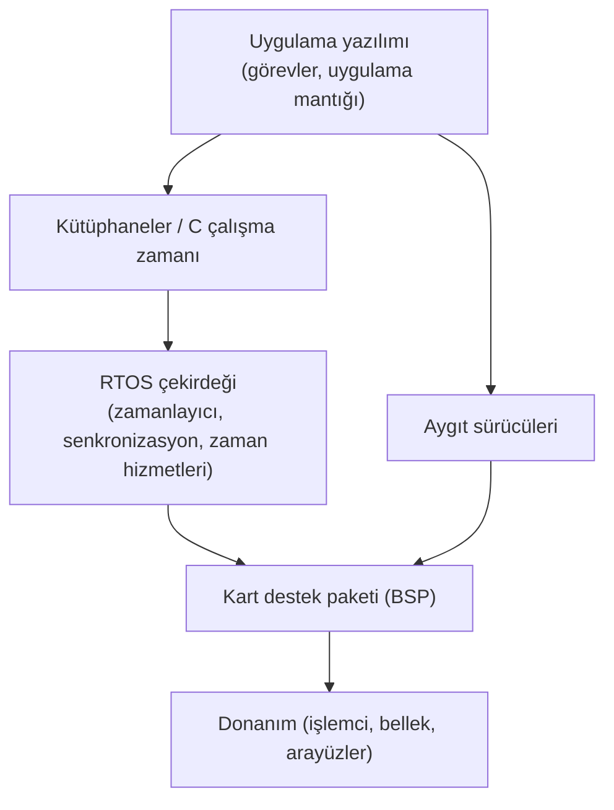

# 20. Gerçek Zamanlı İşletim Sistemleri

Gerçek zamanlı işletim sistemleri, görevlerin zamanında tamamlanmasını kolaylaştırır;
ancak aynı zamanda zamanlama, öncelik ve kesme davranışlarını dikkatle yönetmeyi
gerektirir.

Bu bölüm, RTOS kullanımının yazılım mimarisi, test ve emniyet kanıtı üzerindeki
etkilerini açıklar.

## RTOS neden önemlidir?

RTOS, bir işlevin yalnızca doğru değil, zamanında da yapılmasını sağlar. Aviyonik
sistemlerde zamanlama hatası, işlev hatası kadar kritik olabilir. Bu yüzden işletim
sistemi seçimi ve kullanımı emniyet mimarisinin parçasıdır.

## Tipik konular

### RTOS açısından tipik konular

- Öncelik terslenmesi (priority inversion)
- Zamanlayıcı davranışı
- Kesme gecikmesi
- Paylaşılan kaynaklar

## RTOS çekirdeği ve destek yazılımları

Günlük dilde "RTOS" tek bir üründen söz eder gibi kullanılır; oysa hedef karta yüklenen
yazılım yığını birkaç ayrı katmandan oluşur ve her katmanın güvence açısından konumu
farklıdır. Projede sınırları en baştan netleştirmek gerekir; çünkü sertifikasyon
kanıtının kimin tarafından, hangi kapsamla üretileceği bu sınırlara göre belirlenir.

Tipik katmanlar şunlardır:

- **Çekirdek (kernel):** Zamanlayıcı, görev (task) yönetimi, kesme dağıtımı,
  senkronizasyon nesneleri (semafor, kuyruk, muteks) ve zaman hizmetlerini sağlayan
  ana bileşen. RTOS tedarikçisinin ürünüdür ve çoğu zaman sertifikasyon paketiyle
  birlikte gelir.
- **Kart destek paketi (board support package, BSP):** Çekirdeği belirli bir işlemci
  kartına bağlayan başlatma kodu, saat ve kesme denetleyicisi yapılandırması, bellek
  haritası tanımları. Tedarikçi bir referans BSP verse bile, hedef karta uyarlanması
  genellikle proje ekibine düşer.
- **Aygıt sürücüleri (device driver):** ARINC 429, MIL-STD-1553, Ethernet, ayrık
  giriş/çıkış gibi arayüzleri işleten kod. Kimi sürücüler RTOS ile gelir, kimileri
  projede yazılır; kaynağı ne olursa olsun uçuşta çalışan koddur.
- **Kütüphaneler ve çalışma zamanı desteği:** C çalışma zamanı, matematik
  kütüphaneleri, derleyicinin eklediği yardımcı rutinler. Görünmez oldukları için en
  sık ihmal edilen katmandır; bağlanan her fonksiyon güvence kapsamına girer.

Güvence açısından temel ilke basittir: **çalıştırılabilir nesne koduna bağlanan her
şey, üzerinde çalışan uygulamanın yazılım seviyesiyle uyumlu biçimde
doğrulanmalıdır.** Katman "hazır alındı" diye kapsam dışında kalmaz. Pratikte bu şu
anlama gelir:

| Katman | Tipik kaynak | Güvence kanıtının tipik sahibi |
|---|---|---|
| Çekirdek | RTOS tedarikçisi | Tedarikçinin sertifikasyon paketi + projenin entegrasyon doğrulaması |
| BSP | Tedarikçi şablonu + proje uyarlaması | Büyük ölçüde proje ekibi |
| Sürücüler | Karışık | Kaynağına göre; uyarlanan kısım proje ekibinde |
| Kütüphaneler | Derleyici/tedarikçi | Kullanılan alt küme için proje ekibi |

Deneyimle sabittir: sertifikasyon paketli bir çekirdek satın almak, işin yalnızca bir
bölümünü kapatır. BSP uyarlaması, projeye özgü sürücüler ve kullanılan kütüphane alt
kümesi çoğu projede tedarikçi paketinin dışında kalır ve planlama aşamasında ayrı iş
kalemleri olarak görünmelidir; aksi halde bu boşluk genellikle katılım aşaması (Stage
of Involvement, SOI) denetimlerinde, yani en pahalı anda fark edilir.

## Emniyet-kritik RTOS'un nitelikleri

Masaüstü veya genel amaçlı gömülü sistemlerde "iyi" sayılan bir işletim sistemi,
emniyet-kritik bir aviyonik projede kullanılamayabilir. Fark, ortalama performansta
değil, **en kötü durumun öngörülebilirliğindedir**. Emniyet-kritik bir RTOS'ta aranan
başlıca nitelikler şunlardır:

**Belirlenimci zamanlama (deterministic scheduling).** Her çekirdek hizmetinin en kötü
durum yürütme süresi (worst-case execution time, WCET) bilinmeli ve belgelenmiş
olmalıdır. "Genellikle 5 mikrosaniyede döner" ifadesi yeterli değildir; zamanlama
analizi ancak üst sınırlar üzerine kurulabilir. Öncelik tabanlı, kesintiye izin veren
(preemptive) zamanlayıcılar bu alanda yaygındır; bazı mimariler ise görevleri önceden
tanımlı zaman pencerelerine yerleştiren zaman tetiklemeli çizelgeleme kullanır.

**Güvenilir bellek yönetimi.** Çalışma sırasında serbest dinamik bellek ayırma
(dynamic memory allocation), parçalanma ve tükenme riski nedeniyle emniyet-kritik
yazılımda genellikle yasaklanır veya başlatma aşamasıyla sınırlanır. İyi bir RTOS,
sabit boyutlu blok havuzları gibi belirlenimci mekanizmalar sunar ve bellek koruma
birimini (memory protection unit, MPU) kullanarak bir görevin başka bir görevin
alanına yazmasını engelleyebilir.

**Öngörülebilir kesme işleme.** Kesme gecikmesinin üst sınırı bilinmeli, kesme
servis rutinlerinin çekirdek hizmetleriyle etkileşimi net kurallara bağlanmış
olmalıdır. Kesmelerin kapalı tutulduğu en uzun süre, sistemin zamanlama bütçesine
doğrudan girer.

**Öncelik terslenmesine (priority inversion) karşı koruma.** Düşük öncelikli bir
görevin tuttuğu kaynağı bekleyen yüksek öncelikli görev, araya giren orta öncelikli
görevler yüzünden süresiz gecikebilir. Olgun bir RTOS bunun için öncelik kalıtımı
(priority inheritance) veya öncelik tavanı (priority ceiling) protokollerini sunar.

**Gürbüz bölümleme (robust partitioning).** Aynı işlemci üzerinde farklı yazılım
seviyelerinden bileşenler barındırılacaksa, bir bölümdeki hatanın diğerlerinin ne
belleğini ne de zaman bütçesini etkileyemeyeceği gösterilmelidir. ARINC 653 tarzı
bölümlemeli işletim sistemleri, her bölüme ayrılmış bellek alanı ve garanti edilmiş
zaman pencereleri sağlayarak bu ihtiyaca cevap verir (ayrıntı için bu kısımdaki
yazılım bölümlemesi bölümüne bakınız: [21. Yazılım Bölümlemesi](21-yazilim-bolumlemesi.md)).

**Hata tespiti ve sağlık izleme (health monitoring).** Zaman aşımı, yasa dışı bellek
erişimi, yığın taşması gibi olayların tespit edilmesi ve yapılandırılabilir bir
tepkiye (bölümü yeniden başlatma, güvenli duruma geçme, kaydetme) bağlanabilmesi
beklenir.

**Sertifiye edilebilirlik.** Teknik nitelikler kadar önemlisi, RTOS'un DO-178C
yaşam döngüsü verisiyle birlikte gelmesidir: gereksinimler, tasarım, kaynak kod,
doğrulama sonuçları, yapısal kapsam analizi (structural coverage analysis) kanıtı ve
izlenebilirlik (traceability). Kanıtı
olmayan "hızlı ve küçük" bir çekirdek, sertifikasyon açısından sıfırdan geliştirilen
koddan farksızdır.

| Nitelik | Yokluğunda tipik belirti |
|---|---|
| Belirlenimci zamanlama | Yük altında ara sıra kaçırılan zaman sınırları |
| Belirlenimci bellek yönetimi | Uzun çalışmada parçalanma, öngörülemeyen ayırma hataları |
| Öncelik terslenmesi koruması | Nadir, yeniden üretilmesi zor gecikme olayları |
| Gürbüz bölümleme | Düşük seviyeli bir bileşen hatasının kritik işlevi etkilemesi |
| Sertifikasyon kanıtı | SOI denetimlerinde kapatılamayan bulgular |

## RTOS seçimi

RTOS seçimi teknik bir karşılaştırma gibi görünse de aslında bir **risk yönetimi**
kararıdır: proje, çekirdeğin davranışına ilişkin kanıt üretme yükünün ne kadarını
tedarikçiye devredebilecek, ne kadarını kendi üzerine alacaktır? Seçim üç eksende
değerlendirilmelidir.

**Teknik riskler.** Önceki alt bölümde sayılan nitelikler burada somut sorulara
dönüşür:

- Öncelik terslenmesine karşı hangi protokol var ve kanıtı gösterilmiş mi?
- Çekirdek hizmetlerinin WCET değerleri hedef işlemci ailesi için yayımlanmış mı?
- Bellek yönetimi çalışma sırasında ayırma gerektiriyor mu; sızıntı ve parçalanma
  nasıl dışlanıyor?
- Kaynak çekişmesi (resource contention) durumunda kilit bekleme süreleri sınırlı mı;
  kilitlenme (deadlock) analizi için model yeterince basit mi?
- Kesme gecikmesi ve kesmelerin kapalı kaldığı en uzun süre belgelenmiş mi?

**Sertifikasyon paketi.** Hazır bir RTOS, ancak yaşam döngüsü verisiyle birlikte
alındığında sertifikasyon açısından "hazır" sayılır. Paketin hedef yazılım
seviyesini karşıladığı, hedef işlemciye ve kullanılan derleyici sürümüne uygulanabilir
olduğu ve projenizin yapılandırmasını (etkin özellik kümesini) kapsadığı ayrı ayrı
doğrulanmalıdır. Paket dışında bırakılmış her özellik ya kapatılır ya da proje
tarafından doğrulanır; "kullanmıyoruz ama bağlı" durumu, gereksiz kod (extraneous
code) tartışmasını kapıya getirir.

**Tedarikçi değerlendirmesi.** RTOS ilişkisi tek seferlik bir satın alma değil,
programın ömrü boyunca süren bir bağımlılıktır. Tedarikçinin hata bildirim ve
düzeltme süreci, sürüm politikası, daha önce hangi projelerde ve hangi otoritelerle
sertifikasyon geçirdiği, araç kalifikasyonu (tool qualification) gereken yardımcı
araçlar sunup sunmadığı
ve uzun vadeli destek taahhüdü sorgulanmalıdır. Kaynak koda ve problem raporu
geçmişine erişim koşulları sözleşmede netleşmelidir; bir tedarikçinin bilinen hata
listesini paylaşma biçimi, çoğu zaman teknik broşüründen daha öğreticidir.

| Eksen | Anahtar soru | Zayıflığın bedeli |
|---|---|---|
| Teknik | En kötü durum davranışı kanıtlanabilir mi? | Zamanlama analizinin çökmesi, geç keşfedilen tasarım değişikliği |
| Sertifikasyon paketi | Veri, bizim seviye/işlemci/yapılandırmamızı kapsıyor mu? | Boşlukları projenin doldurması; plan dışı doğrulama işi |
| Tedarikçi | Program ömrü boyunca destek sürecek mi? | Sürüm kilitlenmesi, hata düzeltmelerine erişememe |

Pratik bir uyarı: değerlendirmeyi yalnızca veri sayfaları üzerinden yapmayın. Hedef
karta yakın bir ortamda küçük bir deneme uygulaması koşturmak — birkaç görev, bir
kesme kaynağı, bir paylaşılan kaynak — broşürde görünmeyen davranışları erken ortaya
çıkarır. Tipik risk başlıkları için [Ek B](../06-ekler/02-ek-b-rtos-endise-alanlari.md),
değerlendirmede kullanılabilecek soru listesi için
[Ek C](../06-ekler/03-ek-c-rtos-secim-sorulari.md) hazırlanmıştır.

## Mimari etkiler

RTOS kullanımı, görevlerin nasıl ayrıldığını, hangi işlevin hangi öncelikte çalıştığını
ve paylaşılan kaynakların nasıl korunduğunu belirler. Özellikle kilit mekanizmaları ve
zamanlayıcı yapılandırmaları test edilebilir olmalıdır.

## Doğrulama açısından bakış

Doğrulama sırasında yalnızca işlevsel sonuç değil, zaman davranışı da gözlenmelidir.
Bir görev doğru çıktıyı üretse bile yanlış zamanda üretirse sistem davranışı hatalı olur.

## Bu bölümden akılda kalması gerekenler

- RTOS, zamanlı davranışın merkezindedir.
- Çekirdek, BSP, sürücüler ve kütüphaneler ayrı katmanlardır; bağlanan her katman
  güvence kapsamına girer ve kanıt sahipliği en baştan netleşmelidir.
- Emniyet-kritik bir RTOS'un ölçüsü ortalama performans değil, en kötü durumun
  öngörülebilirliğidir: belirlenimci zamanlama, belirlenimci bellek yönetimi,
  sınırlı kesme gecikmesi ve öncelik terslenmesine karşı koruma.
- Gürbüz bölümleme, farklı yazılım seviyelerinin aynı işlemciyi paylaşmasının ön
  koşuludur.
- RTOS seçimi bir risk yönetimi kararıdır: teknik nitelik, sertifikasyon paketinin
  kapsamı ve tedarikçinin uzun vadeli desteği birlikte değerlendirilir.
- Öncelik ve kesme yönetimi emniyet açısından kritiktir.
- Zamanlama testleri işlev testleri kadar önemlidir.
