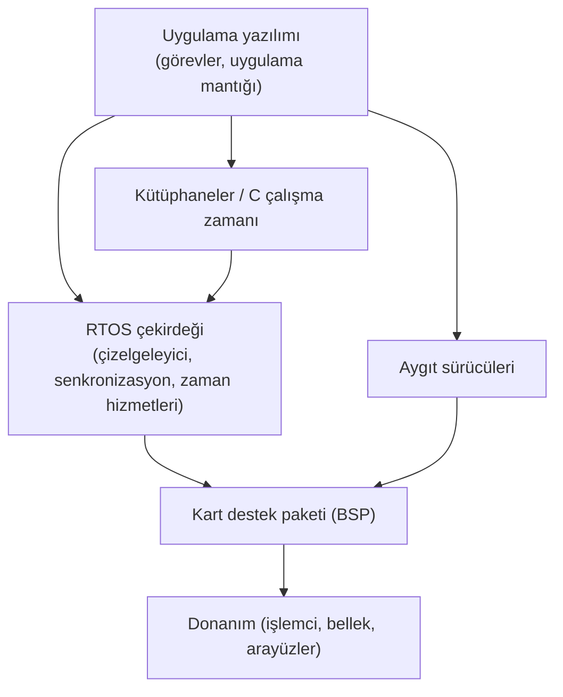
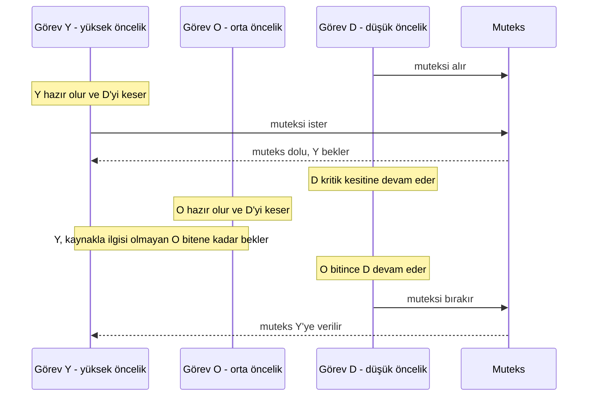

# 20. Gerçek Zamanlı İşletim Sistemleri

Gerçek zamanlı işletim sistemi (real-time operating system, RTOS), aviyonik yazılımda
görev çizelgeleme, kesme işleme ve paylaşılan kaynakların korunması için öngörülebilir
mekanizmalar sunar. Bu bölüm RTOS'u oluşturan katmanları, emniyet-kritik bir RTOS'ta
aranan nitelikleri, RTOS seçimini ve hazır çekirdeğin sertifikasyondaki konumunu,
RTOS'un mimariye etkilerini, çok çekirdekli işlemcileri ve doğrulamada projeye kalan
işleri ele alır.

## RTOS neden önemlidir?

Aviyonik bir işlevin doğru sonucu üretmesi yetmez; sonucu zamanında da üretmesi
gerekir. Geç gelen bir kontrol komutu, yanlış hesaplanmış bir komut kadar tehlikeli
olabilir. RTOS, işlemci zamanını görevler arasında paylaştıran, kesmeleri dağıtan ve
ortak kaynaklara erişimi düzenleyen katman olduğu için bu zaman davranışının
merkezinde durur.

Yine de RTOS zamanında çalışmayı tek başına güvence altına almaz. Sunduğu şey,
davranışı önceden hesaplanabilen mekanizmalardır; görevlerin zaman sınırlarını
tuttuğunu gösteren ise bu mekanizmaların üzerine kurulan tasarım ve analizdir. Bu
yüzden işletim sisteminin seçimi ve kullanım biçimi bir altyapı ayrıntısı değil,
emniyet mimarisinin parçasıdır: çekirdek, üzerinde çalışan her uygulamayla birlikte
uçar ve onun hatası bütün uygulamaların hatasıdır.

## RTOS çekirdeği ve destek yazılımları

Günlük dilde "RTOS" tek bir üründen söz eder gibi kullanılır; oysa hedef karta yüklenen
yazılım yığını birkaç ayrı katmandan oluşur ve her katmanın güvence açısından konumu
farklıdır. Projede sınırları en baştan netleştirmek gerekir; çünkü sertifikasyon
kanıtının kimin tarafından, hangi kapsamla üretileceği bu sınırlara göre belirlenir.

Tipik katmanlar şunlardır:

- **Çekirdek (kernel):** Çizelgeleyici (scheduler), görev (task) yönetimi, kesme
  dağıtımı, senkronizasyon nesneleri (semafor, kuyruk, muteks) ve zaman hizmetlerini
  sağlayan ana bileşen. RTOS tedarikçisinin ürünüdür ve çoğu zaman sertifikasyon
  paketiyle birlikte gelir.
- **Kart destek paketi (board support package, BSP):** Çekirdeği belirli bir işlemci
  kartına bağlayan başlatma kodu, saat ve kesme denetleyicisi yapılandırması, bellek
  haritası tanımları. Tedarikçi bir referans BSP verse bile, hedef karta uyarlanması
  genellikle proje ekibine düşer.
- **Aygıt sürücüleri (device driver):** ARINC 429, MIL-STD-1553, Ethernet, ayrık
  giriş/çıkış gibi arayüzleri işleten kod. Kimi sürücüler RTOS ile gelir, kimileri
  projede yazılır; kaynağı ne olursa olsun uçuşta çalışan koddur.
- **Kütüphaneler ve çalışma zamanı desteği:** C çalışma zamanı, matematik
  kütüphaneleri, derleyicinin eklediği yardımcı rutinler. Görünmez oldukları için en
  sık ihmal edilen katmandır; bağlanan her fonksiyon güvence kapsamına girer.


```mermaid
flowchart TB
    APP["Uygulama yazılımı<br/>(görevler, uygulama mantığı)"]
    LIB["Kütüphaneler / C çalışma zamanı"]
    KRN["RTOS çekirdeği<br/>(çizelgeleyici, senkronizasyon, zaman hizmetleri)"]
    DRV["Aygıt sürücüleri"]
    BSP["Kart destek paketi (BSP)"]
    HW["Donanım (işlemci, bellek, arayüzler)"]
    APP --> KRN
    APP --> LIB
    APP --> DRV
    LIB --> KRN
    KRN --> BSP
    DRV --> BSP
    BSP --> HW
```

Güvence açısından temel ilke basittir: **çalıştırılabilir nesne koduna bağlanan her
şey, üzerinde çalışan uygulamanın yazılım seviyesiyle (software level) uyumlu biçimde
doğrulanmalıdır.** Katman "hazır alındı" diye kapsam dışında kalmaz. Pratikte bu şu
anlama gelir:

| Katman | Tipik kaynak | Güvence kanıtının tipik sahibi |
|---|---|---|
| Çekirdek | RTOS tedarikçisi | Tedarikçinin sertifikasyon paketi + projenin entegrasyon doğrulaması |
| BSP | Tedarikçi şablonu + proje uyarlaması | Büyük ölçüde proje ekibi |
| Sürücüler | Karışık | Kaynağına göre; uyarlanan kısım proje ekibinde |
| Kütüphaneler | Derleyici/tedarikçi | Kullanılan alt küme için proje ekibi |

Deneyimle sabittir: sertifikasyon paketli bir çekirdek satın almak, işin yalnızca bir
bölümünü kapatır. BSP uyarlaması, projeye özgü sürücüler ve kullanılan kütüphane alt
kümesi çoğu projede tedarikçi paketinin dışında kalır ve planlama aşamasında ayrı iş
kalemleri olarak görünmelidir; aksi hâlde bu boşluk genellikle katılım aşaması (Stage
of Involvement, SOI) denetimlerinde, yani en pahalı anda fark edilir.

## Emniyet-kritik RTOS'un nitelikleri

Masaüstü veya genel amaçlı gömülü sistemlerde "iyi" sayılan bir işletim sistemi,
emniyet-kritik bir aviyonik projede kullanılamayabilir. Fark, ortalama performansta
değil, **en kötü durumun öngörülebilirliğindedir**. Emniyet-kritik bir RTOS'ta aranan
başlıca nitelikler şunlardır:

**Belirlenimci çizelgeleme (deterministic scheduling).** Her çekirdek hizmetinin en
kötü durum yürütme süresi (worst-case execution time, WCET) bilinmeli ve belgelenmiş
olmalıdır. "Genellikle 5 mikrosaniyede döner" ifadesi yeterli değildir; zamanlama
analizi ancak üst sınırlar üzerine kurulabilir. Öncelik tabanlı, kesintiye izin veren
(preemptive) çizelgeleyiciler bu alanda yaygındır; bazı mimariler ise görevleri
önceden tanımlı zaman pencerelerine yerleştiren zaman tetiklemeli (time-triggered)
çizelgeleme kullanır.

**Belirlenimci bellek yönetimi.** Çalışma sırasında serbest dinamik bellek ayırma
(dynamic memory allocation), parçalanma ve tükenme riski nedeniyle emniyet-kritik
yazılımda genellikle yasaklanır veya başlatma aşamasıyla sınırlanır. İyi bir RTOS,
sabit boyutlu blok havuzları gibi belirlenimci mekanizmalar sunar ve bellek koruma
birimini (memory protection unit, MPU) kullanarak bir görevin başka bir görevin
alanına yazmasını engelleyebilir. Bu koruma yalnızca bellek içindir; bir görevin
işlemciyi gereğinden uzun tutmasını MPU engellemez.

**Öngörülebilir kesme işleme.** Kesme gecikmesinin (interrupt latency) üst sınırı
bilinmeli, kesme servis rutinlerinin (interrupt service routine, ISR) çekirdek
hizmetleriyle etkileşimi net kurallara bağlanmış olmalıdır. Kesmelerin kapalı
tutulduğu en uzun süre, sistemin zamanlama bütçesine doğrudan girer.

**Öncelik terslenmesine (priority inversion) karşı koruma.** Düşük öncelikli bir
görevin tuttuğu kaynağı bekleyen yüksek öncelikli görev, araya giren orta öncelikli
görevler yüzünden süresiz gecikebilir. Olgun bir RTOS bunun için öncelik kalıtımı
(priority inheritance) veya öncelik tavanı (priority ceiling) protokollerini sunar.

**Gürbüz bölümleme (robust partitioning).** Aynı işlemci üzerinde farklı yazılım
seviyelerinden bileşenler barındırılacaksa, bir bölümdeki (partition) hatanın
diğerlerinin ne belleğini ne de zaman bütçesini etkileyemeyeceği gösterilmelidir.
Bu alandaki yaygın başvuru ARINC 653'tür: bölümlemeli bir işletim sistemi ile üzerinde
çalışan uygulamalar arasındaki arayüzü (application/executive, APEX) ve bölümlerin
alan ile zaman bakımından ayrılmasına dayanan çalışma modelini tanımlar. ARINC 653
tarzı işletim sistemleri, her bölüme ayrılmış bellek alanı ve garanti edilmiş zaman
pencereleri sağlar; ayrıntı [21. Yazılım Bölümlemesi](21-yazilim-bolumlemesi.md)
bölümündedir.

**Hata tespiti ve sağlık izleme (health monitoring).** Zaman aşımı, izinsiz bellek
erişimi, yığın taşması gibi olayların tespit edilmesi ve yapılandırılabilir bir
tepkiye (bölümü yeniden başlatma, güvenli duruma geçme, kaydetme) bağlanabilmesi
beklenir.

**Sertifiye edilebilirlik.** Teknik nitelikler kadar önemlisi, RTOS'un DO-178C
yaşam döngüsü verisiyle birlikte gelmesidir: gereksinimler, tasarım, kaynak kod,
doğrulama sonuçları, yapısal kapsam analizi (structural coverage analysis) kanıtı ve
izlenebilirlik (traceability). Kanıtı olmayan "hızlı ve küçük" bir çekirdek,
sertifikasyon açısından sıfırdan geliştirilen koddan farksızdır.

| Nitelik | Yokluğunda tipik belirti |
|---|---|
| Belirlenimci çizelgeleme | Yük altında ara sıra kaçırılan zaman sınırları |
| Belirlenimci bellek yönetimi | Uzun çalışmada parçalanma, öngörülemeyen ayırma hataları |
| Öngörülebilir kesme işleme | Kesme yükü arttığında geciken ya da kaçırılan olaylar |
| Öncelik terslenmesi koruması | Nadir, yeniden üretilmesi zor gecikme olayları |
| Gürbüz bölümleme | Düşük seviyeli bir bileşen hatasının kritik işlevi etkilemesi |
| Sağlık izleme | Fark edilmeden süren hata; tepkisi tanımsız arıza |
| Sertifikasyon kanıtı | SOI denetimlerinde kapatılamayan bulgular |

## RTOS seçimi

RTOS seçimi teknik bir karşılaştırma gibi görünse de aslında bir **risk yönetimi**
kararıdır: proje, çekirdeğin davranışına ilişkin kanıt üretme yükünün ne kadarını
tedarikçiye devredebilecek, ne kadarını kendi üzerine alacaktır? Seçim üç eksende
değerlendirilmelidir.

**Teknik riskler.** Önceki başlıkta sayılan nitelikler burada tek bir soruya iner:
tedarikçi en kötü durum davranışını *hedef işlemci ailesi için* sayıyla ve kanıtıyla
verebiliyor mu? Çekirdek hizmetlerinin WCET değerleri, kesmelerin kapalı kaldığı en
uzun süre, kilit bekleme sürelerinin sınırı ve öncelik terslenmesine karşı uygulanan
protokol belgelenmemişse, zamanlama analizinin girdileri eksik demektir ve bu boşluğu
proje ölçümle ve analizle kendisi kapatmak zorunda kalır.

**Sertifikasyon paketi.** DO-178C açısından hazır bir RTOS, önceden geliştirilmiş
yazılımdır (previously developed software, PDS). Katalogdan satılan ve müşteriye göre
uyarlanmayan bir ürün olduğu ölçüde ticari hazır yazılım (commercial off-the-shelf,
COTS) tanımına da girer; belirli bir uygulama için sözleşmeyle geliştirilen yazılımı
standart COTS saymaz. Hazır olması ona bir ayrıcalık kazandırmaz: çekirdek uçuşa giden
çalıştırılabilir nesne kodunun parçasıdır ve üzerinde çalışan en yüksek seviyeli
uygulamanın yazılım seviyesine ait hedefler (objective) onun için de karşılanmış
olmalıdır. Tedarikçinin sattığı sertifikasyon paketi bu kanıtın hazır üretilmiş
kısmıdır; paketin verisi hedefleri karşılamaya yetmiyorsa eksik tamamlanır. Hazır
yazılımın kullanılacağı ve uyumun nasıl sağlanacağı yazılım sertifikasyon planında
(Plan for Software Aspects of Certification, PSAC) açıklanır; çekirdeğin çözülmemiş
problem raporlarının projeye etkisi de değerlendirilir. Önceden geliştirilmiş
yazılımın genel değerlendirme yöntemi
[24. Yazılım Yeniden Kullanımı](24-yazilim-yeniden-kullanimi.md) bölümündedir.

FAA bu tür bileşenler için AC 20-148 (2004) ile yeniden kullanılabilir yazılım
bileşeni (reusable software component, RSC) yaklaşımını tanımlamıştır. Bileşenin
geliştiricisi, bir sertifikasyon projesi kapsamında bileşenin yaşam döngüsü verisi
için otoriteden kabul alır; kabul, hedeflerin bir kısmı için tam, bir kısmı için
kısmi kredi anlamına gelebilir. Sonraki projeler bu krediyi, bileşen değişmediği ve
belgelenmiş kısıtlar içinde kalındığı sürece yeniden kullanır. Yaklaşımın pratikteki
özü, tedarikçinin entegratöre verdiği iki listedir: bileşenin hangi varsayımlar
altında doğrulandığı (işlemci, derleyici ve seçenekleri, yapılandırma, kullanım
kısıtları) ve hangi işlerin entegratöre kaldığı. Bu kabulün başka otoritelerce nasıl
değerlendirileceği programa göre değişir ve otoriteyle erken konuşulmalıdır.

Paketin hedef yazılım seviyesini karşıladığı, hedef işlemciye ve kullanılan derleyici
sürümüne uygulanabilir olduğu ve projenin yapılandırmasını (etkin özellik kümesini)
kapsadığı ayrı ayrı doğrulanmalıdır. Paket dışında bırakılmış her özellik ya kapatılır
ya da proje tarafından doğrulanır. "Kullanmıyoruz ama bağlı" durumu ise yapısal kapsam
analizinde karşınıza çıkar: işlev bir gereksinime izlenebiliyor ve tasarım gereği
çalıştırılmıyorsa devre dışı bırakılmış koddur (deactivated code). Bu sınıflandırma
bedelsiz değildir: kod planlarda beyan edilir, etkin kod gibi standardın hedeflerine
uygun geliştirilmiş olması ve istem dışı çalışmasının önlendiğinin analiz ile testle
gösterilmesi gerekir. Hiçbir gereksinime izlenemeyen işlev ise gereksiz koddur
(extraneous code) ve beklenen çözüm kaldırılmasıdır. Ayrımın ölçütleri
[17. Kapsanmayan Kodlar: Ölü, Gereksiz ve Devre Dışı Bırakılmış Kodlar](17-kapsanmayan-kodlar.md)
bölümünde işlenmiştir.

**Tedarikçi değerlendirmesi.** RTOS ilişkisi tek seferlik bir satın alma değil,
programın ömrü boyunca süren bir bağımlılıktır. Tedarikçinin hata bildirim ve
düzeltme süreci, sürüm politikası, daha önce hangi projelerde ve hangi otoritelerle
sertifikasyon geçirdiği, araç kalifikasyonu (tool qualification) gereken yardımcı
araçlar sunup sunmadığı ve uzun vadeli destek taahhüdü sorgulanmalıdır. Kaynak koda
ve problem raporu geçmişine erişim koşulları sözleşmede netleşmelidir; bir
tedarikçinin bilinen hata listesini paylaşma biçimi, çoğu zaman teknik broşüründen
daha öğreticidir.

| Eksen | Anahtar soru | Zayıflığın bedeli |
|---|---|---|
| Teknik | En kötü durum davranışı kanıtlanabilir mi? | Zamanlama analizinin çökmesi, geç keşfedilen tasarım değişikliği |
| Sertifikasyon paketi | Veri, bizim seviye/işlemci/yapılandırmamızı kapsıyor mu? | Boşlukları projenin doldurması; plan dışı doğrulama işi |
| Tedarikçi | Program ömrü boyunca destek sürecek mi? | Sürüm kilitlenmesi, hata düzeltmelerine erişememe |

Pratik bir uyarı: değerlendirmeyi yalnızca veri sayfaları üzerinden yapmayın. Hedef
karta yakın bir ortamda küçük bir deneme uygulaması koşturmak, broşürde görünmeyen
davranışları erken ortaya çıkarır. Değerlendirmede sorulacak soruların tam listesi ve
deneme uygulamasının kapsamı
[Ek C](../06-ekler/03-ek-c-rtos-secim-sorulari.md) içindedir.

## Mimari etkiler

RTOS seçildikten sonra asıl iş, onun üzerine analiz edilebilir bir yapı kurmaktır.
Çekirdek pek çok hizmet sunar; emniyet-kritik bir tasarım bunların küçük ve
öngörülebilir bir alt kümesiyle yetinir. Aşağıdaki kararlar tasarım tanımında yer alır
ve tasarım gözden geçirmesinin konusudur
([7. Yazılım Tasarımı](../03-do178c-ile-gelistirme/07-yazilim-tasarimi.md)).

### Görev modeli ve öncelik atama

İşlevleri görevlere ayırmanın ölçütü kod düzeni değil, zaman davranışıdır: aynı
periyotla çalışan ve aynı zaman sınırına bağlı işler tek görevde toplanır, farklı
hızlar ayrı görevlere dağıtılır. Görev sayısı arttıkça bağlam değiştirme (context
switch) yükü ve analiz edilecek etkileşim sayısı da artar; bu yüzden görev sayısı
gerektiği kadar tutulur. Her görev için periyot, zaman sınırı, öncelik, yürütme süresi
bütçesi ve yığın (stack) boyutu tasarım verisinde tablo hâlinde verilir; zamanlama
analizi bu tabloyu girdi alır.

Sabit öncelikli çizelgelemede yaygın kural hız-monoton (rate-monotonic) atamadır:
periyodu kısa olan görev daha yüksek öncelik alır. Sık yapılan hata, önceliği işlevin
önemine göre vermektir; öncelik bir önem sıralaması değil, zaman sınırlarını tutturma
aracıdır. Kritik ama yavaş bir görevin emniyeti yüksek öncelikle değil, zaman
sınırının analizle gösterilmesi ve gerekiyorsa bölümlemeyle sağlanır. Periyodik
olmayan olaylar, ardışık iki olay arasındaki en kısa süre sınırlandırılarak modele
katılır; sınırı bilinmeyen bir olay kaynağı analiz edilemez. Görevler, kuyruklar ve
muteksler başlatma sırasında bir kez yaratılır; çalışma sırasında görev yaratmak ya da
öncelik değiştirmek analizin dayandığı modeli bozar.

### Kesme ile görev arasındaki iş bölümü

Kesme servis rutini yalnızca ertelenemeyecek işi yapar: veriyi alır, kesme kaynağını
temizler ve işlemeyi yapacak görevi uyandırır. Uzun süren işlem görev düzeyine
taşındığında hem çizelgeleyicinin öncelik kurallarına tabi olur hem de olağan
yöntemlerle test edilebilir. Kesme bağlamında yalnızca beklemeyen (non-blocking)
çekirdek çağrılarına izin verilir; hangi çağrıların kesme içinden yapılabileceği
RTOS belgesinden alınıp tasarım standardına yazılır. Kesme ile görev arasında
paylaşılan veri muteksle korunamaz, çünkü kesme rutini bekleyemez; bunun yerine
kuyruk ya da kesmelerin çok kısa süreyle kapatıldığı bir kritik kesit (critical
section) kullanılır ve bu süre zamanlama bütçesine eklenir.

### Paylaşılan verinin korunması

Görevler arasında paylaşılan çok alanlı bir veri korunmazsa, okuyan görev yarısı eski
yarısı yeni bir değer görebilir. Koruma için muteks kullanıldığında ise öncelik
terslenmesi gündeme gelir. Aşağıdaki akışta D düşük, O orta, Y yüksek öncelikli
görevdir:


```mermaid
sequenceDiagram
    participant Y as Görev Y - yüksek öncelik
    participant O as Görev O - orta öncelik
    participant D as Görev D - düşük öncelik
    participant M as Muteks
    D->>M: muteksi alır
    Note over Y: Y hazır olur ve D'yi keser
    Y->>M: muteksi ister
    M-->>Y: muteks dolu, Y bekler
    Note over D: D kritik kesitine devam eder
    Note over O: O hazır olur ve D'yi keser
    Note over Y,O: Y, kaynakla ilgisi olmayan O bitene kadar bekler
    Note over D: O bitince D devam eder
    D->>M: muteksi bırakır
    M-->>Y: muteks Y'ye verilir
```

Y'nin gecikmesi D'nin kısa kritik kesitiyle değil, O'nun ne kadar çalışacağıyla
belirlenir; yani üst sınırı yoktur. Öncelik kalıtımında D, Y beklemeye başladığı anda
Y'nin önceliğine yükseltilir; O araya giremez ve Y'nin beklemesi D'nin kritik kesitinin
uzunluğuyla sınırlanır. Bu sınır, zamanlama analizinde engellenme süresi (blocking
time) olarak hesaba girer.

Aşağıdaki örnek, iki görevin paylaştığı hava verisinin öncelik kalıtımlı bir muteksle
okunmasını gösterir. `os_` önekli çağrılar örnek için uydurulmuş bir çekirdek
arayüzüdür:

```c
#include <stdbool.h>
#include <stddef.h>
#include <stdint.h>

#define HAVA_VERISI_KILIT_SURESI_MS (2U)

typedef struct {
    int32_t  irtifa_ft;
    int32_t  dikey_hiz_fpm;
    uint32_t zaman_damgasi_ms;
} hava_verisi_t;

static hava_verisi_t g_hava_verisi;          /* iki görev paylaşır     */
static os_muteks_t   g_hava_verisi_muteksi;  /* öncelik kalıtımı etkin */

bool hava_verisi_oku(hava_verisi_t *hedef)
{
    bool basarili = false;

    if (hedef != NULL) {
        if (os_muteks_al(&g_hava_verisi_muteksi,
                         HAVA_VERISI_KILIT_SURESI_MS) == OS_TAMAM) {
            *hedef = g_hava_verisi;   /* üç alan tek tutarlı kopya olarak alınır */
            if (os_muteks_birak(&g_hava_verisi_muteksi) == OS_TAMAM) {
                basarili = true;
            } else {
                saglik_izleme_bildir(HATA_MUTEKS_BIRAKMA);
            }
        } else {
            saglik_izleme_bildir(HATA_MUTEKS_ZAMAN_ASIMI);
        }
    }

    return basarili;
}
```

Örnekte üç tasarım kuralı görülür. Bekleme süresiz değildir; zaman aşımı, muteksin
tutulabileceği en uzun kritik kesitten türetilmiş adlandırılmış bir sabittir. Çekirdek
çağrılarının dönüş değeri her seferinde denetlenir ve başarısızlık sessizce
yutulmaz, sağlık izlemeye bildirilir. Kritik kesit yalnızca kopyalamayı içerir;
hesaplama, giriş/çıkış ya da başka bir çekirdek çağrısı kilidin dışında kalır. Birden
çok muteksin iç içe alınması gerekiyorsa, kilitlenmeyi (deadlock) dışlamak için bütün
görevlerin uyduğu tek bir alma sırası tanımlanır.

### İzin verilen çekirdek hizmetleri ve soyutlama katmanı

Tasarım standardı, RTOS'un hangi hizmetlerinin hangi koşulla kullanılabileceğini
açıkça listelemelidir: izin verilen senkronizasyon nesneleri, süresiz beklemenin
yasak olması, başlatma sonrasında nesne yaratılmaması, kesme içinden yapılabilecek
çağrılar. Bu liste iki işe yarar: gözden geçirmede denetlenebilir bir ölçüt verir ve
kullanılan hizmetlerin sertifikasyon paketinin kapsadığı yapılandırmanın içinde
kalmasını sağlar.

Uygulamanın çekirdek arayüzünü doğrudan çağırması yerine ince bir soyutlama katmanı
üzerinden çağırması, hem bu kısıtları tek noktada zorlar hem de RTOS değiştiğinde
etkilenen kodu sınırlar; örneği, uyarlama katmanı (adaptation layer) adıyla
[24. Yazılım Yeniden Kullanımı](24-yazilim-yeniden-kullanimi.md) bölümünde
verilmiştir. Katmanın kendisi de uçuş yazılımıdır: gereksinimi, tasarımı ve testi
vardır. Ayrıca zaman davranışını gizlememelidir; bir sarmalayıcı çağrının bekleyip
beklemeyeceği ve en kötü durum süresi arayüzünde yazılı olmalıdır.

## Çok çekirdekli işlemciler

Buraya kadar anlatılan zamanlama mantığı, bir anda tek bir yazılım parçasının
çalıştığı tek çekirdekli işlemciyi varsayar. Çok çekirdekli işlemcide (multi-core
processor) işlemci çekirdekleri önbellek, bellek denetleyicisi ve veri yolu gibi
kaynakları paylaşır; bir çekirdekte çalışan yazılım, başka bir çekirdekteki yazılımın
yürütme süresini bu kaynaklar üzerinden uzatabilir. Bu etki yollarına girişim kanalları
(interference channels) denir. Sonuçları iki yönlüdür: tek çekirdekte ölçülmüş bir WCET
değeri çok çekirdekli hedefe taşınamaz ve alan ile zaman bölümlemesi, yazılımlar
gerçekten eşzamanlı çalıştığı için yeniden gösterilmek zorundadır.

Otoritelerin beklentisi FAA AC 20-193 (2024) ve EASA AMC 20-193 (2022)
belgelerindedir; bu belgeler daha önce başvurulan CAST-32A görüş belgesinin yerini
almıştır. Beklentinin özü, girişim kanallarının belirlenmesi, her birinin ya
kapatılması ya da etkisinin sınırlandırılması ve zamanlama kanıtının bu etki altında
üretilmesidir. RTOS burada
belirleyicidir: görevlerin ya da bölümlerin işlemci çekirdeklerine nasıl atandığı,
kullanılmayan çekirdeklerin kapalı tutulup tutulmadığı ve paylaşılan kaynak
kullanımını sınırlayan mekanizmalar çekirdeğin sunduklarına bağlıdır. Seçim sırasında
tedarikçiden, sertifikasyon paketinin hangi çok çekirdekli yapılandırmayı kapsadığını
ve hangi girişim analizinin entegratöre kaldığını açıkça söylemesi istenmelidir.
Konunun risk başlıkları [Ek B](../06-ekler/02-ek-b-rtos-endise-alanlari.md) içinde
toplanmıştır.

## Doğrulama açısından bakış

Bir görev doğru çıktıyı yanlış zamanda üretiyorsa sistem davranışı hatalıdır; bu
yüzden RTOS kullanan bir projede zaman davranışı işlev kadar doğrulanır. Zamanlama
hataları nadir yük kombinasyonlarında ortaya çıktığı için testin yakalama olasılığı
düşüktür; kanıtın omurgasını analiz oluşturur, test ve ölçüm onu destekler.

**Çizelgelenebilirlik analizi (schedulability analysis).** Görev tablosundaki periyot,
zaman sınırı ve öncelik bilgisi; her görevin WCET değeri, en uzun kritik kesitten
gelen engellenme süresi, çekirdek hizmetlerinin ve bağlam değiştirmenin süresi ve
kesme yükü ile birleştirilerek her görevin en kötü tepki süresi hesaplanır. Sonuç,
zaman sınırıyla karşılaştırılır ve kalan pay raporlanır. Tedarikçinin verdiği çekirdek
süreleri yalnızca paketin kapsadığı işlemci ve yapılandırma için geçerlidir.

**WCET ve yığın analizi.** İkisi de yalnız testle gösterilemez; analiz gerekir ve
ölçümle desteklenir. DO-178C ikisini de kaynak kodun doğruluğu ve tutarlılığı
incelenirken bakılan konular arasında sayar, derleyici ve bağlayıcı seçenekleri ile
kimi donanım özelliklerinin en kötü durum süresine etkisinin değerlendirilmesini ister
ve gözden geçirme, analiz ve testin birlikte kullanılabileceğini belirtir. Ulaşılan
zamanlama ve bellek payları yazılım başarı özetinde (Software Accomplishment Summary,
SAS) bildirilir. RTOS'a özgü nokta yığının görev başına ayrılmasıdır: her görevin
yığını kendi en derin çağrı zincirine göre boyutlandırılır ve kesmelerin hangi yığını
kullandığı (ayrı bir kesme yığını mı, kesilen görevin yığını mı) hesaba katılır.
Yöntemler [9. Yazılım Doğrulama](../03-do178c-ile-gelistirme/09-yazilim-dogrulama.md)
bölümünde anlatılmıştır.

**Hedefte ölçüm.** Tepki süreleri, titreşim (jitter), kesmelerin kapalı kaldığı en
uzun süre ve yığın kullanımının ulaştığı en yüksek düzey hedef donanımda ölçülür.
Ölçüm analizin yerine geçmez; analizin varsayımlarını sınar ve analizle ölçüm
arasındaki açıklanamayan fark bir bulgu olarak ele alınır.

**Gürbüzlük (robustness) testleri.** Uygulamanın çekirdek hata dönüşlerine tepkisi
gereksinim tabanlı testlerle gösterilir: zaman aşımına uğrayan muteks, dolu kuyruk,
süresini aşan görev. Sağlık izleme için de aynısı geçerlidir; yığın taşması, izinsiz
bellek erişimi ve zaman sınırı aşımı bilinçli olarak tetiklenir ve
yapılandırılmış tepkinin gerçekten verildiği gözlenir. Tepkisi hiç denenmemiş bir
sağlık izleme tablosu, kâğıt üzerindeki bir emniyet mekanizmasıdır.

Kanıtın hangi kısmının tedarikçi paketinden geldiği, hangisinin projede üretildiği
doğrulama planında açıkça ayrılmalıdır:

| Konu | Tedarikçi paketinden gelen | Projenin ürettiği |
|---|---|---|
| Çekirdek hizmetlerinin işlevi | Çekirdek gereksinimlerine dayalı test ve yapısal kapsam sonuçları | Paketin geçerlilik koşullarının (işlemci, derleyici, yapılandırma) sağlandığının gösterimi; entegrasyon testleri |
| Zamanlama | Çekirdek hizmetlerinin ve kesme kapalı süresinin üst sınırları | Görev WCET değerleri, çizelgelenebilirlik analizi, hedefte ölçüm |
| Bellek | Çekirdeğin kendi bellek ve yığın ihtiyacı | Görev yığınlarının analizi, bellek haritası, MPU yapılandırmasının doğrulanması |
| Hata davranışı | Çekirdek hata dönüşlerinin tanımı ve testi | Uygulamanın bu dönüşlere tepkisinin ve sağlık izleme tepkilerinin testi |
| BSP, sürücüler, kütüphane alt kümesi | Varsa referans uygulama | Gereksinimden yapısal kapsama kadar bütün yaşam döngüsü verisi |

Kullanım sırasında izlenecek risk alanları ve her biri için sorulacak sorular
[Ek B](../06-ekler/02-ek-b-rtos-endise-alanlari.md) içindedir.

## Bu bölümden akılda kalması gerekenler

- RTOS zamanında çalışmayı güvence altına almaz; öngörülebilir mekanizmalar sunar.
  Zaman sınırlarının tutulduğunu gösteren, bu mekanizmalar üzerine kurulan tasarım ve
  analizdir.
- Çekirdek, BSP, sürücüler ve kütüphaneler ayrı katmanlardır; bağlanan her katman
  güvence kapsamına girer ve kanıt sahipliği en baştan netleşmelidir.
- Emniyet-kritik bir RTOS'un ölçüsü ortalama performans değil, en kötü durumun
  öngörülebilirliğidir: belirlenimci çizelgeleme, belirlenimci bellek yönetimi,
  sınırlı kesme gecikmesi, öncelik terslenmesine karşı koruma ve gürbüz bölümleme.
- RTOS seçimi bir risk yönetimi kararıdır: teknik nitelik, sertifikasyon paketinin
  kapsamı ve tedarikçinin uzun vadeli desteği birlikte değerlendirilir.
- Hazır RTOS önceden geliştirilmiş yazılımdır; sertifikasyon paketi ancak projenin
  seviyesini, işlemcisini, derleyicisini ve yapılandırmasını kapsadığı ölçüde kredi
  sağlar, gerisi entegratörün işidir.
- Mimari, çekirdek hizmetlerinin kısıtlı bir alt kümesine dayanır: başlatmada
  yaratılan görevler, işlevin önemine göre değil periyoda göre atanan öncelikler,
  kısa kesme rutinleri,
  zaman aşımlı ve öncelik kalıtımlı kilitler. Bu kurallar tasarım standardına yazılır.
- Zaman davranışının kanıtı analize dayanır, ölçüm onu destekler: çizelgelenebilirlik,
  WCET ve görev başına yığın analizi projenin işidir. Çok çekirdekli hedefte bu
  analizler girişim kanalları belirlenip sınırlandırılmadan savunulamaz.
