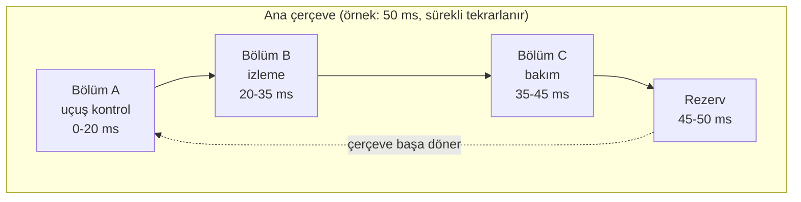

# 21. Yazılım Bölümlemesi

Yazılım bölümlemesi, farklı güvence düzeyindeki işlevlerin birbirini etkilemesini
sınırlandırır. Bu izolasyon zaman, bellek ya da çalışma alanı bazlı olabilir.

Amaç, bir alt sistemdeki hatanın diğerini tehlikeye atmamasını göstermektir. Bu da
mimari kararların doğrulama ile birlikte düşünülmesini gerektirir.

## Bölümleme neden gerekir?

Aynı platform üzerinde farklı güvence seviyesindeki işlevler birlikte çalışabilir.
Ancak bu durum, düşük güvence düzeyindeki bir hatanın kritik işlevi etkilemeyeceğinin
gösterilmesini gerektirir. Bölümleme tam olarak bu sınırı sağlar.

## Bölümleme türleri

- zaman bazlı,
- bellek bazlı,
- çalışma alanı bazlı,
- kaynak erişimi bazlı.

Hangi türün kullanılacağı mimari ihtiyaç ve platform yeteneklerine bağlıdır.

## Alan ve zaman bölümlemesi

Uygulamada bölümleme iki temel eksende düşünülür: alan bölümlemesi (spatial
partitioning) ve zaman bölümlemesi (temporal partitioning). İlki "bir bölüm,
diğerinin belleğini bozamaz" güvencesini, ikincisi "bir bölüm, diğerinin işlemci
zamanını çalamaz" güvencesini hedefler. Çoğu gerçek sistemde ikisi birlikte
uygulanır; yalnızca birinin sağlanması, paylaşılan platformda yeterli izolasyon
vermez.

### Alan bölümlemesi

Alan bölümlemesi, paylaşılan bellek üzerinde her bölüme kendi adres alanını ayırır
ve bu sınırın donanım tarafından zorlanmasını sağlar. Tipik mekanizmalar şunlardır:

- **Bellek yönetim birimi (memory management unit, MMU)** veya **bellek koruma
  birimi (memory protection unit, MPU)**: Her bölüm için erişilebilir adres
  aralıklarını ve erişim haklarını (oku/yaz/çalıştır) tanımlar. Sınır dışı bir
  erişim, donanım istisnası (exception) üretir ve çekirdek tarafından yakalanır.
- **Ayrıcalık seviyeleri**: Uygulama bölümleri kullanıcı kipinde (user mode)
  çalışır; MMU/MPU yapılandırmasını yalnızca çekirdek kipindeki (kernel mode)
  bölümleme çekirdeği değiştirebilir. Aksi hâlde bir bölüm kendi sınırlarını
  genişletebilirdi.
- **Yazma korumalı paylaşım**: İki bölümün aynı veriyi okuması gerekiyorsa, alan
  salt okunur olarak her ikisine eşlenir; yazma hakkı yalnızca üretici bölümde
  kalır.

Alan bölümlemesi yalnızca RAM ile sınırlı değildir; kalıcı bellek (non-volatile
memory) bölgeleri, bellek eşlemli (memory-mapped) çevre birimi yazmaçları ve
yığın/öbek (stack/heap) taşmaları da aynı analiz kapsamına girer. Bir bölümün
kendi yığınını taşırıp komşu bölgeye yazması, klasik bir alan bölümlemesi ihlalidir.

### Zaman bölümlemesi

Zaman bölümlemesi, paylaşılan işlemciyi bölümlere öngörülebilir dilimler hâlinde
tahsis eder. En yaygın yaklaşım, sabit çevrimli zaman çizelgelemesidir: ana çerçeve
(major frame) sabit uzunluktadır ve içindeki zaman pencereleri bölümlere statik
olarak atanır. ARINC 653 tarzı entegre modüler aviyonik (integrated modular
avionics, IMA) platformlarında bu çizelge, çalışma zamanında değiştirilemeyen bir
konfigürasyon verisidir.

Zaman bölümlemesinin sağlaması gereken güvenceler şunlardır:

- Bir bölüm kendi penceresini aşarsa (örneğin sonsuz döngüye girerse) çekirdek,
  donanım zamanlayıcısıyla o bölümü keser ve sıradaki pencereye geçer; taşma diğer
  bölümlerin dilimini kısaltamaz.
- Pencere geçişindeki bağlam değiştirme (context switch) süresi çizelgede hesaba
  katılır; aksi hâlde kâğıt üzerindeki dilimler pratikte erir.
- Kritik bölümün penceresi, o bölümün en kötü durum yürütme süresi (worst-case
  execution time, WCET) analiziyle boyutlandırılır.

### Paylaşılan giriş/çıkışın yönetimi

Bellek ve işlemci bölünse bile giriş/çıkış (I/O) kaynakları — veri yolları,
UART'lar, ayrık hatlar — çoğu zaman ortaktır ve bölümleme analizinin en çok ihmal
edilen parçasıdır. Yaygın çözümler:

| Yaklaşım | Açıklama | Dikkat edilecek nokta |
|---|---|---|
| I/O sahipliği | Her çevre birimi tek bir bölüme atanır | Diğer bölümlerin yazmaçlara eşlenmiş adreslere erişimi MMU ile kapatılmalı |
| Sunucu bölüm | Ortak I/O'yu tek bir sürücü bölümü yönetir, diğerleri mesajla ister | Sunucu bölümün güvence düzeyi, hizmet verdiği en kritik bölüme göre belirlenir |
| Zaman dilimli erişim | Veri yoluna erişim, bölüm pencereleriyle hizalanır | Pencere dışına sarkan DMA aktarımları ayrıca analiz edilmeli |

Deneyimde en sık görülen hata, çevre birimi yazmaçlarının "kimse oraya yazmaz
nasılsa" varsayımıyla korumasız bırakılmasıdır. Bölümleme kanıtı varsayıma değil,
donanımın zorladığı sınıra dayanmalıdır.

## Bölümlemeyi zorlaştıran konular

MMU ve zaman çizelgesi kurulduğunda bölümleme bitmiş görünür; oysa asıl zorluk,
bu iki mekanizmanın etrafından dolaşabilen donanım ve yazılım yollarındadır.
Bölümleme analizi (partitioning analysis) tam da bu yolları tek tek bulup
kapatıldığını göstermek zorundadır.

### Doğrudan bellek erişimi (DMA)

Doğrudan bellek erişimi (direct memory access, DMA) denetleyicileri, işlemciyi
atlayarak belleğe yazar; dolayısıyla MMU'nun bölüm sınırları çoğu donanımda DMA
aktarımlarına uygulanmaz. Yanlış programlanmış tek bir DMA tanımlayıcısı, kritik
bölümün belleğinin üzerine yazabilir. Alınabilecek önlemler:

- DMA'yı yalnızca çekirdeğin veya tek bir güvenilir sürücü bölümünün
  programlayabilmesi; uygulama bölümlerinin DMA yazmaçlarına erişiminin MMU ile
  kapatılması,
- varsa I/O MMU (IOMMU) benzeri bir donanımla DMA hedef adreslerinin de
  sınırlandırılması,
- DMA hedef aralıklarının, bölüm bellek haritasına karşı çekirdek tarafından
  çalışma zamanında doğrulanması,
- DMA aktarım süresinin veri yolu üzerinde yarattığı gecikmenin (bus contention)
  WCET analizine dâhil edilmesi — DMA yalnızca alan değil, zaman bölümlemesini
  de etkiler.

### Önbellek

Önbellek (cache) iki yönden sorun çıkarır. Birincisi zamanlamadır: bir bölüm
çalışırken paylaşılan önbelleği kendi verisiyle doldurur; sıradaki bölüm, soğuk
önbellekle başladığı için yürütme süresi bölüm geçişlerine bağlı hâle gelir. Bu,
"bir bölümün davranışı diğerinin zamanlamasını etkileyemez" iddiasını doğrudan
zedeler. İkincisi tutarlılıktır: önbellek ile ana bellek arasındaki geri yazma
(write-back) anları, bölümler arası paylaşılan alanlarda bayat veri okunmasına yol
açabilir. Pratik yaklaşımlar:

- bölüm geçişinde önbelleğin boşaltılması (flush/invalidate) — deterministik ama
  performans maliyeti çizelgeye eklenmelidir,
- önbelleğin yollara/kümelere bölünerek (cache partitioning) bölümlere ayrılması,
- WCET analizinde önbelleğin tamamen soğuk kabul edilmesi gibi kötümser ama
  savunulabilir varsayımlar,
- paylaşılan tamponların önbelleksiz (non-cacheable) bölgelere yerleştirilmesi.

### Kesmeler

Kesmeler (interrupt) zaman bölümlemesinin doğal düşmanıdır: hangi bölüm çalışırsa
çalışsın, kesme geldiğinde işlemci kesme hizmet yordamına dallanır ve o bölümün
zaman dilimini tüketir. Sık gelen ya da beklenmedik bir kesme fırtınası, kritik
bölümün penceresini eritebilir. Tipik önlemler; bölüm penceresi başına kesme
kaynaklarının maskelenmesi, kesme hizmet yordamlarının çekirdekte kısa tutulup
işin bölüm bağlamına ertelenmesi ve kesme sıklığına donanımsal ya da yazılımsal
üst sınır konmasıdır. Analizde her kesme kaynağının en kötü durum sıklığı ve
hizmet süresi, etkilediği bölümlerin bütçesine eklenmelidir.

### Bölümler arası haberleşme

Bölümler tamamen izole edilirse sistem işlevini yerine getiremez; bir biçimde veri
alışverişi gerekir. Haberleşme kanalı ise, tanımı gereği izolasyon duvarında açılan
kontrollü bir kapıdır ve yanlış tasarlanırsa hata yayılım yolu olur:

- Kanallar konfigürasyonla **statik** tanımlanmalı; çalışma zamanında yeni kanal
  açılamamalıdır.
- Veri, alan bölümlemesini korumak için çekirdek denetiminde kopyalanmalı ya da
  tek yönlü, salt okunur eşlenmiş tamponlar kullanılmalıdır.
- Alıcı bölüm, gelen veriyi **güvenilmez girdi** gibi ele almalıdır: düşük güvence
  düzeyindeki bir bölümden gelen bozuk değer, kritik bölümde aralık ve tutarlılık
  kontrolünden geçmeden kullanılmamalıdır.
- Bloklayan alma/gönderme çağrıları, bir bölümün diğerini bekleterek zaman
  bölümlemesini dolaylı yoldan bozmasına izin vermemelidir (zaman aşımı zorunlu).

| Unsur | Tehdit ettiği eksen | Tipik önlem |
|---|---|---|
| DMA | Alan + zaman | DMA erişiminin çekirdekte toplanması, hedef adres doğrulama |
| Önbellek | Zaman (ve tutarlılık) | Geçişte boşaltma, önbellek bölümleme, kötümser WCET |
| Kesmeler | Zaman | Pencere bazlı maskeleme, kısa hizmet yordamı, sıklık sınırı |
| Bölümler arası haberleşme | Alan + zaman | Statik kanallar, çekirdek denetimli kopya, zaman aşımı, girdi doğrulama |

Bu unsurların ortak özelliği, tek tek bakıldığında zararsız görünmeleridir;
bölümleme ihlalleri genellikle iki mekanizmanın kesişiminde (örneğin pencere
sınırını aşan bir DMA aktarımı) ortaya çıkar. Bu yüzden bölümleme analizi, mekanizma
listesi değil, etkileşim matrisi üzerinden yürütülmelidir.

## Doğrulama açısından

Bölümleme yalnızca tasarım metniyle değil, test ve analiz ile gösterilmelidir. Çünkü
izolasyonun gerçekten çalıştığını görmek gerekir.

### Bölümleme örneği

Bir bakım ekranı ile uçuş kontrol fonksiyonu aynı platformda çalışabilir; fakat
bölümleme sayesinde bakım tarafındaki hata, kontrol döngüsünü etkilememelidir.

## Riskler

- yanlış konfigürasyon,
- kaynak sızıntısı,
- zaman paylaşımlarının bozulması,
- sınırların test edilmemesi.

## Bu bölümden akılda kalması gerekenler

- Bölümleme, etkileşimi sınırlayan mimari önlemdir; alan ve zaman eksenleri
  birlikte sağlanmadıkça paylaşılan platformda izolasyon eksik kalır.
- Alan bölümlemesi MMU/MPU gibi donanım zorlamasına, zaman bölümlemesi
  öngörülebilir ve statik bir çizelgeye dayanmalıdır; varsayım kanıt değildir.
- Paylaşılan giriş/çıkış, DMA, önbellek ve kesmeler bölümleme sınırlarının
  etrafından dolaşabilen yollardır; analizde tek tek ele alınmalıdır.
- Bölümler arası haberleşme kanalları statik tanımlanmalı, gelen veri güvenilmez
  girdi gibi doğrulanmalı ve bekleme zaman aşımıyla sınırlanmalıdır.
- İzolasyonun gerçekten çalıştığı test ve analizle kanıtlanmalıdır; ihlaller
  çoğunlukla mekanizmaların kesişiminde ortaya çıkar.
- Kritik ve kritik olmayan işlevler arasında net sınır gerekir.
