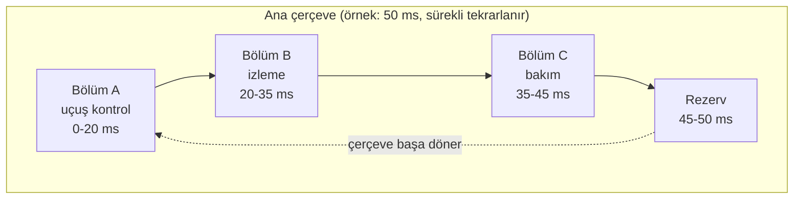

# 21. Yazılım Bölümlemesi

Yazılım bölümlemesi (software partitioning), aynı donanımı paylaşan yazılım
bileşenlerini birbirinden yalıtarak birindeki hatanın diğerlerine yayılmasını önleyen
mimari tekniktir. Bu bölüm alan ve zaman bölümlemesini, DO-178C'nin bölümlemeden
beklediklerini, yalıtımın etrafından dolaşan donanım ve yazılım yollarını ve bölümleme
iddiasının nasıl doğrulanacağını ele alır.

Amaç yalnızca bir sınır çizmek değil, o sınırın her koşulda korunduğunu göstermektir;
bu yüzden bölümleme kararları, doğrulama yöntemiyle birlikte düşünülür. Yalıtılan her
bileşene bölüm (partition) denir. Bu sayfada "bölüm" sözcüğü bu anlamda kullanılır;
kitabın bölümleri numarası ve başlığıyla anılır.

## Bölümleme neden gerekir?

Aynı işlemci üzerinde farklı yazılım seviyelerinden (software level) işlevler birlikte
çalışabilir. Sayfa boyunca şu örneği kullanacağız: tek bir işlemci kartında uçuş
kontrol işlevi (Seviye A), onun durum verisini kaydedip bozulma eğilimini bildiren bir
durum izleme işlevi (Seviye C) ve yalnızca yerde kullanılan bir bakım ekranı (Seviye D)
çalışmaktadır. Bakım yazılımındaki bir hata — bozuk bir işaretçi, sonsuz bir döngü,
veri yolunu dolduran bir ileti seli — kontrol döngüsünü etkilememelidir. Bu
gösterilemezse üç bileşen tek bir bileşen gibi ele alınır ve hepsi aralarındaki en
yüksek seviyeyle, yani Seviye A olarak geliştirilmek zorundadır; bölümlemenin seviye
atamasına etkisi
[3. Sistem Emniyet Değerlendirmesi Bağlamında Yazılım](../02-baglam/03-sistem-emniyet-degerlendirmesi-baglaminda-yazilim.md)
bölümünde anlatılmıştır.

Örnekteki izleme işlevi, DO-178C'nin ayrı bir mimari yaklaşım olarak andığı emniyet
izleme (safety monitoring) değildir. İzlediği işlevin arıza durumuna karşı koruma
sağlayan bir izleyici, o işlevin en ağır arıza durumunun gerektirdiği yazılım
seviyesini alır ve izlediği işlevi bozan arızayla birlikte devre dışı kalmayacak kadar
ondan bağımsız olmak zorundadır. Uçuş kontrolü koruyan bir izleyici bu yüzden Seviye C
olamazdı; aynı kartı paylaşması da ayrıca savunulmak zorunda kalırdı.

Aynı sonuca fiziksel ayrımla, yani her işlevi kendi işlemcisine ve donanımına
yerleştirerek de ulaşılabilir; o zaman yalıtımı donanım sınırı sağlar. DO-178C bu yolu
da bölümleme sayar ve aşağıdaki beklentileri yöntem hangisi olursa olsun arar. Bu
bölümün konusu, ayrımın paylaşılan donanım üzerinde işlemci mekanizmaları ve yazılımla
kurulmasıdır. Kazancı donanımın paylaşılması, bedeli ise yalıtımın kanıtlanması gereken
bir iddiaya dönüşmesidir.

Bölümlerden biri nasıl davranırsa davransın — tasarım hatası içersin ya da kendisine
özgü donanım arızalansın — diğerlerinin etkilenmediği gösterilebilen bölümlemeye
gürbüz bölümleme (robust partitioning) denir. Terim DO-178C'de geçmez; aşağıda anılan
ARINC 653 ve DO-297 çevresinde yerleşmiştir. Sertifikasyonda dayanak yapılabilen
budur: "normal çalışmada birbirlerine karışmıyorlar" gözlemi bölümleme kanıtı sayılmaz.

Bölümleme yalnızca seviyeleri ayırmak için kullanılmaz; değiştirilemeyen bileşeni
kullanıcının değiştirebildiği yazılımdan korumanın da yaygın yollarından biridir (bkz.
[19. Kullanıcı Tarafından Değiştirilebilir Yazılım](./19-kullanici-tarafindan-degistirilebilir-yazilim.md)).

### DO-178C bölümlemeden ne bekler?

DO-178C bölümlemeyi, sistemle ilişkiyi anlatırken andığı üç mimari yaklaşımdan biri
olarak ele alır; diğer ikisi çok sürümlü benzemez yazılım (multiple-version dissimilar
software) ve emniyet izlemedir. Belirli bir mekanizma dayatmaz, bu yaklaşımları tercih
edilen ya da zorunlu çözüm olarak da sunmaz; neyin gösterilmesi gerektiğini söyler.
Bu beklentileri, neyin korunduğuna göre dört soruda toplamak mümkündür:

| Soru | Gösterilmesi gereken | Tipik kanıt |
|---|---|---|
| Bir bölüm komşusunun belleğine ya da giriş/çıkışına dokunabilir mi? | Her bölümün kodu, veri alanları ve giriş/çıkışı komşularının bozamayacağı biçimde korunur | Bellek koruma ayarlarının gözden geçirilmesi; izinsiz erişimin reddedildiğini gösteren testler |
| Bir bölüm komşusunun işlemci zamanını yiyebilir mi? | Ortak işlemci kaynakları bir bölümce ancak çizelgede ona ayrılan yürütme süresi içinde tüketilir | Çizelge tablosunun analizi; süresini aşan bölümün kesildiğini gösteren testler |
| Bir bölüme özgü donanım bozulursa etki yayılır mı? | Yalnızca bir bölümün kullandığı donanım arızalandığında olumsuz etki o bölümle sınırlı kalır | Emniyet analizi; arıza enjeksiyonu testleri |
| Korumayı sağlayan mekanizmaya ne kadar güvenilebilir? | Koruma yazılımla sağlanıyorsa o yazılım en az korunan bölümlerin en yüksek yazılım seviyesindedir; donanımla sağlanıyorsa donanımın emniyete etkisi sistem emniyet değerlendirme sürecinde incelenir | Çekirdeğin ve ortak sürücülerin yaşam döngüsü verisi; sistem tarafındaki donanım analizi |

Son satır pratikte en çok maliyet doğuran beklentidir. Örneğimizde bölümleme
çekirdeği, bellek koruma tablolarını kuran başlatma kodu, pencere geçişini yapan
çizelgeleyici (scheduler) ve bölümlerin ortak kullandığı sürücüler, korudukları
bölümlerden biri Seviye A olduğu için Seviye A olarak geliştirilir. Bölümleme, düşük
seviyeli uygulamaların maliyetini düşürür; platformun maliyetini düşürmez.

Üç noktanın daha bilinmesi gerekir. Birincisi, seviyeleri yazılım ekibi seçmez:
bölümleme iddiası sistem emniyet değerlendirme sürecine girdidir ve bileşenlerin
seviyesi oradan atanır; ayrı ayrı seviye alabilenler yalnızca bölümlenmiş
bileşenlerdir. İkincisi, bölümleme yaklaşımı yazılım sertifikasyon planında
(Plan for Software Aspects of Certification, PSAC) yazılıma genel bakış içinde
bildirilir (bkz. [5. Yazılım Planlama](../03-do178c-ile-gelistirme/05-yazilim-planlama.md));
otorite bu iddiayı ilk denetimde sorgular ([SW SOI-1](../kaynaklar/soi-1.md)).
İzi başka verilerde de aranır: bütünlüğün hangi yöntemle doğrulanacağı yazılım
doğrulama planında (Software Verification Plan, SVP), yazılıma tahsis edilen bölümleme
gereksinimleri ile bölümlerin etkileşimi ve seviyeleri gereksinim verisinde, bölümleme
yöntemi ve ihlalin nasıl önlendiği tasarım tanımında yer alır; yazılım başarı özeti
(Software Accomplishment Summary, SAS) kullanılan yaklaşımı plandan farklarıyla yeniden
anlatır. Bölümler arasında hangi etkileşime ne ölçüde izin verildiği ve korumanın
yalnız donanımla mı, donanım ile yazılımın birlikte çalışmasıyla mı sağlandığı bu
verilerde açıkça yanıtlanmış olmalıdır.
Üçüncüsü, bölümleme bütünlüğünün doğrulanması tasarım sürecinin çıktılarına ilişkin
doğrulama hedefleri (objective) arasındadır ve Seviye A'dan Seviye D'ye dört seviyede
de aranır; Seviye A'da bağımsızlıkla karşılanır. Bu gruptaki on üç hedeften Seviye D'de
geçerli olan yalnızca budur. Bölümleme bir tasarım tercihi olarak kalamaz; kanıtı
üretilmesi gereken bir hedeftir.

## Alan ve zaman bölümlemesi

Uygulamada bölümleme iki temel eksende düşünülür: alan bölümlemesi (spatial
partitioning) ve zaman bölümlemesi (temporal partitioning). İlki "bir bölüm,
diğerinin belleğini bozamaz" güvencesini, ikincisi "bir bölüm, diğerinin işlemci
zamanını çalamaz" güvencesini hedefler. Giriş/çıkış aygıtları ve diğer paylaşılan
kaynaklar ayrı bir eksen oluşturmaz; her biri hem alan (kim erişebilir) hem zaman
(ne zaman ve ne kadar süreyle) sorusuyla incelenir. Gerçek sistemlerde iki eksen
birlikte uygulanır; yalnızca birinin sağlanması, paylaşılan platformda yeterli
yalıtım vermez. Bellek koruması kusursuz çalışan bir sistemde bile sonsuz döngüye
giren bölüm, zaman bölümlemesi yoksa diğerlerini işlemcisiz bırakır.

### Alan bölümlemesi

Alan bölümlemesi, paylaşılan bellek üzerinde her bölüme kendi adres alanını ayırır
ve bu sınırın donanım tarafından zorlanmasını sağlar. Tipik mekanizmalar şunlardır:

- **Bellek yönetim birimi (memory management unit, MMU)** veya **bellek koruma
  birimi (memory protection unit, MPU)**: Her bölüm için erişilebilir adres
  aralıklarını ve erişim haklarını (oku/yaz/çalıştır) tanımlar. Sınır dışı bir
  erişim, donanım istisnası (exception) üretir ve çekirdek tarafından yakalanır.
- **Ayrıcalık seviyeleri**: Uygulama bölümleri kullanıcı kipinde (user mode)
  çalışır; MMU/MPU yapılandırmasını yalnızca çekirdek kipindeki (kernel mode)
  bölümleme çekirdeği değiştirebilir. Aksi hâlde bir bölüm kendi sınırlarını
  genişletebilirdi.
- **Yazma korumalı paylaşım**: İki bölümün aynı veriyi okuması gerekiyorsa, alan
  salt okunur olarak her ikisine eşlenir; yazma hakkı yalnızca üretici bölümde
  kalır.

Örneğimizdeki üç bölüm için erişim hakları aşağıdaki gibi kurulabilir. Tablonun asıl
değeri, boş bırakılmış hücresinin olmamasıdır: her bölge için her bölümün hakkı açıkça
yazılmıştır.

| Bellek bölgesi | Uçuş kontrol | İzleme | Bakım |
|---|---|---|---|
| Uçuş kontrol kodu ve sabit verisi | oku, çalıştır | erişim yok | erişim yok |
| Uçuş kontrol verisi ve yığını | oku, yaz | erişim yok | erişim yok |
| İzleme kodu ve sabit verisi | erişim yok | oku, çalıştır | erişim yok |
| İzleme verisi ve yığını | erişim yok | oku, yaz | erişim yok |
| Bakım kodu ve sabit verisi | erişim yok | erişim yok | oku, çalıştır |
| Bakım verisi ve yığını | erişim yok | erişim yok | oku, yaz |
| Durum tamponu (uçuş kontrolden izlemeye) | oku, yaz | oku | erişim yok |
| Eyleyici arayüzü yazmaçları | oku, yaz | erişim yok | erişim yok |
| Bakım veri yolu yazmaçları | erişim yok | erişim yok | oku, yaz |
| Çekirdek kodu, verisi ve koruma tabloları | erişim yok | erişim yok | erişim yok |

İki ayrıntı böyle bir tabloda sık atlanır. Hiçbir bölge aynı anda hem yazılabilir hem
çalıştırılabilir olmamalıdır; aksi hâlde bozulan veri kod olarak yürütülebilir. Her
yığının bitimine de erişimsiz bir koruma bölgesi konmalıdır ki taşma, komşu veriyi
sessizce bozmak yerine istisna üretsin.

Alan bölümlemesi yalnızca RAM ile sınırlı değildir; kalıcı bellek (non-volatile
memory) bölgeleri, bellek eşlemli (memory-mapped) çevre birimi yazmaçları ve
yığın/öbek (stack/heap) taşmaları da aynı analiz kapsamına girer. Bir bölümün
kendi yığınını taşırıp komşu bölgeye yazması, klasik bir alan bölümlemesi ihlalidir.

### Zaman bölümlemesi

Zaman bölümlemesi, paylaşılan işlemciyi bölümlere öngörülebilir dilimler hâlinde
tahsis eder. En yaygın yaklaşım, sabit çevrimli çizelgelemedir (scheduling): ana
çerçeve (major frame) sabit uzunluktadır ve içindeki zaman pencereleri bölümlere
statik olarak atanır. Çizelge entegrasyon sırasında tanımlanan bir konfigürasyon
verisidir; bölümler çalışma zamanında onu değiştiremez ve yeni çizelge üretemez. Bazı
platformlar önceden tanımlanmış birkaç çizelge arasında yetkili bir bölümün isteğiyle
geçişe izin verir; bu durumda her çizelge ve her geçiş ayrıca doğrulanır.


```mermaid
flowchart LR
    subgraph MF["Ana çerçeve (örnek: 50 ms, sürekli tekrarlanır)"]
        direction LR
        A["Bölüm A<br/>uçuş kontrol<br/>0-20 ms"] --> B["Bölüm B<br/>izleme<br/>20-35 ms"]
        B --> C["Bölüm C<br/>bakım<br/>35-45 ms"]
        C --> R["Rezerv<br/>45-50 ms"]
    end
    R -.çerçeve başa döner.-> A
```

Zaman bölümlemesinin sağlaması gereken güvenceler şunlardır:

- Bir bölüm kendi penceresini aşarsa (örneğin sonsuz döngüye girerse) çekirdek,
  donanım zamanlayıcısıyla o bölümü keser ve sıradaki pencereye geçer; taşma diğer
  bölümlerin dilimini kısaltamaz.
- Pencere geçişindeki bağlam değiştirme (context switch) süresi çizelgede hesaba
  katılır; aksi hâlde kâğıt üzerindeki dilimler pratikte erir.
- Kritik bölümün penceresi, o bölümün en kötü durum yürütme süresi (worst-case
  execution time, WCET) analiziyle boyutlandırılır.
- Bir bölümün penceresinin başlama anı, önceki bölümlerin ne yaptığına bağlı olarak
  kaymaz; erken biten bölümün artan süresi sıradakine devredilmez.

Çizelge tablosu uygulama kodunda tek satır değişmeden bütün sistemin zamanlamasını
değiştirebildiği için kod kadar ciddiye alınır; bu tabloların parametre verisi öğesi
olarak nasıl yönetildiği [22. Konfigürasyon Verisi](./22-konfigurasyon-verisi.md)
bölümünde anlatılmıştır.

### Paylaşılan giriş/çıkışın yönetimi

Bellek ve işlemci bölünse bile giriş/çıkış (I/O) kaynakları — veri yolları,
UART'lar, ayrık hatlar — çoğu zaman ortaktır ve bölümleme analizinin en çok ihmal
edilen parçasıdır. Yaygın çözümler:

| Yaklaşım | Açıklama | Dikkat edilecek nokta |
|---|---|---|
| I/O sahipliği | Her çevre birimi tek bir bölüme atanır | Diğer bölümlerin yazmaçlara eşlenmiş adreslere erişimi MMU ile kapatılmalı |
| Sunucu bölüm | Ortak I/O'yu tek bir sürücü bölümü yönetir, diğerleri iletiyle ister | Sunucu bölümün yazılım seviyesi, hizmet verdiği en kritik bölüme göre belirlenir |
| Zaman dilimli erişim | Veri yoluna erişim, bölüm pencereleriyle hizalanır | Pencere dışına sarkan doğrudan bellek erişimi (DMA) aktarımları ayrıca analiz edilmeli |

Deneyimde en sık görülen hata, çevre birimi yazmaçlarının "kimse oraya yazmaz
nasılsa" varsayımıyla korumasız bırakılmasıdır. Bölümleme kanıtı varsayıma değil,
donanımın zorladığı sınıra dayanmalıdır.

## ARINC 653 ve IMA bağlamı

Bölümlemeyle çalışan bir mühendisin en sık karşılaşacağı çerçeve ARINC 653'tür:
bölümlemeli bir işletim sistemi ile üzerinde çalışan uygulamalar arasındaki arayüzü
(application/executive, APEX) ve bu arayüzün arkasındaki çalışma modelini tanımlar.
Modelin bu bölüm açısından önemli dört öğesi vardır.

**İki seviyeli çizelgeleme.** Üst seviyede çekirdek, bölümleri yukarıda anlatılan
statik ve döngüsel çizelgeyle çalıştırır. Alt seviyede her bölüm kendi penceresi
içinde kendi süreçlerini (process; başka işletim sistemlerindeki görevin karşılığı)
öncelik tabanlı olarak çizelgeler. Bir bölümün içindeki öncelik hatası ya da kaçan
süre sınırı o bölümün sorunudur; pencere sınırını geçemez.

**Portlar.** Bölümler birbirleriyle yalnızca konfigürasyonda tanımlı kanallara bağlı
portlar üzerinden konuşur. Örnekleme portu (sampling port) yalnızca son iletiyi tutar,
yeni ileti eskisinin üzerine yazar ve okuyana iletinin hâlâ taze olup olmadığı
bildirilir; periyodik durum verisi için uygundur. Kuyruk portu (queuing port) iletileri
sabit kapasiteli bir kuyrukta sırayla tutar; komut ve olay gibi hiçbiri atlanmaması
gereken iletiler için kullanılır.

**Sağlık izleme (health monitoring).** Bellek ihlali, kaçan süre sınırı ya da
uygulamanın bildirdiği hata gibi olaylar süreç, bölüm ya da modül düzeyinde
sınıflandırılır ve konfigürasyon tablosunda önceden tanımlanmış tepkiye bağlanır:
kaydetme, sürecin durdurulması, bölümün yeniden başlatılması ya da kapatılması gibi.
Bölümleme açısından önemli olan, ihlalin algılanması kadar tepkinin de ihlal eden
bölümle sınırlı kalmasıdır.

**Konfigürasyon tabloları.** Bellek bölgeleri, zaman pencereleri, portlar, kanallar ve
sağlık izleme tepkileri uygulama kodunda değil, entegratörün hazırladığı tablolarda
durur. Bölümleme mekanizması çekirdekte, bölümleme kararı ise bu tablolardadır.

ARINC 653 çoğunlukla tümleşik modüler aviyonik (integrated modular avionics, IMA)
platformlarında kullanılır. IMA'da işler başlıca üç role dağılır: platformu ve çekirdeği
sağlayan, platformda barınan uygulamayı geliştiren ve hepsini tek bir konfigürasyonda
birleştiren entegratör. Bu rollerin sorumluluklarını ve platformun, tek tek
uygulamaların ve bütünleşik sistemin kademeli kabulünü DO-297 / ED-124 ele alır;
otorite tarafındaki karşılıkları FAA AC 20-170 ve EASA AMC 20-170'tir.

Bu iş bölümünün bölümleme kanıtına doğrudan etkisi vardır. Platform sağlayıcının
gürbüz bölümleme kanıtı, belirli kullanım koşulları altında geçerlidir: izin verilen
konfigürasyon aralıkları, kullanılabilecek hizmetler, uygulamaların uyması gereken
kısıtlar. Entegratör, kendi konfigürasyonunun bu koşulların içinde kaldığını
göstermek zorundadır; "sertifikalı çekirdek kullanıyoruz" cümlesi tek başına bölümleme
kanıtı olmaz. İşletim sistemi seçimi ve hazır sertifikasyon paketinin kapsamı
[20. Gerçek Zamanlı İşletim Sistemleri](./20-gercek-zamanli-isletim-sistemleri.md)
bölümünün konusudur.

## Bölümlemeyi zorlaştıran konular

MMU ve zaman çizelgesi kurulduğunda bölümleme bitmiş görünür; oysa asıl zorluk,
bu iki mekanizmanın etrafından dolaşabilen donanım ve yazılım yollarındadır.
Bölümleme analizi (partitioning analysis) tam da bu yolları tek tek bulup
kapatıldığını göstermek zorundadır.

### Doğrudan bellek erişimi (DMA)

Doğrudan bellek erişimi (direct memory access, DMA) denetleyicileri, işlemciyi
atlayarak belleğe yazar; dolayısıyla MMU'nun bölüm sınırları çoğu donanımda DMA
aktarımlarına uygulanmaz. Yanlış programlanmış tek bir DMA tanımlayıcısı, kritik
bölümün belleğinin üzerine yazabilir. Alınabilecek önlemler:

- DMA'yı yalnızca çekirdeğin veya tek bir güvenilir sürücü bölümünün
  programlayabilmesi; uygulama bölümlerinin DMA yazmaçlarına erişiminin MMU ile
  kapatılması,
- varsa I/O MMU (IOMMU) benzeri bir donanımla DMA hedef adreslerinin de
  sınırlandırılması,
- DMA hedef aralıklarının, bölüm bellek haritasına karşı çekirdek tarafından
  çalışma zamanında doğrulanması,
- DMA aktarım süresinin veri yolu üzerinde yarattığı gecikmenin (bus contention)
  WCET analizine dâhil edilmesi — DMA yalnızca alan değil, zaman bölümlemesini
  de etkiler.

### Önbellek

Önbellek (cache) iki yönden sorun çıkarır. Birincisi zamanlamadır: bir bölüm
çalışırken paylaşılan önbelleği kendi verisiyle doldurur; sıradaki bölüm, soğuk
önbellekle başladığı için yürütme süresi bölüm geçişlerine bağlı hâle gelir. Bu,
"bir bölümün davranışı diğerinin zamanlamasını etkileyemez" iddiasını doğrudan
zedeler. İkincisi tutarlılıktır. Aynı çekirdekte çalışan bölümler belleğe aynı
önbellek üzerinden eriştiği için önbellek kendi başına bayat veri üretmez; sorun,
önbelleği atlayan erişimlerde ortaya çıkar. DMA denetleyicisi ya da bir çevre birimi
belleğe doğrudan yazdığında önbellekteki kopya eskir; önbellekteki değişiklik henüz
belleğe yazılmamışken başlatılan bir DMA aktarımı ise eski veriyi gönderir. Aynı
fiziksel alanın farklı sanal adreslerle eşlendiği durumlar da bazı önbellek
mimarilerinde benzer bir tutarsızlık doğurabilir. Pratik yaklaşımlar:

- bölüm geçişinde önbelleğin boşaltılması (flush/invalidate) — belirlenimci
  (deterministic) ama performans maliyeti çizelgeye eklenmelidir,
- önbelleğin yollara/kümelere bölünerek (cache partitioning) bölümlere ayrılması,
- WCET analizinde önbelleğin tamamen soğuk kabul edilmesi gibi kötümser ama
  savunulabilir varsayımlar,
- DMA ve aygıt tamponlarının önbelleksiz (non-cacheable) bölgelere yerleştirilmesi
  ya da aktarımdan önce ve sonra önbelleğin açıkça eşitlenmesi.

Soğuk önbellek varsayımının gerçekten en kötü durum olduğu, hedef işlemci için
gerekçelendirilmelidir: karmaşık boru hattına sahip işlemcilerde yerel olarak en kötü
görünen başlangıç durumu, her zaman en uzun toplam süreyi vermez.

### Kesmeler

Kesmeler (interrupt) zaman bölümlemesinin doğal düşmanıdır: hangi bölüm çalışırsa
çalışsın, kesme geldiğinde işlemci kesme servis rutinine (interrupt service routine,
ISR) dallanır ve o bölümün zaman dilimini tüketir. Sık gelen ya da beklenmedik bir
kesme fırtınası, kritik bölümün penceresini eritebilir. Tipik önlemler; bölüm
penceresi başına kesme kaynaklarının maskelenmesi, kesme servis rutinlerinin
çekirdekte kısa tutulup işin bölüm bağlamına ertelenmesi ve kesme sıklığına donanımsal
ya da yazılımsal üst sınır konmasıdır. Analizde her kesme kaynağının en kötü durum
sıklığı ve hizmet süresi, etkilediği bölümlerin bütçesine eklenmelidir. Örneğimizde
bakım veri yolunun kesmesi, uçuş kontrol penceresi boyunca maskeli tutulur; böylece
bakım cihazının davranışı kontrol döngüsünün süresine giremez.

### Çok çekirdekli işlemciler

Buraya kadar anlatılan zaman bölümlemesi, bir anda yalnızca bir bölümün çalıştığı
varsayımına dayanır. Çok çekirdekli işlemcide (multi-core processor) bölümler gerçekten
eşzamanlı çalışır ve çekirdekler son seviye önbelleği, bellek denetleyicisini ve veri
yolunu paylaşır. Bir çekirdekteki bölüm, başka bir çekirdekte kendi penceresi içinde
çalışan bölümün yürütme süresini bu kaynaklar üzerinden uzatabilir; bu etki yollarına
girişim kanalları (interference channels) denir. MMU ve pencere çizelgesi yerinde
dursa bile zaman bölümlemesi böylece delinmiş olur.

Önlemler girişimi ya ortadan kaldırmaya ya da sınırlandırmaya dayanır: kritik bölümün
penceresinde diğer çekirdeklerin boşta tutulması, bölümlerin çekirdeklere statik
atanması, paylaşılan önbelleğin bölümlenmesi, çekirdek başına bellek erişim bütçesi
uygulanması ve WCET'in diğer çekirdekler en olumsuz yükü üretirken belirlenmesi.
Otoritelerin beklentisi FAA AC 20-193 ve EASA AMC 20-193 belgelerindedir: girişim
kanalları belirlenir, her biri için azaltma önlemi ya da sınır gösterilir ve
bölümleme iddiası bu etki altında doğrulanır. Kullanılmayan çekirdeklerin gerçekten
kapalı olduğu da varsayılmaz, gösterilir. Risk başlıkları
[Ek B: Gerçek Zamanlı İşletim Sistemlerinde Endişe Alanları](../06-ekler/02-ek-b-rtos-endise-alanlari.md)
sayfasında toplanmıştır.

### Bölümler arası haberleşme

Bölümler tamamen yalıtılırsa sistem işlevini yerine getiremez; bir biçimde veri
alışverişi gerekir. Haberleşme kanalı ise, tanımı gereği yalıtım duvarında açılan
kontrollü bir kapıdır ve yanlış tasarlanırsa hata yayılım yolu olur:

- Kanallar ve portlar konfigürasyonla **statik** tanımlanmalı; çalışma zamanında yeni
  kanal açılamamalıdır.
- Veri, alan bölümlemesini korumak için çekirdek denetiminde kopyalanmalı ya da
  tek yönlü, salt okunur eşlenmiş tamponlar kullanılmalıdır.
- Alıcı bölüm, gelen veriyi **güvenilmez girdi** gibi ele almalıdır: düşük yazılım
  seviyesindeki bir bölümden gelen bozuk değer, kritik bölümde aralık ve tutarlılık
  kontrolünden geçmeden kullanılmamalıdır.
- Bloklayan alma/gönderme çağrıları, bir bölümün diğerini bekleterek zaman
  bölümlemesini dolaylı yoldan bozmasına izin vermemelidir (zaman aşımı zorunlu).
- Kuyruk portunun dolması ve örnekleme portundaki verinin bayatlaması tanımlı
  durumlardır; alıcının her ikisine tepkisi gereksinimlerde yazılı olmalıdır.

Örneğimizde bakım bölümü, yerdeki testler için uçuş kontrol bölümüne yüzey sapması
komutu gönderebilsin. Seviye A alıcı, Seviye D gönderenin hiçbir beyanına güvenmez:

```c
#include <stdbool.h>
#include <stddef.h>
#include <stdint.h>

#define TEST_CMD_MIN_DEG     (-5.0f)
#define TEST_CMD_MAX_DEG     (5.0f)
#define TEST_CMD_MAX_AGE_MS  (200u)

typedef struct {
    float surface_deg;   /* bakım bölümünün istediği yüzey sapması */
} MaintTestCmd;

/* Bakım bölümünden gelen test komutunu denetler. Komut kullanılabilirse true
 * döner ve *surface_deg güncellenir; aksi hâlde çıkış değişmez.
 * maint_port_read() ve PORT_OK platformun port arayüzünden gelir. */
bool maint_cmd_accept(bool on_ground, float *surface_deg)
{
    MaintTestCmd cmd;
    uint32_t     age_ms = 0u;    /* iletinin yaşını çekirdek ölçer, gönderen değil */
    bool         accepted = false;

    if ((surface_deg != NULL)
        && (maint_port_read(&cmd, &age_ms) == PORT_OK)) {
        /* NaN her iki aralık karşılaştırmasında da elenir. */
        if (on_ground
            && (age_ms <= TEST_CMD_MAX_AGE_MS)
            && (cmd.surface_deg >= TEST_CMD_MIN_DEG)
            && (cmd.surface_deg <= TEST_CMD_MAX_DEG)) {
            *surface_deg = cmd.surface_deg;
            accepted = true;
        }
    }

    return accepted;
}
```

Dört denetim de ayrı bir hata yolunu kapatır: port çağrısının dönüş değeri boş ya da
hatalı okumayı, yaş sınırı bayat komutu, aralık denetimi bozuk değeri, yerde olma
koşulu ise komutun yanlış uçuş evresinde kabul edilmesini eler. Tazelik bilgisinin
iletinin içinden değil çekirdekten alınması bilinçli bir tercihtir; gönderenin yazdığı
zaman damgası da gönderen kadar güvenilmezdir. Bu denetimlerin her biri alıcı bölümün
gereksinimlerinde yer alır ve gürbüzlük testleriyle doğrulanır. Bu yalnızca iyi
uygulama değildir: DO-178C, yazılım mimarisinin tutarlılığı gözden geçirilirken, daha
düşük seviyeli bir bileşenle arayüzü olan yüksek seviyeli bileşenin olası hatalı
girdilere karşı kendini koruduğunun da doğrulanmasını bekler.

| Unsur | Tehdit ettiği eksen | Tipik önlem |
|---|---|---|
| DMA | Alan + zaman | DMA erişiminin çekirdekte toplanması, hedef adres doğrulama |
| Önbellek | Zaman (ve tutarlılık) | Geçişte boşaltma, önbellek bölümleme, kötümser WCET |
| Kesmeler | Zaman | Pencere bazlı maskeleme, kısa kesme servis rutini, sıklık sınırı |
| Çok çekirdek | Zaman | Girişim kanallarının belirlenmesi, çekirdek ataması, girişim altında WCET |
| Bölümler arası haberleşme | Alan + zaman | Statik kanallar, çekirdek denetimli kopya, zaman aşımı, girdi doğrulama |

Bu unsurların ortak özelliği, tek tek bakıldığında zararsız görünmeleridir;
bölümleme ihlalleri genellikle iki mekanizmanın kesişiminde (örneğin pencere
sınırını aşan bir DMA aktarımı) ortaya çıkar. Bu yüzden bölümleme analizi, mekanizma
listesi değil, etkileşim matrisi üzerinden yürütülmelidir.

## Bölümlemenin doğrulanması

Bölümleme yalnızca tasarım metniyle değil, analiz ve testle gösterilir; ikisi
birbirinin yerini tutmaz. Analiz hangi yayılma yollarının var olduğunu ve her birinin
nasıl kapatıldığını söyler; test, kapatma mekanizmasının hedef donanımda gerçekten
çalıştığını gösterir.

### Bölümleme analizi

Analizin çıkış noktası bölümlerin listesi değil, paylaştıkları kaynakların listesidir.
Paylaşılan her kaynak için şu sorular yanıtlanır: bir bölüm bu kaynak üzerinden
diğerini nasıl etkileyebilir, bunu hangi mekanizma önler ve mekanizmanın çalıştığının
kanıtı nerededir? Örneğimiz için matrisin bir kesiti şöyledir:

| Paylaşılan kaynak | Yayılma yolu | Önlem | Kanıt |
|---|---|---|---|
| RAM | Bakım bölümünün uçuş kontrol verisine yazması | MMU eşlemesi, kullanıcı kipi | Bellek haritası analizi, sınır dışı yazma testi |
| İşlemci zamanı | Bakım bölümünün penceresini aşması | Pencere sonunda zamanlayıcı kesmesi | WCET analizi, pencere aşımı testi |
| Veri yolu ve DMA | Pencere dışına sarkan aktarım | DMA'nın çekirdekte toplanması | Tasarım gözden geçirmesi, zamanlama ölçümü |
| Kesme hattı | Bakım veri yolundan kesme fırtınası | Pencere bazlı maskeleme | Kesme fırtınası testi |
| Haberleşme portu | Bozuk ya da bayat komut | Alıcıda denetim, zaman aşımı | Bozuk ileti testi |

Kanıt sütunu boş kalan satır, kapatılmamış bir yayılma yoludur. Analiz kısmında
dayanılan teknikler [9. Yazılım Doğrulama](../03-do178c-ile-gelistirme/09-yazilim-dogrulama.md)
bölümünde anlatılanlardır: bellek haritası analizi, bağlayıcı çıktısındaki yerleşimin
koruma tablolarıyla örtüştüğünü; WCET analizi her pencerenin yeterli olduğunu; yığın
analizi hiçbir bölümün kendi yığınını aşmadığını gösterir.

### İhlal testleri

Olumlu testler ("her bölüm kendi işini yapıyor") bölümleme hakkında neredeyse hiçbir
şey söylemez. Bölümlemeyi sınayan, kasıtlı olarak kurala uymayan bir test bölümüdür.
Hedef donanımda, gerçek konfigürasyonla çalıştırılan tipik senaryolar şunlardır:

- başka bir bölümün verisine, çekirdek alanına ve korunan yazmaçlara okuma, yazma ve
  dallanma denemesi; ayrıcalıklı komut çalıştırma denemesi,
- sonsuz döngü ya da uzun hesapla pencerenin aşılması,
- yığın taşırma,
- bölümün sahip olduğu aygıttan en yüksek sıklıkta kesme üretilmesi,
- portların doldurulması, bozuk ve aralık dışı iletilerin gönderilmesi, bloklayan
  çağrılarda süresiz bekleme denemesi.

Her senaryoda üç şey gözlenir: ihlal algılanmış mıdır, tepki sağlık izleme tablosunda
tanımlı olan mıdır ve diğer bölümlerin verisi ile zamanlaması değişmeden kalmış mıdır?
Sonuncusu ölçümle gösterilir; örneğin uçuş kontrol penceresinin başlama anı ve süresi,
ihlal senaryosu çalışırken kaydedilir. DO-178C, donanım/yazılım entegrasyon
testlerinin ortaya çıkarması beklenen hata türleri arasında bölümleme ihlallerini de
sayar; bellek yönetim donanımının hatalı denetlenmesi, yığın taşması ve yürütme süresi
gereksinimlerinin karşılanamaması da aynı gruptadır. Standardın test ortamını belirli
kıldığı tek test yöntemi budur: yazılım hedef bilgisayarda çalışırken sınanır.

### Konfigürasyon tablolarının doğrulanması

Bölümleme çekirdeği kusursuz olsa bile yanlış bir tablo, yanlış sınırı kusursuzca
uygular. Tablolar bu yüzden bölümleme mekanizmasının parçası sayılır ve platformun
yazılım seviyesinde doğrulanır. Tipik denetimler: bellek bölgeleri örtüşmüyor mu,
her bölge yalnızca amaçlanan bölümlere ve amaçlanan haklarla mı eşlenmiş, pencerelerin
toplamı ana çerçeveye eşit mi, her pencere ilgili bölümün WCET değerini ve geçiş
maliyetini karşılıyor mu, her kanalın tek bir kaynağı var mı, her sağlık izleme
olayına bir tepki atanmış mı? Tabloları bir araç üretiyor ya da denetliyorsa ve çıktısı
ayrıca doğrulanmıyorsa araç kalifikasyonu gündeme gelir (bkz.
[13. DO-330 ve Yazılım Aracı Kalifikasyonu](../04-arac-kalifikasyonu-ve-ekler/13-do330-arac-kalifikasyonu.md)).

Bölümleme kanıtı, doğrulandığı konfigürasyon için geçerlidir. Bir pencere uzatıldığında,
yeni bir port eklendiğinde ya da bir bölge büyütüldüğünde değişiklik etki analizi
(change impact analysis) yalnızca değişen bölümü değil, matrisin ilgili satırlarını
da yeniden ele alır. Denetimde sorulan soru genellikle yalındır: "Şu bölüm sonsuz
döngüye girerse ya da bozuk bir işaretçiyle yazarsa ne olur ve bunu hangi kayıt
gösteriyor?"

## Sık yapılan hatalar

- **Doğrulanmamış konfigürasyon.** Çekirdek özenle doğrulanır, tablolar ise
  entegrasyonun son haftasında elle düzenlenir; oysa sınırı çizen tablodur
  ("Konfigürasyon tablolarının doğrulanması").
- **Korumasız bırakılan paylaşılan kaynak.** RAM bölünür, ama çevre birimi yazmaçları,
  DMA denetleyicisi ya da kalıcı bellek herkese açık kalır; hata bu açıklıktan sızar
  ("Paylaşılan giriş/çıkışın yönetimi", "Doğrudan bellek erişimi").
- **Kâğıt üzerinde kalan zaman bütçesi.** Bağlam değiştirme, kesme yükü, önbellek ve
  çok çekirdek girişimi pencere hesabına katılmaz; çizelge ölçümde tutmaz ("Zaman
  bölümlemesi", "Bölümlemeyi zorlaştıran konular").
- **Yalnızca olumlu test.** Sınırın içinde kalan davranış test edilir, sınırı zorlayan
  davranış edilmez; bölümleme iddiası böylece sınanmamış kalır ("İhlal testleri").
- **Platform kanıtına koşulsuz güvenmek.** Tedarikçinin bölümleme kanıtı, kullanım
  kısıtlarına uyulduğu sürece geçerlidir; bu kısıtların projede karşılandığı ayrıca
  gösterilmelidir ("ARINC 653 ve IMA bağlamı").

## Bu bölümden akılda kalması gerekenler

- Bölümleme, etkileşimi sınırlayan mimari önlemdir; alan ve zaman eksenleri
  birlikte sağlanmadıkça paylaşılan platformda yalıtım eksik kalır.
- Yalıtım gösterilemezse bütün bileşenler en yüksek seviyeyle geliştirilir;
  bölümlemeyi sağlayan yazılımın kendisi de en az koruduğu en yüksek yazılım
  seviyesindedir, bölümlemeyi sağlayan donanım ise sistem emniyet değerlendirmesinde
  ele alınır.
- Alan bölümlemesi MMU/MPU gibi donanım zorlamasına, zaman bölümlemesi
  öngörülebilir ve statik bir çizelgeye dayanmalıdır; varsayım kanıt değildir.
- Paylaşılan giriş/çıkış, DMA, önbellek, kesmeler ve çok çekirdekli işlemcilerdeki
  girişim kanalları bölümleme sınırlarının etrafından dolaşabilen yollardır; analizde
  tek tek ele alınmalıdır.
- Bölümler arası haberleşme kanalları statik tanımlanmalı, gelen veri güvenilmez
  girdi gibi doğrulanmalı ve bekleme zaman aşımıyla sınırlanmalıdır.
- Bölümleme bütünlüğü Seviye A'dan Seviye D'ye dört seviyede de aranan bir doğrulama
  hedefidir: paylaşılan kaynaklar üzerinden yürütülen analizle ve hedef donanımda
  yapılan ihlal testleriyle gösterilir.
- Konfigürasyon tabloları bölümleme mekanizmasının parçasıdır; platformun yazılım
  seviyesinde doğrulanır ve her değişiklikte analiz yeniden ele alınır.
