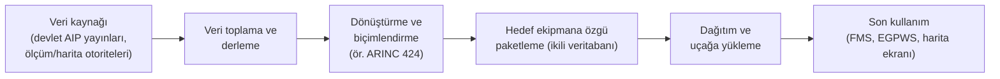

# 23. Havacılık Verileri

Havacılık verileri; navigasyon, performans veya görev planlama gibi işlevleri
besleyen kritik veri kümeleridir. Bu verilerde doğruluk ve güncellik, yazılım
mantığının bir parçası kadar önemlidir.

Bu bölüm, veri kaynağı güveni, güncelleme döngüsü ve bütünlük kontrolleri üzerinde
durur.

## Havacılık verisi neden kritiktir?

Çünkü sistem doğru algoritmayı çalıştırsa bile yanlış veri ile yanlış sonuca ulaşabilir.
Bu nedenle veri, pasif bir girdi değil, emniyet zincirinin aktif parçasıdır.

## Yönetim soruları

- Veri kaynağı güvenilir mi?
- Güncelleme sıklığı yeterli mi?
- Bütünlük kontrolü var mı?
- Yanlış veri tespit edilirse ne olacak?

## Veri örnekleri

- Navigasyon veritabanı
- Performans tabloları
- Uçuş rotası dosyaları

Bu veriler güncel değilse yazılım doğru çalışsa bile sistem yanlış sonuç üretebilir.

## Havacılık verisi işleme standartları

Yazılım için DO-178C neyse, havacılık verisi için de **DO-200A** (Avrupa'daki
karşılığı ED-76) benzer bir rolü üstlenir: verinin kendisinin doğruluğunu değil,
veriyi işleyen sürecin disiplinini güvence altına alır. Buradaki temel fikir
şudur: veri, kaynağından uçaktaki ekipmana ulaşana kadar uzun bir **veri
zincirinden (data chain)** geçer ve bu zincirin her halkası hata ekleyebilir
ya da mevcut bir hatayı fark etmeden iletebilir. DO-200A, zincirdeki her
katılımcının kendi payına düşen işleme adımlarını tanımlı, denetlenebilir ve
tekrarlanabilir bir süreçle yürütmesini bekler.

Tipik bir veri zinciri şöyle görünür:



Zincirin her aşamasında verinin sağlaması gereken nitelikler, **veri kalite
gereksinimleri (data quality requirements, DQR)** olarak tanımlanır. Pratikte
en çok karşılaşılan kalite boyutları şunlardır:

| Kalite boyutu | Anlamı | Örnek soru |
|---|---|---|
| Doğruluk (accuracy) | Değerin gerçek değere yakınlığı | Pist eşiği koordinatı kaç metre hatalı olabilir? |
| Çözünürlük (resolution) | Değerin ifade edildiği hassasiyet | Koordinat kaç ondalık basamakla saklanıyor? |
| Bütünlük (integrity) | Verinin üretiminden kullanımına kadar bozulmamış ya da yanlışlıkla değiştirilmemiş olma güvencesi | Dönüştürme sırasında bir alan sessizce kırpıldı mı? |
| Güncellik (timeliness) | Verinin geçerli yayın dönemine ait olması | Veritabanı hangi yayın dönemini kapsıyor? |
| Tamlık (completeness) | Gerekli tüm kayıtların mevcut olması | Bölgedeki tüm engeller veritabanında var mı? |
| İzlenebilirlik | Her kaydın kaynağına geri götürülebilmesi | Bu yükseklik değeri hangi resmî yayından geldi? |

Verinin ne kadar sıkı işleneceği, o verinin beslediği işlevin emniyet etkisine
bağlıdır. DO-200A bu amaçla **güvence seviyeleri (assurance levels)** tanımlar;
mantık DO-178C'deki yazılım seviyeleri ile aynıdır: hatalı verinin yol
açabileceği durum ne kadar ağırsa, işleme sürecine uygulanan doğrulama ve kayıt
tutma yükümlülükleri o kadar artar. Örneğin alçalma ve yaklaşma prosedürlerini
besleyen navigasyon verisi, yalnızca genel durum farkındalığı için gösterilen
bir arka plan haritasından çok daha yüksek güvence gerektirir.

Güncellik boyutunun kendine özgü bir mekanizması vardır: navigasyon verisi
dünya genelinde **AIRAC (Aeronautical Information Regulation and Control)**
adı verilen 28 günlük sabit yayın döngüsüyle güncellenir. Bu, veri zincirine
sıkı bir takvim baskısı getirir; her döngüde toplama, dönüştürme, doğrulama ve
dağıtım adımlarının eksiksiz tamamlanması gerekir. Süreç tanımlı ve otomatize
değilse, takvim baskısı doğrulama adımlarının atlanmasına yol açar — sahada en
sık görülen veri kalite sorunlarının kökeninde çoğu zaman bu vardır.

Uçaktaki yazılım açısından pratik sonuç şudur: yazılım, yüklenen veri setinin
kimliğini, sürümünü, geçerlilik dönemini ve bütünlüğünü **kullanmadan önce**
doğrulamalıdır. Basit bir yükleme-zamanı kontrolü C dilinde şöyle görünebilir:

```c
typedef struct {
    uint32_t magic;          /* beklenen veritabani imzasi        */
    uint16_t cycle;          /* AIRAC donemi, or. 2607            */
    uint32_t record_count;   /* beklenen kayit sayisi             */
    uint32_t crc32;          /* govde uzerinden hesaplanan CRC    */
} nav_db_header_t;

bool nav_db_kabul_edilebilir(const nav_db_header_t *h,
                             const uint8_t *govde, size_t boyut,
                             uint16_t gecerli_cycle)
{
    if (h->magic != NAV_DB_MAGIC)          { return false; }
    if (h->cycle != gecerli_cycle)         { return false; } /* guncellik */
    if (crc32_hesapla(govde, boyut) != h->crc32) { return false; } /* butunluk */
    return true;
}
```

Bu kontrol veri zincirindeki süreç güvencesinin yerine geçmez; yalnızca son
halkada, dağıtım ve yükleme sırasında oluşabilecek bozulmaları yakalar. Sürüm
ve bütünlük etiketlerinin nasıl yönetildiği, [konfigürasyon verisi](22-konfigurasyon-verisi.md)
bölümündeki yaklaşımla büyük ölçüde ortaktır.

## Veri işleme araçları

Veri zincirindeki işin büyük bölümü elle değil, araçlarla yapılır: kaynak
yayınlardan kayıt ayıklayan çözümleyiciler, koordinat sistemlerini dönüştüren
kütüphaneler, ARINC 424 metnini hedef ekipmanın ikili biçimine derleyen
paketleyiciler, iki dönem arasındaki farkları çıkaran karşılaştırma araçları.
Bu araçların ortak riski, yazılım geliştirme araçlarıyla aynıdır: **araç
hatası, çıktıya sessizce hata enjekte edebilir** ve bu hata binlerce kaydın
arasında insan gözüyle fark edilmez.

Bu yüzden veri işleme araçlarına, yazılım dünyasındaki araç kalifikasyonu
(tool qualification) mantığının aynısı uygulanır. Karar iki soruya dayanır:

1. Araç, çıktı veriye hata **ekleyebilir mi** ya da mevcut bir hatayı
   **gözden kaçırabilir mi**?
2. Aracın çıktısı, araçtan bağımsız bir adımla **doğrulanıyor mu**?

Birinci soruya "evet", ikinciye "hayır" yanıtı veriliyorsa araca güvence
gerekir. Doğrulama yükünü nereye koyduğunuza göre iki temel strateji vardır:

| Strateji | Yaklaşım | Bedeli |
|---|---|---|
| Çıktıyı doğrula | Aracın her üretimi bağımsız bir kontrolle (ikinci araç, örneklem denetimi, geri-dönüştürüp karşılaştırma) doğrulanır | Her AIRAC döngüsünde tekrarlanan işletim maliyeti |
| Aracı güvence altına al | Aracın gereksinimleri yazılır, doğrulanır, konfigürasyon yönetimine alınır; çıktısına güvenilir | Bir kerelik yüksek geliştirme/kalifikasyon maliyeti, sonrasında hızlı döngü |

AIRAC takvimi 28 günde bir döndüğü için pratikte olgun veri tedarikçileri
ikinci stratejiye yönelir: her döngüde on binlerce kaydı elle örneklemek
sürdürülebilir değildir. Yazılım tarafındaki karşılığıyla düşünürseniz bu,
DO-330'daki geliştirme aracı senaryosuna benzer — çıktısı doğrulanmayan ve
hata enjekte edebilen araç, ürettiği verinin güvence seviyesine uygun bir
titizlikle geliştirilmelidir. DO-330'un araç kalifikasyonu çerçevesi
[13. bölümde](../04-arac-kalifikasyonu-ve-ekler/13-do330-arac-kalifikasyonu.md)
ayrıntılı anlatılmıştır; oradaki kriter ve seviye mantığı buraya doğrudan
taşınabilir.

Sahada en çok gözden kaçan iki araç sınıfına dikkat çekmek isterim:

- **Dönüştürücüler ve biçim çevirileri.** Kayıp, çoğu zaman açık bir hata
  mesajıyla değil, sessiz kırpma/yuvarlama ile olur: kaynakta yedi ondalık
  basamaklı bir koordinatın hedef biçimde beş basamağa inmesi kimseyi
  uyarmaz, ama yaklaşma prosedüründe fark yaratabilir. Dönüşümün kalite
  boyutlarını (özellikle çözünürlük ve tamlık) koruduğu ayrıca gösterilmelidir.
- **Elektronik tablolar ve betikler.** Bir mühendisin "geçici olarak" yazdığı
  dönüştürme betiği ya da elle düzenlenen tablo da veri zincirinin parçasıdır
  ve aynı iki soruya tabidir. Konfigürasyon yönetimi dışında yaşayan bu tür
  araçlar, denetimlerde en sık bulgu üretilen noktadır.

Son olarak, araç güvencesi ile yükleme-zamanı bütünlük kontrolü birbirinin
yerine geçmez: CRC, dağıtım sırasındaki bozulmayı yakalar ama aracın baştan
yanlış ürettiği (ve CRC'si "doğru" hesaplanmış) veriyi yakalayamaz. İkisi
birlikte gerekir.

## İlgili endüstri dokümanları

DO-200A süreç disiplinini tanımlar ama verinin **içeriğini ve biçimini**
tanımlamaz; o iş, veri türüne göre uzmanlaşmış bir endüstri dokümanı ailesine
dağılmıştır. Bu dokümanları tanımak önemlidir, çünkü bir veri projesinde
"hangi alan, hangi çözünürlükte, hangi kodlamayla" sorularının yanıtı DO-200A'da
değil bu dokümanlarda bulunur.

En sık karşılaşılanlar şunlardır:

| Doküman | Alanı | Kısa açıklama |
|---|---|---|
| ARINC 424 | Navigasyon veritabanı | Havaalanları, pistler, seyrüsefer yardımcıları, hava yolları ve terminal prosedürlerinin satır-tabanlı kayıt biçimi; FMS veritabanlarının fiilî kaynak biçimi |
| DO-201A / ED-77 | Havacılık bilgisi | Navigasyon verisi için içerik ve kalite gereksinimlerini (doğruluk, çözünürlük vb.) uygulama alanına göre tanımlar |
| DO-276 / ED-98 | Arazi ve engel verisi | Arazi yükseklik modeli ve engel veri setleri için kullanıcı gereksinimlerini ve kalite boyutlarını belirler |
| DO-272 / ED-99 | Havaalanı haritalama | Havaalanı hareket alanı (pist, taksi yolu, apron) veritabanlarının içerik ve kalite gereksinimleri |
| DO-291 / ED-119 | Veri değişimi | Arazi, engel ve havaalanı haritalama verisinin taraflar arasında aktarımı için değişim biçimi |
| ARINC 816 | Havaalanı harita ekranı | Havaalanı haritalama verisinin uçaktaki ekran uygulamalarına yönelik ikili biçimi |

Bu dokümanların iş bölümünü şöyle okumak yararlıdır: **DO-201A/DO-276/DO-272**
"veride ne olmalı ve ne kalitede olmalı" sorusuna, **ARINC 424/ARINC 816 ve
DO-291** "veri hangi biçimde taşınmalı" sorusuna, **DO-200A** ise "bu veri
hangi süreçle işlenmeli" sorusuna yanıt verir. Üçü birlikte zinciri kapatır.

Pratik iki not:

- ARINC 424 bir **değişim biçimidir**, uçuşta kullanılan biçim değildir. Her
  FMS üreticisi 424 kaynağını kendi ikili veritabanına derler; bu derleme
  adımı, bir önceki alt bölümde anlatılan araç güvencesi sorusunun tam
  merkezindedir.
- Bu dokümanlar da yaşar: kayıt tipleri eklenir, kalite gereksinimleri
  güncellenir. Bir projede hangi doküman **hangi sürümüyle** taahhüt
  edildiği, sertifikasyon planlarında açıkça yazılmalı ve konfigürasyon
  yönetimi altında izlenmelidir.

## Kontrol yaklaşımı

Veri setleri için genellikle:

- sürümleme,
- kimlik doğrulama,
- bütünlük doğrulama,
- kullanım öncesi uygunluk kontrolü

gerekir.

## Bu bölümden akılda kalması gerekenler

- Havacılık verisi, yazılım kadar kritiktir; DO-200A veri zincirinin süreç
  disiplinini, DO-201A/DO-276/DO-272 ailesi ise içerik ve kalite
  gereksinimlerini tanımlar.
- Veri kalitesi tek boyut değildir: doğruluk, çözünürlük, bütünlük, güncellik,
  tamlık ve izlenebilirlik ayrı ayrı tanımlanır ve ayrı ayrı kontrol edilir.
- Veri işleme araçları, yazılım araçlarıyla aynı soruya tabidir: hata
  enjekte edebilen ve çıktısı bağımsız doğrulanmayan araç güvence gerektirir.
- Yükleme-zamanı bütünlük kontrolü (sürüm, AIRAC dönemi, CRC) gereklidir ama
  zincirdeki süreç güvencesinin yerine geçmez.
- Yanlış veri, doğru kodu bile yanlış sonuca götürür.
