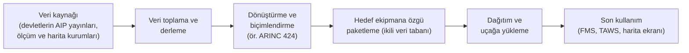

# 23. Havacılık Verileri

Havacılık verisi; seyrüsefer, arazi, engel ve havalimanı haritalama veri tabanları gibi,
uçaktaki yazılımdan ayrı üretilen ve dönemsel olarak yenilenen veri kümelerini kapsar.
Bu bölüm, verinin kaynağından uçağa uzanan veri zincirini, bu zinciri güvence altına alan
DO-200B sürecini ve otorite onayını, DO-178C ile sınırı ve uçaktaki yazılımın veriyi
kullanmadan önce yapması gereken denetimleri anlatır.

## Havacılık verisi nedir ve neden kritiktir?

Bir uçuş yönetim sistemi (flight management system, FMS), yaklaşma prosedürünü kusursuz
bir algoritmayla uçurabilir; prosedürdeki bir noktanın koordinatı yanlışsa uçak yine
yanlış yere gider. Kod gereksinimlerine uygundur, test edilmiş ve onaylanmıştır, ama
sonuç yanlıştır. Bu yüzden veri pasif bir girdi değil, emniyet zincirinin etkin bir
halkasıdır.

Havacılık verisini yazılımdan ayıran üç özellik vardır. Yazılımı geliştiren kuruluşun
dışında doğar: kaynağı, devletlerin havacılık bilgi yayını (Aeronautical Information
Publication, AIP) gibi resmî yayınları ile ölçüm ve harita kurumlarıdır. Yazılımın onayı
yenilenmeden, belirli bir takvimle değişir. Hacmi de insan gözüyle denetlenemeyecek kadar
büyüktür: tek bir veri tabanı on binlerce kayıt taşır. En sık karşılaşılan türler
şunlardır:

| Veri türü | Beslediği işlev | Güncelleme |
|---|---|---|
| Seyrüsefer (navigation) veri tabanı: havalimanları, pistler, seyrüsefer yardımcıları, hava yolları, terminal prosedürleri | FMS'te rota ile kalkış, geliş ve yaklaşma prosedürleri | 28 günlük sabit dönemlerle |
| Arazi ve engel veri tabanı | Arazi farkındalık ve uyarı sistemi (terrain awareness and warning system, TAWS), sentetik görüş | Tedarikçinin yayın takvimine göre; engel verisi araziden daha sık değişir |
| Havalimanı haritalama veri tabanı (aerodrome mapping database) | Yerdeki hareketli harita ekranı; pist ve taksi yolu farkındalığı | Tedarikçinin yayın takvimine göre |

Uçağa ya da motora özgü performans tabloları ve kalibrasyon dosyaları bu anlamda
havacılık verisi değildir; onları yazılımı geliştiren ya da entegre eden kuruluş üretir
ve [22. Konfigürasyon Verisi](./22-konfigurasyon-verisi.md) bölümündeki kurallarla
yönetilirler.

Her veri türü için aynı dört soru sorulur: Veri kimden geliyor ve bize ulaşana kadar
kimlerin elinden geçiyor? Güncelleme döngüsü nasıl işliyor? Bütünlük yol boyunca nasıl
korunuyor? Yanlış ya da süresi geçmiş veri fark edildiğinde sistem ne yapacak? İlk üç
soru veri zincirinin, sonuncusu uçaktaki yazılımın ve sistem gereksinimlerinin
konusudur; bölüm de bu sırayı izler.

## Veri zinciri ve DO-200B

Yazılım için DO-178C neyse, havacılık verisi için de **DO-200B** (Avrupa'daki karşılığı
ED-76A, 2015) benzer bir rolü üstlenir: verinin kendisinin doğruluğunu değil, veriyi
işleyen sürecin disiplinini güvence altına alır. Temel fikir şudur: veri, kaynağından
uçaktaki ekipmana ulaşana kadar uzun bir **veri zincirinden (data chain)** geçer ve bu
zincirin her halkası hata ekleyebilir ya da mevcut bir hatayı fark etmeden iletebilir.
DO-200B, zincirdeki her katılımcının kendi payına düşen işleme adımlarını tanımlı,
denetlenebilir ve tekrarlanabilir bir süreçle yürütmesini bekler.

Önceki sürüm DO-200A / ED-76'dır; eski kabul belgelerinde ve eski proje dokümanlarında
hâlâ karşınıza çıkar. 2024'te DO-200C / ED-76B yayımlanmıştır. Aşağıda anlatılan otorite
dokümanları DO-200B / ED-76A'yı esas aldığı için bu bölüm o sürümü izler; yeni bir
projede hangi sürümün taahhüt edileceği otoriteyle teyit edilmelidir.

Tipik bir veri zinciri şöyle görünür:


```mermaid
flowchart LR
    A["Veri kaynağı<br/>(devletlerin AIP yayınları,<br/>ölçüm ve harita kurumları)"] --> B["Veri toplama ve<br/>derleme"]
    B --> C["Dönüştürme ve<br/>biçimlendirme<br/>(ör. ARINC 424)"]
    C --> D["Hedef ekipmana özgü<br/>paketleme (ikili veri tabanı)"]
    D --> E["Dağıtım ve<br/>uçağa yükleme"]
    E --> F["Son kullanım<br/>(FMS, TAWS, harita ekranı)"]
```

DO-200B'nin süreci, zincirin başındaki resmî yayından sonrasını kapsar: yayındaki bir
hata, kusursuz işleyen bir zincir boyunca sadakatle taşınır. Bu yüzden veri tedarikçileri
kaynak veriyi makullük denetimlerinden geçirir ve şüpheli gördüklerini kaynağına
bildirir.

### Veri kalite gereksinimleri

Zincirin her aşamasında verinin sağlaması gereken nitelikler, **veri kalite
gereksinimleri (data quality requirements, DQR)** olarak tanımlanır. Bu gereksinimleri
veriyi kullanacak uygulamanın sahibi belirler; zincirdeki her halka da bir önceki halkayla
bunlar üzerinde yazılı olarak anlaşır. Yazılımdaki karşılığıyla düşünürseniz veri kalite
gereksinimleri, veri sürecinin "gereksinim dokümanıdır": süreç onlara göre doğrulanır.
Kalite tek boyut değildir:

| Kalite boyutu | Anlamı | Örnek soru |
|---|---|---|
| Doğruluk (accuracy) | Değerin gerçek değere yakınlığı | Pist eşiği koordinatı kaç metre hatalı olabilir? |
| Çözünürlük (resolution) | Değerin ifade edildiği hassasiyet | Koordinat kaç ondalık basamakla saklanıyor? |
| Bütünlük (integrity) | Verinin üretiminden kullanımına kadar bozulmamış ya da yanlışlıkla değiştirilmemiş olma güvencesi | Dönüştürme sırasında bir alan sessizce kırpıldı mı? |
| Güncellik (timeliness) | Verinin kullanıldığı dönemde geçerli olması | Veri tabanı hangi yayın dönemini kapsıyor? |
| Tamlık (completeness) | Gerekli tüm kayıtların mevcut olması | Bölgedeki tüm engeller veri tabanında var mı? |
| İzlenebilirlik (traceability) | Her kaydın kaynağına geri götürülebilmesi | Bu yükseklik değeri hangi resmî yayından geldi? |
| Biçim (format) | Verinin, alıcının beklediği yapı ve kodlamayla teslim edilmesi | Paketlenen dosya, ekipmanın beklediği biçim sürümünde mi? |

DO-200B bütünlük boyutunu doğrudan bir sayı olarak değil, sürecin ne kadar sıkı
yürütüleceğini söyleyen bir **güvence seviyesi** üzerinden ifade eder.

### Veri süreci güvence seviyesi

Verinin ne kadar sıkı işleneceği, o verinin beslediği işlevin emniyet etkisine bağlıdır.
DO-200B bu amaçla üç **veri süreci güvence seviyesi (data process assurance level, DPAL)**
tanımlar. Mantık DO-178C'deki yazılım seviyelerine (software level) benzer: hatalı verinin katkıda
bulunabileceği arıza durumu (failure condition) ne kadar ağırsa, işleme sürecine uygulanan doğrulama,
geçerleme ve kayıt tutma yükümlülükleri o kadar artar.

| Seviye | Hatalı verinin katkıda bulunabileceği arıza durumu | ICAO bütünlük sınıfı |
|---|---|---|
| DPAL 1 | Katastrofik ya da Tehlikeli | Kritik (critical) |
| DPAL 2 | Majör ya da Minör | Temel (essential) |
| DPAL 3 | Emniyet etkisi yok | Rutin (routine) |

Tabloyu okurken üç noktaya dikkat etmek gerekir:

- **Seviye verinin türüne değil, kullanımına bağlıdır.** Aynı pist eşiği koordinatı, onu
  yalnızca durum farkındalığı için arka plan haritasında gösteren uygulamada ve yaklaşma
  kılavuzluğunda kullanan uygulamada farklı seviye gerektirebilir. Seviye, verinin
  beslediği işlevin sistem emniyet değerlendirme sürecinden çıkar ve veri kalite
  gereksinimlerine yazılır.
- **Yazılım seviyeleriyle birebir eşleşme yoktur.** Beş yazılım seviyesine karşılık üç
  DPAL vardır ve iki ölçek farklı şeyleri ölçer: yazılım seviyesi veriyi okuyan kodun
  geliştirme titizliğini, DPAL veriyi üreten sürecin titizliğini belirler. Yazılım
  seviyesi yüksek bir uygulama, veri hatasının etkisi mimariyle sınırlanmışsa daha düşük
  bir DPAL ile yetinebilir; gerekçesi sistem emniyet değerlendirme sürecinde kayda
  geçirilir.
- **DO-200C ölçeği genişletmiştir.** Yeni sürüm, 2 ile 3 arasına DPAL 2B adıyla bir ara
  seviye ekler. Eski ve yeni sürümle üretilmiş verinin aynı zincirde buluştuğu durumda
  seviyelerin nasıl eşleneceği veri kalite gereksinimlerinde açıkça yazılmalıdır.

### Güncellik ve AIRAC döngüsü

Güncellik boyutunun kendine özgü bir mekanizması vardır: seyrüsefer verisi dünya
genelinde **AIRAC (Aeronautical Information Regulation and Control)** adı verilen 28
günlük sabit yayın döngüsüyle güncellenir. Değişiklikler önceden duyurulur ve herkes için
aynı gün yürürlüğe girer; dönemler de yıl ve sıra numarasıyla anılır (2607, 2026'nın
yedinci dönemidir). Bu, veri zincirine sıkı bir takvim baskısı getirir: her döngüde
toplama, dönüştürme, doğrulama ve dağıtım adımlarının eksiksiz tamamlanması gerekir.
Süreç tanımlı ve otomatik değilse takvim baskısı doğrulama adımlarının atlanmasına yol
açar; sahada görülen veri kalite sorunlarının kökeninde çoğu zaman bu vardır.

## Otorite onayı ve zincirdeki roller

DO-200B bir endüstri standardıdır; ona ağırlığını veren, otoritelerin veri sürecini
kabul ederken onu ölçü almasıdır. Yazılımda onay, belirli bir yazılım sürümünü taşıyan
ürüne verilir. Veri tarafında ise her dönem yeni bir ürün çıkar; otoritenin her birini
ayrı ayrı onaylaması mümkün değildir. Bu yüzden kabul edilen ürün değil, ürünü üreten
**kuruluş ve süreçtir**.

Zincirde dört rol ayırt edilir:

| Rol | Tipik olarak kim? | Ne yapar? | Güvencenin dayanağı |
|---|---|---|---|
| Veri kaynağı (data originator) | Devletlerin havacılık bilgi hizmetleri, ölçüm ve harita kurumları | Veriyi üretir ve resmî yayınlarla duyurur | Devletin havacılık bilgi hizmeti kuralları (ICAO Ek 15 çerçevesi); DO-200B zinciri bu yayından sonra başlar |
| Veri tedarikçisi (data supplier) | Resmî yayınları toplayıp standart biçimde veri tabanı üreten kuruluş | Toplar, derler, ARINC 424 gibi bir değişim biçiminde yayımlar | Tip 1 kabul |
| Uygulama entegratörü (application integrator) | Çoğunlukla ekipman üreticisi | Veri kalite gereksinimlerini tanımlar, veriyi ekipmanın ikili biçimine paketler, ekipmanla uyumluluğunu gösterir | Tip 2 kabul |
| Son kullanıcı (end user) | Operatör | Veri tabanını edinir, uçağa yükler ve güncel tutar | İşletme kuralları: verinin kabul görmüş bir tedarikçiden geldiğini ve geçerli döneme ait olduğunu güvence altına almak |

İki büyük otorite aynı standarda dayanır ama farklı hukuki araç kullanır:

| | FAA | EASA |
|---|---|---|
| Dayanak | AC 20-153B (2016) | (AB) 2017/373 sayılı Uygulama Tüzüğü; veri hizmetleri sağlayıcılarına ilişkin Part-DAT |
| Kabulün biçimi | Kabul mektubu (Letter of Acceptance, LOA) | Veri hizmetleri (DAT) sağlayıcı sertifikası; 1 Ocak 2019'dan itibaren gönüllü kabul mektubu uygulamasının yerini almıştır |
| Tip 1 | Veri sürecinin DO-200B hedeflerini karşıladığını tanır; belirli bir uçak sistemi ya da ekipmanla uyumluluk içermez | Veri kalite gereksinimlerini karşılayan veri tabanı üretir; uçaktaki uygulamayla uyumluluk belirlenmemiştir |
| Tip 2 | Sürece ek olarak, teslim edilen verinin belirli aviyonik sistemlerle ve onların amaçlanan işleviyle uyumluluğunu tanır | Sertifikalı uygulama ya da ekipmanla uyumluluğu gösterilmiş veri tabanı üretir; son kullanıcıya doğrudan teslim edebilir |

Kabul, bir kez alınıp rafa konan bir belge değildir. Sahibinden, emniyeti etkileyebilecek
veri kusurlarını otoriteye bildirmesi, süreç ve veri kalite gereksinimi değişikliklerini
kabule sunması, süreci dönemsel iç denetimlerle gözden geçirmesi ve her dağıtımla
birlikte kabul durumunu, bilinen sapmaları ve yapılan değişiklikleri bildiren bir yayın
beyanı (release statement) vermesi beklenir. Operatör, kendi sorumluluğunu bu beyana
dayanarak yerine getirir. EASA tarafında operatörden, sertifikalı sistemlerde kullandığı
veri tabanını Tip 2 sertifikalı (ya da eşdeğeri kabul edilen) bir sağlayıcıdan alması
beklenir.

Aviyonik üreticisi çoğu zaman Tip 2 rolündedir ve DO-178C projesiyle veri süreci tam
burada buluşur. Veri kalite gereksinimlerini üretici yazar; bunların kaynağı, yazılım
seviyesini de belirleyen sistem emniyet değerlendirme sürecidir. Veri tabanının ikili biçimi
üreticinin tasarım kararıdır ve onu okuyan yazılımın gereksinimlerinde tanımlanır. Tip 2
kabul tipik olarak, hangi veri tabanının hangi ekipman parça numarasıyla uyumlu olduğunu
gösteren bir listeye bağlanır; ikili biçimi değiştiren bir yazılım sürümü bu listeyi,
paketleme aracını ve veri kalite gereksinimlerini de etkiler. Değişiklik etki analizinde
(change impact analysis) en kolay unutulan kalem budur.

## Uçaktaki yazılımın payı: DO-178C ile sınır

İki standardın sınırı, verinin içeriği ile veriyi kullanan kod arasından geçer.
Veri tabanının içeriğinin üretimi DO-200B'ye tabidir ve her dönemde, yazılım onayına
dokunmadan yenilenir. Veri tabanını okuyan, ayrıştıran ve kullanan yazılım ise
DO-178C'ye tabidir: ikili biçimin tanımı yazılım gereksinimlerinin parçasıdır ve yazılım
belirli bir dönemin içeriğiyle değil, biçimin izin verdiği bütün içerikle doğru
çalışacak biçimde doğrulanır. Veri tabanı bozuk, eksik ya da süresi geçmiş olduğunda
yazılımın ne yapacağı da DO-178C tarafında kalır; bunlar gereksinim olarak yazılır ve
gürbüzlük (robustness) testleriyle doğrulanır. Sınırı DO-178C kendisi de çizer: parametre
verisi öğelerini tanımlarken konfigürasyon tablolarını ve veri tabanlarını örnek verir,
havacılık verisini ise kapsamı dışında bıraktığını açıkça söyler.

Havacılık veri tabanı, davranışı etkileyen diğer veri türleriyle sık karıştırılır.
Ayrım, verinin biçiminde değil; kimin ürettiğinde ve güvencenin neye dayandığındadır:

| | Parametre verisi öğesi (parameter data item, PDI) | Havacılık veri tabanı | Kullanıcı tarafından değiştirilebilir veri |
|---|---|---|---|
| Kim üretir? | Yazılımı geliştiren ya da entegre eden kuruluş | Veri tedarikçisi ve uygulama entegratörü; kaynağı resmî yayınlardır | Operatör |
| Ne zaman değişir? | Konfigürasyon değiştiğinde; her yeni dosya yeni bir onaylı konfigürasyondur | Dönemsel olarak; yazılım onayı yenilenmeden | Operatörün ihtiyacına göre; önceden belirlenmiş kısıtlar içinde |
| Güvencenin dayanağı | DO-178C: her dosya doğrulanır | DO-200B süreci ve bu sürecin otoritece kabulü | Koruma mekanizmasının ve değişiklik kısıtlarının DO-178C kapsamında onaylanması |
| Uçaktaki yazılımdan beklenen | Yapı, uyumluluk ve aralık denetimi | Kimlik, bütünlük, tamlık ve geçerlilik dönemi denetimi; geçersiz veriye karşı gürbüzlük | Kısıtların dışına çıkılmasını engelleyen koruma |

Parametre verisi öğeleri 22. bölümde, kullanıcı tarafından değiştirilebilir veri
[19. Kullanıcı Tarafından Değiştirilebilir Yazılım](./19-kullanici-tarafindan-degistirilebilir-yazilim.md)
bölümünde anlatılır. Veri tabanı uçağa çoğunlukla sahada, yazılımla aynı veri
yükleyiciyle yüklenir; yine de DO-178C'deki anlamıyla sahada yüklenebilir yazılım
(field-loadable software) gibi ele alınmaz: içeriği o belgenin kapsamı dışındadır ve
kendi güvence zinciriyle yönetilir. Ortak olan yükleme mekanizmasıdır: doğru dosyanın
yüklendiğinin ve aktarımda bozulmadığının teyidi
[18. Sahada Yüklenebilir Yazılım](./18-sahada-yuklenebilir-yazilim.md) bölümünde
anlatılır. Hangi verinin hangi rejime girdiği planlama aşamasında kararlaştırılır ve
yazılım sertifikasyon planında (Plan for Software Aspects of Certification, PSAC)
belirtilir.

### Yükleme zamanı denetimi

Uçaktaki yazılım açısından pratik sonuç şudur: yazılım, yüklenen veri tabanının
kimliğini, biçim sürümünü, bütünlüğünü, tamlığını ve geçerlilik dönemini **kullanmadan
önce** denetlemelidir. Sürüm ve bütünlük bilgisinin dosyada nasıl taşındığı, 22.
bölümdeki PDI örneğiyle büyük ölçüde ortaktır; fark, geçerlilik döneminin de işin içine
girmesidir. Basit bir denetim C dilinde şöyle görünebilir. Örnekte dosya 24 baytlık bir
başlık, sabit uzunluklu kayıtlardan oluşan bir gövde ve en sonda döngüsel artıklık
denetimi (cyclic redundancy check, CRC) değerinden oluşur:

```c
#include <stddef.h>
#include <stdint.h>

#define NAV_DB_IMZA          (0x4E415644u) /* dosya türü imzası               */
#define NAV_DB_BICIM_SURUMU  (4u)          /* kodun beklediği biçim sürümü    */
#define NAV_DB_BASLIK_BOYU   (24u)         /* altı adet 32 bit alan           */
#define NAV_DB_KAYIT_BOYU    (32u)         /* sabit uzunluklu kayıt           */
#define NAV_DB_CRC_BOYU      (4u)          /* dosyanın son dört baytı         */

typedef enum {
    NAV_DB_GECERLI = 0,
    NAV_DB_DONEM_DISI,   /* sağlam, ama geçerlilik dönemi dışında   */
    NAV_DB_BOZUK         /* bütünlük, kimlik ya da tamlık hatası    */
} nav_db_durum_t;

typedef struct {
    uint32_t airac_donemi;      /* ör. 2607                           */
    uint32_t gecerlilik_basi;   /* ilk geçerli gün (gün sayacı)       */
    uint32_t gecerlilik_sonu;   /* son geçerli gün (gün sayacı)       */
    uint32_t kayit_sayisi;      /* gövdede bulunması gereken kayıt    */
} nav_db_kimlik_t;

/* CRC-32 hesabı; başka bir birimde tanımlıdır. */
uint32_t crc32_hesapla(const uint8_t *veri, size_t boyut);

/* Alanlar bayt bayt okunur: dosya doğrudan bir yapıya bindirilirse sonuç
 * derleyicinin yapı dolgusuna ve işlemcinin bayt sırasına bağlı kalır. */
static uint32_t be32_oku(const uint8_t *p)
{
    return ((uint32_t)p[0] << 24) | ((uint32_t)p[1] << 16) |
           ((uint32_t)p[2] << 8)  |  (uint32_t)p[3];
}

nav_db_durum_t nav_db_denetle(const uint8_t *dosya, size_t boyut,
                              uint32_t bugun, nav_db_kimlik_t *kimlik)
{
    nav_db_durum_t durum = NAV_DB_BOZUK;

    if ((dosya != NULL) && (kimlik != NULL) &&
        (boyut >= ((size_t)NAV_DB_BASLIK_BOYU + NAV_DB_CRC_BOYU))) {
        const size_t korunan = boyut - NAV_DB_CRC_BOYU;  /* başlık + gövde */
        const size_t govde   = korunan - NAV_DB_BASLIK_BOYU;

        if (crc32_hesapla(dosya, korunan) == be32_oku(&dosya[korunan])) {
            /* Bütünlük doğrulandı; başlık alanları artık okunabilir. */
            kimlik->airac_donemi    = be32_oku(&dosya[8]);
            kimlik->gecerlilik_basi = be32_oku(&dosya[12]);
            kimlik->gecerlilik_sonu = be32_oku(&dosya[16]);
            kimlik->kayit_sayisi    = be32_oku(&dosya[20]);

            if ((be32_oku(&dosya[0]) == NAV_DB_IMZA) &&
                (be32_oku(&dosya[4]) == NAV_DB_BICIM_SURUMU) &&
                ((govde % NAV_DB_KAYIT_BOYU) == 0u) &&
                ((govde / NAV_DB_KAYIT_BOYU) == kimlik->kayit_sayisi)) {
                if ((bugun >= kimlik->gecerlilik_basi) &&
                    (bugun <= kimlik->gecerlilik_sonu)) {
                    durum = NAV_DB_GECERLI;
                } else {
                    durum = NAV_DB_DONEM_DISI;
                }
            }
        }
    }
    return durum;
}
```

Örnekte dikkat edilecek dört nokta vardır:

- **CRC başlığı da korur.** Yalnızca gövdeyi kapsayan bir CRC, bozulmuş bir dönem ya da
  kayıt sayısı alanını sessizce geçirir. Denetim sırası da buna göredir: bütünlüğü
  doğrulanmamış dosyanın hiçbir alanına güvenilmez.
- **Tamlık ayrıca denetlenir.** Başlıktaki kayıt sayısı gövdenin gerçek boyutuyla
  karşılaştırılır. Paketleme aracının yarıda kestiği bir dosyanın CRC'si doğru
  hesaplanmış olabilir; eksik kaydı bu karşılaştırma yakalar.
- **"Bozuk" ile "dönem dışı" aynı şey değildir.** Bütünlük, kimlik ya da tamlık hatası
  kesin rettir: veri tabanı kullanılmaz ve ona dayanan işlevlerin kullanılamadığı
  mürettebata (flight crew) bildirilir. Geçerlilik dönemi dışındaki veri tabanı ise bozuk değildir;
  yalnızca eskidir ya da henüz yürürlüğe girmemiştir. Birçok uçuş yönetim sistemi bu
  yüzden ardışık iki dönemi birlikte taşır; dönem değiştiğinde etkin veri tabanı da
  değiştirilir. Dönem dışı veri tabanında yaygın davranış, mürettebatı açıkça
  uyarmaktır; hangi koşullarda kullanılabileceğini işletme kuralları belirler. Hangi
  davranışın seçileceği bir sistem gereksinimidir ve iki durumu tek bir "geçersiz"
  sonucunda birleştiren tasarım bu ayrımı yapamaz.
- **Tarihin kaynağı da gereksinimdir.** Dönem denetimi, güvenilir bir tarih olduğunu
  varsayar. Tarih geçerli değilse yazılım dönemi kendi başına doğrulayamaz; o durumda
  veri tabanının dönemi mürettebata gösterilir ve doğrulama ona bırakılır.

Bu denetim veri zincirindeki süreç güvencesinin yerine geçmez. Yalnızca son halkada,
paketlemeden sonra dağıtım ve yükleme sırasında oluşabilecek bozulmaları ve yanlış dosya
yüklenmesini yakalar; kaynakta ya da dönüştürmede yanlış üretilmiş bir koordinat bütün
bu denetimlerden geçer.

## Veri işleme araçları

Veri zincirindeki işin büyük bölümü elle değil, araçlarla yapılır: kaynak
yayınlardan kayıt ayıklayan çözümleyiciler, koordinat sistemlerini dönüştüren
kütüphaneler, ARINC 424 metnini hedef ekipmanın ikili biçimine derleyen
paketleyiciler, iki dönem arasındaki farkları çıkaran karşılaştırma araçları.
Bu araçların ortak riski, yazılım geliştirme araçlarıyla aynıdır: **araç
hatası, çıktıya sessizce hata ekleyebilir** ve bu hata binlerce kaydın
arasında insan gözüyle fark edilmez.

Bu yüzden veri işleme araçlarına, yazılım dünyasındaki araç kalifikasyonu
(tool qualification) mantığının aynısı uygulanır. Karar iki soruya dayanır:

1. Araç, çıktı veriye hata **ekleyebilir mi** ya da mevcut bir hatayı
   **gözden kaçırabilir mi**?
2. Aracın çıktısı, araçtan bağımsız bir adımla **doğrulanıyor mu**?

Birinci soruya "evet", ikinciye "hayır" yanıtı veriliyorsa araca güvence
gerekir. Doğrulama yükünü nereye koyduğunuza göre iki temel strateji vardır:

| Strateji | Yaklaşım | Bedeli |
|---|---|---|
| Çıktıyı doğrula | Aracın her üretimi bağımsız bir kontrolle (ikinci araç, örneklem denetimi, geri dönüştürüp karşılaştırma) doğrulanır | Her AIRAC döngüsünde tekrarlanan işletim maliyeti |
| Aracı güvence altına al | Aracın gereksinimleri yazılır, doğrulanır, konfigürasyon yönetimine alınır; çıktısına güvenilir | Bir kerelik yüksek geliştirme ve kalifikasyon maliyeti, sonrasında hızlı döngü |

AIRAC takvimi 28 günde bir döndüğü için sık görülen yaklaşım ikinci stratejidir: her
döngüde on binlerce kaydı elle örneklemek sürdürülebilir değildir. Yazılım tarafındaki
karşılığıyla bu, DO-178C'nin araç sınıflandırmasındaki Ölçüt 1 durumudur: çıktısı ürünün
parçası olan ve bu yüzden ona hata ekleyebilen araç. DO-178C'de kalifikasyonu gerekli
kılan, böyle bir aracın çıktısının ayrıca doğrulanmamasıdır; kalifikasyonun titizliğini
yazılım seviyesi belirler. Veri tarafında aynı rolü, aracın ürettiği verinin güvence
seviyesi oynar. DO-200B de araç kalifikasyonu için DO-330'a başvurur. DO-330 baştan
başka alanlarda da kullanılabilecek biçimde yazılmıştır ve havacılık veri tabanlarını bu
alanlar arasında sayar; hangi ölçütle hangi araç kalifikasyon seviyesinin uygulanacağını
ise alanın kendi belgesine bırakır. Ölçütler ve araç kalifikasyon seviyeleri
[13. DO-330 ve Yazılım Aracı Kalifikasyonu](../04-arac-kalifikasyonu-ve-ekler/13-do330-arac-kalifikasyonu.md)
bölümünde ayrıntılı anlatılmıştır ve oradaki mantık buraya doğrudan taşınabilir.

Sahada en çok gözden kaçan iki araç sınıfı şunlardır:

- **Dönüştürücüler ve biçim çevirileri.** Kayıp, çoğu zaman açık bir hata
  mesajıyla değil, sessiz kırpma ya da yuvarlama ile olur: kaynakta yedi ondalık
  basamaklı bir koordinatın hedef biçimde beş basamağa inmesi kimseyi
  uyarmaz, ama yaklaşma prosedüründe fark yaratabilir. Dönüşümün kalite
  boyutlarını (özellikle çözünürlük ve tamlık) koruduğu ayrıca gösterilmelidir.
- **Elektronik tablolar ve betikler.** Bir mühendisin "geçici olarak" yazdığı
  dönüştürme betiği ya da elle düzenlenen tablo da veri zincirinin parçasıdır
  ve aynı iki soruya tabidir. Konfigürasyon yönetimi dışında yaşayan bu tür
  araçlar, denetimlerde bulgu üretmeye en yatkın noktalardır.

Son olarak, araç güvencesi ile yükleme zamanı denetimi birbirinin
yerine geçmez: CRC, dağıtım sırasındaki bozulmayı yakalar ama aracın baştan
yanlış ürettiği (ve CRC'si "doğru" hesaplanmış) veriyi yakalayamaz. İkisi
birlikte gerekir.

## İlgili endüstri dokümanları

DO-200B süreç disiplinini tanımlar ama verinin **içeriğini ve biçimini**
tanımlamaz; o iş, veri türüne göre uzmanlaşmış bir endüstri dokümanı ailesine
dağılmıştır. Bu dokümanları tanımak önemlidir, çünkü bir veri projesinde
"hangi alan, hangi çözünürlükte, hangi kodlamayla" sorularının yanıtı DO-200B'de
değil bu dokümanlarda bulunur.

En sık karşılaşılanlar şunlardır:

| Doküman | Yazım tarihindeki güncel sürüm | Alanı | Kısa açıklama |
|---|---|---|---|
| ARINC 424 | Güncel eki (supplement) kullanılır | Seyrüsefer veri tabanı | Havalimanları, pistler, seyrüsefer yardımcıları, hava yolları ve terminal prosedürlerinin satır tabanlı kayıt biçimi; FMS veri tabanlarının fiilî kaynak biçimi |
| DO-201 / ED-77 | DO-201C / ED-77B (2025) | Seyrüsefer verisi | Seyrüsefer verisi için içerik ve kalite gereksinimlerini (doğruluk, çözünürlük vb.) uygulama alanına göre tanımlar |
| DO-276 / ED-98 | DO-276C / ED-98C (2015) | Arazi ve engel verisi | Arazi yükseklik modeli ve engel veri kümeleri için kullanıcı gereksinimlerini ve kalite boyutlarını belirler |
| DO-272 / ED-99 | DO-272D / ED-99D (2015) | Havalimanı haritalama | Havalimanı hareket alanı (pist, taksi yolu, apron) veri tabanlarının içerik ve kalite gereksinimleri |
| DO-291 / ED-119 | DO-291C / ED-119C (2015) | Veri değişimi | Arazi, engel ve havalimanı haritalama verisinin taraflar arasında aktarımı için değişim biçimi |
| ARINC 816 | Güncel eki kullanılır | Havalimanı harita ekranı | Havalimanı haritalama verisinin uçaktaki ekran uygulamalarına yönelik gömülü biçimi |

Bu dokümanların iş bölümünü şöyle okumak yararlıdır: **DO-201, DO-276 ve DO-272**
"veride ne olmalı ve ne kalitede olmalı" sorusuna, **ARINC 424, ARINC 816 ve
DO-291** "veri hangi biçimde taşınmalı" sorusuna, **DO-200B** ise "bu veri
hangi süreçle işlenmeli" sorusuna yanıt verir. Üçü birlikte zinciri kapatır.

Pratik iki not:

- ARINC 424 bir **değişim biçimidir**, uçuşta kullanılan biçim değildir. Her
  FMS üreticisi 424 kaynağını kendi ikili veri tabanına derler; bu derleme
  adımı, bir önceki kısımda anlatılan araç güvencesi sorusunun tam
  merkezindedir.
- Bu dokümanlar da yaşar: kayıt tipleri eklenir, kalite gereksinimleri güncellenir
  ve sürümler birbirine göre hizalanır. Örneğin DO-201C, DO-200C'deki yeni güvence
  seviyesini kullanacak biçimde güncellenmiştir; tablodaki sürümler de bu kitabın
  yazıldığı tarihe aittir. Bir projede hangi dokümanın **hangi sürümüyle** taahhüt
  edildiği, veri kalite gereksinimlerinde ve sertifikasyon planlarında açıkça
  yazılmalı, konfigürasyon yönetimi altında izlenmelidir.

## Bu bölümden akılda kalması gerekenler

- Yanlış veri, doğru kodu bile yanlış sonuca götürür. Havacılık verisi yazılımın dışında
  üretilir ve yazılım onayı yenilenmeden dönemsel olarak değişir; güvencesi bu yüzden
  ayrı bir standarda, DO-200B / ED-76A'ya dayanır.
- DO-200B verinin değil sürecin güvencesidir: veri kalite gereksinimleri neyin
  bekleneceğini, veri süreci güvence seviyesi (DPAL 1, 2, 3) sürecin ne kadar sıkı
  yürütüleceğini söyler. Seviye, verinin beslediği işlevin arıza durumu sınıfından çıkar.
- Otorite veri tabanını değil, onu üreten kuruluşu ve süreci kabul eder: FAA'da kabul
  mektubu, EASA'da veri hizmetleri sağlayıcı sertifikası. Tip 1 yalnız süreci, Tip 2
  ayrıca belirli ekipmanla uyumluluğu kapsar; aviyonik üreticisi çoğunlukla Tip 2'dir.
- Veri tabanının içeriği DO-200B'ye, onu okuyan yazılım ve ikili biçimin tanımı
  DO-178C'ye tabidir. Havacılık veri tabanı ne parametre verisi öğesidir ne de kullanıcı
  tarafından değiştirilebilir veri.
- Yazılım veri tabanını kullanmadan önce kimliğini, bütünlüğünü, tamlığını ve geçerlilik
  dönemini denetler; bozuk veri ile dönem dışı veri ayrı sonuçlardır ve ayrı sistem
  davranışı gerektirir. Bu denetim zincirdeki süreç güvencesinin yerine geçmez.
- Veri işleme araçları yazılım araçlarıyla aynı soruya tabidir: hata ekleyebilen ve
  çıktısı bağımsız doğrulanmayan araç güvence gerektirir.
- İçerik ve kalite gereksinimleri DO-201, DO-276 ve DO-272'de, taşıma biçimleri ARINC 424,
  ARINC 816 ve DO-291'de tanımlıdır; hangi sürümün taahhüt edildiği yazılı olmalıdır.
