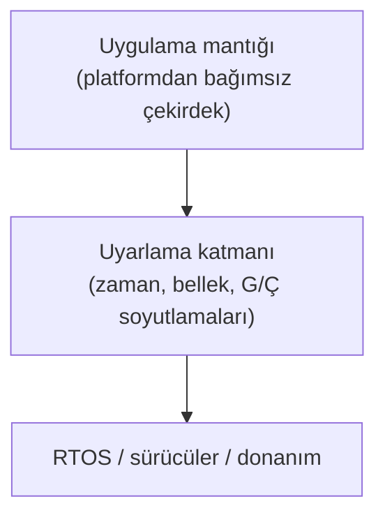

# 24. Yazılım Yeniden Kullanımı

Yazılım yeniden kullanımı, kanıtlanmış bileşenlerden faydalanmayı sağlar; fakat
"daha önce kullanıldı" ifadesi tek başına yeterli değildir.

Bu bölüm, yeniden kullanımın bağlam, değişiklik ve servis geçmişi açısından nasıl
değerlendirileceğini açıklar.

## Yeniden kullanım neden dikkat ister?

Bir bileşen başka bir projede güvenilir çalışmış olabilir; ancak yeni sistemde farklı
arayüzler, farklı zamanlama koşulları veya farklı emniyet hedefleri olabilir. Bu yüzden
yeniden kullanım, otomatik güven anlamına gelmez.

## Değerlendirme soruları

### Yeniden kullanımda sorulacak sorular

- Bu bileşen hangi bağlamda doğrulanmıştı?
- Mevcut sistemde ne değişti?
- Değişen parçalar yeniden test edildi mi?

## Bağlam farkı

Aynı kod, farklı donanımda, farklı RTOS altında veya farklı veri akışında başka bir
davranış gösterebilir. Bu yüzden eski servis geçmişi ile yeni kullanım bağlamı birlikte
değerlendirilmelidir.

## Yeniden kullanılabilir bileşen tasarlamak

Yeniden kullanım çoğu zaman sonradan akla gelir: proje biter, bir sonraki projede
"aynı kodu alalım" denir ve o noktada kodun ne kadar projeye özgü varsayımla dolu
olduğu ortaya çıkar. Gerçek yeniden kullanılabilirlik, bileşen daha ilk projede
yazılırken verilen tasarım kararlarıyla kazanılır. Üç temel ilke öne çıkar: dar ve
belgeli arayüzler, platform bağımlılıklarının yalıtılması ve kanıt paketinin
bileşenle birlikte taşınabilir olması.

### Dar ve belgeli arayüzler

Bir bileşenin arayüzü ne kadar geniş ve örtükse, yeni bir bağlama taşındığında
kırılma olasılığı o kadar yüksektir. Yeniden kullanılabilir bir bileşende:

- Arayüz, az sayıda ve açıkça tanımlı fonksiyondan oluşur; bileşenin iç veri
  yapılarına doğrudan erişim verilmez.
- Global değişken üzerinden örtük veri alışverişi yapılmaz; tüm girdi ve çıktılar
  fonksiyon parametreleri veya tanımlı mesaj yapıları üzerinden akar.
- Arayüzün davranışı düşük seviyeli gereksinimlerde tanımlıdır: değer aralıkları,
  birimler, hata durumlarında dönen kodlar, çağrı sıklığı ve zamanlama beklentileri
  yazılıdır.
- Arayüz sözleşmesine girmeyen davranışlar (örneğin iç tamponların boyutu) belgede
  "garanti edilmez" olarak işaretlenir; yeni proje bunlara dayanamaz.

Bu disiplinin sertifikasyon açısından karşılığı doğrudan izlenebilirliktir: arayüz
gereksinim olarak yazılmışsa, yeni projede "bu bileşenden ne bekliyoruz?" sorusunun
cevabı belgededir ve doğrulama kanıtı bu gereksinimlere bağlıdır.

### Platform bağımlılıklarının yalıtılması

Bileşenin işlevsel çekirdeği ile donanıma, RTOS'a veya derleyiciye bağımlı kısımları
ayrı katmanlarda tutulmalıdır. Yaygın yaklaşım, platforma dokunan her şeyi ince bir
uyarlama katmanının (adaptation layer) arkasına almaktır:



C dilinde bu ayrım, çekirdeğin yalnızca soyut bir arayüz başlığına bağımlı
olmasıyla sağlanır:

```c
/* platform_time.h — çekirdek yalnızca bu arayüzü görür */
typedef unsigned int pt_ticks_t;

pt_ticks_t pt_simdiki_zaman(void);          /* monotonik sayaç       */
pt_ticks_t pt_ms_to_ticks(unsigned int ms); /* birim dönüşümü        */

/* Çekirdek kod: RTOS API'si yerine soyut arayüzü çağırır */
if ((pt_simdiki_zaman() - son_ornek) >= pt_ms_to_ticks(25U)) {
    filtreyi_guncelle(&durum, yeni_deger);
}
```

Yeni platforma taşımada yalnızca `platform_time.c` gibi uyarlama dosyaları yeniden
yazılır ve doğrulanır; çekirdeğin gereksinimleri, tasarımı ve test senaryoları büyük
ölçüde olduğu gibi kalır.

### Kanıt paketinin taşınabilirliği

Aviyonikte yeniden kullanılan şey yalnızca kod değil, koda eşlik eden yaşam döngüsü
verisidir. Bileşenle birlikte taşınabilir bir kanıt paketi şunları içerir:

- bileşene ait gereksinimler ve tasarım verisi (sistem belgelerinden ayrıştırılmış,
  kendi başına anlamlı),
- test senaryoları, test prosedürleri ve beklenen sonuçlar; mümkünse hedef
  donanımdan bağımsız çalıştırılabilir biçimde,
- yapısal kapsam analizi sonuçları ve kapsam boşluklarının gerekçeleri,
- bileşenin hangi varsayımlar altında doğrulandığını listeleyen bir kullanım
  bildirimi: hedef işlemci, derleyici ve seçenekleri, yığın/bellek bütçesi, çağrı
  bağlamı, yazılım seviyesi,
- açık problem raporları ve bilinen sınırlamalar.

Kanıt proje belgelerinin içine dağılmış hâldeyse, bileşen teknik olarak taşınsa bile
sertifikasyon kredisi taşınamaz ve doğrulama büyük ölçüde tekrarlanır. Bu nedenle
"bileşen sınırında paketlenmiş kanıt", yeniden kullanılabilir tasarımın kod kadar
önemli bir parçasıdır.

## Önceden geliştirilmiş yazılımın kullanımı

Önceden geliştirilmiş yazılım (previously developed software, PDS), yeni projeden
önce var olan ve olduğu gibi ya da değiştirilerek alınmak istenen yazılımı
tanımlar. Daha önce sertifiye edilmiş bir uçaktaki uygulama, şirket içi bir
kütüphane, başka bir sektör için yazılmış bir protokol yığını veya ticari hazır
(commercial off-the-shelf, COTS) bir ürün — hepsi bu şemsiyenin altındadır.
Değerlendirmenin özü tek sorudur: **mevcut kanıt, yeni sistemin gerektirdiği
güvenceyi hangi ölçüde karşılıyor?**

### Değerlendirmenin adımları

Pratikte PDS değerlendirmesi bir boşluk analizi (gap analysis) olarak yürütülür:

1. **Yeni bağlamdaki hedef belirlenir.** Sistem emniyet değerlendirmesi, yazılımın
   yeni sistemdeki yazılım seviyesini tayin eder; bu seviye eski projedekinden
   yüksek olabilir.
2. **Eldeki kanıt envanteri çıkarılır.** Planlar, gereksinimler, tasarım, testler,
   kapsam sonuçları, konfigürasyon kayıtları ve problem raporları toplanır.
3. **Boşluklar listelenir.** Hangi hedefler mevcut kanıtla karşılanıyor, hangileri
   eksik? Örneğin eski proje C seviyesindeyse ve yeni kullanım B seviyesi
   gerektiriyorsa, karar kapsama kanıtı büyük olasılıkla eksiktir.
4. **Boşluk kapatma stratejisi seçilir.** Eksik analiz ve testler tamamlanır,
   gerekiyorsa tersine mühendislikle gereksinim/tasarım verisi üretilir ya da
   ürün servis geçmişi gibi alternatif güvence yolları önerilir.
5. **Değişiklik etkisi ayrıca ele alınır.** PDS yeni projede değiştirilecekse,
   değişiklik etki analiziyle yeniden doğrulama kapsamı belirlenir.

### Tipik senaryolar

| Senaryo | Ana zorluk | Tipik yaklaşım |
|---|---|---|
| Aynı seviyede, değişmeden taşıma | Bağlam farkı (donanım, RTOS, arayüzler) | Entegrasyon testlerinin ve zamanlama analizinin yeni ortamda tekrarı |
| Daha yüksek seviyeye taşıma | Eksik hedefler (ör. MC/DC, bağımsızlık) | Boşluk analizi + eksik doğrulamanın tamamlanması |
| DO-178 ailesi dışında geliştirilmiş yazılım | Yaşam döngüsü verisi hiç yok ya da farklı biçimde | Tersine mühendislik, yeniden belgeleme, kapsamlı yeniden doğrulama |
| COTS yazılım | Kaynak koda ve geliştirme sürecine sınırlı erişim | Tedarikçi verisi + ek doğrulama + koruyucu mimari (sarmalayıcı, izleme, bölümleme) |

### DO-178 dışı ve COTS yazılımın özel durumu

Otomotiv, savunma veya endüstriyel standartlara göre geliştirilmiş yazılım kaliteli
olabilir; ancak hedefleri ve kanıt biçimi farklıdır. "ISO 26262 ASIL D'ye göre
geliştirildi" gibi bir ifade, DO-178C hedeflerinin otomatik karşılandığı anlamına
gelmez; eşleme tek tek hedef düzeyinde yapılmalı ve boşluklar kapatılmalıdır.

COTS yazılımda ise sorun genellikle erişimdir: kaynak kod, geliştirme kayıtları ve
problem geçmişi tedarikçinin elindedir. Bu durumda yaygın çözümler şunlardır:

- tedarikçiden sertifikasyon veri paketi temin etmek (bazı RTOS ve kütüphane
  tedarikçileri bunu ürün olarak sunar),
- COTS bileşeni düşük seviyeli bir işleve indirip kritik işlevleri kendi geliştirilen
  kodda tutmak,
- yazılım bölümlemesi ve izleme (monitoring) gibi mimari önlemlerle COTS
  bileşenin arıza etkisini sınırlamak.

Deneyim şunu gösterir: DO-178 dışı bir yazılımı yüksek seviyeye taşımanın maliyeti,
çoğu zaman aynı işlevi baştan geliştirmeye yaklaşır. Bu nedenle PDS kararı, proje
başında dürüst bir boşluk analiziyle verilmeli; "kod hazır, ucuz olur" varsayımıyla
plan yapılmamalıdır.

## Ürün servis geçmişi

Ürün servis geçmişi (product service history), bir yazılımın gerçek kullanımda
geçirdiği sürenin ve bu süre boyunca toplanan problem verisinin, eksik geliştirme
kanıtının yerine kısmi güvence olarak öne sürülmesidir. Fikir cazip görünür:
"Bu yazılım on yıldır sahada sorunsuz çalışıyor, demek ki güvenilir." Ancak bu
argümanın sertifikasyonda kabul görmesi, sanıldığından çok daha sıkı koşullara
bağlıdır.

### Kredinin dayanması gereken koşullar

Servis geçmişi argümanı ancak şu dört ayak birlikte sağlandığında anlamlıdır:

- **Benzer kullanım bağlamı.** Geçmişteki kullanım ile yeni kullanım; işlev,
  arayüzler, çalışma modları ve ortam açısından karşılaştırılabilir olmalıdır.
  Yer sisteminde çalışmış bir yazılımın geçmişi, uçuş bağlamı için doğrudan
  kredi sağlamaz.
- **Güvenilir problem kayıtları.** Servis dönemi boyunca hataların sistematik
  olarak raporlandığı, sınıflandırıldığı ve kapatıldığı gösterilebilmelidir.
  "Hata kaydı yok" ifadesi, kayıt sisteminin hiç işlemediği anlamına da
  gelebilir; kanıt değeri ancak işleyen bir raporlama süreciyle doğar.
- **Konfigürasyon kararlılığı.** Kredi talep edilen sürüm ile sahada çalışan
  sürümler arasındaki ilişki konfigürasyon yönetimi kayıtlarıyla izlenebilir
  olmalıdır. Servis dönemi boyunca sık ve izlenemeyen değişiklik yapılmışsa,
  hangi geçmişin hangi sürüme ait olduğu belirsizleşir ve argüman çöker.
- **Yeterli ve ilgili süre.** Toplam çalışma saati; filo büyüklüğü, çalışma
  profili ve hedeflenen arıza olasılıklarıyla orantılı olmalıdır. Nadiren
  tetiklenen çalışma modları için "toplam saat" tek başına yanıltıcıdır: yazılım
  yıllarca çalışmış ama kritik mod hiç devreye girmemiş olabilir.

### Değerlendirmede yaşanan zorluklar

- Eski kullanım verisi genellikle başka bir kuruluşun elindedir; erişim ve veri
  kalitesi sözleşmesel engellere takılır.
- Sahadaki hataların hangilerinin yazılım kaynaklı olduğu çoğu zaman net
  ayrıştırılmamıştır; donanım ve operasyon kaynaklı olaylarla karışır.
- Servis geçmişi yalnızca gözlenen davranışı kanıtlar; hiç tetiklenmemiş girdi
  kombinasyonları hakkında bilgi vermez. Bu yüzden yapısal kapsam gibi hedeflerin
  yerini tam olarak tutamaz.
- Kredi hesabı özneldir: "kaç saat yeterlidir?" sorusunun standart bir cevabı
  yoktur; sertifikasyon otoritesiyle erken ve açık mutabakat gerekir.

Bu nedenle pratikte servis geçmişi, tek başına bir güvence yolu olmaktan çok,
boşluk analizinde belirli hedefler için **destekleyici** bir argüman olarak
kullanılır ve hemen her zaman ek doğrulama faaliyetleriyle birleştirilir.
Değerlendirmeye başlarken sorulması gereken soruların derli toplu bir listesi
[Ek D](../06-ekler/04-ek-d-servis-gecmisi-sorulari.md)'de verilmiştir; niyet
mektubu veya plan yazmadan önce bu listeyle dürüst bir ön eleme yapmak, aylar
sonra reddedilecek bir argümana yatırım yapmaktan çok daha ucuzdur.

## Dikkat noktaları

- arayüz farkı,
- zamanlama farkı,
- yapılandırma farkı,
- sertifikasyon kanıtı farkı.

## Bu bölümden akılda kalması gerekenler

- Yeniden kullanım, bağlamla birlikte değerlendirilmelidir.
- Daha önce kullanılmış olmak tek başına yeterli değildir.
- Değişen parçalar yeniden doğrulanmalıdır.
- Yeniden kullanılabilirlik sonradan eklenmez; dar arayüzler, platform
  yalıtımı ve bileşen sınırında paketlenmiş kanıtla baştan tasarlanır.
- PDS değerlendirmesi bir boşluk analizidir; DO-178 dışı veya COTS yazılımda
  boşluğu kapatmanın maliyeti yeniden geliştirmeye yaklaşabilir.
- Servis geçmişi ancak benzer bağlam, güvenilir problem kayıtları,
  konfigürasyon kararlılığı ve yeterli süre birlikte gösterilebilirse kredi
  sağlar; çoğunlukla destekleyici bir argümandır.
