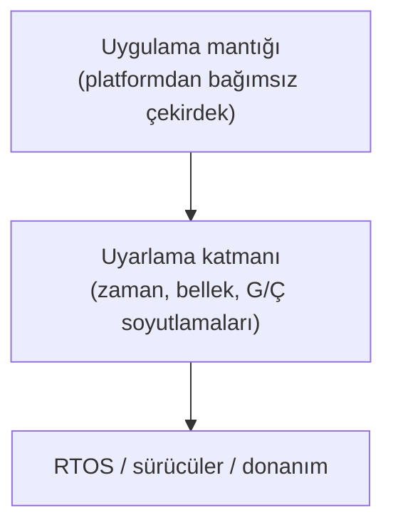

# 24. Yazılım Yeniden Kullanımı

Yazılım yeniden kullanımı, başka bir proje için geliştirilmiş ya da hazır alınmış bir
bileşeni kodu ve kanıtıyla birlikte yeni bir sisteme taşımaktır; ancak bir yerde
doğrulanmış olmak, yeni bağlamda kendiliğinden sertifikasyon kredisi sağlamaz. Bu bölüm
bağlamın kanıtı neden geçersiz kılabildiğini, yeniden kullanılabilir bileşenin nasıl
tasarlandığını, önceden geliştirilmiş ve ticari hazır yazılımın boşluk analiziyle nasıl
değerlendirildiğini ve ürün servis geçmişinin ne zaman kredi sağladığını anlatır.

## Bağlam neden belirleyicidir?

Doğrulama kanıtı koda değil, kodun belirli bir bağlamdaki davranışına aittir: belirli bir
işlemcide, belirli bir derleyici ve gerçek zamanlı işletim sistemi (real-time operating
system, RTOS) ile, belirli arayüzlerin arkasında, belirli bir girdi aralığı ve yazılım
seviyesi (software level) için üretilmiştir. Bileşen başka bir projede kusursuz çalışmış
olabilir; ama bu koşullardan biri değiştiğinde kanıtın o koşula dayanan kısmı da
geçerliliğini yitirir. Yeniden kullanım kararı bu yüzden üç soruyla başlar: bileşen hangi
bağlamda ve hangi varsayımlarla doğrulanmıştı, yeni sistemde bunlardan hangileri
değişiyor ve değişenin dokunduğu kanıt nasıl yeniden üretilecek?

Aşağıdaki tablo en sık değişen bağlam boyutlarını ve her birinin sarstığı kanıtı özetler.

| Bağlam boyutu | Neden önemlidir? | Yeniden ele alınan kanıt |
|---|---|---|
| İşlemci, derleyici ve derleme seçenekleri | Çalıştırılabilir nesne kodu değişir; kayan nokta, hizalama ve eniyileme davranışı farklılaşabilir | Testlerin yeni hedefte yeniden koşulması; yığın (stack) ve en kötü durum yürütme süresi (worst-case execution time, WCET) analizleri; Seviye A'da derleyicinin ürettiği ve kaynak koda doğrudan izlenemeyen ek kodun doğrulanması |
| RTOS ve sürücüler | Çizelgeleme, kesme ve bellek hizmetlerinin davranışı ve süresi değişir | Uyarlama katmanının doğrulaması; donanım-yazılım entegrasyon testleri |
| Arayüzler | Birim, ölçek, değer aralığı, güncellenme hızı ve geçersizlik işareti farklı olabilir | Arayüz gereksinimleri; veri ve kontrol bağlaşımı (data and control coupling) analizi; entegrasyon testleri |
| Zamanlama | Çağrı sıklığı, işlemci yükü ve süre sınırları değişir | WCET ve çizelgelenebilirlik (schedulability) analizi; zamana bağlı test durumları (test case) |
| Girdi aralığı ve çalışma modları | Yeni sistem, bileşeni daha önce hiç görmediği değerlere ya da modlara itebilir | Normal aralık ve gürbüzlük (robustness) testlerinin kapsadığı aralık; gereksinimlerdeki aralık varsayımları |
| Yazılım seviyesi | Daha yüksek seviye ek hedef ve daha fazla hedefte bağımsızlık getirir | Eksik hedeflerin kanıtı, ör. karar kapsama ya da değiştirilmiş koşul/karar kapsama (modified condition/decision coverage, MC/DC); bağımsızlık kayıtları |
| Konfigürasyon | Etkin özellik kümesi ve parametre verisi farklıdır; eski projede çalışan kod yeni projede kullanılmayabilir | Devre dışı bırakılmış kod (deactivated code) analizi; konfigürasyon ve parametre verisinin doğrulanması |

Satırların ortak noktası şudur: değişen şey çoğu zaman kod değildir. Kaynak kod aynı
kaldığı için "hiçbir şey değişmedi" demek kolaydır; oysa kanıtın dayandığı varsayım
değişmiştir ve bu varsayım hiçbir yerde yazılı değilse farkı kimse görmez.

:::note[Ariane 5, 1996]
Ariane 5'in ilk uçuşu, kalkıştan yaklaşık 40 saniye sonra roketin rotasından sapıp
parçalanmasıyla sonuçlandı. Soruşturma kurulunun kamuya açık raporuna göre ataletsel
referans sisteminin yazılımı büyük ölçüde Ariane 4'ten devralınmıştı. Yeni roketin uçuş
profili daha yüksek yatay hız değerleri üretti; bu hıza bağlı bir büyüklük 64 bit kayan
noktadan 16 bit işaretli tam sayıya dönüştürülürken taştı. İşlenmeyen istisna önce yedek
birimi, ardından asıl birimi durdurdu, çünkü ikisinde de aynı yazılım koşuyordu. Taşan
hesabın ait olduğu işlev Ariane 5'te kalkıştan sonra gerekli bile değildi. Bu bir
havacılık projesi değildir, ama ders aynıdır: kod aynıydı, bağlam (uçuş profili)
farklıydı ve "bu değer taşmaz" varsayımı yeni bağlam için yeniden sorgulanmamıştı.
:::

## Yeniden kullanılabilir bileşen tasarlamak

Yeniden kullanım çoğu zaman sonradan akla gelir: proje biter, bir sonraki projede
"aynı kodu alalım" denir ve o noktada kodun ne kadar projeye özgü varsayımla dolu
olduğu ortaya çıkar. Gerçek yeniden kullanılabilirlik, bileşen daha ilk projede
yazılırken verilen tasarım kararlarıyla kazanılır. Üç temel ilke öne çıkar: dar ve
belgeli arayüzler, platform bağımlılıklarının yalıtılması ve kanıt paketinin
bileşenle birlikte taşınabilir olması.

### Dar ve belgeli arayüzler

Bir bileşenin arayüzü ne kadar geniş ve örtükse, yeni bir bağlama taşındığında
kırılma olasılığı o kadar yüksektir. Yeniden kullanılabilir bir bileşende:

- Arayüz, az sayıda ve açıkça tanımlı fonksiyondan oluşur; bileşenin iç veri
  yapılarına doğrudan erişim verilmez.
- Global değişken üzerinden örtük veri alışverişi yapılmaz; tüm girdi ve çıktılar
  fonksiyon parametreleri veya tanımlı mesaj yapıları üzerinden akar.
- Arayüzün davranışı düşük seviyeli gereksinimlerde tanımlıdır: değer aralıkları,
  birimler, hata durumlarında dönen kodlar, çağrı sıklığı ve zamanlama beklentileri
  yazılıdır.
- Arayüz sözleşmesine girmeyen davranışlar (örneğin iç tamponların boyutu) belgede
  "garanti edilmez" olarak işaretlenir; yeni proje bunlara dayanamaz.

Bu disiplinin sertifikasyon açısından karşılığı doğrudan izlenebilirliktir: arayüz
gereksinim olarak yazılmışsa, yeni projede "bu bileşenden ne bekliyoruz?" sorusunun
cevabı belgededir ve doğrulama kanıtı bu gereksinimlere bağlıdır.

### Platform bağımlılıklarının yalıtılması

Bileşenin işlevsel çekirdeği ile donanıma, RTOS'a veya derleyiciye bağımlı kısımları
ayrı katmanlarda tutulmalıdır. Yaygın yaklaşım, platforma dokunan her şeyi ince bir
uyarlama katmanının (adaptation layer) arkasına almaktır:


```mermaid
flowchart TB
  A["Uygulama mantığı<br/>(platformdan bağımsız çekirdek)"] --> B["Uyarlama katmanı<br/>(zaman, bellek, G/Ç soyutlamaları)"]
  B --> C["RTOS / sürücüler / donanım"]
```

C dilinde bu ayrım, çekirdeğin yalnızca soyut bir arayüz başlığına bağımlı
olmasıyla sağlanır. Başlık dosyası arayüz sözleşmesini taşır:

```c
/* platform_zaman.h — çekirdeğin gördüğü tek zaman arayüzü */
#ifndef PLATFORM_ZAMAN_H
#define PLATFORM_ZAMAN_H

#include <stdint.h>

/* Serbest koşan 32 bit sayaç: en büyük değerden sonra sıfırdan devam eder. */
typedef uint32_t pz_tik_t;

pz_tik_t pz_simdiki_tik(void);            /* monotonik sayacın anlık değeri */
pz_tik_t pz_ms_den_tik(uint32_t sure_ms); /* milisaniye -> sayaç birimi     */

#endif /* PLATFORM_ZAMAN_H */
```

Çekirdek kod RTOS'un zaman hizmetini değil, bu arayüzü çağırır:

```c
/* filtre.c — çekirdek: RTOS API'sini değil, soyut arayüzü çağırır */
#include <stdbool.h>
#include <stdint.h>
#include "platform_zaman.h"

#define FILTRE_PERIYODU_MS (25U)

void filtre_guncelle(int32_t yeni_deger); /* filtre denklemi; burada gösterilmiyor */

static pz_tik_t son_ornek_tik; /* son güncellemenin zaman damgası */

bool filtre_adimi(int32_t yeni_deger)
{
    const pz_tik_t simdi = pz_simdiki_tik();
    bool guncellendi = false;

    /* İşaretsiz çıkarma 2^32'ye göre modülerdir: sayaç taşıp sıfırdan
       devam etse de geçen süre doğru hesaplanır. */
    if ((pz_tik_t)(simdi - son_ornek_tik) >= pz_ms_den_tik(FILTRE_PERIYODU_MS)) {
        filtre_guncelle(yeni_deger);
        son_ornek_tik = simdi;
        guncellendi = true;
    }

    return guncellendi;
}
```

Sayaç tipi bilerek sabit genişlikli seçilmiştir. Genişliği platforma göre değişen bir
tipte sayacın taşma noktası, dolayısıyla süre hesabının doğruluğu derleyiciye bağlı
kalırdı. "Sayaç 32 bitin tamamını kullanır" koşulu artık arayüz sözleşmesinin
parçasıdır ve her yeni uyarlama katmanı bunu sağlamak zorundadır.

Yeni platforma taşımada `platform_zaman.c` gibi uyarlama dosyaları yeniden yazılır ve
kendi gereksinimlerine göre doğrulanır. Çekirdeğin gereksinimleri, tasarımı, test
durumları ve beklenen sonuçları büyük ölçüde olduğu gibi kalır; **test sonuçları ise
kalmaz**. İşlemci ya da derleyici değiştiğinde çekirdeğin çalıştırılabilir nesne kodu da
değişir: gereksinim tabanlı testler yeni hedefte yeniden koşulur, yığın kullanımı ve en
kötü durum yürütme süresi gibi derleyiciye ve işlemciye bağlı analizler yenilenir.
Yalıtımın kazancı işi sıfırlamak değil, öngörülebilir kılmaktır: neyin yeniden
yazılacağı, neyin yalnızca yeniden koşulacağı baştan bellidir.

### Kanıt paketinin taşınabilirliği

Aviyonikte yeniden kullanılan şey yalnızca kod değil, koda eşlik eden yaşam döngüsü
verisidir. Bileşenle birlikte taşınabilir bir kanıt paketi şunları içerir:

- bileşene ait gereksinimler ve tasarım verisi (sistem belgelerinden ayrıştırılmış,
  kendi başına anlamlı),
- test durumları, test prosedürleri ve beklenen sonuçlar; mümkünse hedef
  donanımdan bağımsız çalıştırılabilir biçimde,
- yapısal kapsam analizi sonuçları ve kapsam boşluklarının gerekçeleri,
- bileşenin hangi varsayımlar altında doğrulandığını listeleyen bir kullanım
  bildirimi: hedef işlemci, derleyici ve seçenekleri, yığın/bellek bütçesi, çağrı
  bağlamı, yazılım seviyesi,
- açık problem raporları (problem report) ve bilinen sınırlamalar.

Kanıt proje belgelerinin içine dağılmış hâldeyse, bileşen teknik olarak taşınsa bile
sertifikasyon kredisi taşınamaz ve doğrulama büyük ölçüde tekrarlanır. Bu nedenle
"bileşen sınırında paketlenmiş kanıt", yeniden kullanılabilir tasarımın kod kadar
önemli bir parçasıdır.

Bu fikrin otorite rehberindeki karşılığı, FAA'nın AC 20-148 ile tanımladığı yeniden
kullanılabilir yazılım bileşeni (reusable software component, RSC) yaklaşımıdır. Rehber
üç rol ayırır: bileşeni geliştiren, onu kendi yazılımına katan entegratör (integrator)
ve sertifikasyon başvurusunu yapan başvuru sahibi (applicant). Geliştirici, bileşenin
kullanıldığı gerçek bir sertifikasyon projesi kapsamında otoriteden kabul alır ve
entegratöre şunu açıkça bildirir: hangi hedefler (objective) tümüyle karşılanmıştır, hangileri
kısmen karşılanmıştır, hangileri entegratöre kalmıştır ve bileşen hangi varsayım ve
kısıtlarla doğrulanmıştır. Sonraki projeler bu krediyi, bileşen değişmediği ve
bildirilen kısıtların içinde kalındığı ölçüde kullanır; entegrasyon, hedef donanımdaki
doğrulama ve sistem düzeyindeki uyum her projede yeniden gösterilir. Kabul bir ürün
onayı değildir; rehber DO-178B döneminde yazılmıştır ve başka otoritelerin bu kabulü
nasıl değerlendireceği programa göre değişir. Yaklaşımın hazır RTOS paketlerindeki
uygulaması
[20. Gerçek Zamanlı İşletim Sistemleri](20-gercek-zamanli-isletim-sistemleri.md)
bölümünde anlatılır.

## Önceden geliştirilmiş yazılımın kullanımı

Önceden geliştirilmiş yazılım (previously developed software, PDS), yeni projeden
önce var olan ve olduğu gibi ya da değiştirilerek alınmak istenen yazılımı
tanımlar. Daha önce sertifiye edilmiş bir uçaktaki uygulama, şirket içi bir
kütüphane, başka bir sektör için yazılmış bir protokol yığını veya ticari hazır
yazılım (commercial off-the-shelf, COTS) — hepsi bu şemsiyenin altındadır.
Değerlendirmenin özü tek sorudur: **mevcut kanıt, yeni sistemin gerektirdiği
güvenceyi hangi ölçüde karşılıyor?**

DO-178C konuyu ek hususlar arasında (12.1) ele alır ve yeniden kullanımın biçimine göre
farklı durumlar ayırır: yazılımın değiştirilmesi, yazılımın başka bir hava aracına ya da
kuruluma alınması, uygulama ya da geliştirme ortamının değişmesi (yeni işlemci, derleyici
ya da birlikte entegre edilen başka yazılım) ve eldeki yaşam döngüsü verisi yeni
kullanımın hedeflerini karşılamadığında geliştirme temel çizgisinin (baseline)
yükseltilmesi. Yeni kurulum için ölçüt açıktır: sistem emniyet değerlendirme süreci
kurulumu değerlendirir; yazılım seviyesi ve sertifikasyon temeli (certification basis)
öncekiyle aynıysa, işlev ve ortam da değişmiyorsa standart ek çaba istemez. Aynı kısım,
konfigürasyon yönetimi ve kalite güvencesinin yeniden kullanılan yazılımı da kapsamasını
ister. Konfigürasyon yönetimi, bileşenin önceki uygulamadaki ürün ve verisinden yenisine
izlenebilirliği kurar ve birden çok uygulamada kullanılan bileşenin problem raporlarıyla
değişikliklerinin ortak izlenmesini sağlar. Kalite güvencesi, bileşenin yeni kullanımın
yazılım seviyesinin gereklerini karşıladığına ve süreçlerde yapılan değişikliklerin
planlara yazıldığına güvence verir. Hangi durum söz konusu olursa olsun, önceden
geliştirilmiş yazılımı kullanma niyeti ve boşlukları kapatma stratejisi yazılım
sertifikasyon planında (Plan for Software Aspects of Certification, PSAC) bildirilir;
[SW SOI-1](../kaynaklar/soi-1.md) kontrol listesi bunu planlama denetiminin soruları
arasında sayar. Yazılıma ait çözülmemiş problem raporlarının etkisi de değerlendirilir.

Yeniden kullanım öteki veride de iz bırakır: tasarım tanımı devralınan bileşenin alındığı
temel çizgiyi belirtir, yazılım konfigürasyon indeksi (Software Configuration Index, SCI)
üründeki önceden geliştirilmiş yazılımı tanımlar, yazılım uygunluk gözden geçirmesi de
güncel temel çizginin önceki temel çizgiye ve onaylı değişikliklere izlenebildiğini arar.

### Değerlendirmenin adımları

Pratikte PDS değerlendirmesi bir boşluk analizi (gap analysis) olarak yürütülür:

1. **Yeni bağlamdaki yazılım seviyesi belirlenir.** Sistem emniyet değerlendirme süreci (system
   safety assessment process), yazılımın yeni sistemdeki yazılım seviyesini belirler; bu
   seviye eski projedekinden yüksek olabilir.
2. **Eldeki kanıt envanteri çıkarılır.** Planlar, gereksinimler, tasarım, testler,
   kapsam sonuçları, konfigürasyon kayıtları ve problem raporları toplanır.
3. **Boşluklar listelenir.** Hangi hedefler mevcut kanıtla karşılanıyor, hangileri
   eksik? Örneğin eski proje Seviye C ise ve yeni kullanım Seviye B gerektiriyorsa,
   karar kapsama kanıtı büyük olasılıkla eksiktir. Hedef boşluklarına bağlam boşlukları
   eklenir: bölümün başındaki tablonun her satırı için eski ve yeni değer yan yana
   yazılır.
4. **Kullanılmayan işlevler ele alınır.** Bileşenin yeni projede kullanılmayan işlevleri
   imajda kalacaksa devre dışı bırakılmış kod olarak yönetilir: gereksinime izlenebilir
   tutulur, planlarda beyan edilir ve istem dışı etkinleşemeyeceği gösterilir. Ayrıntısı
   [17. Kapsanmayan Kodlar: Ölü, Gereksiz ve Devre Dışı Bırakılmış Kodlar](17-kapsanmayan-kodlar.md)
   bölümündedir.
5. **Devralınan problem raporları yeniden değerlendirilir.** Önceki projede açık
   bırakılmış raporlar yeni sistemin arıza durumlarına göre yeniden sınıflandırılır;
   eski bağlamda zararsız sayılan bir kısıt yeni bağlamda emniyeti etkileyebilir.
   Sınıflar [9. Yazılım Doğrulama](../03-do178c-ile-gelistirme/09-yazilim-dogrulama.md)
   bölümünde tanımlıdır.
6. **Boşluk kapatma stratejisi seçilir ve PSAC'a yazılır.** Eksik analiz ve testler
   tamamlanır, gerekiyorsa [25. Tersine Mühendislik](25-tersine-muhendislik.md)
   bölümünde anlatılan yolla gereksinim ve tasarım verisi üretilir ya da ürün servis
   geçmişi gibi alternatif güvence yolları önerilir. Strateji otoriteyle erkenden
   konuşulur; bu görüşmenin nasıl yürütüldüğü
   [12. Sertifikasyon İrtibatı](../03-do178c-ile-gelistirme/12-sertifikasyon-irtibati.md)
   bölümündedir.
7. **Değişiklik etkisi ayrıca ele alınır.** PDS yeni projede değiştirilecekse, yeniden
   doğrulama kapsamı değişiklik etki analiziyle (change impact analysis) belirlenir;
   analizin taradığı eksenler
   [10. Yazılım Konfigürasyon Yönetimi](../03-do178c-ile-gelistirme/10-yazilim-konfigurasyon-yonetimi.md)
   bölümündedir.

### Tipik senaryolar

| Senaryo | Ana zorluk | Tipik yaklaşım |
|---|---|---|
| Aynı seviyede, değişmeden taşıma | Bağlam farkı (işlemci, derleyici, RTOS, arayüzler) | Değişen bağlam boyutuna göre: testlerin yeni hedefte yeniden koşulması, entegrasyon testleri, zamanlama ve yığın analizinin yenilenmesi |
| Değiştirilerek taşıma | Değişikliğin değişmeyen kısma etkisi | Değişiklik etki analizi + etkilenen kısmın yeniden doğrulanması |
| Daha yüksek seviyeye taşıma | Eksik hedefler (ör. MC/DC, bağımsızlık) | Boşluk analizi + eksik doğrulamanın tamamlanması |
| Önceki DO-178 sürümüyle (ör. DO-178B) onaylanmış yazılım | İlk onayın yeni kurulum için yeterliliği | Servis kaydının ve açık problem raporlarının değerlendirilmesi; seviye yeterliyse ilk onaya dayanma, değilse temel çizginin yükseltilmesi |
| DO-178 ailesi dışında geliştirilmiş yazılım | Yaşam döngüsü verisi hiç yok ya da farklı biçimde | Tersine mühendislik, yeniden belgeleme, kapsamlı yeniden doğrulama |
| COTS yazılım | Kaynak koda ve geliştirme sürecine sınırlı erişim | Tedarikçi verisi + ek doğrulama + koruyucu mimari (sarmalayıcı, izleme, bölümleme) |

### Önceki DO-178 sürümleriyle onaylanmış yazılım

Sahada sık karşılaşılan bir yeniden kullanım biçimi, DO-178B ya da daha eski bir sürümle
onaylanmış ve yıllardır uçan bir yazılımın bugün değiştirilmesi ya da yeni bir kuruluma
alınmasıdır. AC 20-115D ve AMC 20-115D bu yazılımı eski yazılım (legacy software) adıyla
ayrıca ele alır. Yaklaşımın özü üç sorudur:

- **Servis kaydı temiz mi?** Yazılımın önceki kurulumlardaki kullanım geçmişi
  değerlendirilir. Emniyetle ilgili bir servis sorunu, yazılıma bağlanan bir uçuşa
  elverişlilik direktifi (airworthiness directive) ya da yeni kurulumda emniyeti
  etkileyebilecek açık problem raporu varsa, bilinen yazılım ve süreç eksiklikleri
  değişiklikten ya da yeniden kullanımdan önce giderilir.
- **Yazılım seviyesi yeni kurulum için yeterli mi?** Yeterliyse, servis kaydı temizse ve
  yazılım değişmiyorsa ilk onay yeni kurulumun dayanağı olabilir. Yetersizse geliştirme
  temel çizgisi yükseltilir; yani eksik hedeflerin kanıtı tamamlanır.
- **Değişiklik hangi süreçle yapılacak?** Rehber, ilk onayda esas alınan DO-178 sürümüyle
  ve mevcut süreçlerle devam etmeye koşullu olarak izin verir: planlar, süreçler ve
  yaşam döngüsü ortamı hâlâ sürdürülüyor olmalıdır; model tabanlı geliştirme, nesne
  yönelimli teknoloji ya da biçimsel yöntemler kullanılacaksa bunları içeren süreçler
  otoritece önceki bir sertifikasyon projesinde kabul edilmiş olmalıdır. Bu yolda
  yazılımın DO-178C'yi karşıladığı beyan edilmez; uyum ilk onayın esas aldığı sürüme
  göre kalır. Koşullar sağlanmıyorsa ya da DO-178C'ye uyum beyan edilecekse geliştirme
  temel çizgisi DO-178C'ye göre yükseltilir; otoritenin daha önce kabul etmediği bir
  teknik giriyorsa ilgili teknoloji eki de devreye girer. Hangi yol seçilirse seçilsin
  yeniden doğrulamanın kapsamını değişiklik etki analizi belirler.

Koşulların tam listesi rehber metnindedir ve projeye nasıl uygulanacağı otoriteyle
konuşulur. Akılda tutulacak nokta şudur: ilk onay bir hak değil, bir başlangıç
noktasıdır. Belirli bir kurulum ve o günün bilinen problemleri için verilmiştir; aradan
geçen yılların servis kaydı da artık değerlendirmenin parçasıdır.

### DO-178 dışı ve COTS yazılımın özel durumu

Otomotiv, savunma veya endüstriyel standartlara göre geliştirilmiş yazılım kaliteli
olabilir; ancak hedefleri ve kanıt biçimi farklıdır. "ISO 26262 ASIL D'ye göre
geliştirildi" gibi bir ifade, DO-178C hedeflerinin otomatik karşılandığı anlamına
gelmez; eşleme tek tek hedef düzeyinde yapılmalı ve boşluklar kapatılmalıdır.

DO-178C, COTS yazılıma ayrı bir kolaylık tanımaz (2.5.3): hava aracı sistemine giren COTS
yazılım da standardın hedeflerini karşılar, yaşam döngüsü verisindeki eksikler
tamamlanır; standart bunun için temel çizginin yükseltilmesine ve ürün servis geçmişine
işaret eder. Uygulamada sorun genellikle erişimdir: kaynak kod, geliştirme kayıtları ve
problem geçmişi tedarikçinin elindedir. Bu durumda yaygın çözümler şunlardır:

- tedarikçiden sertifikasyon veri paketi temin etmek (bazı RTOS ve kütüphane
  tedarikçileri bunu ürün olarak sunar; pakete sorulacak sorular
  [Ek C: Gerçek Zamanlı İşletim Sistemi Seçiminde Sorulacak Sorular](../06-ekler/03-ek-c-rtos-secim-sorulari.md)
  içindedir),
- COTS bileşeni emniyet etkisi düşük işlevlerle sınırlamak, yani daha düşük bir yazılım
  seviyesinde tutmak ve kritik işlevleri kendi geliştirilen kodda bırakmak,
- [21. Yazılım Bölümlemesi](21-yazilim-bolumlemesi.md) bölümünde anlatılan bölümleme ve
  izleme (monitoring) gibi mimari önlemlerle COTS bileşenin arıza etkisini sınırlamak.

Son iki madde birbirine bağlıdır: bileşene daha düşük bir seviye atanması bir beyanla
olmaz; sistem emniyet değerlendirme sürecinin mimariye bakarak verdiği bir karardır ve
bileşenin arızasının kritik işlevlere yayılamayacağının gösterilmesine dayanır.

Deneyim şunu gösterir: DO-178 dışı bir yazılımı yüksek seviyeye taşımanın maliyeti,
çoğu zaman aynı işlevi baştan geliştirmeye yaklaşır. Bu nedenle PDS kararı, proje
başında dürüst bir boşluk analiziyle verilmeli; "kod hazır, ucuz olur" varsayımıyla
plan yapılmamalıdır.

## Ürün servis geçmişi

Ürün servis geçmişi (product service history), bir yazılımın gerçek kullanımda
geçirdiği sürenin ve bu süre boyunca toplanan problem verisinin, eksik geliştirme
kanıtının yerine kısmi güvence olarak öne sürülmesidir. Fikir cazip görünür:
"Bu yazılım on yıldır sahada sorunsuz çalışıyor, demek ki güvenilir." Ancak bu
argümanın sertifikasyonda kabul görmesi, sanıldığından çok daha sıkı koşullara
bağlıdır.

DO-178C servis geçmişini alternatif yöntemler arasında (12.3.4) ele alır: geçmişin yeni
kullanımla ilgisi, birikmiş sürenin yeterliliği, servis sırasında bulunan problemlerin
toplanıp analiz edilmesi ve PSAC'ta bildirilecek bilgiler ayrı ayrı değerlendirilir.
Değerlendirme yalnızca yazılım ekibinin işi de değildir: servis geçmişinin nasıl
kullanıldığı ve ne gösterdiği, sistem emniyet değerlendirme süreci dahil sistem
süreçlerinin önünden geçer ve otoriteye sunulur. Konunun kamuya açık ayrıntılı bir
kaynağı, FAA'nın DO-178B döneminde yayımladığı Software Service History Handbook'tur
(DOT/FAA/AR-01/116).

### Kredinin dayanması gereken koşullar

Standart, yöntemin kabul edilebilirliğini bir dizi etkene bağlar: servis ortamının
ilgililiği, problem raporlamanın etkinliği, yazılımın konfigürasyon yönetimi ile
kararlılığı ve olgunluğu, geçmişin uzunluğu ve gerçekleşen hata oranı, değişikliklerin
etkisi. Bu bölüm bunları dört koşulda toplar; dördü aynı ağırlıkta değildir. Uygulamada
ilk üçü ön koşul gibi işler: biri eksikse geçmişin neyi kanıtladığı söylenemez ve kredi
sağlanmaz. Dördüncüsü kredinin ölçüsünü belirler: yetersizse kredi kısmi kalır ve boşluk
ek doğrulamayla kapatılır.

- **Benzer kullanım bağlamı.** Geçmişteki kullanım ile yeni kullanım; işlev,
  arayüzler, çalışma modları ve ortam açısından karşılaştırılabilir olmalıdır.
  Yer sisteminde çalışmış bir yazılımın geçmişi, uçuş bağlamı için doğrudan
  kredi sağlamaz. Ortamlar yalnızca kısmen farklıysa standart, farkın hedef ortamda ek
  doğrulamayla kapatılmasını ister; fark büyüdükçe gereken geçmiş de büyür.
- **Güvenilir problem kayıtları.** Servis dönemi boyunca hataların sistematik
  olarak raporlandığı, sınıflandırıldığı ve kapatıldığı gösterilebilmelidir.
  "Hata kaydı yok" ifadesi, kayıt sisteminin hiç işlemediği anlamına da
  gelebilir; kanıt değeri ancak işleyen bir raporlama süreciyle doğar.
- **Konfigürasyon kararlılığı.** Kredi talep edilen sürüm ile sahada çalışan
  sürümler arasındaki ilişki konfigürasyon yönetimi kayıtlarıyla izlenebilir
  olmalıdır. Servis dönemi boyunca sık ve izlenemeyen değişiklik yapılmışsa,
  hangi geçmişin hangi sürüme ait olduğu belirsizleşir ve argüman çöker.
- **Yeterli ve ilgili süre.** Süre, yazılımın çalışma biçimine uyan bir ölçüyle verilir:
  uçuş boyunca sürekli çalışan yazılımda uçuş saati, istek üzerine çalışan yazılımda
  istek sayısı. Bu ölçü filo büyüklüğü ve çalışma profiliyle birlikte okunur. Ne
  kadarının yeteceğini standart dört şeye bağlar: yeni kullanımın yazılım seviyesi ve
  sistemin emniyet hedefleri, servis ortamı ile yeni ortam arasındaki farklar, servis
  geçmişiyle karşılanmak istenen hedefler ve o hedefler için eldeki öteki kanıt; istenen
  kredi büyüdükçe gösterilmesi gereken geçmiş de büyür. Serviste gözlenen hata oranı
  (error rate) PSAC'ta öngörülenden yüksek çıkarsa hatalar analiz edilip otoriteyle
  gözden geçirilir; sürenin uzatılması gerekebilir ya da servis geçmişi bir yol olmaktan
  çıkabilir. Bu, yazılıma sayısal bir arıza olasılığı atamak demek değildir; olasılık
  hedefi sistem düzeyindeki arıza durumuna aittir. Nadiren tetiklenen çalışma modları
  için "toplam saat" tek başına yanıltıcıdır: yazılım yıllarca çalışmış ama kritik mod
  hiç devreye girmemiş olabilir.

### Değerlendirmede yaşanan zorluklar

- Eski kullanım verisi genellikle başka bir kuruluşun elindedir; erişim ve veri
  kalitesi sözleşmesel engellere takılır.
- Sahadaki hataların hangilerinin yazılım kaynaklı olduğu çoğu zaman net
  ayrıştırılmamıştır; donanım ve operasyon kaynaklı olaylarla karışır.
- Servis geçmişi yalnızca gözlenen davranışı kanıtlar; hiç tetiklenmemiş girdi
  kombinasyonları hakkında bilgi vermez. Bu yüzden yapısal kapsam gibi hedeflerin
  yerini tam olarak tutamaz.
- Yazılım yeni kullanım için değiştirilecekse, değişen kısım için geçmiş kredi
  sağlamaz; o kısım olağan yolla doğrulanır.
- Kredi hesabı özneldir: "kaç saat yeterlidir?" sorusunun standart bir cevabı
  yoktur. Yaklaşım PSAC'ta tanımlanır ve sertifikasyon otoritesiyle erken ve açık
  mutabakat gerekir. PSAC'a yalnızca niyet değil, hesabın kuralları da yazılır: gereken
  geçmiş miktarı ve gerekçesi, neyin hata sayılacağı, kabul edilebilir hata oranı,
  geçmişi geçersiz kılacak problem ölçütü ve servis geçmişiyle karşılanacak hedefler.

Bu nedenle pratikte servis geçmişi, tek başına bir güvence yolu olmaktan çok,
boşluk analizinde belirli hedefler için **destekleyici** bir argüman olarak
kullanılır ve hemen her zaman ek doğrulama faaliyetleriyle birleştirilir.
Değerlendirmeye başlarken sorulması gereken soruların derli toplu bir listesi
[Ek D: Yazılım Servis Geçmişi Soruları](../06-ekler/04-ek-d-servis-gecmisi-sorulari.md)
sayfasında verilmiştir; PSAC'ı yazmadan önce bu listeyle dürüst bir ön eleme yapmak,
aylar sonra reddedilecek bir argümana yatırım yapmaktan çok daha ucuzdur.

## Bu bölümden akılda kalması gerekenler

- Doğrulama kanıtı bağlama aittir: işlemci, derleyici, RTOS, arayüz, zamanlama, girdi
  aralığı, yazılım seviyesi ya da konfigürasyon değiştiğinde kanıtın o varsayıma
  dayanan kısmı yeniden üretilir. Daha önce kullanılmış olmak tek başına yeterli
  değildir.
- Yeniden kullanılabilirlik sonradan eklenmez; dar arayüzler, platform
  yalıtımı ve bileşen sınırında paketlenmiş kanıtla baştan tasarlanır.
- Platform yalıtımı gereksinimleri, tasarımı ve test durumlarını korur; yeni işlemci ya
  da derleyicide testler yine yeniden koşulur, yığın ve zamanlama analizleri yenilenir.
- PDS değerlendirmesi bir boşluk analizidir: strateji PSAC'ta bildirilir, kullanılmayan
  işlevler ve devralınan açık problem raporları analizin parçasıdır.
- Önceki bir DO-178 sürümüyle alınmış onay başlangıç noktasıdır; servis kaydı ve yazılım
  seviyesinin yeni kurulum için yeterliliği yeniden değerlendirilir.
- DO-178 dışı veya COTS yazılımda boşluğu kapatmanın maliyeti yeniden geliştirmeye
  yaklaşabilir.
- Servis geçmişinde benzer bağlam, güvenilir problem kayıtları ve konfigürasyon
  kararlılığı ön koşuldur; süre ve kapsam kredinin ölçüsünü belirler ve hesabın kuralları
  PSAC'ta otoriteyle kararlaştırılır. Çoğunlukla destekleyici bir argümandır.
